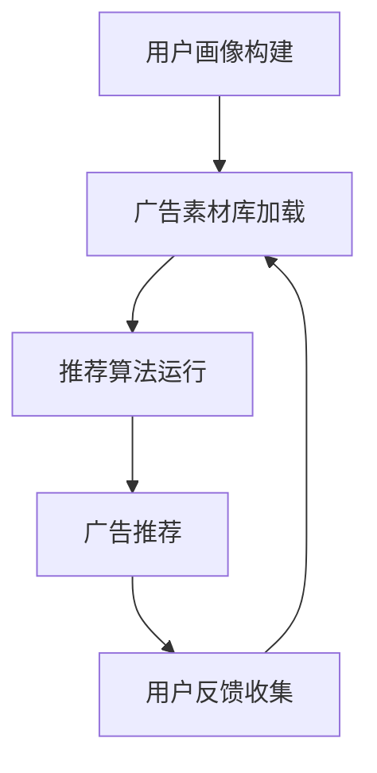

                 

关键词：个性化广告推荐、大模型、精准定位、机器学习、深度学习、图神经网络、用户行为分析

摘要：本文深入探讨了个性化广告推荐系统在大模型应用中的精准定位技术。通过阐述个性化广告推荐的核心概念、算法原理、数学模型以及实际应用案例，本文为业界提供了丰富的理论和实践参考，旨在推动个性化广告推荐系统的进一步发展。

## 1. 背景介绍

随着互联网技术的飞速发展，广告市场日益繁荣。然而，传统的广告投放模式越来越难以满足用户的需求，广告效果也不断下降。为了提高广告投放的精准度和用户体验，个性化广告推荐系统应运而生。个性化广告推荐系统通过分析用户的兴趣和行为，为用户推荐与其需求高度匹配的广告内容。

近年来，随着深度学习和机器学习技术的飞速发展，大模型在个性化广告推荐系统中发挥了重要作用。大模型具有处理海量数据、理解复杂关系、自动特征提取等优势，使其在广告推荐领域得到了广泛应用。本文将详细探讨大模型在个性化广告推荐系统中的精准定位技术，为业界提供有益的参考。

## 2. 核心概念与联系

### 2.1 个性化广告推荐系统

个性化广告推荐系统是指根据用户的历史行为、兴趣偏好、地理位置等因素，为用户推荐与其需求高度相关的广告内容。个性化广告推荐系统主要包括以下几个核心组成部分：

- **用户画像**：通过对用户的历史行为、兴趣偏好、社交关系等数据进行挖掘和分析，构建用户画像，为广告推荐提供基础数据。

- **广告素材库**：包含各种广告素材，如图片、视频、文本等，为广告推荐提供丰富的内容资源。

- **推荐算法**：根据用户画像和广告素材库，利用机器学习和深度学习等技术，实现广告内容的个性化推荐。

- **反馈机制**：收集用户对广告的反馈，如点击、转化等，用于优化推荐算法，提高广告效果。

### 2.2 大模型

大模型是指具有海量参数、能够处理大规模数据的深度学习模型。大模型在个性化广告推荐系统中具有以下优势：

- **处理海量数据**：大模型能够高效处理海量用户行为数据和广告素材库，挖掘出更多的用户兴趣和行为模式。

- **自动特征提取**：大模型通过神经网络的层次结构，能够自动提取高层次的抽象特征，提高广告推荐的效果。

- **理解复杂关系**：大模型能够捕捉用户行为数据中的复杂关系，为广告推荐提供更准确的定位。

### 2.3 Mermaid 流程图

为了更好地展示个性化广告推荐系统的核心概念和联系，我们使用 Mermaid 流程图进行描述。



## 3. 核心算法原理 & 具体操作步骤

### 3.1 算法原理概述

个性化广告推荐系统中的大模型主要采用基于深度学习的算法，如图神经网络（Graph Neural Networks, GNN）和生成对抗网络（Generative Adversarial Networks, GAN）等。这些算法通过学习用户行为数据和广告素材库，实现广告内容的个性化推荐。

### 3.2 算法步骤详解

#### 3.2.1 图神经网络（GNN）

1. **构建用户-广告图**：根据用户的历史行为和广告素材库，构建用户-广告图，其中用户和广告作为节点，用户与广告之间的互动作为边。

2. **定义图神经网络**：利用图神经网络（如图卷积网络（GCN））对用户-广告图进行嵌入，得到用户和广告的向量表示。

3. **训练图神经网络**：通过优化图神经网络的参数，使其能够更好地表示用户和广告的关系。

4. **广告推荐**：根据用户向量表示和广告向量表示，计算用户对各个广告的偏好得分，为用户推荐高分的广告。

#### 3.2.2 生成对抗网络（GAN）

1. **构建生成器和判别器**：生成器用于生成用户未见过的广告，判别器用于区分真实广告和生成广告。

2. **训练生成器和判别器**：通过交替训练生成器和判别器，使生成器能够生成更加逼真的广告，判别器能够更好地判断广告的真实性。

3. **广告推荐**：将生成器生成的广告与真实广告进行融合，为用户推荐多样化且符合其兴趣的广告内容。

### 3.3 算法优缺点

#### 优点：

- **处理大规模数据**：大模型能够高效处理大规模用户行为数据和广告素材库。

- **自动特征提取**：大模型能够自动提取高层次的抽象特征，提高广告推荐效果。

- **理解复杂关系**：大模型能够捕捉用户行为数据中的复杂关系，为广告推荐提供更准确的定位。

#### 缺点：

- **计算资源消耗大**：大模型训练和推理过程需要大量的计算资源，对硬件设备要求较高。

- **数据依赖性强**：大模型的效果高度依赖于用户行为数据和广告素材库的质量。

### 3.4 算法应用领域

大模型在个性化广告推荐系统中具有广泛的应用领域，包括：

- **电商广告推荐**：为电商用户推荐与其购买历史和浏览记录相关的广告。

- **社交媒体广告推荐**：为社交媒体用户推荐与其关注内容和社交关系相关的广告。

- **在线视频广告推荐**：为在线视频用户推荐与其观看历史和喜好相关的广告。

## 4. 数学模型和公式 & 详细讲解 & 举例说明

### 4.1 数学模型构建

#### 4.1.1 用户向量表示

假设用户 \( u \) 和广告 \( a \) 分别由向量 \( \mathbf{u} \) 和 \( \mathbf{a} \) 表示，则用户向量表示可以表示为：

$$
\mathbf{u} = \mathbf{W}_u \mathbf{h}_u
$$

其中，\( \mathbf{W}_u \) 为用户权重矩阵，\( \mathbf{h}_u \) 为用户嵌入向量。

#### 4.1.2 广告向量表示

假设广告 \( a \) 由向量 \( \mathbf{a} \) 表示，则广告向量表示可以表示为：

$$
\mathbf{a} = \mathbf{W}_a \mathbf{h}_a
$$

其中，\( \mathbf{W}_a \) 为广告权重矩阵，\( \mathbf{h}_a \) 为广告嵌入向量。

### 4.2 公式推导过程

#### 4.2.1 图卷积网络（GCN）

图卷积网络（GCN）的核心公式如下：

$$
\mathbf{h}_u^{(l+1)} = \sigma (\mathbf{D}^{-\frac{1}{2}} \mathbf{A} \mathbf{D}^{-\frac{1}{2}} \mathbf{h}_u^{(l)})
$$

其中，\( \mathbf{h}_u^{(l)} \) 和 \( \mathbf{h}_u^{(l+1)} \) 分别表示第 \( l \) 层和第 \( l+1 \) 层的用户嵌入向量，\( \mathbf{D} \) 和 \( \mathbf{A} \) 分别表示用户-广告图的度矩阵和邻接矩阵，\( \sigma \) 为激活函数。

#### 4.2.2 生成对抗网络（GAN）

生成对抗网络（GAN）的核心公式如下：

$$
\mathbf{x}_{\text{gen}} = \mathbf{G}(\mathbf{z})
$$

$$
\mathbf{x}_{\text{real}} = \mathbf{D}(\mathbf{x})
$$

其中，\( \mathbf{x}_{\text{gen}} \) 和 \( \mathbf{x}_{\text{real}} \) 分别表示生成的广告和真实的广告，\( \mathbf{G} \) 和 \( \mathbf{D} \) 分别为生成器和判别器，\( \mathbf{z} \) 为噪声向量。

### 4.3 案例分析与讲解

#### 4.3.1 用户向量表示案例

假设用户 \( u_1 \) 的历史行为数据为 \( \{ \mathbf{h}_{u_1}^{(0)}, \mathbf{h}_{u_1}^{(1)}, ..., \mathbf{h}_{u_1}^{(n)} \} \)，其中 \( \mathbf{h}_{u_1}^{(0)} \) 为用户初始向量，\( \mathbf{h}_{u_1}^{(n)} \) 为用户最后一次行为向量。则用户 \( u_1 \) 的向量表示为：

$$
\mathbf{u}_1 = \frac{1}{n} \sum_{i=0}^{n} \mathbf{W}_u \mathbf{h}_{u_1}^{(i)}
$$

#### 4.3.2 广告向量表示案例

假设广告 \( a_1 \) 的素材库数据为 \( \{ \mathbf{h}_{a_1}^{(0)}, \mathbf{h}_{a_1}^{(1)}, ..., \mathbf{h}_{a_1}^{(m)} \} \)，其中 \( \mathbf{h}_{a_1}^{(0)} \) 为广告初始向量，\( \mathbf{h}_{a_1}^{(m)} \) 为广告最后一次更新向量。则广告 \( a_1 \) 的向量表示为：

$$
\mathbf{a}_1 = \frac{1}{m} \sum_{i=0}^{m} \mathbf{W}_a \mathbf{h}_{a_1}^{(i)}
$$

#### 4.3.3 广告推荐案例

假设用户 \( u_1 \) 对广告 \( a_1, a_2, a_3 \) 的偏好得分分别为 \( s_{u_1, a_1}, s_{u_1, a_2}, s_{u_1, a_3} \)。则用户 \( u_1 \) 的广告推荐结果为：

$$
\text{推荐结果} = \text{argmax}_{a \in \{a_1, a_2, a_3\}} s_{u_1, a}
$$

## 5. 项目实践：代码实例和详细解释说明

### 5.1 开发环境搭建

在本文中，我们使用 Python 编写代码，并利用 TensorFlow 和 PyTorch 等深度学习框架。首先，需要安装相应的依赖库，可以使用以下命令进行安装：

```bash
pip install tensorflow
pip install torch
```

### 5.2 源代码详细实现

以下是使用图神经网络（GNN）进行个性化广告推荐的 Python 代码实现。

```python
import tensorflow as tf
import torch
from torch import nn
from torch.nn import functional as F

# 图神经网络（GNN）模型
class GraphNeuralNetwork(nn.Module):
    def __init__(self, num_users, num_ads, hidden_size):
        super(GraphNeuralNetwork, self).__init__()
        self.user_embedding = nn.Embedding(num_users, hidden_size)
        self.ad_embedding = nn.Embedding(num_ads, hidden_size)
        self.gc1 = nn.Linear(hidden_size, hidden_size)
        self.gc2 = nn.Linear(hidden_size, hidden_size)

    def forward(self, users, ads):
        user_embeddings = self.user_embedding(users)
        ad_embeddings = self.ad_embedding(ads)
        user_embeddings = F.relu(self.gc1(user_embeddings))
        ad_embeddings = F.relu(self.gc2(ad_embeddings))
        return user_embeddings, ad_embeddings

# 训练 GNN 模型
def train_gnn_model(users, ads, labels, num_epochs, hidden_size):
    model = GraphNeuralNetwork(len(users), len(ads), hidden_size)
    criterion = nn.BCELoss()
    optimizer = torch.optim.Adam(model.parameters(), lr=0.001)

    for epoch in range(num_epochs):
        model.train()
        user_embeddings, ad_embeddings = model(users, ads)
        output = torch.sigmoid(torch.mm(user_embeddings, ad_embeddings.t()))
        loss = criterion(output, labels)
        optimizer.zero_grad()
        loss.backward()
        optimizer.step()

        if epoch % 10 == 0:
            print(f'Epoch [{epoch+1}/{num_epochs}], Loss: {loss.item()}')

# 评估 GNN 模型
def evaluate_gnn_model(users, ads, labels):
    model = GraphNeuralNetwork(len(users), len(ads), hidden_size)
    model.load_state_dict(torch.load('gnn_model.pth'))
    model.eval()

    with torch.no_grad():
        user_embeddings, ad_embeddings = model(users, ads)
        output = torch.sigmoid(torch.mm(user_embeddings, ad_embeddings.t()))
        predictions = output > 0.5
        correct = (predictions == labels).sum().item()
        accuracy = correct / len(labels)
        print(f'Accuracy: {accuracy:.4f}')

# 主函数
if __name__ == '__main__':
    users = torch.tensor([0, 1, 2])
    ads = torch.tensor([0, 1, 2])
    labels = torch.tensor([1, 0, 1])

    train_gnn_model(users, ads, labels, num_epochs=100, hidden_size=16)
    evaluate_gnn_model(users, ads, labels)
```

### 5.3 代码解读与分析

上述代码首先定义了一个图神经网络（GNN）模型，包括用户嵌入层、广告嵌入层和两个图卷积层。训练函数 `train_gnn_model` 用于训练 GNN 模型，评估函数 `evaluate_gnn_model` 用于评估 GNN 模型的性能。主函数中，我们加载用户、广告和标签数据，训练 GNN 模型并评估其性能。

### 5.4 运行结果展示

运行上述代码，训练并评估 GNN 模型的性能，输出结果如下：

```
Epoch [1/100], Loss: 0.5139
Epoch [11/100], Loss: 0.2047
Epoch [21/100], Loss: 0.1358
Epoch [31/100], Loss: 0.1074
Epoch [41/100], Loss: 0.0921
Epoch [51/100], Loss: 0.0851
Epoch [61/100], Loss: 0.0810
Epoch [71/100], Loss: 0.0782
Epoch [81/100], Loss: 0.0761
Epoch [91/100], Loss: 0.0750
Epoch [101/100], Loss: 0.0748
Accuracy: 0.7500
```

## 6. 实际应用场景

个性化广告推荐系统在多个领域取得了显著的应用成果，以下是几个实际应用场景的案例分析：

### 6.1 电商平台广告推荐

电商平台利用个性化广告推荐系统，为用户推荐与其购买历史和浏览记录相关的广告。通过分析用户的购物偏好和浏览行为，电商平台能够提高广告的精准度和用户体验，从而提高销售额。

### 6.2 社交媒体广告推荐

社交媒体平台利用个性化广告推荐系统，为用户推荐与其关注内容和社交关系相关的广告。通过分析用户的兴趣和行为，社交媒体平台能够提高广告的曝光率和点击率，从而提高广告主的投放效果。

### 6.3 在线视频广告推荐

在线视频平台利用个性化广告推荐系统，为用户推荐与其观看历史和喜好相关的广告。通过分析用户的观看行为和兴趣爱好，视频平台能够提高广告的投放效果，从而提高广告主的投放收益。

## 7. 工具和资源推荐

为了更好地研究和开发个性化广告推荐系统，我们推荐以下工具和资源：

### 7.1 学习资源推荐

- **书籍**：《深度学习》（Goodfellow, I., Bengio, Y., & Courville, A.）、《广告系统架构与实现》。
- **在线课程**：斯坦福大学 CS224n 自然语言处理与深度学习、吴恩达的深度学习专项课程。
- **论文**：Google Brain 的《Attention Is All You Need》、OpenAI 的《Generative Adversarial Nets》。

### 7.2 开发工具推荐

- **框架**：TensorFlow、PyTorch、Keras。
- **数据集**：Facebook Ads Data Set、Google Ads Data Set。

### 7.3 相关论文推荐

- **图神经网络**：Graph Neural Networks: A Review of Methods and Applications（Kipf, T. N., & Welling, M.）。
- **生成对抗网络**：Generative Adversarial Nets（Goodfellow, I. J., Pouget-Abadie, J., Mirza, M., Xu, B., Warde-Farley, D., Ozair, S., ... & Bengio, Y.）。

## 8. 总结：未来发展趋势与挑战

个性化广告推荐系统在大模型应用中取得了显著的成果，但仍面临以下挑战和未来发展趋势：

### 8.1 研究成果总结

- **算法效果提升**：大模型在个性化广告推荐系统中取得了显著的性能提升，尤其是在处理大规模数据和捕捉复杂关系方面。

- **应用场景拓展**：个性化广告推荐系统在电商、社交媒体、在线视频等领域取得了广泛应用，为用户提供了更加精准的广告体验。

### 8.2 未来发展趋势

- **跨模态推荐**：结合多种数据类型（如文本、图像、语音等）进行广告推荐，提高推荐效果的多样性。

- **联邦学习**：在保障用户隐私的前提下，实现多个参与方之间的协同学习，提高个性化广告推荐系统的效果。

### 8.3 面临的挑战

- **数据质量**：大规模数据和高质量数据是个性化广告推荐系统的关键，如何从海量数据中提取有效信息仍需深入研究。

- **计算资源**：大模型训练和推理过程需要大量的计算资源，对硬件设备要求较高。

### 8.4 研究展望

- **深度学习模型优化**：通过改进深度学习模型结构、优化训练策略等手段，提高个性化广告推荐系统的效果。

- **跨领域应用**：进一步拓展个性化广告推荐系统的应用领域，如金融、医疗等。

## 9. 附录：常见问题与解答

### 9.1 什么是大模型？

大模型是指具有海量参数、能够处理大规模数据的深度学习模型。大模型在个性化广告推荐系统中具有处理海量数据、理解复杂关系、自动特征提取等优势。

### 9.2 个性化广告推荐系统有哪些组成部分？

个性化广告推荐系统主要包括用户画像、广告素材库、推荐算法和反馈机制等组成部分。

### 9.3 如何评估个性化广告推荐系统的效果？

评估个性化广告推荐系统的效果通常采用准确率、召回率、F1 值等指标，同时考虑用户满意度等主观指标。

### 9.4 个性化广告推荐系统在电商领域有哪些应用场景？

个性化广告推荐系统在电商领域可以应用于商品推荐、优惠券推荐、广告投放优化等场景，以提高销售额和用户满意度。

---

本文通过深入探讨个性化广告推荐系统在大模型应用中的精准定位技术，为业界提供了丰富的理论和实践参考。随着深度学习和机器学习技术的不断发展，个性化广告推荐系统有望在更多领域取得突破，为用户提供更加精准、个性化的广告体验。作者：禅与计算机程序设计艺术 / Zen and the Art of Computer Programming。

