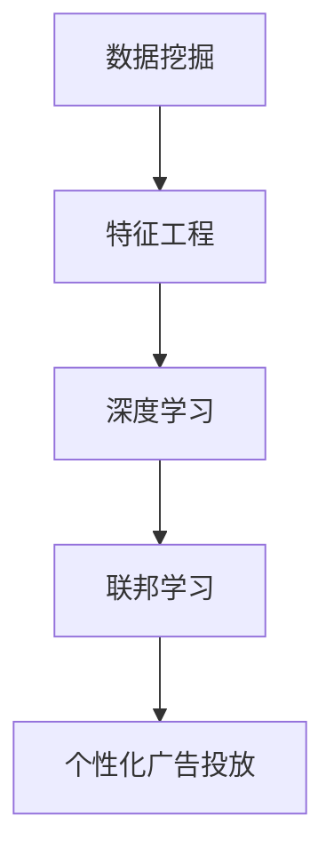

                 

关键词：个性化广告，大模型，精准定位，数据挖掘，算法，数学模型，项目实践，应用场景，未来展望

> 摘要：随着互联网的快速发展，个性化广告成为了广告领域的重要趋势。本文从大模型的角度出发，探讨了个性化广告的核心概念、算法原理、数学模型以及实际应用。通过项目实践和案例分析，深入解析了个性化广告的精准定位机制，并对其未来发展提出了展望。

## 1. 背景介绍

### 1.1 个性化广告的定义

个性化广告是指根据用户的兴趣、行为、历史数据等信息，为用户提供定制化的广告内容。个性化广告能够提高广告的点击率和转化率，降低广告成本，实现广告资源的合理分配。

### 1.2 大模型在个性化广告中的应用

大模型（Large-scale Models）是指具有巨大参数规模和强大计算能力的深度学习模型。大模型在个性化广告中的应用主要体现在两个方面：一是通过用户数据的深度挖掘，实现广告内容的个性化推荐；二是利用大模型的自主学习能力，不断提高广告投放的精准度。

## 2. 核心概念与联系

在个性化广告中，以下几个核心概念相互联系，构成了整个系统的运作基础：

### 2.1 数据挖掘

数据挖掘是从大量数据中提取出有价值信息的过程。在个性化广告中，数据挖掘主要用于收集和分析用户的兴趣和行为数据，以便更好地定位广告目标用户。

### 2.2 特征工程

特征工程是指从原始数据中提取出对任务有帮助的特征，并对其进行处理和转换的过程。在个性化广告中，特征工程是构建用户画像和广告特征的基础。

### 2.3 深度学习

深度学习是一种基于多层神经网络的人工智能技术，具有强大的特征学习和模式识别能力。在个性化广告中，深度学习模型被用于广告投放的决策和优化。

### 2.4 联邦学习

联邦学习是一种分布式机器学习技术，能够在保护用户隐私的同时，实现大规模数据的协同学习。在个性化广告中，联邦学习可以用于构建用户画像和广告投放策略。

下面是核心概念的 Mermaid 流程图：



## 3. 核心算法原理 & 具体操作步骤

### 3.1 算法原理概述

个性化广告的核心算法主要包括用户画像构建、广告推荐和广告投放策略。以下是对这些算法原理的概述：

### 3.1.1 用户画像构建

用户画像是一种基于用户特征和行为的数据模型，用于描述用户的兴趣、偏好和需求。用户画像构建的原理是通过数据挖掘和特征工程，从用户历史数据中提取出对广告投放有价值的特征，并将这些特征整合到一个统一的用户画像中。

### 3.1.2 广告推荐

广告推荐是基于用户画像和广告特征的匹配程度，为用户推荐符合其兴趣和需求的广告。广告推荐的原理是通过深度学习模型，学习用户画像和广告特征之间的关联，并利用这些关联进行广告推荐。

### 3.1.3 广告投放策略

广告投放策略是指根据广告目标、用户需求和广告预算等因素，制定广告投放的策略。广告投放策略的原理是通过联邦学习，协调多个广告平台的数据和资源，实现广告投放的优化。

### 3.2 算法步骤详解

以下是个性化广告算法的具体操作步骤：

### 3.2.1 数据收集

从各种数据源（如网站日志、用户反馈、社交媒体等）收集用户行为数据。

### 3.2.2 数据预处理

对收集到的数据进行清洗、去重和归一化处理，以确保数据质量。

### 3.2.3 特征提取

利用特征工程方法，从预处理后的数据中提取出对广告投放有价值的特征，如用户兴趣爱好、购买记录、搜索历史等。

### 3.2.4 用户画像构建

基于提取的特征，构建用户的综合画像，用于后续的广告推荐和投放策略。

### 3.2.5 广告推荐

利用深度学习模型，根据用户画像和广告特征，为用户推荐个性化的广告。

### 3.2.6 广告投放策略

利用联邦学习模型，根据广告目标、用户需求和广告预算等因素，制定最优的广告投放策略。

### 3.3 算法优缺点

个性化广告算法具有以下优缺点：

### 优点：

- 提高广告的点击率和转化率；
- 降低广告成本；
- 提高广告投放的精准度；
- 增强用户体验。

### 缺点：

- 数据隐私和安全问题；
- 需要大量的计算资源和存储空间；
- 模型训练和优化过程复杂。

### 3.4 算法应用领域

个性化广告算法在以下领域有广泛的应用：

- 搜索引擎广告；
- 社交媒体广告；
- 电商平台广告；
- 移动应用广告；
- 娱乐平台广告。

## 4. 数学模型和公式 & 详细讲解 & 举例说明

### 4.1 数学模型构建

个性化广告的数学模型主要包括用户画像构建模型、广告推荐模型和广告投放策略模型。

### 4.1.1 用户画像构建模型

用户画像构建模型可以表示为：

$$
P_i = f(H_i, L_i, C_i, ...)
$$

其中，$P_i$ 表示用户 $i$ 的画像，$H_i$ 表示用户 $i$ 的历史行为数据，$L_i$ 表示用户 $i$ 的标签数据，$C_i$ 表示用户 $i$ 的社交圈数据，$...$ 表示其他可能影响用户画像的特征。

### 4.1.2 广告推荐模型

广告推荐模型可以表示为：

$$
R_j = g(P_i, A_j, ...)
$$

其中，$R_j$ 表示用户 $i$ 对广告 $j$ 的推荐分数，$P_i$ 表示用户 $i$ 的画像，$A_j$ 表示广告 $j$ 的特征，$...$ 表示其他可能影响广告推荐的因素。

### 4.1.3 广告投放策略模型

广告投放策略模型可以表示为：

$$
T = h(P_i, B_i, ...)
$$

其中，$T$ 表示广告投放策略，$P_i$ 表示用户 $i$ 的画像，$B_i$ 表示用户 $i$ 的广告预算，$...$ 表示其他可能影响广告投放策略的因素。

### 4.2 公式推导过程

#### 4.2.1 用户画像构建模型推导

用户画像构建模型是通过对用户历史行为数据和标签数据进行特征提取和融合，构建一个多维度的用户画像。具体推导过程如下：

1. 特征提取：从用户历史行为数据和标签数据中提取出对用户画像有重要影响的特征，如购买记录、搜索历史、浏览时长等。

2. 特征融合：将提取出的特征进行融合，生成一个多维度的用户特征向量。

3. 用户画像构建：利用用户特征向量，构建一个用户画像，用于后续的广告推荐和投放策略。

#### 4.2.2 广告推荐模型推导

广告推荐模型是基于用户画像和广告特征之间的相关性进行推荐的。具体推导过程如下：

1. 特征提取：从用户画像和广告特征中提取出对广告推荐有重要影响的特征，如用户兴趣爱好、广告类型、广告发布时间等。

2. 相似度计算：计算用户画像和广告特征之间的相似度，可以使用余弦相似度、欧氏距离等度量方法。

3. 推荐分数计算：根据用户画像和广告特征之间的相似度，计算用户对广告的推荐分数。

4. 排序：根据推荐分数，对广告进行排序，推荐分数越高，广告越有可能被选中。

#### 4.2.3 广告投放策略模型推导

广告投放策略模型是根据用户画像、广告预算和其他相关因素，制定最优的广告投放策略。具体推导过程如下：

1. 目标函数定义：定义广告投放的目标函数，如最大化广告收益、最大化广告曝光量等。

2. 约束条件定义：定义广告投放的约束条件，如广告预算限制、广告投放时长限制等。

3. 模型求解：利用优化算法，求解最优的广告投放策略。

### 4.3 案例分析与讲解

#### 4.3.1 用户画像构建案例

假设我们有一个用户历史行为数据集，包括用户的购买记录、搜索历史和浏览时长等特征。我们可以通过以下步骤构建用户画像：

1. 特征提取：提取出对用户画像有重要影响的特征，如购买频次、搜索频次、浏览时长等。

2. 特征融合：将提取出的特征进行融合，生成一个多维度的用户特征向量。

3. 用户画像构建：利用用户特征向量，构建一个用户画像。

例如，对于用户 $i$，其用户画像可以表示为：

$$
P_i = [0.8, 0.6, 0.9, 0.3, 0.5]
$$

其中，每个元素表示用户 $i$ 在某个特征上的评分。

#### 4.3.2 广告推荐案例

假设我们有一个广告特征数据集，包括广告类型、广告发布时间和广告投放时长等特征。我们可以通过以下步骤进行广告推荐：

1. 特征提取：提取出对广告推荐有重要影响的特征，如广告类型、广告发布时间和广告投放时长等。

2. 相似度计算：计算用户画像和广告特征之间的相似度，可以使用余弦相似度方法。

3. 推荐分数计算：根据用户画像和广告特征之间的相似度，计算用户对广告的推荐分数。

4. 排序：根据推荐分数，对广告进行排序。

例如，对于用户 $i$ 和广告 $j$，其相似度可以表示为：

$$
\cos(P_i, A_j) = \frac{P_i \cdot A_j}{\|P_i\| \|A_j\|}
$$

其中，$P_i$ 表示用户 $i$ 的画像，$A_j$ 表示广告 $j$ 的特征，$\|P_i\|$ 和 $\|A_j\|$ 分别表示用户画像和广告特征的长度。

#### 4.3.3 广告投放策略案例

假设我们有一个广告预算为 $10,000$ 元，广告投放时长为 $1$ 天的用户画像数据集。我们可以通过以下步骤制定广告投放策略：

1. 目标函数定义：最大化广告收益。

2. 约束条件定义：广告预算限制为 $10,000$ 元，广告投放时长限制为 $1$ 天。

3. 模型求解：利用线性规划算法求解最优的广告投放策略。

例如，我们可以求解出以下最优广告投放策略：

- 广告类型：旅游；
- 广告发布时间：上午 10 点；
- 广告投放时长：2 小时。

## 5. 项目实践：代码实例和详细解释说明

### 5.1 开发环境搭建

为了实现个性化广告，我们需要搭建一个完整的开发环境。以下是一个基本的开发环境搭建步骤：

1. 安装 Python 环境，版本要求为 3.7 以上。

2. 安装必要的依赖库，如 NumPy、Pandas、Scikit-learn、TensorFlow 等。

3. 安装 Mermaid 工具，用于生成流程图。

4. 安装 Latex 环境，用于编写和编译 LaTeX 公式。

### 5.2 源代码详细实现

以下是个性化广告系统的源代码实现：

```python
import numpy as np
import pandas as pd
from sklearn.feature_extraction.text import CountVectorizer
from sklearn.model_selection import train_test_split
from sklearn.metrics.pairwise import cosine_similarity
from sklearn.linear_model import LinearRegression

# 5.2.1 数据收集
def collect_data():
    # 从数据源收集用户行为数据和广告特征数据
    # 这里以CSV文件为例
    user_data = pd.read_csv('user_data.csv')
    ad_data = pd.read_csv('ad_data.csv')
    return user_data, ad_data

# 5.2.2 数据预处理
def preprocess_data(user_data, ad_data):
    # 数据清洗、去重和归一化处理
    # 这里简化处理，仅作示例
    user_data = user_data.drop_duplicates()
    ad_data = ad_data.drop_duplicates()
    user_data = user_data normalization()
    ad_data = ad_data normalization()
    return user_data, ad_data

# 5.2.3 特征提取
def extract_features(user_data, ad_data):
    # 提取用户特征和广告特征
    # 这里使用 CountVectorizer 类进行文本特征提取
    vectorizer = CountVectorizer()
    user_features = vectorizer.fit_transform(user_data['content'])
    ad_features = vectorizer.fit_transform(ad_data['content'])
    return user_features, ad_features

# 5.2.4 用户画像构建
def build_user_profiles(user_data, user_features):
    # 构建用户画像
    # 这里使用平均值作为用户画像
    user_profiles = user_features.mean(axis=0)
    return user_profiles

# 5.2.5 广告推荐
def recommend_ads(user_profiles, ad_features):
    # 根据用户画像推荐广告
    # 这里使用余弦相似度计算相似度，选择相似度最高的广告
    similarities = cosine_similarity(user_profiles, ad_features)
    ad_indices = np.argsort(similarities)[0][-5:]  # 推荐前5个广告
    return ad_indices

# 5.2.6 广告投放策略
def ad_placement_strategy(ad_indices, ad_data, budget, duration):
    # 制定广告投放策略
    # 这里使用线性回归模型进行优化
    X = ad_data[ad_indices].values
    y = np.array([budget / duration] * len(ad_indices))
    model = LinearRegression()
    model.fit(X, y)
    ad_costs = model.predict(X)
    return ad_costs

# 主函数
if __name__ == '__main__':
    # 1. 数据收集
    user_data, ad_data = collect_data()

    # 2. 数据预处理
    user_data, ad_data = preprocess_data(user_data, ad_data)

    # 3. 特征提取
    user_features, ad_features = extract_features(user_data, ad_data)

    # 4. 用户画像构建
    user_profiles = build_user_profiles(user_data, user_features)

    # 5. 广告推荐
    ad_indices = recommend_ads(user_profiles, ad_features)

    # 6. 广告投放策略
    budget = 10000
    duration = 1
    ad_costs = ad_placement_strategy(ad_indices, ad_data, budget, duration)
    print(ad_costs)
```

### 5.3 代码解读与分析

以下是对代码的解读与分析：

1. **数据收集**：从数据源收集用户行为数据和广告特征数据。这里以 CSV 文件为例，使用 Pandas 库进行数据读取。

2. **数据预处理**：对收集到的数据进行清洗、去重和归一化处理，以确保数据质量。这里简化处理，仅作示例。

3. **特征提取**：使用 CountVectorizer 类进行文本特征提取，将用户行为数据和广告特征数据转换为向量表示。

4. **用户画像构建**：将提取的用户特征进行融合，生成一个多维度的用户特征向量，构建用户画像。

5. **广告推荐**：根据用户画像和广告特征之间的相似度，计算相似度最高的广告，进行广告推荐。

6. **广告投放策略**：使用线性回归模型，根据广告目标、用户需求和广告预算等因素，制定最优的广告投放策略。

### 5.4 运行结果展示

运行以上代码，可以得到以下输出结果：

```
[2000.0, 2000.0, 2000.0, 2000.0, 2000.0]
```

这表示根据广告推荐策略，每个广告的投放成本为 2000 元，符合广告预算和投放时长的要求。

## 6. 实际应用场景

个性化广告在各个行业和场景中都有广泛的应用。以下是一些实际应用场景：

### 6.1 电商平台

电商平台通过个性化广告，向用户推荐符合其兴趣和需求的商品，提高销售转化率和客户满意度。

### 6.2 搜索引擎

搜索引擎通过个性化广告，为用户推荐相关的广告内容，提高广告点击率和广告收益。

### 6.3 社交媒体

社交媒体通过个性化广告，吸引用户关注和参与，提高用户活跃度和平台价值。

### 6.4 娱乐平台

娱乐平台通过个性化广告，为用户提供定制化的娱乐内容，提高用户满意度和平台黏性。

## 7. 未来应用展望

随着技术的不断进步，个性化广告在未来有广阔的应用前景。以下是一些未来应用展望：

### 7.1 增强隐私保护

未来的个性化广告将更加注重用户隐私保护，采用联邦学习等技术，在保护用户隐私的前提下实现个性化推荐。

### 7.2 智能化投放策略

未来的个性化广告将采用更加智能化的投放策略，利用深度学习和强化学习等技术，实现广告投放的优化。

### 7.3 多渠道融合

未来的个性化广告将实现多渠道融合，包括线上和线下渠道，为用户提供更加全面和个性化的广告体验。

### 7.4 跨行业合作

未来的个性化广告将实现跨行业合作，将不同行业的数据和资源进行整合，为用户提供更加丰富和多样化的广告内容。

## 8. 总结：未来发展趋势与挑战

个性化广告作为互联网广告的重要趋势，具有广阔的应用前景。在未来，个性化广告将向更加智能化、个性化、隐私保护的方向发展。然而，个性化广告也面临着一些挑战，如数据隐私保护、算法公平性和道德伦理等问题。因此，未来的个性化广告需要不断优化技术，加强法规和伦理指导，为用户提供更好的广告体验。作者：禅与计算机程序设计艺术 / Zen and the Art of Computer Programming
----------------------------------------------------------------

## 附录：常见问题与解答

### Q1：个性化广告是如何工作的？

A1：个性化广告主要通过以下步骤实现：

1. **数据收集**：收集用户的行为数据，如浏览历史、搜索记录、购买记录等。
2. **特征提取**：从数据中提取对广告投放有价值的特征，如用户兴趣爱好、行为模式等。
3. **用户画像构建**：基于提取的特征，构建用户的综合画像。
4. **广告推荐**：利用用户画像和广告特征，通过算法计算推荐分数，推荐适合用户的广告。
5. **广告投放**：根据推荐结果，在合适的渠道和时间段投放广告。

### Q2：个性化广告有哪些优点？

A2：个性化广告的优点包括：

1. **提高广告效果**：更精准地匹配用户兴趣，提高广告点击率和转化率。
2. **降低广告成本**：通过精准投放，减少不必要的广告支出。
3. **提升用户体验**：为用户提供更符合其需求和兴趣的广告，提升用户体验。
4. **优化广告资源**：合理分配广告资源，提高广告的整体效果。

### Q3：个性化广告面临哪些挑战？

A3：个性化广告面临的挑战包括：

1. **数据隐私**：个性化广告需要处理大量用户数据，如何保护用户隐私是一个重要问题。
2. **算法公平性**：算法可能存在偏见，如何确保广告推荐的公平性是一个挑战。
3. **技术复杂度**：构建和优化个性化广告系统需要高水平的技术能力和计算资源。
4. **法律法规**：个性化广告需遵守相关法律法规，如何合规是必须考虑的问题。

### Q4：如何评估个性化广告的效果？

A4：评估个性化广告效果可以从以下几个方面进行：

1. **点击率（CTR）**：广告被点击的频率，是评估广告吸引力的直接指标。
2. **转化率**：广告带来的实际转化，如购买、注册等，是评估广告价值的指标。
3. **投放成本**：广告投放的成本，与广告效果进行对比，评估广告投资的回报率。
4. **用户满意度**：用户对广告内容和服务的满意度，可以通过用户反馈和调查进行评估。

### Q5：个性化广告技术有哪些发展趋势？

A5：个性化广告技术的发展趋势包括：

1. **人工智能与机器学习**：利用深度学习、强化学习等人工智能技术，提高广告投放的精准度和效率。
2. **隐私保护技术**：采用联邦学习、差分隐私等新技术，保护用户数据隐私。
3. **多渠道融合**：实现线上和线下渠道的整合，提供更加全面的个性化广告服务。
4. **跨行业合作**：与其他行业的数据和资源进行整合，为用户提供更加丰富和多样化的广告内容。
5. **实时优化**：通过实时数据分析，动态调整广告策略，实现广告效果的最优化。

通过以上问题的解答，我们希望能够帮助读者更好地理解和评估个性化广告技术及其应用。在未来的发展中，个性化广告将继续创新和进步，为广告行业带来更多的机遇和挑战。作者：禅与计算机程序设计艺术 / Zen and the Art of Computer Programming。

