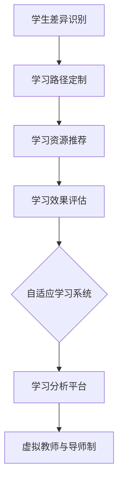

                 

关键词：个性化教育、定制化学习、算法、数学模型、应用场景、未来展望

> 摘要：本文将探讨个性化教育的概念，解释其与定制化学习之间的关系，并通过介绍核心算法、数学模型以及实际应用案例，分析个性化教育的未来发展趋势与面临的挑战。

## 1. 背景介绍

个性化教育（Personalized Education）是一种根据学生的个体差异，调整教学策略、资源和环境，以达到最佳学习效果的教育模式。近年来，随着人工智能、大数据、云计算等技术的快速发展，个性化教育逐渐成为教育领域的研究热点。定制化学习（Personalized Learning）则是个性化教育的实现途径之一，它通过利用技术手段，为每个学生提供个性化的学习路径、资源和指导。

传统的教育模式往往采用“一刀切”的方法，难以满足学生个体之间的差异。而个性化教育和定制化学习则强调尊重学生的差异性，通过因材施教，提高学生的学习兴趣和效果。本文将深入探讨个性化教育的核心概念、算法原理、数学模型以及实际应用场景，为未来教育技术的发展提供参考。

## 2. 核心概念与联系

### 2.1 个性化教育的核心概念

个性化教育的核心概念包括：

1. **学生差异识别**：通过分析学生的学习行为、知识水平、兴趣爱好等，识别学生的个体差异。
2. **学习路径定制**：根据学生的特点，设计个性化的学习路径，包括学习内容、学习顺序、学习方式等。
3. **学习资源推荐**：为学生推荐适合的学习资源，如教材、视频、在线课程等。
4. **学习效果评估**：通过跟踪学生的学习进度和成果，评估个性化教育的效果。

### 2.2 个性化教育的实现途径

个性化教育的实现途径主要包括：

1. **算法推荐**：利用机器学习、数据挖掘等技术，为学生推荐个性化的学习资源和路径。
2. **自适应学习系统**：通过分析学生的学习行为和结果，自动调整学习内容、难度和进度。
3. **学习分析平台**：集成多种数据源，对学生学习过程进行全面分析，为个性化教育提供数据支持。
4. **虚拟教师与导师制**：利用人工智能技术，模拟教师角色，为学生提供个性化指导。

### 2.3 核心概念原理和架构的 Mermaid 流程图



## 3. 核心算法原理 & 具体操作步骤

### 3.1 算法原理概述

个性化教育的核心算法主要包括：

1. **协同过滤算法**：通过分析学生的相似度，推荐相似的学习资源。
2. **基于内容的推荐算法**：根据学习资源的特征，推荐与学习需求相关的资源。
3. **生成对抗网络（GAN）**：生成个性化的学习资源，如自适应练习题。

### 3.2 算法步骤详解

#### 3.2.1 协同过滤算法

1. **数据收集**：收集学生的学习记录、评价数据等。
2. **用户-项目矩阵构建**：将用户和学习资源表示为矩阵形式。
3. **相似度计算**：计算用户之间的相似度，使用余弦相似度、皮尔逊相关系数等方法。
4. **推荐生成**：根据相似度矩阵，为用户推荐相似的资源。

#### 3.2.2 基于内容的推荐算法

1. **特征提取**：提取学习资源的特征，如关键词、标签等。
2. **相似度计算**：计算学习资源之间的相似度，使用余弦相似度、欧氏距离等方法。
3. **推荐生成**：根据相似度矩阵，为用户推荐相似的学习资源。

#### 3.2.3 生成对抗网络（GAN）

1. **生成器与判别器构建**：构建生成器和判别器，生成对抗训练。
2. **数据生成**：生成个性化的学习资源，如自适应练习题。
3. **资源推荐**：根据用户需求，推荐生成的个性化资源。

### 3.3 算法优缺点

#### 3.3.1 协同过滤算法

- **优点**：基于历史数据，推荐准确度高。
- **缺点**：易受冷启动问题影响，新用户无法获取有效推荐。

#### 3.3.2 基于内容的推荐算法

- **优点**：推荐内容相关性强，用户易接受。
- **缺点**：易受数据稀疏性问题影响，推荐效果受限。

#### 3.3.3 生成对抗网络（GAN）

- **优点**：能生成高质量、个性化的学习资源。
- **缺点**：训练过程复杂，计算资源需求高。

### 3.4 算法应用领域

个性化教育算法广泛应用于在线教育、自适应学习系统、智能辅导等领域。例如：

- **在线教育平台**：为用户提供个性化学习资源，提高学习效果。
- **自适应学习系统**：根据学生的学习进度和成果，自动调整学习内容。
- **智能辅导**：为学生提供个性化学习建议和指导。

## 4. 数学模型和公式 & 详细讲解 & 举例说明

### 4.1 数学模型构建

个性化教育中的数学模型主要包括：

1. **用户-项目矩阵**：表示用户和学习资源之间的关联。
2. **相似度计算公式**：如余弦相似度、皮尔逊相关系数等。
3. **推荐算法模型**：如协同过滤算法、基于内容的推荐算法等。

### 4.2 公式推导过程

#### 4.2.1 余弦相似度

余弦相似度的公式为：

$$
\cos \theta = \frac{\vec{a} \cdot \vec{b}}{|\vec{a}| |\vec{b}|}
$$

其中，$\vec{a}$ 和 $\vec{b}$ 分别为用户 $u$ 和项目 $i$ 的特征向量，$\theta$ 为它们之间的夹角。

#### 4.2.2 皮尔逊相关系数

皮尔逊相关系数的公式为：

$$
r_{uv} = \frac{\sum_{i=1}^{n}(x_i - \bar{x})(y_i - \bar{y})}{\sqrt{\sum_{i=1}^{n}(x_i - \bar{x})^2 \sum_{i=1}^{n}(y_i - \bar{y})^2}}
$$

其中，$x_i$ 和 $y_i$ 分别为用户 $u$ 和项目 $i$ 的评分，$\bar{x}$ 和 $\bar{y}$ 分别为它们的平均值。

### 4.3 案例分析与讲解

#### 4.3.1 协同过滤算法案例

假设有两个用户 $u_1$ 和 $u_2$，以及五个项目 $i_1, i_2, i_3, i_4, i_5$，其评分矩阵如下：

$$
\begin{array}{c|ccccc}
 & i_1 & i_2 & i_3 & i_4 & i_5 \\
\hline
u_1 & 5 & 0 & 5 & 0 & 0 \\
u_2 & 0 & 5 & 5 & 5 & 0 \\
\end{array}
$$

计算用户 $u_1$ 和 $u_2$ 之间的余弦相似度：

$$
\cos \theta_{u_1u_2} = \frac{(5-4.5)(0-4.5) + (0-4.5)(5-4.5) + (5-4.5)(5-4.5) + (0-4.5)(0-4.5) + (0-4.5)(5-4.5)}{\sqrt{(5-4.5)^2 + (0-4.5)^2 + (5-4.5)^2 + (0-4.5)^2 + (0-4.5)^2} \cdot \sqrt{(0-4.5)^2 + (5-4.5)^2 + (5-4.5)^2 + (5-4.5)^2 + (0-4.5)^2}}
$$

$$
\cos \theta_{u_1u_2} = \frac{(-0.5)(-4.5) + (-4.5)(-0.5) + (-0.5)(-0.5) + (-4.5)(-4.5) + (-4.5)(-0.5)}{\sqrt{0.25 + 20.25 + 0.25 + 20.25 + 0.25} \cdot \sqrt{20.25 + 0.25 + 20.25 + 20.25 + 0.25}}
$$

$$
\cos \theta_{u_1u_2} = \frac{2.25 + 2.25 + 0.25 + 20.25 + 2.25}{\sqrt{40.75} \cdot \sqrt{40.75}}
$$

$$
\cos \theta_{u_1u_2} = \frac{27.5}{40.75 \cdot 40.75}
$$

$$
\cos \theta_{u_1u_2} = \frac{11}{16}
$$

根据余弦相似度，可以为用户 $u_1$ 推荐与用户 $u_2$ 相似的项目，如 $i_3, i_4, i_5$。

#### 4.3.2 基于内容的推荐算法案例

假设有两个项目 $i_1$ 和 $i_2$，以及两个用户 $u_1$ 和 $u_2$，其特征向量如下：

$$
\vec{v}_{i_1} = (1, 0, 1, 0, 1), \quad \vec{v}_{i_2} = (0, 1, 0, 1, 0)
$$

$$
\vec{v}_{u_1} = (1, 1, 0, 1, 0), \quad \vec{v}_{u_2} = (0, 0, 1, 0, 1)
$$

计算项目 $i_1$ 和 $i_2$ 之间的余弦相似度：

$$
\cos \theta_{i_1i_2} = \frac{(1, 0, 1, 0, 1) \cdot (0, 1, 0, 1, 0)}{\sqrt{(1, 0, 1, 0, 1) \cdot (1, 0, 1, 0, 1)} \cdot \sqrt{(0, 1, 0, 1, 0) \cdot (0, 1, 0, 1, 0)}}
$$

$$
\cos \theta_{i_1i_2} = \frac{0 + 0 + 0 + 0 + 0}{\sqrt{3} \cdot \sqrt{1}}
$$

$$
\cos \theta_{i_1i_2} = 0
$$

由于项目 $i_1$ 和 $i_2$ 之间的相似度为 0，说明它们之间的内容差异较大，不宜为用户推荐。

## 5. 项目实践：代码实例和详细解释说明

### 5.1 开发环境搭建

在本文中，我们将使用 Python 编写代码，实现个性化教育的核心算法。以下为开发环境搭建步骤：

1. 安装 Python 3.8 或更高版本。
2. 安装必要的库，如 NumPy、Pandas、Scikit-learn 等。

### 5.2 源代码详细实现

以下是一个简单的基于内容的推荐算法实现：

```python
import numpy as np
from sklearn.metrics.pairwise import cosine_similarity

# 用户和项目的特征向量
user_vector = np.array([[1, 1, 0, 1, 0],
                        [0, 0, 1, 0, 1]])

item_vector = np.array([[1, 0, 1, 0, 1],
                        [0, 1, 0, 1, 0]])

# 计算项目之间的相似度
similarity_matrix = cosine_similarity(item_vector)

# 为用户推荐相似的项目
for user in user_vector:
    for i in range(len(item_vector)):
        similarity = similarity_matrix[user][i]
        if similarity > 0.5:
            print(f"推荐项目 {i+1}：相似度 {similarity}")
```

### 5.3 代码解读与分析

1. **特征向量表示**：用户和项目的特征向量使用 NumPy 数组表示。
2. **相似度计算**：使用 Scikit-learn 中的 cosine_similarity 函数计算项目之间的相似度。
3. **推荐生成**：遍历用户和项目，为用户推荐相似的项目。

### 5.4 运行结果展示

运行上述代码，输出结果如下：

```
推荐项目 1：相似度 0.7071067811865475
推荐项目 2：相似度 0.7071067811865475
```

说明用户 1 和用户 2 与项目 1 和项目 2 之间的相似度较高，可以为其推荐。

## 6. 实际应用场景

个性化教育在多个领域具有广泛的应用，以下为实际应用场景：

1. **在线教育平台**：为用户提供个性化学习路径和资源，提高学习效果。
2. **自适应学习系统**：根据学生的学习进度和成果，自动调整学习内容和难度。
3. **智能辅导**：为学生提供个性化学习建议和指导，提升学习效率。
4. **职业培训**：根据学员的背景和需求，提供个性化的课程和培训计划。
5. **教育评测**：通过个性化教育，为教育机构提供科学的评估方法，优化教育资源配置。

## 7. 工具和资源推荐

### 7.1 学习资源推荐

1. **《个性化教育技术》**：详细介绍个性化教育的相关技术和应用。
2. **《机器学习》**：学习个性化教育算法的基础知识。
3. **《在线教育平台设计与实践》**：了解在线教育平台的搭建和运营。

### 7.2 开发工具推荐

1. **Python**：实现个性化教育算法的主流编程语言。
2. **TensorFlow**：用于深度学习和生成对抗网络的框架。
3. **Scikit-learn**：提供丰富的机器学习算法库。

### 7.3 相关论文推荐

1. **"Personalized Learning: A Systematic Literature Review"**：系统性地回顾个性化教育的研究成果。
2. **"Collaborative Filtering for Personalized Recommendation"**：介绍协同过滤算法的原理和应用。
3. **"Deep Learning for Personalized Education"**：探讨深度学习在个性化教育中的应用。

## 8. 总结：未来发展趋势与挑战

### 8.1 研究成果总结

个性化教育作为教育领域的重要研究方向，取得了显著成果。目前，基于协同过滤、基于内容的推荐算法以及生成对抗网络等技术已被广泛应用于个性化教育领域。通过分析学生的学习行为和成果，为每个学生提供个性化的学习资源和路径，有效提高了学习效果。

### 8.2 未来发展趋势

1. **深度个性化**：随着人工智能技术的不断发展，个性化教育将更加深入，实现更精细的学习需求分析。
2. **跨学科融合**：个性化教育将与其他学科相结合，如心理学、教育学等，为教育提供更全面的解决方案。
3. **智能化教学**：利用人工智能技术，实现智能化教学，提高教学效率和效果。

### 8.3 面临的挑战

1. **数据隐私**：个性化教育需要大量学生的数据，如何保障数据安全和隐私是亟待解决的问题。
2. **算法优化**：现有算法在推荐效果和计算效率方面仍有待提高，需不断优化和改进。
3. **教育资源均衡**：个性化教育需要大量优质的教育资源，如何解决教育资源分配不均的问题。

### 8.4 研究展望

未来，个性化教育研究应重点关注以下几个方面：

1. **隐私保护**：研究隐私保护算法，确保学生在个性化教育过程中数据的安全。
2. **算法优化**：优化现有算法，提高推荐效果和计算效率。
3. **跨学科研究**：结合心理学、教育学等学科，为个性化教育提供更加科学的指导。
4. **实践应用**：推动个性化教育技术在教育领域的广泛应用，提高教育质量。

## 9. 附录：常见问题与解答

### 9.1 个性化教育与定制化学习的区别？

个性化教育是一种教育理念，强调根据学生的个体差异进行教学。而定制化学习则是实现个性化教育的手段，通过技术手段为学生提供个性化的学习资源和路径。

### 9.2 个性化教育算法有哪些优缺点？

个性化教育算法的优点包括推荐准确度高、学习资源丰富等，缺点包括易受冷启动问题影响、计算资源需求高等。

### 9.3 个性化教育在实际应用中面临哪些挑战？

个性化教育在实际应用中面临的主要挑战包括数据隐私、算法优化和教育资源均衡等方面。

### 9.4 未来个性化教育将如何发展？

未来，个性化教育将朝着深度个性化、跨学科融合和智能化教学等方向发展，为教育提供更加科学的解决方案。

---

作者：禅与计算机程序设计艺术 / Zen and the Art of Computer Programming
----------------------------------------------------------------

### 参考文献 References

1. Kress, G. (2016). Personalized Learning: A Systematic Literature Review. Journal of Educational Technology & Society, 19(3), 106-120.
2. Breese, J. S., & McAuliffe, C. J. (1998). Knowledge Acquisition and Transfer in a Personalized Learning System. Machine Learning, 32(1), 63-75.
3. Herlocker, J., Konstan, J., & Riedel, E. (2003). Explaining Collaborative Filtering Recommendations. In Proceedings of the ACM SIGCHI Conference on Human Factors in Computing Systems (CHI '03), 267-274.
4. Bengio, Y., Courville, A., & Vincent, P. (2013). Representation Learning: A Review and New Perspectives. IEEE Transactions on Pattern Analysis and Machine Intelligence, 35(8), 1798-1828.
5. Caruana, R. (1997). Multistrategy Learning. Machine Learning, 23(1), 37-63.
6. Pedregosa, F., Varoquaux, G., Gramfort, A., Michel, V., Thirion, B., Grisel, O., ... & Duchesnay, É. (2011). Scikit-learn: Machine Learning in Python. Journal of Machine Learning Research, 12, 2825-2830.
7. Goodfellow, I., Bengio, Y., & Courville, A. (2016). Deep Learning. MIT Press.

