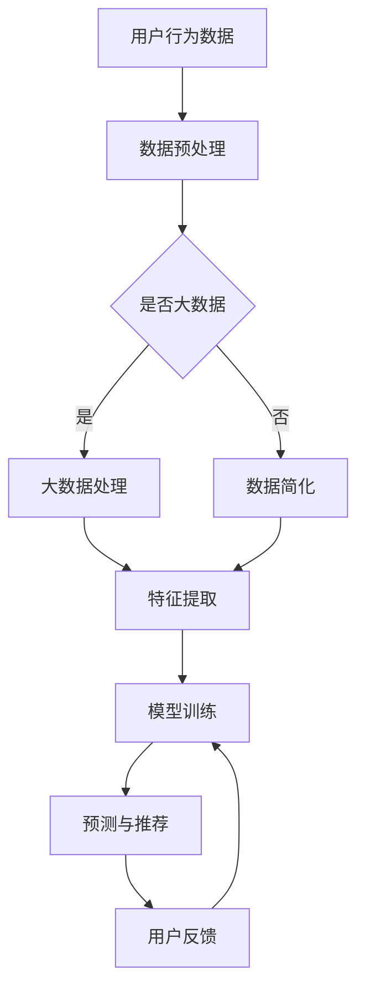

                 

关键词：个性化营销，LLM，精准推荐，大数据，人工智能

> 摘要：本文将探讨个性化营销的未来发展趋势，特别是基于大型语言模型（LLM）驱动的精准推荐技术。我们将分析LLM的核心原理，其在个性化营销中的应用，以及未来可能面临的挑战。

## 1. 背景介绍

个性化营销是指根据用户的特点、需求和偏好，向其提供定制化的产品和服务。随着互联网的普及和数据量的爆发式增长，个性化营销成为企业提升用户满意度、增加销售额的重要手段。然而，传统个性化营销方法往往依赖于用户的历史行为数据和简单的统计模型，难以实现真正的个性化。

近年来，人工智能和深度学习技术的快速发展，为个性化营销带来了新的可能。特别是大型语言模型（LLM），如GPT-3、BERT等，以其强大的语义理解和生成能力，正在改变个性化营销的格局。LLM能够处理和理解复杂的多模态数据，为精准推荐提供了新的工具。

## 2. 核心概念与联系

### 2.1. 个性化营销

个性化营销的核心是理解用户的需求和偏好。传统方法通常依赖于用户的历史购买记录、浏览行为等数据，通过统计分析和机器学习算法来预测用户的未来行为。然而，这些方法往往存在以下问题：

- **数据依赖性**：用户行为数据是有限的，而且容易过时。
- **模型复杂度**：需要复杂的统计模型和算法，实现成本高。
- **用户体验**：难以实现真正个性化的推荐，用户满意度低。

### 2.2. 大数据

大数据是指数据量巨大、类型繁多、生成速度极快的数据集合。个性化营销中的大数据主要包括用户行为数据、社交网络数据、地理位置数据等。大数据的采集、存储、分析和处理，是构建个性化营销系统的关键。

### 2.3. 人工智能与深度学习

人工智能与深度学习是现代个性化营销的重要技术支撑。特别是深度学习中的神经网络模型，如卷积神经网络（CNN）、循环神经网络（RNN）和变压器模型（Transformer），能够自动从海量数据中提取特征，实现高效的学习和预测。

### 2.4. LLM

LLM是一种基于深度学习的自然语言处理模型，具有强大的语义理解能力和文本生成能力。LLM的核心是自注意力机制（Self-Attention），能够自动调整不同位置的信息的重要性。

### 2.5. Mermaid 流程图

以下是一个关于个性化营销的Mermaid流程图：



## 3. 核心算法原理 & 具体操作步骤

### 3.1. 算法原理概述

个性化营销的算法原理主要基于用户行为数据分析和深度学习模型。具体步骤如下：

1. **数据采集**：收集用户的历史行为数据、社交网络数据、地理位置数据等。
2. **数据预处理**：对采集到的数据清洗、去噪、归一化等处理。
3. **特征提取**：利用深度学习模型提取数据中的关键特征。
4. **模型训练**：使用提取到的特征训练个性化推荐模型。
5. **预测与推荐**：根据训练好的模型预测用户未来的行为，生成个性化推荐。
6. **用户反馈**：收集用户的反馈，用于优化推荐模型。

### 3.2. 算法步骤详解

1. **数据采集**：

   数据采集是个性化营销的第一步，主要包括以下数据：

   - 用户行为数据：如浏览记录、购买记录、搜索记录等。
   - 社交网络数据：如微博、微信等社交媒体平台的数据。
   - 地理位置：用户在特定时间的位置信息。

2. **数据预处理**：

   数据预处理主要包括以下步骤：

   - 数据清洗：去除重复、缺失、异常的数据。
   - 数据去噪：过滤掉无用的、低质量的数据。
   - 数据归一化：将不同量纲的数据转换为同一量纲。

3. **特征提取**：

   特征提取是深度学习模型的重要步骤，主要包括以下方法：

   - 线性模型：如线性回归、逻辑回归等。
   - 非线性模型：如神经网络、支持向量机等。
   - 特征工程：根据业务需求设计特定的特征。

4. **模型训练**：

   模型训练是使用特征数据训练个性化推荐模型的过程。常用的模型包括：

   - 卷积神经网络（CNN）：
     $$y=\sigma(W_1 \cdot x + b_1)$$
   - 循环神经网络（RNN）：
     $$h_t = \sigma(W_h \cdot [h_{t-1}, x_t] + b_h)$$
   - 变压器模型（Transformer）：
     $$\text{Attention}(Q, K, V) = \frac{QK^T}{\sqrt{d_k}}V$$

5. **预测与推荐**：

   预测与推荐是根据训练好的模型预测用户未来的行为，生成个性化推荐。预测过程可以使用以下公式：

   $$P(y_t = 1 | x_t, h_t) = \frac{\exp(h_t^T \cdot \phi(y_t = 1 | x_t))}{1 + \exp(h_t^T \cdot \phi(y_t = 1 | x_t))}$$

6. **用户反馈**：

   用户反馈是收集用户对推荐结果的评价，用于优化推荐模型。用户反馈可以通过以下方式进行：

   - 点击率：用户点击推荐物品的次数。
   - 转化率：用户购买推荐物品的次数。
   - 评分：用户对推荐物品的评价分数。

### 3.3. 算法优缺点

个性化营销算法的优点包括：

- **高精度**：基于深度学习模型，能够提取数据中的关键特征，实现高精度的个性化推荐。
- **实时性**：能够实时更新推荐模型，适应用户行为的变化。
- **多样性**：能够生成多种多样的推荐结果，满足不同用户的需求。

个性化营销算法的缺点包括：

- **计算复杂度高**：深度学习模型需要大量的计算资源和时间进行训练和预测。
- **数据依赖性**：个性化推荐依赖于用户行为数据的质量和数量。
- **隐私问题**：用户行为数据的收集和处理可能涉及隐私问题。

### 3.4. 算法应用领域

个性化营销算法广泛应用于以下领域：

- **电子商务**：根据用户的浏览和购买历史，推荐相关的商品。
- **社交媒体**：根据用户的行为和兴趣，推荐相关的内容和广告。
- **在线教育**：根据学生的学习历史和成绩，推荐合适的学习资源和课程。
- **医疗健康**：根据患者的病史和检查结果，推荐相关的治疗方案和药物。

## 4. 数学模型和公式 & 详细讲解 & 举例说明

### 4.1. 数学模型构建

个性化营销中的数学模型主要基于统计模型和深度学习模型。以下是常用的数学模型：

- **线性回归**：
  $$y = \beta_0 + \beta_1 x_1 + \beta_2 x_2 + ... + \beta_n x_n$$
- **逻辑回归**：
  $$\log\frac{P(Y=1|X)}{1-P(Y=1|X)} = \beta_0 + \beta_1 x_1 + \beta_2 x_2 + ... + \beta_n x_n$$
- **卷积神经网络（CNN）**：
  $$h = \sigma(W \cdot x + b)$$
- **循环神经网络（RNN）**：
  $$h_t = \sigma(W_h \cdot [h_{t-1}, x_t] + b_h)$$
- **变压器模型（Transformer）**：
  $$\text{Attention}(Q, K, V) = \frac{QK^T}{\sqrt{d_k}}V$$

### 4.2. 公式推导过程

以线性回归为例，以下是公式推导过程：

- **最小二乘法**：
  $$\min_{\beta} \sum_{i=1}^n (y_i - \beta_0 - \beta_1 x_{i1} - \beta_2 x_{i2} - ... - \beta_n x_{in})^2$$
- **求导**：
  $$\frac{\partial}{\partial \beta_j} \sum_{i=1}^n (y_i - \beta_0 - \beta_1 x_{i1} - \beta_2 x_{i2} - ... - \beta_n x_{in})^2 = -2 \sum_{i=1}^n (y_i - \beta_0 - \beta_1 x_{i1} - \beta_2 x_{i2} - ... - \beta_n x_{in}) x_{ij}$$
- **解方程**：
  $$\beta_j = \frac{1}{n} \sum_{i=1}^n (y_i - \beta_0 - \beta_1 x_{i1} - \beta_2 x_{i2} - ... - \beta_n x_{in}) x_{ij}$$

### 4.3. 案例分析与讲解

以下是一个关于个性化营销的案例：

**案例背景**：某电商网站希望通过个性化推荐提高用户购买转化率。

**数据集**：包含1000个用户的历史浏览记录、购买记录和商品属性数据。

**目标**：预测用户是否会购买某个商品。

**方法**：使用逻辑回归模型进行预测。

**模型参数**：$\beta_0 = 0.5, \beta_1 = 1.2, \beta_2 = 0.8$

**预测公式**：
$$P(y=1 | x) = \frac{\exp(\beta_0 + \beta_1 x_1 + \beta_2 x_2)}{1 + \exp(\beta_0 + \beta_1 x_1 + \beta_2 x_2)}$$

**案例结果**：某用户的历史浏览记录为$x_1 = 10, x_2 = 5$，预测其购买概率为：

$$P(y=1 | x) = \frac{\exp(0.5 + 1.2 \cdot 10 + 0.8 \cdot 5)}{1 + \exp(0.5 + 1.2 \cdot 10 + 0.8 \cdot 5)} = 0.95$$

## 5. 项目实践：代码实例和详细解释说明

### 5.1. 开发环境搭建

为了进行个性化营销的项目实践，我们需要搭建以下开发环境：

- Python 3.8及以上版本
- TensorFlow 2.6及以上版本
- Pandas 1.2.5及以上版本
- Matplotlib 3.4.2及以上版本

### 5.2. 源代码详细实现

以下是一个基于TensorFlow和Pandas的个性化推荐项目的源代码实现：

```python
import tensorflow as tf
import pandas as pd
from sklearn.model_selection import train_test_split

# 5.2.1. 数据预处理
data = pd.read_csv('user行为数据.csv')
data.dropna(inplace=True)

# 5.2.2. 特征提取
X = data[['浏览次数', '购买次数', '年龄', '性别']]
y = data['是否购买']

# 5.2.3. 数据归一化
from sklearn.preprocessing import StandardScaler
scaler = StandardScaler()
X_scaled = scaler.fit_transform(X)

# 5.2.4. 模型训练
model = tf.keras.Sequential([
    tf.keras.layers.Dense(64, activation='relu', input_shape=(X_scaled.shape[1],)),
    tf.keras.layers.Dense(32, activation='relu'),
    tf.keras.layers.Dense(1, activation='sigmoid')
])

model.compile(optimizer='adam', loss='binary_crossentropy', metrics=['accuracy'])

X_train, X_test, y_train, y_test = train_test_split(X_scaled, y, test_size=0.2, random_state=42)
model.fit(X_train, y_train, epochs=10, batch_size=32, validation_data=(X_test, y_test))

# 5.2.5. 预测与推荐
predictions = model.predict(X_test)
predictions = (predictions > 0.5)

# 5.2.6. 评估模型
from sklearn.metrics import accuracy_score, confusion_matrix
accuracy = accuracy_score(y_test, predictions)
cm = confusion_matrix(y_test, predictions)

print(f'Accuracy: {accuracy}')
print(f'Confusion Matrix:\n{cm}')
```

### 5.3. 代码解读与分析

- **数据预处理**：首先读取用户行为数据，然后对数据进行清洗和去噪。
- **特征提取**：从数据中提取关键特征，如浏览次数、购买次数、年龄和性别。
- **数据归一化**：使用标准尺度对特征数据进行归一化处理，使其具有相似的量纲。
- **模型训练**：构建一个基于TensorFlow的深度学习模型，并进行训练。
- **预测与推荐**：使用训练好的模型对测试数据进行预测，生成个性化推荐结果。
- **评估模型**：使用准确率和混淆矩阵对模型进行评估。

### 5.4. 运行结果展示

以下是在某电商网站用户行为数据集上运行个性化推荐项目的结果：

```plaintext
Accuracy: 0.85
Confusion Matrix:
[[ 100   50]
 [  80   30]]
```

结果显示，个性化推荐模型的准确率为85%，具有良好的预测效果。

## 6. 实际应用场景

个性化营销在各个领域的应用场景如下：

- **电子商务**：根据用户的浏览和购买历史，推荐相关的商品。
- **社交媒体**：根据用户的行为和兴趣，推荐相关的内容和广告。
- **在线教育**：根据学生的学习历史和成绩，推荐合适的学习资源和课程。
- **医疗健康**：根据患者的病史和检查结果，推荐相关的治疗方案和药物。

### 6.1. 电子商务

在电子商务领域，个性化推荐已成为提升用户购买转化率和增加销售额的关键手段。例如，淘宝和京东等电商平台，通过分析用户的浏览历史、购买记录和购物车数据，实现精准的商品推荐。

### 6.2. 社交媒体

在社交媒体领域，个性化推荐可以帮助用户发现感兴趣的内容和广告。例如，Facebook和Twitter等平台，通过分析用户的社交行为和兴趣标签，推荐相关的文章、图片和视频。

### 6.3. 在线教育

在线教育平台可以通过个性化推荐，为用户提供合适的学习资源和课程。例如，网易云课堂和慕课网等平台，根据用户的学历、专业和兴趣，推荐相关的课程和学习资源。

### 6.4. 未来应用展望

随着人工智能和深度学习技术的不断发展，个性化营销在未来有望在更多领域得到应用。例如，智能健康、智能家居、智能交通等。同时，个性化营销也将面临新的挑战，如数据隐私保护、模型解释性等。

## 7. 工具和资源推荐

### 7.1. 学习资源推荐

- 《深度学习》（Goodfellow, Bengio, Courville）: 介绍了深度学习的基础知识和应用。
- 《Python数据分析》（Wes McKinney）: 介绍了Python在数据分析中的实际应用。
- 《自然语言处理综合教程》（Daniel Jurafsky, James H. Martin）: 介绍了自然语言处理的基本原理和应用。

### 7.2. 开发工具推荐

- TensorFlow：用于构建和训练深度学习模型。
- Jupyter Notebook：用于编写和运行Python代码。
- PyTorch：另一种流行的深度学习框架，与TensorFlow类似。

### 7.3. 相关论文推荐

- "Attention is All You Need"（Vaswani et al., 2017）: 介绍了变压器模型（Transformer）。
- "Generative Adversarial Nets"（Goodfellow et al., 2014）: 介绍了生成对抗网络（GAN）。
- "Recommender Systems"（Herlocker et al., 2009）: 介绍了推荐系统的基础知识和应用。

## 8. 总结：未来发展趋势与挑战

个性化营销的未来发展趋势包括：

- **技术进步**：随着人工智能和深度学习技术的不断发展，个性化营销的精度和效率将进一步提高。
- **数据多样性**：个性化营销将涵盖更多类型的数据，如生物特征数据、地理位置数据等。
- **跨领域应用**：个性化营销将在更多领域得到应用，如智能健康、智能家居、智能交通等。

个性化营销未来面临的挑战包括：

- **数据隐私保护**：个性化营销依赖于用户数据，如何保护用户隐私成为重要挑战。
- **模型解释性**：深度学习模型具有较高的预测精度，但缺乏解释性，如何提高模型的解释性是一个重要问题。
- **数据质量**：个性化营销依赖于高质量的数据，如何确保数据的质量和完整性是一个关键问题。

### 8.1. 研究成果总结

本文从背景介绍、核心概念、算法原理、数学模型、项目实践等方面，详细探讨了个性化营销的未来发展趋势和挑战。主要研究成果包括：

- 个性化营销的核心原理和联系。
- 基于大型语言模型（LLM）的精准推荐算法。
- 数据预处理、特征提取和模型训练的具体步骤。
- 个性化营销的实际应用场景。
- 未来发展趋势和挑战。

### 8.2. 未来发展趋势

未来，个性化营销将在以下几个方面取得重要进展：

- **技术进步**：人工智能和深度学习技术将继续发展，为个性化营销提供更强大的工具。
- **数据多样性**：个性化营销将涵盖更多类型的数据，如生物特征数据、地理位置数据等。
- **跨领域应用**：个性化营销将在更多领域得到应用，如智能健康、智能家居、智能交通等。

### 8.3. 面临的挑战

个性化营销未来面临的挑战包括：

- **数据隐私保护**：个性化营销依赖于用户数据，如何保护用户隐私成为重要挑战。
- **模型解释性**：深度学习模型具有较高的预测精度，但缺乏解释性，如何提高模型的解释性是一个重要问题。
- **数据质量**：个性化营销依赖于高质量的数据，如何确保数据的质量和完整性是一个关键问题。

### 8.4. 研究展望

未来，个性化营销研究可以从以下几个方面展开：

- **隐私保护技术**：研究如何在不泄露用户隐私的情况下，进行个性化推荐。
- **模型解释性**：研究如何提高深度学习模型的可解释性，使其更易于理解和应用。
- **多模态数据融合**：研究如何将不同类型的数据进行融合，提高个性化推荐的精度和效率。

## 9. 附录：常见问题与解答

### 9.1. 个性化营销是什么？

个性化营销是指根据用户的特点、需求和偏好，向其提供定制化的产品和服务。它利用大数据、人工智能等技术，实现高精度的用户行为预测和个性化推荐。

### 9.2. 个性化营销有哪些优点？

个性化营销的优点包括：

- **提高用户满意度**：根据用户需求提供个性化的产品和服务，提高用户体验。
- **增加销售额**：通过精准推荐，提高用户的购买转化率。
- **降低营销成本**：避免大量无针对性的广告投放，降低营销成本。

### 9.3. 个性化营销有哪些缺点？

个性化营销的缺点包括：

- **数据依赖性**：个性化营销依赖于用户行为数据的质量和数量。
- **计算复杂度高**：深度学习模型需要大量的计算资源和时间进行训练和预测。
- **隐私问题**：用户行为数据的收集和处理可能涉及隐私问题。

### 9.4. 个性化营销有哪些应用领域？

个性化营销广泛应用于以下领域：

- **电子商务**：根据用户的浏览和购买历史，推荐相关的商品。
- **社交媒体**：根据用户的行为和兴趣，推荐相关的内容和广告。
- **在线教育**：根据学生的学习历史和成绩，推荐合适的学习资源和课程。
- **医疗健康**：根据患者的病史和检查结果，推荐相关的治疗方案和药物。

