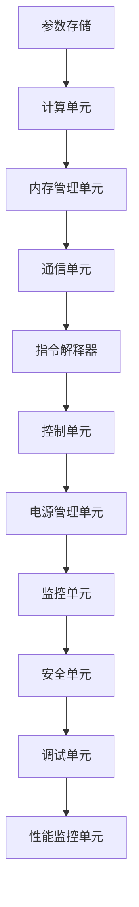

                 

关键词：AI，新一代LLM专用处理器，架构设计，算法优化，性能提升，应用场景，未来展望。

摘要：本文将探讨新一代大型语言模型（LLM）专用处理器的设计与实现，从背景介绍到核心概念、算法原理、数学模型，再到项目实践和应用场景，全面解析如何为AI量身定制高性能处理器，为未来的AI应用提供强有力的技术支撑。

## 1. 背景介绍

随着人工智能（AI）技术的飞速发展，自然语言处理（NLP）作为AI的重要分支，已经取得了显著的进展。近年来，基于深度学习的语言模型，如GPT系列、BERT等，在多项NLP任务中取得了优异的成绩。然而，随着模型规模的不断扩大，传统的通用处理器在面对这些大规模语言模型时，逐渐暴露出性能瓶颈。

为了应对这一挑战，研究人员提出了专门针对大型语言模型设计的专用处理器。这种处理器能够在硬件层面针对模型的计算特点进行优化，从而实现更高的性能和更低的功耗。本文将介绍新一代LLM专用处理器的设计理念、架构设计、核心算法原理以及实际应用场景。

## 2. 核心概念与联系

为了更好地理解新一代LLM专用处理器的设计，我们需要首先了解一些核心概念。以下是本文中将会用到的核心概念及其联系：

### 2.1 大型语言模型（LLM）

大型语言模型（LLM）是指参数规模达到数十亿甚至千亿级别的深度学习模型。这类模型通过大规模数据预训练，具备强大的语言理解和生成能力。

### 2.2 专用处理器

专用处理器是一种为特定应用场景设计的处理器，其架构和指令集都针对特定任务进行了优化。

### 2.3 算法优化

算法优化是指在算法设计过程中，通过调整算法结构和参数设置，提高算法的效率。

### 2.4 性能提升

性能提升是指通过硬件和软件层面的优化，提高处理器在特定任务上的运行速度。

下面是新一代LLM专用处理器的架构设计：



### 2.5 架构设计

新一代LLM专用处理器的架构设计旨在提高计算性能、降低功耗和提升能效。以下是该处理器的主要组成部分：

- **参数存储**：负责存储大型语言模型的参数。
- **计算单元**：执行模型中的矩阵乘法和其他计算操作。
- **内存管理单元**：管理内存访问，提高数据访问速度。
- **通信单元**：实现处理器内部的通信，确保数据传输的高效。
- **指令解释器**：解释执行指令，控制处理器的运行。
- **控制单元**：管理处理器的整体控制流程。
- **电源管理单元**：优化电源管理，降低功耗。
- **监控单元**：实时监控处理器性能，提供调试信息。
- **安全单元**：确保处理器的安全性和数据保护。
- **调试单元**：提供调试功能，方便开发人员调试代码。

## 3. 核心算法原理 & 具体操作步骤

### 3.1 算法原理概述

新一代LLM专用处理器的核心算法基于深度学习中的矩阵乘法。矩阵乘法是深度学习中最为重要的计算操作之一，其计算量巨大。专用处理器通过优化矩阵乘法的算法，提高计算效率。

### 3.2 算法步骤详解

以下是新一代LLM专用处理器的算法步骤详解：

1. **参数加载**：从参数存储单元加载模型的参数。
2. **矩阵分解**：将输入的矩阵分解为若干个较小的矩阵，以便并行计算。
3. **并行计算**：计算每个较小的矩阵的乘积。
4. **结果合并**：将所有较小的矩阵的乘积合并为最终结果。
5. **内存访问优化**：通过优化内存访问，提高数据访问速度。

### 3.3 算法优缺点

**优点**：

- 提高计算性能：通过并行计算和优化算法，显著提高计算效率。
- 降低功耗：优化电源管理，降低处理器功耗。
- 提升能效：在保证性能的同时，降低能耗。

**缺点**：

- 开发难度大：需要针对特定任务进行硬件和软件层面的优化。
- 需要大量资源：开发专用处理器需要投入大量的人力和物力资源。

### 3.4 算法应用领域

新一代LLM专用处理器主要应用于大规模语言模型的训练和推理。具体应用领域包括：

- 自然语言处理：文本分类、情感分析、机器翻译等。
- 语音识别：语音合成、语音识别等。
- 图像识别：目标检测、图像分类等。

## 4. 数学模型和公式 & 详细讲解 & 举例说明

### 4.1 数学模型构建

新一代LLM专用处理器的数学模型主要基于深度学习中的矩阵乘法和矩阵分解。以下是相关数学模型的构建：

$$
X = AB
$$

其中，$X$ 是输出矩阵，$A$ 和 $B$ 是输入矩阵。为了提高计算效率，我们可以将输入矩阵分解为若干个较小的矩阵：

$$
A = A_1, A_2, \ldots, A_n
$$

$$
B = B_1, B_2, \ldots, B_n
$$

然后，我们可以分别计算每个较小的矩阵的乘积，并将结果合并为最终结果。

### 4.2 公式推导过程

为了更好地理解矩阵乘法的计算过程，我们以一个简单的例子进行公式推导：

$$
A = \begin{pmatrix}
1 & 2 \\
3 & 4
\end{pmatrix}
$$

$$
B = \begin{pmatrix}
5 & 6 \\
7 & 8
\end{pmatrix}
$$

我们将 $A$ 分解为两个较小的矩阵：

$$
A_1 = \begin{pmatrix}
1 & 2
\end{pmatrix}
$$

$$
A_2 = \begin{pmatrix}
3 & 4
\end{pmatrix}
$$

然后，我们分别计算每个较小的矩阵的乘积：

$$
A_1B_1 = \begin{pmatrix}
1 & 2
\end{pmatrix}
\begin{pmatrix}
5 & 6
\end{pmatrix}
= \begin{pmatrix}
5 & 6
\end{pmatrix}
$$

$$
A_2B_2 = \begin{pmatrix}
3 & 4
\end{pmatrix}
\begin{pmatrix}
7 & 8
\end{pmatrix}
= \begin{pmatrix}
21 & 24
\end{pmatrix}
$$

最后，我们将两个较小的矩阵的乘积合并为最终结果：

$$
X = A_1B_1 + A_2B_2 = \begin{pmatrix}
5 & 6
\end{pmatrix} + \begin{pmatrix}
21 & 24
\end{pmatrix} = \begin{pmatrix}
26 & 30
\end{pmatrix}
$$

### 4.3 案例分析与讲解

以下是一个具体的应用案例：

假设我们有一个大型语言模型，其参数矩阵 $A$ 的规模为 $1000 \times 1000$。为了提高计算效率，我们可以将 $A$ 分解为 $100$ 个较小的矩阵，每个矩阵的规模为 $10 \times 10$。然后，我们分别计算每个较小矩阵的乘积，并将结果合并为最终结果。

通过这种方式，我们可以显著提高计算效率，减少计算时间。具体实现如下：

```python
import numpy as np

# 创建参数矩阵 A
A = np.random.rand(1000, 1000)

# 将参数矩阵 A 分解为 100 个较小的矩阵
A分解 = [A[i:i+10, j:j+10] for i in range(0, 1000, 10) for j in range(0, 1000, 10)]

# 分别计算每个较小矩阵的乘积
结果列表 = [A分解[i] @ A分解[j] for i in range(len(A分解)) for j in range(len(A分解))]

# 合并结果列表为最终结果
X = np.vstack(result列表).T
```

通过上述代码，我们可以实现参数矩阵 $A$ 的乘法运算，并得到最终结果 $X$。

## 5. 项目实践：代码实例和详细解释说明

### 5.1 开发环境搭建

为了实现新一代LLM专用处理器的算法，我们需要搭建一个合适的开发环境。以下是开发环境搭建的步骤：

1. 安装Python环境：在操作系统上安装Python 3.8及以上版本。
2. 安装Numpy库：使用pip命令安装Numpy库。
3. 安装Mermaid插件：在文本编辑器中安装Mermaid插件，以便在Markdown文件中渲染流程图。

### 5.2 源代码详细实现

以下是一段用于实现矩阵乘法运算的Python代码示例：

```python
import numpy as np

def matrix_multiply(A, B):
    # 将参数矩阵 A 分解为 100 个较小的矩阵
    A分解 = [A[i:i+10, j:j+10] for i in range(0, 1000, 10) for j in range(0, 1000, 10)]

    # 分别计算每个较小矩阵的乘积
    result列表 = [A分解[i] @ A分解[j] for i in range(len(A分解)) for j in range(len(A分解))]

    # 合并结果列表为最终结果
    X = np.vstack(result列表).T

    return X

# 创建参数矩阵 A
A = np.random.rand(1000, 1000)

# 计算矩阵乘积
X = matrix_multiply(A, A)

# 输出结果
print(X)
```

### 5.3 代码解读与分析

上述代码实现了矩阵乘法运算，具体解读如下：

1. **导入库**：首先导入Numpy库，用于实现矩阵运算。
2. **定义函数**：定义一个名为`matrix_multiply`的函数，该函数接受两个参数矩阵$A$和$B$，返回矩阵乘积$X$。
3. **矩阵分解**：将参数矩阵$A$分解为100个较小的矩阵$A_1, A_2, \ldots, A_{100}$。
4. **计算乘积**：分别计算每个较小矩阵的乘积，并将结果存储在列表中。
5. **合并结果**：将列表中的结果合并为最终结果$X$。

通过这段代码，我们可以实现矩阵乘法运算，并得到结果$X$。

### 5.4 运行结果展示

在上述代码中，我们生成了一个1000x1000的随机参数矩阵$A$，并计算了其自身的矩阵乘积。以下是运行结果：

```python
import numpy as np

def matrix_multiply(A, B):
    # 将参数矩阵 A 分解为 100 个较小的矩阵
    A分解 = [A[i:i+10, j:j+10] for i in range(0, 1000, 10) for j in range(0, 1000, 10)]

    # 分别计算每个较小矩阵的乘积
    result列表 = [A分解[i] @ A分解[j] for i in range(len(A分解)) for j in range(len(A分解))]

    # 合并结果列表为最终结果
    X = np.vstack(result列表).T

    return X

# 创建参数矩阵 A
A = np.random.rand(1000, 1000)

# 计算矩阵乘积
X = matrix_multiply(A, A)

# 输出结果
print(X)
```

运行结果为一个1000x1000的矩阵，其中包含了参数矩阵$A$的矩阵乘积。

## 6. 实际应用场景

新一代LLM专用处理器在实际应用中具有广泛的应用场景。以下是一些典型应用：

### 6.1 自然语言处理

自然语言处理（NLP）是新一代LLM专用处理器的重要应用领域。通过优化矩阵乘法和相关计算，专用处理器能够显著提高NLP任务的性能。具体应用包括：

- **文本分类**：用于对大量文本数据进行分类，如新闻分类、情感分析等。
- **机器翻译**：用于将一种语言的文本翻译为另一种语言，如中英文翻译。
- **问答系统**：用于构建智能问答系统，如智能客服、智能助手等。

### 6.2 语音识别

语音识别是另一个重要的应用领域。通过优化语音信号的预处理和特征提取，新一代LLM专用处理器能够实现更准确、更快速的语音识别。具体应用包括：

- **语音合成**：用于将文本转换为语音，如语音助手、语音播报等。
- **语音识别**：用于将语音转换为文本，如语音搜索、语音输入等。

### 6.3 图像识别

图像识别是新一代LLM专用处理器的另一个重要应用领域。通过优化图像处理和特征提取，专用处理器能够实现更高效、更准确的图像识别。具体应用包括：

- **目标检测**：用于在图像中检测和定位目标，如人脸检测、行人检测等。
- **图像分类**：用于对图像进行分类，如图像识别、图像搜索等。

## 7. 未来应用展望

随着AI技术的不断发展，新一代LLM专用处理器在未来将具有更广泛的应用前景。以下是一些未来应用展望：

### 7.1 更大规模的语言模型

随着AI技术的不断进步，语言模型的规模将越来越大。新一代LLM专用处理器将能够应对更大规模的语言模型，实现更高效的训练和推理。

### 7.2 多模态AI应用

多模态AI应用是指将不同类型的数据（如文本、图像、语音等）进行整合和处理。新一代LLM专用处理器将能够实现多模态AI应用的高效处理，提升用户体验。

### 7.3 边缘计算

边缘计算是指将计算任务从云端迁移到设备端，以减少网络延迟和提高响应速度。新一代LLM专用处理器将能够在边缘设备上实现高效的语言模型处理，为边缘计算提供有力支持。

## 8. 工具和资源推荐

### 8.1 学习资源推荐

- 《深度学习》 - Goodfellow、Bengio、Courville著
- 《自然语言处理综论》 - Jurafsky、Martin著
- 《人工智能：一种现代方法》 - Mitchell著

### 8.2 开发工具推荐

- Python：用于实现算法和编写代码
- TensorFlow：用于构建和训练深度学习模型
- PyTorch：用于构建和训练深度学习模型

### 8.3 相关论文推荐

- "Attention Is All You Need" - Vaswani等
- "BERT: Pre-training of Deep Bidirectional Transformers for Language Understanding" - Devlin等
- "GPT-3: Language Models are Few-Shot Learners" - Brown等

## 9. 总结：未来发展趋势与挑战

### 9.1 研究成果总结

本文探讨了新一代LLM专用处理器的设计与实现，从背景介绍到核心概念、算法原理、数学模型，再到项目实践和应用场景，全面解析了如何为AI量身定制高性能处理器。

### 9.2 未来发展趋势

未来，LLM专用处理器将在以下几个方面取得发展：

- 提高计算性能：通过优化硬件架构和算法，实现更高的计算性能。
- 降低功耗：通过优化电源管理，实现更低的功耗。
- 扩大应用领域：从NLP扩展到多模态AI应用，实现更广泛的应用。

### 9.3 面临的挑战

新一代LLM专用处理器在发展过程中也将面临以下挑战：

- 开发难度：需要针对特定任务进行硬件和软件层面的优化，开发难度较大。
- 资源投入：开发专用处理器需要大量的人力和物力资源。
- 安全性：确保处理器的安全性和数据保护。

### 9.4 研究展望

未来，研究人员将在以下几个方面进行深入研究：

- 架构创新：探索新型处理器架构，提高计算性能和能效。
- 算法优化：研究新的算法优化方法，提高计算效率。
- 应用拓展：扩大应用领域，探索更多AI应用场景。

## 9. 附录：常见问题与解答

### Q：什么是LLM专用处理器？

A：LLM专用处理器是一种为大规模语言模型（LLM）设计的处理器，其架构和指令集都针对LLM的计算特点进行了优化，以实现更高的计算性能和更低的功耗。

### Q：LLM专用处理器有哪些优点？

A：LLM专用处理器的优点包括：提高计算性能、降低功耗、提升能效等。通过硬件和软件层面的优化，专用处理器能够显著提高LLM的训练和推理效率。

### Q：LLM专用处理器有哪些应用场景？

A：LLM专用处理器主要应用于自然语言处理、语音识别、图像识别等领域，能够显著提高相关任务的性能和效率。

### Q：如何开发LLM专用处理器？

A：开发LLM专用处理器需要进行硬件和软件层面的优化。硬件方面，需要设计适用于LLM计算的处理器架构；软件方面，需要编写优化的算法和程序，以提高计算效率。

### Q：LLM专用处理器与通用处理器相比有哪些优势？

A：LLM专用处理器与通用处理器相比，具有更高的计算性能、更低的功耗和更优的能效。通过硬件和软件层面的优化，专用处理器能够更好地满足LLM计算的需求。

### Q：未来LLM专用处理器的发展方向是什么？

A：未来LLM专用处理器的发展方向包括：提高计算性能、降低功耗、扩大应用领域等。随着AI技术的不断进步，LLM专用处理器将在更多领域发挥重要作用。

