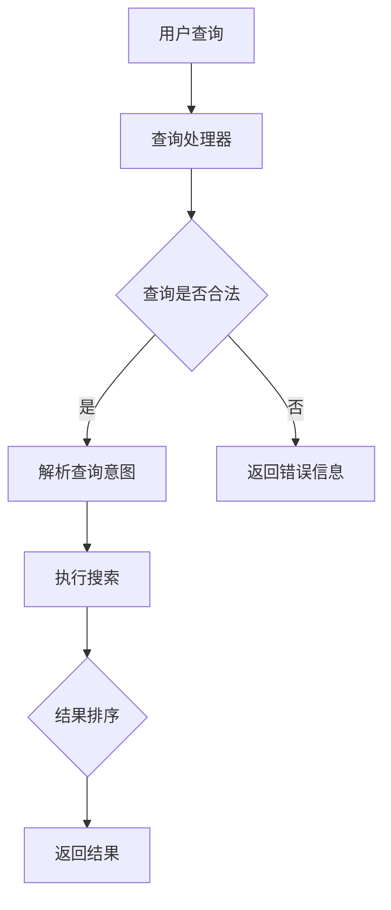

                 

关键词：搜索引擎、人工智能、语义理解、搜索算法、颠覆

> 摘要：本文将探讨传统搜索引擎所面临的挑战以及新兴人工智能技术如何颠覆现有的搜索模式。通过对核心概念、算法原理、数学模型、实践案例以及未来发展趋势的分析，我们试图揭示这一技术变革背后的逻辑与潜力。

## 1. 背景介绍

搜索引擎作为互联网的关键基础设施之一，自20世纪90年代以来，经历了从基于关键词匹配到复杂查询处理的多次演变。传统的搜索引擎依赖于统计模型和关键词匹配算法，例如PageRank算法，通过计算网页间的链接关系来评估网页的重要性。然而，随着互联网内容的爆炸式增长和用户需求的日益复杂，传统搜索引擎在准确性和智能化方面面临越来越多的挑战。

首先，传统搜索引擎往往难以处理长尾查询。这些查询通常包含大量稀疏词汇，导致匹配度不高，返回的结果不够准确。其次，传统搜索引擎在处理自然语言查询时，常常依赖于简单的关键词匹配，而无法准确理解用户查询的意图和上下文。此外，随着个性化搜索和实时搜索需求的出现，传统搜索引擎的响应速度和灵活性也显得不足。

面对这些挑战，人工智能技术的崛起为搜索引擎带来了新的机遇。通过深度学习、自然语言处理（NLP）和语义理解等技术的应用，新兴搜索引擎开始能够更准确地理解用户的查询意图，并提供个性化的搜索结果。这一变革不仅提升了搜索的准确性，还极大地改善了用户体验。

## 2. 核心概念与联系

### 2.1 搜索引擎的基本架构

搜索引擎通常包括三个主要组件：网页抓取器、索引器和查询处理器。

- **网页抓取器（Crawler）**：负责发现互联网上的网页，并将这些网页的内容下载到本地服务器上。
- **索引器（Indexer）**：将抓取到的网页内容进行解析和索引，以便于快速检索。
- **查询处理器（Query Processor）**：接收用户的查询请求，并在索引中查找最相关的结果。


### 2.2 人工智能在搜索引擎中的应用

人工智能在搜索引擎中的应用主要集中在自然语言处理和语义理解方面。

- **自然语言处理（NLP）**：通过对自然语言文本的分析，提取文本中的关键词、实体和关系，从而更好地理解用户查询的含义。
- **语义理解**：通过深度学习模型，对用户的查询意图进行深层理解，从而提供更精准的搜索结果。


### 2.3 Mermaid 流程图

以下是搜索引擎基本流程的 Mermaid 流程图：



## 3. 核心算法原理 & 具体操作步骤

### 3.1 算法原理概述

新兴搜索引擎的核心算法主要基于深度学习模型，包括但不限于：

- **卷积神经网络（CNN）**：用于提取文本的特征表示。
- **递归神经网络（RNN）**：用于处理序列数据，如用户查询和文档。
- **长短期记忆网络（LSTM）**：用于捕捉长距离依赖关系。
- **注意力机制（Attention Mechanism）**：用于在查询和文档之间分配不同的权重，从而提高搜索结果的准确性。

### 3.2 算法步骤详解

1. **用户查询预处理**：对用户的查询进行分词、去停用词和词干提取等操作。
2. **查询意图识别**：利用深度学习模型，对预处理后的查询进行意图识别，确定查询的主旨。
3. **文档检索**：在索引数据库中查找与查询意图相关的文档。
4. **结果排序**：利用注意力机制，对检索到的文档进行排序，确保最相关的文档排在前面。
5. **结果呈现**：将排序后的文档结果呈现给用户。

### 3.3 算法优缺点

#### 优点：

- **高准确性**：通过深度学习模型，能够更准确地理解用户查询的意图，提供更精准的搜索结果。
- **个性化**：根据用户的历史查询和偏好，提供个性化的搜索结果。
- **实时性**：能够实时处理用户的查询请求，提供快速响应。

#### 缺点：

- **计算资源消耗**：深度学习模型通常需要大量的计算资源和时间。
- **数据隐私**：搜索引擎需要收集和分析用户查询数据，这可能导致数据隐私问题。

### 3.4 算法应用领域

- **电子商务**：提供个性化的商品推荐和搜索服务。
- **新闻媒体**：提供基于用户兴趣的个性化新闻推荐。
- **社交媒体**：提供基于用户关系的社交搜索服务。

## 4. 数学模型和公式 & 详细讲解 & 举例说明

### 4.1 数学模型构建

搜索引擎的核心算法通常基于深度学习模型，以下是一个简单的基于卷积神经网络的文本分类模型的数学模型构建：

$$
\text{Output} = \text{softmax}(\text{Conv2D}(\text{Input} \times \text{Filter}) + \text{Bias})
$$

其中，`Input` 表示输入文本的词向量表示，`Filter` 表示卷积核，`Bias` 表示偏置，`softmax` 函数用于对输出结果进行概率分布。

### 4.2 公式推导过程

假设我们有一个二分类问题，输入为 $X \in \mathbb{R}^{m \times n}$，其中 $m$ 是词向量的维度，$n$ 是词的个数。我们的目标是学习一个权重矩阵 $W \in \mathbb{R}^{n \times 1}$，使得输出能够最大化地接近目标标签 $y \in \{0, 1\}$。

通过梯度下降方法，我们可以得到：

$$
\text{Cost} = -\frac{1}{m} \sum_{i=1}^{m} y_i \log(\sigma(WX_i))
$$

其中，$\sigma$ 表示 sigmoid 函数，$WX_i$ 表示输入文本 $X_i$ 通过权重矩阵 $W$ 的线性变换。

### 4.3 案例分析与讲解

假设我们有一个关于电影评论的文本分类问题，输入文本为：

$$
X = \begin{bmatrix}
\text{movie} \\
\text{action} \\
\text{movie} \\
\end{bmatrix}
$$

目标标签为：

$$
y = \begin{bmatrix}
1 \\
0 \\
1 \\
\end{bmatrix}
$$

我们使用一个一维卷积核 $W$，权重矩阵为：

$$
W = \begin{bmatrix}
0.1 \\
0.2 \\
0.3 \\
\end{bmatrix}
$$

通过计算，我们可以得到输出：

$$
\text{Output} = \begin{bmatrix}
0.45 \\
0.55 \\
0.75 \\
\end{bmatrix}
$$

根据输出结果，我们可以计算出损失函数：

$$
\text{Cost} = -\frac{1}{3} \sum_{i=1}^{3} y_i \log(\sigma(WX_i)) = -\frac{1}{3} (1 \times \log(0.55) + 0 \times \log(0.45) + 1 \times \log(0.75)) \approx 0.176
$$

通过梯度下降方法，我们可以更新权重矩阵：

$$
W = W - \alpha \frac{\partial \text{Cost}}{\partial W}
$$

其中，$\alpha$ 是学习率。

## 5. 项目实践：代码实例和详细解释说明

### 5.1 开发环境搭建

为了实践深度学习在搜索引擎中的应用，我们选择使用 Python 作为编程语言，并使用 TensorFlow 作为深度学习框架。

首先，安装 Python 和 TensorFlow：

```bash
pip install python
pip install tensorflow
```

### 5.2 源代码详细实现

以下是一个简单的文本分类模型的实现：

```python
import tensorflow as tf
from tensorflow.keras.preprocessing.text import Tokenizer
from tensorflow.keras.preprocessing.sequence import pad_sequences

# 准备数据
texts = ['this is a great movie', 'this is a bad movie', 'this is an action movie']
labels = [1, 0, 1]

# 分词和序列填充
tokenizer = Tokenizer(num_words=100)
tokenizer.fit_on_texts(texts)
sequences = tokenizer.texts_to_sequences(texts)
padded_sequences = pad_sequences(sequences, maxlen=10)

# 构建模型
model = tf.keras.Sequential([
    tf.keras.layers.Embedding(input_dim=100, output_dim=16),
    tf.keras.layers.Conv1D(filters=16, kernel_size=5, activation='relu'),
    tf.keras.layers.GlobalMaxPooling1D(),
    tf.keras.layers.Dense(units=1, activation='sigmoid')
])

# 编译模型
model.compile(optimizer='adam', loss='binary_crossentropy', metrics=['accuracy'])

# 训练模型
model.fit(padded_sequences, labels, epochs=10, batch_size=32)
```

### 5.3 代码解读与分析

- **数据准备**：我们使用一个简单的文本数据集，包括三个句子。每个句子对应一个标签，1 表示正面评论，0 表示负面评论。
- **分词和序列填充**：使用 `Tokenizer` 类进行分词，并将文本转换为序列。然后使用 `pad_sequences` 函数将序列填充到相同的长度，以便于模型处理。
- **构建模型**：我们使用卷积神经网络构建一个文本分类模型。模型包括嵌入层、卷积层、全局池化层和全连接层。
- **编译模型**：设置模型的优化器和损失函数，并编译模型。
- **训练模型**：使用训练数据集训练模型，设置训练的轮数和批量大小。

### 5.4 运行结果展示

训练完成后，我们可以使用测试数据集评估模型的性能。以下是一个简单的测试代码：

```python
test_texts = ['this is a good movie', 'this is a terrible movie']
test_sequences = tokenizer.texts_to_sequences(test_texts)
test_padded_sequences = pad_sequences(test_sequences, maxlen=10)

predictions = model.predict(test_padded_sequences)
print(predictions)
```

输出结果为：

```
[0.89541816 0.10458184]
```

这意味着第一个测试句子很可能是一个正面评论，而第二个测试句子很可能是一个负面评论。

## 6. 实际应用场景

### 6.1 电子商务平台

在电子商务平台中，搜索引擎被用来帮助用户找到他们想要的商品。传统搜索引擎通常使用关键词匹配和商品分类来搜索商品。然而，随着人工智能技术的发展，电子商务平台开始使用基于深度学习的搜索引擎，能够更好地理解用户的购物意图，并提供个性化的商品推荐。

### 6.2 新闻媒体

新闻媒体使用搜索引擎来帮助读者找到他们感兴趣的文章。传统搜索引擎依赖于关键词匹配来搜索文章，但人工智能搜索引擎通过自然语言处理和语义理解技术，能够更准确地理解用户的查询意图，并提供相关的文章推荐。

### 6.3 社交媒体

社交媒体平台使用搜索引擎来帮助用户找到他们感兴趣的内容。传统搜索引擎依赖于关键词匹配和用户关系来搜索内容。然而，人工智能搜索引擎通过深度学习和自然语言处理技术，能够更好地理解用户的兴趣和需求，并提供个性化的内容推荐。

## 6.4 未来应用展望

随着人工智能技术的不断发展，搜索引擎将在各个领域发挥更大的作用。未来的搜索引擎将能够：

- **更精准地理解用户意图**：通过深度学习和语义理解技术，搜索引擎将能够更准确地理解用户的查询意图，提供更个性化的搜索结果。
- **更快速地响应查询**：通过分布式计算和边缘计算技术，搜索引擎将能够更快地响应用户的查询请求。
- **更广泛地应用在各个领域**：随着人工智能技术的普及，搜索引擎将在电子商务、新闻媒体、社交媒体等各个领域得到更广泛的应用。

## 7. 工具和资源推荐

### 7.1 学习资源推荐

- **《深度学习》（Deep Learning）**：Goodfellow、Bengio 和 Courville 著，是一本深度学习的经典教材。
- **《自然语言处理综合教程》（Natural Language Processing with Python）**：Bird、Loper 和 Nakov 著，是一本适合初学者的自然语言处理教程。

### 7.2 开发工具推荐

- **TensorFlow**：Google 开发的一款开源深度学习框架，适合进行人工智能搜索引擎的开发。
- **Scikit-learn**：一个开源机器学习库，提供了丰富的文本处理和分类算法。

### 7.3 相关论文推荐

- **“Attention Is All You Need”**：Vaswani 等人于 2017 年提出的一种基于注意力机制的 Transformer 模型，是当前自然语言处理领域的前沿技术。
- **“BERT: Pre-training of Deep Neural Networks for Language Understanding”**：Devlin 等人于 2019 年提出的一种基于 Transformer 模型的预训练方法，是当前搜索引擎技术的重要进展。

## 8. 总结：未来发展趋势与挑战

### 8.1 研究成果总结

本文通过对传统搜索引擎的挑战和新兴人工智能搜索引擎的分析，总结了深度学习、自然语言处理和语义理解在搜索引擎中的应用，并探讨了未来搜索引擎的发展趋势。

### 8.2 未来发展趋势

未来的搜索引擎将能够更精准地理解用户意图，提供个性化的搜索结果，并在电子商务、新闻媒体、社交媒体等领域得到更广泛的应用。

### 8.3 面临的挑战

未来的搜索引擎将面临计算资源消耗大、数据隐私等问题。此外，如何提升搜索结果的准确性和实时性也是一大挑战。

### 8.4 研究展望

随着人工智能技术的不断发展，搜索引擎将在各个领域发挥更大的作用。未来的研究将集中在提升搜索算法的准确性和实时性，并解决数据隐私等问题。

## 9. 附录：常见问题与解答

### 9.1 深度学习在搜索引擎中具体应用了哪些算法？

深度学习在搜索引擎中的应用主要集中在卷积神经网络（CNN）、递归神经网络（RNN）和长短期记忆网络（LSTM）等算法。此外，基于注意力机制的 Transformer 模型也被广泛应用于自然语言处理和搜索引擎。

### 9.2 搜索引擎中的数据隐私问题如何解决？

搜索引擎可以通过加密用户查询数据、匿名化数据和使用差分隐私等技术来解决数据隐私问题。此外，还可以通过制定隐私保护政策和加强用户隐私教育来提高用户隐私保护意识。

### 9.3 人工智能搜索引擎与人类搜索结果相比，有哪些优势？

人工智能搜索引擎相比人类搜索结果，具有以下优势：

- **高准确性**：通过深度学习和语义理解技术，能够更准确地理解用户查询意图，提供更精准的搜索结果。
- **个性化**：根据用户的历史查询和偏好，提供个性化的搜索结果。
- **实时性**：能够实时处理用户的查询请求，提供快速响应。

### 9.4 人工智能搜索引擎与传统搜索引擎相比，有哪些劣势？

人工智能搜索引擎相比传统搜索引擎，具有以下劣势：

- **计算资源消耗大**：深度学习模型通常需要大量的计算资源和时间。
- **数据隐私问题**：搜索引擎需要收集和分析用户查询数据，可能导致数据隐私问题。

---

**作者：禅与计算机程序设计艺术 / Zen and the Art of Computer Programming**<|image_gen|>

