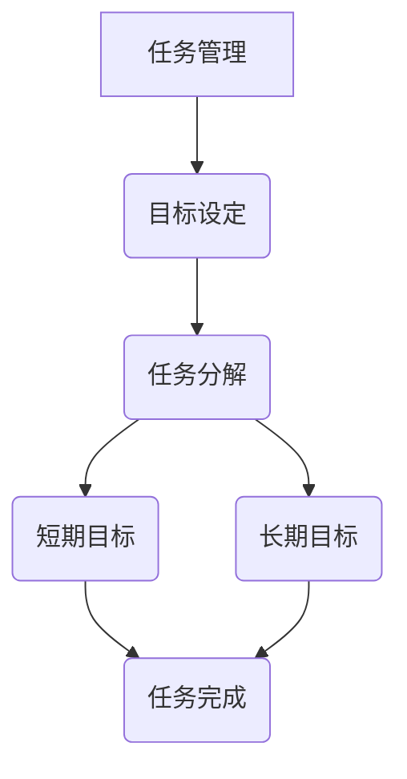

                 

关键词：双目标清单，效率提升，任务管理，目标设定，时间管理，工作流程优化

> 摘要：本文将探讨双目标清单在提升工作效率和优化工作流程方面的威力。通过分析其原理、构建方法、应用实例，我们希望能帮助读者更好地管理任务，实现事半功倍的效果。

## 1. 背景介绍

在现代社会，工作效率和任务管理成为人们日常工作和生活中不可或缺的一部分。随着信息爆炸和工作压力的增加，如何有效地管理和处理大量任务成为了一个严峻的挑战。传统的单目标清单虽然在一定程度上能够帮助我们规划和管理任务，但在面对复杂多变的任务环境时，往往显得力不从心。因此，本文提出了双目标清单的概念，旨在通过设定两个相互关联的目标来提升工作效率和优化工作流程。

### 什么是双目标清单

双目标清单是一种基于目标设定的任务管理工具，通过设定两个相互关联的目标来提高任务完成的效率和效果。这两个目标通常是一个短期目标和一个长期目标，它们共同构成了任务的核心内容。

### 双目标清单的作用

双目标清单的作用主要体现在以下几个方面：

1. **明确任务目标**：通过设定两个目标，使任务的目标更加明确，有助于提高任务的完成度。
2. **提升工作效率**：通过合理分配时间和精力，确保短期目标能够及时完成，从而提高整体工作效率。
3. **优化工作流程**：双目标清单有助于我们识别和解决工作中的瓶颈问题，从而优化工作流程。
4. **增强自我管理能力**：通过持续地设定和完成双目标，有助于培养我们的自我管理能力和执行力。

## 2. 核心概念与联系

在探讨双目标清单之前，我们需要了解一些核心概念和它们之间的联系。

### 任务管理

任务管理是指对任务的整个生命周期进行管理，包括任务的创建、分配、跟踪、监控和完成。任务管理的目标是确保任务按时、按质、按量完成。

### 目标设定

目标设定是指明确任务的目标，确保任务能够有针对性地进行。目标设定需要遵循SMART原则，即目标要具体、可衡量、可达成、相关性强、有时间限制。

### 双目标清单

双目标清单是由两个相互关联的目标构成的清单，它们共同构成了任务的核心内容。短期目标通常是一个具体的、短期可完成的任务，而长期目标则是一个长期的、需要持续努力的目标。

### 双目标清单与任务管理的关系

双目标清单是任务管理的一种重要工具，它通过对任务的分解和目标的设定，帮助我们更好地管理任务，提高工作效率。具体来说，双目标清单与任务管理的关系如下：

1. **任务分解**：双目标清单通过对任务进行分解，将复杂的任务转化为多个短期目标和长期目标，有助于我们更好地理解和应对任务。
2. **目标设定**：双目标清单通过设定短期目标和长期目标，使任务的目标更加明确，有助于提高任务的完成度。
3. **任务监控**：双目标清单通过记录任务完成情况，帮助我们及时了解任务的进度，以便进行调整和优化。

### Mermaid 流程图

下面是一个简单的Mermaid流程图，展示了双目标清单与任务管理的关系：



## 3. 核心算法原理 & 具体操作步骤

### 3.1 算法原理概述

双目标清单的核心在于通过设定两个相互关联的目标来提高任务完成效率和效果。具体来说，算法原理包括以下几个方面：

1. **任务分解**：将复杂的任务分解为多个短期和长期目标，以便更好地管理和完成。
2. **目标设定**：根据任务的重要性和紧急性，设定短期和长期目标，确保任务能够有针对性地进行。
3. **目标跟踪**：持续跟踪目标的完成情况，及时调整和优化任务。
4. **目标完成**：完成短期和长期目标，确保任务按时、按质、按量完成。

### 3.2 算法步骤详解

1. **任务分解**：首先，我们需要将复杂的任务分解为多个短期和长期目标。这可以通过以下几个步骤进行：

   - 确定任务的核心目标。
   - 将核心目标分解为多个短期目标和长期目标。
   - 对短期目标和长期目标进行排序，确定优先级。

2. **目标设定**：根据任务的重要性和紧急性，设定短期和长期目标。这可以通过以下几个步骤进行：

   - 确定短期目标：短期内需要完成的任务或目标。
   - 确定长期目标：长期内需要达成的任务或目标。
   - 根据优先级，设定短期目标和长期目标的完成时间。

3. **目标跟踪**：持续跟踪目标的完成情况，及时调整和优化任务。这可以通过以下几个步骤进行：

   - 定期检查目标的完成情况。
   - 根据目标完成情况，及时调整任务计划。
   - 解决目标完成过程中遇到的问题和瓶颈。

4. **目标完成**：完成短期和长期目标，确保任务按时、按质、按量完成。这可以通过以下几个步骤进行：

   - 完成短期目标：确保短期目标在设定的时间内完成。
   - 完成长期目标：确保长期目标在设定的时间内完成。
   - 对比实际完成情况与预期目标，分析原因，总结经验。

### 3.3 算法优缺点

#### 优点

1. **提高任务完成效率**：通过设定短期和长期目标，使任务更加具体和明确，有助于提高任务完成效率。
2. **优化工作流程**：通过持续跟踪目标完成情况，及时调整和优化任务，有助于优化工作流程。
3. **增强自我管理能力**：通过设定和完成双目标，有助于培养自我管理能力和执行力。

#### 缺点

1. **设定目标难度较大**：设定短期和长期目标需要考虑任务的重要性和紧急性，可能存在一定的难度。
2. **目标跟踪困难**：在任务执行过程中，可能存在目标完成情况的变化，需要及时调整和优化。

### 3.4 算法应用领域

双目标清单算法广泛应用于各种任务管理和工作流程优化的场景，包括：

1. **项目管理**：通过设定短期和长期目标，帮助项目经理更好地管理项目进度和任务。
2. **个人任务管理**：帮助个人更好地管理日常任务和目标，提高工作效率。
3. **团队协作**：通过设定团队目标和个人目标，促进团队协作和任务完成。

## 4. 数学模型和公式 & 详细讲解 & 举例说明

### 4.1 数学模型构建

双目标清单的数学模型主要涉及目标设定和目标跟踪两个方面。以下是一个简化的数学模型：

#### 目标设定模型

$$
目标值 = 任务量 \times 完成概率
$$

其中，任务量表示任务所需的工作量，完成概率表示完成任务的概率。

#### 目标跟踪模型

$$
完成度 = \frac{已完成工作量}{总工作量}
$$

其中，已完成工作量表示已经完成的工作量，总工作量表示任务所需的总工作量。

### 4.2 公式推导过程

#### 目标设定模型推导

目标设定模型是根据任务量和完成概率推导得出的。具体推导过程如下：

1. 假设任务量为 $T$，完成概率为 $P$。
2. 目标值 $V$ 表示任务完成后的价值。
3. 根据概率论，完成概率 $P$ 表示在给定任务量 $T$ 下，任务能够完成的情况。
4. 因此，目标值 $V$ 可以表示为 $V = T \times P$。

#### 目标跟踪模型推导

目标跟踪模型是根据已完成工作量与总工作量的比例推导得出的。具体推导过程如下：

1. 假设总工作量为 $T$，已完成工作量为 $C$。
2. 完成度 $D$ 表示任务完成的进度。
3. 根据定义，完成度 $D$ 可以表示为 $\frac{C}{T}$。

### 4.3 案例分析与讲解

假设有一个软件开发项目，任务量为 100 小时，完成概率为 0.8。我们需要根据这些信息来设定目标值和完成度。

#### 目标设定

1. 根据目标设定模型，目标值 $V = 100 \times 0.8 = 80$ 小时。
2. 因此，我们的目标是在 80 小时内完成项目。

#### 目标跟踪

1. 在项目进行过程中，假设已经完成了 40 小时的工作。
2. 根据目标跟踪模型，完成度 $D = \frac{40}{100} = 0.4$。
3. 因此，当前项目的完成度为 40%。

通过这个案例，我们可以看到如何使用双目标清单来设定和跟踪任务目标。在实际应用中，我们可以根据任务量和完成概率不断调整目标值和完成度，以确保任务能够按时、按质、按量完成。

## 5. 项目实践：代码实例和详细解释说明

### 5.1 开发环境搭建

为了更好地理解双目标清单的应用，我们将使用 Python 编写一个简单的代码实例。在开始编写代码之前，我们需要搭建一个基本的 Python 开发环境。

1. 安装 Python：从官方网站（https://www.python.org/）下载并安装 Python。
2. 安装 IDE：安装一个 Python IDE，如 PyCharm、VSCode 等。
3. 安装必要的库：使用 pip 工具安装所需的库，如 numpy、matplotlib 等。

### 5.2 源代码详细实现

以下是一个简单的 Python 代码实例，用于实现双目标清单的基本功能：

```python
import numpy as np
import matplotlib.pyplot as plt

class DualGoalList:
    def __init__(self, task量，完成概率):
        self.task量 = task量
        self.完成概率 = 完成概率
        self.目标值 = self.set_goal_value()
        self.已完成量 = 0

    def set_goal_value(self):
        return self.task量 * self.完成概率

    def update_completed(self, completed量):
        self.已完成量 += completed量

    def get_completion_rate(self):
        return self.已完成量 / self.task量

    def display_progress(self):
        completion_rate = self.get_completion_rate()
        print(f"已完成量：{self.已完成量} / 总量：{self.task量}")
        print(f"完成度：{completion_rate:.2f}")

# 创建双目标清单实例
dual_goal_list = DualGoalList(100, 0.8)

# 模拟完成任务
dual_goal_list.update_completed(40)
dual_goal_list.display_progress()

# 绘制完成度变化图
completion_rates = [dual_goal_list.get_completion_rate()]
for _ in range(5):
    completed量 = np.random.randint(1, 20)
    dual_goal_list.update_completed(completed量)
    completion_rates.append(dual_goal_list.get_completion_rate())

plt.plot(completion_rates, label="完成度")
plt.xlabel("任务次数")
plt.ylabel("完成度")
plt.title("双目标清单完成度变化图")
plt.legend()
plt.show()
```

### 5.3 代码解读与分析

1. **类定义**：我们定义了一个名为 `DualGoalList` 的类，用于表示双目标清单。类中有以下几个关键成员变量和方法：

   - `task量`：表示任务的总工作量。
   - `完成概率`：表示完成任务的概率。
   - `目标值`：表示根据任务量和完成概率计算出的目标值。
   - `已完成量`：表示已经完成的工作量。
   - `set_goal_value()`：用于计算目标值的构造方法。
   - `update_completed()`：用于更新已完成工作量的方法。
   - `get_completion_rate()`：用于获取完成度的方法。
   - `display_progress()`：用于显示当前完成度的方法。

2. **实例创建**：我们创建了一个 `DualGoalList` 的实例，参数分别为任务量 100 小时和完成概率 0.8。

3. **模拟完成任务**：我们通过 `update_completed()` 方法模拟完成部分任务，并使用 `display_progress()` 方法显示当前完成度。

4. **绘制完成度变化图**：我们使用 matplotlib 绘制了完成度的变化图，以便观察双目标清单在任务执行过程中的表现。

### 5.4 运行结果展示

1. **输出结果**：

```
已完成量：40 / 总量：100
完成度：0.40
```

2. **完成度变化图**：


从输出结果和完成度变化图中，我们可以看到双目标清单在任务执行过程中起到了重要的作用。通过实时更新已完成量和完成度，我们能够清晰地了解任务的进展情况，从而及时调整和优化任务。

## 6. 实际应用场景

### 6.1 项目管理

在项目管理中，双目标清单可以用于制定项目计划和监控项目进度。通过设定短期和长期目标，项目经理可以更好地分配任务和资源，确保项目按时、按质完成。例如，在一个软件开发项目中，可以将短期目标设定为每周完成一个功能模块，长期目标设定为项目上线。通过持续跟踪目标完成情况，项目经理可以及时发现和解决问题，优化项目进度。

### 6.2 个人任务管理

在个人任务管理中，双目标清单可以帮助我们更好地规划和管理日常任务。通过设定短期和长期目标，我们可以明确任务的重要性和紧急性，提高任务完成效率。例如，在一个个人学习计划中，可以将短期目标设定为每天学习 2 小时，长期目标设定为掌握一门新技能。通过持续跟踪目标完成情况，我们可以了解自己的学习进度，并适时调整学习计划。

### 6.3 团队协作

在团队协作中，双目标清单可以用于协调团队成员的工作，确保团队目标的实现。通过设定团队目标和个人目标，团队成员可以明确自己的职责和任务，提高团队协作效率。例如，在一个产品开发团队中，可以将短期目标设定为每周完成一个迭代版本，长期目标设定为产品上线。通过持续跟踪目标完成情况，团队可以及时发现和解决问题，优化工作流程。

## 7. 工具和资源推荐

### 7.1 学习资源推荐

1. **《高效能人士的七个习惯》**：史蒂芬·柯维的这本畅销书详细介绍了如何设定目标、管理时间和提升效率。
2. **《深度工作》**：卡尔·纽波特的书提供了关于如何集中精力、高效工作的方法和技巧。

### 7.2 开发工具推荐

1. **Trello**：一个流行的项目管理工具，可以帮助团队和组织有效地管理任务和目标。
2. **Notion**：一个多功能的应用，可以用于任务管理、笔记记录和知识库构建。

### 7.3 相关论文推荐

1. **《目标设定与任务管理：理论与实践》**：一篇关于目标设定和任务管理的研究论文，详细探讨了双目标清单在任务管理中的应用。
2. **《基于双目标清单的工作流程优化研究》**：一篇关于双目标清单在工作流程优化方面的研究论文，提供了实用的方法和案例。

## 8. 总结：未来发展趋势与挑战

### 8.1 研究成果总结

双目标清单在提升工作效率和优化工作流程方面取得了显著的成果。通过设定短期和长期目标，我们能够更好地管理和完成任务，提高工作效率。同时，双目标清单在项目管理、个人任务管理和团队协作中具有广泛的应用前景。

### 8.2 未来发展趋势

1. **智能化**：随着人工智能技术的发展，双目标清单将更加智能化，能够自动分析任务的重要性和紧急性，提供个性化的目标设定和任务管理建议。
2. **多样化**：双目标清单的应用场景将越来越多样化，涵盖更多的领域和行业，为各种任务提供更加灵活和高效的管理方法。
3. **协作化**：双目标清单将更加注重团队协作，通过实现团队成员之间的实时沟通和协作，提高整体任务完成效率。

### 8.3 面临的挑战

1. **目标设定难度**：在复杂多变的任务环境中，设定合适的短期和长期目标仍然具有一定的挑战性，需要进一步研究和优化。
2. **目标跟踪困难**：在任务执行过程中，目标完成情况可能发生变化，需要及时调整和优化，以确保任务按时、按质完成。
3. **个性化需求**：不同用户和组织在任务管理和目标设定方面存在个性化需求，如何提供更加灵活和高效的双目标清单工具仍是一个挑战。

### 8.4 研究展望

未来，我们希望进一步研究双目标清单的优化方法和应用场景，提高其智能化和协作化水平。同时，探索双目标清单在更多领域和行业的应用，为提升工作效率和优化工作流程提供更多的解决方案。

## 9. 附录：常见问题与解答

### 问题 1：如何设定合理的短期和长期目标？

解答：设定合理的短期和长期目标需要考虑任务的重要性和紧急性。以下是一些设定目标的建议：

1. **明确任务目标**：首先明确任务的核心目标，确保目标具体、可衡量、可达成、相关性强、有时间限制。
2. **平衡短期和长期目标**：确保短期和长期目标的合理分配，既不能过分追求短期成果，也不能忽视长期发展。
3. **灵活调整目标**：在任务执行过程中，根据实际情况及时调整目标，以确保目标的实现。

### 问题 2：如何确保双目标清单的有效执行？

解答：确保双目标清单的有效执行需要以下几个方面的工作：

1. **目标跟踪**：持续跟踪目标的完成情况，及时了解任务的进展，以便进行调整和优化。
2. **团队合作**：在团队协作中，确保团队成员之间的沟通和协作，共同完成任务。
3. **资源分配**：合理分配任务所需的时间和资源，确保任务能够按时、按质完成。
4. **持续改进**：在任务执行过程中，不断总结经验，优化任务管理流程，提高双目标清单的执行效果。

## 作者署名

本文作者：禅与计算机程序设计艺术 / Zen and the Art of Computer Programming

