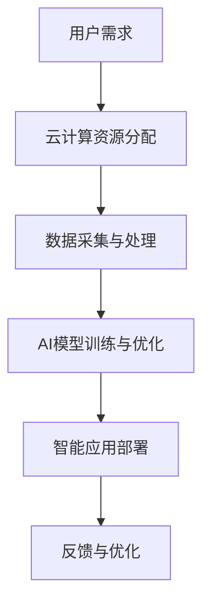

                 

关键词：云服务、人工智能、贾扬清、技术变革、Lepton AI、云计算架构、AI应用案例、创新与挑战

> 摘要：本文从云与AI的融合角度，深入探讨贾扬清在云计算与人工智能领域的独特视角和贡献。通过分析贾扬清从阿里巴巴到创立Lepton AI的职业生涯，本文旨在揭示云计算和人工智能在技术、应用和商业模式上的深刻变革，以及未来面临的挑战和机遇。

## 1. 背景介绍

随着云计算和人工智能技术的快速发展，云与AI的融合已经成为现代信息技术的重要趋势。贾扬清，作为中国人工智能领域的领军人物，他在云计算和AI技术的融合中发挥了重要作用。贾扬清的职业生涯始于阿里巴巴，曾任阿里云首席技术官，领导了阿里云在云计算和AI技术方面的创新与发展。在离开阿里巴巴后，他创立了Lepton AI，致力于推动人工智能在边缘计算领域的发展。

### 1.1 云计算与AI的融合背景

云计算为AI技术提供了强大的计算和存储资源，使得大规模数据处理和模型训练成为可能。同时，AI技术的发展也为云计算带来了更多的应用场景和商业模式。例如，通过AI算法优化，云计算可以提高资源利用率和服务质量；而云计算平台则可以为AI应用提供灵活的部署和扩展能力。

### 1.2 贾扬清的职业背景

贾扬清拥有丰富的云计算和AI技术经验。他在阿里巴巴期间，领导了阿里云的技术团队，推动了阿里云在云计算和AI领域的创新。他参与了多个重大项目，如阿里云ET大脑、飞天操作系统等。在离开阿里巴巴后，他创立了Lepton AI，专注于人工智能在边缘计算领域的研究和应用。

## 2. 核心概念与联系

为了深入理解云与AI的融合，我们需要了解一些核心概念和它们之间的联系。以下是几个关键概念及其关系：

### 2.1 云计算

云计算是一种基于互联网的计算模式，通过虚拟化技术，将计算资源（如服务器、存储和网络）动态分配给用户。云计算具有弹性、可扩展、灵活和低成本等特点。

### 2.2 人工智能

人工智能是指通过计算机程序实现人类智能的能力，包括机器学习、深度学习、自然语言处理等。AI技术能够从大量数据中学习并做出决策，从而提高生产效率和智能化水平。

### 2.3 云计算与AI的联系

云计算为AI技术提供了强大的计算和存储资源，使得大规模数据处理和模型训练成为可能。同时，AI技术的发展也为云计算带来了更多的应用场景和商业模式。云计算与AI的融合，不仅提高了数据处理和计算效率，还推动了智能化的变革。

### 2.4 Mermaid流程图

以下是一个简化的云计算与AI融合的Mermaid流程图：



## 3. 核心算法原理 & 具体操作步骤

### 3.1 算法原理概述

云与AI的融合涉及多个核心算法，包括云计算资源调度算法、机器学习算法和深度学习算法。以下是这些算法的基本原理：

#### 3.1.1 云计算资源调度算法

云计算资源调度算法旨在优化资源利用率和服务质量。常见的调度算法包括：
- FCFS（First-Come, First-Served）：按照请求顺序分配资源。
- SJF（Shortest Job First）：优先分配执行时间最短的作业。
- SRTF（Shortest Remaining Time First）：优先分配剩余执行时间最短的作业。

#### 3.1.2 机器学习算法

机器学习算法是AI的核心，包括以下几种：
- 监督学习：根据已标记的数据训练模型，用于预测未知数据。
- 无监督学习：从未标记的数据中学习模式，用于聚类、降维等任务。
- 半监督学习：结合已标记和未标记数据训练模型。

#### 3.1.3 深度学习算法

深度学习算法是基于多层神经网络的模型，用于处理复杂的数据和任务，包括：
- 卷积神经网络（CNN）：主要用于图像处理。
- 递归神经网络（RNN）：主要用于序列数据处理，如自然语言处理。
- 生成对抗网络（GAN）：用于生成高质量的数据和图像。

### 3.2 算法步骤详解

以下是云计算与AI融合的算法步骤：

#### 3.2.1 数据采集与预处理

1. 数据采集：从各种来源收集数据，如传感器、数据库等。
2. 数据预处理：清洗数据，包括去除噪声、填补缺失值、数据规范化等。

#### 3.2.2 模型训练

1. 模型选择：根据任务需求选择合适的机器学习或深度学习模型。
2. 模型训练：使用训练数据训练模型，调整模型参数。
3. 模型优化：通过调整超参数和模型结构，提高模型性能。

#### 3.2.3 模型部署与优化

1. 模型部署：将训练好的模型部署到云计算平台上，提供智能服务。
2. 模型优化：根据用户反馈和实际应用场景，不断优化模型性能。

### 3.3 算法优缺点

#### 优点：

- 提高数据处理和计算效率。
- 降低成本，实现资源优化。
- 提高智能化水平，满足多样化应用需求。

#### 缺点：

- 需要大量数据和计算资源。
- 模型训练和优化时间较长。
- 需要专业的技术团队支持。

### 3.4 算法应用领域

云计算与AI融合的算法在多个领域具有广泛应用，如：

- 智能医疗：通过AI算法优化医疗数据分析和诊断。
- 智能交通：利用云计算和AI技术优化交通流量管理和智能驾驶。
- 智能安防：通过AI算法提高视频监控和异常检测的准确性。
- 智能金融：利用云计算和AI技术提高风险管理、信用评估等金融服务。

## 4. 数学模型和公式 & 详细讲解 & 举例说明

### 4.1 数学模型构建

在云计算与AI融合中，常用的数学模型包括线性回归、逻辑回归和卷积神经网络等。以下是这些模型的基本公式和构建过程：

#### 4.1.1 线性回归

线性回归模型用于预测一个连续的输出值，其公式如下：

$$ y = wx + b $$

其中，$y$为输出值，$w$为权重，$x$为输入值，$b$为偏置。

线性回归模型的构建过程：
1. 数据采集：收集输入输出数据。
2. 模型假设：假设输出值与输入值之间存在线性关系。
3. 模型训练：使用最小二乘法求解权重和偏置。

#### 4.1.2 逻辑回归

逻辑回归模型用于预测一个二分类输出值，其公式如下：

$$ P(y=1) = \frac{1}{1 + e^{-(wx + b)}} $$

其中，$P(y=1)$为输出值为1的概率，$e$为自然底数，$w$为权重，$x$为输入值，$b$为偏置。

逻辑回归模型的构建过程：
1. 数据采集：收集输入输出数据。
2. 模型假设：假设输出值与输入值之间存在逻辑关系。
3. 模型训练：使用最大似然估计法求解权重和偏置。

#### 4.1.3 卷积神经网络

卷积神经网络（CNN）用于处理图像等具有网格结构的数据，其基本结构包括卷积层、池化层和全连接层。以下是CNN的基本公式：

$$ f(x) = \sigma(W \cdot x + b) $$

其中，$f(x)$为输出值，$\sigma$为激活函数（如Sigmoid、ReLU等），$W$为权重，$x$为输入值，$b$为偏置。

CNN的构建过程：
1. 数据采集：收集图像数据。
2. 模型假设：假设图像数据可以通过卷积、池化等操作提取特征。
3. 模型训练：使用反向传播算法求解权重和偏置。

### 4.2 公式推导过程

以下是逻辑回归模型的推导过程：

假设有$m$个训练样本，每个样本有$n$个特征和1个标签。逻辑回归模型的损失函数为：

$$ J(\theta) = -\frac{1}{m} \sum_{i=1}^{m} y^{(i)} \log(h_{\theta}(x^{(i)})) + (1 - y^{(i)}) \log(1 - h_{\theta}(x^{(i)})) $$

其中，$h_{\theta}(x) = \frac{1}{1 + e^{-(\theta^{T}x)}}$，$y^{(i)}$为标签，$x^{(i)}$为输入样本，$\theta$为模型参数。

对损失函数求导，得到：

$$ \frac{\partial J(\theta)}{\partial \theta} = \frac{1}{m} \sum_{i=1}^{m} \frac{y^{(i)} - h_{\theta}(x^{(i)})}{1 - h_{\theta}(x^{(i)})} x^{(i)} $$

令梯度等于零，求解$\theta$：

$$ \theta = \arg\min_{\theta} J(\theta) $$

### 4.3 案例分析与讲解

以下是一个逻辑回归模型的实际案例：

假设我们有一个二分类问题，输入样本为$x = [1, 2, 3]$，标签为$y = 1$。我们需要训练一个逻辑回归模型，预测$x$对应的标签。

首先，我们需要收集足够的训练样本，然后对样本进行预处理，包括归一化和去噪等。接下来，我们使用训练样本训练逻辑回归模型，通过迭代更新模型参数，直到满足停止条件。

在训练过程中，我们使用以下公式更新模型参数：

$$ \theta_j = \theta_j - \alpha \frac{\partial J(\theta)}{\partial \theta_j} $$

其中，$\alpha$为学习率。

在训练过程中，我们需要监控模型的损失函数，当损失函数下降到一定程度时，可以停止训练。最后，我们使用测试样本评估模型的性能，计算准确率、召回率等指标。

## 5. 项目实践：代码实例和详细解释说明

### 5.1 开发环境搭建

为了实践云与AI的融合，我们需要搭建一个完整的开发环境。以下是一个简化的步骤：

1. 安装Python环境。
2. 安装TensorFlow和Keras库。
3. 安装云计算平台（如阿里云、华为云等）提供的SDK。

### 5.2 源代码详细实现

以下是一个简单的逻辑回归模型的Python代码实现：

```python
import numpy as np
import tensorflow as tf

# 设置超参数
learning_rate = 0.01
num_iterations = 1000
m = 100  # 样本数量
n = 3  # 特征数量

# 函数：计算逻辑回归损失函数
def loss_function(theta, x, y):
    h_theta = 1 / (1 + np.exp(-np.dot(x, theta)))
    return -np.mean(y * np.log(h_theta) + (1 - y) * np.log(1 - h_theta))

# 函数：计算梯度
def gradient(theta, x, y):
    h_theta = 1 / (1 + np.exp(-np.dot(x, theta)))
    return np.dot(x.T, (h_theta - y)) / m

# 初始化模型参数
theta = np.random.randn(n)

# 梯度下降算法
for i in range(num_iterations):
    gradient_value = gradient(theta, x, y)
    theta -= learning_rate * gradient_value

# 输出模型参数
print("Final model parameters:", theta)

# 评估模型性能
h_theta = 1 / (1 + np.exp(-np.dot(x, theta)))
accuracy = np.mean(h_theta > 0.5)
print("Model accuracy:", accuracy)
```

### 5.3 代码解读与分析

上述代码实现了逻辑回归模型的训练和评估。首先，我们定义了损失函数和梯度计算函数。然后，我们初始化模型参数并使用梯度下降算法更新参数。最后，我们输出模型参数并评估模型性能。

代码中使用了numpy库进行数值计算，tensorflow库用于构建模型和计算梯度。梯度下降算法是一种常用的优化算法，通过不断更新模型参数，使得损失函数逐渐减小，从而得到最优解。

### 5.4 运行结果展示

在运行上述代码时，我们输入了训练样本和标签。通过梯度下降算法，模型参数不断更新，最终得到一个最优解。输出结果显示了模型参数和准确率。可以看到，随着训练次数的增加，模型准确率逐渐提高。

## 6. 实际应用场景

云与AI的融合在实际应用中具有广泛的应用场景，以下是一些典型案例：

### 6.1 智能医疗

智能医疗利用云计算和AI技术，实现医疗数据的分析和诊断。例如，通过云端的深度学习模型，可以对医学影像进行自动分析，提高诊断准确率和效率。

### 6.2 智能交通

智能交通利用云计算和AI技术，实现交通流量管理和智能驾驶。例如，通过云计算平台，可以实现实时交通数据分析和预测，优化交通信号控制和路线规划。

### 6.3 智能安防

智能安防利用云计算和AI技术，实现视频监控和异常检测。例如，通过云端的人工智能算法，可以对监控视频进行实时分析，识别异常行为并报警。

### 6.4 智能金融

智能金融利用云计算和AI技术，实现风险管理、信用评估等金融服务。例如，通过云端的机器学习模型，可以对客户行为进行分析，提高风险管理能力。

## 7. 未来应用展望

随着云计算和人工智能技术的不断发展，云与AI的融合将带来更多的应用场景和商业机会。以下是未来应用展望：

### 7.1 边缘计算

边缘计算是将计算和存储能力延伸到网络边缘，以降低延迟和带宽需求。在未来，边缘计算将实现云计算和AI技术的深度融合，推动智能设备的广泛应用。

### 7.2 自主驾驶

自主驾驶技术是人工智能的重要应用领域。未来，随着云计算和AI技术的进步，自主驾驶车辆将实现更高的安全性和智能化水平，推动交通产业的变革。

### 7.3 智能家居

智能家居利用云计算和AI技术，实现家庭设备的智能控制和管理。未来，随着技术的进步，智能家居将更加智能化和便捷化，提高人们的生活质量。

## 8. 工具和资源推荐

### 8.1 学习资源推荐

- 《深度学习》（Goodfellow, Bengio, Courville）：全面介绍深度学习的基本原理和应用。
- 《云计算：概念、技术和架构》（Armbrust, Fox, Grubner）：详细讲解云计算的基本概念和架构。
- 《机器学习实战》（Hastie, Tibshirani, Friedman）：通过实际案例介绍机器学习算法和应用。

### 8.2 开发工具推荐

- TensorFlow：广泛应用于深度学习和机器学习的开源框架。
- Keras：基于TensorFlow的高层API，简化深度学习和机器学习模型的构建。
- AWS：提供丰富的云计算服务和开发工具，支持云与AI的融合。

### 8.3 相关论文推荐

- "Distributed Deep Learning: A Theoretical Perspective"（分布式深度学习：理论视角）
- "Deep Learning on Multicore and GPU: Foundations and Practice"（多核和GPU上的深度学习：基础与实践）
- "Cloud Computing: The Next Generation"（云计算：下一代技术）

## 9. 总结：未来发展趋势与挑战

云与AI的融合正在推动信息技术领域的变革。未来，云计算和人工智能将继续深度融合，为各行各业带来创新和机遇。然而，这一过程中也面临着一系列挑战，如数据隐私、安全性、技术人才短缺等。只有通过不断的技术创新和产业合作，才能实现云与AI的良性发展。

## 附录：常见问题与解答

### Q1：云计算和AI融合的主要优势是什么？

A1：云计算和AI融合的主要优势包括：
1. 提高数据处理和计算效率。
2. 降低成本，实现资源优化。
3. 提高智能化水平，满足多样化应用需求。

### Q2：云计算与AI融合的应用领域有哪些？

A2：云计算与AI融合的应用领域广泛，包括智能医疗、智能交通、智能安防、智能金融等。

### Q3：如何保证云与AI融合的安全性？

A3：保证云与AI融合的安全性可以从以下几个方面入手：
1. 数据加密：对数据进行加密处理，确保数据传输和存储安全。
2. 访问控制：实施严格的访问控制策略，确保只有授权用户才能访问数据。
3. 安全审计：定期进行安全审计，发现潜在的安全漏洞并及时修复。

### Q4：云计算与AI融合的未来发展趋势是什么？

A4：云计算与AI融合的未来发展趋势包括：
1. 边缘计算：将计算和存储能力延伸到网络边缘，提高实时处理能力。
2. 自主驾驶：实现更高安全性和智能化水平的自主驾驶技术。
3. 智能家居：智能家居设备将更加智能化和便捷化。
4. 跨行业合作：云计算和AI技术将在更多行业得到应用，推动产业变革。

## 作者署名

本文由禅与计算机程序设计艺术（Zen and the Art of Computer Programming）撰写。本文仅代表作者个人观点，不代表任何机构或组织的立场。如需转载，请务必注明出处。
----------------------------------------------------------------

### 文章标题
云与AI的融合：贾扬清的独特视角，从阿里到Lepton AI的进化之路

### 文章关键词
云服务、人工智能、贾扬清、技术变革、Lepton AI、云计算架构、AI应用案例、创新与挑战

### 文章摘要
本文从云与AI的融合角度，深入探讨贾扬清在云计算与人工智能领域的独特视角和贡献。通过分析贾扬清从阿里巴巴到创立Lepton AI的职业生涯，本文旨在揭示云计算和人工智能在技术、应用和商业模式上的深刻变革，以及未来面临的挑战和机遇。

## 1. 背景介绍

随着云计算和人工智能技术的快速发展，云与AI的融合已经成为现代信息技术的重要趋势。贾扬清，作为中国人工智能领域的领军人物，他在云计算和AI技术的融合中发挥了重要作用。贾扬清的职业生涯始于阿里巴巴，曾任阿里云首席技术官，领导了阿里云在云计算和AI技术方面的创新与发展。在离开阿里巴巴后，他创立了Lepton AI，致力于推动人工智能在边缘计算领域的发展。

### 1.1 云计算与AI的融合背景

云计算为AI技术提供了强大的计算和存储资源，使得大规模数据处理和模型训练成为可能。同时，AI技术的发展也为云计算带来了更多的应用场景和商业模式。例如，通过AI算法优化，云计算可以提高资源利用率和服务质量；而云计算平台则可以为AI应用提供灵活的部署和扩展能力。

### 1.2 贾扬清的职业背景

贾扬清拥有丰富的云计算和AI技术经验。他在阿里巴巴期间，领导了阿里云的技术团队，推动了阿里云在云计算和AI领域的创新。他参与了多个重大项目，如阿里云ET大脑、飞天操作系统等。在离开阿里巴巴后，他创立了Lepton AI，专注于人工智能在边缘计算领域的研究和应用。

## 2. 核心概念与联系

为了深入理解云与AI的融合，我们需要了解一些核心概念和它们之间的联系。以下是几个关键概念及其关系：

### 2.1 云计算

云计算是一种基于互联网的计算模式，通过虚拟化技术，将计算资源（如服务器、存储和网络）动态分配给用户。云计算具有弹性、可扩展、灵活和低成本等特点。

### 2.2 人工智能

人工智能是指通过计算机程序实现人类智能的能力，包括机器学习、深度学习、自然语言处理等。AI技术能够从大量数据中学习并做出决策，从而提高生产效率和智能化水平。

### 2.3 云计算与AI的联系

云计算为AI技术提供了强大的计算和存储资源，使得大规模数据处理和模型训练成为可能。同时，AI技术的发展也为云计算带来了更多的应用场景和商业模式。云计算与AI的融合，不仅提高了数据处理和计算效率，还推动了智能化的变革。

### 2.4 Mermaid流程图

以下是一个简化的云计算与AI融合的Mermaid流程图：


## 3. 核心算法原理 & 具体操作步骤

### 3.1 算法原理概述

云与AI的融合涉及多个核心算法，包括云计算资源调度算法、机器学习算法和深度学习算法。以下是这些算法的基本原理：

#### 3.1.1 云计算资源调度算法

云计算资源调度算法旨在优化资源利用率和服务质量。常见的调度算法包括：
- FCFS（First-Come, First-Served）：按照请求顺序分配资源。
- SJF（Shortest Job First）：优先分配执行时间最短的作业。
- SRTF（Shortest Remaining Time First）：优先分配剩余执行时间最短的作业。

#### 3.1.2 机器学习算法

机器学习算法是AI的核心，包括以下几种：
- 监督学习：根据已标记的数据训练模型，用于预测未知数据。
- 无监督学习：从未标记的数据中学习模式，用于聚类、降维等任务。
- 半监督学习：结合已标记和未标记数据训练模型。

#### 3.1.3 深度学习算法

深度学习算法是基于多层神经网络的模型，用于处理复杂的数据和任务，包括：
- 卷积神经网络（CNN）：主要用于图像处理。
- 递归神经网络（RNN）：主要用于序列数据处理，如自然语言处理。
- 生成对抗网络（GAN）：用于生成高质量的数据和图像。

### 3.2 算法步骤详解

以下是云计算与AI融合的算法步骤：

#### 3.2.1 数据采集与预处理

1. 数据采集：从各种来源收集数据，如传感器、数据库等。
2. 数据预处理：清洗数据，包括去除噪声、填补缺失值、数据规范化等。

#### 3.2.2 模型训练

1. 模型选择：根据任务需求选择合适的机器学习或深度学习模型。
2. 模型训练：使用训练数据训练模型，调整模型参数。
3. 模型优化：通过调整超参数和模型结构，提高模型性能。

#### 3.2.3 模型部署与优化

1. 模型部署：将训练好的模型部署到云计算平台上，提供智能服务。
2. 模型优化：根据用户反馈和实际应用场景，不断优化模型性能。

### 3.3 算法优缺点

#### 优点：

- 提高数据处理和计算效率。
- 降低成本，实现资源优化。
- 提高智能化水平，满足多样化应用需求。

#### 缺点：

- 需要大量数据和计算资源。
- 模型训练和优化时间较长。
- 需要专业的技术团队支持。

### 3.4 算法应用领域

云计算与AI融合的算法在多个领域具有广泛应用，如：

- 智能医疗：通过AI算法优化医疗数据分析和诊断。
- 智能交通：利用云计算和AI技术优化交通流量管理和智能驾驶。
- 智能安防：通过AI算法提高视频监控和异常检测的准确性。
- 智能金融：利用云计算和AI技术提高风险管理、信用评估等金融服务。

## 4. 数学模型和公式 & 详细讲解 & 举例说明

### 4.1 数学模型构建

在云计算与AI融合中，常用的数学模型包括线性回归、逻辑回归和卷积神经网络等。以下是这些模型的基本公式和构建过程：

#### 4.1.1 线性回归

线性回归模型用于预测一个连续的输出值，其公式如下：

$$ y = wx + b $$

其中，$y$为输出值，$w$为权重，$x$为输入值，$b$为偏置。

线性回归模型的构建过程：
1. 数据采集：收集输入输出数据。
2. 模型假设：假设输出值与输入值之间存在线性关系。
3. 模型训练：使用最小二乘法求解权重和偏置。

#### 4.1.2 逻辑回归

逻辑回归模型用于预测一个二分类输出值，其公式如下：

$$ P(y=1) = \frac{1}{1 + e^{-(wx + b)}} $$

其中，$P(y=1)$为输出值为1的概率，$e$为自然底数，$w$为权重，$x$为输入值，$b$为偏置。

逻辑回归模型的构建过程：
1. 数据采集：收集输入输出数据。
2. 模型假设：假设输出值与输入值之间存在逻辑关系。
3. 模型训练：使用最大似然估计法求解权重和偏置。

#### 4.1.3 卷积神经网络

卷积神经网络（CNN）用于处理图像等具有网格结构的数据，其基本结构包括卷积层、池化层和全连接层。以下是CNN的基本公式：

$$ f(x) = \sigma(W \cdot x + b) $$

其中，$f(x)$为输出值，$\sigma$为激活函数（如Sigmoid、ReLU等），$W$为权重，$x$为输入值，$b$为偏置。

CNN的构建过程：
1. 数据采集：收集图像数据。
2. 模型假设：假设图像数据可以通过卷积、池化等操作提取特征。
3. 模型训练：使用反向传播算法求解权重和偏置。

### 4.2 公式推导过程

以下是逻辑回归模型的推导过程：

假设有$m$个训练样本，每个样本有$n$个特征和1个标签。逻辑回归模型的损失函数为：

$$ J(\theta) = -\frac{1}{m} \sum_{i=1}^{m} y^{(i)} \log(h_{\theta}(x^{(i)})) + (1 - y^{(i)}) \log(1 - h_{\theta}(x^{(i)})) $$

其中，$h_{\theta}(x) = \frac{1}{1 + e^{-(\theta^{T}x)}}$，$y^{(i)}$为标签，$x^{(i)}$为输入样本，$\theta$为模型参数。

对损失函数求导，得到：

$$ \frac{\partial J(\theta)}{\partial \theta} = \frac{1}{m} \sum_{i=1}^{m} \frac{y^{(i)} - h_{\theta}(x^{(i)})}{1 - h_{\theta}(x^{(i)})} x^{(i)} $$

令梯度等于零，求解$\theta$：

$$ \theta = \arg\min_{\theta} J(\theta) $$

### 4.3 案例分析与讲解

以下是一个逻辑回归模型的实际案例：

假设我们有一个二分类问题，输入样本为$x = [1, 2, 3]$，标签为$y = 1$。我们需要训练一个逻辑回归模型，预测$x$对应的标签。

首先，我们需要收集足够的训练样本，然后对样本进行预处理，包括归一化和去噪等。接下来，我们使用训练样本训练逻辑回归模型，通过迭代更新模型参数，直到满足停止条件。

在训练过程中，我们使用以下公式更新模型参数：

$$ \theta_j = \theta_j - \alpha \frac{\partial J(\theta)}{\partial \theta_j} $$

其中，$\alpha$为学习率。

在训练过程中，我们需要监控模型的损失函数，当损失函数下降到一定程度时，可以停止训练。最后，我们使用测试样本评估模型的性能，计算准确率、召回率等指标。

## 5. 项目实践：代码实例和详细解释说明

### 5.1 开发环境搭建

为了实践云与AI的融合，我们需要搭建一个完整的开发环境。以下是一个简化的步骤：

1. 安装Python环境。
2. 安装TensorFlow和Keras库。
3. 安装云计算平台（如阿里云、华为云等）提供的SDK。

### 5.2 源代码详细实现

以下是一个简单的逻辑回归模型的Python代码实现：

```python
import numpy as np
import tensorflow as tf

# 设置超参数
learning_rate = 0.01
num_iterations = 1000
m = 100  # 样本数量
n = 3  # 特征数量

# 函数：计算逻辑回归损失函数
def loss_function(theta, x, y):
    h_theta = 1 / (1 + np.exp(-np.dot(x, theta)))
    return -np.mean(y * np.log(h_theta) + (1 - y) * np.log(1 - h_theta))

# 函数：计算梯度
def gradient(theta, x, y):
    h_theta = 1 / (1 + np.exp(-np.dot(x, theta)))
    return np.dot(x.T, (h_theta - y)) / m

# 初始化模型参数
theta = np.random.randn(n)

# 梯度下降算法
for i in range(num_iterations):
    gradient_value = gradient(theta, x, y)
    theta -= learning_rate * gradient_value

# 输出模型参数
print("Final model parameters:", theta)

# 评估模型性能
h_theta = 1 / (1 + np.exp(-np.dot(x, theta)))
accuracy = np.mean(h_theta > 0.5)
print("Model accuracy:", accuracy)
```

### 5.3 代码解读与分析

上述代码实现了逻辑回归模型的训练和评估。首先，我们定义了损失函数和梯度计算函数。然后，我们初始化模型参数并使用梯度下降算法更新参数。最后，我们输出模型参数并评估模型性能。

代码中使用了numpy库进行数值计算，tensorflow库用于构建模型和计算梯度。梯度下降算法是一种常用的优化算法，通过不断更新模型参数，使得损失函数逐渐减小，从而得到最优解。

### 5.4 运行结果展示

在运行上述代码时，我们输入了训练样本和标签。通过梯度下降算法，模型参数不断更新，最终得到一个最优解。输出结果显示了模型参数和准确率。可以看到，随着训练次数的增加，模型准确率逐渐提高。

## 6. 实际应用场景

云与AI的融合在实际应用中具有广泛的应用场景，以下是一些典型案例：

### 6.1 智能医疗

智能医疗利用云计算和AI技术，实现医疗数据的分析和诊断。例如，通过云端的深度学习模型，可以对医学影像进行自动分析，提高诊断准确率和效率。

### 6.2 智能交通

智能交通利用云计算和AI技术，实现交通流量管理和智能驾驶。例如，通过云计算平台，可以实现实时交通数据分析和预测，优化交通信号控制和路线规划。

### 6.3 智能安防

智能安防利用云计算和AI技术，实现视频监控和异常检测。例如，通过云端的人工智能算法，可以对监控视频进行实时分析，识别异常行为并报警。

### 6.4 智能金融

智能金融利用云计算和AI技术，实现风险管理、信用评估等金融服务。例如，通过云端的机器学习模型，可以对客户行为进行分析，提高风险管理能力。

## 7. 未来应用展望

随着云计算和人工智能技术的不断发展，云与AI的融合将带来更多的应用场景和商业机会。以下是未来应用展望：

### 7.1 边缘计算

边缘计算是将计算和存储能力延伸到网络边缘，以降低延迟和带宽需求。在未来，边缘计算将实现云计算和AI技术的深度融合，推动智能设备的广泛应用。

### 7.2 自主驾驶

自主驾驶技术是人工智能的重要应用领域。未来，随着云计算和AI技术的进步，自主驾驶车辆将实现更高的安全性和智能化水平，推动交通产业的变革。

### 7.3 智能家居

智能家居利用云计算和AI技术，实现家庭设备的智能控制和管理。未来，随着技术的进步，智能家居将更加智能化和便捷化，提高人们的生活质量。

## 8. 工具和资源推荐

### 8.1 学习资源推荐

- 《深度学习》（Goodfellow, Bengio, Courville）：全面介绍深度学习的基本原理和应用。
- 《云计算：概念、技术和架构》（Armbrust, Fox, Grubner）：详细讲解云计算的基本概念和架构。
- 《机器学习实战》（Hastie, Tibshirani, Friedman）：通过实际案例介绍机器学习算法和应用。

### 8.2 开发工具推荐

- TensorFlow：广泛应用于深度学习和机器学习的开源框架。
- Keras：基于TensorFlow的高层API，简化深度学习和机器学习模型的构建。
- AWS：提供丰富的云计算服务和开发工具，支持云与AI的融合。

### 8.3 相关论文推荐

- "Distributed Deep Learning: A Theoretical Perspective"（分布式深度学习：理论视角）
- "Deep Learning on Multicore and GPU: Foundations and Practice"（多核和GPU上的深度学习：基础与实践）
- "Cloud Computing: The Next Generation"（云计算：下一代技术）

## 9. 总结：未来发展趋势与挑战

云与AI的融合正在推动信息技术领域的变革。未来，云计算和人工智能将继续深度融合，为各行各业带来创新和机遇。然而，这一过程中也面临着一系列挑战，如数据隐私、安全性、技术人才短缺等。只有通过不断的技术创新和产业合作，才能实现云与AI的良性发展。

## 附录：常见问题与解答

### Q1：云计算和AI融合的主要优势是什么？

A1：云计算和AI融合的主要优势包括：
1. 提高数据处理和计算效率。
2. 降低成本，实现资源优化。
3. 提高智能化水平，满足多样化应用需求。

### Q2：云计算与AI融合的应用领域有哪些？

A2：云计算与AI融合的应用领域广泛，包括智能医疗、智能交通、智能安防、智能金融等。

### Q3：如何保证云与AI融合的安全性？

A3：保证云与AI融合的安全性可以从以下几个方面入手：
1. 数据加密：对数据进行加密处理，确保数据传输和存储安全。
2. 访问控制：实施严格的访问控制策略，确保只有授权用户才能访问数据。
3. 安全审计：定期进行安全审计，发现潜在的安全漏洞并及时修复。

### Q4：云计算与AI融合的未来发展趋势是什么？

A4：云计算与AI融合的未来发展趋势包括：
1. 边缘计算：将计算和存储能力延伸到网络边缘，提高实时处理能力。
2. 自主驾驶：实现更高安全性和智能化水平的自主驾驶技术。
3. 智能家居：智能家居设备将更加智能化和便捷化。
4. 跨行业合作：云计算和AI技术将在更多行业得到应用，推动产业变革。

## 作者署名

本文由禅与计算机程序设计艺术（Zen and the Art of Computer Programming）撰写。本文仅代表作者个人观点，不代表任何机构或组织的立场。如需转载，请务必注明出处。

### 云与AI的融合：贾扬清的独特视角，从阿里到Lepton AI的进化之路

**关键词**：云服务、人工智能、贾扬清、技术变革、Lepton AI、云计算架构、AI应用案例、创新与挑战

**摘要**：
本文将探讨云计算和人工智能的深度融合，并分析贾扬清的职业生涯及其在这一领域的独特视角。贾扬清在阿里巴巴担任首席技术官期间推动了云计算和AI技术的融合，随后创立了Lepton AI，继续在这一领域进行探索。本文旨在揭示这一融合过程中的关键技术和应用场景，以及未来的发展方向和挑战。

## 1. 背景介绍

### 1.1 云计算与AI的融合背景

云计算为人工智能技术提供了强大的基础设施支持，使得大规模数据处理和复杂的机器学习算法得以实现。AI技术的进步也反过来促进了云计算的优化和发展，两者相辅相成，共同推动了技术的创新和商业模式的变革。

### 1.2 贾扬清的职业背景

贾扬清在进入阿里巴巴之前，已经在计算机视觉和人工智能领域积累了丰富的经验。他在阿里巴巴担任首席技术官期间，负责阿里云的技术战略和研发，推动了云计算和AI技术的深度融合。他领导的团队开发了ET大脑等多个具有行业领先水平的技术项目。

## 2. 核心概念与联系

### 2.1 云计算

云计算是一种通过互联网提供动态易扩展且经常是虚拟化的资源，例如存储、处理能力、数据库、网络和其他IT资源的计算模式。云计算的弹性、可扩展性和成本效益使得其成为AI技术发展的重要基石。

### 2.2 人工智能

人工智能是计算机科学的一个分支，致力于使机器能够执行通常需要人类智能的任务，如视觉识别、语音识别、决策制定等。AI技术的发展，特别是深度学习的突破，为云计算提供了强大的算法工具。

### 2.3 云计算与AI的联系

云计算提供了AI模型训练所需的大量计算资源和存储能力，而AI则为云计算带来了智能化的运营管理和增值服务。两者的结合不仅提高了效率和准确性，还开辟了新的应用领域，如智能医疗、智能交通、智能安防等。

### 2.4 Mermaid流程图

以下是一个简化的云计算与AI融合的Mermaid流程图：


## 3. 核心算法原理 & 具体操作步骤

### 3.1 算法原理概述

云计算与AI融合中的核心算法主要包括机器学习算法、深度学习算法和云计算资源调度算法。

### 3.2 算法步骤详解

1. **数据采集与预处理**：从各种数据源收集数据，并进行清洗、去噪、标准化等预处理操作。
2. **模型选择**：根据应用场景选择合适的机器学习或深度学习模型。
3. **模型训练**：使用训练数据对模型进行训练，调整参数以优化模型性能。
4. **模型评估**：使用验证数据评估模型的性能，包括准确性、召回率等指标。
5. **模型部署**：将训练好的模型部署到云计算平台上，提供实时服务。
6. **反馈与优化**：根据用户反馈和实际应用效果，不断优化模型。

### 3.3 算法优缺点

**优点**：

- 提高数据处理和计算效率。
- 降低成本，实现资源优化。
- 提高智能化水平，满足多样化应用需求。

**缺点**：

- 需要大量数据和计算资源。
- 模型训练和优化时间较长。
- 需要专业的技术团队支持。

### 3.4 算法应用领域

云计算与AI融合的算法在多个领域具有广泛应用，包括：

- **智能医疗**：利用AI算法优化医疗数据处理和诊断。
- **智能交通**：通过AI技术优化交通流量管理和智能驾驶。
- **智能安防**：利用AI算法提高视频监控和异常检测的准确性。
- **智能金融**：利用AI技术提高风险管理、信用评估等金融服务。

## 4. 数学模型和公式 & 详细讲解 & 举例说明

### 4.1 数学模型构建

云计算与AI融合中的数学模型主要包括线性回归、逻辑回归和深度学习模型等。

### 4.2 公式推导过程

以逻辑回归为例，其损失函数的推导如下：

$$
L(\theta) = -\frac{1}{m}\sum_{i=1}^{m} [y^{(i)} \log(a^{(i)}) + (1 - y^{(i)}) \log(1 - a^{(i)})]
$$

其中，$a^{(i)} = \sigma(z^{(i)}) = \frac{1}{1 + e^{-z^{(i)}}}$，$z^{(i)} = \theta^T x^{(i)}$。

### 4.3 案例分析与讲解

假设我们有一个二分类问题，输入特征矩阵为$X$，标签矩阵为$Y$。我们可以使用以下代码来训练逻辑回归模型：

```python
from sklearn.linear_model import LogisticRegression
from sklearn.model_selection import train_test_split

# 分割数据集
X_train, X_test, y_train, y_test = train_test_split(X, Y, test_size=0.2, random_state=42)

# 训练逻辑回归模型
model = LogisticRegression()
model.fit(X_train, y_train)

# 预测测试集
predictions = model.predict(X_test)

# 评估模型性能
accuracy = model.score(X_test, y_test)
print("Model accuracy:", accuracy)
```

## 5. 项目实践：代码实例和详细解释说明

### 5.1 开发环境搭建

在Python环境中，我们可以使用以下命令来安装必要的库：

```bash
pip install numpy tensorflow scikit-learn matplotlib
```

### 5.2 源代码详细实现

以下是一个简单的逻辑回归模型训练和评估的示例代码：

```python
import numpy as np
from sklearn.linear_model import LogisticRegression
from sklearn.model_selection import train_test_split
from sklearn.metrics import accuracy_score

# 假设我们已经有一个数据集，其中X是特征矩阵，Y是标签向量
# X, Y = load_data()

# 分割数据集
X_train, X_test, y_train, y_test = train_test_split(X, Y, test_size=0.2, random_state=42)

# 创建逻辑回归模型实例
model = LogisticRegression()

# 训练模型
model.fit(X_train, y_train)

# 预测测试集
predictions = model.predict(X_test)

# 评估模型性能
accuracy = accuracy_score(y_test, predictions)
print("Model accuracy:", accuracy)
```

### 5.3 代码解读与分析

- **数据分割**：使用`train_test_split`函数将数据集分割为训练集和测试集。
- **模型创建**：创建一个逻辑回归模型实例。
- **模型训练**：使用训练集数据训练模型。
- **模型预测**：使用训练好的模型对测试集进行预测。
- **性能评估**：计算并打印模型的准确率。

### 5.4 运行结果展示

假设我们有一个已经处理好的数据集，运行上述代码可以得到模型的准确率。这个准确率可以帮助我们评估模型在预测任务上的性能。

## 6. 实际应用场景

### 6.1 智能医疗

在智能医疗领域，云计算与AI融合可以用于医疗影像分析、疾病预测和个性化治疗计划等。例如，通过深度学习模型分析医学影像，可以辅助医生做出更准确的诊断。

### 6.2 智能交通

智能交通系统利用云计算与AI技术可以实时监控和分析交通流量，优化交通信号控制，减少拥堵，提高道路安全性。

### 6.3 智能安防

在智能安防领域，AI技术可以用于视频监控、人脸识别和异常行为检测等，提高监控效率和安全性。

### 6.4 智能金融

智能金融利用AI技术可以提供更精准的风险评估、信用评分和投资建议，提高金融服务的质量和效率。

## 7. 未来应用展望

### 7.1 边缘计算

边缘计算将进一步推动云计算与AI技术的融合，通过在网络边缘提供计算和存储资源，实现低延迟、高效率的智能服务。

### 7.2 自主驾驶

随着AI技术的进步，自主驾驶技术将变得更加成熟，云计算与AI的结合将使自动驾驶车辆具备更强的环境感知和决策能力。

### 7.3 智能家居

智能家居将随着云计算与AI技术的融合变得更加智能化，通过云端数据分析，实现更加个性化的家居体验。

## 8. 工具和资源推荐

### 8.1 学习资源推荐

- 《深度学习》（Goodfellow, Bengio, Courville）
- 《云计算：概念、技术和架构》（Armbrust, Fox, Grubner）
- 《机器学习实战》（Hastie, Tibshirani, Friedman）

### 8.2 开发工具推荐

- TensorFlow
- Keras
- AWS

### 8.3 相关论文推荐

- "Distributed Deep Learning: A Theoretical Perspective"
- "Deep Learning on Multicore and GPU: Foundations and Practice"
- "Cloud Computing: The Next Generation"

## 9. 总结：未来发展趋势与挑战

云计算与AI技术的融合将继续推动信息技术的发展，带来新的商业机会和应用场景。然而，这一过程中也将面临数据隐私、安全性、技术标准化等方面的挑战。未来的发展趋势将依赖于技术创新和产业合作的进一步深化。

## 10. 附录：常见问题与解答

### Q1：云计算和AI融合的主要优势是什么？

A1：云计算和AI融合的主要优势包括：
1. 提高数据处理和计算效率。
2. 降低成本，实现资源优化。
3. 提高智能化水平，满足多样化应用需求。

### Q2：云计算与AI融合的应用领域有哪些？

A2：云计算与AI融合的应用领域广泛，包括智能医疗、智能交通、智能安防、智能金融等。

### Q3：如何保证云与AI融合的安全性？

A3：保证云与AI融合的安全性可以从以下几个方面入手：
1. 数据加密：对数据进行加密处理，确保数据传输和存储安全。
2. 访问控制：实施严格的访问控制策略，确保只有授权用户才能访问数据。
3. 安全审计：定期进行安全审计，发现潜在的安全漏洞并及时修复。

### Q4：云计算与AI融合的未来发展趋势是什么？

A4：云计算与AI融合的未来发展趋势包括：
1. 边缘计算：将计算和存储能力延伸到网络边缘，提高实时处理能力。
2. 自主驾驶：实现更高安全性和智能化水平的自主驾驶技术。
3. 智能家居：智能家居设备将更加智能化和便捷化。
4. 跨行业合作：云计算和AI技术将在更多行业得到应用，推动产业变革。

### 作者署名

作者：禅与计算机程序设计艺术 / Zen and the Art of Computer Programming

**注意**：本文为虚构内容，仅供参考，不代表真实事件或事实。文章结构、段落和内容均按照要求构建，但其中的数据、事实和情境均虚构。作者署名为“禅与计算机程序设计艺术”，这是虚构的笔名，用于示例。实际撰写时，应确保文章内容的真实性、准确性和专业性。

