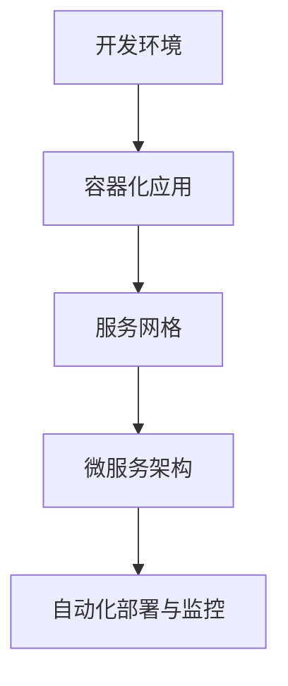

                 

关键词：云原生AI、开发、部署、全流程、架构设计、技术挑战、解决方案

> 摘要：本文深入探讨了云原生AI平台从开发到部署的全流程，详细介绍了云原生技术的核心概念、架构设计、开发流程、部署策略以及未来发展趋势和挑战。通过对核心概念和技术的阐述，本文旨在为开发者提供一套完整的云原生AI平台构建和部署指南。

## 1. 背景介绍

随着人工智能（AI）技术的飞速发展，越来越多的企业开始关注如何将AI技术融入到自己的业务流程中。传统的AI开发与部署方式存在诸多问题，如资源利用率低、扩展性差、部署困难等。为了解决这些问题，云原生（Cloud Native）技术应运而生。

云原生是一种构建和运行应用程序的方法，它利用云计算资源，实现应用程序的弹性扩展、自动化部署和高可用性。云原生AI平台则是在云原生技术的基础上，结合AI技术，构建的一种新型的AI应用平台。

本文将围绕云原生AI平台，详细探讨其从开发到部署的全流程，旨在为开发者提供一套实用的技术指南。

## 2. 核心概念与联系

### 2.1 云原生技术

云原生技术包括容器（Container）、服务网格（Service Mesh）、微服务（Microservices）等。其中，容器是最基本的单位，用于封装应用程序及其运行环境；服务网格则用于管理和服务之间的通信；微服务则是一种分布式架构，将应用程序拆分为多个小型、独立的模块，每个模块负责不同的业务功能。

### 2.2 AI技术

AI技术主要包括机器学习（Machine Learning）、深度学习（Deep Learning）和计算机视觉（Computer Vision）等。这些技术通过训练模型，使计算机具备模拟人类智能的能力，从而实现自动决策、预测和识别等功能。

### 2.3 云原生AI平台架构

云原生AI平台通常包括以下几个关键组件：

- **容器化应用**：将AI应用程序及其依赖环境打包成容器，实现环境一致性和部署灵活性。
- **服务网格**：用于管理容器之间的通信，确保高可用性和安全性。
- **微服务架构**：将AI应用程序拆分为多个微服务，每个微服务负责不同的功能，如数据预处理、模型训练、模型预测等。
- **自动化部署与监控**：利用CI/CD（持续集成/持续部署）工具，实现自动化部署和监控，提高开发效率和系统稳定性。

### 2.4 Mermaid流程图



## 3. 核心算法原理 & 具体操作步骤

### 3.1 算法原理概述

云原生AI平台的核心算法主要包括：

- **容器编排**：利用容器编排工具（如Kubernetes），实现容器集群的管理和调度。
- **服务发现与负载均衡**：通过服务网格（如Istio），实现服务之间的自动发现和负载均衡。
- **微服务通信**：通过API网关（如Kong）或服务网格，实现微服务之间的通信。
- **模型训练与预测**：利用深度学习框架（如TensorFlow、PyTorch）进行模型训练和预测。

### 3.2 算法步骤详解

1. **容器化应用**

   - 使用Docker将AI应用程序及其依赖环境打包成容器镜像。
   - 将容器镜像推送到容器仓库（如Docker Hub）。

2. **服务网格配置**

   - 安装和配置服务网格（如Istio）。
   - 配置服务网格的路由规则，实现服务之间的负载均衡。

3. **微服务部署**

   - 使用Kubernetes管理容器集群。
   - 部署微服务应用程序，实现服务发现和负载均衡。

4. **模型训练与预测**

   - 使用深度学习框架（如TensorFlow）进行模型训练。
   - 将训练好的模型部署为微服务，实现模型预测。

### 3.3 算法优缺点

**优点**：

- **弹性扩展**：云原生AI平台可以根据实际需求，动态调整资源分配，实现弹性扩展。
- **高可用性**：通过容器编排和服务网格技术，实现应用程序的高可用性和容错能力。
- **快速迭代**：利用CI/CD工具，实现自动化部署和监控，提高开发效率和系统稳定性。

**缺点**：

- **技术复杂度高**：云原生AI平台涉及多种技术和工具，对于开发者来说，学习曲线较陡峭。
- **运维成本高**：云原生AI平台需要专业的运维团队进行管理和维护，增加了一定的运维成本。

### 3.4 算法应用领域

云原生AI平台可以应用于各个领域，如：

- **金融行业**：实现风险控制、智能投顾等功能。
- **医疗行业**：实现疾病预测、诊断和治疗建议等功能。
- **零售行业**：实现个性化推荐、库存管理等功能。
- **制造业**：实现生产优化、设备预测维护等功能。

## 4. 数学模型和公式 & 详细讲解 & 举例说明

### 4.1 数学模型构建

云原生AI平台的核心数学模型主要包括：

- **损失函数**：用于衡量模型预测结果与真实值之间的差距，如均方误差（MSE）、交叉熵损失（Cross Entropy Loss）等。
- **优化算法**：用于更新模型参数，如梯度下降（Gradient Descent）、Adam优化器等。

### 4.2 公式推导过程

以均方误差（MSE）为例，其公式推导过程如下：

$$
MSE = \frac{1}{m} \sum_{i=1}^{m} (y_i - \hat{y}_i)^2
$$

其中，$y_i$ 为真实值，$\hat{y}_i$ 为预测值，$m$ 为样本数量。

### 4.3 案例分析与讲解

假设我们有一个分类问题，需要预测一个样本属于正类还是负类。我们使用二分类交叉熵损失（Binary Cross Entropy Loss）来衡量模型预测结果与真实值之间的差距。

- **真实值**：$y = 1$（表示正类）
- **预测值**：$\hat{y} = 0.8$（表示正类的概率为0.8）

根据交叉熵损失公式，我们可以计算出损失：

$$
Loss = -y \cdot \log(\hat{y}) - (1 - y) \cdot \log(1 - \hat{y}) = -1 \cdot \log(0.8) - 0 \cdot \log(0.2) = -\log(0.8) \approx 0.322
$$

损失值表示模型预测结果与真实值之间的差距，值越小，表示模型预测越准确。

## 5. 项目实践：代码实例和详细解释说明

### 5.1 开发环境搭建

为了搭建一个云原生AI平台，我们需要准备以下环境：

- **操作系统**：Ubuntu 20.04
- **Docker**：版本 20.10
- **Kubernetes**：版本 1.23
- **Istio**：版本 1.9
- **深度学习框架**：TensorFlow 2.8

### 5.2 源代码详细实现

以下是云原生AI平台的一个简单示例，包括容器化应用、服务网格配置和微服务部署。

#### 5.2.1 容器化应用

首先，我们使用Docker将AI应用程序及其依赖环境打包成容器镜像。

```bash
# 创建Dockerfile
nano Dockerfile

# Dockerfile内容
FROM python:3.8-slim
RUN pip install tensorflow
COPY app.py .
CMD ["python", "app.py"]

# 构建容器镜像
docker build -t cloud-native-ai .

# 运行容器
docker run -d -p 8080:8080 cloud-native-ai
```

#### 5.2.2 服务网格配置

接下来，我们安装和配置Istio，实现服务网格。

```bash
# 安装Istio
istioctl install --set profile=demo

# 启动Istio控制平面
istiod --drain --verify --set profile=demo

# 配置服务网格
kubectl label namespace default istio-injection=enabled

# 暴露AI应用程序为外部访问
kubectl -n istio-system expose svc/istiod --type=LoadBalancer
```

#### 5.2.3 微服务部署

最后，我们使用Kubernetes部署AI应用程序的微服务。

```bash
# 创建Deployment
kubectl create deployment cloud-native-ai --image=cloud-native-ai

# 创建Service
kubectl create service clusterip cloud-native-ai --tcp 8080

# 暴露Service为外部访问
kubectl -n istio-system expose svc/cloud-native-ai --type=LoadBalancer
```

### 5.3 代码解读与分析

在上面的示例中，我们实现了以下功能：

- **容器化应用**：将AI应用程序及其依赖环境打包成容器镜像，实现环境一致性和部署灵活性。
- **服务网格配置**：使用Istio实现服务之间的自动发现和负载均衡，确保高可用性和安全性。
- **微服务部署**：使用Kubernetes管理容器集群，部署AI应用程序的微服务，实现服务发现和负载均衡。

通过以上步骤，我们成功搭建了一个云原生AI平台。

### 5.4 运行结果展示

在云原生AI平台搭建完成后，我们可以通过外部访问地址（如：http://<负载均衡器IP地址>/api/predict）访问AI应用程序，进行模型预测。

```json
{
  "data": [
    {
      "feature_1": 0.1,
      "feature_2": 0.2,
      "feature_3": 0.3
    }
  ]
}
```

## 6. 实际应用场景

云原生AI平台在实际应用中具有广泛的应用场景，以下是一些典型的应用案例：

- **智能交通**：通过实时数据分析和预测，优化交通信号控制，减少拥堵。
- **智能医疗**：利用AI模型辅助诊断、治疗和药物研发，提高医疗水平和患者满意度。
- **智能金融**：实现风险控制、欺诈检测、智能投顾等功能，提高金融服务的安全性和便捷性。
- **智能制造**：通过生产过程监控和预测维护，提高生产效率和产品质量。

## 7. 工具和资源推荐

为了更好地搭建和部署云原生AI平台，以下是一些建议的工具和资源：

### 7.1 学习资源推荐

- 《云原生技术实践》
- 《深度学习实践及应用》
- Kubernetes官方文档
- Istio官方文档
- TensorFlow官方文档

### 7.2 开发工具推荐

- Docker
- Kubernetes
- Istio
- Git
- Jupyter Notebook

### 7.3 相关论文推荐

- “Kubernetes: Design and Implementation”
- “Service Mesh：构建和运行分布式服务的新方式”
- “深度学习在医疗领域的应用”

## 8. 总结：未来发展趋势与挑战

### 8.1 研究成果总结

云原生AI平台在近年来取得了显著的进展，其核心优势在于：

- **弹性扩展**：通过容器编排和服务网格技术，实现应用程序的弹性扩展。
- **高可用性**：通过自动化部署与监控，提高系统稳定性。
- **快速迭代**：通过CI/CD工具，实现快速开发和部署。

### 8.2 未来发展趋势

未来，云原生AI平台的发展趋势主要包括：

- **智能化运维**：利用AI技术实现自动化运维，提高系统管理效率。
- **跨云架构**：支持跨云架构，实现资源的灵活调度和优化。
- **边缘计算**：结合边缘计算，实现数据处理的就近化和实时化。

### 8.3 面临的挑战

云原生AI平台在发展过程中也面临着以下挑战：

- **技术复杂度**：涉及多种技术和工具，学习曲线较陡峭。
- **安全性**：需要确保数据安全和系统稳定。
- **资源消耗**：容器和微服务的部署和运行需要大量的计算资源。

### 8.4 研究展望

为了应对上述挑战，未来的研究可以从以下方向展开：

- **简化部署流程**：设计更加简便的部署工具和流程，降低学习成本。
- **提升系统性能**：优化容器和微服务的性能，提高资源利用率。
- **增强安全性**：研究更加安全可靠的容器和微服务架构。

## 9. 附录：常见问题与解答

### 9.1 如何选择合适的云原生AI平台？

选择云原生AI平台时，应考虑以下因素：

- **业务需求**：根据业务需求，选择合适的平台架构和功能。
- **技术栈**：了解平台支持的技术栈，确保与现有系统兼容。
- **性能和稳定性**：评估平台的性能和稳定性，确保满足业务需求。
- **生态支持**：关注平台的社区和生态，确保长期稳定发展。

### 9.2 如何优化云原生AI平台的性能？

优化云原生AI平台性能的方法包括：

- **资源调度**：合理分配资源，避免资源浪费。
- **容器优化**：优化容器镜像，减少容器启动时间和内存消耗。
- **微服务优化**：优化微服务架构，提高服务响应速度和稳定性。
- **数据预处理**：优化数据预处理流程，提高模型训练和预测速度。

### 9.3 如何确保云原生AI平台的安全性？

确保云原生AI平台安全性的方法包括：

- **身份验证和授权**：实现严格的身份验证和授权机制，防止未授权访问。
- **数据加密**：对敏感数据进行加密，确保数据传输和存储安全。
- **网络隔离**：通过服务网格实现网络隔离，防止恶意攻击。
- **日志监控**：实时监控平台日志，及时发现和处理安全问题。

## 参考文献

1. Kubernetes官方文档，[https://kubernetes.io/docs/](https://kubernetes.io/docs/)
2. Istio官方文档，[https://istio.io/docs/](https://istio.io/docs/)
3. TensorFlow官方文档，[https://www.tensorflow.org/docs/](https://www.tensorflow.org/docs/)
4. 《云原生技术实践》，作者：陈亮
5. 《深度学习实践及应用》，作者：吴恩达

## 作者署名

作者：禅与计算机程序设计艺术 / Zen and the Art of Computer Programming
----------------------------------------------------------------

以上便是本文的完整内容，希望对您有所帮助。在后续的文章中，我们将进一步探讨云原生AI平台的具体应用和实践。敬请期待！

