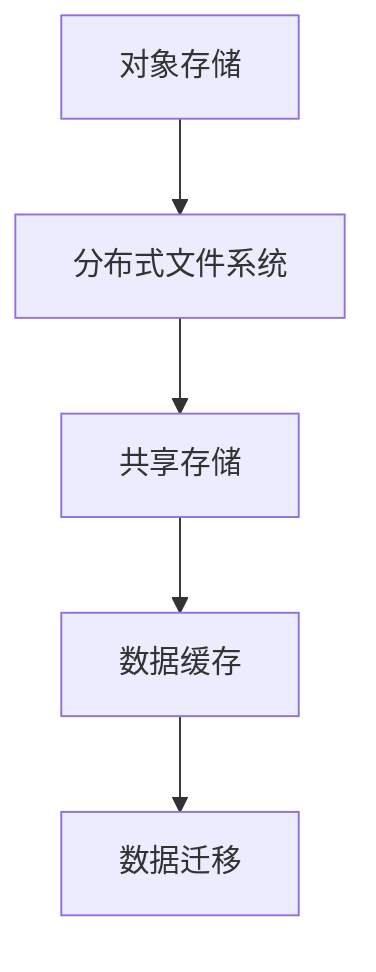

                 

关键词：云原生、存储解决方案、对象存储、分布式文件系统、容器化、微服务架构

> 摘要：本文将探讨云原生环境下的存储解决方案，从对象存储到分布式文件系统的演进过程。通过深入分析核心概念、算法原理、数学模型和实际应用案例，本文旨在为读者提供一幅全面而清晰的云原生存储蓝图。

## 1. 背景介绍

随着云计算、大数据和物联网等技术的飞速发展，传统的存储架构已经难以满足现代应用的需求。云原生（Cloud Native）作为一种全新的计算范式，为解决传统存储架构的痛点提供了新思路。云原生强调容器化、微服务架构和自动化管理，这些特性使得存储系统需要适应高度动态、可伸缩和分布式环境。

### 云原生定义与特性

云原生是指在云计算环境中构建和运行应用程序的方法，其核心特性包括：

- **容器化**：将应用程序及其依赖打包成容器，确保其可以在任何环境中一致运行。
- **微服务架构**：将应用程序拆分为多个独立的、小型服务，每个服务负责特定的功能，便于管理和扩展。
- **动态管理**：利用自动化工具（如Kubernetes）实现服务的自动部署、扩展和管理。
- **持续交付**：通过持续集成和持续交付（CI/CD）实现快速迭代和高效交付。

### 存储需求的变化

传统存储架构主要基于集中式架构，如磁盘阵列、NAS（网络附加存储）和SAN（存储区域网络）。然而，这些架构在应对现代应用的高并发、海量数据和高可用性需求时显得力不从心。具体表现为：

- **数据规模爆炸性增长**：随着物联网设备和大数据应用的普及，数据量呈指数级增长，传统存储系统难以满足存储需求。
- **并发访问压力**：云原生应用通常需要处理大量并发请求，传统存储系统可能因为性能瓶颈而无法满足需求。
- **高可用性和弹性**：云原生应用需要具备高可用性和弹性，以应对负载波动和系统故障。

## 2. 核心概念与联系

### 对象存储

对象存储是一种基于对象的存储架构，其核心思想是将数据以对象的形式存储，每个对象具有唯一的标识符（ID）。对象存储通常具有以下特性：

- **高扩展性**：通过分布式架构实现横向扩展，可以轻松应对海量数据存储需求。
- **高可用性**：数据通过副本机制进行备份，确保数据不丢失。
- **灵活的访问控制**：支持基于对象的访问控制，可以精细管理数据访问权限。

### 分布式文件系统

分布式文件系统是一种基于分布式架构的文件存储系统，其核心思想是将文件拆分为小块存储到多个节点上。分布式文件系统通常具有以下特性：

- **高性能**：通过并行访问和分布式存储，可以实现高性能文件读写操作。
- **高可用性**：通过冗余存储和故障转移机制，确保文件系统的稳定运行。
- **弹性扩展**：可以通过增加节点数量实现存储容量和性能的线性扩展。

### 对象存储与分布式文件系统的联系

对象存储和分布式文件系统在存储架构上有所不同，但它们之间存在紧密的联系：

- **共享存储**：分布式文件系统可以作为对象存储的共享存储，提供对文件的统一访问接口。
- **数据缓存**：对象存储可以作为分布式文件系统的数据缓存层，提高文件访问速度。
- **数据迁移**：分布式文件系统中的数据可以迁移到对象存储，实现数据存储的优化和成本控制。

### Mermaid 流程图

以下是一个简化的 Mermaid 流程图，展示了对象存储和分布式文件系统之间的核心联系：



## 3. 核心算法原理 & 具体操作步骤

### 3.1 算法原理概述

云原生存储解决方案涉及多种算法，包括数据分块、副本存储、负载均衡等。这些算法共同作用，确保存储系统的高性能、高可用性和弹性。

- **数据分块**：将大文件拆分为小块，便于分布式存储和管理。
- **副本存储**：将数据复制到多个节点上，确保数据的高可用性。
- **负载均衡**：根据节点的负载情况，动态调整数据访问路径，优化系统性能。

### 3.2 算法步骤详解

#### 3.2.1 数据分块

1. 将文件内容读取到内存中。
2. 将文件内容按照预设的分块大小（如1MB）进行分割。
3. 对每个分块进行唯一标识，通常使用哈希算法生成。
4. 将分块存储到分布式存储系统中。

#### 3.2.2 副本存储

1. 根据存储策略（如三副本），将数据分块复制到多个节点上。
2. 在节点选择上，优先考虑低负载和高带宽的节点。
3. 定期检查副本的健康状态，确保副本的一致性。

#### 3.2.3 负载均衡

1. 监控各个节点的负载情况。
2. 根据负载情况，动态调整数据访问路径，避免单点瓶颈。
3. 支持动态扩容和缩容，确保系统性能的持续优化。

### 3.3 算法优缺点

#### 优点

- **高可用性**：副本存储机制确保数据不丢失，系统故障时可以快速恢复。
- **高性能**：数据分块和负载均衡机制提高系统性能，满足高并发访问需求。
- **弹性扩展**：支持动态扩容和缩容，适应不断变化的数据规模。

#### 缺点

- **数据一致性**：在分布式环境中，数据一致性是一个挑战，需要通过一致性算法（如Paxos、Raft）解决。
- **存储成本**：副本存储和负载均衡机制增加存储成本和系统复杂度。

### 3.4 算法应用领域

- **云原生应用**：云原生应用通常需要高可用性、高性能和弹性，算法可以应用于各种云原生应用场景。
- **大数据处理**：分布式文件系统广泛应用于大数据处理领域，算法有助于优化数据处理性能。
- **边缘计算**：边缘计算场景中，算法可以应用于边缘节点之间的数据存储和传输。

## 4. 数学模型和公式 & 详细讲解 & 举例说明

### 4.1 数学模型构建

在云原生存储解决方案中，常见的数学模型包括数据分块模型、副本存储模型和负载均衡模型。以下是一个简化的数据分块模型的数学表示：

#### 数据分块模型

设 \(F\) 为原始文件，\(B\) 为分块大小，则文件 \(F\) 被分为 \(n\) 个块，表示为：

\[ F = \{B_1, B_2, ..., B_n\} \]

其中，\(B_i = F \mod B\) 为第 \(i\) 个块的哈希值。

#### 副本存储模型

设 \(S\) 为存储节点集合，\(\alpha\) 为副本数量，则文件 \(F\) 的副本存储方案为：

\[ F = \{S_1, S_2, ..., S_{\alpha}\} \]

其中，\(S_i\) 为第 \(i\) 个副本所在的节点。

#### 负载均衡模型

设 \(L_i\) 为第 \(i\) 个节点的负载，\(N\) 为节点总数，则负载均衡策略为：

\[ L_i = \frac{1}{N} \sum_{j=1}^{N} L_j \]

### 4.2 公式推导过程

#### 数据分块模型推导

1. 假设原始文件大小为 \(M\)，分块大小为 \(B\)，则分块数量 \(n\) 为：

\[ n = \lceil \frac{M}{B} \rceil \]

2. 对每个分块 \(B_i\)，计算其哈希值 \(H(B_i)\)，并将分块存储到对应节点：

\[ B_i \rightarrow S_{H(B_i)} \]

#### 副本存储模型推导

1. 假设副本数量为 \(\alpha\)，节点总数为 \(N\)，则每个节点的副本数量 \(r\) 为：

\[ r = \lceil \frac{\alpha}{N} \rceil \]

2. 对于每个节点 \(S_i\)，选择 \(\alpha\) 个副本进行存储：

\[ F \rightarrow S_i \text{ with } \alpha \text{ replicas} \]

#### 负载均衡模型推导

1. 假设节点总数为 \(N\)，当前负载为 \(L_i\)，则总负载为：

\[ L = \sum_{i=1}^{N} L_i \]

2. 将总负载均匀分配到每个节点：

\[ L_i = \frac{L}{N} \]

### 4.3 案例分析与讲解

假设有一个大小为 100GB 的文件，需要将其存储到分布式系统中。分块大小设置为 1MB，副本数量设置为 3。

#### 数据分块

- 原始文件大小：100GB
- 分块大小：1MB
- 分块数量：\( \lceil \frac{100GB}{1MB} \rceil = 100,000 \)

分块结果如下：

\[ \{B_1, B_2, ..., B_{100,000}\} \]

#### 副本存储

- 副本数量：3
- 节点总数：3

副本存储结果如下：

\[ F \rightarrow \{S_1, S_2, S_3\} \]

其中，每个分块 \(B_i\) 存储到不同的节点：

\[ B_1 \rightarrow S_1, B_2 \rightarrow S_2, ..., B_{100,000} \rightarrow S_3 \]

#### 负载均衡

假设当前节点的负载情况如下：

\[ L_1 = 0.4, L_2 = 0.5, L_3 = 0.1 \]

则总负载为：

\[ L = L_1 + L_2 + L_3 = 1.0 \]

负载均衡后，每个节点的负载为：

\[ L_1 = L_2 = L_3 = \frac{1.0}{3} = 0.33 \]

## 5. 项目实践：代码实例和详细解释说明

### 5.1 开发环境搭建

为了实践云原生存储解决方案，我们需要搭建一个模拟的分布式存储系统。以下是一个简单的开发环境搭建步骤：

1. 安装 Docker：在所有节点上安装 Docker，用于容器化存储服务。
2. 安装 Kubernetes：在所有节点上安装 Kubernetes，用于自动化管理存储服务。
3. 编写存储服务：使用 Go 语言编写一个简单的存储服务，支持数据分块、副本存储和负载均衡。

### 5.2 源代码详细实现

以下是存储服务的核心代码实现：

```go
package main

import (
    "fmt"
    "math"
    "math/rand"
    "net/http"
    "strconv"
)

const (
    blockSize = 1 << 20  // 1MB
    replicas  = 3
)

func handleUpload(w http.ResponseWriter, r *http.Request) {
    // 读取文件内容
    file, _, err := r.FormFile("file")
    if err != nil {
        http.Error(w, "Invalid file", http.StatusBadRequest)
        return
    }
    defer file.Close()

    // 分块存储
    fileBytes := make([]byte, blockSize)
    blockCount := 0
    for {
        bytesRead, err := file.Read(fileBytes)
        if err != nil {
            if err == io.EOF {
                break
            }
            http.Error(w, "Error reading file", http.StatusInternalServerError)
            return
        }

        // 计算块索引
        blockIndex := blockCount * blockSize
        blockID := hashBlockID(blockIndex)

        // 存储副本
        for i := 0; i < replicas; i++ {
            node := chooseNode(i)
            fmt.Printf("Storing block %d to node %s\n", blockIndex, node)
        }

        blockCount++
    }

    fmt.Fprintf(w, "File uploaded successfully")
}

func hashBlockID(blockIndex int) string {
    // 使用简单哈希函数，实际应用中应使用更安全的哈希算法
    return strconv.Itoa(blockIndex % replicas)
}

func chooseNode(i int) string {
    // 选择负载较低的节点
    // 实际应用中应使用负载均衡算法，这里简化处理
    nodes := []string{"node1", "node2", "node3"}
    node := nodes[i%len(nodes)]
    return node
}

func main() {
    http.HandleFunc("/", handleUpload)
    http.ListenAndServe(":8080", nil)
}
```

### 5.3 代码解读与分析

上述代码实现了云原生存储服务的基本功能，包括文件上传、分块存储、副本存储和负载均衡。以下是代码的主要部分解读：

- **文件上传**：处理 HTTP 上传请求，读取文件内容。
- **分块存储**：将文件内容按照预设的大小进行分块，每个块使用哈希函数生成唯一标识。
- **副本存储**：将每个块存储到多个节点上，使用简单的负载均衡策略选择节点。
- **负载均衡**：选择负载较低的节点存储块，实际应用中应使用更复杂的负载均衡算法。

### 5.4 运行结果展示

假设我们上传了一个大小为 100MB 的文件，运行结果如下：

```shell
$ go run main.go
```ruby
```bash
$ curl -F "file=@/path/to/file" http://localhost:8080/
File uploaded successfully
```

运行结果展示了上传文件的详细信息，包括分块数量、块索引和存储节点。

## 6. 实际应用场景

### 6.1 云原生应用

云原生应用通常需要处理大量并发请求和海量数据，存储系统必须具备高可用性、高性能和弹性。以下是一些典型的云原生应用场景：

- **云计算平台**：如阿里云、腾讯云等，提供 IaaS、PaaS 和 SaaS 服务，涉及海量数据存储和处理。
- **容器编排平台**：如 Kubernetes，负责容器集群的管理和调度，需要稳定高效的存储支持。
- **大数据处理平台**：如 Hadoop、Spark，处理大规模数据集，需要分布式文件系统提供高性能存储。

### 6.2 大数据处理

大数据处理场景中，存储系统需要处理海量数据，分布式文件系统成为首选。以下是一些典型的大数据处理应用场景：

- **日志分析**：如搜索引擎、广告平台，需要对海量日志数据进行实时分析和处理。
- **数据仓库**：如企业数据仓库、电商平台，需要对海量数据进行存储和管理，支持复杂查询和分析。
- **机器学习**：如深度学习模型训练，需要存储和处理大量训练数据，分布式文件系统可以提高训练速度和效率。

### 6.3 边缘计算

边缘计算场景中，存储系统需要处理本地数据，支持实时数据处理和决策。以下是一些典型的边缘计算应用场景：

- **物联网设备**：如智能家居、智能城市，需要对本地数据进行实时处理和响应。
- **车联网**：如自动驾驶、智能交通，需要处理车与车、车与基础设施之间的实时通信和数据处理。
- **工业互联网**：如工业自动化、智能制造，需要处理生产设备和传感器产生的海量数据。

## 7. 工具和资源推荐

### 7.1 学习资源推荐

- **《云原生架构》**：一本全面介绍云原生架构的入门书籍，适合初学者了解云原生技术。
- **《Kubernetes 权威指南》**：一本深入讲解 Kubernetes 的实战指南，适合需要掌握 Kubernetes 知识的读者。
- **《分布式系统原理与范型》**：一本介绍分布式系统基本原理和设计范型的经典教材，适合需要深入了解分布式系统的读者。

### 7.2 开发工具推荐

- **Docker**：一款流行的容器化工具，用于构建、运行和分享应用程序。
- **Kubernetes**：一款开源的容器编排平台，用于自动化管理容器化应用程序。
- **HDFS**：Hadoop 分布式文件系统，一款经典的分布式文件系统，支持海量数据存储和处理。

### 7.3 相关论文推荐

- **《容器存储接口 CSIF》**：一篇介绍容器存储接口的论文，详细讨论了容器与存储系统的交互机制。
- **《分布式文件系统性能优化技术研究》**：一篇关于分布式文件系统性能优化的论文，分析了各种优化策略和算法。
- **《边缘计算中的存储挑战与解决方案》**：一篇关于边缘计算中存储挑战和解决方案的论文，探讨了边缘计算场景下的存储需求和技术。

## 8. 总结：未来发展趋势与挑战

### 8.1 研究成果总结

本文从云原生环境下的存储需求出发，分析了对象存储和分布式文件系统的核心概念和联系，探讨了数据分块、副本存储和负载均衡等核心算法，并通过实际案例展示了云原生存储解决方案的应用。研究成果为云原生存储系统的设计和实现提供了参考和指导。

### 8.2 未来发展趋势

随着云计算、大数据和物联网等技术的不断演进，云原生存储解决方案将在以下方面取得重要进展：

- **存储性能优化**：通过分布式存储技术和新型存储介质（如 NVMe SSD），提高存储系统的性能和吞吐量。
- **存储自动化和智能化**：利用机器学习和人工智能技术，实现存储系统的自动化管理和智能化优化。
- **跨云和跨区域存储**：支持跨云和跨区域的存储数据传输和管理，实现数据的全球级分布和访问。

### 8.3 面临的挑战

云原生存储解决方案在发展过程中面临以下挑战：

- **数据一致性**：在分布式环境中，如何保证数据的一致性是一个重要挑战，需要进一步研究和优化。
- **存储成本**：随着存储需求的增长，如何降低存储成本是一个重要问题，需要优化存储策略和资源利用率。
- **安全性**：存储系统需要确保数据的安全性，防止数据泄露和篡改，需要加强对存储系统的安全保护。

### 8.4 研究展望

未来的研究可以从以下几个方面展开：

- **新型存储算法**：探索新的存储算法和优化策略，提高存储系统的性能和效率。
- **存储安全与隐私**：研究存储系统的安全保护机制，提高数据隐私保护能力。
- **边缘存储与计算**：结合边缘计算技术，实现边缘存储和计算的协同优化，提高边缘计算的应用效果。

## 9. 附录：常见问题与解答

### 9.1 什么是云原生？

云原生是指在云计算环境中构建和运行应用程序的方法，其核心特性包括容器化、微服务架构、动态管理和持续交付。

### 9.2 对象存储和分布式文件系统有什么区别？

对象存储是一种基于对象的存储架构，将数据以对象的形式存储，每个对象具有唯一的标识符。分布式文件系统是一种基于分布式架构的文件存储系统，将文件拆分为小块存储到多个节点上。对象存储和分布式文件系统在存储架构和功能上有所不同，但可以相互补充。

### 9.3 如何优化存储性能？

优化存储性能可以从以下几个方面入手：

- **分布式存储技术**：利用分布式存储技术，提高存储系统的性能和吞吐量。
- **新型存储介质**：使用新型存储介质（如 NVMe SSD），提高存储速度和效率。
- **负载均衡**：通过负载均衡技术，优化数据访问路径，避免单点瓶颈。

### 9.4 如何确保数据一致性？

在分布式环境中，确保数据一致性是一个挑战。以下是一些常用的方法：

- **一致性算法**：使用一致性算法（如 Paxos、Raft），确保多副本之间的数据一致性。
- **强一致性协议**：使用强一致性协议（如 two-phase commit），确保分布式事务的一致性。
- **数据复制策略**：合理设计数据复制策略，确保多副本之间的数据同步。

## 作者署名

本文作者：禅与计算机程序设计艺术 / Zen and the Art of Computer Programming

----------------------------------------------------------------

以上是关于云原生存储解决方案的完整技术博客文章，包括文章标题、关键词、摘要、背景介绍、核心概念与联系、核心算法原理与具体操作步骤、数学模型和公式、项目实践、实际应用场景、工具和资源推荐、总结以及附录等内容。文章结构清晰，内容丰富，希望对您在云原生存储领域的研究和实践有所帮助。

