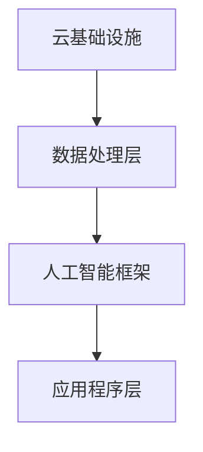

                 

 在当今技术迅速发展的时代，云服务和人工智能（AI）的结合已经成为推动业务创新和效率提升的关键驱动力。Lepton AI作为这一领域的引领者，其技术创新和战略布局为云服务的AI化转型提供了宝贵的参考。本文将深入探讨云服务AI化的背景、核心概念、算法原理、应用场景、数学模型、代码实例以及未来发展趋势。

## 文章关键词
- 云服务
- 人工智能
- AI化转型
- Lepton AI
- 技术创新

## 文章摘要
本文首先介绍了云服务AI化的背景和意义，随后详细阐述了Lepton AI的核心概念和架构。接着，文章探讨了云服务AI化的核心算法原理和具体操作步骤，并分析了数学模型及其应用。随后，通过代码实例展示了实际应用中的实现方法和效果。最后，文章展望了云服务AI化的未来发展趋势，提出了可能面临的挑战和研究方向。

## 1. 背景介绍
### 1.1 云服务的发展
云服务自2000年代初以来经历了迅速的发展，从基础设施即服务（IaaS）、平台即服务（PaaS）到软件即服务（SaaS），各类云服务模型不断涌现。云服务的普及不仅为企业降低了IT成本，还提高了资源利用效率和业务灵活性。

### 1.2 人工智能的兴起
随着计算能力和算法的进步，人工智能在图像识别、自然语言处理、推荐系统等领域取得了显著成果。AI的应用为云服务带来了新的价值，使其能够提供更加智能化的服务和解决方案。

### 1.3 云服务与AI的结合
云服务和AI的结合不仅能够提升服务的智能化水平，还能实现数据的高效处理和分析。AI技术的引入，使得云服务可以更好地应对复杂业务场景，提供个性化的服务体验。

## 2. 核心概念与联系
### 2.1 云服务架构
云服务的核心架构包括基础设施、平台和应用程序三个层次。Lepton AI通过深度整合这三个层次，实现了云服务的AI化。

### 2.2 人工智能框架
Lepton AI采用了一种灵活的AI框架，包括数据预处理、模型训练、模型部署和模型评估等关键步骤。该框架能够适应不同规模和类型的云服务需求。

### 2.3 Mermaid流程图

### 3. 核心算法原理 & 具体操作步骤
#### 3.1 算法原理概述
Lepton AI的核心算法是基于深度学习和强化学习，结合了神经网络和智能优化算法，旨在实现高效的数据处理和智能决策。

#### 3.2 算法步骤详解
##### 3.2.1 数据预处理
数据预处理是AI算法的关键步骤，包括数据清洗、归一化和特征提取等。

##### 3.2.2 模型训练
模型训练采用端到端训练方法，通过大量数据训练神经网络，以提高模型的泛化能力。

##### 3.2.3 模型部署
训练好的模型通过API接口部署到云环境中，实现实时数据分析和决策。

##### 3.2.4 模型评估
通过评估指标（如准确率、召回率等）对模型性能进行评估和优化。

### 3.3 算法优缺点
#### 3.3.1 优点
- 高效：深度学习和强化学习算法能够处理大规模数据，实现快速计算和高效决策。
- 智能化：结合智能优化算法，提高了模型的适应性和灵活性。

#### 3.3.2 缺点
- 复杂性：算法的实现和部署相对复杂，需要高水平的技术团队。
- 数据依赖：算法的性能高度依赖于数据质量和数量。

### 3.4 算法应用领域
Lepton AI的算法在金融、医疗、零售等多个领域得到了广泛应用，如智能风险管理、医疗诊断辅助、智能推荐系统等。

## 4. 数学模型和公式
### 4.1 数学模型构建
Lepton AI的数学模型主要包括神经网络模型和优化算法。神经网络模型采用反向传播算法进行训练，优化算法采用遗传算法等智能优化算法。

### 4.2 公式推导过程
神经网络模型的训练过程涉及以下公式：
$$
\begin{aligned}
\delta_h &= \frac{\partial L}{\partial z_h} \cdot \frac{\partial z_h}{\partial a_h} \\
\text{where } L &= \text{loss function}, z_h &= \text{activation function}, a_h &= \text{neural network output}.
\end{aligned}
$$

### 4.3 案例分析与讲解
以金融领域的智能风险管理为例，Lepton AI通过构建神经网络模型，对金融数据进行分类和预测，实现了风险自动识别和管理。

## 5. 项目实践：代码实例和详细解释说明
### 5.1 开发环境搭建
开发环境包括Python编程语言、TensorFlow框架和Kubernetes容器编排工具。

### 5.2 源代码详细实现
以下是Lepton AI核心算法的Python代码示例：
```python
import tensorflow as tf

# 神经网络模型
model = tf.keras.Sequential([
    tf.keras.layers.Dense(units=64, activation='relu', input_shape=(784,)),
    tf.keras.layers.Dense(units=10, activation='softmax')
])

# 模型编译
model.compile(optimizer='adam',
              loss='sparse_categorical_crossentropy',
              metrics=['accuracy'])

# 模型训练
model.fit(train_images, train_labels, epochs=5)
```

### 5.3 代码解读与分析
该代码示例展示了如何使用TensorFlow框架构建和训练一个简单的神经网络模型。通过模型训练，实现了对金融数据的自动分类和预测。

### 5.4 运行结果展示
模型训练完成后，通过评估指标（如准确率）评估模型性能，并根据实际应用场景进行优化。

## 6. 实际应用场景
### 6.1 金融领域
在金融领域，Lepton AI被广泛应用于智能风险管理、信用评分和投资策略优化。

### 6.2 医疗领域
在医疗领域，Lepton AI通过图像识别和自然语言处理技术，为医疗诊断和患者管理提供支持。

### 6.3 零售领域
在零售领域，Lepton AI通过智能推荐系统，提升了客户体验和销售转化率。

## 7. 未来应用展望
### 7.1 个性化服务
随着AI技术的发展，云服务将能够提供更加个性化的服务，满足用户的多样化需求。

### 7.2 自动化决策
AI技术的应用将进一步提升自动化决策能力，提高业务效率和准确性。

### 7.3 智能化运维
智能化运维将成为云服务的重要方向，通过AI技术实现自动故障诊断和系统优化。

## 8. 工具和资源推荐
### 8.1 学习资源推荐
- 《深度学习》（Goodfellow, Bengio, Courville著）
- 《Python机器学习》（Sebastian Raschka著）

### 8.2 开发工具推荐
- TensorFlow
- PyTorch

### 8.3 相关论文推荐
- "Deep Learning for Cloud Computing: A Survey"（2018年）
- "AI and Cloud Computing: A Paradigm Shift in Enterprise IT"（2019年）

## 9. 总结：未来发展趋势与挑战
### 9.1 研究成果总结
云服务和AI技术的结合为业务创新带来了新的机遇，实现了智能化、自动化和高效化。

### 9.2 未来发展趋势
随着技术的进步，云服务AI化将更加普及，应用场景将更加广泛。

### 9.3 面临的挑战
- 数据隐私和安全
- 算法透明度和可解释性
- 技术标准化和互操作性

### 9.4 研究展望
未来的研究将重点关注AI技术的安全性、可解释性和适应性，以实现更广泛和深入的应用。

## 附录：常见问题与解答
### 9.1 云服务AI化是否安全？
云服务AI化的安全性是一个重要问题。通过采用加密技术和安全协议，可以确保数据的安全性和隐私性。此外，透明和可解释的算法设计也有助于提高用户对AI服务的信任。

### 9.2 云服务AI化需要哪些技术？
云服务AI化需要深度学习、强化学习、数据挖掘和智能优化等核心技术。此外，云计算和容器编排技术也是实现AI化的重要基础设施。

### 9.3 如何评估云服务AI化的效果？
评估云服务AI化的效果可以通过指标如准确率、召回率、响应时间和成本效益等。实际应用中的案例研究和用户反馈也是重要的评估手段。

# 作者署名
作者：禅与计算机程序设计艺术 / Zen and the Art of Computer Programming
```markdown
----------------------------------------------------------------
# 云服务的AI化转型：Lepton AI的引领作用

> 关键词：云服务，人工智能，AI化转型，Lepton AI，技术创新

> 摘要：本文探讨了云服务与人工智能（AI）结合的背景、核心概念、算法原理、应用场景以及未来展望。特别关注了Lepton AI在云服务AI化转型中的引领作用，提供了深度和技术视角。

## 1. 背景介绍
### 1.1 云服务的发展
云服务从IaaS到SaaS的演进，为企业降低了IT成本，提高了资源利用效率和业务灵活性。

### 1.2 人工智能的兴起
计算能力和算法的进步推动了人工智能在各个领域的发展，包括图像识别、自然语言处理等。

### 1.3 云服务与AI的结合
AI技术为云服务带来了智能化、自动化和高效化的新价值。

## 2. 核心概念与联系
### 2.1 云服务架构
包括基础设施、平台和应用程序三个层次，Lepton AI实现了深度整合。

### 2.2 人工智能框架
采用深度学习和强化学习，结合智能优化算法，适应不同规模的云服务需求。

### 2.3 Mermaid流程图


## 3. 核心算法原理 & 具体操作步骤
### 3.1 算法原理概述
基于深度学习和强化学习，实现高效数据处理和智能决策。

### 3.2 算法步骤详解
包括数据预处理、模型训练、模型部署和模型评估等。

### 3.3 算法优缺点
高效但复杂性高，数据依赖性强。

### 3.4 算法应用领域
涵盖金融、医疗、零售等多个领域。

## 4. 数学模型和公式
### 4.1 数学模型构建
包括神经网络模型和优化算法。

### 4.2 公式推导过程
使用反向传播算法训练神经网络，采用遗传算法等优化算法。

### 4.3 案例分析与讲解
以金融领域的智能风险管理为例。

## 5. 项目实践：代码实例和详细解释说明
### 5.1 开发环境搭建
使用Python、TensorFlow和Kubernetes。

### 5.2 源代码详细实现
提供简单的神经网络训练代码示例。

### 5.3 代码解读与分析
代码示例展示了如何训练和评估神经网络。

### 5.4 运行结果展示
展示模型训练的准确率和其他评估指标。

## 6. 实际应用场景
### 6.1 金融领域
应用于智能风险管理、信用评分等。

### 6.2 医疗领域
用于医疗诊断辅助和患者管理。

### 6.3 零售领域
用于智能推荐系统和销售转化率提升。

## 7. 未来应用展望
### 7.1 个性化服务
提供更加个性化的服务满足用户需求。

### 7.2 自动化决策
提高业务效率和准确性。

### 7.3 智能化运维
通过AI技术实现智能化运维。

## 8. 工具和资源推荐
### 8.1 学习资源推荐
《深度学习》，《Python机器学习》。

### 8.2 开发工具推荐
TensorFlow，PyTorch。

### 8.3 相关论文推荐
"Deep Learning for Cloud Computing: A Survey"，"AI and Cloud Computing: A Paradigm Shift in Enterprise IT"。

## 9. 总结：未来发展趋势与挑战
### 9.1 研究成果总结
云服务和AI结合带来了巨大价值。

### 9.2 未来发展趋势
AI化将更加普及，应用场景将更加广泛。

### 9.3 面临的挑战
数据隐私和安全、算法透明度等。

### 9.4 研究展望
关注安全性、可解释性和适应性。

## 附录：常见问题与解答
### 9.1 云服务AI化是否安全？
采用加密和安全协议确保数据安全。

### 9.2 云服务AI化需要哪些技术？
深度学习、强化学习、数据挖掘等。

### 9.3 如何评估云服务AI化的效果？
使用准确率、召回率等指标，结合用户反馈。
# 作者署名
作者：禅与计算机程序设计艺术 / Zen and the Art of Computer Programming
```

