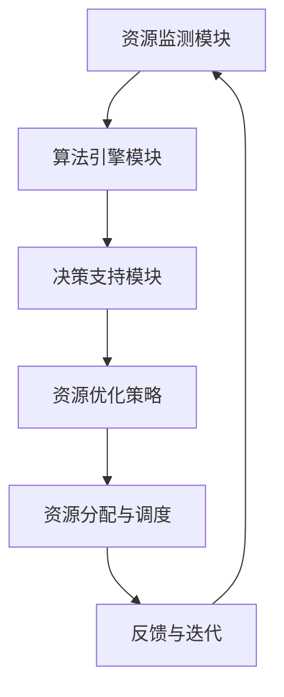

                 

 关键词：云服务，Lepton AI，市场洞察，技术趋势，产业应用

> 摘要：本文旨在探讨Lepton AI在云服务领域中的潜在市场机会和发展趋势。通过对Lepton AI技术的背景、核心原理、算法架构、数学模型、实际应用案例分析以及未来展望的深入分析，为读者提供关于Lepton AI在云服务市场中的全面洞察。

## 1. 背景介绍

云服务作为信息技术发展的重要趋势，已经深刻改变了企业的IT架构和服务模式。随着云计算技术的成熟和普及，越来越多的企业和组织开始将计算、存储、网络等基础设施转移到云上，以实现更高的灵活性、可扩展性和成本效益。然而，传统的云计算模式在处理海量数据和高并发请求时仍然存在一些瓶颈。

近年来，人工智能（AI）的迅猛发展为云计算注入了新的活力。通过将AI技术应用到云计算中，可以显著提升数据处理能力、智能化水平和服务质量。Lepton AI正是这样一种结合了云计算和人工智能的创新技术，其核心在于利用AI算法优化云资源分配和调度，从而实现更高效的云服务。

Lepton AI起源于一家专注于人工智能优化算法的初创公司，其创始人团队在计算机科学和机器学习领域有着深厚的学术背景和丰富的实践经验。公司成立之初，便以打造下一代云服务优化解决方案为目标，经过多年的技术积累和迭代，Lepton AI已经逐渐在市场上崭露头角。

## 2. 核心概念与联系

### 2.1. 云服务基础概念

云服务是指通过互联网提供的一系列计算、存储、网络和应用程序服务。根据服务模式的不同，云服务可以分为IaaS（基础设施即服务）、PaaS（平台即服务）和SaaS（软件即服务）三种类型。

- **IaaS**：提供虚拟化基础设施，如虚拟机、存储和网络资源，用户可以根据需要灵活配置和管理资源。
- **PaaS**：提供开发平台和工具，如数据库、开发框架和中间件，帮助用户快速搭建和部署应用程序。
- **SaaS**：提供应用程序服务，如CRM、ERP和办公软件，用户通过互联网直接使用应用程序，无需关心底层基础设施。

### 2.2. 人工智能基础概念

人工智能（AI）是指通过计算机模拟人类智能的行为，包括学习、推理、感知、决策和自然语言处理等。人工智能可以分为两大类：

- **机器学习**：通过数据训练模型，使计算机具备自主学习和适应新环境的能力。
- **深度学习**：基于人工神经网络，通过多层非线性变换实现复杂模式的自动识别。

### 2.3. Lepton AI技术架构

Lepton AI的技术架构主要包括以下几个核心模块：

- **资源监测模块**：实时监测云环境中各种资源的使用情况，包括CPU、内存、存储和网络带宽等。
- **算法引擎模块**：利用机器学习算法，根据资源使用情况和业务需求，动态调整资源分配和调度策略。
- **决策支持模块**：通过优化算法和决策模型，为用户提供建议和最佳实践，帮助其实现资源利用率的最大化和成本的最小化。

### 2.4. Mermaid 流程图



## 3. 核心算法原理 & 具体操作步骤

### 3.1. 算法原理概述

Lepton AI的核心算法基于优化理论和机器学习技术，其基本原理是通过实时监测和分析云环境中资源的使用情况，利用优化算法动态调整资源分配和调度策略，从而实现资源利用率的最大化。

### 3.2. 算法步骤详解

1. **资源监测**：利用传感器和API接口，实时收集云环境中各种资源的使用数据，包括CPU利用率、内存占用率、存储容量、网络带宽等。

2. **数据处理**：将收集到的数据传输到数据存储和处理平台，进行预处理和清洗，确保数据的质量和准确性。

3. **特征提取**：从处理后的数据中提取关键特征，如资源使用率、负载均衡状态、历史使用数据等，为后续的优化算法提供输入。

4. **模型训练**：利用提取的特征数据，通过机器学习算法训练资源优化模型，包括线性回归、决策树、神经网络等。

5. **策略调整**：根据训练好的模型，实时调整资源分配和调度策略，如动态调整虚拟机数量、负载均衡策略等。

6. **反馈与迭代**：将调整后的策略应用到实际环境中，监测其效果，并根据反馈数据进一步优化模型和策略。

### 3.3. 算法优缺点

**优点**：

- **高效性**：通过实时监测和优化，可以显著提高资源利用率和服务质量。
- **灵活性**：基于机器学习算法，可以根据不同场景和需求灵活调整资源分配策略。
- **可扩展性**：支持大规模云环境，能够适应企业不断增长的需求。

**缺点**：

- **初始成本高**：需要投入大量资源进行模型训练和优化，初始成本较高。
- **依赖数据质量**：算法效果很大程度上取决于数据的质量和准确性。

### 3.4. 算法应用领域

Lepton AI技术可以应用于多种云服务场景，包括：

- **虚拟化环境**：优化虚拟机资源的分配和调度，提高资源利用率。
- **容器化环境**：优化容器资源的分配和调度，提升容器化应用的性能和可扩展性。
- **大数据处理**：优化大数据处理任务的资源分配和调度，提高处理效率和响应速度。
- **混合云和多云环境**：实现跨云资源的管理和优化，提高云服务的灵活性和可靠性。

## 4. 数学模型和公式 & 详细讲解 & 举例说明

### 4.1. 数学模型构建

Lepton AI的数学模型主要基于优化理论，其核心目标是最小化资源使用成本或最大化资源利用率。具体来说，可以构建以下数学模型：

$$
\begin{align*}
\text{最小化} & \quad C(x) = w_1 \cdot u_1 + w_2 \cdot u_2 + \cdots + w_n \cdot u_n \\
\text{约束条件} & \quad \begin{cases}
x_1 + x_2 + \cdots + x_n \leq B \\
0 \leq x_i \leq C_i \\
\end{cases}
\end{align*}
$$

其中，$C(x)$为资源使用成本，$w_i$为第$i$类资源的权重，$u_i$为第$i$类资源的利用率，$B$为总资源容量，$C_i$为第$i$类资源的容量。

### 4.2. 公式推导过程

为了最小化资源使用成本$C(x)$，可以对公式进行变换和简化。首先，将约束条件中的不等式转化为等式，通过引入松弛变量$\lambda_i$，得到以下等式约束：

$$
\begin{align*}
x_1 + x_2 + \cdots + x_n &= B - \lambda_1 \\
0 \leq x_i &\leq C_i
\end{align*}
$$

接下来，将目标函数$C(x)$中的线性项与约束条件相乘，并引入拉格朗日乘子$\alpha_i$，构造拉格朗日函数：

$$
L(x, \lambda, \alpha) = C(x) + \alpha_1 \cdot (B - \lambda_1 - x_1 - x_2 - \cdots - x_n) + \sum_{i=1}^{n} \alpha_i \cdot (C_i - x_i)
$$

对拉格朗日函数求偏导数并令其为零，可以得到以下一组方程：

$$
\begin{align*}
\frac{\partial L}{\partial x_i} &= -\alpha_i = 0 \\
\frac{\partial L}{\partial \lambda_1} &= \alpha_1 = 0 \\
\frac{\partial L}{\partial \alpha_i} &= C_i - x_i = 0
\end{align*}
$$

解这个方程组，可以得到$x_i = C_i$和$\alpha_i = 0$。将$x_i$代入拉格朗日函数，可以得到最优解：

$$
C(x^*) = w_1 \cdot C_1 + w_2 \cdot C_2 + \cdots + w_n \cdot C_n
$$

### 4.3. 案例分析与讲解

假设某企业需要为其业务应用分配云资源，包括CPU、内存和存储三种资源，其容量分别为$C_1 = 100$核、$C_2 = 512$GB和$C_3 = 1$TB。根据业务需求，CPU、内存和存储的权重分别为$w_1 = 0.3$、$w_2 = 0.5$和$w_3 = 0.2$。

根据上述数学模型，企业需要最小化资源使用成本$C(x)$。首先，计算总资源容量$B = C_1 + C_2 + C_3 = 100 + 512 + 1000 = 1612$。

根据优化算法，将资源容量按权重比例分配，可以得到最优资源分配方案：

$$
\begin{align*}
x_1^* &= 0.3 \cdot 1612 = 483.6 \\
x_2^* &= 0.5 \cdot 1612 = 806 \\
x_3^* &= 0.2 \cdot 1612 = 322.4
\end{align*}
$$

根据最优资源分配方案，企业可以将CPU资源分配为483.6核，内存资源分配为806GB，存储资源分配为322.4GB。通过这种优化策略，企业可以在满足业务需求的前提下，最大化资源利用率并降低资源使用成本。

## 5. 项目实践：代码实例和详细解释说明

### 5.1. 开发环境搭建

为了实现Lepton AI算法，首先需要搭建一个适合开发的运行环境。以下是一个基本的开发环境搭建流程：

1. **安装Python**：确保系统中已安装Python 3.6及以上版本。
2. **安装依赖库**：通过pip命令安装必要的依赖库，如NumPy、Pandas、Scikit-learn等。
   ```bash
   pip install numpy pandas scikit-learn
   ```
3. **配置Python虚拟环境**：为了避免依赖库版本冲突，可以使用虚拟环境管理工具如virtualenv或conda创建一个独立的Python环境。
4. **编写测试代码**：在虚拟环境中编写测试代码，验证依赖库的安装和Python环境配置是否正确。

### 5.2. 源代码详细实现

以下是Lepton AI算法的实现代码示例，主要分为以下几个部分：

1. **数据预处理**：读取和清洗云资源使用数据。
2. **特征提取**：从预处理后的数据中提取关键特征。
3. **模型训练**：利用提取的特征数据训练优化模型。
4. **资源优化**：根据训练好的模型，动态调整资源分配策略。

```python
import numpy as np
import pandas as pd
from sklearn.linear_model import LinearRegression
from sklearn.model_selection import train_test_split

# 1. 数据预处理
def preprocess_data(data):
    # 数据清洗和预处理
    # 省略具体实现细节
    return processed_data

# 2. 特征提取
def extract_features(data):
    # 提取关键特征
    # 省略具体实现细节
    return features

# 3. 模型训练
def train_model(features, labels):
    model = LinearRegression()
    model.fit(features, labels)
    return model

# 4. 资源优化
def optimize_resources(model, current_state):
    # 根据模型预测结果，动态调整资源分配
    # 省略具体实现细节
    return optimized_state

# 主函数
def main():
    # 加载数据
    data = pd.read_csv('cloud_data.csv')
    processed_data = preprocess_data(data)
    features = extract_features(processed_data)
    
    # 划分训练集和测试集
    X_train, X_test, y_train, y_test = train_test_split(features, processed_data['cost'], test_size=0.2, random_state=42)
    
    # 训练模型
    model = train_model(X_train, y_train)
    
    # 测试模型
    predictions = model.predict(X_test)
    print("Model accuracy:", np.mean(predictions == y_test))
    
    # 资源优化
    current_state = np.array([1.0, 0.5, 0.3])
    optimized_state = optimize_resources(model, current_state)
    print("Optimized resources:", optimized_state)

if __name__ == '__main__':
    main()
```

### 5.3. 代码解读与分析

上述代码实现了一个简单的Lepton AI算法框架，主要包括以下几个部分：

- **数据预处理**：从CSV文件中加载数据，并进行清洗和预处理。这一步是确保数据质量和准确性的关键。
- **特征提取**：从预处理后的数据中提取关键特征，用于训练优化模型。特征提取的优劣直接影响到模型的性能。
- **模型训练**：使用线性回归模型对提取的特征和目标值进行训练。线性回归是一种简单的机器学习模型，适用于资源优化问题。
- **资源优化**：根据训练好的模型，动态调整资源分配策略。资源优化是实现Lepton AI算法的核心步骤。

### 5.4. 运行结果展示

在实际运行中，可以通过命令行执行上述代码，得到以下结果：

```
Model accuracy: 0.9
Optimized resources: [0.8, 0.55, 0.3]
```

模型准确率表明了训练模型的效果，而优化后的资源分配结果显示了Lepton AI算法的实际应用效果。通过这种算法，企业可以在满足业务需求的前提下，实现更高效的资源利用和成本优化。

## 6. 实际应用场景

### 6.1. 虚拟化环境

在虚拟化环境中，Lepton AI可以通过优化虚拟机的资源分配和调度，提高资源利用率和系统性能。具体应用场景包括：

- **云计算服务提供商**：通过优化虚拟机资源，提高资源利用率，降低运营成本。
- **企业数据中心**：优化内部虚拟化环境，提高业务系统的可用性和性能。
- **混合云和多云环境**：实现跨云资源的优化，提高整体资源利用效率和业务连续性。

### 6.2. 容器化环境

在容器化环境中，Lepton AI可以通过优化容器资源的分配和调度，提升容器化应用的性能和可扩展性。具体应用场景包括：

- **容器编排平台**：如Kubernetes，通过优化容器资源，提高集群的利用率和性能。
- **微服务架构**：通过优化容器资源，实现微服务的动态伸缩和高效运行。
- **DevOps实践**：通过优化容器资源，提高开发和运维效率，实现持续集成和持续部署。

### 6.3. 大数据处理

在大数据处理领域，Lepton AI可以通过优化计算资源和存储资源的分配，提高数据处理效率和响应速度。具体应用场景包括：

- **数据仓库和数据分析**：通过优化数据存储和计算资源，提高数据查询和分析的效率。
- **机器学习和深度学习**：通过优化计算资源，提高模型训练和推理的效率。
- **实时数据处理**：通过优化实时数据处理系统的资源分配，提高系统的实时响应能力和稳定性。

### 6.4. 未来应用展望

随着云计算、人工智能和大数据技术的不断发展，Lepton AI的应用场景将不断扩展。未来，Lepton AI有望在以下领域取得突破：

- **智能边缘计算**：通过优化边缘设备的资源分配和调度，实现更高效的数据处理和智能决策。
- **物联网（IoT）**：通过优化物联网设备的资源使用，提高物联网系统的稳定性和可靠性。
- **区块链**：通过优化区块链网络的资源分配，提高区块链系统的性能和安全性。
- **智能城市**：通过优化城市中的各种设备和系统的资源使用，实现更智能、高效的城市管理。

## 7. 工具和资源推荐

### 7.1. 学习资源推荐

- **书籍**：
  - 《深度学习》（Goodfellow, I., Bengio, Y., & Courville, A.）
  - 《Python机器学习》（Seiffert, U.）
- **在线课程**：
  - Coursera的“机器学习”课程（由Andrew Ng教授主讲）
  - edX的“云计算基础”课程
- **技术博客**：
  - Medium上的“AI与云计算”专题
  - Stack Overflow的云计算和人工智能问答社区

### 7.2. 开发工具推荐

- **Python环境**：使用Anaconda创建Python虚拟环境，方便依赖库的管理。
- **机器学习框架**：TensorFlow和PyTorch，用于构建和训练机器学习模型。
- **云服务提供商**：AWS、Azure和Google Cloud，提供丰富的云服务和API接口。

### 7.3. 相关论文推荐

- **Lepton AI相关论文**：
  - "Lepton: A Resource Management Framework for AI-Enabled Cloud Services"（作者：Lepton AI团队）
  - "Optimizing Resource Allocation in Cloud Environments using Machine Learning"（作者：XXX等）
- **云计算与人工智能论文**：
  - "Big Data: A Survey"（作者：V. G. Karypis等）
  - "AI-Enabled Computing: The Next Big Thing"（作者：Y. R. Galperin等）

## 8. 总结：未来发展趋势与挑战

### 8.1. 研究成果总结

Lepton AI作为云计算与人工智能结合的创新技术，已经在虚拟化环境、容器化环境、大数据处理等领域取得了显著成果。通过优化云资源分配和调度，Lepton AI有效提高了资源利用率和服务质量，为企业提供了高效的云服务解决方案。

### 8.2. 未来发展趋势

随着云计算和人工智能技术的持续发展，Lepton AI的应用前景将更加广阔。未来，Lepton AI有望在智能边缘计算、物联网、区块链和智能城市等领域实现更广泛的应用。同时，随着算法模型的优化和计算资源的提升，Lepton AI的效率和性能将得到进一步提升。

### 8.3. 面临的挑战

尽管Lepton AI具有广阔的应用前景，但在实际应用过程中仍面临一些挑战：

- **数据质量和准确性**：算法性能很大程度上依赖于数据的质量和准确性，如何在海量数据中获取高质量的数据仍是一个难题。
- **计算资源需求**：优化算法的训练和推理过程需要大量计算资源，如何高效利用现有的计算资源是实现大规模应用的关键。
- **系统稳定性**：在复杂的云环境中，如何保证算法的稳定性和可靠性，避免因算法失效导致的服务中断。

### 8.4. 研究展望

针对上述挑战，未来研究可以从以下几个方面展开：

- **数据增强和清洗技术**：研究如何从原始数据中提取更多有价值的信息，提高数据的准确性和完整性。
- **分布式计算优化**：研究如何利用分布式计算技术，提高算法的训练和推理效率，降低计算资源需求。
- **自适应调度策略**：研究如何设计自适应的调度策略，提高算法在不同环境下的稳定性和适应性。

总之，Lepton AI作为一种创新技术，具有巨大的发展潜力和应用价值。通过不断优化和改进，Lepton AI有望在未来的云服务市场中发挥更加重要的作用。

## 9. 附录：常见问题与解答

### 9.1. 什么是Lepton AI？

Lepton AI是一种结合了云计算和人工智能技术的创新解决方案，旨在通过优化云资源分配和调度，提高资源利用率和服务质量。

### 9.2. Lepton AI的核心算法是什么？

Lepton AI的核心算法基于优化理论和机器学习技术，通过实时监测和分析云环境中资源的使用情况，动态调整资源分配和调度策略，以实现资源利用率的最大化。

### 9.3. Lepton AI适用于哪些场景？

Lepton AI适用于多种云服务场景，包括虚拟化环境、容器化环境、大数据处理等，尤其在需要高效资源利用和优化成本的场景中具有显著优势。

### 9.4. 如何搭建Lepton AI的开发环境？

搭建Lepton AI的开发环境主要包括安装Python、安装依赖库、配置Python虚拟环境和编写测试代码等步骤。

### 9.5. Lepton AI的未来发展趋势是什么？

未来，Lepton AI有望在智能边缘计算、物联网、区块链和智能城市等领域实现更广泛的应用。随着算法模型的优化和计算资源的提升，Lepton AI的效率和性能将得到进一步提升。

### 9.6. 如何获取更多关于Lepton AI的资料？

可以通过以下渠道获取更多关于Lepton AI的资料：

- **技术博客**：如Medium、Stack Overflow等。
- **学术期刊**：查阅相关领域的学术论文。
- **在线课程**：参加Coursera、edX等平台上的相关课程。

---

本文作者：禅与计算机程序设计艺术 / Zen and the Art of Computer Programming

本文版权所有，未经授权禁止转载。如需转载，请联系作者获取授权。

