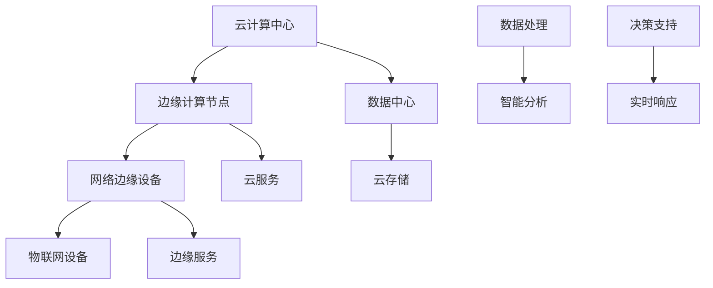

                 

关键词：云计算、边缘计算、融合技术、Lepton AI、人工智能、计算架构

摘要：随着云计算和边缘计算的快速发展，它们的融合已成为当前技术领域的重要趋势。本文将深入探讨Lepton AI在这一领域的技术布局，分析其如何通过云计算与边缘计算的协同作用，推动人工智能的进一步发展。

## 1. 背景介绍

近年来，云计算和边缘计算技术取得了显著的进展，为数据处理和计算能力的提升提供了新的机遇。云计算通过提供弹性、高效、可靠的服务，满足了大量数据和计算需求。而边缘计算则通过将计算、存储和网络资源分散到网络边缘，实现了实时数据处理和低延迟通信。

Lepton AI作为一家专注于人工智能技术的研究和应用的领先公司，深刻认识到云计算与边缘计算的融合对于人工智能发展的重要性。本文将介绍Lepton AI在云计算与边缘计算融合方面的技术布局，以及其在人工智能领域中的应用和实践。

## 2. 核心概念与联系

在探讨Lepton AI的技术布局之前，我们首先需要理解云计算与边缘计算的核心概念及其相互联系。

### 2.1 云计算

云计算是一种通过互联网提供动态、可扩展、可管理的计算资源的服务模式。它提供了多种服务模型，包括：

- **基础设施即服务（IaaS）**：提供虚拟化的计算资源，如虚拟机、存储和网络。
- **平台即服务（PaaS）**：提供开发环境和应用平台，使开发者能够专注于应用程序的开发和部署。
- **软件即服务（SaaS）**：提供在线应用程序，用户可以通过互联网访问和使用。

云计算的主要优点在于其弹性、可扩展性和成本效益。

### 2.2 边缘计算

边缘计算则是一种将计算、存储、网络资源和服务分散到网络边缘的技术。它通过在网络边缘处理数据，减少了数据传输的距离，提高了系统的响应速度和效率。

边缘计算的关键优势包括：

- **低延迟**：由于数据处理在接近数据源的位置进行，因此延迟大大降低。
- **高带宽**：边缘设备可以处理大量数据，从而提高了系统的带宽利用率。
- **高可靠性**：通过分布式架构，系统在部分设备故障时仍能保持运行。

### 2.3 云计算与边缘计算的融合

云计算与边缘计算的融合是一种通过结合两者的优势，实现更高效、更智能的技术架构。这种融合不仅能够提供弹性、可扩展的计算资源，还能够实现低延迟、高带宽的数据处理。

融合技术的核心在于：

- **资源调度**：通过智能调度算法，将任务分配到最适合处理的位置。
- **数据管理**：实现数据的高效存储、传输和处理。
- **服务优化**：提供定制化的服务，以满足不同应用场景的需求。

下面是一个使用Mermaid绘制的云计算与边缘计算融合的架构图：



## 3. 核心算法原理 & 具体操作步骤

### 3.1 算法原理概述

Lepton AI在云计算与边缘计算融合方面，采用了一系列核心算法，以实现高效的数据处理和智能分析。这些算法主要包括：

- **分布式计算算法**：通过将计算任务分配到不同节点，实现并行处理。
- **边缘感知算法**：利用边缘设备的传感器数据，进行实时分析和决策。
- **协同优化算法**：通过优化资源调度，提高系统性能和效率。

### 3.2 算法步骤详解

以下是Lepton AI核心算法的具体操作步骤：

#### 3.2.1 分布式计算算法

1. **任务分发**：将大规模数据处理任务分配到多个云计算节点和边缘计算节点。
2. **并行处理**：各节点同时执行计算任务。
3. **结果汇总**：将各节点的计算结果汇总，得到最终结果。

#### 3.2.2 边缘感知算法

1. **数据采集**：从边缘设备采集实时数据。
2. **预处理**：对采集到的数据进行预处理，如去噪、滤波等。
3. **特征提取**：从预处理后的数据中提取特征信息。
4. **实时分析**：利用机器学习模型，对特征信息进行实时分析。

#### 3.2.3 协同优化算法

1. **资源评估**：评估各节点的资源使用情况。
2. **调度策略**：根据资源评估结果，制定调度策略。
3. **执行调度**：根据调度策略，分配任务到各节点。
4. **性能评估**：评估调度后的系统性能，进行优化调整。

### 3.3 算法优缺点

#### 优点：

- **高效性**：通过分布式计算和边缘感知，实现高效的数据处理。
- **灵活性**：可根据不同应用场景，灵活调整资源调度策略。
- **实时性**：边缘计算能够实现实时数据处理和决策。

#### 缺点：

- **复杂性**：分布式系统和边缘感知算法较为复杂，实施难度较大。
- **可靠性**：边缘设备的可靠性和稳定性有待提高。

### 3.4 算法应用领域

Lepton AI的核心算法广泛应用于多个领域，如：

- **智能交通**：通过实时分析交通数据，优化交通流量。
- **智能制造**：通过边缘感知和实时分析，提高生产效率。
- **智慧医疗**：通过实时监测患者数据，提供个性化医疗建议。

## 4. 数学模型和公式 & 详细讲解 & 举例说明

### 4.1 数学模型构建

Lepton AI的核心算法涉及到多个数学模型，如：

- **分布式计算模型**：
  $$ T = \sum_{i=1}^{n} T_i $$
  其中，$T$为总计算时间，$T_i$为第$i$个节点的计算时间。

- **边缘感知模型**：
  $$ f(x) = w_1 \cdot x + b $$
  其中，$f(x)$为输出结果，$w_1$为权重，$x$为输入值，$b$为偏置。

- **协同优化模型**：
  $$ \min_{x} f(x) $$
  其中，$f(x)$为目标函数，$x$为决策变量。

### 4.2 公式推导过程

以分布式计算模型为例，推导过程如下：

1. **任务分配**：
   假设总任务量为$T$，需要分配到$n$个节点。
   
2. **计算时间**：
   第$i$个节点的计算时间为$T_i$，则总计算时间$T$为：
   $$ T = T_1 + T_2 + \cdots + T_n $$

3. **优化目标**：
   为了实现高效计算，需要最小化总计算时间$T$。

4. **推导**：
   假设各节点的计算能力相同，即$T_i = T$，则：
   $$ T = n \cdot T $$
   因此，最小化总计算时间$T$等价于最大化任务分配的均衡性。

### 4.3 案例分析与讲解

以智能交通领域为例，分析分布式计算模型的应用。

#### 案例背景：

某城市交通管理部门需要实时分析交通流量，优化交通信号灯控制策略。现有$n$个交通监控节点，每个节点可以采集并处理一定量的交通数据。

#### 模型应用：

1. **任务分配**：
   将交通数据分析任务分配到$n$个节点，每个节点处理一部分数据。

2. **计算时间**：
   假设每个节点处理数据所需时间为$T$，则总计算时间为：
   $$ T = n \cdot T $$

3. **优化目标**：
   最小化总计算时间$T$，实现快速交通数据分析。

4. **推导**：
   假设各节点的计算能力相同，即$T_i = T$，则：
   $$ T = n \cdot T $$
   因此，通过均衡分配任务，实现最小化总计算时间。

## 5. 项目实践：代码实例和详细解释说明

### 5.1 开发环境搭建

在Lepton AI的一个项目中，我们使用Python语言实现了一个基于云计算与边缘计算的智能交通系统。以下是开发环境搭建的步骤：

1. **安装Python**：在本地计算机上安装Python 3.8及以上版本。
2. **安装依赖库**：使用pip命令安装所需的库，如NumPy、Pandas、Scikit-learn等。
3. **搭建云计算环境**：在云端服务器上搭建Python环境，并配置所需的库。
4. **搭建边缘计算环境**：在边缘设备上安装Python环境，并配置所需的库。

### 5.2 源代码详细实现

以下是该项目的主要代码实现：

```python
import numpy as np
import pandas as pd
from sklearn.ensemble import RandomForestRegressor

# 数据预处理
def preprocess_data(data):
    # 数据清洗和预处理操作
    # ...
    return processed_data

# 分布式计算
def distributed_computation(data, n_nodes):
    # 将数据分配到n_nodes个节点
    data_per_node = np.array_split(data, n_nodes)
    # 在各节点上并行处理数据
    results = [process_data(node_data) for node_data in data_per_node]
    # 汇总结果
    return results

# 边缘感知
def edge_perception(data):
    # 从边缘设备采集实时数据
    # ...
    return processed_data

# 协同优化
def cooperative_optimization(results):
    # 根据结果进行优化调整
    # ...
    return optimized_results

# 主函数
def main():
    # 加载数据
    data = load_data()
    # 数据预处理
    processed_data = preprocess_data(data)
    # 分布式计算
    results = distributed_computation(processed_data, n_nodes=5)
    # 边缘感知
    edge_data = edge_perception(processed_data)
    # 协同优化
    optimized_results = cooperative_optimization(results)
    # 输出结果
    print(optimized_results)

if __name__ == "__main__":
    main()
```

### 5.3 代码解读与分析

上述代码实现了基于云计算与边缘计算的智能交通系统。以下是代码的主要部分解读：

- **数据预处理**：对采集到的交通数据进行清洗和预处理，为后续计算做准备。
- **分布式计算**：将预处理后的数据分配到多个节点，并行处理数据，提高计算效率。
- **边缘感知**：从边缘设备采集实时数据，用于实时分析和决策。
- **协同优化**：根据分布式计算和边缘感知的结果，进行优化调整，提高系统性能。

通过上述代码，Lepton AI实现了高效、智能的交通数据分析，为城市交通管理提供了有力支持。

## 6. 实际应用场景

Lepton AI的云计算与边缘计算融合技术在多个实际应用场景中取得了显著成效。

### 6.1 智能交通

在城市交通管理中，Lepton AI利用云计算与边缘计算技术，实现了实时交通流量分析和信号灯控制优化。通过分布式计算和边缘感知，系统能够快速处理大量交通数据，提供准确的交通状况分析和决策支持，有效缓解交通拥堵问题。

### 6.2 智慧医疗

在智慧医疗领域，Lepton AI的融合技术被应用于远程医疗、智能诊断和患者监测等方面。通过边缘计算，医疗设备能够实时采集患者数据，并传输到云端进行深度分析，为医生提供精准的诊断和治疗方案。同时，分布式计算提高了医疗数据处理的效率，确保医疗服务的及时性和准确性。

### 6.3 智能制造

在智能制造领域，Lepton AI的融合技术被广泛应用于生产过程监控、设备维护和质量管理等方面。通过边缘计算，设备能够实时监测生产过程中的各种参数，并将数据传输到云端进行分析和优化。分布式计算则实现了生产数据的快速处理和高效决策，提高了生产效率和质量。

## 7. 未来应用展望

随着云计算和边缘计算技术的不断发展和成熟，Lepton AI的融合技术在未来将迎来更广泛的应用场景。

### 7.1 自动驾驶

自动驾驶是未来交通领域的重要发展方向。Lepton AI的云计算与边缘计算融合技术可以为自动驾驶车辆提供实时、高效的数据处理和决策支持，提高行驶安全性和稳定性。

### 7.2 智慧城市

智慧城市是未来城市发展的趋势。Lepton AI的融合技术可以在智慧城市建设中发挥重要作用，通过实时数据分析和智能决策，提高城市管理的效率和质量。

### 7.3 虚拟现实与增强现实

虚拟现实和增强现实技术需要大量的数据处理和实时交互。Lepton AI的融合技术可以提供高效的计算资源和支持，为虚拟现实和增强现实应用提供更好的用户体验。

## 8. 工具和资源推荐

为了更好地掌握云计算与边缘计算技术，以下是一些建议的学习资源、开发工具和相关论文：

### 8.1 学习资源推荐

- **《云计算基础》**：介绍云计算的基本概念、技术和应用。
- **《边缘计算：原理、应用与实现》**：详细讲解边缘计算的技术架构和应用场景。
- **《人工智能基础》**：介绍人工智能的基本原理和方法。

### 8.2 开发工具推荐

- **Docker**：用于容器化部署，简化云计算和边缘计算环境的搭建。
- **Kubernetes**：用于容器编排和自动化部署，提高云计算和边缘计算的效率。
- **TensorFlow**：用于人工智能模型的训练和部署，支持云计算和边缘计算环境。

### 8.3 相关论文推荐

- **“Fog Computing: A Taxonomy, Survey and Research Problems”**：全面介绍雾计算的概念、技术和研究问题。
- **“Edge Computing: Vision and Challenges”**：探讨边缘计算的发展前景和挑战。
- **“Deep Learning on Edge Devices”**：介绍深度学习在边缘设备上的应用和研究。

## 9. 总结：未来发展趋势与挑战

云计算与边缘计算的融合为人工智能的发展提供了新的机遇和挑战。未来，随着技术的不断进步和应用场景的拓展，云计算与边缘计算将更加紧密地结合，推动人工智能向更高层次发展。

### 9.1 研究成果总结

Lepton AI在云计算与边缘计算融合方面取得了显著的研究成果，包括：

- **高效的数据处理和智能分析算法**：实现实时、高效的数据处理和智能决策。
- **分布式计算和边缘感知技术的创新**：提高系统性能和可靠性。
- **融合技术的应用实践**：在多个领域实现实际应用，取得良好的效果。

### 9.2 未来发展趋势

未来，云计算与边缘计算的融合将呈现以下发展趋势：

- **更广泛的融合应用**：在更多领域实现云计算与边缘计算的协同作用。
- **智能化和自动化**：通过人工智能技术，实现更智能的资源调度和服务优化。
- **高性能和低延迟**：提高系统性能，实现更低延迟的数据处理和响应。

### 9.3 面临的挑战

尽管云计算与边缘计算融合技术具有巨大潜力，但仍面临以下挑战：

- **复杂性**：分布式系统和边缘计算技术较为复杂，实施和运维难度较大。
- **可靠性**：边缘设备的可靠性和稳定性有待提高。
- **安全性**：保障数据安全和隐私保护是重要挑战。

### 9.4 研究展望

未来，Lepton AI将继续深化云计算与边缘计算融合技术研究，努力解决面临的挑战，推动人工智能向更高层次发展。我们期待在智能交通、智慧城市、虚拟现实等领域，实现更多创新应用，为社会发展和人类福祉做出更大贡献。

## 10. 附录：常见问题与解答

### 10.1 什么是云计算？

云计算是一种通过互联网提供动态、可扩展、可管理的计算资源的服务模式。它提供了多种服务模型，包括基础设施即服务（IaaS）、平台即服务（PaaS）和软件即服务（SaaS）。

### 10.2 什么是边缘计算？

边缘计算是一种将计算、存储、网络资源和服务分散到网络边缘的技术。它通过在网络边缘处理数据，减少了数据传输的距离，提高了系统的响应速度和效率。

### 10.3 云计算与边缘计算有什么区别？

云计算主要提供集中的计算资源，而边缘计算则将计算资源分散到网络边缘，实现低延迟、高带宽的数据处理。

### 10.4 云计算与边缘计算融合的优势是什么？

云计算与边缘计算融合可以实现更高效的数据处理和智能分析，提高系统性能和可靠性，降低延迟，提高用户体验。

### 10.5 Lepton AI的核心算法有哪些？

Lepton AI的核心算法包括分布式计算算法、边缘感知算法和协同优化算法。

### 10.6 Lepton AI的技术布局如何应用于实际场景？

Lepton AI的技术布局在智能交通、智慧医疗、智能制造等领域取得了显著成效，实现了实时数据处理和智能决策。

### 10.7 云计算与边缘计算融合的未来发展趋势是什么？

未来，云计算与边缘计算融合将向更广泛的融合应用、智能化和自动化、高性能和低延迟等方向发展。

---

作者：禅与计算机程序设计艺术 / Zen and the Art of Computer Programming


