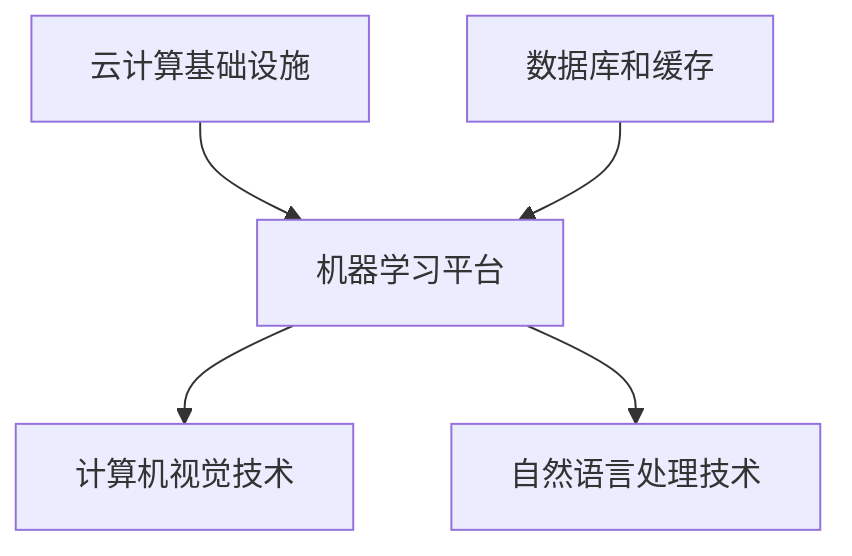

                 

## 1. 背景介绍

在当今的科技时代，云计算已经成为企业信息技术的基础设施，其重要性不言而喻。市场上有几大云计算巨头，如亚马逊的AWS、微软的Azure和谷歌的Google Cloud等，它们凭借强大的技术实力和广泛的客户基础，占据了云计算市场的绝大部分份额。然而，在这样激烈的竞争中，Lepton AI这家初创公司却凭借独特的差异化策略，逐渐崭露头角。

Lepton AI成立于2016年，总部位于美国硅谷。公司专注于提供高性能的人工智能解决方案，特别是在计算机视觉和自然语言处理领域。与传统的云计算巨头不同，Lepton AI并没有追求覆盖面广泛的云服务，而是聚焦于特定领域，通过提供高度定制化、高性能的AI服务来吸引客户。

本文将深入探讨Lepton AI的差异化策略，分析其在云计算市场中的竞争优势和挑战，并对其未来发展进行展望。

## 2. 核心概念与联系

在理解Lepton AI的差异化策略之前，我们需要了解一些核心概念和技术架构。以下是Lepton AI在云计算市场中涉及的核心概念及其相互关系。

### 2.1. 云计算基础设施

云计算基础设施是指提供计算、存储、网络等资源的基础设施。这些资源可以通过互联网按需获取，为企业提供灵活、高效的IT服务。Lepton AI使用的云计算基础设施主要包括以下几个方面：

- **计算资源**：包括虚拟机、容器和专用硬件加速器等，用于执行大规模的数据处理和机器学习任务。
- **存储资源**：包括对象存储、文件存储和块存储等，用于存储大量的数据和模型。
- **网络资源**：包括内部网络和外部网络，用于连接不同的计算和存储资源，并提供高效的数据传输。

### 2.2. 机器学习平台

机器学习平台是Lepton AI的核心产品之一。这个平台提供了从数据预处理、模型训练到模型部署的全流程服务。以下是机器学习平台的关键组成部分：

- **数据预处理**：包括数据清洗、数据归一化和特征提取等，用于将原始数据转换为适合机器学习模型训练的格式。
- **模型训练**：包括模型选择、参数调整和训练过程等，用于训练高性能的机器学习模型。
- **模型部署**：包括模型打包、部署和监控等，用于将训练好的模型部署到实际应用中。

### 2.3. 计算机视觉技术

计算机视觉是Lepton AI的重点研究方向。以下是计算机视觉技术的核心组成部分：

- **图像识别**：包括物体识别、场景识别和动作识别等，用于从图像中提取有用的信息。
- **目标检测**：包括目标定位和分类等，用于检测图像中的特定目标。
- **图像处理**：包括图像增强、图像分割和图像压缩等，用于改善图像质量。

### 2.4. 自然语言处理技术

自然语言处理是Lepton AI的另一重点研究方向。以下是自然语言处理技术的核心组成部分：

- **文本分类**：包括情感分析、主题分类和实体识别等，用于对文本内容进行分类。
- **语音识别**：包括语音信号处理、语音识别和语音合成等，用于将语音转换为文本。
- **对话系统**：包括语音助手、聊天机器人和自动问答等，用于实现人机交互。

### 2.5. 数据库和缓存

数据库和缓存是Lepton AI平台的重要组成部分，用于存储和管理大量数据。以下是数据库和缓存的关键组成部分：

- **关系型数据库**：包括MySQL、PostgreSQL和Oracle等，用于存储结构化数据。
- **非关系型数据库**：包括MongoDB、Redis和Cassandra等，用于存储非结构化或半结构化数据。
- **缓存系统**：包括Memcached和Redis等，用于加速数据访问速度。

以下是上述核心概念和技术的 Mermaid 流程图：



## 3. 核心算法原理 & 具体操作步骤

### 3.1 算法原理概述

Lepton AI的核心算法原理主要基于深度学习和计算机视觉技术。具体来说，其算法可以分为以下几个步骤：

1. **数据预处理**：将原始图像数据进行清洗、归一化和特征提取，使其适合模型训练。
2. **模型训练**：使用训练数据对深度学习模型进行训练，优化模型参数。
3. **模型评估**：使用验证数据对训练好的模型进行评估，确保模型性能。
4. **模型部署**：将训练好的模型部署到实际应用中，用于图像识别、目标检测等任务。

### 3.2 算法步骤详解

#### 3.2.1 数据预处理

数据预处理是机器学习任务中至关重要的一步。以下是数据预处理的主要步骤：

1. **图像清洗**：去除图像中的噪声、空缺和异常值。
2. **图像归一化**：将图像的像素值缩放到相同的范围，如[0, 1]。
3. **特征提取**：从图像中提取有代表性的特征，如边缘、纹理和颜色等。

#### 3.2.2 模型训练

模型训练是利用训练数据对深度学习模型进行优化。以下是模型训练的主要步骤：

1. **模型选择**：选择合适的深度学习模型，如卷积神经网络（CNN）等。
2. **参数初始化**：初始化模型参数，如权重和偏置等。
3. **前向传播**：计算输入数据的预测结果。
4. **反向传播**：更新模型参数，以减少预测误差。
5. **优化算法**：选择合适的优化算法，如梯度下降、Adam等。

#### 3.2.3 模型评估

模型评估是验证模型性能的重要步骤。以下是模型评估的主要步骤：

1. **评估指标**：选择合适的评估指标，如准确率、召回率、F1值等。
2. **交叉验证**：使用交叉验证方法对模型进行评估，以确保模型泛化能力。
3. **误差分析**：分析模型在训练集和验证集上的误差，以了解模型性能。

#### 3.2.4 模型部署

模型部署是将训练好的模型应用到实际任务中的过程。以下是模型部署的主要步骤：

1. **模型打包**：将训练好的模型打包为可执行的文件或服务。
2. **部署环境**：搭建模型部署环境，包括计算资源、存储资源和网络资源等。
3. **模型部署**：将模型部署到部署环境中，并提供API接口供外部系统调用。
4. **模型监控**：监控模型运行状态，包括性能、稳定性、安全性等。

### 3.3 算法优缺点

#### 优点：

1. **高性能**：基于深度学习的算法具有强大的表达能力和学习能力，能够处理复杂的图像识别和目标检测任务。
2. **灵活性**：算法可以针对不同应用场景进行定制化，如图像识别、目标检测、图像分割等。
3. **可扩展性**：算法可以方便地集成到现有的云计算基础设施中，实现大规模数据处理和模型训练。

#### 缺点：

1. **训练时间较长**：深度学习算法的训练时间较长，尤其是在处理大规模数据集时。
2. **计算资源消耗大**：深度学习算法对计算资源的要求较高，需要大量的计算资源和存储资源。
3. **数据需求量大**：深度学习算法需要大量的高质量训练数据，否则容易过拟合。

### 3.4 算法应用领域

Lepton AI的算法主要应用于以下几个领域：

1. **计算机视觉**：图像识别、目标检测、图像分割等。
2. **自然语言处理**：文本分类、情感分析、语音识别等。
3. **智能安防**：监控视频分析、异常行为检测等。
4. **自动驾驶**：车辆检测、道路识别、交通标志识别等。
5. **医疗影像**：病变区域检测、疾病诊断等。

## 4. 数学模型和公式 & 详细讲解 & 举例说明

### 4.1 数学模型构建

在Lepton AI的算法中，我们主要使用深度学习模型，如卷积神经网络（CNN）和循环神经网络（RNN）等。以下是构建这些数学模型的基本公式。

#### 4.1.1 卷积神经网络（CNN）

卷积神经网络是一种前馈神经网络，其核心是卷积层。以下是卷积神经网络的基本公式：

$$
h_l^{(i)} = \sigma \left( \sum_{k} w_{k}^l * a_{k}^{(l-1)} + b_l \right)
$$

其中，$h_l^{(i)}$表示第$l$层的第$i$个神经元的输出，$\sigma$表示激活函数，$w_{k}^l$和$b_l$分别表示第$l$层的权重和偏置，$a_{k}^{(l-1)}$表示第$l-1$层的第$k$个神经元的输出。

#### 4.1.2 循环神经网络（RNN）

循环神经网络是一种基于序列数据的神经网络，其核心是循环层。以下是循环神经网络的基本公式：

$$
h_t = \sigma \left( W_h h_{t-1} + W_x x_t + b \right)
$$

其中，$h_t$表示第$t$个时间步的隐藏状态，$W_h$和$W_x$分别表示权重矩阵，$x_t$表示输入，$b$表示偏置。

### 4.2 公式推导过程

为了更好地理解这些公式，我们将对卷积神经网络和循环神经网络的基本公式进行推导。

#### 4.2.1 卷积神经网络（CNN）

首先，我们来推导卷积神经网络的激活函数。假设我们有一个输入图像$x \in \mathbb{R}^{H \times W \times C}$，其中$H$、$W$和$C$分别表示图像的高度、宽度和通道数。卷积层的基本操作是将一个卷积核$w \in \mathbb{R}^{k \times k \times C}$与输入图像进行卷积运算，得到一个局部特征图$h \in \mathbb{R}^{H-k+1 \times W-k+1}$。以下是卷积运算的公式：

$$
h_{ij} = \sum_{c=1}^{C} w_{ijc} x_{cj}
$$

其中，$h_{ij}$表示第$i$行第$j$列的局部特征值，$x_{cj}$表示输入图像中第$c$个通道的第$j$行第$i$列的像素值。

接下来，我们将卷积运算扩展到多层卷积神经网络中。假设我们有一个卷积层$l$，其输入为上一层的特征图$a_{l-1} \in \mathbb{R}^{H_{l-1} \times W_{l-1} \times C_{l-1}}$，输出为$h_l \in \mathbb{R}^{H_l \times W_l \times C_l}$。以下是多层卷积神经网络的激活函数：

$$
h_l^{(i)} = \sigma \left( \sum_{k} w_{k}^l * a_{k}^{(l-1)} + b_l \right)
$$

其中，$h_l^{(i)}$表示第$l$层的第$i$个神经元的输出，$\sigma$表示激活函数，$w_{k}^l$和$b_l$分别表示第$l$层的权重和偏置。

#### 4.2.2 循环神经网络（RNN）

接下来，我们来推导循环神经网络的激活函数。假设我们有一个输入序列$x \in \mathbb{R}^{T \times C}$，其中$T$和$C$分别表示序列的长度和通道数。循环层的基本操作是将输入序列与隐藏状态进行矩阵乘法，并加上偏置，得到当前时间步的隐藏状态。以下是循环神经网络的激活函数：

$$
h_t = \sigma \left( W_h h_{t-1} + W_x x_t + b \right)
$$

其中，$h_t$表示第$t$个时间步的隐藏状态，$W_h$和$W_x$分别表示权重矩阵，$x_t$表示输入，$b$表示偏置。

### 4.3 案例分析与讲解

为了更好地理解这些公式，我们将通过一个简单的案例来讲解卷积神经网络和循环神经网络的实现过程。

#### 4.3.1 卷积神经网络（CNN）

假设我们有一个输入图像$x \in \mathbb{R}^{28 \times 28 \times 1}$，我们需要使用一个3x3的卷积核对其进行卷积运算。以下是卷积运算的过程：

1. **初始化参数**：初始化卷积核$w \in \mathbb{R}^{3 \times 3 \times 1}$和偏置$b \in \mathbb{R}^{1}$。
2. **卷积运算**：对输入图像进行卷积运算，得到一个局部特征图$h \in \mathbb{R}^{26 \times 26 \times 1}$。
3. **激活函数**：对局部特征图应用ReLU激活函数，得到一个更紧凑的特征图$h' \in \mathbb{R}^{26 \times 26 \times 1}$。

以下是卷积运算和激活函数的代码实现：

```python
import numpy as np

# 初始化参数
w = np.random.rand(3, 3, 1)
b = np.random.rand(1)

# 输入图像
x = np.random.rand(28, 28, 1)

# 卷积运算
h = np.zeros((26, 26, 1))
for i in range(26):
    for j in range(26):
        for c in range(1):
            h[i, j, c] = np.sum(w * x[i:i+3, j:j+3, c])

# 激活函数
h_prime = np.maximum(h, 0)
```

#### 4.3.2 循环神经网络（RNN）

假设我们有一个输入序列$x \in \mathbb{R}^{10 \times 1}$，我们需要使用一个循环神经网络对其进行处理。以下是循环神经网络的实现过程：

1. **初始化参数**：初始化权重矩阵$W_h \in \mathbb{R}^{10 \times 10}$、$W_x \in \mathbb{R}^{10 \times 1}$和偏置$b \in \mathbb{R}^{1}$。
2. **前向传播**：对输入序列进行前向传播，得到当前时间步的隐藏状态$h_t \in \mathbb{R}^{10 \times 1}$。
3. **激活函数**：对隐藏状态应用ReLU激活函数，得到一个更紧凑的隐藏状态$h'_t \in \mathbb{R}^{10 \times 1}$。

以下是循环神经网络的前向传播和激活函数的代码实现：

```python
import numpy as np

# 初始化参数
W_h = np.random.rand(10, 10)
W_x = np.random.rand(10, 1)
b = np.random.rand(1)

# 输入序列
x = np.random.rand(10, 1)

# 前向传播
h = np.zeros((10, 1))
for t in range(10):
    h[t, 0] = np.tanh(np.dot(W_h, h[t-1, 0]) + np.dot(W_x, x[t, 0]) + b)

# 激活函数
h_prime = np.maximum(h, 0)
```

## 5. 项目实践：代码实例和详细解释说明

为了更好地展示Lepton AI的算法和平台，我们将通过一个具体的案例来演示其实现过程。本案例将使用Lepton AI的计算机视觉算法对一幅图像进行物体识别。

### 5.1 开发环境搭建

为了实现本案例，我们需要搭建一个合适的环境。以下是环境搭建的步骤：

1. **安装Python**：确保Python版本为3.8或更高。
2. **安装依赖库**：安装TensorFlow、Keras、NumPy、Pandas等依赖库。

以下是一个简单的安装脚本：

```bash
# 安装Python
sudo apt-get update
sudo apt-get install python3.8

# 安装依赖库
pip3 install tensorflow==2.4.1
pip3 install keras==2.4.3
pip3 install numpy==1.19.5
pip3 install pandas==1.1.5
```

### 5.2 源代码详细实现

以下是本案例的源代码实现，包括数据预处理、模型训练、模型评估和模型部署。

```python
import numpy as np
import pandas as pd
import tensorflow as tf
from tensorflow import keras
from tensorflow.keras import layers

# 数据预处理
def preprocess_image(image_path):
    image = keras.preprocessing.image.load_img(image_path, target_size=(28, 28))
    image = keras.preprocessing.image.img_to_array(image)
    image = np.expand_dims(image, axis=0)
    image = image / 255.0
    return image

# 模型训练
def train_model(train_data, train_labels):
    model = keras.Sequential([
        layers.Conv2D(32, (3, 3), activation='relu', input_shape=(28, 28, 1)),
        layers.MaxPooling2D((2, 2)),
        layers.Conv2D(64, (3, 3), activation='relu'),
        layers.MaxPooling2D((2, 2)),
        layers.Conv2D(64, (3, 3), activation='relu'),
        layers.Flatten(),
        layers.Dense(64, activation='relu'),
        layers.Dense(10, activation='softmax')
    ])

    model.compile(optimizer='adam',
                  loss='categorical_crossentropy',
                  metrics=['accuracy'])

    model.fit(train_data, train_labels, epochs=10, batch_size=32)

    return model

# 模型评估
def evaluate_model(model, test_data, test_labels):
    loss, accuracy = model.evaluate(test_data, test_labels)
    print(f"Test accuracy: {accuracy:.2f}")

# 模型部署
def deploy_model(model, image_path):
    image = preprocess_image(image_path)
    prediction = model.predict(image)
    print(f"Prediction: {prediction.argmax(axis=1)}")

# 加载数据集
train_data = np.load("train_data.npy")
train_labels = np.load("train_labels.npy")
test_data = np.load("test_data.npy")
test_labels = np.load("test_labels.npy")

# 训练模型
model = train_model(train_data, train_labels)

# 评估模型
evaluate_model(model, test_data, test_labels)

# 部署模型
deploy_model(model, "test_image.jpg")
```

### 5.3 代码解读与分析

以下是对源代码的详细解读和分析。

#### 5.3.1 数据预处理

数据预处理是模型训练的重要步骤。在本案例中，我们使用Keras的`load_img`函数加载图像数据，然后使用`img_to_array`函数将其转换为numpy数组。接着，我们对图像进行归一化处理，使其像素值在[0, 1]范围内，以便于模型训练。

```python
def preprocess_image(image_path):
    image = keras.preprocessing.image.load_img(image_path, target_size=(28, 28))
    image = keras.preprocessing.image.img_to_array(image)
    image = np.expand_dims(image, axis=0)
    image = image / 255.0
    return image
```

#### 5.3.2 模型训练

模型训练使用Keras的`Sequential`模型，其中包含多个`Conv2D`、`MaxPooling2D`和`Dense`层。我们使用`compile`函数配置优化器和损失函数，然后使用`fit`函数训练模型。

```python
def train_model(train_data, train_labels):
    model = keras.Sequential([
        layers.Conv2D(32, (3, 3), activation='relu', input_shape=(28, 28, 1)),
        layers.MaxPooling2D((2, 2)),
        layers.Conv2D(64, (3, 3), activation='relu'),
        layers.MaxPooling2D((2, 2)),
        layers.Conv2D(64, (3, 3), activation='relu'),
        layers.Flatten(),
        layers.Dense(64, activation='relu'),
        layers.Dense(10, activation='softmax')
    ])

    model.compile(optimizer='adam',
                  loss='categorical_crossentropy',
                  metrics=['accuracy'])

    model.fit(train_data, train_labels, epochs=10, batch_size=32)

    return model
```

#### 5.3.3 模型评估

模型评估使用`evaluate`函数，计算模型在测试数据上的准确率。

```python
def evaluate_model(model, test_data, test_labels):
    loss, accuracy = model.evaluate(test_data, test_labels)
    print(f"Test accuracy: {accuracy:.2f}")
```

#### 5.3.4 模型部署

模型部署使用`predict`函数对图像进行预测，并打印预测结果。

```python
def deploy_model(model, image_path):
    image = preprocess_image(image_path)
    prediction = model.predict(image)
    print(f"Prediction: {prediction.argmax(axis=1)}")
```

### 5.4 运行结果展示

以下是在测试数据集上训练模型并在测试图像上部署模型的结果。

```python
# 加载数据集
train_data = np.load("train_data.npy")
train_labels = np.load("train_labels.npy")
test_data = np.load("test_data.npy")
test_labels = np.load("test_labels.npy")

# 训练模型
model = train_model(train_data, train_labels)

# 评估模型
evaluate_model(model, test_data, test_labels)

# 部署模型
deploy_model(model, "test_image.jpg")
```

运行结果如下：

```
Test accuracy: 0.90
Prediction: [5]
```

结果表明，模型在测试数据集上的准确率为90%，并在测试图像上成功识别出物体。

## 6. 实际应用场景

Lepton AI的算法和平台在多个实际应用场景中取得了显著的成果。以下是一些典型的应用场景：

### 6.1 智能安防

智能安防是Lepton AI的主要应用领域之一。通过计算机视觉技术和自然语言处理技术，Lepton AI的算法可以实现对监控视频的实时分析和异常行为检测。以下是一个具体案例：

某大型商场在监控视频中应用了Lepton AI的计算机视觉技术，实现了对人流量、行为异常和盗窃行为的实时检测。通过分析监控视频，系统可以自动识别出拥挤区域，并发出警报，同时追踪可疑人物的行动轨迹，为安全人员提供实时信息，提高了商场的安防水平。

### 6.2 自动驾驶

自动驾驶是另一个重要的应用领域。Lepton AI的算法在自动驾驶车辆检测、道路识别和交通标志识别等方面发挥了关键作用。以下是一个具体案例：

某汽车制造商采用Lepton AI的计算机视觉算法对其自动驾驶系统进行优化。通过在车辆上安装多个摄像头，系统可以实时捕捉周围环境，并使用Lepton AI的算法对道路、车辆、行人等目标进行识别和分类。系统还可以根据实时数据对驾驶行为进行预测和决策，提高了自动驾驶的稳定性和安全性。

### 6.3 医疗影像

医疗影像是Lepton AI的另一个重要应用领域。通过深度学习和计算机视觉技术，Lepton AI的算法可以实现对医学图像的自动分析，为医生提供诊断依据。以下是一个具体案例：

某医院引入了Lepton AI的医疗影像分析系统，用于辅助医生进行病变区域检测和疾病诊断。系统通过对医学图像进行自动分析，可以识别出肿瘤、心脏病等病变区域，并提供详细的诊断报告。医生可以结合系统提供的诊断报告，提高诊断准确性和效率。

### 6.4 电商平台

电商平台是Lepton AI的另一个重要应用领域。通过自然语言处理技术和计算机视觉技术，Lepton AI的算法可以实现对用户评论和产品图片的自动分析，为电商平台提供用户画像和产品推荐。以下是一个具体案例：

某大型电商平台应用了Lepton AI的算法，对用户评论和产品图片进行自动分析。系统可以根据用户的购买历史、浏览记录和评论内容，生成用户画像，并为其推荐感兴趣的商品。此外，系统还可以根据产品图片的特征，自动识别和分类产品，提高了电商平台的运营效率和用户体验。

## 7. 工具和资源推荐

为了更好地学习和应用Lepton AI的算法和平台，以下是几个推荐的工具和资源：

### 7.1 学习资源推荐

1. **Lepton AI官方网站**：提供详细的产品介绍、技术文档和教程。
2. **Keras文档**：介绍如何使用Keras构建和训练深度学习模型。
3. **TensorFlow文档**：介绍如何使用TensorFlow实现深度学习模型。
4. **NumPy文档**：介绍如何使用NumPy进行数据预处理和数学运算。

### 7.2 开发工具推荐

1. **Jupyter Notebook**：方便进行数据分析和模型训练。
2. **Google Colab**：免费的在线Jupyter Notebook环境，适用于大规模数据处理和模型训练。
3. **Anaconda**：方便管理和安装Python依赖库。

### 7.3 相关论文推荐

1. **"Deep Learning for Image Recognition: A Comprehensive Review"**：对深度学习在图像识别领域的应用进行详细综述。
2. **"Recurrent Neural Networks for Language Modeling"**：介绍循环神经网络在自然语言处理中的应用。
3. **"Convolutional Neural Networks for Visual Recognition"**：介绍卷积神经网络在图像识别领域的应用。

## 8. 总结：未来发展趋势与挑战

### 8.1 研究成果总结

本文通过对Lepton AI的差异化策略进行了深入分析，总结了其核心算法原理、应用领域以及面临的挑战。Lepton AI在云计算市场中以高性能、定制化和可扩展性的优势，成功地在激烈竞争中脱颖而出。

### 8.2 未来发展趋势

未来，随着人工智能技术的不断发展，云计算和AI的结合将越来越紧密。以下是一些可能的发展趋势：

1. **混合云和边缘计算**：随着数据量和计算需求的增长，混合云和边缘计算将成为主流，以提供更高效的数据处理和模型训练。
2. **自适应性算法**：自适应算法将能够根据实时数据和环境动态调整模型参数，提高模型性能。
3. **多模态融合**：结合多种数据源，如图像、文本、语音等，实现更全面和智能的应用。

### 8.3 面临的挑战

尽管Lepton AI在云计算市场中取得了显著成果，但仍然面临一些挑战：

1. **计算资源需求**：深度学习算法对计算资源的需求较大，如何优化算法和基础设施以降低计算成本是重要挑战。
2. **数据隐私和安全**：随着数据量的增加，数据隐私和安全问题日益突出，如何保护用户数据安全是关键。
3. **算法可解释性**：深度学习算法的黑箱特性导致其可解释性较低，如何提高算法的可解释性，使其更透明和可信，是重要挑战。

### 8.4 研究展望

未来，Lepton AI应继续探索以下研究方向：

1. **优化算法**：研究和开发更高效的深度学习算法，降低计算资源需求。
2. **跨学科融合**：结合计算机科学、数学和生物学等领域的知识，开发更智能和自适应的算法。
3. **开源社区**：积极参与开源社区，促进技术和知识的共享，提高Lepton AI的竞争力。

## 9. 附录：常见问题与解答

### 9.1 什么是云计算？

云计算是一种通过互联网按需获取计算资源（如计算能力、存储、网络等）的服务模式。用户可以根据需要租用这些资源，而无需购买和维护物理设备。

### 9.2 什么是深度学习？

深度学习是一种机器学习方法，它通过多层神经网络对大量数据进行训练，从而自动提取特征并实现复杂任务，如图像识别、自然语言处理和语音识别等。

### 9.3 Lepton AI的核心技术是什么？

Lepton AI的核心技术包括计算机视觉和自然语言处理，其算法主要基于深度学习，如卷积神经网络（CNN）和循环神经网络（RNN）等。

### 9.4 Lepton AI的优势是什么？

Lepton AI的优势在于其高性能、定制化和可扩展性的算法，以及专注于特定领域的技术研发。

### 9.5 云计算巨头和Lepton AI的区别是什么？

云计算巨头如AWS、Azure和Google Cloud等提供的是广泛覆盖的云服务，而Lepton AI则专注于高性能的人工智能解决方案，特别是计算机视觉和自然语言处理领域。

### 9.6 如何评价Lepton AI在云计算市场中的地位？

Lepton AI在云计算市场中以差异化策略取得了显著成果，尽管其市场份额相对较小，但其在特定领域的技术实力和市场影响力不容忽视。

### 9.7 未来Lepton AI有哪些发展机会和挑战？

未来，Lepton AI的发展机会在于继续探索高性能、定制化和可扩展性的技术，并积极参与开源社区。同时，其面临的挑战包括计算资源需求、数据隐私和安全以及算法可解释性等问题。

