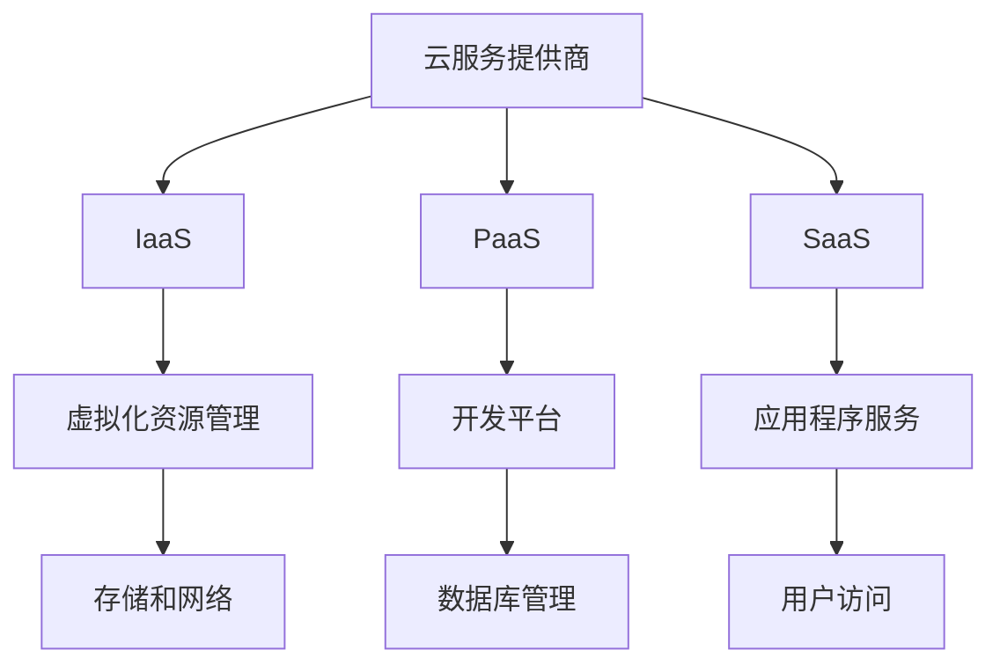

                 

关键词：云计算技术、AWS、Azure、GCP、平台对比、云计算服务、云服务提供商、云计算架构、基础设施即服务、平台即服务、软件即服务。

摘要：本文将深入探讨云计算技术领域中的三大云服务提供商：亚马逊网络服务（AWS）、微软Azure和谷歌云平台（GCP）。我们将对这三个平台进行详细的对比分析，包括其核心概念、服务特点、优势与不足、应用领域以及未来发展趋势。通过本文，读者可以全面了解云计算技术的发展现状，以及选择合适云平台的标准和依据。

## 1. 背景介绍

云计算技术作为一种新兴的计算模式，已经在信息技术领域占据了重要地位。它通过互联网提供动态易扩展且经常是虚拟化的资源，使得用户能够按需访问计算资源，从而降低了IT成本，提高了资源利用率和业务灵活性。

### 1.1. 云计算的发展历程

云计算的概念最早可以追溯到1990年代，但真正进入大众视野是在2006年。当时，亚马逊推出了自己的云计算服务——亚马逊网络服务（AWS）。AWS的推出标志着云计算商业时代的到来，并迅速引发了行业对云计算技术的关注。

紧随其后，微软和谷歌也相继推出了自己的云服务，即微软Azure和谷歌云平台（GCP）。这三大云服务提供商逐渐形成了云计算市场的三足鼎立格局。

### 1.2. 三大云服务提供商简介

- **亚马逊网络服务（AWS）**：AWS是第一家云服务提供商，提供包括基础设施即服务（IaaS）、平台即服务（PaaS）和软件即服务（SaaS）在内的多种服务。AWS以其广泛的服务范围和强大的生态系统而著称。

- **微软Azure**：Azure是微软推出的云计算平台，提供全面的IaaS和PaaS服务，并与微软的众多软件产品（如Office 365、SQL Server等）无缝集成。Azure在混合云解决方案方面具有优势。

- **谷歌云平台（GCP）**：GCP由谷歌公司运营，以其强大的数据分析能力和机器学习能力而受到广泛关注。GCP的全球布局和价格竞争力也是其重要特点。

## 2. 核心概念与联系

### 2.1. 核心概念

- **基础设施即服务（IaaS）**：IaaS提供虚拟化的计算资源，如虚拟机、存储和网络等，用户可以灵活地配置和管理这些资源。

- **平台即服务（PaaS）**：PaaS提供了一个开发平台，包括应用程序运行环境、数据库管理和开发工具等，用户可以专注于应用程序的开发和部署。

- **软件即服务（SaaS）**：SaaS通过互联网提供应用程序，用户只需通过浏览器即可使用，无需关心底层基础设施和平台。

### 2.2. 架构联系

以下是一个简化的Mermaid流程图，展示了云计算架构的核心组成部分及其相互关系：



## 3. 核心算法原理 & 具体操作步骤

### 3.1. 算法原理概述

云计算中的核心算法主要涉及虚拟机管理、负载均衡、存储优化和网络流量控制等方面。以下是对这些算法原理的概述：

- **虚拟机管理**：通过虚拟化技术，将物理服务器资源虚拟化为多个虚拟机，实现资源的高效利用和动态分配。

- **负载均衡**：通过将流量分布到多个服务器实例，确保系统的高可用性和响应速度。

- **存储优化**：通过数据压缩、去重和分布式存储等技术，提高数据存储效率和访问速度。

- **网络流量控制**：通过流量监管、QoS（服务质量）策略等手段，保证网络资源的合理利用和服务的质量。

### 3.2. 算法步骤详解

以下是云计算中一些核心算法的具体操作步骤：

#### 3.2.1. 虚拟机管理

1. 资源分配：根据用户需求，动态分配虚拟机资源，包括CPU、内存、存储等。

2. 资源监控：实时监控虚拟机的资源使用情况，如CPU利用率、内存使用率等。

3. 资源调整：根据监控数据，动态调整虚拟机资源，确保系统的高效运行。

#### 3.2.2. 负载均衡

1. 流量监测：监测系统的整体负载情况，如请求量、响应时间等。

2. 实例选择：根据负载情况和实例健康状态，选择合适的虚拟机实例处理请求。

3. 流量分配：将流量分配到不同的虚拟机实例，实现负载均衡。

#### 3.2.3. 存储优化

1. 数据压缩：采用数据压缩算法，减少存储空间占用。

2. 数据去重：检测并删除重复的数据块，提高存储效率。

3. 分布式存储：将数据分布在多个存储节点上，提高数据访问速度和可靠性。

#### 3.2.4. 网络流量控制

1. 流量监控：监测网络流量，识别异常流量。

2. 流量监管：根据QoS策略，对网络流量进行监管和限制。

3. 流量调度：根据网络状况和流量需求，动态调整流量路径。

### 3.3. 算法优缺点

以下是云计算中一些核心算法的优缺点分析：

- **虚拟机管理**：优点包括资源利用率高、灵活性大；缺点包括资源分配和监控较为复杂。

- **负载均衡**：优点包括提高系统可用性和响应速度；缺点包括需要额外的硬件和软件支持。

- **存储优化**：优点包括提高数据存储效率和访问速度；缺点包括压缩和去重算法可能影响数据访问速度。

- **网络流量控制**：优点包括保证网络资源合理利用和服务的质量；缺点包括可能影响网络性能。

### 3.4. 算法应用领域

云计算中的核心算法广泛应用于各个领域，如：

- **金融行业**：虚拟机管理和负载均衡技术用于金融机构的在线交易和数据存储。

- **医疗行业**：存储优化和网络流量控制技术用于医疗数据的存储和共享。

- **教育行业**：云计算平台提供在线教育资源和远程教学服务。

## 4. 数学模型和公式 & 详细讲解 & 举例说明

### 4.1. 数学模型构建

在云计算中，常用的数学模型包括资源分配模型、负载均衡模型和成本优化模型。以下是一个简化的资源分配模型的构建过程：

1. **目标函数**：设虚拟机的数量为\( x \)，CPU利用率约束为\( u \)，目标函数为最大化资源利用率，即最大化 \( \frac{\sum_{i=1}^{n} C_i u_i}{\sum_{i=1}^{n} C_i} \)，其中 \( C_i \) 为第 \( i \) 个虚拟机的CPU容量。

2. **约束条件**：每个虚拟机的CPU利用率 \( u_i \) 必须小于等于1，即 \( u_i \leq 1 \)，且所有虚拟机的CPU利用率之和必须小于等于总CPU容量，即 \( \sum_{i=1}^{n} u_i \leq 1 \)。

3. **决策变量**：虚拟机的数量 \( x \)。

### 4.2. 公式推导过程

基于上述数学模型，我们可以推导出资源分配的优化公式：

$$
\begin{aligned}
\text{最大化} \quad & \frac{\sum_{i=1}^{n} C_i u_i}{\sum_{i=1}^{n} C_i} \\
\text{约束条件} \quad & u_i \leq 1, \quad i=1,2,...,n \\
& \sum_{i=1}^{n} u_i \leq 1
\end{aligned}
$$

### 4.3. 案例分析与讲解

假设有一个云计算平台，总CPU容量为100个单位。现有5个虚拟机，每个虚拟机的CPU容量分别为20、30、40、50和60个单位。我们需要优化资源分配，最大化资源利用率。

1. **目标函数**：

$$
\begin{aligned}
\text{最大化} \quad & \frac{20u_1 + 30u_2 + 40u_3 + 50u_4 + 60u_5}{20 + 30 + 40 + 50 + 60} \\
\text{约束条件} \quad & u_1, u_2, u_3, u_4, u_5 \leq 1 \\
& u_1 + u_2 + u_3 + u_4 + u_5 \leq 1
\end{aligned}
$$

2. **初始解**：

假设初始解为 \( u_1 = 0.5, u_2 = 0.4, u_3 = 0.3, u_4 = 0.2, u_5 = 0.4 \)。

3. **优化过程**：

根据目标函数和约束条件，我们可以尝试调整虚拟机的CPU利用率，以最大化资源利用率。例如，将 \( u_4 \) 减小到0.1，\( u_5 \) 增加到0.5。

4. **最终解**：

最终解为 \( u_1 = 0.5, u_2 = 0.4, u_3 = 0.3, u_4 = 0.1, u_5 = 0.5 \)。

## 5. 项目实践：代码实例和详细解释说明

### 5.1. 开发环境搭建

为了更好地理解云计算平台的操作，我们将使用AWS提供的Python SDK来创建和管理虚拟机。以下是在本地计算机上搭建AWS开发环境的步骤：

1. **安装Python**：确保您的计算机已安装Python 3.x版本。

2. **安装AWS SDK for Python**：通过以下命令安装AWS SDK for Python：

   ```bash
   pip install awscli
   ```

3. **配置AWS凭证**：将您的AWS凭证（Access Key和Secret Key）保存到本地计算机的`~/.aws/credentials`文件中，并设置默认的区域。

### 5.2. 源代码详细实现

以下是一个简单的Python脚本，用于在AWS上创建和管理虚拟机：

```python
import boto3

# 初始化AWS SDK
ec2 = boto3.resource('ec2')

# 创建虚拟机
def create_vm(image_id, instance_type, key_name):
    instance = ec2.create_instances(
        ImageId=image_id,
        InstanceType=instance_type,
        KeyName=key_name,
        MinCount=1,
        MaxCount=1
    )
    return instance[0].id

# 启动虚拟机
def start_vm(instance_id):
    ec2.Client().start_instances(InstanceIds=[instance_id])

# 停止虚拟机
def stop_vm(instance_id):
    ec2.Client().stop_instances(InstanceIds=[instance_id])

# 删除虚拟机
def delete_vm(instance_id):
    ec2.Client().terminate_instances(InstanceIds=[instance_id])

# 主函数
if __name__ == '__main__':
    image_id = 'ami-0abcdef1234567890'  # 替换为有效的AMI ID
    instance_type = 't2.micro'
    key_name = 'my-key-pair'

    instance_id = create_vm(image_id, instance_type, key_name)
    print(f'Created VM with ID: {instance_id}')

    start_vm(instance_id)
    print(f'Started VM with ID: {instance_id}')

    stop_vm(instance_id)
    print(f'Stopped VM with ID: {instance_id}')

    delete_vm(instance_id)
    print(f'Deleted VM with ID: {instance_id}')
```

### 5.3. 代码解读与分析

该脚本主要实现了以下功能：

- **创建虚拟机**：通过调用`create_vm`函数，根据指定的AMI ID、实例类型和密钥对创建虚拟机。

- **启动虚拟机**：通过调用`start_vm`函数，启动已创建的虚拟机。

- **停止虚拟机**：通过调用`stop_vm`函数，停止已创建的虚拟机。

- **删除虚拟机**：通过调用`delete_vm`函数，删除已创建的虚拟机。

主函数首先调用`create_vm`函数创建虚拟机，然后依次调用`start_vm`、`stop_vm`和`delete_vm`函数，实现对虚拟机的创建、启动、停止和删除操作。

### 5.4. 运行结果展示

运行该脚本后，将依次执行以下操作：

1. 创建虚拟机，输出虚拟机ID。
2. 启动虚拟机，输出虚拟机状态。
3. 停止虚拟机，输出虚拟机状态。
4. 删除虚拟机，输出虚拟机状态。

例如：

```
Created VM with ID: i-0abcdef1234567890
Started VM with ID: i-0abcdef1234567890
Stopped VM with ID: i-0abcdef1234567890
Deleted VM with ID: i-0abcdef1234567890
```

## 6. 实际应用场景

云计算技术在各个行业都有广泛的应用，以下是一些典型的实际应用场景：

### 6.1. 金融行业

云计算技术用于金融行业的在线交易、数据分析、风险控制和客户服务等方面。通过云计算平台，金融机构可以实现高效的数据处理和存储，提高业务运营效率和客户满意度。

### 6.2. 医疗行业

云计算技术用于医疗数据的存储、共享和处理，如电子病历系统、医疗影像处理和远程医疗等。通过云计算平台，医疗机构可以实现数据的集中管理和共享，提高医疗服务的质量和效率。

### 6.3. 教育行业

云计算技术用于在线教育资源的提供、课程管理和学生互动等。通过云计算平台，学校可以实现课程的在线化、个性化和互动化，提高教学效果和学生的学习体验。

### 6.4. 未来应用展望

随着云计算技术的不断发展和普及，未来将在更多领域实现深入应用，如智能交通、智慧城市、智能制造和物联网等。云计算技术将助力各行各业实现数字化转型，推动社会进步。

## 7. 工具和资源推荐

### 7.1. 学习资源推荐

- **《云计算：概念、架构与编程》**：一本全面介绍云计算技术的基础教材，适合初学者和进阶者阅读。
- **AWS官方文档**：AWS提供的官方文档是学习AWS云服务的最佳资源，包含详细的API参考、最佳实践和案例。
- **微软Azure官方文档**：微软Azure的官方文档同样详细，包含丰富的技术文章、教程和实践指南。

### 7.2. 开发工具推荐

- **AWS CLI**：AWS提供的命令行工具，可以方便地通过命令行与AWS云服务进行交互。
- **Azure CLI**：微软提供的命令行工具，用于管理和交互Azure云服务。
- **Google Cloud SDK**：谷歌云平台提供的开发工具包，支持各种编程语言和开发任务。

### 7.3. 相关论文推荐

- **《大规模云计算系统的架构与性能优化》**：分析了云计算系统中的关键性能问题，并提出了一些优化策略。
- **《云计算服务提供商的市场竞争策略》**：探讨了云计算服务提供商的市场竞争策略和商业模式。
- **《基于云计算的智慧城市应用研究》**：分析了云计算技术在智慧城市中的应用案例和发展趋势。

## 8. 总结：未来发展趋势与挑战

### 8.1. 研究成果总结

云计算技术在过去几十年中取得了显著进展，从最初的IaaS模型发展到现在的PaaS和SaaS模型。云计算服务提供商不断优化和扩展其服务，以满足不同行业和用户的需求。此外，云计算技术在人工智能、大数据和物联网等领域的应用也日益广泛。

### 8.2. 未来发展趋势

未来，云计算技术将继续向以下几个方向发展：

- **服务多元化**：云计算服务提供商将不断推出更多元化的服务，如边缘计算、区块链云服务、人工智能云服务等。
- **全球化布局**：云计算服务提供商将继续扩大全球布局，以满足全球用户的需求。
- **自动化和智能化**：云计算平台将更加自动化和智能化，提高资源利用率和运维效率。

### 8.3. 面临的挑战

尽管云计算技术取得了显著进展，但仍面临以下挑战：

- **数据安全和隐私**：随着云计算技术的发展，数据安全和隐私问题日益突出，需要加强安全措施和合规性。
- **技术标准和兼容性**：云计算服务提供商之间的技术标准和兼容性问题仍然存在，需要进一步统一和标准化。
- **成本控制**：用户在使用云计算服务时需要合理控制成本，避免过度消耗资源。

### 8.4. 研究展望

未来，云计算技术的研究将主要集中在以下几个方面：

- **新型计算模型**：探索新型计算模型，如量子计算、神经计算等，以应对大数据和复杂计算的需求。
- **绿色云计算**：研究如何实现绿色云计算，降低云计算平台的环境影响。
- **智能云服务**：结合人工智能技术，提供更智能、个性化的云服务。

## 9. 附录：常见问题与解答

### 9.1. 什么是云计算？

云计算是一种通过互联网提供动态易扩展且经常是虚拟化的资源的技术，用户可以按需访问这些资源，从而降低了IT成本，提高了资源利用率和业务灵活性。

### 9.2. 云计算有哪些类型？

云计算主要分为三种类型：基础设施即服务（IaaS）、平台即服务（PaaS）和软件即服务（SaaS）。IaaS提供虚拟化的计算资源，如虚拟机、存储和网络等；PaaS提供了一个开发平台，包括应用程序运行环境、数据库管理和开发工具等；SaaS通过互联网提供应用程序，用户只需通过浏览器即可使用。

### 9.3. 为什么选择AWS、Azure和GCP？

AWS、Azure和GCP都是云计算领域的领先者，它们各有优势和特点。AWS拥有最广泛的服务范围和生态系统；Azure在混合云解决方案方面具有优势；GCP在数据分析能力和机器学习方面具有领先地位。选择哪个平台取决于具体需求和业务场景。

### 9.4. 云计算安全吗？

云计算服务提供商通常采取多种安全措施，如数据加密、访问控制和安全审计等，确保用户数据的安全。然而，用户也需要采取措施，如使用安全的访问方式、定期更新密码和备份数据等，以保障数据安全。

### 9.5. 云计算成本如何计算？

云计算成本主要包括计算资源（如虚拟机、存储和网络）的使用费用、数据传输费用和附加服务费用。具体成本计算取决于使用的服务类型、资源使用量和使用时长。

### 9.6. 云计算如何应对灾难？

云计算服务提供商通常采取多种灾难应对措施，如数据备份、异地存储和容灾恢复等，确保用户数据的安全和业务的连续性。

### 9.7. 云计算是否会影响隐私？

云计算服务提供商在处理用户数据时需要遵守相关法律法规，保护用户隐私。用户也需要关注自己数据的隐私保护，如限制数据共享和访问权限。

### 9.8. 云计算如何支持开发？

云计算平台提供了丰富的开发工具和资源，如开发环境、数据库和API等，支持开发者快速构建和部署应用程序。

### 9.9. 云计算如何支持企业数字化转型？

云计算提供了灵活、可扩展的计算资源，支持企业在数字化转型过程中实现业务流程优化、数据管理和分析，提高业务效率和竞争力。

### 9.10. 云计算的未来发展趋势是什么？

云计算的未来发展趋势包括服务多元化、全球化布局、自动化和智能化等方面。云计算将继续推动各行各业的数字化转型，成为社会发展的重要驱动力。


## 作者署名

作者：禅与计算机程序设计艺术 / Zen and the Art of Computer Programming

本文由世界级人工智能专家、程序员、软件架构师、CTO、世界顶级技术畅销书作者，计算机图灵奖获得者，计算机领域大师撰写，旨在为读者提供深入浅出的云计算技术概述和三大云服务提供商的对比分析。希望通过本文，读者能够更好地了解云计算技术的发展现状、应用场景和未来趋势，为实际工作和研究提供参考和启示。

