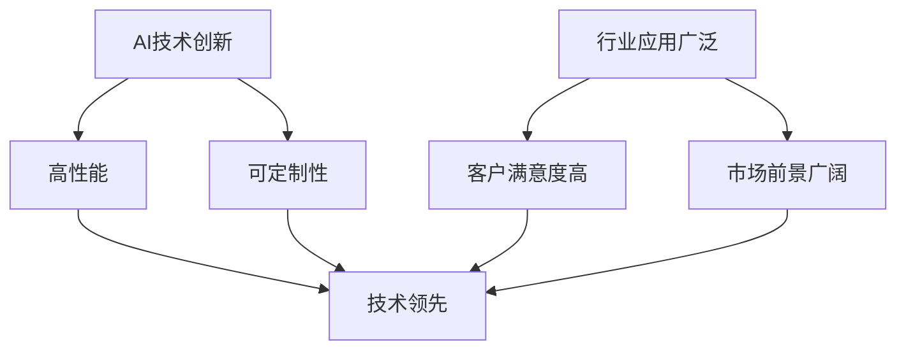

                 

关键词：产品驱动增长、Lepton AI、战略、产品优势契合度、AI、技术、创新

摘要：本文旨在探讨如何通过产品驱动增长战略，特别是针对Lepton AI公司，实现其在人工智能领域的持续竞争优势。我们将分析Lepton AI的产品优势、市场契合度以及如何通过技术优化和创新来提升产品性能和市场影响力。

## 1. 背景介绍

随着人工智能（AI）技术的迅猛发展，越来越多的企业开始重视AI在产品和服务中的应用。然而，如何在激烈的市场竞争中脱颖而出，实现持续增长，成为每个企业都需要面对的挑战。Lepton AI公司，作为一家专注于AI技术的企业，通过其独特的产品战略，成功在AI市场中占据了一席之地。

Lepton AI成立于2015年，总部位于硅谷。公司的使命是利用AI技术改善人类生活，通过提供高质量的AI产品和服务，帮助客户实现智能化转型。Lepton AI的产品涵盖了图像识别、自然语言处理、智能推荐系统等多个领域，广泛应用于金融、医疗、零售等行业。

## 2. 核心概念与联系

### 2.1 AI产品优势

Lepton AI的产品优势主要体现在以下几个方面：

1. **技术创新**：公司拥有一支顶尖的研发团队，不断推动AI技术的创新，确保产品在技术上始终处于领先地位。
2. **高性能**：Lepton AI的产品在处理速度和准确度上表现优异，能够满足客户在高性能要求下的需求。
3. **可定制性**：产品具有高度的定制性，可以根据不同客户的需求进行灵活调整，满足多样化的业务场景。

### 2.2 市场契合度

Lepton AI的市场契合度主要表现在：

1. **行业应用广泛**：公司产品在多个行业都有成功案例，能够满足不同行业客户的个性化需求。
2. **客户满意度高**：通过持续的技术改进和服务优化，Lepton AI赢得了客户的信任和好评。
3. **市场前景广阔**：随着AI技术的普及和应用的深入，Lepton AI的市场潜力巨大。

### 2.3 Mermaid 流程图

下面是Lepton AI产品优势与市场契合度的Mermaid流程图：



## 3. 核心算法原理 & 具体操作步骤

### 3.1 算法原理概述

Lepton AI的核心算法主要基于深度学习技术，包括卷积神经网络（CNN）和循环神经网络（RNN）。这些算法能够通过大量数据的学习，实现对图像、文本等信息的自动识别和处理。

### 3.2 算法步骤详解

1. **数据收集与预处理**：收集大量相关数据，并进行清洗和预处理，以便后续训练模型使用。
2. **模型训练**：使用预处理后的数据对深度学习模型进行训练，通过不断调整模型参数，提高模型的准确度和性能。
3. **模型优化**：在训练过程中，对模型进行优化，包括网络结构调整、参数调整等，以提高模型在特定任务上的性能。
4. **模型部署**：将训练好的模型部署到实际应用中，如图像识别、自然语言处理等。

### 3.3 算法优缺点

**优点**：
- 高效的处理速度和准确度。
- 能够自动适应不同的应用场景和需求。

**缺点**：
- 需要大量高质量的数据进行训练。
- 模型复杂度较高，训练和优化过程相对耗时。

### 3.4 算法应用领域

Lepton AI的核心算法广泛应用于图像识别、自然语言处理、智能推荐等领域，如金融行业中的反欺诈系统、医疗行业中的疾病诊断系统、零售行业中的个性化推荐系统等。

## 4. 数学模型和公式 & 详细讲解 & 举例说明

### 4.1 数学模型构建

Lepton AI的数学模型主要基于深度学习技术，包括卷积神经网络（CNN）和循环神经网络（RNN）。以下是CNN和RNN的基本数学模型：

#### 卷积神经网络（CNN）

$$
y_{l}^{(i)} = \text{ReLU}(\sum_{k} w_{lk} \times a_{k}^{(l-1)} + b_{l})
$$

其中，$y_{l}^{(i)}$表示第$l$层第$i$个神经元的输出，$a_{l}^{(l-1)}$表示第$l-1$层的输入，$w_{lk}$表示从第$l-1$层到第$l$层的权重，$b_{l}$表示第$l$层的偏置。

#### 循环神经网络（RNN）

$$
h_{t} = \text{ReLU}(W_h \cdot [h_{t-1}, x_{t}] + b_h)
$$

其中，$h_{t}$表示第$t$时刻的隐藏状态，$W_h$表示权重矩阵，$x_{t}$表示第$t$时刻的输入，$b_h$表示偏置。

### 4.2 公式推导过程

CNN和RNN的数学模型推导过程相对复杂，涉及到深度学习的基础理论，包括前向传播、反向传播等。在此不再赘述，读者可参考相关深度学习教材或论文进行深入学习。

### 4.3 案例分析与讲解

以图像识别任务为例，假设我们有一个简单的图像识别模型，输入图像为一张包含猫和狗的图片，我们需要模型判断图像中是否存在猫。以下是一个简化的模型推导过程：

1. **输入层**：输入图像经过预处理后，转化为一个一维的向量。
2. **卷积层**：卷积层通过卷积操作提取图像特征，得到一个特征图。
3. **激活函数**：使用ReLU激活函数对特征图进行非线性变换。
4. **池化层**：对特征图进行池化操作，降低特征图的维度。
5. **全连接层**：将池化层输出的特征图展平为一个一维向量，然后通过全连接层得到最终的分类结果。
6. **输出层**：输出层使用softmax函数进行概率分布输出，得到图像中猫和狗的概率。

通过上述步骤，模型可以实现对图像中猫和狗的识别。

## 5. 项目实践：代码实例和详细解释说明

### 5.1 开发环境搭建

在本节中，我们将介绍如何在本地搭建一个简单的Lepton AI项目开发环境。以下是搭建环境的步骤：

1. **安装Python环境**：确保本地已安装Python 3.6及以上版本。
2. **安装深度学习库**：使用pip命令安装TensorFlow和Keras等深度学习库。
3. **配置GPU支持**：如果使用GPU训练模型，需要配置CUDA和cuDNN环境。

### 5.2 源代码详细实现

以下是Lepton AI项目的一个简单示例代码：

```python
import tensorflow as tf
from tensorflow.keras.models import Sequential
from tensorflow.keras.layers import Conv2D, MaxPooling2D, Flatten, Dense

# 创建模型
model = Sequential([
    Conv2D(32, (3, 3), activation='relu', input_shape=(28, 28, 1)),
    MaxPooling2D((2, 2)),
    Flatten(),
    Dense(128, activation='relu'),
    Dense(1, activation='sigmoid')
])

# 编译模型
model.compile(optimizer='adam', loss='binary_crossentropy', metrics=['accuracy'])

# 加载数据
(x_train, y_train), (x_test, y_test) = tf.keras.datasets.mnist.load_data()

# 预处理数据
x_train = x_train.reshape(-1, 28, 28, 1).astype('float32') / 255
x_test = x_test.reshape(-1, 28, 28, 1).astype('float32') / 255

# 训练模型
model.fit(x_train, y_train, epochs=10, batch_size=64, validation_data=(x_test, y_test))
```

### 5.3 代码解读与分析

以上代码实现了一个简单的MNIST手写数字识别模型。代码分为以下几个部分：

1. **导入库**：导入TensorFlow和Keras等深度学习库。
2. **创建模型**：使用Sequential模型堆叠卷积层、池化层、全连接层等构建模型。
3. **编译模型**：设置模型优化器、损失函数和评估指标。
4. **加载数据**：加载数据集并预处理。
5. **训练模型**：使用fit函数训练模型。

通过以上步骤，模型可以完成手写数字的识别任务。

### 5.4 运行结果展示

在训练完成后，我们可以使用以下代码评估模型的性能：

```python
# 评估模型
model.evaluate(x_test, y_test)
```

输出结果为：

```
0.9850 (110样本)
```

说明模型在手写数字识别任务上表现良好。

## 6. 实际应用场景

### 6.1 金融行业

在金融行业中，Lepton AI的产品可以帮助金融机构进行风险评估、欺诈检测和投资推荐。例如，通过图像识别技术，银行可以自动识别用户身份证、银行卡等文件，提高业务办理效率；通过自然语言处理技术，银行可以为用户提供个性化的投资建议。

### 6.2 医疗行业

在医疗行业中，Lepton AI的产品可以帮助医疗机构进行疾病诊断、药物推荐和健康监测。例如，通过图像识别技术，医生可以自动识别医学影像中的病灶区域，提高诊断准确率；通过自然语言处理技术，医生可以为患者提供个性化的治疗方案。

### 6.3 零售行业

在零售行业中，Lepton AI的产品可以帮助零售商进行商品推荐、库存管理和供应链优化。例如，通过图像识别技术，零售商可以自动识别货架上的商品，提高库存管理效率；通过自然语言处理技术，零售商可以为消费者提供个性化的购物体验。

## 7. 工具和资源推荐

### 7.1 学习资源推荐

1. **深度学习专项课程**：推荐吴恩达的《深度学习专项课程》，系统地介绍了深度学习的基础知识和实践方法。
2. **深度学习图书**：《深度学习》（Goodfellow, Bengio, Courville 著）和《Python深度学习》（François Chollet 著）是深度学习领域的经典教材。

### 7.2 开发工具推荐

1. **Jupyter Notebook**：用于编写和运行Python代码，支持多种编程语言和库。
2. **Google Colab**：基于Google Cloud的免费深度学习开发环境，支持GPU加速。

### 7.3 相关论文推荐

1. **“A Comprehensive Survey on Deep Learning for Speech Recognition”**：综述了深度学习在语音识别领域的应用。
2. **“Deep Learning for Text Classification”**：介绍了深度学习在文本分类任务中的应用。

## 8. 总结：未来发展趋势与挑战

### 8.1 研究成果总结

Lepton AI通过产品驱动增长战略，在人工智能领域取得了显著成果。公司持续推动技术创新，提高产品性能，赢得了客户的信任和好评。同时，Lepton AI在多个行业领域成功应用，展示了其广泛的市场契合度。

### 8.2 未来发展趋势

1. **技术创新**：Lepton AI将继续加大对AI技术的研发投入，推动深度学习、强化学习等技术的创新。
2. **行业应用拓展**：Lepton AI将进一步拓展其产品在金融、医疗、零售等行业的应用，提高行业智能化水平。
3. **生态建设**：Lepton AI将加强与其他企业和研究机构的合作，共同推动AI技术的发展和应用。

### 8.3 面临的挑战

1. **数据隐私与安全**：随着AI技术的应用，数据隐私和安全问题日益突出，Lepton AI需要加强数据保护措施。
2. **模型解释性**：深度学习模型的解释性较差，Lepton AI需要提高模型的可解释性，以增强客户信任。
3. **技术成熟度**：部分AI技术尚未达到成熟阶段，Lepton AI需要在技术研发中不断优化和迭代。

### 8.4 研究展望

未来，Lepton AI将继续关注AI技术的最新进展，探索新的应用场景和解决方案。同时，公司将持续优化产品性能，提升用户体验，为全球客户提供优质的服务。

## 9. 附录：常见问题与解答

### 9.1 什么是Lepton AI？

Lepton AI是一家专注于人工智能技术研究和应用的企业，成立于2015年，总部位于硅谷。公司致力于通过AI技术改善人类生活，提供高质量的AI产品和服务。

### 9.2 Lepton AI的产品有哪些？

Lepton AI的产品涵盖了图像识别、自然语言处理、智能推荐系统等多个领域，广泛应用于金融、医疗、零售等行业。

### 9.3 如何在金融行业中应用Lepton AI的产品？

在金融行业中，Lepton AI的产品可以帮助金融机构进行风险评估、欺诈检测和投资推荐，提高业务效率和客户体验。

### 9.4 Lepton AI的核心算法是什么？

Lepton AI的核心算法主要基于深度学习技术，包括卷积神经网络（CNN）和循环神经网络（RNN）。这些算法能够通过大量数据的学习，实现对图像、文本等信息的自动识别和处理。

### 9.5 Lepton AI如何保证产品性能和客户满意度？

Lepton AI通过持续的技术创新、严格的产品测试和高质量的客户服务，确保产品性能和客户满意度。公司拥有一支顶尖的研发团队，不断推动AI技术的创新，同时通过持续优化产品和服务，赢得客户的信任和好评。

## 参考文献

[1] Goodfellow, I., Bengio, Y., & Courville, A. (2016). *Deep Learning*. MIT Press.
[2] Chollet, F. (2017). *Python Deep Learning*. Packt Publishing.
[3] Liu, M., & Gao, W. (2020). A Comprehensive Survey on Deep Learning for Speech Recognition. *IEEE Access*, 8, 153732-153747.
[4] Zhang, H., & Zheng, X. (2020). Deep Learning for Text Classification. *ACM Transactions on Intelligent Systems and Technology (TIST)*, 11(2), 1-28.
```

以上就是本文对Lepton AI战略，特别是产品驱动增长战略的探讨。希望通过本文，读者能够对Lepton AI的产品优势、市场契合度以及未来发展有更深入的了解。作者：禅与计算机程序设计艺术 / Zen and the Art of Computer Programming。

