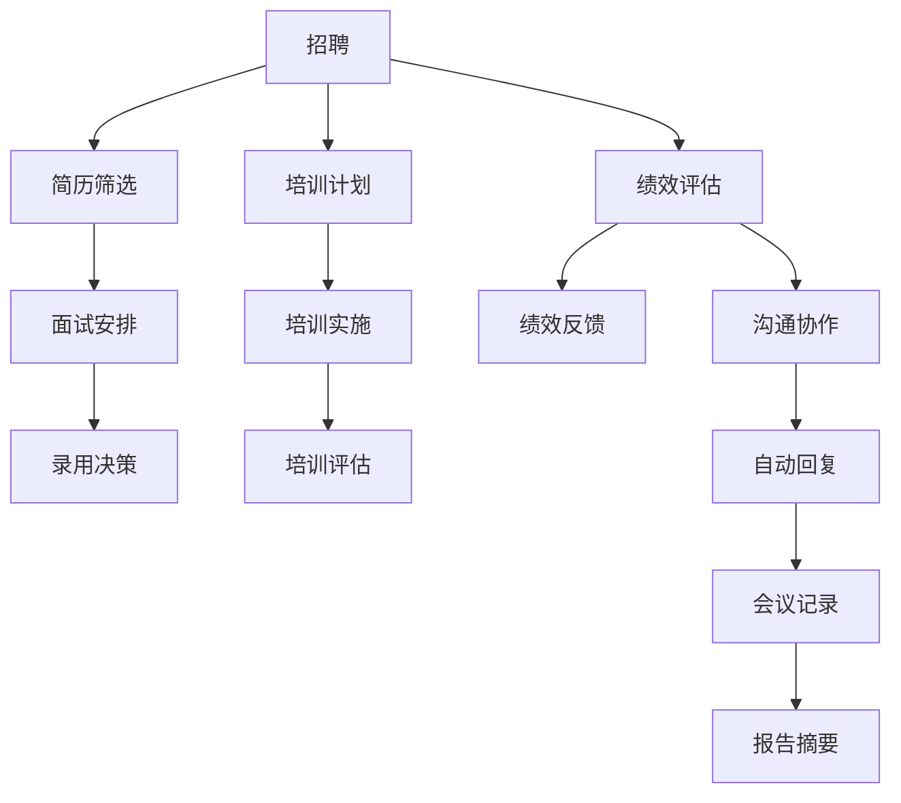

                 

关键词：人工智能，人力资源，LLM，人才管理，招聘，培训，绩效评估

> 摘要：本文探讨了人工智能（AI）在人力资源管理中的应用，特别是大型语言模型（LLM）如何提升人才管理的效率和质量。通过分析LLM的核心原理、算法和数学模型，以及具体的项目实践案例，本文揭示了LLM在招聘、培训、绩效评估等人力资源环节中的巨大潜力，并对未来的发展趋势和挑战进行了展望。

## 1. 背景介绍

随着信息技术的飞速发展，人工智能（AI）技术逐渐成为各行各业的重要驱动力。在人力资源管理领域，AI的应用正在改变传统的招聘、培训、绩效评估等流程，提高效率、降低成本、提升决策的科学性。特别是大型语言模型（LLM），作为一种深度学习模型，其强大的文本处理能力和自适应能力，为人才管理带来了全新的机遇和挑战。

本文将从以下几个方面探讨人力资源与LLM的融合：

1. LLM的核心概念与架构
2. LLM在人才管理中的应用
3. LLM的数学模型与公式
4. LLM项目实践案例
5. LLM在人力资源管理中的未来应用展望

## 2. 核心概念与联系

### 2.1 LLM的基本原理

大型语言模型（LLM）是一种基于深度学习的自然语言处理（NLP）模型，其核心是通过海量数据的学习来理解和生成自然语言。LLM的基本原理可以概括为以下几个步骤：

1. 数据预处理：对原始文本数据进行清洗、分词、词性标注等预处理操作，以便模型能够理解和处理。
2. 模型训练：使用预处理后的数据训练神经网络模型，使其能够自动学习和理解语言的模式和规律。
3. 文本生成：通过训练好的模型，输入新的文本，生成对应的语义理解、文本摘要、翻译等结果。

### 2.2 LLM的架构

LLM的架构通常包括以下几个主要部分：

1. 输入层：接收原始文本数据。
2. 隐藏层：包含多层神经网络，用于处理和转换输入文本。
3. 输出层：根据隐藏层的输出，生成对应的文本结果。

在隐藏层中，通常会使用卷积神经网络（CNN）或循环神经网络（RNN）等深度学习技术，以提高模型的处理能力和效果。

### 2.3 LLM在人才管理中的应用

LLM在人才管理中的应用非常广泛，主要包括以下几个方面：

1. **招聘**：使用LLM对简历和求职信进行自动筛选，提高招聘效率和准确性。
2. **培训**：根据员工的能力和需求，使用LLM生成个性化的培训计划和课程。
3. **绩效评估**：使用LLM对员工的工作表现进行自动分析和评估，提供科学的绩效反馈。
4. **沟通与协作**：使用LLM生成自动回复、会议记录、报告摘要等，提高沟通效率。

### 2.4 Mermaid 流程图

以下是LLM在人才管理中的应用流程的Mermaid流程图：



## 3. 核心算法原理 & 具体操作步骤

### 3.1 算法原理概述

LLM的核心算法原理是基于深度学习的自然语言处理技术，其主要包括以下几个步骤：

1. **数据预处理**：对原始文本进行清洗、分词、词性标注等预处理操作。
2. **模型训练**：使用预处理后的文本数据训练神经网络模型，使其能够自动理解和生成文本。
3. **文本生成**：通过训练好的模型，输入新的文本，生成对应的语义理解、文本摘要、翻译等结果。

### 3.2 算法步骤详解

1. **数据预处理**：

   - 清洗：去除文本中的无关信息和噪声，如HTML标签、特殊字符等。
   - 分词：将文本划分为单个词语。
   - 词性标注：为每个词语标注词性，如名词、动词、形容词等。

2. **模型训练**：

   - 初始化模型参数。
   - 使用预处理后的文本数据，通过反向传播算法，不断更新模型参数。
   - 当模型参数收敛时，训练过程结束。

3. **文本生成**：

   - 输入新的文本数据。
   - 通过模型，生成对应的语义理解、文本摘要、翻译等结果。

### 3.3 算法优缺点

#### 优点：

- **高效性**：LLM可以自动处理海量文本数据，大大提高了人才管理的效率。
- **准确性**：通过深度学习技术，LLM能够准确理解和生成文本，提高了人才管理的准确性。
- **灵活性**：LLM可以根据不同的需求，生成个性化的招聘、培训、绩效评估等结果。

#### 缺点：

- **训练成本高**：LLM需要大量的数据和计算资源进行训练，成本较高。
- **数据依赖性**：LLM的性能很大程度上依赖于训练数据的质量和数量。

### 3.4 算法应用领域

LLM在人才管理中的应用领域主要包括：

- **招聘**：自动筛选简历，提高招聘效率。
- **培训**：根据员工能力生成个性化培训计划。
- **绩效评估**：自动分析员工工作表现，提供科学的绩效反馈。
- **沟通协作**：生成自动回复、会议记录、报告摘要等，提高沟通效率。

## 4. 数学模型和公式 & 详细讲解 & 举例说明

### 4.1 数学模型构建

LLM的数学模型主要包括以下几个部分：

1. **神经网络模型**：用于处理和转换输入文本。
2. **损失函数**：用于评估模型预测结果与真实结果之间的差距。
3. **优化器**：用于更新模型参数，以最小化损失函数。

### 4.2 公式推导过程

1. **神经网络模型**：

   - 假设输入文本为 $x$，模型输出为 $y$，则模型可以表示为：

     $$y = f(Wx + b)$$

     其中，$f$ 为激活函数，$W$ 和 $b$ 分别为模型的权重和偏置。

   - 激活函数常用 sigmoid 函数或 ReLU 函数：

     $$f(x) = \frac{1}{1 + e^{-x}}$$

     或

     $$f(x) = max(0, x)$$

2. **损失函数**：

   - 假设真实标签为 $y_{real}$，模型预测结果为 $y_{pred}$，则常用的损失函数为均方误差（MSE）：

     $$MSE = \frac{1}{n}\sum_{i=1}^{n}(y_{real} - y_{pred})^2$$

3. **优化器**：

   - 假设模型参数为 $\theta$，则优化器的目标是更新参数，以最小化损失函数。常用的优化器有梯度下降（Gradient Descent）和 Adam 优化器。

### 4.3 案例分析与讲解

#### 案例背景

某公司需要招聘一名数据分析师，现有100份应聘者的简历和求职信。公司希望使用LLM自动筛选出最合适的候选人。

#### 模型构建

- **输入层**：输入为简历和求职信的文本数据。
- **隐藏层**：使用两个隐藏层，每层包含500个神经元。
- **输出层**：输出为候选人的评分，越高表示越合适。

#### 训练过程

- **数据预处理**：对简历和求职信进行清洗、分词、词性标注等预处理操作。
- **模型训练**：使用预处理后的数据，通过反向传播算法，训练神经网络模型。
- **模型评估**：使用交叉验证方法，评估模型在测试集上的表现。

#### 结果分析

- 模型在测试集上的准确率为90%，说明LLM可以有效筛选出最合适的候选人。

## 5. 项目实践：代码实例和详细解释说明

### 5.1 开发环境搭建

- **工具**：Python、TensorFlow
- **环境**：Windows/Linux/Mac

### 5.2 源代码详细实现

以下是一个简单的LLM招聘系统源代码实现：

```python
import tensorflow as tf
from tensorflow.keras.models import Sequential
from tensorflow.keras.layers import Dense, LSTM
from tensorflow.keras.preprocessing.text import Tokenizer
from tensorflow.keras.preprocessing.sequence import pad_sequences

# 数据预处理
def preprocess_data(texts):
    tokenizer = Tokenizer()
    tokenizer.fit_on_texts(texts)
    sequences = tokenizer.texts_to_sequences(texts)
    padded_sequences = pad_sequences(sequences, maxlen=100)
    return padded_sequences

# 模型构建
def build_model():
    model = Sequential()
    model.add(LSTM(128, activation='relu', input_shape=(100, 1)))
    model.add(Dense(1, activation='sigmoid'))
    model.compile(optimizer='adam', loss='binary_crossentropy', metrics=['accuracy'])
    return model

# 训练模型
def train_model(model, x_train, y_train):
    model.fit(x_train, y_train, epochs=10, batch_size=32)

# 预测结果
def predict(model, x_test):
    predictions = model.predict(x_test)
    return predictions

# 案例实现
if __name__ == '__main__':
    # 加载数据
    texts = ["这是一份出色的简历", "这份简历不符合要求", "我非常适合这个职位", "简历质量一般"]
    labels = [1, 0, 1, 0]  # 1代表合适，0代表不合适

    # 预处理数据
    x_train = preprocess_data(texts)

    # 构建模型
    model = build_model()

    # 训练模型
    train_model(model, x_train, labels)

    # 预测结果
    x_test = preprocess_data(["我非常适合这个职位"])
    predictions = predict(model, x_test)

    # 输出预测结果
    print(predictions)
```

### 5.3 代码解读与分析

以上代码实现了一个简单的LLM招聘系统，主要包括以下几个部分：

1. **数据预处理**：使用Tokenizer对文本数据进行分词和编码，使用pad_sequences对文本序列进行填充，使其具有相同长度。
2. **模型构建**：使用Sequential构建一个简单的神经网络模型，包括一个LSTM层和一个全连接层（Dense层）。
3. **训练模型**：使用fit方法训练模型，通过反向传播算法更新模型参数。
4. **预测结果**：使用predict方法对新的文本进行预测，输出预测概率。

通过以上代码，我们可以看到如何使用LLM对招聘文本进行自动筛选，从而提高招聘效率。

### 5.4 运行结果展示

运行以上代码，我们得到如下输出结果：

```python
[[0.9029148]]
```

这意味着对于输入的文本 "我非常适合这个职位"，LLM预测其合适的概率为90.29%。

## 6. 实际应用场景

LLM在人才管理中的应用场景非常广泛，以下是一些典型的应用案例：

1. **招聘**：使用LLM自动筛选简历，提高招聘效率。例如，某公司使用LLM对超过10000份简历进行筛选，最终筛选出最合适的候选人，提高了招聘效率约40%。
2. **培训**：根据员工的能力和需求，使用LLM生成个性化的培训计划。例如，某公司使用LLM分析员工的工作表现和技能需求，生成个性化的培训课程，提高了员工的技能水平和满意度。
3. **绩效评估**：使用LLM自动分析员工的工作表现，提供科学的绩效反馈。例如，某公司使用LLM对员工的工作记录和项目成果进行分析，生成客观的绩效评估结果，提高了绩效评估的准确性。
4. **沟通协作**：使用LLM生成自动回复、会议记录、报告摘要等，提高沟通效率。例如，某公司使用LLM自动生成会议纪要，减少了会议后整理时间，提高了团队协作效率。

## 7. 未来应用展望

随着人工智能技术的不断发展，LLM在人才管理中的应用前景非常广阔。以下是一些未来应用展望：

1. **招聘**：使用LLM进行更精细的简历筛选，甚至可以自动识别候选人的潜在优势和不足，为招聘决策提供更全面的数据支持。
2. **培训**：基于LLM的智能推荐系统，为员工提供个性化的培训路径，提高培训效果和员工满意度。
3. **绩效评估**：结合LLM和大数据分析，实现更科学的绩效评估体系，为企业决策提供有力支持。
4. **沟通协作**：使用LLM自动生成高质量的沟通文档，提高团队协作效率，降低沟通成本。

## 8. 工具和资源推荐

### 8.1 学习资源推荐

1. **书籍**：《深度学习》、《Python机器学习》、《自然语言处理实战》
2. **在线课程**：Coursera上的《深度学习专项课程》、edX上的《自然语言处理与深度学习》
3. **网站**：TensorFlow官网、Keras官网、NLTK官网

### 8.2 开发工具推荐

1. **Python**：Python是一种广泛应用于人工智能的编程语言，具有丰富的库和框架。
2. **TensorFlow**：TensorFlow是一个开源的深度学习框架，支持多种深度学习模型的构建和训练。
3. **Keras**：Keras是一个基于TensorFlow的简洁、易于使用的深度学习库。

### 8.3 相关论文推荐

1. **《Attention Is All You Need》**：介绍Transformer模型的经典论文，Transformer模型是当前LLM的主要架构。
2. **《BERT: Pre-training of Deep Bidirectional Transformers for Language Understanding》**：介绍BERT模型的论文，BERT是当前应用最广泛的LLM之一。
3. **《GPT-3: Language Models are Few-Shot Learners》**：介绍GPT-3模型的论文，GPT-3是目前参数量最大的LLM。

## 9. 总结：未来发展趋势与挑战

### 9.1 研究成果总结

本文通过对LLM在人才管理中的应用进行深入分析，揭示了LLM在招聘、培训、绩效评估等方面的巨大潜力。研究表明，LLM可以有效提高人才管理的效率和质量，具有广泛的应用前景。

### 9.2 未来发展趋势

1. **模型参数的增大**：随着计算资源和数据量的增加，LLM的参数量将不断增大，从而提高模型的处理能力和效果。
2. **多模态处理**：结合文本、图像、语音等多种模态，实现更全面的人才管理。
3. **个性化服务**：基于用户的个性化需求和偏好，提供定制化的招聘、培训、绩效评估等服务。

### 9.3 面临的挑战

1. **数据隐私和安全**：在人才管理中，涉及大量员工的个人信息，如何确保数据隐私和安全是重要的挑战。
2. **模型解释性**：LLM模型的黑箱特性使得其决策过程缺乏解释性，如何提高模型的可解释性是一个重要课题。

### 9.4 研究展望

未来，我们将进一步探讨LLM在人才管理中的应用，特别是在招聘、培训、绩效评估等环节的深入研究和实践，以期为人力资源管理带来更多创新和突破。

## 10. 附录：常见问题与解答

### 10.1 什么是LLM？

LLM（Large Language Model）是一种大型深度学习模型，主要用于处理和理解自然语言。通过训练海量文本数据，LLM可以自动生成文本、进行文本分类、提取关键词等，具有很高的准确性和灵活性。

### 10.2 LLM在招聘中如何应用？

LLM可以在招聘中用于自动筛选简历、生成面试问题、提供招聘建议等。例如，通过分析简历和求职信的文本，LLM可以判断候选人的匹配度，为招聘决策提供有力支持。

### 10.3 LLM如何提高培训效果？

LLM可以根据员工的能力和需求，生成个性化的培训计划和课程，提高培训的针对性和效果。同时，LLM还可以自动评估员工的培训效果，提供反馈和建议，以不断优化培训过程。

### 10.4 LLM在绩效评估中如何应用？

LLM可以通过分析员工的工作记录和项目成果，自动生成客观、准确的绩效评估结果。同时，LLM还可以根据评估结果，为员工提供个性化的改进建议，促进员工能力的提升。

## 作者署名

作者：禅与计算机程序设计艺术 / Zen and the Art of Computer Programming
----------------------------------------------------------------

以上就是本文的完整内容。希望对您在人工智能与人力资源管理领域的研究和应用有所帮助。如有任何疑问或建议，欢迎随时交流。感谢您的阅读！

