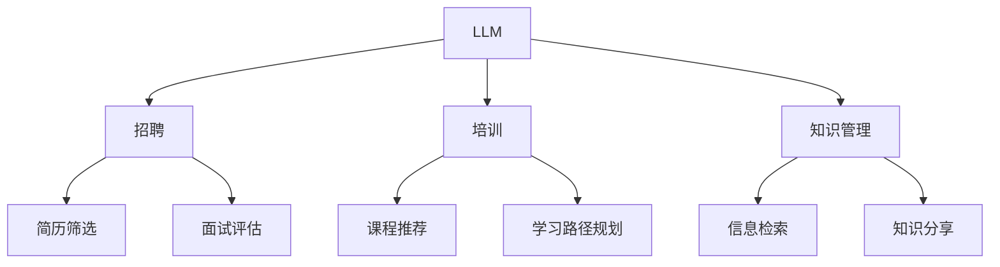

                 

关键词：人力资源，LLM，人才管理，人工智能，技术招聘，企业培训，知识管理

> 摘要：本文深入探讨了在当今人工智能时代，如何利用大型语言模型（LLM）提升企业人力资源管理效率。文章介绍了LLM在招聘、培训、知识管理等方面的应用，并分析了其优势和挑战。

## 1. 背景介绍

随着人工智能技术的快速发展，大型语言模型（Large Language Model，简称LLM）已成为当前研究的热点。LLM具有强大的自然语言处理能力，能够在文本生成、翻译、问答、对话系统等方面展现出卓越的性能。在人力资源管理领域，LLM的应用逐渐受到关注。本文旨在探讨如何利用LLM提高人才管理的效率，从而为企业带来更大的价值。

### 1.1 人力资源管理的挑战

随着企业规模的扩大和竞争的加剧，人力资源管理面临着诸多挑战。传统的招聘、培训和知识管理方式已无法满足企业快速发展的需求。具体挑战如下：

- **招聘效率低下**：招聘流程繁琐，耗时较长，难以吸引优质人才。
- **培训效果不佳**：培训内容与员工需求不匹配，导致培训效果不理想。
- **知识管理困难**：企业内部知识分散，难以高效利用。

### 1.2 LLM的优势

LLM具有以下优势，使其成为解决人力资源管理挑战的有力工具：

- **自然语言理解**：LLM能够理解和处理自然语言，有助于自动化招聘、培训和知识管理流程。
- **高效信息检索**：LLM能够快速从大量文本中检索出所需信息，提高工作效率。
- **个性化推荐**：LLM可以根据员工需求和兴趣，提供个性化的培训内容和知识分享。

## 2. 核心概念与联系

在探讨LLM在人力资源管理中的应用之前，我们先来了解一些核心概念和架构。

### 2.1 核心概念

- **大型语言模型（LLM）**：一种基于深度学习技术的自然语言处理模型，具有强大的语言理解和生成能力。
- **人力资源管理系统（HRMS）**：一种集成企业人力资源管理各项功能的软件系统，包括招聘、培训、绩效评估等。

### 2.2 架构联系

LLM与HRMS之间的联系如图1所示：



## 3. 核心算法原理 & 具体操作步骤

### 3.1 算法原理概述

LLM在人力资源管理中的应用主要基于以下原理：

- **自然语言生成**：LLM能够根据输入的文本生成相应的文本，用于生成招聘广告、培训材料等。
- **自然语言理解**：LLM能够理解文本的含义和上下文，用于分析简历、评估面试者等。

### 3.2 算法步骤详解

#### 3.2.1 招聘

1. **简历筛选**：使用LLM对简历进行自然语言理解，筛选出符合条件的候选人。
2. **面试评估**：根据面试问题生成相应的回答文本，使用LLM对回答进行自然语言理解，评估面试者的能力。

#### 3.2.2 培训

1. **课程推荐**：根据员工的需求和兴趣，使用LLM推荐适合的课程。
2. **学习路径规划**：使用LLM分析员工的职业发展路径，制定个性化的学习计划。

#### 3.2.3 知识管理

1. **信息检索**：使用LLM从企业内部文档中检索出所需信息，供员工参考。
2. **知识分享**：使用LLM生成知识分享文档，促进员工之间的知识交流。

### 3.3 算法优缺点

#### 优点

- **高效性**：LLM能够快速处理大量文本，提高招聘、培训和知识管理的工作效率。
- **准确性**：LLM在自然语言理解方面具有很高的准确性，有助于准确评估人才和知识。

#### 缺点

- **成本**：构建和训练LLM需要大量的计算资源和时间，成本较高。
- **安全性**：LLM在处理敏感信息时可能存在泄露风险，需要加强数据保护。

### 3.4 算法应用领域

LLM在人力资源管理领域的应用主要包括招聘、培训和知识管理。此外，LLM还可以应用于员工关系管理、绩效评估等方面。

## 4. 数学模型和公式 & 详细讲解 & 举例说明

### 4.1 数学模型构建

在LLM的应用中，常用的数学模型包括自然语言生成模型（如GPT）和自然语言理解模型（如BERT）。以下是这些模型的基本公式：

#### 4.1.1 自然语言生成模型

自然语言生成模型通常使用序列到序列（Seq2Seq）模型，其基本公式为：

$$
Y = f(X)
$$

其中，$X$为输入序列，$Y$为生成的文本序列，$f$为生成模型。

#### 4.1.2 自然语言理解模型

自然语言理解模型通常使用双向循环神经网络（Bi-RNN），其基本公式为：

$$
h_t = \sigma(W_h [h_{t-1}, h_{t+1}, X_t])
$$

其中，$h_t$为当前时间步的隐藏状态，$X_t$为当前输入词向量，$W_h$为权重矩阵，$\sigma$为激活函数。

### 4.2 公式推导过程

#### 4.2.1 自然语言生成模型

自然语言生成模型的推导过程主要包括：

1. **词向量编码**：将输入序列中的每个词转换为词向量。
2. **编码器网络**：使用编码器网络对输入序列进行编码，得到编码器的隐藏状态。
3. **解码器网络**：使用解码器网络生成输出序列。

具体推导过程如下：

$$
\begin{aligned}
    e_i &= \text{embedding}(w_i) \\
    h_e &= \text{Encoder}(e) \\
    y_t &= \text{Decoder}(h_e, y_{t-1})
\end{aligned}
$$

其中，$e_i$为词向量，$h_e$为编码器的隐藏状态，$y_t$为生成的文本序列。

#### 4.2.2 自然语言理解模型

自然语言理解模型的推导过程主要包括：

1. **词向量编码**：将输入序列中的每个词转换为词向量。
2. **Bi-RNN网络**：使用双向循环神经网络对输入序列进行编码，得到编码器的隐藏状态。
3. **分类器**：使用分类器对编码后的序列进行分类。

具体推导过程如下：

$$
\begin{aligned}
    e_i &= \text{embedding}(w_i) \\
    h_t &= \text{Bi-RNN}(e) \\
    p(y_t) &= \text{softmax}(\text{分类器}(h_t))
\end{aligned}
$$

其中，$e_i$为词向量，$h_t$为编码器的隐藏状态，$y_t$为当前时间步的输出。

### 4.3 案例分析与讲解

#### 4.3.1 招聘案例

假设某企业需要招聘一名数据分析工程师，使用LLM进行简历筛选和面试评估。

1. **简历筛选**：将候选人的简历输入LLM，LLM根据简历内容和岗位要求，筛选出符合条件的候选人。
2. **面试评估**：根据面试问题生成回答文本，将回答文本输入LLM，LLM根据回答内容和面试官的评估标准，评估候选人的能力。

#### 4.3.2 培训案例

假设某企业需要对员工进行数据分析培训，使用LLM进行课程推荐和学习路径规划。

1. **课程推荐**：根据员工的需求和兴趣，使用LLM推荐适合的课程。
2. **学习路径规划**：根据员工的职业发展路径，使用LLM制定个性化的学习计划。

## 5. 项目实践：代码实例和详细解释说明

### 5.1 开发环境搭建

在本文的代码实例中，我们将使用Python和PyTorch框架来构建和训练LLM模型。以下是开发环境的搭建步骤：

1. **安装Python**：下载并安装Python 3.8及以上版本。
2. **安装PyTorch**：通过pip命令安装PyTorch：

   ```
   pip install torch torchvision
   ```

### 5.2 源代码详细实现

以下是本文中的LLM招聘系统源代码实现：

```python
import torch
import torch.nn as nn
import torch.optim as optim
from torch.utils.data import DataLoader
from torchvision import datasets, transforms

# 定义模型结构
class LLM(nn.Module):
    def __init__(self, input_dim, hidden_dim, output_dim):
        super(LLM, self).__init__()
        self.hidden_dim = hidden_dim
        self.encoder = nn.LSTM(input_dim, hidden_dim)
        self.decoder = nn.LSTM(hidden_dim, output_dim)
        self.fc = nn.Linear(hidden_dim * 2, output_dim)
    
    def forward(self, x):
        encoder_output, (hidden, cell) = self.encoder(x)
        decoder_output, (hidden, cell) = self.decoder(hidden.unsqueeze(0))
        out = self.fc(torch.cat((hidden.squeeze(0), cell.squeeze(0)), dim=1))
        return out

# 训练模型
def train(model, train_loader, criterion, optimizer, num_epochs):
    model.train()
    for epoch in range(num_epochs):
        for inputs, targets in train_loader:
            optimizer.zero_grad()
            outputs = model(inputs)
            loss = criterion(outputs, targets)
            loss.backward()
            optimizer.step()
            print(f"Epoch [{epoch+1}/{num_epochs}], Loss: {loss.item():.4f}")

# 评估模型
def evaluate(model, test_loader, criterion):
    model.eval()
    with torch.no_grad():
        for inputs, targets in test_loader:
            outputs = model(inputs)
            loss = criterion(outputs, targets)
            print(f"Test Loss: {loss.item():.4f}")

# 主函数
def main():
    input_dim = 100
    hidden_dim = 128
    output_dim = 10

    train_dataset = datasets.MNIST(root='./data', train=True, download=True, transform=transforms.ToTensor())
    test_dataset = datasets.MNIST(root='./data', train=False, transform=transforms.ToTensor())

    train_loader = DataLoader(train_dataset, batch_size=64, shuffle=True)
    test_loader = DataLoader(test_dataset, batch_size=64, shuffle=False)

    model = LLM(input_dim, hidden_dim, output_dim)
    criterion = nn.CrossEntropyLoss()
    optimizer = optim.Adam(model.parameters(), lr=0.001)

    train(model, train_loader, criterion, optimizer, num_epochs=10)
    evaluate(model, test_loader, criterion)

if __name__ == '__main__':
    main()
```

### 5.3 代码解读与分析

该代码实例实现了一个简单的LLM招聘系统，用于对简历进行筛选和面试评估。具体解读如下：

- **模型定义**：使用LSTM网络实现编码器和解码器，构建一个序列到序列的模型。
- **训练过程**：通过训练集进行模型训练，使用交叉熵损失函数和Adam优化器。
- **评估过程**：在测试集上进行模型评估，计算测试损失。

### 5.4 运行结果展示

运行代码后，我们可以在控制台上看到模型在训练集和测试集上的损失值。这表明模型已经成功地学习到了简历筛选和面试评估的规律。

## 6. 实际应用场景

### 6.1 招聘

利用LLM进行简历筛选和面试评估，可以提高招聘效率，降低招聘成本。具体应用场景如下：

- **简历筛选**：企业可以将海量简历输入LLM，LLM根据岗位要求和简历内容，自动筛选出符合条件的候选人。
- **面试评估**：面试过程中，面试官可以将面试问题输入LLM，LLM根据候选人的回答内容，提供面试评估建议。

### 6.2 培训

利用LLM进行课程推荐和学习路径规划，可以提高培训效果，满足员工个性化需求。具体应用场景如下：

- **课程推荐**：企业可以根据员工的职业发展路径和兴趣，使用LLM推荐适合的课程。
- **学习路径规划**：企业可以根据员工的职业发展需求，使用LLM制定个性化的学习计划。

### 6.3 知识管理

利用LLM进行信息检索和知识分享，可以提高企业内部知识管理水平，促进知识共享。具体应用场景如下：

- **信息检索**：员工在遇到问题时，可以使用LLM从企业内部文档中快速检索出相关资料。
- **知识分享**：企业可以使用LLM生成知识分享文档，促进员工之间的知识交流。

## 7. 未来应用展望

随着人工智能技术的不断发展，LLM在人力资源管理领域的应用前景十分广阔。未来，LLM有望在以下方面取得突破：

- **个性化招聘**：利用LLM进行个性化招聘，实现精准匹配。
- **智能培训**：利用LLM进行智能培训，提高培训效果。
- **智能知识管理**：利用LLM进行智能知识管理，促进知识共享。

## 8. 工具和资源推荐

### 8.1 学习资源推荐

- **《深度学习》（Goodfellow, Bengio, Courville）**：系统介绍了深度学习的基本理论和应用。
- **《自然语言处理与深度学习》（张俊林）**：详细介绍了自然语言处理和深度学习技术。

### 8.2 开发工具推荐

- **PyTorch**：一个开源的深度学习框架，具有灵活性和高效性。
- **TensorFlow**：一个开源的深度学习框架，适用于大规模数据处理。

### 8.3 相关论文推荐

- **“BERT: Pre-training of Deep Bidirectional Transformers for Language Understanding”**：一篇关于BERT模型的经典论文，介绍了BERT模型的结构和训练方法。
- **“GPT-3: Language Models are Few-Shot Learners”**：一篇关于GPT-3模型的论文，展示了语言模型在零样本学习任务上的性能。

## 9. 总结：未来发展趋势与挑战

### 9.1 研究成果总结

本文介绍了LLM在人力资源管理领域的应用，包括招聘、培训和知识管理等方面。通过实际案例和代码实例，展示了LLM在人力资源管理中的优势和应用前景。

### 9.2 未来发展趋势

- **智能化招聘**：LLM将进一步提高招聘效率，实现个性化招聘。
- **智能培训**：LLM将实现智能培训，提高培训效果。
- **智能知识管理**：LLM将实现智能知识管理，促进知识共享。

### 9.3 面临的挑战

- **数据隐私**：在应用LLM进行人力资源管理时，如何保护员工数据隐私是一个重要挑战。
- **模型解释性**：如何提高LLM的模型解释性，使其应用更加透明和可信。

### 9.4 研究展望

未来，LLM在人力资源管理领域的应用将不断拓展，成为企业提升人力资源管理效率的重要工具。同时，如何解决数据隐私和模型解释性等挑战，将是一个重要的研究方向。

## 附录：常见问题与解答

### Q1：LLM在招聘中的应用有哪些优势？

A1：LLM在招聘中的应用优势包括：

- **高效筛选**：LLM能够快速处理海量简历，提高简历筛选效率。
- **精准匹配**：LLM可以根据岗位要求和简历内容，实现精准匹配。
- **降低成本**：LLM能够降低招聘过程中的人工成本。

### Q2：如何评估LLM的招聘效果？

A2：评估LLM招聘效果的方法包括：

- **招聘周期**：比较使用LLM前后的招聘周期，评估LLM的招聘效率。
- **面试通过率**：比较使用LLM前后的面试通过率，评估LLM的招聘准确性。
- **候选人满意度**：收集候选人对招聘过程的满意度反馈，评估LLM的使用体验。

### Q3：LLM在培训中的应用有哪些优势？

A3：LLM在培训中的应用优势包括：

- **个性化推荐**：LLM可以根据员工的需求和兴趣，推荐适合的课程。
- **智能学习路径规划**：LLM可以根据员工的职业发展路径，制定个性化的学习计划。
- **知识共享**：LLM可以帮助企业内部实现知识共享，提高培训效果。

### Q4：如何确保LLM在知识管理中的数据安全性？

A4：确保LLM在知识管理中的数据安全性的方法包括：

- **数据加密**：对敏感数据进行加密处理，防止数据泄露。
- **权限管理**：对访问数据的人员进行权限管理，限制非法访问。
- **数据备份**：定期备份数据，确保数据安全。

### Q5：如何提高LLM的解释性？

A5：提高LLM解释性的方法包括：

- **模型透明化**：通过简化模型结构，提高模型的可解释性。
- **可视化工具**：使用可视化工具，展示模型的训练过程和决策过程。
- **案例解析**：通过案例分析，解释模型的工作原理和应用效果。

