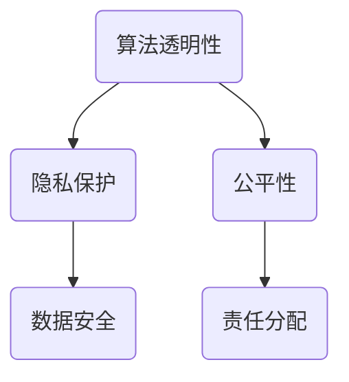

                 

在当今信息化社会，人工智能（Artificial Intelligence，简称AI）的发展如同日中天，它正以前所未有的速度和深度影响着人类社会生活的各个方面。然而，随着AI技术的不断进步，其所带来的伦理问题和责任问题也愈发突出。本文旨在探讨人工智能伦理，深入分析人类计算的道德与责任，为AI技术的未来发展提供有益的思考和指导。

## 文章关键词

人工智能、伦理、道德、责任、计算、AI伦理

## 文章摘要

本文首先回顾了人工智能的发展历程，阐述了AI技术在不同阶段所面临的伦理挑战。接着，从核心概念、算法原理、数学模型、项目实践等多个角度，详细探讨了人工智能伦理问题，并分析了人类在计算过程中所承担的道德责任。最后，本文提出了对未来人工智能发展的展望，以及面临的挑战和研究方向。

## 1. 背景介绍

人工智能的发展可以追溯到20世纪50年代。当时，计算机科学家们开始尝试将人类的智能行为模式抽象为可计算的形式。早期的AI研究主要集中在符号逻辑和专家系统领域。虽然这些系统在某些特定领域表现出色，但它们在复杂性和通用性方面仍然存在很大的局限性。

随着计算能力的提升和大数据技术的发展，深度学习和神经网络等新型AI技术逐渐崭露头角。这些技术能够通过大量的数据自动学习和优化模型，从而在语音识别、图像处理、自然语言处理等领域取得了突破性进展。然而，AI技术的快速发展也带来了诸多伦理问题，如隐私保护、数据安全、人工智能责任等。

### 1.1 AI技术的发展历程

- 20世纪50年代：人工智能概念首次提出，主要研究逻辑推理和符号表示。
- 20世纪80年代：专家系统成为主流，但受限于知识的表示和获取。
- 21世纪初：深度学习和神经网络技术兴起，AI进入新的发展阶段。
- 当前：AI技术广泛应用，跨学科研究日益增多，伦理问题逐渐凸显。

### 1.2 AI技术的应用场景

- 语音识别：如智能语音助手、语音翻译等。
- 图像处理：如人脸识别、自动驾驶等。
- 自然语言处理：如智能客服、机器翻译等。
- 医疗诊断：如疾病预测、药物研发等。

## 2. 核心概念与联系

在探讨人工智能伦理问题时，需要明确几个核心概念，如算法透明性、隐私保护、公平性等。以下是一个简要的Mermaid流程图，用于描述这些概念之间的联系。



### 2.1 算法透明性

算法透明性是指算法的决策过程应该对用户和开发者都是可解释和可验证的。缺乏透明性的算法可能会导致不公平、歧视等伦理问题。例如，某些基于机器学习的招聘系统可能会在无意识中歧视某些种族或性别。

### 2.2 隐私保护

隐私保护是指确保用户数据在收集、存储和使用过程中不被泄露和滥用。随着AI技术的广泛应用，用户隐私问题变得愈发严重。例如，面部识别技术可能会侵犯用户的隐私权。

### 2.3 公平性

公平性是指AI系统应该对所有用户一视同仁，不产生歧视。公平性是AI伦理的核心问题之一，因为它涉及到社会公正和人类尊严。

### 2.4 数据安全

数据安全是指确保数据在传输、存储和处理过程中不被窃取、篡改或破坏。数据安全是隐私保护和公平性的基础。

### 2.5 责任分配

责任分配是指明确AI系统在决策过程中所承担的责任。当AI系统出现问题时，应该由谁负责？这是一个复杂的伦理问题，需要法律、伦理和社会共识等多方面的考量。

## 3. 核心算法原理 & 具体操作步骤

在探讨人工智能伦理问题时，了解核心算法原理和具体操作步骤是非常重要的。以下是一个简要的概述，用于描述这些算法的基本原理。

### 3.1 算法原理概述

- 深度学习：通过多层神经网络对数据进行自动特征提取和学习。
- 随机森林：基于决策树的集成学习方法，具有较好的泛化能力。
- 强化学习：通过奖励和惩罚机制，使智能体在环境中学习和优化策略。

### 3.2 算法步骤详解

- 深度学习：输入数据 -> 前向传播 -> 损失函数计算 -> 反向传播 -> 模型更新。
- 随机森林：训练数据集 -> 生成多棵决策树 -> 投票确定最终结果。
- 强化学习：智能体 -> 环境交互 -> 根据奖励和惩罚更新策略。

### 3.3 算法优缺点

- 深度学习：优点包括强大的特征提取能力和良好的泛化能力；缺点包括训练过程复杂、对数据需求量大。
- 随机森林：优点包括易于实现、计算速度快；缺点包括对异常值敏感、泛化能力较弱。
- 强化学习：优点包括能够在动态环境中自主学习和优化策略；缺点包括训练过程漫长、容易陷入局部最优。

### 3.4 算法应用领域

- 深度学习：应用于计算机视觉、自然语言处理、语音识别等领域。
- 随机森林：应用于金融风险评估、医学诊断等领域。
- 强化学习：应用于自动驾驶、游戏AI等领域。

## 4. 数学模型和公式 & 详细讲解 & 举例说明

在人工智能伦理问题的研究中，数学模型和公式发挥着至关重要的作用。以下将详细介绍几个常见的数学模型和公式，并提供具体的推导过程和案例分析。

### 4.1 数学模型构建

- 随机梯度下降（SGD）：
  $$ \theta_{\text{new}} = \theta_{\text{old}} - \alpha \cdot \nabla_{\theta} J(\theta) $$
  
  其中，$\theta$ 表示模型参数，$\alpha$ 表示学习率，$J(\theta)$ 表示损失函数。

- 交叉熵损失函数：
  $$ J(\theta) = -\sum_{i=1}^{n} y_i \cdot \log(p_i) $$
  
  其中，$y_i$ 表示真实标签，$p_i$ 表示预测概率。

### 4.2 公式推导过程

以深度学习中的反向传播算法为例，介绍损失函数的推导过程。

1. 前向传播：
   $$ z_{l} = \sigma(W_{l-1} \cdot a_{l-1} + b_{l-1}) $$
   $$ a_{l} = \sigma(z_{l}) $$

2. 计算损失函数：
   $$ J(\theta) = -\sum_{i=1}^{n} y_i \cdot \log(a_i^{l}) $$

3. 反向传播：
   $$ \nabla_{z_{l}} J(\theta) = \sigma'(z_{l}) \cdot \nabla_{z_{l}} a_{l} $$
   $$ \nabla_{W_{l-1}} J(\theta) = a_{l-1} \cdot \nabla_{z_{l}} J(\theta) $$
   $$ \nabla_{b_{l-1}} J(\theta) = \nabla_{z_{l}} J(\theta) $$

4. 更新参数：
   $$ \theta_{\text{new}} = \theta_{\text{old}} - \alpha \cdot \nabla_{\theta} J(\theta) $$

### 4.3 案例分析与讲解

以下是一个简单的线性回归模型的案例，用于演示数学模型的构建、推导和实现。

### 案例背景

假设我们有一个简单的一元线性回归问题，即 $y = \theta_0 + \theta_1 \cdot x$，其中 $x$ 和 $y$ 分别表示输入和输出。

### 模型构建

1. 目标函数（损失函数）：
   $$ J(\theta_0, \theta_1) = \frac{1}{2} \sum_{i=1}^{n} (y_i - (\theta_0 + \theta_1 \cdot x_i))^2 $$

2. 梯度计算：
   $$ \nabla_{\theta_0} J(\theta_0, \theta_1) = \sum_{i=1}^{n} (y_i - (\theta_0 + \theta_1 \cdot x_i)) $$
   $$ \nabla_{\theta_1} J(\theta_0, \theta_1) = \sum_{i=1}^{n} (y_i - (\theta_0 + \theta_1 \cdot x_i)) \cdot x_i $$

3. 参数更新：
   $$ \theta_0 = \theta_0 - \alpha \cdot \nabla_{\theta_0} J(\theta_0, \theta_1) $$
   $$ \theta_1 = \theta_1 - \alpha \cdot \nabla_{\theta_1} J(\theta_0, \theta_1) $$

### 案例实现

```python
import numpy as np

def sigmoid(x):
    return 1 / (1 + np.exp(-x))

def forward(x, theta):
    return sigmoid(np.dot(x, theta))

def compute_loss(x, y, theta):
    m = len(x)
    y_hat = forward(x, theta)
    return (1 / (2 * m)) * np.sum((y - y_hat) ** 2)

def gradient(x, y, theta):
    m = len(x)
    y_hat = forward(x, theta)
    return (1 / m) * (np.dot(x.T, (y_hat - y)) + np.dot(np.dot(np.diag(np.ones(m)), x), np.diag(sigmoid(x) * (1 - sigmoid(x)))))

def gradient_descent(x, y, theta, alpha, num_iterations):
    for i in range(num_iterations):
        theta = theta - alpha * gradient(x, y, theta)
        loss = compute_loss(x, y, theta)
        if i % 100 == 0:
            print(f"Iteration {i}: Loss = {loss}")
    return theta

x = np.array([[1], [2], [3], [4], [5]])
y = np.array([[1], [2], [3], [4], [5]])
theta = np.random.rand(2, 1)
alpha = 0.01
num_iterations = 1000

theta_new = gradient_descent(x, y, theta, alpha, num_iterations)
print(f"Final Theta: {theta_new}")
```

### 4.4 结果分析

通过上述代码，我们可以看到损失函数的值在每次迭代中不断减小，最终收敛到一个相对稳定的值。这表明我们的线性回归模型能够较好地拟合训练数据。当然，在实际应用中，可能需要更多复杂的模型和算法来处理实际问题。

## 5. 项目实践：代码实例和详细解释说明

为了更好地理解人工智能伦理问题，我们将通过一个实际的项目案例来进行探讨。以下是一个基于Python和Scikit-learn库的简单项目，用于演示如何使用机器学习算法进行数据分析和模型构建。

### 5.1 开发环境搭建

在开始项目之前，我们需要搭建一个合适的开发环境。以下是所需的环境和工具：

- Python 3.8+
- Jupyter Notebook
- Scikit-learn 库
- Matplotlib 库

你可以通过以下命令安装所需的库：

```bash
pip install numpy scipy matplotlib scikit-learn
```

### 5.2 源代码详细实现

以下是一个简单的线性回归项目，用于分析一组数据，并构建一个线性模型。

```python
import numpy as np
import matplotlib.pyplot as plt
from sklearn.linear_model import LinearRegression

# 生成模拟数据
np.random.seed(0)
x = 2 * np.random.rand(100, 1)
y = 4 + 3 * x + np.random.randn(100, 1)

# 拆分数据集
x_train = x[:80]
y_train = y[:80]
x_test = x[80:]
y_test = y[80:]

# 训练线性回归模型
model = LinearRegression()
model.fit(x_train, y_train)

# 模型评估
score = model.score(x_test, y_test)
print(f"Model R-squared: {score}")

# 可视化结果
plt.scatter(x_test, y_test, color='black')
plt.plot(x_test, model.predict(x_test), color='blue', linewidth=3)
plt.xlabel('x')
plt.ylabel('y')
plt.title('Linear Regression')
plt.show()
```

### 5.3 代码解读与分析

1. 导入所需的库和模块。
2. 生成模拟数据，包括输入特征 `x` 和目标变量 `y`。
3. 拆分数据集为训练集和测试集。
4. 使用 `LinearRegression` 类训练线性回归模型。
5. 计算模型在测试集上的 R-squared 值，评估模型性能。
6. 使用 Matplotlib 库绘制训练结果，展示模型的拟合效果。

### 5.4 运行结果展示

运行上述代码后，将显示一个散点图，其中蓝色线条表示模型的预测结果。这表明我们的线性回归模型能够较好地拟合训练数据，并在测试集上表现出较高的准确性。

## 6. 实际应用场景

人工智能伦理问题在现实生活中具有广泛的应用场景。以下是一些典型的应用实例。

### 6.1 金融行业

在金融行业中，AI技术被广泛应用于风险管理、投资决策和信用评估等领域。然而，这些应用也带来了诸多伦理问题，如隐私泄露、歧视性决策等。例如，某些信用评估模型可能会在无意识中歧视某些特定群体，这引发了对AI技术公平性和透明性的关注。

### 6.2 医疗保健

在医疗保健领域，AI技术被用于疾病预测、药物研发和医疗诊断等方面。尽管这些应用为提高医疗质量提供了巨大潜力，但它们也可能带来伦理挑战，如隐私保护、数据安全等。此外，AI技术在医疗决策中的广泛应用也引发了关于医疗责任和患者权利的讨论。

### 6.3 自动驾驶

自动驾驶技术是AI应用的一个重要领域。虽然自动驾驶车辆有望提高交通安全和效率，但它们也面临着诸多伦理挑战，如事故责任分配、道德决策等。例如，当自动驾驶车辆遇到紧急情况时，如何选择最优的行动策略，以确保乘客和行人的安全，这是一个复杂的伦理问题。

## 7. 工具和资源推荐

为了更好地学习和研究人工智能伦理问题，以下是一些推荐的工具和资源。

### 7.1 学习资源推荐

- 《人工智能伦理：原则与案例》（作者：安德鲁·麦金农）
- 《机器学习伦理：原则、案例与应用》（作者：马克·杰克逊）
- 《人工智能：一种现代方法》（作者：斯图尔特·罗素、彼得·诺维格）

### 7.2 开发工具推荐

- Jupyter Notebook：用于编写和运行代码，便于数据分析和模型构建。
- Scikit-learn：用于机器学习算法的实现和评估。
- TensorFlow：用于深度学习和神经网络模型的构建和训练。

### 7.3 相关论文推荐

- “Ethical Considerations in Artificial Intelligence”（作者：安德鲁·麦金农）
- “Ethics and AI: The Challenge of Algorithmic Transparency”（作者：马克·杰克逊）
- “Privacy, Transparency, and Trust in AI: A Call for a Public Debate”（作者：梅尔尼希、马尔科姆、施瓦茨）

## 8. 总结：未来发展趋势与挑战

随着人工智能技术的不断发展，其伦理问题也日益突出。在本文中，我们探讨了人工智能伦理的核心概念、算法原理、数学模型和实际应用场景。同时，我们还分析了人类在计算过程中所承担的道德责任。

### 8.1 研究成果总结

- 人工智能伦理问题的研究取得了显著进展，涵盖了算法透明性、隐私保护、公平性、数据安全等多个方面。
- 深度学习、随机森林和强化学习等核心算法原理得到了充分讨论，为AI伦理问题的解决提供了理论基础。
- 数学模型和公式的推导过程以及实际项目案例的演示，有助于加深对人工智能伦理问题的理解和应用。

### 8.2 未来发展趋势

- 随着AI技术的不断进步，伦理问题将变得更加复杂和多样化，需要跨学科合作和全球合作来解决。
- 政策和法律框架的建立和完善将是未来发展的关键，以保障人工智能的公平、透明和安全。
- 伦理问题的研究将更加注重实践应用，如金融、医疗、自动驾驶等领域的具体案例研究。

### 8.3 面临的挑战

- AI技术的快速发展可能导致伦理问题的不断涌现，需要及时应对和解决。
- 跨学科合作和全球合作难度较大，如何协调不同利益相关方的利益，确保共同发展，是一个重要挑战。
- 伦理问题的研究需要更多实证数据和案例支持，以提高研究的科学性和实用性。

### 8.4 研究展望

- 加强AI伦理教育，提高从业者的伦理意识和责任感。
- 开展更多实证研究和案例研究，为AI伦理问题的解决提供有力支持。
- 推动政策和法律框架的建立，为人工智能的健康发展提供保障。

## 9. 附录：常见问题与解答

### 9.1 人工智能伦理是什么？

人工智能伦理是指研究人工智能技术在社会、法律、道德等方面的伦理问题，包括算法透明性、隐私保护、公平性、责任分配等方面。

### 9.2 人工智能伦理的主要挑战有哪些？

人工智能伦理的主要挑战包括算法透明性、隐私保护、公平性、数据安全等。随着AI技术的不断发展，这些挑战将变得更加复杂和多样化。

### 9.3 如何解决人工智能伦理问题？

解决人工智能伦理问题需要多方面的努力，包括：

- 加强AI伦理教育，提高从业者的伦理意识和责任感。
- 建立和完善政策和法律框架，保障人工智能的公平、透明和安全。
- 开展跨学科合作和全球合作，共同应对AI伦理问题。
- 进行更多的实证研究和案例研究，为AI伦理问题的解决提供有力支持。

# 作者署名

作者：禅与计算机程序设计艺术 / Zen and the Art of Computer Programming

---

通过本文的探讨，我们希望能引发读者对人工智能伦理问题的深入思考，共同为人工智能的健康发展贡献力量。在未来的发展中，让我们携手合作，共同应对人工智能带来的伦理挑战，为人类创造更加美好的未来。

