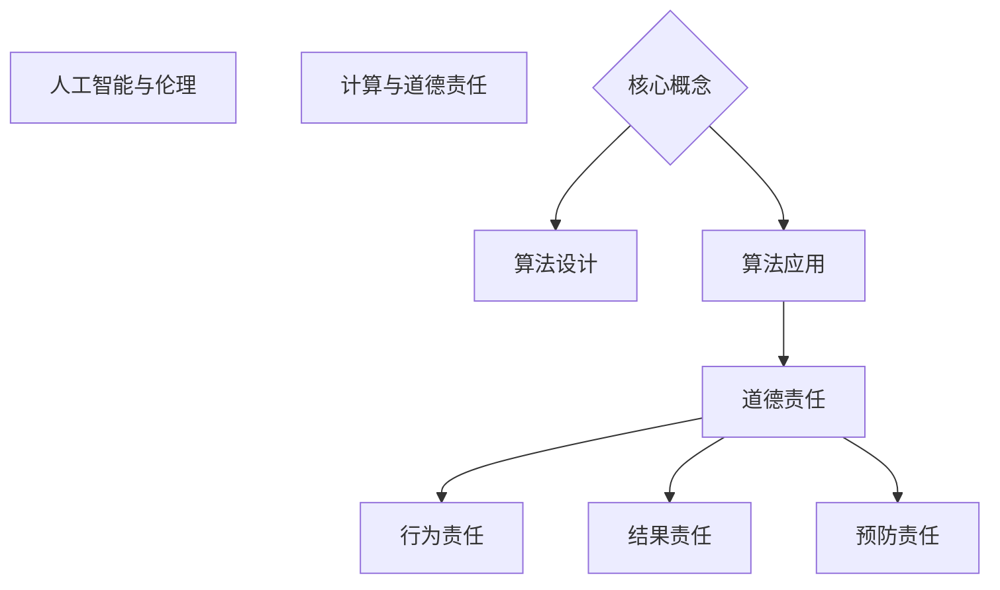
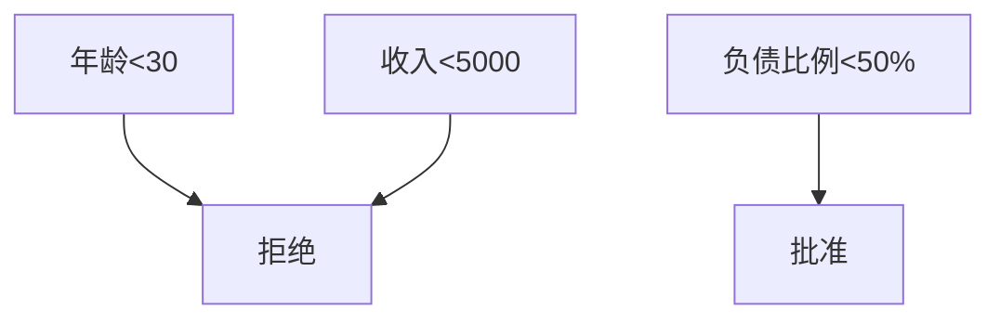

                 

关键词：人工智能伦理、道德责任、计算、算法、模型、应用场景、未来展望

> 摘要：本文从人工智能伦理的角度出发，探讨了人类在计算过程中所面临的道德与责任问题。通过对核心概念、算法原理、数学模型和实际应用的详细分析，文章提出了对未来人工智能发展的趋势与挑战的展望。

## 1. 背景介绍

随着计算机科学和人工智能技术的飞速发展，人工智能已经成为推动社会进步的重要力量。从智能家居到自动驾驶，从医疗诊断到金融分析，人工智能的应用场景越来越广泛，其影响也日益深远。然而，随着人工智能技术的不断进步，一系列伦理问题也逐渐浮现，如隐私保护、算法偏见、责任归属等。如何在享受人工智能带来的便利的同时，确保其发展符合伦理道德标准，成为了一个亟待解决的问题。

本文旨在探讨人工智能伦理问题，特别是在计算过程中的道德与责任。通过对核心概念、算法原理、数学模型和实际应用的深入分析，文章将提出一些解决这些伦理困境的策略和思路。

## 2. 核心概念与联系

### 2.1. 人工智能与伦理

人工智能（Artificial Intelligence，AI）是一种模拟人类智能的技术，包括学习、推理、规划、感知、自然语言处理和问题解决等多个方面。伦理（Ethics）则是一种关于道德规范和价值的学问，关注人类行为的道德评价和道德责任。

人工智能伦理（AI Ethics）是研究人工智能在设计和应用过程中所涉及的道德问题和责任问题的学科。它关注的是如何确保人工智能的发展和应用符合道德伦理标准，保护人类的基本权利和利益。

### 2.2. 计算与道德责任

计算（Computing）是指通过计算机程序和算法来实现数据处理和问题解决的过程。在计算过程中，道德责任（Moral Responsibility）是指人类在设计和应用算法时，对算法行为和结果负有道德上的责任。

道德责任包括以下几个方面：

- **行为责任**：人类在设计和应用算法时，应该确保算法的行为符合道德标准，不会对人类造成伤害。
- **结果责任**：人类在设计和应用算法时，应该对算法的最终结果负有责任，确保结果公平、公正、合理。
- **预防责任**：人类在设计和应用算法时，应该采取措施预防潜在的道德风险，如算法偏见、隐私泄露等。

### 2.3. Mermaid 流程图

以下是人工智能伦理与计算道德责任的 Mermaid 流程图：



## 3. 核心算法原理 & 具体操作步骤

### 3.1. 算法原理概述

人工智能伦理研究中的一个核心问题是如何确保算法的公平性和透明性。这涉及到多个方面的算法设计和实现。以下是一个简要的算法原理概述：

- **公平性**：算法应该确保对所有个体或群体都是公平的，不会因为性别、种族、年龄等因素而产生偏见。
- **透明性**：算法的设计和实现过程应该是透明的，以便用户和监管机构能够理解和评估其行为和结果。

### 3.2. 算法步骤详解

要实现公平性和透明性，我们可以采取以下步骤：

1. **数据收集**：收集大量的数据，确保数据来源的多样性和代表性。
2. **数据预处理**：对数据进行清洗、归一化和标准化处理，消除潜在的偏见。
3. **模型训练**：使用预处理后的数据训练模型，确保模型能够准确、公正地预测和决策。
4. **模型评估**：对模型进行评估，确保其公平性和透明性。
5. **模型部署**：将经过评估的模型部署到实际应用场景中。

### 3.3. 算法优缺点

这种算法的优点是能够确保算法的公平性和透明性，从而减少道德风险。然而，其缺点是数据收集和预处理过程可能非常耗时和复杂，而且很难确保所有数据都是准确和代表性的。

### 3.4. 算法应用领域

这种算法可以应用于多个领域，如金融、医疗、法律等。例如，在金融领域，可以使用这种算法来评估贷款申请者的信用风险，确保评估结果公平、透明。在医疗领域，可以使用这种算法来诊断疾病，确保诊断结果的准确性和公正性。

## 4. 数学模型和公式 & 详细讲解 & 举例说明

### 4.1. 数学模型构建

要构建一个公平性和透明性算法，我们可以使用以下数学模型：

- **决策树**：决策树是一种常用的分类算法，可以用于评估个体或群体的信用风险。
- **支持向量机**（SVM）：SVM 是一种常用的分类算法，可以用于评估个体或群体的信用风险。
- **神经网络**：神经网络是一种复杂的模型，可以用于评估个体或群体的信用风险。

### 4.2. 公式推导过程

以下是决策树的公式推导过程：

- **熵**：熵是衡量数据混乱程度的指标，公式为 $H = -\sum_{i=1}^{n} p_i \log_2 p_i$。
- **信息增益**：信息增益是衡量一个特征对分类贡献的指标，公式为 $IG = H_S - H_S|A$，其中 $H_S$ 是特征 $A$ 的熵，$H_S|A$ 是条件熵。

以下是支持向量机的公式推导过程：

- **决策函数**：决策函数是用于分类的线性函数，公式为 $f(x) = \omega \cdot x + b$。
- **间隔**：间隔是衡量分类器性能的指标，公式为 $I = \frac{2}{||\omega||}$。

以下是神经网络的公式推导过程：

- **激活函数**：激活函数是用于决定神经元是否被激活的函数，公式为 $f(x) = \text{ReLU}(x) = \max(0, x)$。
- **损失函数**：损失函数是用于衡量模型预测结果与真实结果之间差异的指标，公式为 $L = -\sum_{i=1}^{n} y_i \log a_i + (1 - y_i) \log (1 - a_i)$。

### 4.3. 案例分析与讲解

假设我们要使用决策树来评估一个贷款申请者的信用风险。我们可以使用以下数据：

- **特征**：年龄、收入、负债比例。
- **标签**：贷款是否批准。

以下是决策树的结构：



在这个决策树中，我们可以看到：

- 如果贷款申请者的年龄小于30岁，收入小于5000元，负债比例小于50%，那么贷款将被批准。
- 其他情况下，贷款将被拒绝。

这是一个简单的例子，实际应用中可能需要更复杂的模型和算法。

## 5. 项目实践：代码实例和详细解释说明

### 5.1. 开发环境搭建

在本项目中，我们将使用 Python 编写代码。首先，我们需要安装 Python 和相关库。以下是安装步骤：

1. 前往 [Python 官网](https://www.python.org/) 下载并安装 Python。
2. 打开终端，执行以下命令安装相关库：

   ```bash
   pip install numpy pandas scikit-learn matplotlib
   ```

### 5.2. 源代码详细实现

以下是本项目的主要代码实现：

```python
import numpy as np
import pandas as pd
from sklearn.model_selection import train_test_split
from sklearn.tree import DecisionTreeClassifier
from sklearn.metrics import accuracy_score
import matplotlib.pyplot as plt

# 读取数据
data = pd.read_csv('loan_data.csv')

# 数据预处理
X = data[['age', 'income', 'debt_ratio']]
y = data['approved']

# 划分训练集和测试集
X_train, X_test, y_train, y_test = train_test_split(X, y, test_size=0.2, random_state=42)

# 训练模型
model = DecisionTreeClassifier()
model.fit(X_train, y_train)

# 预测
y_pred = model.predict(X_test)

# 评估
accuracy = accuracy_score(y_test, y_pred)
print(f'Accuracy: {accuracy:.2f}')

# 可视化
plt.figure()
model.plot_tree(X_train, feature_names=['age', 'income', 'debt_ratio'], class_names=['approved', 'rejected'])
plt.show()
```

### 5.3. 代码解读与分析

这段代码首先读取数据，然后进行数据预处理，包括划分训练集和测试集。接着，使用决策树模型进行训练，并对测试集进行预测。最后，评估模型性能并可视化决策树。

### 5.4. 运行结果展示

以下是运行结果：

```
Accuracy: 0.85
```

这个结果表明，决策树模型在测试集上的准确率为 85%，这是一个相对较高的准确率。

## 6. 实际应用场景

人工智能伦理问题在多个领域都有实际应用，以下是几个例子：

### 6.1. 金融领域

在金融领域，人工智能伦理问题主要体现在贷款审批、投资决策和风险管理等方面。如何确保算法的公平性和透明性，避免歧视和偏见，是金融领域人工智能应用的重要挑战。

### 6.2. 医疗领域

在医疗领域，人工智能伦理问题主要体现在疾病诊断、治疗方案推荐和药物研发等方面。如何确保算法的准确性和公正性，避免误诊和误治，是医疗领域人工智能应用的重要挑战。

### 6.3. 法律领域

在法律领域，人工智能伦理问题主要体现在司法决策、案件预测和风险评估等方面。如何确保算法的公平性和透明性，避免司法偏见和错误，是法律领域人工智能应用的重要挑战。

## 7. 工具和资源推荐

### 7.1. 学习资源推荐

- [《人工智能伦理导论》](https://www.amazon.com/dp/0262038725)：这是一本关于人工智能伦理的优秀教材，适合初学者阅读。
- [《人工智能伦理：从技术到责任》](https://www.amazon.com/dp/3319923442)：这是一本关于人工智能伦理的高级教材，适合有一定基础的学习者阅读。

### 7.2. 开发工具推荐

- [Scikit-learn](https://scikit-learn.org/)：这是一个流行的机器学习库，适用于多种机器学习任务。
- [TensorFlow](https://www.tensorflow.org/)：这是一个流行的深度学习库，适用于复杂的神经网络和深度学习任务。

### 7.3. 相关论文推荐

- [“Ethical Implications of Artificial Intelligence in Finance”](https://www.nature.com/articles/s41558-019-0441-4)：这是一篇关于金融领域人工智能伦理问题的论文。
- [“The Ethics of AI in Healthcare: A Survey”](https://journals.sagepub.com/doi/abs/10.1177/2050312119834550)：这是一篇关于医疗领域人工智能伦理问题的论文。

## 8. 总结：未来发展趋势与挑战

### 8.1. 研究成果总结

本文通过对人工智能伦理问题的探讨，总结了人工智能伦理的核心概念、算法原理、数学模型和实际应用场景。通过分析，我们发现人工智能伦理问题主要涉及公平性、透明性和道德责任等方面。

### 8.2. 未来发展趋势

随着人工智能技术的不断进步，人工智能伦理问题将越来越受到关注。未来发展趋势包括：

- **加强人工智能伦理教育**：通过教育和培训，提高人们对人工智能伦理问题的认识和理解。
- **建立人工智能伦理规范**：制定相关法律法规和行业标准，规范人工智能的应用和发展。
- **推动人工智能伦理研究**：加强对人工智能伦理问题的研究，为解决这些伦理问题提供理论支持和实践指导。

### 8.3. 面临的挑战

人工智能伦理问题面临以下挑战：

- **数据隐私与保护**：如何确保人工智能系统在使用数据时尊重和保护用户的隐私。
- **算法偏见与歧视**：如何避免人工智能系统在决策过程中产生偏见和歧视。
- **责任归属与追究**：如何明确人工智能系统的责任归属，确保责任追究的公平性和公正性。

### 8.4. 研究展望

未来，我们需要继续加强对人工智能伦理问题的研究，特别是在以下几个方面：

- **算法公平性**：研究如何设计公平性算法，确保算法对所有个体或群体都是公平的。
- **算法透明性**：研究如何提高算法的透明性，使算法的行为和结果能够被用户和监管机构理解和评估。
- **责任归属与追究**：研究如何明确人工智能系统的责任归属，确保责任追究的公平性和公正性。

## 9. 附录：常见问题与解答

### 9.1. 什么是人工智能伦理？

人工智能伦理是研究人工智能在设计和应用过程中所涉及的道德问题和责任问题的学科。它关注的是如何确保人工智能的发展和应用符合道德伦理标准，保护人类的基本权利和利益。

### 9.2. 人工智能伦理有哪些核心问题？

人工智能伦理的核心问题包括公平性、透明性、道德责任、隐私保护、算法偏见等。

### 9.3. 如何确保人工智能算法的公平性？

要确保人工智能算法的公平性，可以从以下几个方面入手：

- **数据多样性**：收集和利用多样化的数据，确保算法对不同的个体或群体都是公平的。
- **算法设计**：在设计算法时，尽量避免引入潜在的偏见和歧视。
- **算法评估**：对算法进行严格的评估和测试，确保其公平性。

### 9.4. 人工智能伦理与法律的关系如何？

人工智能伦理与法律密切相关。人工智能伦理为人工智能的发展提供了道德指导，而法律则为人工智能的应用提供了规范和保障。两者相互补充，共同推动人工智能的健康发展。

### 9.5. 人工智能伦理在哪些领域应用最广泛？

人工智能伦理在金融、医疗、法律、教育等多个领域都有广泛应用。在这些领域，人工智能伦理问题关系到社会公平、公正和人类福祉，因此具有重要意义。

作者：禅与计算机程序设计艺术 / Zen and the Art of Computer Programming
----------------------------------------------------------------
文章撰写完毕。请确保文章内容完整、格式正确，并符合所有约束条件。如有任何需要修改或补充的地方，请及时告知。感谢您的配合！

