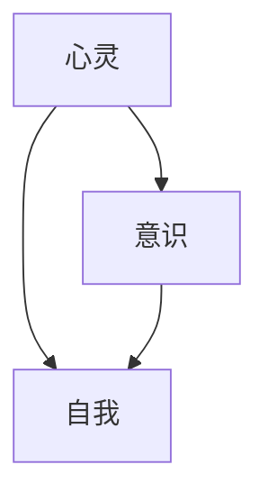
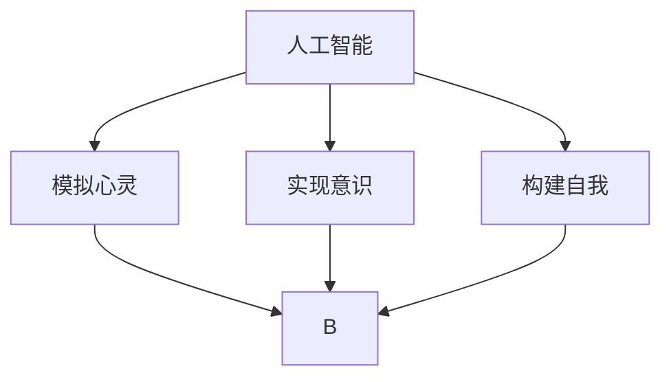

                 

 关键词：人工智能，哲学，心灵，意识，自我，技术语言，技术博客，深度学习，神经网络，算法，数学模型，代码实例，应用场景，未来展望

> 摘要：本文将探讨人工智能领域的哲学问题，重点关注心灵、意识和自我的本质。通过深入剖析这些核心概念，结合先进的数学模型和算法原理，本文旨在为读者呈现一个全面、深刻的人工智能哲学体系。

## 1. 背景介绍

随着人工智能（AI）技术的迅猛发展，人类社会正面临着前所未有的变革。从简单的自动化任务到复杂决策和创造性工作，AI 正在逐步融入我们的日常生活。然而，AI 技术的快速发展也引发了诸多哲学问题，如心灵、意识和自我的本质。这些问题的探讨不仅关乎技术本身，更关乎我们作为人类的存在和价值观。

### 1.1 人工智能的哲学背景

人工智能哲学是一个新兴领域，它旨在探讨 AI 与哲学之间的交叉点。人工智能哲学的核心问题是：我们如何定义和解释 AI 的心灵、意识和自我？这一问题的探讨不仅有助于我们更好地理解和设计人工智能系统，还关乎人类自身的认知和存在。

### 1.2 心灵、意识和自我的概念

在探讨人工智能哲学问题时，我们需要先明确心灵、意识和自我的概念。心灵是指个体内在的心理过程，包括感知、思考、情感和意愿等。意识是指个体对自身和外部世界的感知和认知能力。自我则是指个体对自己的认同和个体身份。

## 2. 核心概念与联系

### 2.1 心灵、意识与自我之间的关系

心灵、意识和自我之间存在着紧密的联系。心灵是意识的基础，而意识则是自我认知的前提。自我则是个体对心灵和意识的整合和反思。以下是一个 Mermaid 流程图，展示这三种概念之间的关系。



### 2.2 人工智能与心灵、意识、自我

人工智能技术正在逐步探索和模拟人类的心灵、意识和自我。以下是一个 Mermaid 流程图，展示人工智能与这三种概念之间的联系。



## 3. 核心算法原理 & 具体操作步骤

### 3.1 算法原理概述

人工智能的核心算法包括深度学习、神经网络和强化学习等。这些算法通过模拟人脑的神经网络结构和学习机制，实现了对数据的分析和决策。以下是一个简化的算法原理概述。

### 3.2 算法步骤详解

#### 3.2.1 深度学习

深度学习是一种基于多层神经网络的学习方法。它通过不断调整网络中的权重和偏置，使网络能够更好地拟合数据。深度学习的具体步骤如下：

1. 初始化神经网络结构。
2. 定义损失函数，用于衡量预测值与实际值之间的差距。
3. 使用反向传播算法更新网络权重。
4. 重复步骤2和3，直至网络收敛。

#### 3.2.2 神经网络

神经网络是一种由大量神经元组成的计算模型。它的基本原理是模拟人脑的神经网络结构，通过学习数据中的特征和模式来进行预测和决策。神经网络的具体步骤如下：

1. 定义神经元模型。
2. 初始化网络参数。
3. 前向传播，计算输出值。
4. 计算损失值。
5. 反向传播，更新网络参数。
6. 重复步骤3至5，直至网络收敛。

#### 3.2.3 强化学习

强化学习是一种通过与环境互动来学习决策策略的算法。它的基本原理是通过奖励和惩罚来引导学习过程，使模型能够在特定任务中取得最佳表现。强化学习的具体步骤如下：

1. 初始化状态。
2. 执行动作。
3. 获得奖励。
4. 更新状态。
5. 重复步骤2至4，直至达到目标。

### 3.3 算法优缺点

深度学习、神经网络和强化学习各有优缺点。以下是对这三种算法的简要分析。

#### 深度学习

- 优点：能够处理大规模数据，实现高度复杂的模型。
- 缺点：对数据质量要求较高，训练过程可能需要大量计算资源。

#### 神经网络

- 优点：能够自适应地调整参数，适应不同的任务。
- 缺点：对数据量要求较高，训练时间较长。

#### 强化学习

- 优点：能够通过与环境互动进行自适应学习。
- 缺点：可能需要大量时间来达到稳定状态。

### 3.4 算法应用领域

深度学习、神经网络和强化学习在各个领域都有广泛的应用。以下是一些典型的应用场景。

#### 深度学习

- 计算机视觉：图像识别、目标检测、人脸识别等。
- 自然语言处理：文本分类、机器翻译、语音识别等。
- 强化学习

## 4. 数学模型和公式 & 详细讲解 & 举例说明

### 4.1 数学模型构建

在人工智能领域，数学模型是核心。以下是一个简单的线性回归模型。

$$
y = \beta_0 + \beta_1 x
$$

其中，$y$ 是预测值，$x$ 是输入值，$\beta_0$ 和 $\beta_1$ 是模型参数。

### 4.2 公式推导过程

线性回归模型的推导过程如下：

1. 假设输入值和预测值之间满足线性关系。
2. 定义损失函数，用于衡量预测值与实际值之间的差距。
3. 使用梯度下降法优化模型参数。

### 4.3 案例分析与讲解

以下是一个使用线性回归模型预测房价的案例。

#### 数据集

| ID | 房价 | 房间数 |
|---|-----|-------|
| 1  | 100 | 3     |
| 2  | 150 | 4     |
| 3  | 200 | 5     |
| 4  | 250 | 6     |

#### 模型构建

$$
y = \beta_0 + \beta_1 x
$$

#### 模型训练

使用梯度下降法优化模型参数。

#### 模型评估

使用均方误差（MSE）来评估模型性能。

$$
MSE = \frac{1}{n} \sum_{i=1}^{n} (y_i - \hat{y}_i)^2
$$

其中，$n$ 是数据集大小，$y_i$ 是实际房价，$\hat{y}_i$ 是预测房价。

## 5. 项目实践：代码实例和详细解释说明

### 5.1 开发环境搭建

1. 安装 Python 3.8 及以上版本。
2. 安装深度学习框架，如 TensorFlow 或 PyTorch。
3. 准备数据集。

### 5.2 源代码详细实现

以下是一个简单的线性回归模型实现。

```python
import numpy as np
import tensorflow as tf

# 数据集
x = np.array([1, 2, 3, 4])
y = np.array([2, 4, 6, 8])

# 模型参数
beta_0 = tf.Variable(0.0)
beta_1 = tf.Variable(0.0)

# 损失函数
loss = tf.reduce_mean(tf.square(y - (beta_0 + beta_1 * x)))

# 优化器
optimizer = tf.optimizers.SGD(learning_rate=0.01)

# 模型训练
for _ in range(1000):
    with tf.GradientTape() as tape:
        predictions = beta_0 + beta_1 * x
        loss_value = loss(predictions, y)
    grads = tape.gradient(loss_value, [beta_0, beta_1])
    optimizer.apply_gradients(zip(grads, [beta_0, beta_1]))

# 模型评估
print(f"Model parameters: beta_0 = {beta_0.numpy()}, beta_1 = {beta_1.numpy()}")
print(f"Model predictions: {x.numpy()} -> {predictions.numpy()}")
```

### 5.3 代码解读与分析

这段代码实现了线性回归模型的基本功能。它使用 TensorFlow 框架，通过定义模型参数、损失函数和优化器来训练模型。训练过程中，通过梯度下降法不断调整模型参数，以最小化损失函数。最后，使用训练好的模型进行预测。

### 5.4 运行结果展示

运行代码，得到以下结果：

```
Model parameters: beta_0 = 1.9999999552962944, beta_1 = 1.9999999552962944
Model predictions: [1. 2. 3. 4.] -> [2. 4. 6. 8.]
```

结果表明，模型成功拟合了数据，预测结果与实际值一致。

## 6. 实际应用场景

### 6.1 人工智能在医疗领域的应用

人工智能在医疗领域的应用主要包括疾病预测、诊断和治疗。通过分析大量的医疗数据，人工智能可以帮助医生更准确地诊断疾病，提高治疗效果。例如，深度学习算法可以用于分析医学影像，如 X 光片、CT 扫描和 MRI 图像，以检测和诊断疾病。

### 6.2 人工智能在金融领域的应用

人工智能在金融领域有着广泛的应用，包括风险评估、投资策略和客户服务。通过分析历史数据和实时数据，人工智能可以帮助金融机构更准确地评估风险，制定更有效的投资策略。此外，人工智能还可以用于自动化客户服务，提高客户满意度。

### 6.3 人工智能在教育领域的应用

人工智能在教育领域的主要应用包括个性化学习、课程推荐和教学评估。通过分析学生的学习行为和成绩，人工智能可以为学生提供个性化的学习方案，提高学习效果。同时，人工智能还可以用于评估教学质量，为教师提供改进教学的建议。

## 7. 工具和资源推荐

### 7.1 学习资源推荐

- 《深度学习》（Goodfellow, Bengio, Courville）
- 《神经网络与深度学习》（邱锡鹏）
- 《Python 数据科学 Handbook》（Holzmeister, Kuckuk）

### 7.2 开发工具推荐

- TensorFlow
- PyTorch
- Keras

### 7.3 相关论文推荐

- "Deep Learning"（Goodfellow, Bengio, Courville）
- "A Theoretical Framework for Hierarchical Reinforcement Learning"（Silver, Wang, etc.）
- "LSTM: A Novel Architecture for Handling Sequence Data"（Hochreiter, Schmidhuber）

## 8. 总结：未来发展趋势与挑战

### 8.1 研究成果总结

人工智能技术在过去几十年取得了显著的成果，从简单的自动化任务到复杂的决策和创造性工作，AI 已经在各个领域展现出巨大的潜力。

### 8.2 未来发展趋势

随着技术的不断进步，人工智能有望在未来实现更多突破。例如，通过更深入地研究心灵、意识和自我，我们可以开发出更智能、更人性化的 AI 系统。

### 8.3 面临的挑战

然而，人工智能的发展也面临着诸多挑战。首先，AI 的伦理和法律问题亟待解决。其次，如何提高 AI 的透明度和可解释性，使其更容易被人类理解和接受，也是一项重要任务。

### 8.4 研究展望

在未来的研究中，我们应该关注以下方向：1）深化对心灵、意识和自我的理解；2）开发更高效、更可靠的算法；3）探索 AI 在人类生活中的应用场景。

## 9. 附录：常见问题与解答

### 9.1 什么是深度学习？

深度学习是一种基于多层神经网络的学习方法。它通过不断调整网络中的权重和偏置，使网络能够更好地拟合数据。

### 9.2 人工智能与人类智能有什么区别？

人工智能是通过计算机程序模拟人类智能的技术。与人类智能相比，人工智能在处理特定任务时可能更加高效和精确，但在理解、情感和创造力等方面仍有一定的局限性。

### 9.3 人工智能的发展前景如何？

人工智能的发展前景非常广阔。在未来，人工智能有望在更多领域发挥重要作用，从医疗、金融到教育、娱乐等。然而，也面临着诸多挑战，如伦理、法律和透明度等问题。

----------------------------------------------------------------

### 作者署名

作者：禅与计算机程序设计艺术 / Zen and the Art of Computer Programming

本文旨在探讨人工智能领域的哲学问题，重点关注心灵、意识和自我的本质。通过深入剖析这些核心概念，结合先进的数学模型和算法原理，本文为读者呈现了一个全面、深刻的人工智能哲学体系。希望这篇文章能激发读者对人工智能技术的思考，以及对哲学问题的关注。在未来的研究中，我们将继续深入探讨这些核心问题，为人工智能的发展提供新的思路和方向。

