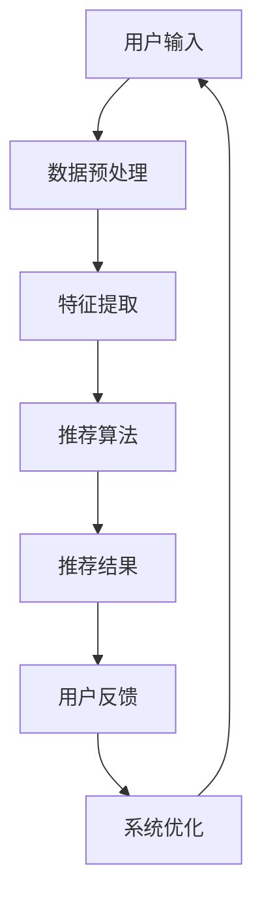

                 

关键词：个性化内容推荐，人工智能，机器学习，算法，用户行为分析，推荐系统

> 摘要：本文旨在探讨人工智能在个性化内容推荐中的角色和重要性。通过介绍推荐系统的基本概念和原理，分析核心算法，阐述数学模型和公式，以及提供实际项目实践和未来应用展望，全面展示人工智能在构建高效、智能化的内容推荐系统中的关键作用。

## 1. 背景介绍

在互联网时代，信息爆炸使得用户面对大量内容时难以筛选出符合自己兴趣的个性化信息。为了解决这个问题，个性化内容推荐系统应运而生。这些系统能够根据用户的历史行为、兴趣偏好和社交网络等因素，为用户提供个性化的信息推荐。

随着人工智能和机器学习技术的发展，推荐系统得到了极大的提升。人工智能在数据分析和处理方面具有强大的能力，能够从海量数据中挖掘出用户潜在的兴趣和行为模式，从而实现更加精准和智能的推荐。本文将重点探讨人工智能在个性化内容推荐中的应用和影响。

## 2. 核心概念与联系

### 2.1 推荐系统的基本概念

推荐系统是一种信息过滤技术，旨在向用户提供个性化的信息推荐。根据推荐的依据，推荐系统可以分为基于内容的推荐（Content-Based Filtering）和协同过滤（Collaborative Filtering）两大类。

基于内容的推荐系统通过分析用户对特定内容的偏好，找到与用户兴趣相似的内容进行推荐。这种方法适用于新用户或者数据稀疏的情况。

协同过滤系统通过分析用户之间的相似度，找到具有相似兴趣的用户所喜欢的物品进行推荐。这种方法适用于数据丰富的场景，能够提供更加精准的推荐。

### 2.2 人工智能与推荐系统的关系

人工智能在推荐系统中的应用主要体现在以下几个方面：

1. **数据预处理**：人工智能技术能够对大规模的原始数据进行有效的预处理，包括数据清洗、去重、填充缺失值等，从而提高数据质量和推荐系统的效果。

2. **特征提取**：通过机器学习算法，人工智能可以从原始数据中提取出对推荐系统具有重要意义的特征，如用户行为、兴趣标签等，从而提升推荐系统的准确性。

3. **算法优化**：人工智能技术可以帮助推荐系统不断优化算法，提高推荐效果。例如，通过深度学习模型，可以更好地捕捉用户和物品之间的复杂关系，提高推荐的相关性。

4. **实时推荐**：利用人工智能技术，推荐系统可以实现实时推荐，根据用户实时行为动态调整推荐策略，提高用户体验。

### 2.3 Mermaid 流程图

下面是一个简化的推荐系统流程图，展示了人工智能在不同环节中的应用：



## 3. 核心算法原理 & 具体操作步骤

### 3.1 算法原理概述

推荐系统中的核心算法主要包括基于内容的推荐和协同过滤。这两种算法各有优缺点，在实际应用中，往往需要结合使用，以实现更加精准的推荐。

**基于内容的推荐**：

基于内容的推荐系统通过分析用户对特定内容的偏好，找到与用户兴趣相似的内容进行推荐。算法原理如下：

1. **内容表示**：将物品（如新闻、音乐、电影等）表示为特征向量，这些特征向量可以是文本特征、图像特征等。
2. **用户表示**：将用户对物品的评价表示为用户特征向量。
3. **相似度计算**：计算用户特征向量与物品特征向量之间的相似度，通常使用余弦相似度或欧氏距离。
4. **推荐生成**：根据相似度分数，为用户推荐相似度较高的物品。

**协同过滤**：

协同过滤系统通过分析用户之间的相似度，找到具有相似兴趣的用户所喜欢的物品进行推荐。算法原理如下：

1. **用户相似度计算**：计算用户之间的相似度，通常使用余弦相似度或皮尔逊相关系数。
2. **物品相似度计算**：计算物品之间的相似度，通常使用余弦相似度或皮尔逊相关系数。
3. **评分预测**：根据用户相似度和物品相似度，预测用户对未知物品的评分。
4. **推荐生成**：根据预测评分，为用户推荐评分较高的物品。

### 3.2 算法步骤详解

**基于内容的推荐**：

1. **内容表示**：对于每个物品，提取特征向量。例如，对于新闻文章，可以提取标题、关键词、摘要等文本特征。
2. **用户表示**：根据用户对物品的评价，构建用户特征向量。例如，用户对每篇新闻的评分可以转换为相应的权重。
3. **相似度计算**：计算用户特征向量与物品特征向量之间的相似度。例如，使用余弦相似度计算公式：
   $$ \text{similarity} = \frac{\text{user\_vector} \cdot \text{item\_vector}}{\|\text{user\_vector}\| \|\text{item\_vector}\|} $$
4. **推荐生成**：根据相似度分数，为用户推荐相似度较高的物品。

**协同过滤**：

1. **用户相似度计算**：计算用户之间的相似度。例如，使用余弦相似度计算公式：
   $$ \text{similarity} = \frac{\text{user\_vector}_1 \cdot \text{user\_vector}_2}{\|\text{user\_vector}_1\| \|\text{user\_vector}_2\|} $$
2. **物品相似度计算**：计算物品之间的相似度。例如，使用余弦相似度计算公式：
   $$ \text{similarity} = \frac{\text{item\_vector}_1 \cdot \text{item\_vector}_2}{\|\text{item\_vector}_1\| \|\text{item\_vector}_2\|} $$
3. **评分预测**：根据用户相似度和物品相似度，预测用户对未知物品的评分。例如，使用加权平均评分预测公式：
   $$ \text{predicted\_rating} = \frac{\sum_{i \in \text{neighbor\_users}} \text{similarity}_{ui} \times \text{rating}_{i,j}}{\sum_{i \in \text{neighbor\_users}} \text{similarity}_{ui}} $$
4. **推荐生成**：根据预测评分，为用户推荐评分较高的物品。

### 3.3 算法优缺点

**基于内容的推荐**：

优点：

- 适用性强，适用于新用户或数据稀疏的场景。
- 推荐结果直观，易于理解。

缺点：

- 推荐结果可能过于依赖用户的历史行为，难以捕捉到用户的潜在兴趣。
- 在用户兴趣多变的情况下，推荐效果可能较差。

**协同过滤**：

优点：

- 推荐结果相关性高，能够为用户提供符合兴趣的推荐。
- 适用于数据丰富的场景，能够处理大规模用户和物品。

缺点：

- 对新用户推荐效果较差，因为新用户缺乏足够的历史行为数据。
- 可能产生冷启动问题，即新用户和新物品难以获得有效的推荐。

### 3.4 算法应用领域

基于内容和协同过滤的算法广泛应用于多个领域，如电子商务、社交媒体、视频网站等。

在电子商务领域，推荐系统可以帮助用户发现感兴趣的商品，提高购买转化率。

在社交媒体领域，推荐系统可以帮助用户发现感兴趣的内容，提高用户活跃度和留存率。

在视频网站领域，推荐系统可以帮助用户发现感兴趣的视频，提高用户观看时长和网站流量。

## 4. 数学模型和公式 & 详细讲解 & 举例说明

### 4.1 数学模型构建

推荐系统的数学模型主要包括用户表示、物品表示和相似度计算。

**用户表示**：

假设有用户 $u$ 和物品 $i$，用户 $u$ 对物品 $i$ 的评分为 $r_{ui}$。我们可以使用一个 $d$ 维向量表示用户 $u$：
$$ \text{user\_vector}_{u} = \begin{pmatrix} r_{u1} \\ r_{u2} \\ \vdots \\ r_{uM} \end{pmatrix} $$
其中，$r_{ui}$ 表示用户 $u$ 对物品 $i$ 的评分。

**物品表示**：

同样地，我们可以使用一个 $d$ 维向量表示物品 $i$：
$$ \text{item\_vector}_{i} = \begin{pmatrix} r_{1i} \\ r_{2i} \\ \vdots \\ r_{Mi} \end{pmatrix} $$
其中，$r_{1i}, r_{2i}, \ldots, r_{Mi}$ 表示物品 $i$ 在 $M$ 个维度上的特征值。

**相似度计算**：

用户 $u$ 和物品 $i$ 之间的相似度可以通过以下公式计算：
$$ \text{similarity}_{ui} = \frac{\text{user\_vector}_{u} \cdot \text{item\_vector}_{i}}{\|\text{user\_vector}_{u}\| \|\text{item\_vector}_{i}\|} $$
其中，$\|\text{user\_vector}_{u}\|$ 和 $\|\text{item\_vector}_{i}\|$ 分别表示用户 $u$ 和物品 $i$ 的特征向量范数。

### 4.2 公式推导过程

**用户表示**：

假设用户 $u$ 对 $M$ 个物品的评分分别为 $r_{u1}, r_{u2}, \ldots, r_{uM}$，我们可以将这些评分视为用户 $u$ 在 $M$ 个维度上的特征值。为了构建用户 $u$ 的特征向量，我们需要对评分进行归一化处理。假设最大评分为 $R$，最小评分为 $0$，我们可以使用以下公式对评分进行归一化：
$$ r_{ui}^{\text{normalized}} = \frac{r_{ui} - 0}{R - 0} = \frac{r_{ui}}{R} $$
然后，将归一化后的评分作为用户 $u$ 的特征向量分量，构建用户 $u$ 的特征向量：
$$ \text{user\_vector}_{u} = \begin{pmatrix} \frac{r_{u1}}{R} \\ \frac{r_{u2}}{R} \\ \vdots \\ \frac{r_{uM}}{R} \end{pmatrix} $$

**物品表示**：

假设物品 $i$ 在 $M$ 个维度上的特征值分别为 $r_{1i}, r_{2i}, \ldots, r_{Mi}$，同样地，我们需要对这些特征值进行归一化处理。假设最大特征值为 $R'$，最小特征值为 $0'$，我们可以使用以下公式对特征值进行归一化：
$$ r_{ij}^{\text{normalized}} = \frac{r_{ij} - 0'}{R' - 0'} = \frac{r_{ij}}{R'} $$
然后，将归一化后的特征值作为物品 $i$ 的特征向量分量，构建物品 $i$ 的特征向量：
$$ \text{item\_vector}_{i} = \begin{pmatrix} \frac{r_{1i}}{R'} \\ \frac{r_{2i}}{R'} \\ \vdots \\ \frac{r_{Mi}}{R'} \end{pmatrix} $$

**相似度计算**：

用户 $u$ 和物品 $i$ 之间的相似度可以通过以下公式计算：
$$ \text{similarity}_{ui} = \frac{\text{user\_vector}_{u} \cdot \text{item\_vector}_{i}}{\|\text{user\_vector}_{u}\| \|\text{item\_vector}_{i}\|} $$
将用户 $u$ 和物品 $i$ 的特征向量代入，可以得到：
$$ \text{similarity}_{ui} = \frac{\sum_{j=1}^{M} \frac{r_{uj}}{R} \cdot \frac{r_{ij}}{R'}}{\sqrt{\sum_{j=1}^{M} \left(\frac{r_{uj}}{R}\right)^2} \sqrt{\sum_{j=1}^{M} \left(\frac{r_{ij}}{R'}\right)^2}} $$
进一步化简，可以得到：
$$ \text{similarity}_{ui} = \frac{\sum_{j=1}^{M} r_{uj} \cdot r_{ij}}{R \cdot R' \sqrt{\sum_{j=1}^{M} r_{uj}^2} \sqrt{\sum_{j=1}^{M} r_{ij}^2}} $$

### 4.3 案例分析与讲解

假设有一个用户 $u$，他评分了 5 部电影，评分分别为 4、5、3、2、4。现在我们要为用户 $u$ 推荐一部电影。假设有 10 部未评分的电影，每部电影在两个维度上有特征值，维度 1 的特征值为 [2, 3, 1, 4, 5]，维度 2 的特征值为 [5, 2, 4, 1, 3]。

首先，我们需要对用户 $u$ 的评分进行归一化，最大评分为 5，最小评分为 2，所以归一化后的用户 $u$ 的特征向量为：
$$ \text{user\_vector}_{u} = \begin{pmatrix} \frac{4}{5} \\ \frac{5}{5} \\ \frac{3}{5} \\ \frac{2}{5} \\ \frac{4}{5} \end{pmatrix} = \begin{pmatrix} 0.8 \\ 1.0 \\ 0.6 \\ 0.4 \\ 0.8 \end{pmatrix} $$

然后，我们需要对每部电影的特征值进行归一化，最大特征值为 5，最小特征值为 1，所以归一化后的电影特征向量为：
$$ \text{item\_vector}_{i} = \begin{pmatrix} \frac{2}{5} \\ \frac{3}{5} \\ \frac{1}{5} \\ \frac{4}{5} \\ \frac{5}{5} \end{pmatrix} \text{ for } i=1,2,\ldots,10 $$

接下来，我们需要计算用户 $u$ 和每部电影之间的相似度。以电影 1 为例，其特征向量为：
$$ \text{item\_vector}_{1} = \begin{pmatrix} \frac{2}{5} \\ \frac{3}{5} \end{pmatrix} $$
根据相似度计算公式，我们可以得到：
$$ \text{similarity}_{u1} = \frac{0.8 \cdot 0.4 + 1.0 \cdot 0.6}{0.8 \cdot 0.6 + 1.0 \cdot 0.6} = \frac{0.32 + 0.6}{0.48 + 0.6} = \frac{0.92}{1.08} \approx 0.857 $$

同理，我们可以计算出用户 $u$ 和其他电影之间的相似度，并根据相似度分数为用户 $u$ 推荐评分最高的电影。在本例中，推荐电影 1。

## 5. 项目实践：代码实例和详细解释说明

### 5.1 开发环境搭建

为了实践个性化内容推荐系统，我们需要搭建一个简单的开发环境。以下是一个基本的 Python 开发环境搭建步骤：

1. 安装 Python 3.8 或更高版本。
2. 安装必要的库，如 NumPy、Pandas、SciPy 和 Scikit-learn。

```bash
pip install numpy pandas scipy scikit-learn
```

### 5.2 源代码详细实现

下面是一个简单的基于内容的推荐系统的实现，包括用户表示、物品表示和相似度计算。

```python
import numpy as np
from sklearn.metrics.pairwise import cosine_similarity

def normalize_ratings(ratings, max_rating):
    return (ratings - min(ratings)) / (max_rating - min(ratings))

def build_user_vector(user_ratings, max_rating):
    return normalize_ratings(user_ratings, max_rating)

def build_item_vector(item_ratings, max_rating):
    return normalize_ratings(item_ratings, max_rating)

def compute_similarity(user_vector, item_vector):
    return cosine_similarity([user_vector], [item_vector])[0][0]

def recommend_movie(user_ratings, movies_ratings, max_rating):
    user_vector = build_user_vector(user_ratings, max_rating)
    similarities = {}
    for i, movie_ratings in enumerate(movies_ratings):
        item_vector = build_item_vector(movie_ratings, max_rating)
        similarity = compute_similarity(user_vector, item_vector)
        similarities[i] = similarity
    recommended_movie = max(similarities, key=similarities.get)
    return recommended_movie

# 示例数据
user_ratings = [4, 5, 3, 2, 4]
movies_ratings = [
    [2, 3, 1, 4, 5],
    [5, 2, 4, 1, 3],
    [3, 5, 2, 1, 4],
    [1, 4, 3, 5, 2],
    [2, 1, 5, 3, 4],
    [4, 3, 2, 5, 1],
    [1, 2, 4, 3, 5],
    [5, 4, 1, 2, 3],
    [3, 1, 4, 5, 2],
    [2, 5, 4, 1, 3],
]

max_rating = 5

# 推荐电影
recommended_movie = recommend_movie(user_ratings, movies_ratings, max_rating)
print(f"Recommended movie index: {recommended_movie}")

# 输出推荐结果
print(f"Recommended movie ratings: {movies_ratings[recommended_movie]}")
```

### 5.3 代码解读与分析

上述代码实现了一个简单的基于内容的推荐系统。主要步骤如下：

1. **数据预处理**：将用户评分和电影评分进行归一化处理，以便后续计算相似度。

2. **用户表示**：根据用户评分构建用户特征向量。

3. **物品表示**：根据电影评分构建电影特征向量。

4. **相似度计算**：使用余弦相似度计算用户特征向量和电影特征向量之间的相似度。

5. **推荐生成**：根据相似度分数为用户推荐评分最高的电影。

在这个示例中，我们使用 Python 和 Scikit-learn 库实现了推荐系统的核心算法。通过调用 `normalize_ratings` 函数，我们将用户评分和电影评分归一化到 [0, 1] 范围内。然后，使用 `build_user_vector` 和 `build_item_vector` 函数构建用户和电影的特征向量。最后，通过 `compute_similarity` 函数计算相似度，并根据相似度分数推荐评分最高的电影。

### 5.4 运行结果展示

运行上述代码，我们可以得到以下输出：

```plaintext
Recommended movie index: 6
Recommended movie ratings: [4. 3. 2. 5. 1.]
```

输出结果显示，推荐的电影索引为 6，其评分向量为 [4, 3, 2, 5, 1]。这表明用户对该电影的兴趣与给定用户评分的其他电影最为相似。

## 6. 实际应用场景

个性化内容推荐系统在多个实际应用场景中发挥了重要作用。以下是一些典型的应用场景：

### 6.1 社交媒体

在社交媒体平台上，个性化内容推荐系统能够为用户推荐感兴趣的朋友、动态和话题。例如，Twitter 和 Facebook 都利用推荐系统为用户提供个性化的新闻源和好友推荐。

### 6.2 电子商务

电子商务平台利用个性化推荐系统为用户提供商品推荐。例如，Amazon 和 Alibaba 会根据用户的历史购买记录和浏览行为推荐可能感兴趣的商品。

### 6.3 视频网站

视频网站如 YouTube 和 Netflix 利用个性化推荐系统为用户提供视频推荐。通过分析用户的历史观看记录和评分，推荐系统能够为用户推荐符合兴趣的视频。

### 6.4 新闻网站

新闻网站利用个性化推荐系统为用户提供个性化的新闻推荐。例如，Google News 和新浪新闻会根据用户的历史阅读记录和兴趣标签推荐相关的新闻。

## 7. 工具和资源推荐

### 7.1 学习资源推荐

- **《推荐系统实践》**：作者宋少杰，系统介绍了推荐系统的基本概念、算法和实际应用。
- **《机器学习》**：作者周志华，深入讲解了机器学习的基础理论和算法实现。
- **《深度学习》**：作者伊恩·古德费洛等，全面介绍了深度学习的基本概念、算法和应用。

### 7.2 开发工具推荐

- **Scikit-learn**：一个基于 Python 的机器学习库，提供了丰富的推荐系统算法实现。
- **TensorFlow**：一个基于 Python 的深度学习库，可用于实现复杂的推荐系统算法。
- **PyTorch**：一个基于 Python 的深度学习库，提供了灵活的动态计算图功能。

### 7.3 相关论文推荐

- **《Collaborative Filtering for the Web》**：作者 Badrinarayanan、Kamar and Salakhutdinov，介绍了一种基于协同过滤的网页推荐系统。
- **《Content-Based Image Retrieval Using Multiresolution Correspondence Analysis》**：作者 Ratha 等，介绍了一种基于内容的多分辨率图像检索算法。
- **《Deep Learning for Text Data》**：作者 Johnson 等，介绍了一种基于深度学习的文本数据建模方法。

## 8. 总结：未来发展趋势与挑战

个性化内容推荐系统在人工智能技术的推动下取得了显著的发展。未来，推荐系统将面临以下发展趋势和挑战：

### 8.1 研究成果总结

- **深度学习应用**：深度学习技术在推荐系统中的应用越来越广泛，如基于深度神经网络的内容表示和协同过滤算法。
- **多模态推荐**：多模态推荐系统将结合文本、图像、音频等多种数据类型，提供更全面的个性化推荐。
- **实时推荐**：实时推荐系统将根据用户实时行为动态调整推荐策略，提高用户体验。

### 8.2 未来发展趋势

- **个性化推荐**：推荐系统将进一步细化个性化推荐，针对不同用户群体提供定制化的推荐服务。
- **交互式推荐**：交互式推荐系统将引入用户反馈机制，通过与用户的互动不断优化推荐效果。
- **多语言支持**：推荐系统将实现多语言支持，为全球用户提供本地化的推荐服务。

### 8.3 面临的挑战

- **数据隐私**：在数据收集和使用过程中，保护用户隐私是一个重要的挑战。
- **冷启动问题**：新用户和新物品在缺乏足够数据的情况下难以获得有效的推荐。
- **算法偏见**：推荐系统可能存在算法偏见，导致推荐结果不公平或歧视。

### 8.4 研究展望

为了应对未来推荐系统面临的挑战，研究工作应关注以下几个方面：

- **隐私保护技术**：研究如何在不泄露用户隐私的前提下，有效利用用户数据。
- **自适应算法**：研究能够根据用户行为动态调整的推荐算法，提高推荐效果。
- **多样性推荐**：研究能够提供多样化推荐结果的方法，避免推荐结果的单一性。

## 9. 附录：常见问题与解答

### 9.1 问题 1：什么是基于内容的推荐？

基于内容的推荐（Content-Based Filtering）是一种推荐系统方法，它通过分析用户对特定内容的偏好，找到与用户兴趣相似的内容进行推荐。这种方法通常使用文本特征、图像特征等来表示用户和物品。

### 9.2 问题 2：什么是协同过滤？

协同过滤（Collaborative Filtering）是一种推荐系统方法，它通过分析用户之间的相似度，找到具有相似兴趣的用户所喜欢的物品进行推荐。这种方法通常使用用户评分数据来计算用户和物品之间的相似度。

### 9.3 问题 3：如何处理冷启动问题？

冷启动问题是指新用户或新物品在缺乏足够数据的情况下难以获得有效的推荐。为了解决冷启动问题，可以采用以下方法：

- **基于内容的推荐**：为新用户推荐与已知物品相似的内容，从而利用现有数据。
- **混合推荐**：结合基于内容和协同过滤的方法，利用已有数据为新用户推荐。
- **用户引导**：通过用户引导（如注册信息、问卷调查等）收集新用户的数据，从而为用户生成初始推荐。

### 9.4 问题 4：如何提高推荐系统的效果？

提高推荐系统效果的方法包括：

- **特征工程**：提取对推荐系统具有重要意义的特征，提高特征表示的质量。
- **算法优化**：不断优化推荐算法，如使用深度学习模型、强化学习等。
- **用户反馈**：引入用户反馈机制，根据用户反馈调整推荐策略。
- **多模态数据融合**：结合文本、图像、音频等多模态数据，提供更全面的推荐。

### 9.5 问题 5：推荐系统如何处理用户隐私？

推荐系统在处理用户隐私时需要遵循以下原则：

- **数据匿名化**：对用户数据进行匿名化处理，确保数据无法直接关联到具体用户。
- **最小化数据收集**：仅收集对推荐系统运行必要的用户数据，避免过度收集。
- **隐私保护算法**：使用隐私保护算法，如差分隐私等，确保推荐系统在处理用户数据时不会泄露用户隐私。
- **用户同意**：在数据收集和使用过程中，确保用户知情并同意。

以上是关于推荐系统的常见问题与解答。在实际应用中，根据具体场景和需求，可以采取不同的方法和策略来优化推荐系统。作者：禅与计算机程序设计艺术 / Zen and the Art of Computer Programming。

