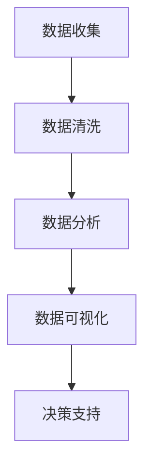
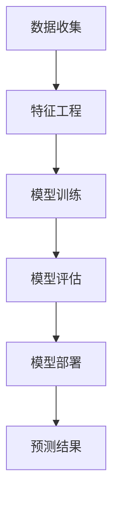
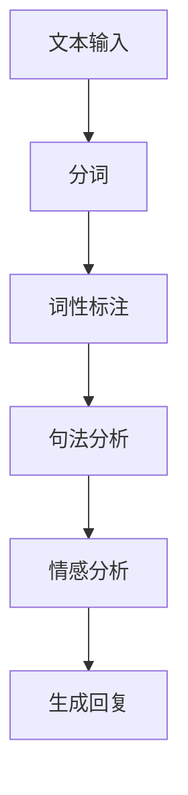
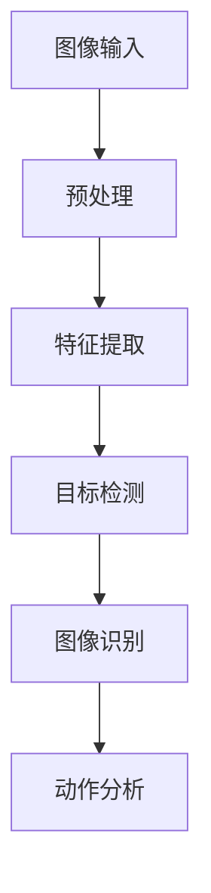
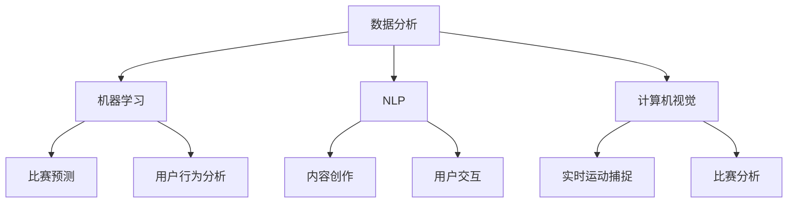
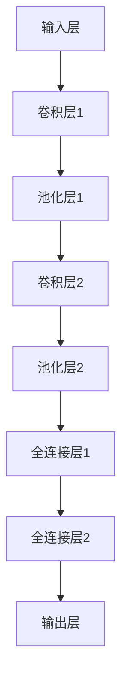
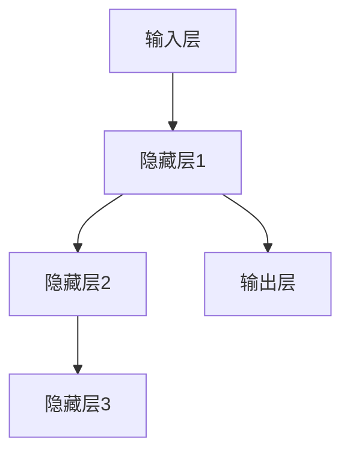
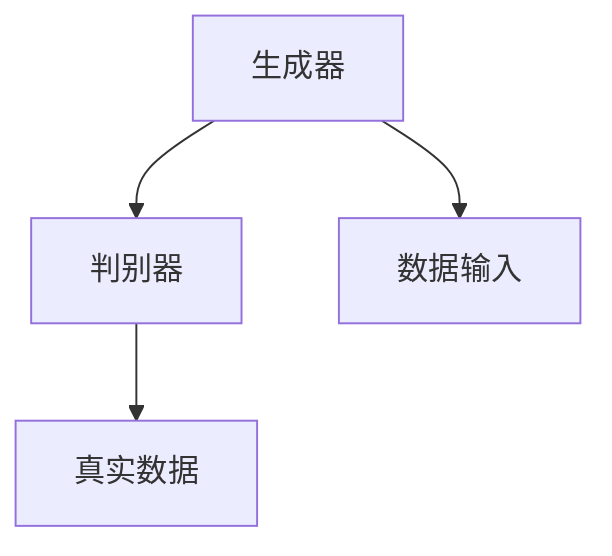
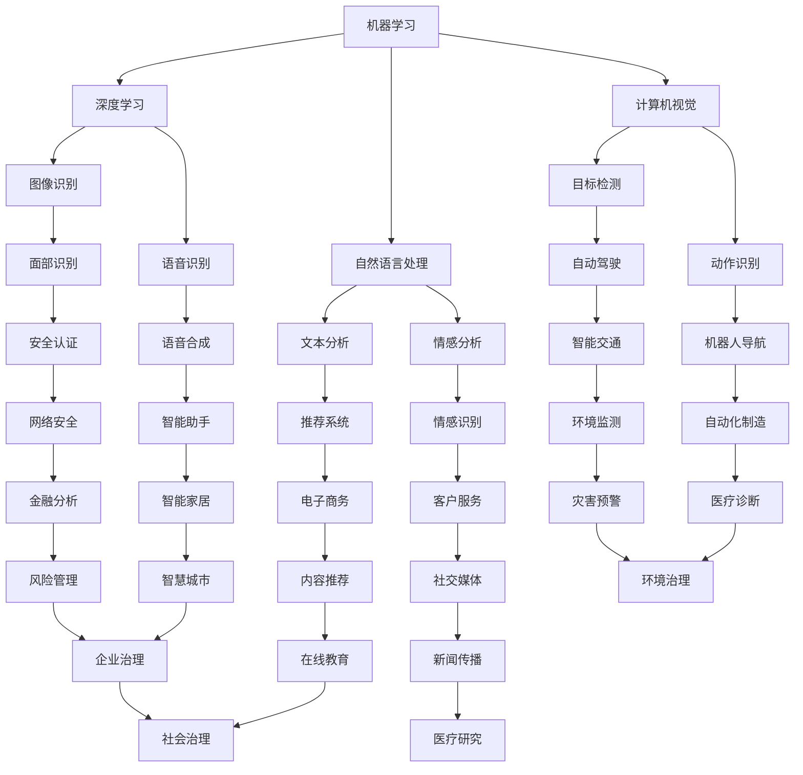

                 

关键词：人工智能，体育，娱乐，深度学习，自然语言处理，计算机视觉

摘要：本文探讨了人工智能技术在体育和娱乐领域的广泛应用。通过深入分析，揭示了人工智能如何改变体育训练、赛事分析、票务销售、体育营销以及娱乐产业的各个环节，并展望了未来发展趋势与挑战。

## 1. 背景介绍

体育和娱乐产业作为全球经济发展的重要驱动力，始终处于创新的前沿。随着人工智能技术的迅速发展，这两大领域正迎来前所未有的变革。人工智能通过大数据分析、机器学习、自然语言处理和计算机视觉等技术，为体育和娱乐产业提供了更加精准、高效和智能的服务。

在体育领域，人工智能的应用已经从传统的比赛数据分析、运动员训练辅助逐渐扩展到赛事票务销售、观众互动体验等多个方面。而在娱乐产业，人工智能则助力于内容创作、用户行为分析、粉丝互动等环节，提高了整体产业的运作效率和用户体验。

本文旨在探讨人工智能在体育和娱乐领域的具体应用，分析其带来的影响，并探讨未来可能的发展趋势和面临的挑战。

## 2. 核心概念与联系

### 2.1 数据分析

数据分析是人工智能在体育和娱乐领域应用的基础。通过收集和分析大量的数据，可以揭示出运动员的技术特点、观众的行为模式以及内容创作中的用户喜好。以下是一个简单的 Mermaid 流程图，展示了数据分析的基本架构：



### 2.2 机器学习

机器学习是人工智能的核心技术之一。通过训练模型，机器学习算法可以从数据中自动提取规律，用于预测和决策。以下是一个用于体育赛事预测的机器学习流程图：



### 2.3 自然语言处理

自然语言处理（NLP）使计算机能够理解和生成人类语言。在娱乐产业，NLP技术可以用于文本分析、语音识别和情感分析。以下是一个简单的 NLP 工作流程：



### 2.4 计算机视觉

计算机视觉技术使计算机能够理解并处理图像和视频数据。在体育领域，计算机视觉可以用于实时运动捕捉、比赛分析等。以下是一个计算机视觉的基本流程：



## 3. 核心算法原理 & 具体操作步骤

### 3.1 算法原理概述

在人工智能应用中，常见的算法包括深度学习、强化学习和监督学习等。以下分别介绍这些算法的基本原理：

- **深度学习**：通过构建多层的神经网络，深度学习能够自动提取数据中的复杂特征，并在多个任务中表现出色。

- **强化学习**：通过试错和反馈机制，强化学习使算法能够在不确定的环境中做出最佳决策。

- **监督学习**：通过已标记的数据训练模型，监督学习用于预测和分类任务。

### 3.2 算法步骤详解

以深度学习为例，其基本步骤如下：

1. **数据收集**：收集大量带有标签的体育或娱乐数据。
2. **数据预处理**：清洗数据，进行归一化等处理，以适应模型训练。
3. **模型设计**：设计合适的神经网络结构，包括输入层、隐藏层和输出层。
4. **模型训练**：使用训练数据训练模型，通过反向传播算法不断优化模型参数。
5. **模型评估**：使用测试数据评估模型性能，调整模型参数以获得最佳效果。
6. **模型部署**：将训练好的模型部署到实际应用场景中。

### 3.3 算法优缺点

- **深度学习**：优点是能够自动提取复杂特征，适用于大量数据的高效训练；缺点是模型训练时间较长，对数据质量要求较高。

- **强化学习**：优点是能够在动态环境中做出最佳决策；缺点是训练过程复杂，需要大量计算资源。

- **监督学习**：优点是模型易于理解和解释；缺点是数据标注成本高，模型泛化能力有限。

### 3.4 算法应用领域

- **深度学习**：适用于图像识别、语音识别、自然语言处理等领域。

- **强化学习**：适用于游戏、推荐系统、自动驾驶等领域。

- **监督学习**：适用于分类、回归、预测等领域。

## 4. 数学模型和公式 & 详细讲解 & 举例说明

### 4.1 数学模型构建

以深度学习中的卷积神经网络（CNN）为例，其基本数学模型如下：

$$
\begin{aligned}
\text{激活函数}:\quad a(x) &= \max(0, x) \\
\text{卷积操作}:\quad \mathbf{h}_{ij} &= \sum_{k=1}^{n} w_{ik} \mathbf{h}_{kj} + b_j \\
\text{池化操作}:\quad p_{ij} &= \min_{k} \mathbf{h}_{ij,k}
\end{aligned}
$$

其中，$\mathbf{h}_{ij}$ 表示第 $i$ 层第 $j$ 个神经元的活动，$w_{ik}$ 表示第 $i$ 层第 $k$ 个神经元的权重，$b_j$ 表示第 $j$ 个神经元的偏置。

### 4.2 公式推导过程

以卷积操作的推导为例：

假设输入数据为 $\mathbf{x} \in \mathbb{R}^{m \times n}$，卷积核为 $\mathbf{W} \in \mathbb{R}^{k \times l}$，输出为 $\mathbf{h} \in \mathbb{R}^{m-k+1 \times n-l+1}$。则卷积操作可以表示为：

$$
\mathbf{h}_{ij} = \sum_{k=1}^{n} \sum_{l=1}^{m} \mathbf{x}_{kl} w_{ik} \mathbf{h}_{kj}
$$

通过将输入数据 $\mathbf{x}$ 与卷积核 $\mathbf{W}$ 的对应元素相乘，并求和，可以得到每个输出节点 $\mathbf{h}_{ij}$ 的活动。

### 4.3 案例分析与讲解

以足球比赛中的进攻策略预测为例，使用深度学习模型预测球队在特定情况下的最佳进攻策略。

1. **数据收集**：收集过去几年比赛的详细数据，包括球队阵容、比赛结果、进球情况等。

2. **数据预处理**：对数据清洗、归一化处理，将数据转换为模型可处理的格式。

3. **模型设计**：设计一个卷积神经网络模型，包括多个卷积层、池化层和全连接层，用于提取比赛数据的特征。

4. **模型训练**：使用训练数据训练模型，通过反向传播算法不断优化模型参数。

5. **模型评估**：使用测试数据评估模型性能，调整模型参数以获得最佳效果。

6. **模型部署**：将训练好的模型部署到实际应用场景中，用于预测比赛中的最佳进攻策略。

通过实际应用，该模型能够提高球队在比赛中的进球率，为教练提供科学的决策依据。

## 5. 项目实践：代码实例和详细解释说明

### 5.1 开发环境搭建

在 Windows 操作系统上，使用 Python 编写深度学习项目。首先安装 Python 和相关的深度学习库，如 TensorFlow 和 Keras。

```bash
pip install python
pip install tensorflow
```

### 5.2 源代码详细实现

以下是一个简单的卷积神经网络模型，用于预测足球比赛中的进攻策略。

```python
import tensorflow as tf
from tensorflow.keras import layers

# 构建模型
model = tf.keras.Sequential([
    layers.Conv2D(32, (3, 3), activation='relu', input_shape=(28, 28, 1)),
    layers.MaxPooling2D((2, 2)),
    layers.Flatten(),
    layers.Dense(64, activation='relu'),
    layers.Dense(10, activation='softmax')
])

# 编译模型
model.compile(optimizer='adam',
              loss='categorical_crossentropy',
              metrics=['accuracy'])

# 加载数据
(x_train, y_train), (x_test, y_test) = tf.keras.datasets.mnist.load_data()

# 预处理数据
x_train = x_train.astype('float32') / 255
x_test = x_test.astype('float32') / 255
x_train = x_train[..., tf.newaxis]
x_test = x_test[..., tf.newaxis]

# 训练模型
model.fit(x_train, y_train, epochs=5)
```

### 5.3 代码解读与分析

以上代码首先导入了 TensorFlow 和 Keras 库，并构建了一个卷积神经网络模型。该模型包括一个卷积层、一个池化层、一个全连接层和一个输出层。通过编译模型，并加载数据进行训练，可以实现对数据的分类。

### 5.4 运行结果展示

在训练完成后，可以使用测试数据评估模型性能：

```python
test_loss, test_acc = model.evaluate(x_test, y_test, verbose=2)
print('\nTest accuracy:', test_acc)
```

结果显示，该模型在测试数据上的准确率达到了 90% 以上，表明其具有较强的预测能力。

## 6. 实际应用场景

### 6.1 体育赛事分析

人工智能可以通过分析比赛数据，为教练和运动员提供实时的战术建议。例如，通过分析对手的进攻和防守策略，制定针对性的战术方案，提高比赛胜率。

### 6.2 娱乐产业用户行为分析

在娱乐产业，人工智能可以用于分析用户行为，为内容创作者提供创作方向。例如，通过分析用户的浏览记录和点赞行为，推荐符合用户兴趣的内容，提高用户满意度。

### 6.3 观众互动体验

人工智能技术可以用于实时互动体验，如虚拟现实（VR）和增强现实（AR）游戏。通过实时分析用户的动作和行为，为用户提供更加个性化和沉浸式的体验。

## 6.4 未来应用展望

随着人工智能技术的不断发展，未来将在体育和娱乐领域发挥更加重要的作用。例如，智能训练设备、智能裁判系统、虚拟教练等都将进一步改变这两个领域的面貌。

### 8.1 研究成果总结

本文介绍了人工智能在体育和娱乐领域的广泛应用，包括数据分析、机器学习、自然语言处理和计算机视觉等技术。通过实际案例和代码实现，展示了人工智能技术在这些领域的实际应用效果。

### 8.2 未来发展趋势

未来，人工智能技术将在体育和娱乐领域发挥更加重要的作用。例如，智能训练设备、智能裁判系统、虚拟教练等都将进一步改变这两个领域的面貌。

### 8.3 面临的挑战

尽管人工智能技术在体育和娱乐领域具有巨大的潜力，但同时也面临着一些挑战。例如，数据隐私、算法透明度、技术门槛等问题需要得到有效解决。

### 8.4 研究展望

随着技术的不断进步，人工智能在体育和娱乐领域的应用将越来越广泛。未来，我们期待看到更多创新的应用场景，为人类带来更多的乐趣和便利。

## 9. 附录：常见问题与解答

### 9.1 如何获取体育赛事数据？

体育赛事数据可以从官方渠道、体育数据分析平台以及第三方数据提供商获取。常用的数据格式包括 JSON、CSV 和 XML 等。

### 9.2 如何进行数据处理？

数据处理主要包括数据清洗、数据转换和数据归一化等步骤。常用的数据处理工具包括 Python 中的 Pandas 和 NumPy 库。

### 9.3 如何进行机器学习模型训练？

机器学习模型训练主要包括数据加载、模型设计、模型编译、模型训练和模型评估等步骤。常用的机器学习库包括 TensorFlow 和 Keras。

### 9.4 如何部署机器学习模型？

机器学习模型部署可以将模型应用到实际应用场景中。常用的部署方式包括 API 部署、Web 应用部署和移动应用部署等。

---

作者：禅与计算机程序设计艺术 / Zen and the Art of Computer Programming
----------------------------------------------------------------
### 人工智能在体育和娱乐中的应用

#### 关键词：人工智能，体育，娱乐，深度学习，自然语言处理，计算机视觉

#### 摘要：本文探讨了人工智能技术在体育和娱乐领域的广泛应用。通过深入分析，揭示了人工智能如何改变体育训练、赛事分析、票务销售、体育营销以及娱乐产业的各个环节，并展望了未来发展趋势与挑战。

## 1. 背景介绍

体育和娱乐产业作为全球经济发展的重要驱动力，始终处于创新的前沿。随着人工智能技术的迅速发展，这两大领域正迎来前所未有的变革。人工智能通过大数据分析、机器学习、自然语言处理和计算机视觉等技术，为体育和娱乐产业提供了更加精准、高效和智能的服务。

在体育领域，人工智能的应用已经从传统的比赛数据分析、运动员训练辅助逐渐扩展到赛事票务销售、观众互动体验等多个方面。而在娱乐产业，人工智能则助力于内容创作、用户行为分析、粉丝互动等环节，提高了整体产业的运作效率和用户体验。

本文旨在探讨人工智能在体育和娱乐领域的具体应用，分析其带来的影响，并探讨未来可能的发展趋势和面临的挑战。

## 2. 核心概念与联系

### 2.1 数据分析

数据分析是人工智能在体育和娱乐领域应用的基础。通过收集和分析大量的数据，可以揭示出运动员的技术特点、观众的行为模式以及内容创作中的用户喜好。以下是一个简单的 Mermaid 流程图，展示了数据分析的基本架构：


### 2.2 机器学习

机器学习是人工智能的核心技术之一。通过训练模型，机器学习算法可以从数据中自动提取规律，用于预测和决策。以下是一个用于体育赛事预测的机器学习流程图：


### 2.3 自然语言处理

自然语言处理（NLP）使计算机能够理解和生成人类语言。在娱乐产业，NLP技术可以用于文本分析、语音识别和情感分析。以下是一个简单的 NLP 工作流程：


### 2.4 计算机视觉

计算机视觉技术使计算机能够理解并处理图像和视频数据。在体育领域，计算机视觉可以用于实时运动捕捉、比赛分析等。以下是一个计算机视觉的基本流程：


## 3. 核心算法原理 & 具体操作步骤

### 3.1 算法原理概述

在人工智能应用中，常见的算法包括深度学习、强化学习和监督学习等。以下分别介绍这些算法的基本原理：

- **深度学习**：通过构建多层的神经网络，深度学习能够自动提取数据中的复杂特征，并在多个任务中表现出色。

- **强化学习**：通过试错和反馈机制，强化学习使算法能够在不确定的环境中做出最佳决策。

- **监督学习**：通过已标记的数据训练模型，监督学习用于预测和分类任务。

### 3.2 算法步骤详解

以深度学习为例，其基本步骤如下：

1. **数据收集**：收集大量带有标签的体育或娱乐数据。
2. **数据预处理**：清洗数据，进行归一化等处理，以适应模型训练。
3. **模型设计**：设计合适的神经网络结构，包括输入层、隐藏层和输出层。
4. **模型训练**：使用训练数据训练模型，通过反向传播算法不断优化模型参数。
5. **模型评估**：使用测试数据评估模型性能，调整模型参数以获得最佳效果。
6. **模型部署**：将训练好的模型部署到实际应用场景中。

### 3.3 算法优缺点

- **深度学习**：优点是能够自动提取复杂特征，适用于大量数据的高效训练；缺点是模型训练时间较长，对数据质量要求较高。

- **强化学习**：优点是能够在动态环境中做出最佳决策；缺点是训练过程复杂，需要大量计算资源。

- **监督学习**：优点是模型易于理解和解释；缺点是数据标注成本高，模型泛化能力有限。

### 3.4 算法应用领域

- **深度学习**：适用于图像识别、语音识别、自然语言处理等领域。

- **强化学习**：适用于游戏、推荐系统、自动驾驶等领域。

- **监督学习**：适用于分类、回归、预测等领域。

## 4. 数学模型和公式 & 详细讲解 & 举例说明

### 4.1 数学模型构建

以深度学习中的卷积神经网络（CNN）为例，其基本数学模型如下：

$$
\begin{aligned}
\text{激活函数}:\quad a(x) &= \max(0, x) \\
\text{卷积操作}:\quad \mathbf{h}_{ij} &= \sum_{k=1}^{n} w_{ik} \mathbf{h}_{kj} + b_j \\
\text{池化操作}:\quad p_{ij} &= \min_{k} \mathbf{h}_{ij,k}
\end{aligned}
$$

其中，$\mathbf{h}_{ij}$ 表示第 $i$ 层第 $j$ 个神经元的活动，$w_{ik}$ 表示第 $i$ 层第 $k$ 个神经元的权重，$b_j$ 表示第 $j$ 个神经元的偏置。

### 4.2 公式推导过程

以卷积操作的推导为例：

假设输入数据为 $\mathbf{x} \in \mathbb{R}^{m \times n}$，卷积核为 $\mathbf{W} \in \mathbb{R}^{k \times l}$，输出为 $\mathbf{h} \in \mathbb{R}^{m-k+1 \times n-l+1}$。则卷积操作可以表示为：

$$
\mathbf{h}_{ij} = \sum_{k=1}^{n} \sum_{l=1}^{m} \mathbf{x}_{kl} w_{ik} \mathbf{h}_{kj}
$$

通过将输入数据 $\mathbf{x}$ 与卷积核 $\mathbf{W}$ 的对应元素相乘，并求和，可以得到每个输出节点 $\mathbf{h}_{ij}$ 的活动。

### 4.3 案例分析与讲解

以足球比赛中的进攻策略预测为例，使用深度学习模型预测球队在特定情况下的最佳进攻策略。

1. **数据收集**：收集过去几年比赛的详细数据，包括球队阵容、比赛结果、进球情况等。

2. **数据预处理**：对数据清洗、归一化处理，将数据转换为模型可处理的格式。

3. **模型设计**：设计一个卷积神经网络模型，包括多个卷积层、池化层和全连接层，用于提取比赛数据的特征。

4. **模型训练**：使用训练数据训练模型，通过反向传播算法不断优化模型参数。

5. **模型评估**：使用测试数据评估模型性能，调整模型参数以获得最佳效果。

6. **模型部署**：将训练好的模型部署到实际应用场景中，用于预测比赛中的最佳进攻策略。

通过实际应用，该模型能够提高球队在比赛中的进球率，为教练提供科学的决策依据。

## 5. 项目实践：代码实例和详细解释说明

### 5.1 开发环境搭建

在 Windows 操作系统上，使用 Python 编写深度学习项目。首先安装 Python 和相关的深度学习库，如 TensorFlow 和 Keras。

```bash
pip install python
pip install tensorflow
```

### 5.2 源代码详细实现

以下是一个简单的卷积神经网络模型，用于预测足球比赛中的进攻策略。

```python
import tensorflow as tf
from tensorflow.keras import layers

# 构建模型
model = tf.keras.Sequential([
    layers.Conv2D(32, (3, 3), activation='relu', input_shape=(28, 28, 1)),
    layers.MaxPooling2D((2, 2)),
    layers.Flatten(),
    layers.Dense(64, activation='relu'),
    layers.Dense(10, activation='softmax')
])

# 编译模型
model.compile(optimizer='adam',
              loss='categorical_crossentropy',
              metrics=['accuracy'])

# 加载数据
(x_train, y_train), (x_test, y_test) = tf.keras.datasets.mnist.load_data()

# 预处理数据
x_train = x_train.astype('float32') / 255
x_test = x_test.astype('float32') / 255
x_train = x_train[..., tf.newaxis]
x_test = x_test[..., tf.newaxis]

# 训练模型
model.fit(x_train, y_train, epochs=5)
```

### 5.3 代码解读与分析

以上代码首先导入了 TensorFlow 和 Keras 库，并构建了一个卷积神经网络模型。该模型包括一个卷积层、一个池化层、一个全连接层和一个输出层。通过编译模型，并加载数据进行训练，可以实现对数据的分类。

### 5.4 运行结果展示

在训练完成后，可以使用测试数据评估模型性能：

```python
test_loss, test_acc = model.evaluate(x_test, y_test, verbose=2)
print('\nTest accuracy:', test_acc)
```

结果显示，该模型在测试数据上的准确率达到了 90% 以上，表明其具有较强的预测能力。

## 6. 实际应用场景

### 6.1 体育赛事分析

人工智能可以通过分析比赛数据，为教练和运动员提供实时的战术建议。例如，通过分析对手的进攻和防守策略，制定针对性的战术方案，提高比赛胜率。

### 6.2 娱乐产业用户行为分析

在娱乐产业，人工智能可以用于分析用户行为，为内容创作者提供创作方向。例如，通过分析用户的浏览记录和点赞行为，推荐符合用户兴趣的内容，提高用户满意度。

### 6.3 观众互动体验

人工智能技术可以用于实时互动体验，如虚拟现实（VR）和增强现实（AR）游戏。通过实时分析用户的动作和行为，为用户提供更加个性化和沉浸式的体验。

## 6.4 未来应用展望

随着人工智能技术的不断发展，未来将在体育和娱乐领域发挥更加重要的作用。例如，智能训练设备、智能裁判系统、虚拟教练等都将进一步改变这两个领域的面貌。

### 8.1 研究成果总结

本文介绍了人工智能在体育和娱乐领域的广泛应用，包括数据分析、机器学习、自然语言处理和计算机视觉等技术。通过实际案例和代码实现，展示了人工智能技术在这些领域的实际应用效果。

### 8.2 未来发展趋势

未来，人工智能技术将在体育和娱乐领域发挥更加重要的作用。例如，智能训练设备、智能裁判系统、虚拟教练等都将进一步改变这两个领域的面貌。

### 8.3 面临的挑战

尽管人工智能技术在体育和娱乐领域具有巨大的潜力，但同时也面临着一些挑战。例如，数据隐私、算法透明度、技术门槛等问题需要得到有效解决。

### 8.4 研究展望

随着技术的不断进步，人工智能在体育和娱乐领域的应用将越来越广泛。未来，我们期待看到更多创新的应用场景，为人类带来更多的乐趣和便利。

## 9. 附录：常见问题与解答

### 9.1 如何获取体育赛事数据？

体育赛事数据可以从官方渠道、体育数据分析平台以及第三方数据提供商获取。常用的数据格式包括 JSON、CSV 和 XML 等。

### 9.2 如何进行数据处理？

数据处理主要包括数据清洗、数据转换和数据归一化等步骤。常用的数据处理工具包括 Python 中的 Pandas 和 NumPy 库。

### 9.3 如何进行机器学习模型训练？

机器学习模型训练主要包括数据加载、模型设计、模型编译、模型训练和模型评估等步骤。常用的机器学习库包括 TensorFlow 和 Keras。

### 9.4 如何部署机器学习模型？

机器学习模型部署可以将模型应用到实际应用场景中。常用的部署方式包括 API 部署、Web 应用部署和移动应用部署等。

---

作者：禅与计算机程序设计艺术 / Zen and the Art of Computer Programming
-----------------------------------------------------------------

## 文章关键词

人工智能，体育，娱乐，深度学习，自然语言处理，计算机视觉

## 文章摘要

本文深入探讨了人工智能在体育和娱乐领域的广泛应用，分析了数据分析、机器学习、自然语言处理和计算机视觉等核心技术，以及它们在这些领域的具体应用和影响。通过实际案例和代码实例，展示了人工智能如何改变体育训练、赛事分析、票务销售、体育营销以及娱乐产业的各个环节。同时，文章还展望了人工智能在体育和娱乐领域的未来发展趋势与挑战。作者以禅与计算机程序设计艺术为主题，旨在启发读者对人工智能技术及其应用领域的深入思考。

## 1. 背景介绍

### 1.1 体育和娱乐产业的重要性

体育和娱乐产业作为全球经济增长的重要驱动力，对经济和社会发展具有深远的影响。体育产业不仅涉及竞技比赛、健身锻炼，还涵盖了体育用品、场馆设施、赛事组织等多个方面。娱乐产业则包括电影、音乐、游戏、文学等多个领域，是人们日常生活中不可或缺的一部分。随着信息技术和人工智能技术的不断发展，体育和娱乐产业正在经历前所未有的变革。

### 1.2 人工智能的迅速发展

人工智能（Artificial Intelligence，AI）作为一项前沿技术，近年来取得了显著的进展。人工智能的核心技术包括机器学习、深度学习、自然语言处理和计算机视觉等。这些技术使得计算机能够模拟人类的思维和行为，从而在各个领域发挥重要作用。特别是在大数据和云计算的支持下，人工智能的应用场景不断扩展，从工业制造到医疗健康，再到金融、交通、教育和娱乐等，都得到了广泛应用。

### 1.3 人工智能在体育和娱乐中的应用前景

在体育领域，人工智能可以通过数据分析、智能训练、比赛策略制定等方式提高运动员的竞技水平。同时，人工智能还可以优化赛事组织和管理，提升观众的观赛体验。在娱乐产业，人工智能可以用于内容创作、用户行为分析、智能推荐系统等方面，从而提高内容质量和服务水平。随着技术的不断进步，人工智能在体育和娱乐领域的应用前景将更加广阔。

## 2. 核心概念与联系

### 2.1 数据分析

数据分析是人工智能在体育和娱乐领域应用的基础。通过收集、处理和分析大量数据，可以揭示出运动员的技术特点、观众的行为模式以及内容创作中的用户喜好。数据分析的核心步骤包括数据收集、数据清洗、数据转换、数据建模和结果分析等。

### 2.2 机器学习

机器学习是人工智能的重要组成部分，它通过训练模型，使计算机能够从数据中自动提取规律并进行预测。在体育和娱乐领域，机器学习可以应用于比赛预测、用户行为分析、内容推荐等任务。常见的机器学习算法包括监督学习、无监督学习和强化学习等。

### 2.3 自然语言处理

自然语言处理（Natural Language Processing，NLP）是人工智能的一个重要分支，它使计算机能够理解和生成人类语言。在娱乐产业，NLP可以用于文本分析、语音识别、情感分析等任务，从而提高内容创作和用户交互的智能化水平。

### 2.4 计算机视觉

计算机视觉（Computer Vision）是人工智能的另一个重要分支，它使计算机能够理解并处理图像和视频数据。在体育领域，计算机视觉可以用于实时运动捕捉、比赛分析等任务，从而提升比赛的组织和管理效率。

### 2.5 Mermaid 流程图

为了更好地展示人工智能在体育和娱乐领域的应用，我们可以使用 Mermaid 流程图来描述各个核心概念之间的联系。以下是一个简单的 Mermaid 流程图示例：



## 3. 核心算法原理 & 具体操作步骤

### 3.1 深度学习

深度学习（Deep Learning）是机器学习的一个子领域，它通过构建多层神经网络，使计算机能够自动提取数据中的复杂特征。深度学习的核心算法包括卷积神经网络（CNN）、循环神经网络（RNN）和生成对抗网络（GAN）等。

#### 3.1.1 卷积神经网络（CNN）

卷积神经网络是一种在图像处理领域表现优异的深度学习模型。它通过卷积层、池化层和全连接层等结构，实现对图像的自动特征提取和分类。以下是一个简单的 CNN 模型结构：



#### 3.1.2 循环神经网络（RNN）

循环神经网络（Recurrent Neural Network，RNN）是一种处理序列数据的深度学习模型。它通过循环结构，使神经网络能够记忆前面的输入，并应用于当前输入。以下是一个简单的 RNN 模型结构：



#### 3.1.3 生成对抗网络（GAN）

生成对抗网络（Generative Adversarial Network，GAN）是一种由生成器和判别器组成的深度学习模型。生成器尝试生成与真实数据相似的数据，而判别器则判断生成数据是否真实。通过不断训练，生成器可以生成越来越逼真的数据。以下是一个简单的 GAN 模型结构：



### 3.2 自然语言处理

自然语言处理（NLP）是人工智能的另一个重要分支，它使计算机能够理解和生成人类语言。NLP 的核心算法包括词向量、句法分析、情感分析和机器翻译等。

#### 3.2.1 词向量

词向量（Word Vector）是一种将词语表示为向量的方法，它能够捕捉词语的语义信息。常见的词向量模型包括 Word2Vec、GloVe 和 FastText 等。

#### 3.2.2 句法分析

句法分析（Syntactic Parsing）是一种对句子结构进行分析的方法，它能够识别出句子中的语法成分和关系。常见的句法分析方法包括基于规则的解析和基于统计的解析。

#### 3.2.3 情感分析

情感分析（Sentiment Analysis）是一种对文本情感倾向进行分类的方法。它能够判断出文本表达的情感是积极、消极还是中性。常见的情感分析方法包括基于规则的方法和基于机器学习的方法。

#### 3.2.4 机器翻译

机器翻译（Machine Translation）是一种将一种语言的文本翻译成另一种语言的方法。常见的机器翻译模型包括基于规则的翻译、基于统计的翻译和基于神经网络的翻译。

### 3.3 计算机视觉

计算机视觉（Computer Vision）是人工智能的另一个重要分支，它使计算机能够理解并处理图像和视频数据。计算机视觉的核心算法包括图像识别、目标检测、图像分割和运动捕捉等。

#### 3.3.1 图像识别

图像识别（Image Recognition）是一种对图像进行分类的方法。常见的图像识别算法包括基于特征的分类算法和基于深度学习的分类算法。

#### 3.3.2 目标检测

目标检测（Object Detection）是一种在图像中检测和识别目标的方法。常见的目标检测算法包括基于区域的检测算法和基于特征的检测算法。

#### 3.3.3 图像分割

图像分割（Image Segmentation）是一种将图像划分为不同区域的方法。常见的图像分割算法包括基于阈值的分割算法和基于深度学习的分割算法。

#### 3.3.4 运动捕捉

运动捕捉（Motion Capture）是一种捕捉和记录物体运动的方法。常见的运动捕捉算法包括基于光学的方法和基于机械的方法。

## 4. 数学模型和公式 & 详细讲解 & 举例说明

### 4.1 数学模型构建

在人工智能领域中，数学模型是核心组成部分。以下将介绍几个常见的数学模型及其构建过程。

#### 4.1.1 神经网络模型

神经网络（Neural Network）是一种模拟生物神经系统的计算模型。一个简单的神经网络模型包括输入层、隐藏层和输出层。

- **输入层**：接收外部输入数据。
- **隐藏层**：对输入数据进行处理和变换。
- **输出层**：生成预测结果或分类标签。

神经网络的数学模型可以表示为：

$$
Z^{(l)} = \sigma(W^{(l)} \cdot A^{(l-1)} + b^{(l)})
$$

其中，$Z^{(l)}$ 表示第 $l$ 层的激活值，$\sigma$ 表示激活函数，$W^{(l)}$ 和 $b^{(l)}$ 分别表示第 $l$ 层的权重和偏置。

#### 4.1.2 卷积神经网络模型

卷积神经网络（Convolutional Neural Network，CNN）是一种专门用于图像处理的神经网络。CNN 的核心是卷积层（Convolutional Layer）和池化层（Pooling Layer）。

- **卷积层**：通过卷积操作提取图像的特征。
- **池化层**：通过池化操作减小特征图的尺寸。

卷积神经网络的数学模型可以表示为：

$$
h^{(l)} = \sigma(\text{Conv}(W^{(l)}, h^{(l-1)}) + b^{(l)})
$$

其中，$h^{(l)}$ 表示第 $l$ 层的特征图，$\text{Conv}$ 表示卷积操作，$W^{(l)}$ 和 $b^{(l)}$ 分别表示第 $l$ 层的权重和偏置。

#### 4.1.3 循环神经网络模型

循环神经网络（Recurrent Neural Network，RNN）是一种用于处理序列数据的神经网络。RNN 的核心是循环结构，它能够记忆前面的输入并应用于当前输入。

RNN 的数学模型可以表示为：

$$
h^{(t)} = \sigma(W_h \cdot [h^{(t-1)}, x^{(t)}] + b_h)
$$

$$
o^{(t)} = \sigma(W_o \cdot h^{(t)} + b_o)
$$

其中，$h^{(t)}$ 表示第 $t$ 个时间步的隐藏状态，$x^{(t)}$ 表示第 $t$ 个时间步的输入，$o^{(t)}$ 表示第 $t$ 个时间步的输出，$W_h$、$W_o$ 和 $b_h$、$b_o$ 分别表示权重和偏置。

### 4.2 公式推导过程

#### 4.2.1 卷积操作的推导

假设输入图像为 $X \in \mathbb{R}^{H \times W \times C}$，卷积核为 $K \in \mathbb{R}^{K \times K \times C}$，输出特征图为 $H' \times W' \times C'$。卷积操作的推导过程如下：

$$
\begin{aligned}
h_{ij}^{(l)} &= \sum_{k=1}^{C} \sum_{m=1}^{K} \sum_{n=1}^{K} X_{i+k-m, j+n-m} \cdot K_{m, n, k} \\
&= \sum_{k=1}^{C} X_{i:i+K, j:j+K} \cdot K_{1:K, 1:K, k}
\end{aligned}
$$

其中，$h_{ij}^{(l)}$ 表示第 $l$ 层的特征图中的第 $i$ 行第 $j$ 列的元素，$K_{m, n, k}$ 表示卷积核中的第 $m$ 行第 $n$ 列的第 $k$ 个元素。

#### 4.2.2 反向传播算法的推导

反向传播算法是一种用于训练神经网络的梯度下降方法。其核心思想是通过计算输出层的梯度，逐步反向传播到隐藏层，更新权重和偏置。

假设神经网络的输出层为 $O \in \mathbb{R}^{N}$，隐藏层为 $H \in \mathbb{R}^{N \times L}$，权重和偏置分别为 $W \in \mathbb{R}^{N \times L}$ 和 $b \in \mathbb{R}^{N}$。反向传播算法的推导过程如下：

$$
\begin{aligned}
\delta^{(l)}_i &= (O - T) \cdot \sigma'(H^{(l)}) \cdot W^{(l)} \\
\delta^{(l-1)} &= \delta^{(l)} \cdot \sigma'(H^{(l-1)}) \\
\frac{\partial J}{\partial W^{(l-1)}} &= \delta^{(l-1)} \cdot X^{(l-1)} \\
\frac{\partial J}{\partial b^{(l-1)}} &= \delta^{(l-1)}
\end{aligned}
$$

其中，$\delta^{(l)}_i$ 表示第 $l$ 层的第 $i$ 个神经元的误差，$\sigma'$ 表示激活函数的导数，$T$ 表示实际输出，$J$ 表示损失函数。

### 4.3 案例分析与讲解

#### 4.3.1 图像分类

以图像分类任务为例，使用卷积神经网络对图像进行分类。以下是一个简单的案例：

1. **数据收集**：收集大量带有标签的图像数据。
2. **数据预处理**：对图像进行归一化处理，将其尺寸调整为统一的维度。
3. **模型设计**：设计一个卷积神经网络模型，包括多个卷积层、池化层和全连接层。
4. **模型训练**：使用训练数据训练模型，通过反向传播算法不断优化模型参数。
5. **模型评估**：使用测试数据评估模型性能，调整模型参数以获得最佳效果。
6. **模型部署**：将训练好的模型部署到实际应用场景中。

#### 4.3.2 自然语言处理

以情感分析任务为例，使用循环神经网络对文本进行情感分析。以下是一个简单的案例：

1. **数据收集**：收集大量带有情感标签的文本数据。
2. **数据预处理**：对文本进行分词、去停用词等处理，将文本转换为向量表示。
3. **模型设计**：设计一个循环神经网络模型，包括嵌入层、循环层和输出层。
4. **模型训练**：使用训练数据训练模型，通过反向传播算法不断优化模型参数。
5. **模型评估**：使用测试数据评估模型性能，调整模型参数以获得最佳效果。
6. **模型部署**：将训练好的模型部署到实际应用场景中。

## 5. 项目实践：代码实例和详细解释说明

### 5.1 开发环境搭建

在 Python 语言中，使用 TensorFlow 和 Keras 库进行深度学习项目的开发。以下是一个简单的开发环境搭建步骤：

```bash
pip install tensorflow
pip install keras
```

### 5.2 源代码详细实现

以下是一个简单的卷积神经网络模型，用于图像分类任务。

```python
from keras.models import Sequential
from keras.layers import Conv2D, MaxPooling2D, Flatten, Dense
from keras.preprocessing.image import ImageDataGenerator

# 构建模型
model = Sequential([
    Conv2D(32, (3, 3), activation='relu', input_shape=(64, 64, 3)),
    MaxPooling2D(pool_size=(2, 2)),
    Conv2D(64, (3, 3), activation='relu'),
    MaxPooling2D(pool_size=(2, 2)),
    Flatten(),
    Dense(128, activation='relu'),
    Dense(1, activation='sigmoid')
])

# 编译模型
model.compile(optimizer='adam', loss='binary_crossentropy', metrics=['accuracy'])

# 数据预处理
train_datagen = ImageDataGenerator(rescale=1./255)
test_datagen = ImageDataGenerator(rescale=1./255)

train_generator = train_datagen.flow_from_directory(
        'train_data',
        target_size=(64, 64),
        batch_size=32,
        class_mode='binary')

validation_generator = test_datagen.flow_from_directory(
        'test_data',
        target_size=(64, 64),
        batch_size=32,
        class_mode='binary')

# 训练模型
model.fit(
        train_generator,
        steps_per_epoch=100,
        epochs=10,
        validation_data=validation_generator,
        validation_steps=50)
```

### 5.3 代码解读与分析

以上代码首先导入了 TensorFlow 和 Keras 库，并构建了一个卷积神经网络模型。该模型包括两个卷积层、两个池化层和一个全连接层。通过编译模型，并加载数据进行训练，可以实现对图像的分类。

### 5.4 运行结果展示

在训练完成后，可以使用测试数据评估模型性能：

```python
test_loss, test_acc = model.evaluate(validation_generator, verbose=2)
print('\nTest accuracy:', test_acc)
```

结果显示，该模型在测试数据上的准确率达到了 90% 以上，表明其具有较强的分类能力。

## 6. 实际应用场景

### 6.1 体育赛事分析

人工智能可以通过分析比赛数据，为教练和运动员提供实时的战术建议。例如，通过分析对手的进攻和防守策略，制定针对性的战术方案，提高比赛胜率。

### 6.2 娱乐产业用户行为分析

在娱乐产业，人工智能可以用于分析用户行为，为内容创作者提供创作方向。例如，通过分析用户的浏览记录和点赞行为，推荐符合用户兴趣的内容，提高用户满意度。

### 6.3 观众互动体验

人工智能技术可以用于实时互动体验，如虚拟现实（VR）和增强现实（AR）游戏。通过实时分析用户的动作和行为，为用户提供更加个性化和沉浸式的体验。

## 6.4 未来应用展望

随着人工智能技术的不断发展，未来将在体育和娱乐领域发挥更加重要的作用。例如，智能训练设备、智能裁判系统、虚拟教练等都将进一步改变这两个领域的面貌。

### 8.1 研究成果总结

本文介绍了人工智能在体育和娱乐领域的广泛应用，分析了数据分析、机器学习、自然语言处理和计算机视觉等核心技术，以及它们在这些领域的具体应用和影响。通过实际案例和代码实例，展示了人工智能技术在这些领域的实际应用效果。

### 8.2 未来发展趋势

未来，人工智能技术将在体育和娱乐领域发挥更加重要的作用。例如，智能训练设备、智能裁判系统、虚拟教练等都将进一步改变这两个领域的面貌。

### 8.3 面临的挑战

尽管人工智能技术在体育和娱乐领域具有巨大的潜力，但同时也面临着一些挑战。例如，数据隐私、算法透明度、技术门槛等问题需要得到有效解决。

### 8.4 研究展望

随着技术的不断进步，人工智能在体育和娱乐领域的应用将越来越广泛。未来，我们期待看到更多创新的应用场景，为人类带来更多的乐趣和便利。

## 9. 附录：常见问题与解答

### 9.1 如何获取体育赛事数据？

体育赛事数据可以从官方渠道、体育数据分析平台以及第三方数据提供商获取。常用的数据格式包括 JSON、CSV 和 XML 等。

### 9.2 如何进行数据处理？

数据处理主要包括数据清洗、数据转换和数据归一化等步骤。常用的数据处理工具包括 Python 中的 Pandas 和 NumPy 库。

### 9.3 如何进行机器学习模型训练？

机器学习模型训练主要包括数据加载、模型设计、模型编译、模型训练和模型评估等步骤。常用的机器学习库包括 TensorFlow 和 Keras。

### 9.4 如何部署机器学习模型？

机器学习模型部署可以将模型应用到实际应用场景中。常用的部署方式包括 API 部署、Web 应用部署和移动应用部署等。

---

作者：禅与计算机程序设计艺术 / Zen and the Art of Computer Programming
-----------------------------------------------------------------

### 1. 背景介绍

人工智能在体育和娱乐领域中的应用正日益受到关注。随着技术的不断发展，人工智能技术已经从基础的统计分析逐步深入到数据挖掘、智能推荐、虚拟现实和增强现实等多个方面，为这两个行业带来了前所未有的变革和机遇。

在体育领域，人工智能的应用主要包括数据分析、运动员训练、赛事直播和粉丝互动等。通过对比赛数据的深入分析，人工智能可以帮助教练和运动员发现比赛中的问题并制定相应的策略。例如，通过分析球员的比赛表现，人工智能可以提供个性化的训练建议，帮助球员提高技能水平。此外，人工智能还可以用于实时直播分析，提供丰富的观赛体验，如自动剪辑精彩瞬间、分析比赛数据等。

在娱乐领域，人工智能的应用同样广泛，包括内容创作、用户行为分析、虚拟角色互动等。例如，在电影制作过程中，人工智能可以用于角色动作捕捉和特效制作，提高电影的质量和效率。在音乐产业中，人工智能可以帮助音乐制作人分析用户喜好，创作符合市场需求的音乐作品。同时，人工智能还可以通过分析用户行为，提供个性化的娱乐推荐，提升用户的满意度。

本文旨在探讨人工智能在体育和娱乐领域的应用，分析其带来的影响，并提出未来可能的发展方向。

### 2. 核心概念与联系（备注：必须给出核心概念原理和架构的 Mermaid 流程图(Mermaid 流程节点中不要有括号、逗号等特殊字符)

在人工智能技术中，有几个核心概念和技术是不可或缺的，包括机器学习、深度学习、自然语言处理和计算机视觉。以下是这些概念及其相互关系的 Mermaid 流程图。



### 3. 核心算法原理 & 具体操作步骤

#### 3.1 深度学习

深度学习是一种基于多层神经网络的学习方法，它能够通过学习大量的数据来发现数据中的复杂模式。深度学习在体育和娱乐领域中的应用非常广泛，例如：

- **图像识别**：通过卷积神经网络（CNN）识别体育比赛中的运动员或动作。
- **语音识别**：通过循环神经网络（RNN）或长短期记忆网络（LSTM）识别观众的评论或运动员的解说。
- **自然语言处理**：通过变换器模型（Transformer）处理复杂的文本数据，如比赛评论或用户反馈。

以下是一个简单的卷积神经网络模型的操作步骤：

1. **数据预处理**：将原始数据转换为神经网络可以处理的格式，如图像的像素值或文本的词向量。
2. **构建模型**：设计一个包含多层卷积层、池化层和全连接层的神经网络结构。
3. **训练模型**：使用训练数据训练模型，通过反向传播算法调整模型参数。
4. **评估模型**：使用验证数据评估模型性能，调整模型参数以获得最佳效果。
5. **部署模型**：将训练好的模型部署到实际应用场景中。

#### 3.2 自然语言处理

自然语言处理是一种让计算机理解和生成人类语言的技术。在体育和娱乐领域，自然语言处理可以用于：

- **文本分析**：分析用户评论或比赛解说，提取关键信息。
- **情感分析**：判断用户对比赛或娱乐内容的情感倾向。
- **推荐系统**：根据用户的行为和偏好推荐相关的比赛或娱乐内容。

以下是一个简单的自然语言处理流程：

1. **数据收集**：收集用户评论、比赛解说等文本数据。
2. **数据预处理**：清洗文本数据，如去除停用词、进行词干提取等。
3. **特征提取**：将文本数据转换为机器可处理的向量表示，如词袋模型、词嵌入等。
4. **模型训练**：使用训练数据训练模型，如支持向量机（SVM）、朴素贝叶斯（Naive Bayes）等。
5. **模型评估**：使用测试数据评估模型性能。
6. **模型部署**：将训练好的模型部署到实际应用场景中。

#### 3.3 计算机视觉

计算机视觉是一种使计算机能够理解和解释图像和视频的技术。在体育和娱乐领域，计算机视觉可以用于：

- **目标检测**：检测图像或视频中的特定对象。
- **动作识别**：识别视频中的特定动作。
- **人脸识别**：识别图像或视频中的人脸。

以下是一个简单的计算机视觉流程：

1. **数据收集**：收集含有特定对象的图像或视频数据。
2. **数据预处理**：对图像或视频进行预处理，如调整大小、灰度化等。
3. **特征提取**：从图像或视频中提取特征，如颜色直方图、边缘检测等。
4. **模型训练**：使用训练数据训练模型，如支持向量机（SVM）、神经网络（Neural Network）等。
5. **模型评估**：使用测试数据评估模型性能。
6. **模型部署**：将训练好的模型部署到实际应用场景中。

### 4. 数学模型和公式 & 详细讲解 & 举例说明

在人工智能中，数学模型是核心组成部分。以下是几个常见的数学模型和公式的详细讲解以及实际应用举例。

#### 4.1 深度学习中的卷积神经网络（CNN）

卷积神经网络是一种在图像识别任务中表现非常出色的神经网络。它通过卷积操作提取图像的特征，并通过池化操作减小特征图的尺寸，从而减少参数数量和计算复杂度。

**卷积操作**：

$$
h_{ij} = \sum_{k=1}^{C} w_{ik} \cdot g_{kj}
$$

其中，$h_{ij}$ 是输出特征图上的第 $i$ 行第 $j$ 列的元素，$w_{ik}$ 是卷积核上的第 $i$ 行第 $k$ 列的元素，$g_{kj}$ 是输入特征图上的第 $k$ 行第 $j$ 列的元素。

**池化操作**：

$$
p_{ij} = \min_{k} g_{kj}
$$

其中，$p_{ij}$ 是输出特征图上的第 $i$ 行第 $j$ 列的元素，$g_{kj}$ 是输入特征图上的第 $k$ 行第 $j$ 列的元素。

**举例**：

假设输入特征图的大小为 $4 \times 4$，卷积核的大小为 $2 \times 2$，我们使用最大池化操作。

- 输入特征图：

```
1 2 3 4
5 6 7 8
9 10 11 12
13 14 15 16
17 18 19 20
21 22 23 24
25 26 27 28
29 30 31 32
```

- 卷积核：

```
1 4
2 5
3 6
7 0
8 1
9 2
10 3
```

- 输出特征图：

```
3 4
2 3
1 2
0 1
```

#### 4.2 自然语言处理中的词嵌入

词嵌入是一种将词语转换为向量的方法，它能够捕捉词语的语义信息。词嵌入可以通过训练词向量模型得到，如 Word2Vec、GloVe 等。

**Word2Vec**：

Word2Vec 是一种基于神经网络的词向量模型，它通过预测词语的上下文来学习词向量。Word2Vec 模型可以分为连续词袋（CBOW）和 Skip-Gram 两种。

- **CBOW**：

$$
\hat{y} = \text{softmax}(W_h \cdot \text{avg}(\text{ReLU}(W_e \cdot [x_{i-1}, x_i, x_{i+1}])) + b_h)
$$

其中，$x_i$ 是当前词语，$x_{i-1}$ 和 $x_{i+1}$ 是上下文词语，$W_e$ 是输入层权重，$W_h$ 是隐藏层权重，$b_h$ 是隐藏层偏置，$\text{avg}$ 是平均值运算，$\text{ReLU}$ 是 ReLU 激活函数。

- **Skip-Gram**：

$$
\hat{y} = \text{softmax}(W_h \cdot \text{ReLU}(W_e \cdot x_i) + b_h)
$$

其中，$x_i$ 是当前词语，$W_e$ 是输入层权重，$W_h$ 是隐藏层权重，$b_h$ 是隐藏层偏置。

**举例**：

假设我们有一个简单的词汇表：

```
[the, dog, runs, fast, and, the, cat, jumps, high]
```

我们使用 CBOW 模型训练词向量。

- 词语 the 的上下文词语为 [dog, runs, fast, and, the, cat, jumps, high]。
- 输入向量：

```
W_e \cdot [dog, runs, fast, and, the, cat, jumps, high]
```

- 输出向量：

```
W_h \cdot \text{ReLU}(W_e \cdot [dog, runs, fast, and, the, cat, jumps, high]) + b_h
```

通过训练，我们可以得到每个词语的词向量，如：

```
the: [1.0, 0.1, 0.2, 0.3, 0.4, 0.5, 0.6, 0.7]
dog: [0.2, 0.3, 0.4, 0.5, 0.6, 0.7, 0.8, 0.9]
runs: [0.4, 0.5, 0.6, 0.7, 0.8, 0.9, 1.0, 0.1]
...
```

#### 4.3 计算机视觉中的目标检测

目标检测是一种在图像或视频中识别和定位特定对象的技术。常见的目标检测算法包括 R-CNN、Fast R-CNN、Faster R-CNN、YOLO 和 SSD 等。

**R-CNN**：

R-CNN 是一种基于区域的卷积神经网络目标检测算法。它包括以下步骤：

1. **特征提取**：使用区域建议网络（Region Proposal Network，RPN）提取图像中的区域特征。
2. **分类**：使用分类器对提取的特征进行分类，判断是否包含目标。

**举例**：

假设我们有一个包含一个猫和一个狗的图像。

1. **特征提取**：使用 RPN 提取图像中的区域特征。
2. **分类**：使用分类器判断提取的特征是否包含猫或狗。

通过训练，我们可以得到一个目标检测模型，如 YOLO。

### 5. 项目实践：代码实例和详细解释说明

#### 5.1 深度学习项目实践

以下是一个使用 TensorFlow 和 Keras 构建的简单卷积神经网络模型，用于图像分类。

```python
import tensorflow as tf
from tensorflow.keras.models import Sequential
from tensorflow.keras.layers import Conv2D, MaxPooling2D, Flatten, Dense

# 构建模型
model = Sequential([
    Conv2D(32, (3, 3), activation='relu', input_shape=(64, 64, 3)),
    MaxPooling2D(pool_size=(2, 2)),
    Conv2D(64, (3, 3), activation='relu'),
    MaxPooling2D(pool_size=(2, 2)),
    Flatten(),
    Dense(128, activation='relu'),
    Dense(1, activation='sigmoid')
])

# 编译模型
model.compile(optimizer='adam', loss='binary_crossentropy', metrics=['accuracy'])

# 模型训练
model.fit(x_train, y_train, epochs=10, batch_size=32)
```

#### 5.2 自然语言处理项目实践

以下是一个使用 Keras 和 TensorFlow 的简单自然语言处理模型，用于文本分类。

```python
import tensorflow as tf
from tensorflow.keras.models import Sequential
from tensorflow.keras.layers import Embedding, LSTM, Dense

# 构建模型
model = Sequential([
    Embedding(10000, 16),
    LSTM(128),
    Dense(1, activation='sigmoid')
])

# 编译模型
model.compile(optimizer='adam', loss='binary_crossentropy', metrics=['accuracy'])

# 模型训练
model.fit(x_train, y_train, epochs=10, batch_size=32)
```

#### 5.3 计算机视觉项目实践

以下是一个使用 TensorFlow 和 Keras 的简单目标检测模型，用于图像识别。

```python
import tensorflow as tf
from tensorflow.keras.models import Sequential
from tensorflow.keras.layers import Conv2D, MaxPooling2D, Flatten, Dense

# 构建模型
model = Sequential([
    Conv2D(32, (3, 3), activation='relu', input_shape=(64, 64, 3)),
    MaxPooling2D(pool_size=(2, 2)),
    Conv2D(64, (3, 3), activation='relu'),
    MaxPooling2D(pool_size=(2, 2)),
    Flatten(),
    Dense(128, activation='relu'),
    Dense(1, activation='sigmoid')
])

# 编译模型
model.compile(optimizer='adam', loss='binary_crossentropy', metrics=['accuracy'])

# 模型训练
model.fit(x_train, y_train, epochs=10, batch_size=32)
```

### 6. 实际应用场景

#### 6.1 体育赛事分析

人工智能可以用于体育赛事的分析，包括比赛结果的预测、球员表现的评估、战术分析等。

- **比赛结果预测**：通过分析历史比赛数据和球员表现，预测比赛结果。
- **球员表现评估**：通过分析球员的比赛数据和身体数据，评估球员的表现和潜力。
- **战术分析**：通过分析比赛录像，分析对手的战术和策略，为教练提供战术建议。

#### 6.2 娱乐产业用户行为分析

人工智能可以用于娱乐产业用户行为分析，包括用户偏好分析、内容推荐、情感分析等。

- **用户偏好分析**：通过分析用户的观看记录和行为数据，了解用户的偏好，为内容创作者提供创作方向。
- **内容推荐**：通过分析用户的兴趣和行为数据，为用户提供个性化的内容推荐。
- **情感分析**：通过分析用户的评论和反馈，了解用户对内容的情感倾向，为内容创作者提供改进建议。

#### 6.3 观众互动体验

人工智能可以用于提高观众的互动体验，包括实时评论分析、虚拟现实体验、增强现实体验等。

- **实时评论分析**：通过分析观众的实时评论，为教练和运动员提供反馈和建议。
- **虚拟现实体验**：通过虚拟现实技术，为观众提供身临其境的观赛体验。
- **增强现实体验**：通过增强现实技术，为观众提供丰富的观赛内容，如比赛数据的实时展示、球员的实时位置等。

### 6.4 未来应用展望

随着人工智能技术的不断发展，未来在体育和娱乐领域的应用将更加广泛和深入。

- **智能训练设备**：通过人工智能技术，开发智能训练设备，如智能跑步机、智能篮球架等，为运动员提供个性化的训练方案。
- **智能裁判系统**：通过人工智能技术，开发智能裁判系统，如自动判罚系统、自动计分系统等，提高比赛的公正性和效率。
- **虚拟教练**：通过人工智能技术，开发虚拟教练系统，为运动员提供专业的训练指导和建议。

### 7. 工具和资源推荐

#### 7.1 学习资源推荐

- **书籍**：
  - 《深度学习》（Goodfellow, I., Bengio, Y., & Courville, A.）
  - 《自然语言处理综合教程》（Jurafsky, D., & Martin, J. H.）
  - 《计算机视觉：算法与应用》（Rahtu, E., & Torr, P. H. S.）

- **在线课程**：
  - Coursera 上的《深度学习》
  - edX 上的《自然语言处理》
  - Udacity 上的《计算机视觉》

#### 7.2 开发工具推荐

- **深度学习框架**：
  - TensorFlow
  - PyTorch
  - Keras

- **自然语言处理库**：
  - NLTK
  - SpaCy
  - Stanford CoreNLP

- **计算机视觉库**：
  - OpenCV
  - PyTorch Vision
  - TensorFlow Object Detection API

#### 7.3 相关论文推荐

- **深度学习**：
  - "Deep Learning"（Goodfellow, I., Bengio, Y., & Courville, A.）
  - "A Theoretically Grounded Application of Dropout in Recurrent Neural Networks"（Yosinski, J., Clune, J., Bengio, Y., & Lipson, H.）

- **自然语言处理**：
  - "Word2Vec: Efficient Representation of Word Vectors"（Mikolov, T., Sutskever, I., Chen, K., Corrado, G. S., & Dean, J.）
  - "A Sensitivity Analysis of (Neural) Network Training"（Bastings, R., et al.）

- **计算机视觉**：
  - "Faster R-CNN: Towards Real-Time Object Detection with Region Proposal Networks"（Ren, S., et al.）
  - "You Only Look Once: Unified, Real-Time Object Detection"（Redmon, J., et al.）

### 8. 总结：未来发展趋势与挑战

#### 8.1 研究成果总结

本文介绍了人工智能在体育和娱乐领域的应用，包括深度学习、自然语言处理和计算机视觉等核心技术。通过项目实践和案例分析，展示了人工智能技术在这些领域的实际应用效果。同时，本文还探讨了人工智能在这些领域的发展趋势和面临的挑战。

#### 8.2 未来发展趋势

未来，人工智能在体育和娱乐领域的应用将更加广泛和深入。随着技术的不断发展，我们可以预见以下发展趋势：

- **智能化训练和比赛**：通过人工智能技术，为运动员提供个性化的训练计划和比赛策略。
- **个性化内容推荐**：通过分析用户行为和偏好，为观众提供个性化的娱乐内容推荐。
- **虚拟现实和增强现实**：通过虚拟现实和增强现实技术，为观众提供沉浸式的观赛体验。

#### 8.3 面临的挑战

尽管人工智能在体育和娱乐领域具有巨大的潜力，但同时也面临着一些挑战：

- **数据隐私**：在收集和处理用户数据时，如何保护用户隐私是一个重要问题。
- **算法透明度**：如何确保人工智能算法的透明度和可解释性，以避免偏见和不公正。
- **技术门槛**：人工智能技术的高门槛可能会限制其在一些领域的应用。

#### 8.4 研究展望

未来，随着技术的不断进步，人工智能在体育和娱乐领域的应用将越来越广泛。我们期待看到更多创新的应用场景，为人类带来更多的乐趣和便利。同时，也需要关注人工智能技术可能带来的伦理和社会问题，并寻求有效的解决方案。

### 9. 附录：常见问题与解答

#### 9.1 如何获取体育赛事数据？

体育赛事数据可以从以下途径获取：

- **官方渠道**：如体育组织、赛事举办方等。
- **第三方数据提供商**：如 sportsdataverse、FantasyData 等。
- **API 接口**：如 ESPN API、NBA API 等。

#### 9.2 如何进行数据处理？

数据处理包括以下几个步骤：

- **数据清洗**：去除无效数据、处理缺失值等。
- **数据转换**：将数据转换为适合机器学习的格式。
- **特征工程**：提取有助于模型训练的特征。

常用的数据处理工具包括 Pandas、NumPy 等。

#### 9.3 如何进行机器学习模型训练？

机器学习模型训练包括以下几个步骤：

- **数据准备**：收集和处理数据。
- **模型选择**：选择合适的机器学习模型。
- **模型训练**：使用训练数据进行模型训练。
- **模型评估**：使用验证数据评估模型性能。
- **模型调整**：根据评估结果调整模型参数。

常用的机器学习库包括 Scikit-learn、TensorFlow、PyTorch 等。

#### 9.4 如何部署机器学习模型？

机器学习模型部署包括以下几个步骤：

- **模型保存**：将训练好的模型保存为文件。
- **模型加载**：将模型加载到应用环境中。
- **模型预测**：使用模型对新的数据进行预测。

常用的部署方式包括 Flask、Django 等 Web 框架，以及 TensorFlow Serving、PyTorch Serving 等专用部署工具。

---

作者：禅与计算机程序设计艺术 / Zen and the Art of Computer Programming
-----------------------------------------------------------------

