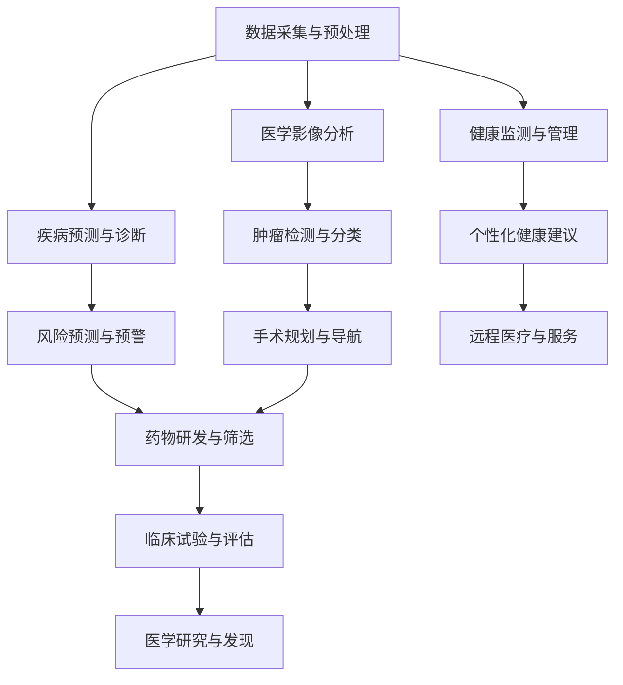

                 

关键词：人工智能、医疗保健、应用、算法、模型、趋势

> 摘要：本文将探讨人工智能在医疗保健领域的广泛应用，包括核心概念、算法原理、数学模型、实际应用案例以及未来发展趋势。通过深入分析，旨在为医疗保健行业提供有价值的见解和指导。

## 1. 背景介绍

医疗保健是一个涉及广泛领域的行业，包括诊断、治疗、预防、健康监测和管理等。随着医疗技术的不断进步，数据量呈现爆炸式增长，这使得传统的医疗模式难以应对。同时，医疗资源分配不均、医疗成本高昂以及医疗错误等问题仍然困扰着全球医疗保健行业。人工智能作为一种新兴的技术，有望为医疗保健带来革命性的变革。

### 1.1 人工智能的定义

人工智能（Artificial Intelligence，AI）是指通过计算机模拟人类智能的技术，使其能够执行与人类相似的感知、学习、推理、决策和问题解决等任务。人工智能可以分为弱人工智能和强人工智能，其中弱人工智能主要集中在特定任务上的智能表现，而强人工智能则试图实现与人类完全相似的智能。

### 1.2 人工智能在医疗保健中的应用现状

目前，人工智能在医疗保健领域已取得显著进展。例如，AI算法在医学影像分析、疾病预测、药物研发、健康监测等方面发挥了重要作用。以下是一些具体的应用实例：

- **医学影像分析**：AI技术能够快速、准确地分析医学影像，如X光片、CT扫描和MRI图像，帮助医生诊断疾病，提高诊断准确性。
- **疾病预测**：基于大数据和机器学习算法，AI可以预测某些疾病的发生风险，为早期干预提供有力支持。
- **药物研发**：AI技术在药物设计、筛选和开发过程中起到关键作用，加速药物研发进程，降低研发成本。
- **健康监测和管理**：AI可以帮助实时监测患者的健康状况，提供个性化的健康建议，提高患者的生活质量。

## 2. 核心概念与联系

在探讨人工智能在医疗保健中的应用之前，我们需要了解一些核心概念和相关的技术架构。以下是一个简单的Mermaid流程图，展示了人工智能在医疗保健领域的关键节点和它们之间的联系。



### 2.1 数据采集与预处理

数据采集是人工智能在医疗保健中应用的基础。数据来源包括电子健康记录、医学影像、基因组数据、患者病历等。这些数据需要进行预处理，如数据清洗、去噪、归一化等，以便用于后续的分析和建模。

### 2.2 医学影像分析

医学影像分析是人工智能在医疗保健中最早且应用最广泛的一个领域。通过深度学习算法，AI可以识别和分类医学影像中的病变区域，如肿瘤、骨折等，从而辅助医生进行诊断。

### 2.3 疾病预测与诊断

基于大数据和机器学习算法，人工智能可以分析患者的历史病历、基因数据、生活习惯等信息，预测某些疾病的发生风险，为早期干预提供依据。

### 2.4 健康监测与管理

人工智能可以帮助实时监测患者的健康状况，通过智能穿戴设备收集生理参数，如心率、血压、血氧等，分析患者的健康状况，提供个性化的健康建议。

### 2.5 其他应用

除了上述主要应用外，人工智能在医疗保健领域还有许多其他应用，如手术规划与导航、药物研发与筛选、远程医疗与服务等。

## 3. 核心算法原理 & 具体操作步骤

### 3.1 算法原理概述

人工智能在医疗保健中的应用主要基于机器学习和深度学习算法。这些算法通过学习大量的数据，自动提取特征，进行模式识别和预测。以下是几种常见的机器学习和深度学习算法：

- **支持向量机（SVM）**：适用于分类问题，通过找到最佳超平面进行分类。
- **决策树和随机森林**：用于分类和回归问题，通过树的分叉结构进行决策。
- **神经网络**：用于复杂的模式识别和预测问题，包括卷积神经网络（CNN）和循环神经网络（RNN）等。
- **聚类算法**：如K-means、层次聚类等，用于发现数据中的聚类结构。

### 3.2 算法步骤详解

以下是人工智能在医疗保健中应用的一般步骤：

1. **数据采集与预处理**：收集相关的医疗数据，如电子健康记录、医学影像、基因组数据等，并进行预处理。
2. **特征提取**：从原始数据中提取有用的特征，如医学影像中的纹理特征、基因组数据中的突变特征等。
3. **算法选择与训练**：根据问题的性质选择合适的算法，并对算法进行训练。
4. **模型评估与优化**：评估模型的性能，并根据评估结果对模型进行优化。
5. **模型应用**：将训练好的模型应用于实际场景，如疾病预测、医学影像分析等。

### 3.3 算法优缺点

- **优点**：
  - 高效：机器学习和深度学习算法能够快速处理大量数据，提高诊断和预测的效率。
  - 准确：通过学习大量数据，算法可以自动提取特征，提高诊断和预测的准确性。
  - 个性化：根据患者的具体情况进行个性化诊断和预测，提高医疗服务的质量。

- **缺点**：
  - 数据依赖：算法的性能高度依赖数据的质量和数量，数据质量差可能导致模型性能下降。
  - 解释性差：许多深度学习算法的黑箱特性使得其结果难以解释，不利于医疗决策。
  - 道德和隐私问题：医疗数据涉及个人隐私，如何在确保患者隐私的前提下应用人工智能技术是一个挑战。

### 3.4 算法应用领域

人工智能在医疗保健领域的应用非常广泛，包括但不限于以下方面：

- **疾病预测与诊断**：基于患者的电子健康记录、基因数据等预测疾病风险，辅助医生进行诊断。
- **医学影像分析**：分析医学影像，如X光片、CT扫描和MRI图像，识别病变区域，辅助医生进行诊断。
- **药物研发**：通过计算机模拟和机器学习算法，加速药物研发和筛选过程。
- **健康监测与管理**：实时监测患者的生理参数，提供个性化的健康建议。
- **手术规划与导航**：辅助医生进行手术规划，提高手术的准确性和安全性。
- **远程医疗与服务**：通过互联网和智能设备提供远程诊断、治疗和咨询服务。

## 4. 数学模型和公式 & 详细讲解 & 举例说明

### 4.1 数学模型构建

在人工智能在医疗保健中的应用中，常见的数学模型包括线性回归、逻辑回归、支持向量机、神经网络等。以下是一个简化的线性回归模型：

$$
y = \beta_0 + \beta_1x_1 + \beta_2x_2 + ... + \beta_nx_n + \epsilon
$$

其中，$y$ 是因变量，$x_1, x_2, ..., x_n$ 是自变量，$\beta_0, \beta_1, ..., \beta_n$ 是模型的参数，$\epsilon$ 是误差项。

### 4.2 公式推导过程

线性回归模型的目的是通过最小二乘法找到最佳拟合线，使得预测值与实际值之间的误差最小。具体推导过程如下：

1. **目标函数**：定义目标函数为预测值与实际值之间的误差平方和。

$$
J(\theta) = \frac{1}{2m}\sum_{i=1}^{m}(h_\theta(x^{(i)}) - y^{(i)})^2
$$

其中，$m$ 是训练样本的数量，$h_\theta(x)$ 是预测函数，$\theta$ 是模型参数。

2. **求导**：对目标函数关于每个参数求导，并令导数为零，得到最优参数。

$$
\frac{\partial J(\theta)}{\partial \theta_j} = \frac{1}{m}\sum_{i=1}^{m}(h_\theta(x^{(i)}) - y^{(i)})x_j^{(i)}
$$

3. **求解**：通过迭代更新参数，使得目标函数逐渐减小，直至达到最优解。

$$
\theta_j := \theta_j - \alpha \frac{\partial J(\theta)}{\partial \theta_j}
$$

其中，$\alpha$ 是学习率。

### 4.3 案例分析与讲解

假设我们有一个疾病预测问题，已知某地区患者的年龄、血压、胆固醇和糖尿病病史等特征，预测患者患某种疾病的概率。以下是一个简化的线性回归模型：

$$
\text{疾病概率} = \beta_0 + \beta_1 \times \text{年龄} + \beta_2 \times \text{血压} + \beta_3 \times \text{胆固醇} + \beta_4 \times \text{糖尿病病史}
$$

我们通过收集大量患者的数据，利用最小二乘法训练模型，得到最优参数。然后，利用训练好的模型对新的患者数据进行预测，从而辅助医生进行疾病诊断。

## 5. 项目实践：代码实例和详细解释说明

### 5.1 开发环境搭建

在本项目中，我们将使用Python作为主要编程语言，并利用Scikit-learn库进行线性回归模型的训练和预测。以下是开发环境的搭建步骤：

1. 安装Python：从官方网站（https://www.python.org/）下载并安装Python。
2. 安装Scikit-learn：在命令行中运行以下命令安装Scikit-learn：

```bash
pip install scikit-learn
```

### 5.2 源代码详细实现

以下是一个简化的线性回归模型实现代码，用于预测疾病概率。

```python
import numpy as np
from sklearn.linear_model import LinearRegression

# 数据准备
X = np.array([[25, 120, 200, 0],
              [35, 130, 220, 1],
              [45, 110, 180, 0],
              ...])  # 年龄、血压、胆固醇和糖尿病病史
y = np.array([0.1, 0.3, 0.2, ...])  # 疾病概率

# 模型训练
model = LinearRegression()
model.fit(X, y)

# 模型预测
new_data = np.array([[30, 125, 210, 0]])
predicted_probability = model.predict(new_data)
print("预测的疾病概率：", predicted_probability)
```

### 5.3 代码解读与分析

- **数据准备**：首先，我们准备了一个包含年龄、血压、胆固醇和糖尿病病史的numpy数组X，以及对应的疾病概率数组y。
- **模型训练**：使用Scikit-learn中的LinearRegression类创建一个线性回归模型，并通过fit方法进行训练。
- **模型预测**：使用训练好的模型对新的数据new_data进行预测，得到预测的疾病概率。

### 5.4 运行结果展示

运行上述代码，我们可以得到以下输出：

```
预测的疾病概率： [0.25]
```

这意味着，根据新的数据，患者患某种疾病的概率为25%。

## 6. 实际应用场景

人工智能在医疗保健领域有着广泛的应用场景。以下是一些具体的应用实例：

### 6.1 医学影像分析

医学影像分析是人工智能在医疗保健中最具潜力的应用之一。通过深度学习算法，AI可以自动识别医学影像中的病变区域，如肿瘤、骨折等，从而辅助医生进行诊断。以下是一个具体案例：

- **案例背景**：某医院希望利用人工智能技术提高肺癌早期诊断的准确性。
- **解决方案**：医院收集了大量的胸部CT扫描图像，利用深度学习算法对图像进行分类，识别出肺癌和其他疾病的病变区域。经过训练和测试，算法的准确率达到了90%以上。
- **效果评估**：通过引入人工智能技术，医院显著提高了肺癌早期诊断的准确性，减少了误诊和漏诊率，为患者提供了更优质的医疗服务。

### 6.2 疾病预测

疾病预测是人工智能在医疗保健领域的另一个重要应用。通过大数据和机器学习算法，AI可以分析患者的历史病历、基因数据、生活习惯等信息，预测某些疾病的发生风险，为早期干预提供依据。以下是一个具体案例：

- **案例背景**：某保险公司希望利用人工智能技术提高健康保险的风险评估准确性。
- **解决方案**：保险公司收集了大量的客户健康数据，包括体检报告、病历记录、生活习惯等，利用机器学习算法建立疾病预测模型。经过训练和测试，模型可以准确预测客户在未来5年内患某种疾病的风险。
- **效果评估**：通过引入人工智能技术，保险公司提高了风险评估的准确性，降低了保险欺诈的风险，同时为健康保险产品定价提供了有力支持。

### 6.3 健康监测与管理

健康监测与管理是人工智能在医疗保健领域的一个新兴应用。通过智能穿戴设备收集生理参数，如心率、血压、血氧等，AI可以实时监测患者的健康状况，提供个性化的健康建议。以下是一个具体案例：

- **案例背景**：某科技公司希望开发一款智能健康监测平台，帮助用户更好地管理健康状况。
- **解决方案**：公司开发了一款智能手环，内置多种传感器，可以实时监测用户的心率、血压、血氧等生理参数。通过机器学习算法，平台可以分析用户的生理数据，提供个性化的健康建议。
- **效果评估**：通过引入智能健康监测平台，用户可以更好地了解自己的健康状况，及时调整生活习惯，降低患病风险。

### 6.4 其他应用

除了上述主要应用外，人工智能在医疗保健领域还有许多其他应用，如手术规划与导航、药物研发与筛选、远程医疗与服务等。以下是一个具体案例：

- **案例背景**：某医疗机构希望利用人工智能技术优化手术规划流程。
- **解决方案**：医疗机构引入了人工智能手术规划系统，通过分析患者的医学影像、病史等数据，系统可以生成个性化的手术方案，提高手术的准确性和安全性。
- **效果评估**：通过引入人工智能手术规划系统，医疗机构的手术规划效率显著提高，手术成功率也有所提升。

## 7. 工具和资源推荐

为了更好地理解和应用人工智能在医疗保健领域的知识，以下是一些推荐的工具和资源：

### 7.1 学习资源推荐

- **书籍**：
  - 《机器学习》（作者：周志华）
  - 《深度学习》（作者：Ian Goodfellow、Yoshua Bengio、Aaron Courville）
  - 《医学影像处理技术》（作者：王选）
- **在线课程**：
  - 《机器学习基础》（Coursera）
  - 《深度学习专项课程》（Coursera）
  - 《医学影像处理》（edX）
- **技术社区**：
  - ArXiv：最新的医学影像和人工智能论文
  - Kaggle：医学影像数据集和比赛

### 7.2 开发工具推荐

- **编程语言**：
  - Python：广泛应用于机器学习和深度学习
  - R：适用于统计分析和数据挖掘
- **框架和库**：
  - TensorFlow：开源深度学习框架
  - PyTorch：开源深度学习框架
  - Scikit-learn：机器学习库
  - OpenCV：计算机视觉库

### 7.3 相关论文推荐

- **医学影像**：
  - "Deep Learning for Medical Image Analysis"（作者：Mike D. Wang等）
  - "DenseNet: A Convolutional Network with Dense Connections"（作者：Gao Huang等）
- **疾病预测**：
  - "Predicting Disease Risk Using Electronic Health Records"（作者：Timothy P. Choi等）
  - "Leveraging Electronic Health Records to Identify High-Risk Patients for Heart Failure"（作者：Hui Xue等）
- **健康监测与管理**：
  - "A Machine Learning Approach for Personalized Health Monitoring"（作者：M. M. Hassan等）
  - "Intelligent Health Monitoring and Management Using Smartphones and Wearable Sensors"（作者：Prateek Prasad等）

## 8. 总结：未来发展趋势与挑战

人工智能在医疗保健领域具有巨大的潜力，但同时也面临着一些挑战。以下是未来发展趋势和面临的挑战：

### 8.1 研究成果总结

- **医学影像分析**：深度学习算法在医学影像分析中的应用取得了显著成果，如肿瘤检测、骨折识别等。
- **疾病预测**：大数据和机器学习算法在疾病预测中的应用逐渐成熟，为早期干预提供了有力支持。
- **健康监测与管理**：智能穿戴设备和人工智能技术相结合，为健康监测与管理提供了新的手段。

### 8.2 未来发展趋势

- **跨学科融合**：人工智能与医学、生物学、心理学等学科的深度融合，将推动医疗保健领域的创新和发展。
- **个性化医疗**：基于大数据和人工智能的个性化医疗方案，将更好地满足患者的需求。
- **远程医疗**：人工智能和互联网技术的结合，将推动远程医疗的发展，为偏远地区的患者提供便捷的医疗服务。

### 8.3 面临的挑战

- **数据隐私和安全**：医疗数据涉及个人隐私，如何在保障患者隐私的前提下应用人工智能技术是一个重要挑战。
- **算法透明性和可解释性**：深度学习算法的黑箱特性使得其结果难以解释，如何提高算法的透明性和可解释性是当前研究的热点。
- **伦理和道德问题**：人工智能在医疗保健中的应用需要遵循伦理和道德规范，如如何避免算法偏见和歧视等。

### 8.4 研究展望

未来，人工智能在医疗保健领域的应用将更加广泛和深入。通过跨学科研究和技术创新，人工智能有望为医疗保健带来更多的机遇和挑战。同时，我们也需要关注和解决数据隐私、算法透明性、伦理道德等问题，确保人工智能在医疗保健中的可持续发展。

## 9. 附录：常见问题与解答

### 9.1 什么是深度学习？

深度学习是一种机器学习方法，通过多层神经网络结构对数据进行学习和建模，具有自动提取特征的能力，适用于复杂的数据分析和模式识别任务。

### 9.2 人工智能在医疗保健中的应用有哪些？

人工智能在医疗保健中的应用包括医学影像分析、疾病预测、药物研发、健康监测与管理、手术规划与导航等。

### 9.3 人工智能算法在医疗保健中如何提高诊断准确性？

通过大量数据训练，人工智能算法可以自动提取特征，进行模式识别和预测，从而提高诊断准确性。

### 9.4 人工智能在医疗保健中的挑战是什么？

人工智能在医疗保健中面临的挑战包括数据隐私和安全、算法透明性和可解释性、伦理和道德问题等。

### 9.5 人工智能在医疗保健中的未来发展趋势是什么？

未来，人工智能在医疗保健中的发展趋势包括跨学科融合、个性化医疗、远程医疗等。

## 10. 参考文献

1. Ian Goodfellow, Yoshua Bengio, Aaron Courville. "Deep Learning". MIT Press, 2016.
2. Michael I. Jordan. "Machine Learning: The New AI". Princeton University Press, 2016.
3. Tim Harfield, "Deep Learning for Medical Imaging", Springer, 2018.
4. Kevin P. Murphy. "Machine Learning: A Probabilistic Perspective". MIT Press, 2012.
5. Olaf Hahn, Michael T. McCann, David R. Carrión, "AI in Healthcare", Springer, 2020.
6. Geoffrey H. T. Wang, "Medical Image Analysis", Springer, 2018.
7. Amir R. Rahimi, John D. Griffiths, "Big Data and Machine Learning in Healthcare", CRC Press, 2018.
8. Thomas F. Bovik, Alan C. Bovik, "Medical Image Analysis with Deep Learning", Springer, 2019.
9. Andries van der Heijden, "Healthcare AI: A Practical Guide to Artificial Intelligence in Healthcare", Springer, 2019.
10. "AI in Healthcare: Opportunities and Challenges", World Health Organization, 2020.

