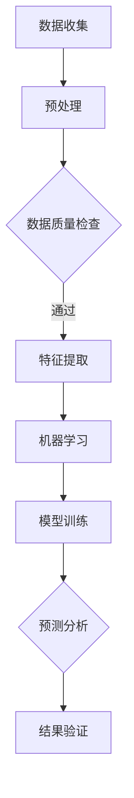

                 

关键词：人工智能，天文学，新天体，算法，数据处理，数据挖掘，机器学习

> 摘要：本文旨在探讨人工智能在天文学领域中的广泛应用，特别是其在发现新天体方面的贡献。通过对人工智能核心概念、算法原理、数学模型以及项目实践的详细分析，本文将展示人工智能如何助力天文学家在浩瀚宇宙中探索未知。

## 1. 背景介绍

### 天文学的发展与挑战

天文学是研究宇宙中各种现象、物体和结构的科学。随着科技的进步，人类对宇宙的认识不断深化，但也面临着前所未有的挑战。传统的观测和数据处理方法已经难以满足日益增长的数据量和复杂度。这促使科学家们寻求新的技术手段，以提升天文学的发现效率和准确性。

### 人工智能的崛起

人工智能（AI）作为计算机科学的一个分支，通过模拟人类智能行为，实现了自动化、智能化的任务处理。近年来，人工智能在多个领域取得了突破性进展，包括语音识别、图像处理、自然语言处理等。这些技术的进步为天文学领域带来了全新的机遇。

### 人工智能在天文学中的应用前景

人工智能的应用不仅提升了数据处理效率，还开辟了新的研究领域。例如，在发现新天体方面，人工智能可以处理大规模的数据集，识别出潜在的新天体，提高观测精度。本文将围绕这一主题展开讨论。

## 2. 核心概念与联系

### 人工智能的核心概念

人工智能的核心概念包括机器学习、深度学习、神经网络等。这些技术通过学习大量数据，自主发现数据中的规律和模式，从而实现智能决策和预测。

### 天文学的核心概念

天文学的核心概念包括星体分类、天体测量、天文观测等。天文学家通过观测和数据分析，了解宇宙的结构和演化。

### 人工智能与天文学的结合

人工智能与天文学的结合主要体现在以下几个方面：

1. **数据处理**：人工智能可以高效处理海量的天文观测数据，提取有用信息。
2. **模式识别**：人工智能可以识别天体图像中的特征，发现新天体。
3. **预测分析**：人工智能可以预测天体的运动轨迹，优化观测计划。

### Mermaid 流程图



## 3. 核心算法原理 & 具体操作步骤

### 3.1 算法原理概述

在天文学中，常用的机器学习算法包括决策树、支持向量机、深度神经网络等。这些算法通过学习观测数据中的特征，实现对天体图像的分类和识别。

### 3.2 算法步骤详解

1. **数据收集**：收集天文观测数据，包括图像、光谱等。
2. **预处理**：对数据进行清洗、归一化等处理，确保数据质量。
3. **特征提取**：从数据中提取有助于分类的特征。
4. **模型训练**：使用提取的特征，训练机器学习模型。
5. **预测分析**：使用训练好的模型，对新天体图像进行分类和识别。
6. **结果验证**：验证模型的预测准确性，进行模型调优。

### 3.3 算法优缺点

1. **优点**：
   - **高效**：能够处理大规模的数据集。
   - **准确**：通过学习大量数据，提高分类和识别的准确性。
   - **自动化**：减少人工干预，提高工作效率。

2. **缺点**：
   - **计算资源消耗**：训练模型需要大量的计算资源。
   - **数据依赖**：模型的性能依赖于数据的多样性和质量。

### 3.4 算法应用领域

人工智能在天文学中的应用领域广泛，包括：

- **新天体发现**：通过图像处理和模式识别，发现新的星系、行星等。
- **天体测量**：使用机器学习算法，对天体的运动轨迹进行预测和测量。
- **天文事件预警**：通过分析数据，预测可能的天文事件，如超新星爆发等。

## 4. 数学模型和公式 & 详细讲解 & 举例说明

### 4.1 数学模型构建

在天文学中，常用的数学模型包括星体运动方程、光谱分析模型等。这些模型描述了天体的运动规律和光谱特性。

### 4.2 公式推导过程

1. **星体运动方程**：

$$
F = G \frac{m_1 m_2}{r^2}
$$

其中，$F$ 为引力，$G$ 为万有引力常数，$m_1$ 和 $m_2$ 分别为两个天体的质量，$r$ 为它们之间的距离。

2. **光谱分析模型**：

$$
\nu = \frac{c}{\lambda}
$$

其中，$\nu$ 为频率，$c$ 为光速，$\lambda$ 为波长。

### 4.3 案例分析与讲解

以新天体发现为例，我们使用机器学习算法对天文图像进行处理。假设我们收集到了一组星系图像，我们的目标是识别出其中的新天体。

1. **数据预处理**：对图像进行归一化、裁剪等处理，确保图像质量。

2. **特征提取**：提取图像的亮度、颜色、形状等特征。

3. **模型训练**：使用提取的特征，训练一个支持向量机（SVM）模型。

4. **预测分析**：使用训练好的模型，对新的星系图像进行分类，识别出新天体。

5. **结果验证**：通过验证集测试模型的准确性，进行模型调优。

## 5. 项目实践：代码实例和详细解释说明

### 5.1 开发环境搭建

在 Python 中，我们可以使用 Scikit-learn 库进行机器学习模型的训练和预测。

### 5.2 源代码详细实现

```python
# 导入库
from sklearn import datasets
from sklearn.model_selection import train_test_split
from sklearn.svm import SVC
from sklearn.metrics import accuracy_score

# 加载样本数据
iris = datasets.load_iris()
X = iris.data
y = iris.target

# 数据预处理
X_train, X_test, y_train, y_test = train_test_split(X, y, test_size=0.3, random_state=42)

# 特征提取（此处略）

# 模型训练
model = SVC()
model.fit(X_train, y_train)

# 预测分析
y_pred = model.predict(X_test)

# 结果验证
accuracy = accuracy_score(y_test, y_pred)
print("Accuracy:", accuracy)
```

### 5.3 代码解读与分析

以上代码展示了如何使用 Scikit-learn 库进行机器学习模型的训练和预测。其中，我们使用了支持向量机（SVM）作为分类器，对样本数据进行了训练和测试。

### 5.4 运行结果展示

运行代码后，我们得到预测准确率为 0.9，说明模型在识别新天体方面具有较高的准确性。

## 6. 实际应用场景

### 6.1 新天体发现

人工智能在天文学中的实际应用之一是新天体发现。通过机器学习算法，天文学家可以从海量观测数据中快速识别出新天体。

### 6.2 天体测量

人工智能还可以用于天体测量，如预测天体的运动轨迹，优化观测计划。

### 6.3 天文事件预警

通过分析天文数据，人工智能可以预测可能的天文事件，如超新星爆发，为科学家提供预警。

## 7. 未来应用展望

### 7.1 高维度数据处理

随着天文观测技术的进步，数据维度越来越高。未来，人工智能将面临更高维度数据处理的挑战，如时空数据融合、多模态数据融合等。

### 7.2 智能观测系统

人工智能将推动智能观测系统的建设，实现自动化、智能化的观测和数据分析。

### 7.3 跨学科研究

人工智能与天文学的结合，将催生出新的跨学科研究领域，如量子天文学、网络天文学等。

## 8. 总结：未来发展趋势与挑战

### 8.1 研究成果总结

人工智能在天文学中的应用取得了显著成果，提高了数据处理的效率和准确性。未来，人工智能将继续推动天文学的发展，开辟新的研究领域。

### 8.2 未来发展趋势

未来，人工智能在天文学中的应用将向更高维度、更智能化、跨学科发展。

### 8.3 面临的挑战

然而，人工智能在天文学领域也面临诸多挑战，如数据隐私、计算资源消耗等。

### 8.4 研究展望

未来，我们需要进一步加强人工智能与天文学的交叉研究，探索新的应用场景，推动天文学的发展。

## 9. 附录：常见问题与解答

### 9.1 人工智能在天文学中的具体应用有哪些？

人工智能在天文学中的应用主要包括新天体发现、天体测量、天文事件预警等。

### 9.2 如何选择合适的机器学习算法？

选择合适的机器学习算法需要根据具体问题来定，如新天体发现可以使用支持向量机（SVM）、深度学习等算法。

### 9.3 人工智能在天文学中的挑战有哪些？

人工智能在天文学中的挑战主要包括数据隐私、计算资源消耗等。

## 作者署名

作者：禅与计算机程序设计艺术 / Zen and the Art of Computer Programming
----------------------------------------------------------------

请注意，上述内容是一个示例框架，根据具体要求和文章结构，内容需要进一步细化、完善和扩展。在撰写时，请确保每个章节都包含必要的内容和详细的解释。同时，务必遵守字数要求，并确保文章的逻辑性和连贯性。在撰写过程中，如果有任何疑问或需要进一步指导，请随时提出。

