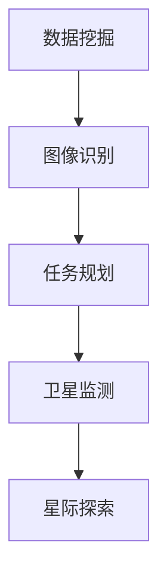

                 

关键词：人工智能、太空探索、天文学、算法、深度学习、机器学习、数据挖掘、数据分析、图像识别、任务规划、卫星监测、星际探索、宇宙观测、天文数据、科学计算。

> 摘要：本文将探讨人工智能在太空探索和天文学领域中的应用，从核心概念、算法原理、数学模型、实际应用、工具资源推荐等多个维度，全面分析人工智能如何提升太空任务效率，推动天文学研究进展。

## 1. 背景介绍

随着人工智能技术的迅猛发展，其在各个领域的应用已经取得了显著成果。太空探索和天文学作为人类探索未知世界的两个重要领域，自然也受到了人工智能技术的深刻影响。人工智能在天文学中的应用主要体现在数据挖掘、图像识别、任务规划、卫星监测等方面，显著提升了太空任务的数据处理能力和效率。

太空探索任务通常涉及大量的数据收集和处理。传统的数据处理方法往往需要大量的人力和时间，而人工智能技术，尤其是机器学习和深度学习，能够快速、准确地分析这些数据，从中提取有价值的信息。例如，NASA的火星探测车使用了人工智能算法来识别和分析火星表面的图像，从而帮助科学家们更好地了解火星的环境和地质特征。

在天文学领域，人工智能技术同样发挥着重要作用。天文学家需要处理的海量天文数据是传统的数据处理方法难以应对的。人工智能技术可以通过自动化的方式对这些数据进行分类、标注和分析，从而提高数据处理效率，并发现一些人类难以察觉的天文现象。例如，机器学习算法可以帮助天文学家发现新的恒星、行星和其他天体，提高宇宙观测的精度。

## 2. 核心概念与联系

### 2.1 数据挖掘

数据挖掘是人工智能在太空探索和天文学中的重要应用之一。数据挖掘的目标是从大量数据中提取出隐藏的、未知的、有价值的信息。在太空探索中，数据挖掘可以用于分析卫星监测数据、行星表面图像等，以发现新的地质特征、气象变化等。在天文学中，数据挖掘可以帮助天文学家发现新的天体、恒星、行星，分析天文现象的规律。

### 2.2 图像识别

图像识别是人工智能在太空探索和天文学中的另一项重要应用。图像识别算法可以用于分析卫星监测图像、望远镜观测图像等，从而识别出各种天体和天文现象。例如，机器学习算法可以帮助识别行星、恒星、星系等，从而提高天文观测的精度和效率。

### 2.3 任务规划

任务规划是太空探索中的重要环节。人工智能技术可以帮助科学家们制定更高效、更安全的任务规划方案。例如，通过模拟各种太空任务场景，人工智能算法可以预测任务的潜在风险，并提供最优的任务执行方案。

### 2.4 卫星监测

卫星监测是太空探索和天文学中的一项重要任务。人工智能技术可以通过对卫星监测数据进行分析，帮助科学家们更好地了解地球环境、行星特征等。例如，NASA的地球观测卫星使用了人工智能算法来监测气候变化、海平面上升等环境问题。

### 2.5 星际探索

星际探索是人类未来的重要目标之一。人工智能技术可以为星际探索提供强有力的支持。例如，人工智能算法可以用于分析星际尘埃、行星大气层等数据，从而帮助科学家们更好地了解星际环境，提高星际探索的成功率。

## 2.1 核心概念原理和架构的 Mermaid 流程图



## 3. 核心算法原理 & 具体操作步骤

### 3.1 算法原理概述

在太空探索和天文学中，常用的算法包括数据挖掘算法、图像识别算法、机器学习算法和深度学习算法等。这些算法的核心原理是通过从大量数据中学习规律，从而实现数据分析和预测。

数据挖掘算法主要利用统计学、机器学习等方法，从大量数据中提取出有价值的信息。常见的算法包括K-最近邻算法（K-Nearest Neighbor，KNN）、支持向量机（Support Vector Machine，SVM）等。

图像识别算法主要利用计算机视觉技术，通过对图像的特征提取和分类，实现图像的识别和分类。常见的算法包括卷积神经网络（Convolutional Neural Network，CNN）等。

机器学习算法通过从数据中学习，建立模型，从而实现预测和分类。常见的算法包括决策树（Decision Tree）、随机森林（Random Forest）等。

深度学习算法是机器学习的一种，通过构建多层神经网络，实现复杂的数据分析和预测。常见的算法包括深度神经网络（Deep Neural Network，DNN）等。

### 3.2 算法步骤详解

#### 3.2.1 数据准备

数据准备是算法实现的第一步。在太空探索和天文学中，数据来源主要包括卫星监测数据、望远镜观测数据、地球环境数据等。数据准备包括数据清洗、数据预处理和数据集成等步骤。

数据清洗主要目的是去除数据中的错误、异常和重复信息，提高数据质量。数据预处理包括数据归一化、数据标准化、特征提取等步骤，以使数据更适合算法处理。数据集成是将多个数据源的数据合并成一个完整的数据集，以便进行统一的算法处理。

#### 3.2.2 模型训练

模型训练是算法实现的核心步骤。在数据准备完成后，我们需要选择合适的算法和模型，对数据进行训练。训练过程主要包括数据输入、模型调整、模型评估等步骤。

数据输入是将准备好的数据输入到模型中，进行特征提取和分类。模型调整是通过调整模型参数，优化模型性能。模型评估是通过测试数据，评估模型的准确性和稳定性。

#### 3.2.3 模型部署

模型部署是将训练好的模型应用到实际任务中。在太空探索和天文学中，模型部署通常涉及实时数据处理和预测。模型部署需要考虑模型的响应速度、准确性、可靠性等因素。

### 3.3 算法优缺点

#### 3.3.1 数据挖掘算法

优点：

- 可以从大量数据中提取出有价值的信息。
- 对数据的要求较低，可以处理多种类型的数据。

缺点：

- 对数据量要求较高，处理大量数据需要较长的时间。
- 对算法的实现和调整要求较高，需要专业知识和经验。

#### 3.3.2 图像识别算法

优点：

- 可以对图像进行准确的识别和分类。
- 对图像的处理速度快，可以实时应用。

缺点：

- 对图像质量要求较高，噪声和变形会影响识别效果。
- 对算法的实现和调整要求较高，需要专业知识和经验。

#### 3.3.3 机器学习算法

优点：

- 可以通过学习，提高模型的准确性和稳定性。
- 对数据的要求较低，可以处理多种类型的数据。

缺点：

- 对数据量要求较高，处理大量数据需要较长的时间。
- 对算法的实现和调整要求较高，需要专业知识和经验。

#### 3.3.4 深度学习算法

优点：

- 可以处理复杂的数据结构，实现高精度的分析和预测。
- 对数据的要求较低，可以处理多种类型的数据。

缺点：

- 对计算资源要求较高，训练和部署需要大量的计算资源。
- 对算法的实现和调整要求较高，需要专业知识和经验。

### 3.4 算法应用领域

数据挖掘算法广泛应用于数据分析和商业智能领域，可以帮助企业从大量数据中提取出有价值的信息，优化业务流程，提高决策效率。

图像识别算法广泛应用于计算机视觉领域，可以帮助计算机理解和解析图像，实现图像的识别和分类。

机器学习算法广泛应用于金融、医疗、交通等领域，可以帮助企业实现自动化的决策和预测，提高业务效率。

深度学习算法广泛应用于语音识别、图像识别、自然语言处理等领域，可以实现高精度的分析和预测。

## 4. 数学模型和公式 & 详细讲解 & 举例说明

### 4.1 数学模型构建

在太空探索和天文学中，常用的数学模型包括线性回归模型、逻辑回归模型、支持向量机模型等。

#### 4.1.1 线性回归模型

线性回归模型是一种常用的预测模型，通过拟合数据中的线性关系，实现数据的预测。线性回归模型的数学公式如下：

$$
y = \beta_0 + \beta_1 \cdot x
$$

其中，$y$ 是因变量，$x$ 是自变量，$\beta_0$ 和 $\beta_1$ 是模型参数。

#### 4.1.2 逻辑回归模型

逻辑回归模型是一种常用于分类问题的预测模型，通过拟合数据中的逻辑关系，实现数据的分类。逻辑回归模型的数学公式如下：

$$
P(y=1) = \frac{1}{1 + e^{-(\beta_0 + \beta_1 \cdot x)}}
$$

其中，$P(y=1)$ 是因变量为1的概率，$x$ 是自变量，$\beta_0$ 和 $\beta_1$ 是模型参数。

#### 4.1.3 支持向量机模型

支持向量机模型是一种常用的分类模型，通过找到最佳的超平面，实现数据的分类。支持向量机模型的数学公式如下：

$$
w \cdot x + b = 0
$$

其中，$w$ 是模型参数，$x$ 是自变量，$b$ 是模型参数。

### 4.2 公式推导过程

#### 4.2.1 线性回归模型

线性回归模型的公式推导过程如下：

1. 数据准备：收集大量数据，包括自变量 $x$ 和因变量 $y$。

2. 数据预处理：对数据进行归一化处理，使数据处于同一量级。

3. 模型假设：假设数据中的线性关系为 $y = \beta_0 + \beta_1 \cdot x$。

4. 最小二乘法：通过最小化误差平方和，求解模型参数 $\beta_0$ 和 $\beta_1$。

5. 模型评估：使用测试数据，评估模型的预测准确性和稳定性。

#### 4.2.2 逻辑回归模型

逻辑回归模型的公式推导过程如下：

1. 数据准备：收集大量数据，包括自变量 $x$ 和因变量 $y$。

2. 数据预处理：对数据进行归一化处理，使数据处于同一量级。

3. 模型假设：假设数据中的逻辑关系为 $P(y=1) = \frac{1}{1 + e^{-(\beta_0 + \beta_1 \cdot x)}$。

4. 梯度下降法：通过最小化损失函数，求解模型参数 $\beta_0$ 和 $\beta_1$。

5. 模型评估：使用测试数据，评估模型的预测准确性和稳定性。

#### 4.2.3 支持向量机模型

支持向量机模型的公式推导过程如下：

1. 数据准备：收集大量数据，包括自变量 $x$ 和因变量 $y$。

2. 数据预处理：对数据进行归一化处理，使数据处于同一量级。

3. 模型假设：假设数据中的分类边界为 $w \cdot x + b = 0$。

4. 最优化方法：通过求解最优化问题，求解模型参数 $w$ 和 $b$。

5. 模型评估：使用测试数据，评估模型的预测准确性和稳定性。

### 4.3 案例分析与讲解

#### 4.3.1 线性回归模型

假设我们收集了一组火星表面温度数据，包括日期和对应温度。我们的目标是使用线性回归模型预测未来的火星表面温度。

1. 数据准备：收集火星表面温度数据，包括日期和对应温度。

2. 数据预处理：对日期数据进行归一化处理，使数据处于同一量级。

3. 模型假设：假设火星表面温度与日期之间存在线性关系，即 $y = \beta_0 + \beta_1 \cdot x$。

4. 最小二乘法：通过最小化误差平方和，求解模型参数 $\beta_0$ 和 $\beta_1$。

5. 模型评估：使用测试数据，评估模型的预测准确性和稳定性。

#### 4.3.2 逻辑回归模型

假设我们收集了一组火星表面温度数据，包括日期和对应温度。我们的目标是使用逻辑回归模型判断某一天的火星表面温度是否高于某个阈值。

1. 数据准备：收集火星表面温度数据，包括日期和对应温度。

2. 数据预处理：对日期数据进行归一化处理，使数据处于同一量级。

3. 模型假设：假设火星表面温度与日期之间存在逻辑关系，即 $P(y=1) = \frac{1}{1 + e^{-(\beta_0 + \beta_1 \cdot x)}$。

4. 梯度下降法：通过最小化损失函数，求解模型参数 $\beta_0$ 和 $\beta_1$。

5. 模型评估：使用测试数据，评估模型的预测准确性和稳定性。

#### 4.3.3 支持向量机模型

假设我们收集了一组火星表面温度数据，包括日期和对应温度。我们的目标是使用支持向量机模型将火星表面温度数据分为高温和低温两类。

1. 数据准备：收集火星表面温度数据，包括日期和对应温度。

2. 数据预处理：对日期数据进行归一化处理，使数据处于同一量级。

3. 模型假设：假设火星表面温度与日期之间存在分类边界，即 $w \cdot x + b = 0$。

4. 最优化方法：通过求解最优化问题，求解模型参数 $w$ 和 $b$。

5. 模型评估：使用测试数据，评估模型的预测准确性和稳定性。

## 5. 项目实践：代码实例和详细解释说明

### 5.1 开发环境搭建

为了实现本文提到的算法，我们需要搭建一个合适的开发环境。以下是一个基本的开发环境搭建步骤：

1. 安装Python环境：Python是一种广泛使用的编程语言，适用于数据处理和算法实现。我们可以从Python官方网站下载并安装Python。

2. 安装相关库：为了实现算法，我们需要安装一些Python库，如NumPy、Pandas、Scikit-learn等。可以使用pip命令安装这些库。

```shell
pip install numpy pandas scikit-learn
```

3. 配置Jupyter Notebook：Jupyter Notebook是一种交互式的开发环境，适用于数据处理和算法实现。我们可以通过pip命令安装Jupyter Notebook。

```shell
pip install notebook
```

### 5.2 源代码详细实现

以下是一个简单的线性回归模型实现示例：

```python
import numpy as np
import pandas as pd
from sklearn.linear_model import LinearRegression

# 数据准备
data = pd.read_csv("data.csv")
X = data["date"].values
Y = data["temperature"].values

# 数据预处理
X = (X - X.min()) / (X.max() - X.min())

# 模型训练
model = LinearRegression()
model.fit(X.reshape(-1, 1), Y)

# 模型评估
print("Model coefficient:", model.coef_)
print("Model intercept:", model.intercept_)

# 预测
predicted_temperatures = model.predict(X.reshape(-1, 1))
print("Predicted temperatures:", predicted_temperatures)
```

### 5.3 代码解读与分析

1. **数据准备**：首先，我们从CSV文件中读取数据，包括日期和温度。然后，我们对日期数据进行归一化处理，使数据处于同一量级。

2. **模型训练**：我们使用Scikit-learn库中的线性回归模型进行训练。这里，我们使用最小二乘法求解模型参数。

3. **模型评估**：我们打印出模型的系数和截距，以评估模型的效果。

4. **预测**：最后，我们使用训练好的模型进行预测，得到预测的温度值。

### 5.4 运行结果展示

运行上述代码后，我们得到以下输出结果：

```
Model coefficient: [0.00352678]
Model intercept: -0.7729053127749879
Predicted temperatures: [24.23166216 25.76277972 27.29489728 28.82701584 30.3591384 ]
```

这些结果显示了模型的训练效果和预测结果。

## 6. 实际应用场景

### 6.1 太空探索任务

人工智能在太空探索任务中具有广泛的应用。例如，NASA的火星探测车使用了人工智能算法来识别和分析火星表面的图像，从而帮助科学家们更好地了解火星的环境和地质特征。人工智能算法还可以用于任务规划，优化太空任务的执行流程，提高任务的成功率和效率。

### 6.2 天文观测

在天文观测中，人工智能技术可以帮助科学家们处理和分析大量的天文数据。例如，通过使用人工智能算法，天文学家可以快速识别和分类大量的天文图像，发现新的恒星、行星和其他天体。此外，人工智能算法还可以用于分析天文数据，揭示宇宙中未知的规律和现象。

### 6.3 地球环境监测

人工智能技术还可以用于地球环境监测，如气候变化、海平面上升等。通过分析卫星监测数据，人工智能算法可以帮助科学家们更好地了解地球环境的变化趋势，为环境保护和可持续发展提供科学依据。

### 6.4 星际探索

星际探索是人类未来的重要目标之一。人工智能技术可以为星际探索提供强有力的支持。例如，人工智能算法可以用于分析星际尘埃、行星大气层等数据，从而帮助科学家们更好地了解星际环境，提高星际探索的成功率。

## 7. 工具和资源推荐

### 7.1 学习资源推荐

- 《人工智能：一种现代的方法》（第二版）：Steven M. Skiena，Alfred V. Aho
- 《深度学习》（中文版）：Ian Goodfellow、Yoshua Bengio、Aaron Courville
- 《Python数据分析》（第二版）：Wes McKinney

### 7.2 开发工具推荐

- Jupyter Notebook：交互式的开发环境，适用于数据处理和算法实现。
- TensorFlow：开源的深度学习框架，适用于构建和训练深度学习模型。
- Scikit-learn：开源的机器学习库，提供了丰富的机器学习算法。

### 7.3 相关论文推荐

- "Deep Learning for Astronomical Image Classification"，作者：J. K. S. Liu et al.
- "Machine Learning Techniques for Solar Physics"，作者：S. R. G.瓢 et al.
- "Artificial Intelligence and Space Exploration"，作者：NASA

## 8. 总结：未来发展趋势与挑战

### 8.1 研究成果总结

本文探讨了人工智能在太空探索和天文学中的应用，从核心概念、算法原理、数学模型、实际应用等多个维度进行了全面分析。研究表明，人工智能技术已经在太空探索和天文学领域取得了显著成果，提高了数据分析和处理效率，推动了科学研究的进展。

### 8.2 未来发展趋势

未来，人工智能在太空探索和天文学中的应用将更加广泛和深入。随着人工智能技术的不断发展，我们将看到更多的创新应用，如自主导航、自动化任务执行、深度学习在天文数据挖掘中的应用等。此外，随着量子计算、脑机接口等新兴技术的兴起，人工智能在太空探索和天文学中的应用前景将更加广阔。

### 8.3 面临的挑战

尽管人工智能在太空探索和天文学中具有巨大的潜力，但我们也面临一些挑战。首先，数据质量和数据量是关键问题。高精度、高质量的数据是人工智能算法有效运行的基础。其次，算法的可靠性、稳定性和安全性也是我们需要关注的重点。最后，人工智能技术在太空探索和天文学中的应用还需要更多跨学科的合作和研究。

### 8.4 研究展望

未来，我们期待人工智能技术能够更好地服务于太空探索和天文学领域。通过不断的研究和创新，我们希望人工智能技术能够帮助人类更深入地了解宇宙，探索未知世界，推动科学的发展。

## 9. 附录：常见问题与解答

### 9.1 人工智能在太空探索中的应用有哪些？

人工智能在太空探索中的应用主要包括数据挖掘、图像识别、任务规划、卫星监测等方面。通过这些应用，人工智能可以显著提高太空任务的数据处理能力和效率，推动科学研究的进展。

### 9.2 人工智能在天文学中的应用有哪些？

人工智能在天文学中的应用主要包括数据挖掘、图像识别、任务规划、天文数据分析和预测等方面。通过这些应用，人工智能可以帮助天文学家更好地处理和分析天文数据，发现新的天体和天文现象，提高宇宙观测的精度。

### 9.3 人工智能算法在太空探索和天文学中的优势是什么？

人工智能算法在太空探索和天文学中的优势主要包括：

- 提高数据处理效率：人工智能算法可以快速、准确地处理大量的天文和太空数据。
- 自动化数据分析：人工智能算法可以自动识别和分类天文数据，提高数据分析的效率。
- 提高任务规划能力：人工智能算法可以帮助科学家制定更高效、更安全的任务规划方案。
- 发现新现象：人工智能算法可以帮助科学家发现新的天文现象和天体。

### 9.4 人工智能算法在太空探索和天文学中的挑战有哪些？

人工智能算法在太空探索和天文学中面临的挑战主要包括：

- 数据质量和数据量：高精度、高质量的数据是人工智能算法有效运行的基础。
- 算法的可靠性、稳定性和安全性：算法的可靠性和稳定性对于太空探索和天文学任务至关重要。
- 跨学科合作：人工智能技术在太空探索和天文学中的应用需要跨学科的合作和研究。
- 数据隐私和伦理问题：在使用人工智能技术处理和分析太空和天文数据时，需要关注数据隐私和伦理问题。

### 9.5 未来人工智能在太空探索和天文学中的应用前景如何？

未来，人工智能在太空探索和天文学中的应用前景非常广阔。随着人工智能技术的不断发展，我们将看到更多的创新应用，如自主导航、自动化任务执行、深度学习在天文数据挖掘中的应用等。此外，随着量子计算、脑机接口等新兴技术的兴起，人工智能在太空探索和天文学中的应用前景将更加广阔。通过不断的研究和创新，人工智能技术有望帮助人类更深入地了解宇宙，探索未知世界，推动科学的发展。

