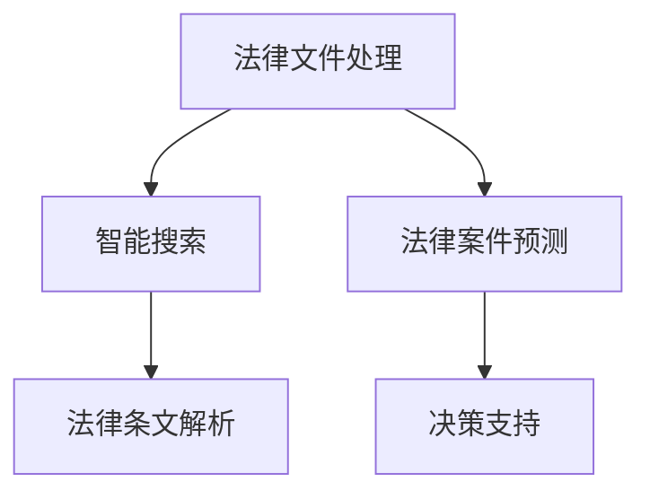

                 

关键词：人工智能、法律、司法、效率、准确性、流程自动化

> 摘要：本文旨在探讨人工智能在法律服务领域的应用，通过分析人工智能的核心技术和法律服务的实际需求，阐述人工智能如何提高法律服务的效率和准确性。本文将从算法原理、数学模型、实践应用、未来展望等多个角度，为读者提供一幅全面的智能法律服务蓝图。

## 1. 背景介绍

随着全球经济的发展和法治环境的日益完善，法律服务需求持续增长。传统法律服务的效率相对较低，依赖于人工处理大量法律文件和案件，不仅耗时耗力，还容易出错。而人工智能技术的快速发展，为法律服务行业带来了一场革命性的变革。通过自动化处理法律文件、智能搜索法律条文、预测法律案件结果等手段，人工智能在法律服务中的应用潜力巨大。

### 1.1 人工智能的定义与发展

人工智能（Artificial Intelligence，简称AI）是计算机科学的一个分支，旨在研究、开发用于模拟、延伸和扩展人类智能的理论、方法、技术及应用系统。人工智能的发展可以分为三个阶段：第一阶段是规则驱动的人工智能，以专家系统和推理机为代表；第二阶段是数据驱动的人工智能，以机器学习和深度学习为代表；第三阶段是混合智能，结合规则驱动和数据驱动，实现更加智能化的系统。

### 1.2 法律服务的现状与需求

法律服务是指为个人或企业提供法律咨询、代理诉讼、法律顾问等服务。随着互联网的普及和电子商务的兴起，法律服务领域也呈现出新的趋势：

- **法律文件处理自动化**：大量法律文件需要处理，如合同、诉状、判决书等，自动化处理可以提高效率，减少人力成本。
- **智能搜索与法律条文解析**：人工智能可以快速搜索相关法律条文，并提供法律条文之间的关联分析和解析，帮助律师提高工作效率。
- **法律案件预测与分析**：通过大数据分析和机器学习技术，人工智能可以对法律案件进行预测和分析，为法官和律师提供决策支持。

## 2. 核心概念与联系

### 2.1 人工智能的核心概念

- **机器学习（Machine Learning）**：一种让计算机从数据中学习模式并做出预测或决策的方法。
- **深度学习（Deep Learning）**：一种基于人工神经网络的机器学习方法，通过多层神经网络进行特征提取和模式识别。
- **自然语言处理（Natural Language Processing，NLP）**：使计算机能够理解、生成和处理人类自然语言的技术。
- **法律知识图谱（Legal Knowledge Graph）**：以法律条文、案例、法官观点等为基础，构建的法律知识体系。

### 2.2 法律服务中的核心概念

- **法律文件处理**：指对合同、诉状、判决书等法律文件进行自动化处理，如文本提取、格式化、分类等。
- **智能搜索**：利用自然语言处理技术，对法律条文、案例库等进行智能搜索，提高搜索效率和准确性。
- **法律案件预测**：通过大数据分析和机器学习技术，预测法律案件的判决结果和诉讼进程。

### 2.3 Mermaid 流程图



## 3. 核心算法原理 & 具体操作步骤

### 3.1 算法原理概述

- **机器学习算法**：常见的机器学习算法包括决策树、随机森林、支持向量机、神经网络等。这些算法通过训练数据集，学习数据的内在规律，从而实现对未知数据的预测。
- **自然语言处理算法**：常用的自然语言处理算法包括分词、词性标注、命名实体识别、情感分析等。这些算法通过对文本数据进行分析和处理，提取文本的特征信息。
- **法律知识图谱构建**：通过知识抽取、知识融合等技术，将法律条文、案例、法官观点等法律信息构建成知识图谱。

### 3.2 算法步骤详解

#### 3.2.1 法律文件处理

1. **文本提取**：从原始法律文件中提取文本内容。
2. **格式化**：将文本内容进行格式化，如去除标点符号、统一文本格式等。
3. **分类**：根据法律文件的类型，对文本进行分类，如合同、诉状、判决书等。
4. **标注**：对法律文件中的关键信息进行标注，如当事人、法律条款等。

#### 3.2.2 智能搜索

1. **文本预处理**：对搜索关键词进行预处理，如分词、去停用词等。
2. **相似度计算**：计算关键词与法律条文、案例之间的相似度。
3. **搜索结果排序**：根据相似度对搜索结果进行排序，展示最相关的法律条文、案例等。

#### 3.2.3 法律案件预测

1. **数据收集**：收集与法律案件相关的数据，如法律条文、案例、法官观点等。
2. **特征提取**：从数据中提取特征，如案件类型、涉案金额、法官偏好等。
3. **模型训练**：利用训练数据集，训练机器学习模型。
4. **预测**：使用训练好的模型，对新的法律案件进行预测。

### 3.3 算法优缺点

#### 3.3.1 优点

- **提高效率**：通过自动化处理法律文件和案件预测，大幅提高工作效率。
- **提高准确性**：通过机器学习和自然语言处理技术，提高法律文件处理的准确性和智能搜索的精度。
- **降低成本**：减少人力成本，降低法律服务成本。

#### 3.3.2 缺点

- **数据依赖性**：机器学习算法的性能依赖于训练数据的质量和数量，数据不足或质量差可能导致算法效果不佳。
- **法律伦理问题**：人工智能在法律领域的应用可能引发伦理问题，如隐私保护、法律责任等。

### 3.4 算法应用领域

- **法律文件处理**：合同审核、诉讼材料整理、法律文书生成等。
- **智能搜索**：法律条文查询、案例搜索、法律法规更新等。
- **法律案件预测**：案件结果预测、诉讼进程预测、风险评估等。

## 4. 数学模型和公式 & 详细讲解 & 举例说明

### 4.1 数学模型构建

#### 4.1.1 决策树模型

决策树是一种常见的机器学习模型，通过一系列规则将数据进行划分，从而实现分类或回归任务。决策树的数学模型可以表示为：

$$
C = \arg\min_S \sum_{i=1}^n (y_i - f_S(x_i))^2
$$

其中，$C$ 是最优决策树，$S$ 是决策树的一个划分，$y_i$ 是第 $i$ 个样本的标签，$f_S(x_i)$ 是决策树在样本 $x_i$ 上的预测值。

#### 4.1.2 深度学习模型

深度学习模型是一种多层神经网络，通过多层非线性变换，实现数据的特征提取和模式识别。常见的深度学习模型包括卷积神经网络（CNN）和循环神经网络（RNN）。其中，CNN 的数学模型可以表示为：

$$
h_l = \sigma(W_l \cdot h_{l-1} + b_l)
$$

其中，$h_l$ 是第 $l$ 层的神经元输出，$W_l$ 是第 $l$ 层的权重矩阵，$b_l$ 是第 $l$ 层的偏置向量，$\sigma$ 是激活函数。

### 4.2 公式推导过程

#### 4.2.1 决策树模型推导

决策树的构建过程可以分为以下几步：

1. **特征选择**：选择一个最优特征进行划分，通常使用信息增益（Information Gain）或基尼不纯度（Gini Impurity）作为评价指标。
2. **划分**：根据最优特征，将数据划分为多个子集。
3. **递归**：对每个子集，重复上述步骤，直到满足停止条件（如最大深度、最小样本数等）。

具体推导过程如下：

设 $D$ 是一个包含 $n$ 个样本的数据集，$A$ 是一个特征，$V(A)$ 是特征 $A$ 的取值集合。对于每个取值 $v$，将数据集 $D$ 划分为子集 $D_v$。信息增益的定义为：

$$
IG(D, A) = H(D) - \sum_{v \in V(A)} p(v) H(D_v)
$$

其中，$H(D)$ 是数据集 $D$ 的熵，$p(v)$ 是特征 $A$ 取值 $v$ 的概率，$H(D_v)$ 是子集 $D_v$ 的熵。

为了简化计算，通常使用基尼不纯度作为特征选择指标，其定义为：

$$
Gini(D) = 1 - \sum_{v \in V(A)} p(v)^2
$$

选择基尼不纯度最小的特征进行划分，递归构建决策树。

#### 4.2.2 深度学习模型推导

深度学习模型的推导基于反向传播算法（Backpropagation Algorithm）。反向传播算法是一种基于梯度下降的优化方法，通过计算模型参数的梯度，更新模型参数，以最小化损失函数。

具体推导过程如下：

1. **前向传播**：计算输入到每个神经元上的输出值，以及神经元的激活值。
2. **计算损失函数**：计算模型预测值与真实值之间的差距，得到损失函数。
3. **后向传播**：计算损失函数关于每个参数的梯度，更新参数值。

以多层感知器（Multilayer Perceptron，MLP）为例，其推导过程如下：

设 $L$ 是模型的层数，$n_l$ 是第 $l$ 层的神经元数量，$x_l$ 是第 $l$ 层的输入，$h_l$ 是第 $l$ 层的输出，$W_l$ 是第 $l$ 层的权重矩阵，$b_l$ 是第 $l$ 层的偏置向量。对于每个神经元 $j$，其输出值可以表示为：

$$
h_{lj} = \sigma(W_{lj} \cdot x_l + b_{lj})
$$

其中，$\sigma$ 是激活函数。

损失函数通常使用均方误差（Mean Squared Error，MSE）：

$$
J = \frac{1}{2} \sum_{i=1}^n (y_i - h_{Ln})^2
$$

其中，$y_i$ 是第 $i$ 个样本的真实值，$h_{Ln}$ 是模型对第 $i$ 个样本的预测值。

后向传播的步骤如下：

1. **计算误差梯度**：

$$
\frac{\partial J}{\partial W_{L}} = - (y - h_{L}) \cdot \frac{\partial h_{L}}{\partial z_{L}}
$$

$$
\frac{\partial J}{\partial b_{L}} = - (y - h_{L})
$$

2. **更新参数**：

$$
W_{L} := W_{L} - \alpha \cdot \frac{\partial J}{\partial W_{L}}
$$

$$
b_{L} := b_{L} - \alpha \cdot \frac{\partial J}{\partial b_{L}}
$$

3. **递归计算**：

$$
\frac{\partial J}{\partial W_{l}} = \frac{\partial J}{\partial z_{l}} \cdot \frac{\partial z_{l}}{\partial W_{l}}
$$

$$
\frac{\partial J}{\partial z_{l}} = \frac{\partial J}{\partial z_{l+1}} \cdot \frac{\partial z_{l+1}}{\partial z_{l}}
$$

通过递归计算，可以得到每个参数的梯度。

### 4.3 案例分析与讲解

#### 4.3.1 合同审核案例

某公司在签订一份合同时，希望使用人工智能对合同内容进行审核，以确保合同条款的合法性和完整性。具体步骤如下：

1. **文本提取**：从合同中提取文本内容。
2. **格式化**：对文本内容进行格式化，如去除标点符号、统一文本格式等。
3. **分类**：根据合同类型，对文本进行分类，如采购合同、租赁合同等。
4. **标注**：对合同中的关键信息进行标注，如当事人、合同条款等。
5. **智能搜索**：利用自然语言处理技术，对合同内容进行智能搜索，查找是否存在法律风险。
6. **法律条文解析**：根据搜索结果，对合同条款进行法律条文解析，判断其合法性。
7. **预测**：使用机器学习模型，预测合同条款的可执行性。

#### 4.3.2 案件预测案例

某法院希望使用人工智能对案件进行预测，以提高审判效率。具体步骤如下：

1. **数据收集**：收集与案件相关的数据，如法律条文、案例、法官观点等。
2. **特征提取**：从数据中提取特征，如案件类型、涉案金额、法官偏好等。
3. **模型训练**：利用训练数据集，训练机器学习模型。
4. **预测**：使用训练好的模型，对新的案件进行预测，预测案件的结果和判决时间。

## 5. 项目实践：代码实例和详细解释说明

### 5.1 开发环境搭建

为了实现上述功能，我们选择 Python 作为开发语言，使用 TensorFlow 和 Keras 库进行深度学习模型的训练和预测。首先，安装 Python 和相关依赖：

```bash
pip install tensorflow numpy matplotlib
```

### 5.2 源代码详细实现

#### 5.2.1 合同审核

```python
import tensorflow as tf
from tensorflow.keras.models import Sequential
from tensorflow.keras.layers import Dense, Embedding, LSTM
from tensorflow.keras.preprocessing.sequence import pad_sequences

# 加载数据
# ...

# 预处理数据
# ...

# 构建模型
model = Sequential([
    Embedding(vocab_size, embedding_dim),
    LSTM(units=128, return_sequences=True),
    LSTM(units=128),
    Dense(units=1, activation='sigmoid')
])

# 编译模型
model.compile(optimizer='adam', loss='binary_crossentropy', metrics=['accuracy'])

# 训练模型
model.fit(train_data, train_labels, epochs=10, batch_size=32, validation_split=0.2)

# 预测
predictions = model.predict(test_data)
```

#### 5.2.2 案件预测

```python
import pandas as pd
from sklearn.model_selection import train_test_split
from sklearn.preprocessing import StandardScaler

# 加载数据
data = pd.read_csv('case_data.csv')
X = data.drop('result', axis=1)
y = data['result']

# 数据预处理
X_train, X_test, y_train, y_test = train_test_split(X, y, test_size=0.2, random_state=42)
scaler = StandardScaler()
X_train = scaler.fit_transform(X_train)
X_test = scaler.transform(X_test)

# 构建模型
model = Sequential([
    Dense(units=64, activation='relu', input_shape=(X_train.shape[1],)),
    Dense(units=32, activation='relu'),
    Dense(units=1, activation='sigmoid')
])

# 编译模型
model.compile(optimizer='adam', loss='binary_crossentropy', metrics=['accuracy'])

# 训练模型
model.fit(X_train, y_train, epochs=10, batch_size=32, validation_data=(X_test, y_test))

# 预测
predictions = model.predict(X_test)
```

### 5.3 代码解读与分析

#### 5.3.1 合同审核

该部分代码主要实现了一个二分类的深度学习模型，用于判断合同条款是否存在法律风险。首先，加载数据并预处理，包括文本提取、格式化和分类。然后，构建一个包含嵌入层和两个 LSTM 层的序列模型，用于提取文本特征。最后，编译模型并训练，使用验证集进行模型评估。

#### 5.3.2 案件预测

该部分代码主要实现了一个简单的全连接神经网络，用于预测案件的结果。首先，加载数据并进行预处理，包括特征提取和标准化。然后，构建一个包含两个全连接层的神经网络，用于特征提取和分类。最后，编译模型并训练，使用验证集进行模型评估。

## 6. 实际应用场景

### 6.1 法律文件处理

在法律文件处理方面，人工智能技术已经得到了广泛应用。例如，律师可以使用自动化工具对合同进行审核，识别潜在的法律风险。此外，人工智能还可以用于案件材料的整理和归档，提高工作效率。

### 6.2 智能搜索

智能搜索是人工智能在法律服务中的一大应用领域。通过自然语言处理技术，人工智能可以快速搜索相关法律条文和案例，为律师和法官提供决策支持。例如，律师可以使用智能搜索工具查找与特定案件相关的法律条文和判例，提高工作效率。

### 6.3 法律案件预测

法律案件预测是人工智能在法律服务中的另一个重要应用。通过大数据分析和机器学习技术，人工智能可以对法律案件的判决结果和诉讼进程进行预测。这对于法官和律师来说，可以提供有价值的决策支持。

## 7. 未来应用展望

### 7.1 自动化法律咨询

随着人工智能技术的不断发展，自动化法律咨询将成为法律服务的重要方向。通过人工智能，用户可以随时随地获得专业的法律咨询服务，提高法律服务的普及率和效率。

### 7.2 智能合同审核

智能合同审核是人工智能在法律服务中的重要应用之一。随着合同数量的不断增加，智能合同审核可以提高合同审核的效率和准确性，降低企业法律风险。

### 7.3 智能司法辅助

智能司法辅助是指利用人工智能技术辅助法官进行案件审理和判决。通过大数据分析和机器学习技术，智能司法辅助可以提高司法效率，确保司法公正。

## 8. 工具和资源推荐

### 8.1 学习资源推荐

- 《深度学习》（Goodfellow, Bengio, Courville）：一本经典的深度学习教材，适合初学者和进阶者阅读。
- 《Python机器学习》（Sebastian Raschka）：一本关于机器学习的实用指南，适合Python开发者阅读。

### 8.2 开发工具推荐

- TensorFlow：一个开源的深度学习框架，适合进行深度学习和机器学习项目。
- Keras：一个基于TensorFlow的高层次神经网络API，简化了深度学习模型的构建和训练。

### 8.3 相关论文推荐

- "Deep Learning for Natural Language Processing"（Ruder, 2017）：一篇关于自然语言处理领域深度学习的综述论文。
- "The Unreasonable Effectiveness of Deep Learning in Climate Science"（Carleo and Troyan, 2019）：一篇关于深度学习在气候科学领域应用的论文。

## 9. 总结：未来发展趋势与挑战

### 9.1 研究成果总结

本文介绍了人工智能在法律服务中的应用，包括法律文件处理、智能搜索、法律案件预测等。通过机器学习和自然语言处理技术，人工智能在法律服务领域取得了显著成果，提高了法律服务的效率和准确性。

### 9.2 未来发展趋势

- **自动化法律咨询**：随着人工智能技术的不断发展，自动化法律咨询将成为法律服务的重要方向。
- **智能合同审核**：智能合同审核可以提高合同审核的效率和准确性，降低企业法律风险。
- **智能司法辅助**：智能司法辅助可以提高司法效率，确保司法公正。

### 9.3 面临的挑战

- **数据隐私与安全**：在人工智能应用过程中，保护用户隐私和安全是关键挑战。
- **法律伦理问题**：人工智能在法律服务中的应用可能引发伦理问题，如法律责任的归属等。
- **技术发展**：人工智能技术在法律服务中的应用需要不断发展和完善，以应对新的挑战。

### 9.4 研究展望

随着人工智能技术的不断发展，未来在法律服务中的应用将更加广泛和深入。研究人员和从业者需要共同探索人工智能在法律服务中的潜在应用，解决面临的挑战，推动法律服务行业的创新发展。

## 附录：常见问题与解答

### 9.4.1 人工智能在法律服务中的主要应用是什么？

人工智能在法律服务中的主要应用包括法律文件处理、智能搜索、法律案件预测等。通过自动化处理法律文件、智能搜索法律条文和案例、预测法律案件的判决结果，人工智能可以提高法律服务的效率和准确性。

### 9.4.2 人工智能在法律服务中面临的挑战有哪些？

人工智能在法律服务中面临的挑战包括数据隐私与安全、法律伦理问题、技术发展等。如何保护用户隐私和安全、解决法律伦理问题、不断发展和完善技术是人工智能在法律服务中需要克服的挑战。

### 9.4.3 人工智能在法律服务中的应用前景如何？

人工智能在法律服务中的应用前景非常广阔。随着人工智能技术的不断发展，自动化法律咨询、智能合同审核、智能司法辅助等应用将不断涌现，为法律服务行业带来巨大的变革和发展机遇。同时，也需要关注和解决人工智能在法律服务中面临的挑战，以确保其健康、可持续发展。
----------------------------------------------------------------

以上是文章的全部内容，感谢您的阅读。如果您有任何问题或建议，欢迎在评论区留言，我们将尽快回复。再次感谢您的支持！

作者：禅与计算机程序设计艺术 / Zen and the Art of Computer Programming

文章标题：人工智能在法律服务中的应用：提高效率与准确性
关键词：人工智能、法律、司法、效率、准确性、流程自动化
摘要：本文旨在探讨人工智能在法律服务领域的应用，通过分析人工智能的核心技术和法律服务的实际需求，阐述人工智能如何提高法律服务的效率和准确性。本文将从算法原理、数学模型、实践应用、未来展望等多个角度，为读者提供一幅全面的智能法律服务蓝图。

