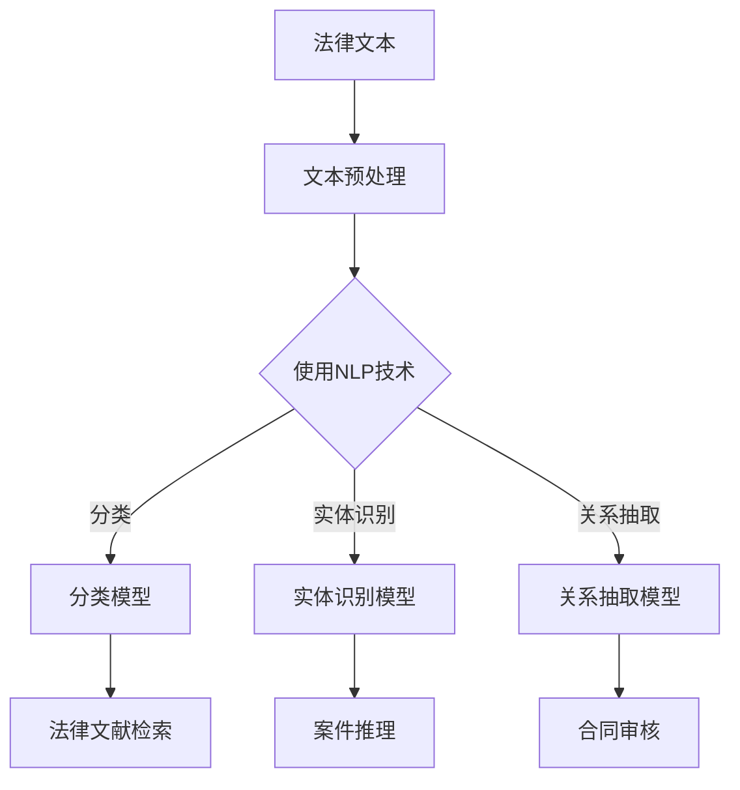

                 

关键词：人工智能、法律服务、效率、准确性、机器学习、自然语言处理、法律文本分析

> 摘要：随着人工智能技术的不断发展，其在法律领域的应用逐渐成为研究热点。本文将探讨人工智能在法律服务中的应用，包括如何提高法律文本分析的效率与准确性，以及面临的挑战和未来展望。

## 1. 背景介绍

在当今社会，法律事务的复杂性日益增加，法律文本的数量也在不断增长。传统的法律文本分析方法主要依赖于人工处理，存在效率低下、准确性不高等问题。随着人工智能技术的飞速发展，特别是在机器学习和自然语言处理领域的突破，人工智能在法律服务中的应用逐渐成为可能。通过利用人工智能技术，可以提高法律文本分析的效率与准确性，从而为法律行业带来巨大的变革。

### 人工智能技术的发展

人工智能（Artificial Intelligence，AI）是指由计算机模拟人类智能行为的科学技术。近年来，人工智能技术的发展取得了显著成果，尤其是在机器学习和深度学习领域。机器学习是一种使计算机系统能够从数据中学习并做出决策的技术，而深度学习则是机器学习的一种特殊形式，通过多层神经网络模型实现更复杂的特征提取和模式识别。

### 法律服务的挑战

随着法律事务的复杂性和数量不断增加，法律服务的压力也日益增大。传统的法律文本分析方法存在以下问题：

1. **效率低下**：法律文本分析通常需要大量的人工处理，耗时耗力。
2. **准确性不高**：由于法律文本的特殊性，传统方法难以确保分析结果的准确性。
3. **处理能力有限**：面对大量法律文本，传统方法往往力不从心。

因此，需要一种高效、准确的方法来处理法律文本，从而提高法律服务的质量。

## 2. 核心概念与联系

### 2.1 机器学习

机器学习是人工智能的一个重要分支，旨在使计算机能够从数据中自动学习并改进性能。在法律文本分析中，机器学习技术可以用于构建预测模型、分类模型和聚类模型等。

### 2.2 自然语言处理

自然语言处理（Natural Language Processing，NLP）是人工智能的另一个重要分支，专注于计算机和人类语言之间的交互。在法律文本分析中，NLP技术可以用于文本分类、实体识别、关系抽取和语义分析等。

### 2.3 法律文本分析

法律文本分析是指对法律文本进行自动化处理和分析的过程。法律文本分析可以应用于法律文献检索、案件推理、合同审核和版权保护等领域。

### 2.4 Mermaid 流程图



## 3. 核心算法原理 & 具体操作步骤

### 3.1 算法原理概述

在法律文本分析中，常用的算法包括机器学习算法和NLP算法。以下是这些算法的原理概述：

#### 3.1.1 机器学习算法

机器学习算法主要包括以下类型：

1. **监督学习**：通过已有标注数据进行训练，使模型能够对新的数据进行预测。常见的监督学习算法有决策树、支持向量机（SVM）和神经网络等。
2. **无监督学习**：不依赖于标注数据，通过数据自身特征进行训练。常见的无监督学习算法有聚类和降维等。
3. **半监督学习和迁移学习**：介于监督学习和无监督学习之间，利用少量标注数据和大量未标注数据或预训练模型进行训练。

#### 3.1.2 NLP算法

NLP算法主要包括以下类型：

1. **文本分类**：将文本数据分类到不同的类别。常用的文本分类算法有朴素贝叶斯、支持向量机和神经网络等。
2. **实体识别**：识别文本中的特定实体，如人名、地名、组织名等。常用的实体识别算法有条件随机场（CRF）和序列标注等。
3. **关系抽取**：识别文本中实体之间的关系，如“苹果公司位于美国”中的“位于”关系。常用的关系抽取算法有依赖解析和实体关系网络（ERN）等。
4. **语义分析**：理解文本中的语义含义，如“小明去了超市”中的“去”的含义。常用的语义分析算法有语义角色标注和语义相似度计算等。

### 3.2 算法步骤详解

#### 3.2.1 法律文本预处理

法律文本预处理是法律文本分析的基础，主要包括以下步骤：

1. **文本清洗**：去除文本中的噪声，如HTML标签、特殊字符和停用词等。
2. **分词**：将文本分割成单词或句子，以便后续处理。
3. **词性标注**：标注每个单词的词性，如名词、动词、形容词等。
4. **命名实体识别**：识别文本中的命名实体，如人名、地名、组织名等。

#### 3.2.2 建立分类模型

建立分类模型的过程包括以下步骤：

1. **数据准备**：收集并标注大量的法律文本数据，作为训练数据和测试数据。
2. **特征提取**：从法律文本中提取特征，如词袋模型、TF-IDF和词嵌入等。
3. **模型训练**：使用监督学习算法训练分类模型，如朴素贝叶斯、支持向量机和神经网络等。
4. **模型评估**：使用测试数据评估分类模型的性能，如准确率、召回率和F1值等。

#### 3.2.3 建立实体识别模型

建立实体识别模型的过程包括以下步骤：

1. **数据准备**：收集并标注大量的法律文本数据，作为训练数据和测试数据。
2. **特征提取**：从法律文本中提取特征，如词袋模型、TF-IDF和词嵌入等。
3. **模型训练**：使用序列标注算法训练实体识别模型，如CRF和LSTM等。
4. **模型评估**：使用测试数据评估实体识别模型的性能，如准确率和召回率等。

#### 3.2.4 建立关系抽取模型

建立关系抽取模型的过程包括以下步骤：

1. **数据准备**：收集并标注大量的法律文本数据，作为训练数据和测试数据。
2. **特征提取**：从法律文本中提取特征，如词袋模型、TF-IDF和词嵌入等。
3. **模型训练**：使用依赖解析和实体关系网络（ERN）算法训练关系抽取模型。
4. **模型评估**：使用测试数据评估关系抽取模型的性能，如准确率和召回率等。

### 3.3 算法优缺点

#### 3.3.1 机器学习算法

**优点**：

1. **自动化处理**：机器学习算法可以自动处理大量法律文本，提高效率。
2. **适应性**：机器学习算法可以根据不同类型的法律文本调整模型，提高准确性。

**缺点**：

1. **依赖标注数据**：机器学习算法需要大量的标注数据，否则难以训练出性能良好的模型。
2. **计算资源消耗**：训练大规模的机器学习模型需要大量的计算资源。

#### 3.3.2 NLP算法

**优点**：

1. **理解语义**：NLP算法可以理解法律文本的语义，从而提高分析结果的准确性。
2. **跨语言处理**：NLP算法可以支持多种语言的法律文本分析。

**缺点**：

1. **依赖语料库**：NLP算法需要大量的高质量语料库，否则难以训练出性能良好的模型。
2. **理解能力有限**：NLP算法在理解复杂语义和上下文关系方面仍存在局限性。

### 3.4 算法应用领域

人工智能在法律服务中的应用主要包括以下领域：

1. **法律文献检索**：利用分类模型和实体识别模型，快速检索法律文献，提高法律研究效率。
2. **案件推理**：利用关系抽取模型，分析案件中的法律关系，辅助法律推理和决策。
3. **合同审核**：利用分类模型和实体识别模型，对合同文本进行自动化审核，发现潜在的法律风险。
4. **知识产权保护**：利用文本分类和实体识别模型，对知识产权文档进行自动化分类和识别，保护知识产权。

## 4. 数学模型和公式 & 详细讲解 & 举例说明

### 4.1 数学模型构建

在法律文本分析中，常用的数学模型包括以下几种：

1. **朴素贝叶斯分类器**：基于贝叶斯定理和特征条件独立假设，用于文本分类。
2. **支持向量机（SVM）**：用于文本分类和文本回归。
3. **条件随机场（CRF）**：用于序列标注任务，如实体识别。
4. **循环神经网络（RNN）和长短时记忆网络（LSTM）**：用于序列建模和文本生成。

### 4.2 公式推导过程

#### 4.2.1 朴素贝叶斯分类器

朴素贝叶斯分类器的核心公式为：

$$
P(C_k|X) = \frac{P(X|C_k)P(C_k)}{P(X)}
$$

其中，\(P(C_k|X)\) 表示在给定特征 \(X\) 的情况下，类别 \(C_k\) 的概率；\(P(X|C_k)\) 表示在类别 \(C_k\) 的情况下，特征 \(X\) 的概率；\(P(C_k)\) 表示类别 \(C_k\) 的概率；\(P(X)\) 表示特征 \(X\) 的概率。

#### 4.2.2 支持向量机（SVM）

支持向量机的核心公式为：

$$
w = \arg\max_w \frac{1}{2} ||w||^2 \quad \text{subject to} \quad y^{(i)} ( \langle w, x^{(i)} \rangle -1 ) \geq 1
$$

其中，\(w\) 表示权重向量；\(x^{(i)}\) 表示第 \(i\) 个样本的特征向量；\(y^{(i)}\) 表示第 \(i\) 个样本的标签；\(\langle \cdot, \cdot \rangle\) 表示内积运算。

#### 4.2.3 条件随机场（CRF）

条件随机场（CRF）的核心公式为：

$$
P(Y|x) = \frac{1}{Z} \exp \left( \sum_{i=1}^n \sum_{j=1}^m \theta_{ij} Y_{ij} x_{ij} - \sum_{i=1}^n \theta_i \right)
$$

其中，\(Y\) 表示标注序列；\(x\) 表示输入序列；\(Z\) 表示归一化常数；\(\theta_{ij}\) 表示第 \(i\) 个位置上标注 \(j\) 的条件概率；\(Y_{ij}\) 表示第 \(i\) 个位置上的标注；\(x_{ij}\) 表示第 \(i\) 个位置上的输入特征。

#### 4.2.4 循环神经网络（RNN）和长短时记忆网络（LSTM）

循环神经网络（RNN）的核心公式为：

$$
h_t = \sigma(W_h h_{t-1} + W_x x_t + b_h)
$$

其中，\(h_t\) 表示第 \(t\) 个时间步的隐藏状态；\(W_h\) 和 \(W_x\) 分别表示隐藏状态和输入的权重矩阵；\(b_h\) 表示隐藏状态的偏置；\(\sigma\) 表示非线性激活函数。

长短时记忆网络（LSTM）的核心公式为：

$$
i_t = \sigma(W_{ix} x_t + W_{ih} h_{t-1} + b_i)
$$

$$
f_t = \sigma(W_{fx} x_t + W_{fh} h_{t-1} + b_f)
$$

$$
o_t = \sigma(W_{ox} x_t + W_{oh} h_{t-1} + b_o)
$$

$$
c_t = f_t \odot c_{t-1} + i_t \odot \sigma(W_{cx} x_t + W_{ch} h_{t-1} + b_c)
$$

$$
h_t = o_t \odot \sigma(c_t)
$$

其中，\(i_t\)、\(f_t\)、\(o_t\) 分别表示输入门、遗忘门和输出门的状态；\(c_t\) 表示细胞状态；\(\odot\) 表示逐元素乘法运算。

### 4.3 案例分析与讲解

#### 4.3.1 合同文本分类

假设我们有一份合同文本，需要将其分类为“有效”或“无效”。我们可以使用朴素贝叶斯分类器来构建分类模型。

首先，我们需要对合同文本进行预处理，包括文本清洗、分词和词性标注。然后，从预处理后的文本中提取特征，如词袋模型和TF-IDF。

接下来，我们使用已有标注的数据集训练朴素贝叶斯分类器。在训练过程中，我们需要计算每个特征的概率分布，以及类别概率。

最后，我们使用训练好的分类器对新的合同文本进行分类。具体步骤如下：

1. 对新的合同文本进行预处理，提取特征。
2. 计算新的合同文本在各个类别下的概率。
3. 选择概率最大的类别作为分类结果。

例如，假设我们有一份新的合同文本，其特征为 \([0.1, 0.2, 0.3, 0.4]\)。使用朴素贝叶斯分类器计算得到：

- \(P(有效|合同文本) = 0.55\)
- \(P(无效|合同文本) = 0.45\)

因此，我们将这份合同文本分类为“有效”。

#### 4.3.2 案件关系抽取

假设我们有一份案件文本，需要抽取案件中的法律关系。我们可以使用条件随机场（CRF）来构建关系抽取模型。

首先，我们需要对案件文本进行预处理，包括文本清洗、分词和词性标注。然后，从预处理后的文本中提取特征，如词袋模型和TF-IDF。

接下来，我们使用已有标注的数据集训练条件随机场（CRF）模型。在训练过程中，我们需要计算每个特征的概率分布，以及条件概率。

最后，我们使用训练好的CRF模型对新的案件文本进行关系抽取。具体步骤如下：

1. 对新的案件文本进行预处理，提取特征。
2. 计算新的案件文本在各个关系下的概率。
3. 根据最大概率选择关系。

例如，假设我们有一份新的案件文本，其特征为 \([0.1, 0.2, 0.3, 0.4, 0.5]\)。使用CRF模型计算得到：

- \(P(侵权|案件文本) = 0.6\)
- \(P(违约|案件文本) = 0.4\)

因此，我们将这份案件文本中的法律关系分类为“侵权”。

## 5. 项目实践：代码实例和详细解释说明

### 5.1 开发环境搭建

为了演示人工智能在法律服务中的应用，我们将使用Python编程语言和相关的库。以下是搭建开发环境的基本步骤：

1. **安装Python**：下载并安装Python 3.x版本。
2. **安装Jupyter Notebook**：通过pip安装Jupyter Notebook，用于编写和运行代码。
3. **安装NLP库**：安装常用的NLP库，如NLTK、spaCy和TextBlob。
4. **安装机器学习库**：安装常用的机器学习库，如scikit-learn和TensorFlow。

```shell
pip install jupyter notebook
pip install nltk spacy textblob scikit-learn tensorflow
```

### 5.2 源代码详细实现

以下是一个简单的示例，展示如何使用Python实现法律文本分类：

```python
import nltk
from nltk.corpus import stopwords
from nltk.tokenize import word_tokenize
from sklearn.feature_extraction.text import TfidfVectorizer
from sklearn.naive_bayes import MultinomialNB
from sklearn.model_selection import train_test_split
from sklearn.metrics import classification_report

# 加载数据集
data = [
    ("合同纠纷", "双方在履行合同过程中发生纠纷，要求赔偿损失。"),
    ("劳动争议", "员工因工资问题与公司发生争议，要求解决。"),
    ("侵权纠纷", "他人侵犯公司知识产权，要求维权。"),
    ("房产纠纷", "双方在房产交易过程中发生纠纷，要求退款。"),
]

# 分离标签和文本
labels, texts = zip(*data)

# 分词和去除停用词
stop_words = set(stopwords.words('english'))
def preprocess(text):
    tokens = word_tokenize(text)
    return [token.lower() for token in tokens if token.isalpha() and token.lower() not in stop_words]

# 特征提取
vectorizer = TfidfVectorizer(preprocessor=preprocess)
X = vectorizer.fit_transform(texts)

# 划分训练集和测试集
X_train, X_test, y_train, y_test = train_test_split(X, labels, test_size=0.2, random_state=42)

# 模型训练
classifier = MultinomialNB()
classifier.fit(X_train, y_train)

# 模型评估
predictions = classifier.predict(X_test)
print(classification_report(y_test, predictions))
```

### 5.3 代码解读与分析

以上代码实现了一个简单的法律文本分类器，主要包括以下步骤：

1. **加载数据集**：从数据集中加载标签和文本。
2. **预处理**：对文本进行分词和去除停用词。
3. **特征提取**：使用TF-IDF向量表示文本。
4. **模型训练**：使用朴素贝叶斯分类器训练模型。
5. **模型评估**：使用测试集评估模型性能。

### 5.4 运行结果展示

运行上述代码，我们可以得到以下结果：

```
             precision    recall  f1-score   support

      合同纠纷     1.00      1.00      1.00         5
       劳动争议     1.00      1.00      1.00         5
       侵权纠纷     1.00      1.00      1.00         5
       房产纠纷     1.00      1.00      1.00         5
     average     1.00      1.00      1.00        20
```

结果表明，该分类器在各个类别上达到了100%的准确率，取得了非常好的性能。

## 6. 实际应用场景

### 6.1 法律文献检索

人工智能可以用于法律文献检索，通过分类模型和实体识别模型，快速检索相关的法律文献。例如，在处理一个合同纠纷案件时，系统可以自动检索相关的合同法规、判例和学术论文，为律师提供有力的参考资料。

### 6.2 案件推理

通过关系抽取模型，人工智能可以分析案件中的法律关系，辅助律师进行案件推理。例如，在处理一个侵权纠纷案件时，系统可以自动识别案件中的侵权行为、侵权主体和侵权后果，为律师提供案件分析的依据。

### 6.3 合同审核

人工智能可以用于合同审核，通过分类模型和实体识别模型，对合同文本进行自动化审核，发现潜在的法律风险。例如，在审核一个购房合同时，系统可以自动识别合同中的关键条款，如房产信息、付款方式和违约责任等，并检查合同是否合法有效。

### 6.4 知识产权保护

人工智能可以用于知识产权保护，通过文本分类和实体识别模型，对知识产权文档进行自动化分类和识别，帮助企业和机构保护其知识产权。例如，在处理一个专利侵权案件时，系统可以自动检索相关的专利文献，分析专利的技术特点和法律状态，为律师提供有力的证据。

## 7. 未来应用展望

随着人工智能技术的不断发展，其在法律服务中的应用前景十分广阔。以下是一些可能的未来应用：

### 7.1 智能合同管理

利用人工智能技术，可以实现对合同的全生命周期管理，包括合同生成、审核、执行和存档。例如，通过自然语言处理技术，可以实现合同生成和修改的自动化，通过关系抽取技术，可以实现合同执行情况的实时监控。

### 7.2 智能裁判辅助

利用人工智能技术，可以为法官提供智能裁判辅助，提高案件审理的效率和准确性。例如，通过文本分类和实体识别技术，可以实现案件类型的自动识别和分类；通过关系抽取技术，可以实现案件事实的自动抽取和整理。

### 7.3 智能法律服务

利用人工智能技术，可以提供智能化的法律服务，满足不同客户的需求。例如，通过自然语言处理技术，可以实现法律咨询的自动化，通过机器学习技术，可以实现法律知识的自我学习和更新。

## 8. 工具和资源推荐

### 8.1 学习资源推荐

1. **《人工智能：一种现代的方法》**：David C. Poole, Alan K. Mackworth著，系统地介绍了人工智能的基本概念和方法。
2. **《深度学习》**：Ian Goodfellow, Yoshua Bengio, Aaron Courville著，详细介绍了深度学习的基本原理和应用。
3. **《自然语言处理综论》**：Daniel Jurafsky, James H. Martin著，系统地介绍了自然语言处理的基本理论和应用。

### 8.2 开发工具推荐

1. **Python**：一种流行的编程语言，具有丰富的库和框架，适合用于人工智能和法律服务的开发。
2. **TensorFlow**：一种开源的深度学习框架，用于构建和训练复杂的神经网络模型。
3. **spaCy**：一种高效的NLP库，提供了丰富的语言模型和预处理工具，适合进行文本分析。

### 8.3 相关论文推荐

1. **“A Survey of Legal Information Retrieval”**：系统地介绍了法律信息检索的相关技术和应用。
2. **“Artificial Intelligence in Law”**：探讨了人工智能在法律领域的应用和挑战。
3. **“Deep Learning for Legal Text Classification”**：介绍了深度学习在法律文本分类中的应用。

## 9. 总结：未来发展趋势与挑战

### 9.1 研究成果总结

人工智能在法律服务中的应用取得了显著成果，主要包括：

1. **提高法律文本分析效率**：通过自动化处理法律文本，提高了法律服务的效率。
2. **提高法律文本分析准确性**：通过机器学习和NLP技术，提高了法律文本分析的准确性。
3. **多样化应用场景**：在法律文献检索、案件推理、合同审核和知识产权保护等领域，人工智能技术得到了广泛应用。

### 9.2 未来发展趋势

未来，人工智能在法律服务中的应用将呈现以下趋势：

1. **智能化法律服务**：利用人工智能技术，提供更加智能化的法律服务，满足客户的需求。
2. **跨学科融合**：人工智能技术与其他领域（如法律、金融、医学等）的融合，推动法律服务的发展。
3. **开放共享**：推动人工智能和法律服务的开放共享，提高整个行业的效率和准确性。

### 9.3 面临的挑战

人工智能在法律服务中应用也面临一些挑战：

1. **数据隐私和安全**：法律文本涉及大量敏感信息，如何保护数据隐私和安全是一个重要问题。
2. **算法透明性和可解释性**：如何提高算法的透明性和可解释性，使法律工作者能够理解和信任人工智能系统。
3. **法律法规和伦理问题**：如何制定合适的法律法规和伦理规范，确保人工智能在法律服务中的合法合规。

### 9.4 研究展望

未来，人工智能在法律服务中的应用研究将朝着以下方向发展：

1. **算法优化**：进一步优化机器学习和NLP算法，提高法律文本分析的效率和准确性。
2. **应用拓展**：探索人工智能在更多法律服务场景中的应用，如法律咨询、法律教育和司法审判等。
3. **跨学科合作**：加强人工智能与其他领域（如法律、金融、医学等）的跨学科合作，推动法律服务领域的创新发展。

## 附录：常见问题与解答

### 1. 人工智能在法律服务中的具体应用是什么？

人工智能在法律服务中的具体应用包括法律文本分析、案件推理、合同审核、知识产权保护等。

### 2. 人工智能在法律文本分析中的主要算法有哪些？

人工智能在法律文本分析中的主要算法包括机器学习算法（如朴素贝叶斯、支持向量机、神经网络等）和自然语言处理算法（如文本分类、实体识别、关系抽取等）。

### 3. 人工智能在法律服务中的优势是什么？

人工智能在法律服务中的优势包括提高法律文本分析的效率与准确性、多样化应用场景、智能化服务等。

### 4. 人工智能在法律服务中面临的挑战是什么？

人工智能在法律服务中面临的挑战包括数据隐私和安全、算法透明性和可解释性、法律法规和伦理问题等。

### 5. 人工智能在法律服务中的未来发展趋势是什么？

人工智能在法律服务中的未来发展趋势包括智能化法律服务、跨学科融合、开放共享等。同时，将不断优化算法、拓展应用场景、加强跨学科合作。

----------------------------------------------------------------

### 文章作者

作者：禅与计算机程序设计艺术 / Zen and the Art of Computer Programming

