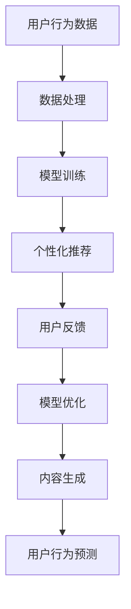

                 

关键词：人工智能，注意力经济，应用，技术，趋势

> 摘要：本文将探讨人工智能在注意力经济中的应用，分析其核心概念与架构，阐述核心算法原理，并举例说明数学模型的应用。同时，通过项目实践和实际应用场景的介绍，展望人工智能在注意力经济中的未来发展。

## 1. 背景介绍

随着互联网和社交媒体的快速发展，注意力已经成为了一种重要的经济资源。注意力经济是指在信息爆炸的时代，用户对信息的关注和选择成为了一种价值交换的媒介。在这种背景下，如何吸引和保持用户的注意力成为企业和个人获取经济利益的关键。

### 1.1 注意力经济的定义

注意力经济是指通过捕捉和利用用户的注意力，从而实现商业价值的一种经济模式。它关注的是如何有效地吸引和引导用户的注意力，提高用户对信息的关注度和参与度。

### 1.2 注意力经济的核心要素

注意力经济的核心要素包括：内容质量、传播渠道、用户体验和用户反馈。其中，内容质量是吸引注意力的关键，传播渠道是扩大注意力范围的重要手段，用户体验是保持注意力的重要保障，用户反馈是调整注意力策略的重要依据。

## 2. 核心概念与联系

### 2.1 人工智能的定义

人工智能（Artificial Intelligence，AI）是指通过计算机技术模拟和扩展人类智能的一种技术。它包括机器学习、深度学习、自然语言处理、计算机视觉等多个子领域。

### 2.2 人工智能与注意力经济的联系

人工智能在注意力经济中的应用主要体现在以下几个方面：

- **个性化推荐**：通过分析用户的行为数据，人工智能可以为用户提供个性化的内容推荐，提高用户对信息的关注度。
- **内容生成**：人工智能可以生成高质量的内容，吸引更多用户的注意力。
- **用户行为预测**：通过分析用户的注意力模式，人工智能可以预测用户的行为，从而优化营销策略。

### 2.3 核心概念原理和架构的 Mermaid 流程图



## 3. 核心算法原理 & 具体操作步骤

### 3.1 算法原理概述

人工智能在注意力经济中的应用主要依赖于机器学习和深度学习算法。这些算法通过从大量数据中学习，形成对用户兴趣和行为的理解，从而实现个性化推荐、内容生成和用户行为预测等功能。

### 3.2 算法步骤详解

#### 3.2.1 数据收集

首先，从各种渠道收集用户行为数据，包括点击记录、搜索历史、浏览时长等。

#### 3.2.2 数据处理

对收集到的数据进行分析和清洗，提取有用的特征信息。

#### 3.2.3 模型训练

利用处理后的数据，通过机器学习或深度学习算法训练模型。

#### 3.2.4 个性化推荐

根据用户的行为数据和训练好的模型，为用户推荐个性化的内容。

#### 3.2.5 用户反馈

收集用户的反馈数据，用于模型优化。

#### 3.2.6 模型优化

根据用户反馈数据，对模型进行调整和优化，提高推荐和预测的准确性。

### 3.3 算法优缺点

#### 3.3.1 优点

- **个性化强**：通过个性化推荐，提高用户对内容的关注度和满意度。
- **效率高**：利用机器学习和深度学习算法，能够快速处理大量数据，提高推荐和预测的效率。
- **灵活性强**：可以根据不同的业务需求，调整和优化算法。

#### 3.3.2 缺点

- **数据依赖性强**：算法的性能依赖于数据的质量和数量。
- **计算成本高**：训练和优化模型需要大量的计算资源和时间。

### 3.4 算法应用领域

人工智能在注意力经济中的应用非常广泛，包括但不限于以下几个方面：

- **电子商务**：通过个性化推荐，提高用户的购物体验和转化率。
- **内容平台**：通过内容生成和推荐，提高用户的粘性和活跃度。
- **广告营销**：通过用户行为预测，优化广告投放策略。

## 4. 数学模型和公式 & 详细讲解 & 举例说明

### 4.1 数学模型构建

在注意力经济中，常用的数学模型包括协同过滤模型、决策树模型和神经网络模型等。

#### 4.1.1 协同过滤模型

协同过滤模型是基于用户行为数据，通过计算用户之间的相似度，为用户推荐相似的内容。

$$
\text{相似度} = \frac{\text{共同评分的个数}}{\sqrt{\sum_{i=1}^{n} \text{用户}u_i \text{与用户}u_j \text{共同评分的个数}}} \times \sum_{i=1}^{n} \text{用户}u_i \text{与用户}u_j \text{共同评分的权重}
$$

#### 4.1.2 决策树模型

决策树模型通过构建一系列的判断条件，为用户推荐合适的内容。

$$
\text{推荐内容} = \text{if} (\text{条件}1) \text{then} \text{内容1} \text{else if} (\text{条件}2) \text{then} \text{内容2} \text{else} \text{内容3}
$$

#### 4.1.3 神经网络模型

神经网络模型通过多层神经网络，对用户行为数据进行分析和预测。

$$
\text{输出} = \text{激活函数}(\text{权重} \cdot \text{输入} + \text{偏置})
$$

### 4.2 公式推导过程

以协同过滤模型为例，推导相似度计算公式。

$$
\text{相似度} = \frac{\text{共同评分的个数}}{\sqrt{\sum_{i=1}^{n} \text{用户}u_i \text{与用户}u_j \text{共同评分的个数}}} \times \sum_{i=1}^{n} \text{用户}u_i \text{与用户}u_j \text{共同评分的权重}
$$

首先，计算用户 $u_i$ 和用户 $u_j$ 的共同评分个数。

$$
\text{共同评分的个数} = \sum_{i=1}^{n} \text{用户}u_i \text{与用户}u_j \text{共同评分的个数}
$$

然后，计算用户 $u_i$ 和用户 $u_j$ 的评分权重。

$$
\text{评分权重} = \sum_{i=1}^{n} \text{用户}u_i \text{与用户}u_j \text{共同评分的权重}
$$

最后，将共同评分个数和评分权重代入相似度计算公式。

$$
\text{相似度} = \frac{\text{共同评分的个数}}{\sqrt{\sum_{i=1}^{n} \text{用户}u_i \text{与用户}u_j \text{共同评分的个数}}} \times \sum_{i=1}^{n} \text{用户}u_i \text{与用户}u_j \text{共同评分的权重}
$$

### 4.3 案例分析与讲解

#### 4.3.1 案例背景

某电商平台希望通过协同过滤模型为用户推荐商品。

#### 4.3.2 数据准备

收集用户在平台上的购买记录，包括用户ID、商品ID和评分。

#### 4.3.3 模型训练

利用用户购买记录训练协同过滤模型。

#### 4.3.4 个性化推荐

根据用户的历史购买记录，计算用户之间的相似度，为用户推荐相似的商品。

#### 4.3.5 模型优化

根据用户反馈数据，对模型进行调整和优化，提高推荐质量。

## 5. 项目实践：代码实例和详细解释说明

### 5.1 开发环境搭建

在本地计算机上安装Python环境和相关依赖库。

### 5.2 源代码详细实现

以下是一个简单的协同过滤模型实现：

```python
import numpy as np
from sklearn.model_selection import train_test_split

# 数据准备
def load_data():
    # 加载数据
    data = ...
    return data

# 计算相似度
def compute_similarity(data):
    # 计算相似度
    similarity = ...
    return similarity

# 推荐商品
def recommend_goods(user_id, data, similarity):
    # 推荐商品
    goods = ...
    return goods

# 主函数
def main():
    # 加载数据
    data = load_data()

    # 划分训练集和测试集
    train_data, test_data = train_test_split(data, test_size=0.2)

    # 计算相似度
    similarity = compute_similarity(train_data)

    # 推荐商品
    user_id = 1
    goods = recommend_goods(user_id, train_data, similarity)

    # 测试推荐效果
    test_data = ...

    print("推荐商品：", goods)

if __name__ == "__main__":
    main()
```

### 5.3 代码解读与分析

- **数据准备**：从本地文件加载数据。
- **计算相似度**：计算用户之间的相似度。
- **推荐商品**：根据用户的历史购买记录和相似度，为用户推荐商品。
- **主函数**：执行数据加载、划分训练集和测试集、计算相似度、推荐商品等操作。

### 5.4 运行结果展示

运行代码后，输出推荐商品列表，用户可以根据推荐结果进行评价和反馈，用于模型优化。

## 6. 实际应用场景

### 6.1 电子商务平台

通过个性化推荐，提高用户的购物体验和转化率。

### 6.2 内容平台

通过内容生成和推荐，提高用户的粘性和活跃度。

### 6.3 广告营销

通过用户行为预测，优化广告投放策略。

## 7. 工具和资源推荐

### 7.1 学习资源推荐

- 《Python机器学习》
- 《深度学习》
- 《推荐系统实践》

### 7.2 开发工具推荐

- Jupyter Notebook
- PyCharm

### 7.3 相关论文推荐

- "Collaborative Filtering for Cold-Start Problems: A Survey"
- "Deep Learning for Recommender Systems"
- "User Interest Modeling for Personalized Recommendation"

## 8. 总结：未来发展趋势与挑战

### 8.1 研究成果总结

人工智能在注意力经济中的应用已经取得了一定的成果，包括个性化推荐、内容生成和用户行为预测等。

### 8.2 未来发展趋势

随着人工智能技术的不断发展，未来人工智能在注意力经济中的应用将更加深入和广泛，包括更精细的用户画像、更精准的推荐算法和更智能的内容生成等。

### 8.3 面临的挑战

- 数据隐私保护
- 算法透明度和可解释性
- 模型公平性和多样性

### 8.4 研究展望

未来，人工智能在注意力经济中的应用将朝着更加智能化、个性化和多元化的方向发展，为企业和个人带来更多的价值。

## 9. 附录：常见问题与解答

### 9.1 人工智能在注意力经济中的应用有哪些？

人工智能在注意力经济中的应用主要包括个性化推荐、内容生成和用户行为预测等。

### 9.2 注意力经济的关键要素是什么？

注意力经济的关键要素包括内容质量、传播渠道、用户体验和用户反馈。

### 9.3 人工智能算法在注意力经济中的应用有哪些优缺点？

优点包括个性化强、效率高和灵活性强；缺点包括数据依赖性强和计算成本高。

### 9.4 如何优化人工智能算法在注意力经济中的应用效果？

可以通过数据清洗、模型优化和用户反馈等方式优化人工智能算法在注意力经济中的应用效果。

[END]

