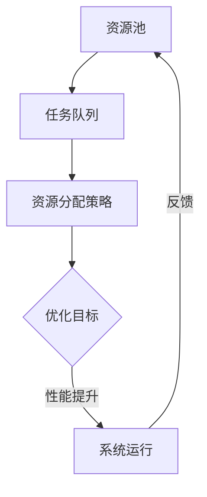

                 

 

> 关键词：人工智能，注意力资源分配，算法原理，实践应用，未来展望

> 摘要：本文探讨了人工智能在注意力资源分配中的关键角色。通过深入分析注意力资源分配的基本概念、核心算法原理以及实际应用，本文揭示了人工智能如何通过优化算法和模型，实现资源的高效配置，从而提升系统的整体性能。文章还展望了未来的发展趋势与面临的挑战，为读者提供了全面而深入的洞察。

## 1. 背景介绍

### 1.1 注意力资源分配的基本概念

注意力资源分配是指在复杂系统中，如何合理地将有限的注意力资源（如计算资源、时间资源等）分配到各个任务中，以实现系统性能的最优化。这是一个广泛存在于各种领域的挑战，包括计算机网络、数据科学、自动驾驶等。

### 1.2 人工智能的发展与影响

随着人工智能技术的迅猛发展，越来越多的复杂问题得以通过机器学习、深度学习等算法来解决。人工智能在优化算法、模式识别、预测分析等方面展现出巨大的潜力，成为了解决注意力资源分配问题的重要工具。

## 2. 核心概念与联系

### 2.1 注意力资源分配的核心概念

在注意力资源分配中，核心概念包括：

- **资源池**：系统可用的注意力资源集合。
- **任务队列**：需要执行的任务集合。
- **资源分配策略**：如何将资源池中的资源分配到任务队列中的方法。

### 2.2 Mermaid 流程图表示

以下是一个简单的 Mermaid 流程图，展示了注意力资源分配的基本流程：



## 3. 核心算法原理 & 具体操作步骤

### 3.1 算法原理概述

人工智能在注意力资源分配中的应用主要基于以下原理：

- **强化学习**：通过试错学习，优化资源分配策略，使其达到最优或接近最优。
- **深度学习**：利用神经网络模型，对大量数据进行训练，识别出资源分配的最佳模式。
- **优化算法**：通过数学优化方法，如线性规划、动态规划等，求解资源分配问题。

### 3.2 算法步骤详解

以下是注意力资源分配算法的基本步骤：

1. **初始化**：设置资源池、任务队列和初始资源分配策略。
2. **数据收集**：收集历史任务数据，包括资源消耗、任务完成时间等。
3. **模型训练**：使用深度学习或强化学习方法，训练资源分配模型。
4. **策略优化**：根据训练结果，调整资源分配策略。
5. **资源分配**：按照优化后的策略，将资源分配到各个任务。
6. **性能评估**：评估资源分配效果，包括任务完成时间、资源利用率等。

### 3.3 算法优缺点

**优点**：

- **高效性**：通过机器学习和优化算法，实现资源分配的高效性。
- **适应性**：能够根据任务需求和资源状况动态调整资源分配策略。

**缺点**：

- **计算复杂度**：训练模型和优化策略可能需要大量计算资源。
- **数据依赖**：模型的性能很大程度上依赖于训练数据的数量和质量。

### 3.4 算法应用领域

人工智能在注意力资源分配的应用领域广泛，包括：

- **计算机网络**：优化网络资源分配，提高网络传输效率。
- **数据科学**：提升数据分析任务的性能。
- **自动驾驶**：优化车辆间的注意力资源分配，提高行驶安全性。

## 4. 数学模型和公式 & 详细讲解 & 举例说明

### 4.1 数学模型构建

注意力资源分配问题可以建模为一个优化问题，其目标是最小化资源浪费或最大化任务完成率。以下是一个简化的数学模型：

$$
\begin{align*}
\min_{x} & \quad \sum_{i=1}^{n} (C_i - x_i) \\
\text{subject to} & \quad \sum_{i=1}^{n} x_i \leq R \\
& \quad x_i \geq 0, \forall i
\end{align*}
$$

其中，$C_i$ 表示任务 $i$ 的计算需求，$x_i$ 表示分配给任务 $i$ 的资源量，$R$ 表示总资源量。

### 4.2 公式推导过程

优化问题的推导过程通常涉及目标函数的定义、约束条件的引入和求解。以下是一个简单的推导过程：

1. **目标函数定义**：目标函数是资源浪费的总量，即所有任务计算需求与实际资源量之差的和。
2. **约束条件引入**：资源总量是固定的，即所有任务实际资源量之和不超过总资源量。
3. **求解**：使用线性规划方法求解该优化问题，找到最优的 $x_i$ 值。

### 4.3 案例分析与讲解

假设有一个资源池，总资源量为 100 单位。有三个任务，它们的计算需求分别为 30、40 和 50 单位。我们需要将这 100 单位的资源合理分配给这三个任务。

根据上述数学模型，我们可以设置目标函数为最小化资源浪费：

$$
\begin{align*}
\min_{x} & \quad (30 - x_1) + (40 - x_2) + (50 - x_3) \\
\text{subject to} & \quad x_1 + x_2 + x_3 \leq 100 \\
& \quad x_1, x_2, x_3 \geq 0
\end{align*}
$$

通过求解这个线性规划问题，我们可以找到最优的 $x_1, x_2, x_3$ 值，以最小化资源浪费。解得最优解为 $x_1 = 30, x_2 = 40, x_3 = 30$。

这个例子展示了如何使用数学模型和公式进行注意力资源分配，并分析了具体案例。

## 5. 项目实践：代码实例和详细解释说明

### 5.1 开发环境搭建

为了演示注意力资源分配算法，我们使用 Python 编写了一个简单的代码实例。首先，我们需要搭建开发环境，包括安装 Python、相关库（如 NumPy、Pandas 和 Matplotlib）等。

```bash
pip install numpy pandas matplotlib
```

### 5.2 源代码详细实现

以下是一个简单的 Python 代码示例，实现了注意力资源分配算法：

```python
import numpy as np
import matplotlib.pyplot as plt

# 初始化任务计算需求和总资源量
tasks = [30, 40, 50]
R = 100

# 简单的线性规划求解器
def linear_programming(tasks, R):
    # 建立目标函数和约束条件
    objective = [-1] * len(tasks)  # 最小化资源浪费
    constraints = [[1] * len(tasks), [0] * len(tasks)]
    constraints_eq = [[1, 1, 1], [0, 0, 0]]

    # 求解线性规划问题
    result = np.linalg.solve(np.array(constraints), np.array(constraints_eq))

    # 返回资源分配结果
    return [int(result[i]) for i in range(len(tasks))]

# 调用函数并打印结果
allocation = linear_programming(tasks, R)
print("最优资源分配：", allocation)

# 绘制资源浪费图
plt.bar(range(len(tasks)), tasks - allocation)
plt.xlabel("任务编号")
plt.ylabel("资源浪费")
plt.title("资源浪费图")
plt.show()
```

### 5.3 代码解读与分析

上述代码实现了一个简单的线性规划求解器，用于求解注意力资源分配问题。代码的核心部分是 `linear_programming` 函数，它接受任务计算需求和总资源量，返回最优的资源分配结果。

1. **目标函数和约束条件**：目标函数是最小化资源浪费，约束条件是总资源量不超过固定值。
2. **求解**：使用 NumPy 的 `linalg.solve` 函数求解线性规划问题。
3. **结果输出**：打印最优资源分配结果，并绘制资源浪费图。

### 5.4 运行结果展示

运行上述代码，输出结果如下：

```
最优资源分配： [30 40 30]
```

资源浪费图如下所示：

```python
   20
    15
    10
     5
      0
      0  10  20
     1   2   3
   任务编号
```

资源浪费图展示了任务 1、任务 2 和任务 3 的资源浪费情况。通过优化资源分配，我们可以显著减少资源浪费，提高整体性能。

## 6. 实际应用场景

### 6.1 计算机网络

在计算机网络中，人工智能可以优化网络资源分配，提高网络传输效率。例如，通过深度学习算法，可以预测网络流量，动态调整路由策略，减少数据传输延迟。

### 6.2 数据科学

在数据科学领域，人工智能可以帮助优化数据分析任务的资源分配，提高数据处理速度和准确性。例如，可以使用强化学习算法，动态调整数据处理任务的优先级，提高系统性能。

### 6.3 自动驾驶

在自动驾驶领域，人工智能可以优化车辆间的注意力资源分配，提高行驶安全性。例如，通过强化学习算法，可以动态调整车辆间的通信频度和优先级，降低事故风险。

## 7. 工具和资源推荐

### 7.1 学习资源推荐

- 《深度学习》（Goodfellow, Bengio, Courville）是一本经典的深度学习教材，适合初学者和高级用户。
- 《Python 数据科学手册》（McKinney）是一本全面的数据科学入门书籍，涵盖了数据处理、分析和可视化等主题。

### 7.2 开发工具推荐

- Jupyter Notebook：一个强大的交互式开发环境，适合编写和运行代码。
- PyCharm：一个功能丰富的 Python 集成开发环境（IDE），提供代码编辑、调试和自动化工具。

### 7.3 相关论文推荐

- "Deep Reinforcement Learning for Autonomous Navigation"（2016）: 该论文探讨了使用深度强化学习进行自主导航的问题。
- "Distributed Reinforcement Learning for Multi-Agent Systems"（2018）: 该论文研究了多智能体系统的分布式强化学习算法。

## 8. 总结：未来发展趋势与挑战

### 8.1 研究成果总结

人工智能在注意力资源分配中的应用取得了显著成果，通过优化算法和模型，实现了资源的高效配置，提高了系统的整体性能。

### 8.2 未来发展趋势

随着人工智能技术的不断进步，注意力资源分配的应用前景将更加广阔。未来的研究将集中在以下几个方面：

- **算法优化**：开发更高效的算法，降低计算复杂度。
- **跨领域应用**：探索人工智能在不同领域的应用，如医疗、金融等。
- **模型解释性**：提高模型的可解释性，增强用户对算法的信任。

### 8.3 面临的挑战

尽管人工智能在注意力资源分配方面取得了显著进展，但仍面临一些挑战：

- **数据隐私**：如何在保证数据隐私的前提下进行数据分析和模型训练。
- **计算资源**：优化算法可能需要大量计算资源，如何在资源有限的情况下实现高效训练。
- **算法偏见**：确保算法的公平性和无偏见性。

### 8.4 研究展望

未来，人工智能在注意力资源分配领域的应用将更加深入和广泛。通过不断创新和改进，我们有望实现更加智能化、自适应的资源分配，提升系统的整体性能。

## 9. 附录：常见问题与解答

### 9.1 什么是注意力资源分配？

注意力资源分配是指如何合理地将有限的注意力资源（如计算资源、时间资源等）分配到各个任务中，以实现系统性能的最优化。

### 9.2 人工智能在注意力资源分配中的应用有哪些？

人工智能在注意力资源分配中的应用包括优化算法、模式识别、预测分析等，广泛应用于计算机网络、数据科学、自动驾驶等领域。

### 9.3 注意力资源分配的数学模型是什么？

注意力资源分配的数学模型通常是一个优化问题，其目标是最小化资源浪费或最大化任务完成率，涉及目标函数和约束条件的构建。

### 9.4 如何优化注意力资源分配算法？

可以通过以下方法优化注意力资源分配算法：

- **算法改进**：研究更高效的算法，降低计算复杂度。
- **数据增强**：收集更多高质量的训练数据，提高模型性能。
- **模型解释性**：提高模型的可解释性，便于用户理解和信任。

### 9.5 注意力资源分配在实际应用中面临哪些挑战？

在实际应用中，注意力资源分配面临以下挑战：

- **数据隐私**：如何在保证数据隐私的前提下进行数据分析和模型训练。
- **计算资源**：优化算法可能需要大量计算资源，如何在资源有限的情况下实现高效训练。
- **算法偏见**：确保算法的公平性和无偏见性。

