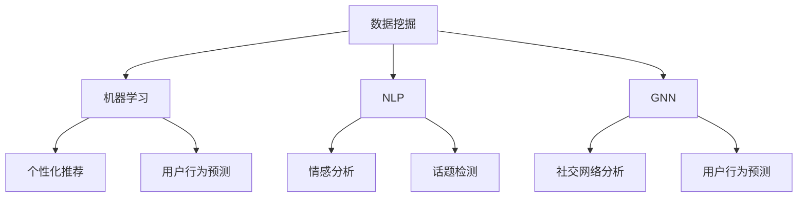

                 

社交媒体和营销是现代商业环境中不可或缺的组成部分，它们相互交织，共同塑造了信息传播和商业决策的方式。随着人工智能（AI）技术的快速发展，AI在社交媒体和营销中的应用越来越受到关注。本文将探讨AI在社交媒体和营销中的核心概念、算法原理、数学模型、实践案例以及未来的发展趋势。

## 关键词

- 人工智能
- 社交媒体
- 营销
- 数据分析
- 自然语言处理
- 图神经网络

## 摘要

本文旨在深入探讨人工智能在社交媒体和营销领域的应用。首先，我们将介绍AI在社交媒体和营销中的核心概念和联系，然后详细解释AI的核心算法原理和操作步骤。接着，我们将探讨数学模型和公式的构建，并结合案例进行分析。文章还将提供实际的项目实践，展示代码实例和运行结果。最后，我们将讨论AI在社交媒体和营销中的实际应用场景，并提出未来发展的展望和面临的挑战。

## 1. 背景介绍

社交媒体和营销是现代商业环境中的重要组成部分。社交媒体平台如Facebook、Twitter、Instagram等已成为人们日常生活的一部分，它们为企业和品牌提供了与消费者互动的新途径。营销策略的成功与否，在很大程度上取决于如何利用这些平台来提高品牌知名度、吸引潜在客户并实现商业目标。

随着互联网和移动设备的普及，数据量呈指数级增长，社交媒体和营销领域也不例外。这些数据包含了用户的兴趣、行为、反馈等宝贵信息，但如何有效利用这些数据成为了企业和营销人员面临的一大挑战。人工智能技术的出现为解决这一挑战提供了新的思路和方法。

人工智能通过数据分析和机器学习算法，能够从大量数据中提取有价值的信息，实现个性化推荐、情感分析、用户行为预测等功能。在社交媒体和营销领域，AI的应用不仅提高了效率，还带来了更精准的营销策略和更优质的用户体验。

## 2. 核心概念与联系

在探讨AI在社交媒体和营销中的应用之前，我们首先需要了解一些核心概念，这些概念包括数据挖掘、机器学习、自然语言处理和图神经网络等。

### 2.1 数据挖掘

数据挖掘是人工智能的基础技术之一，它涉及从大量数据中发现有用信息和模式。在社交媒体和营销领域，数据挖掘用于分析用户行为数据，识别潜在客户，预测市场趋势等。

### 2.2 机器学习

机器学习是AI的核心技术之一，它使计算机系统能够从数据中学习并做出决策。在社交媒体和营销中，机器学习算法被用于用户画像、个性化推荐、情感分析等。

### 2.3 自然语言处理

自然语言处理（NLP）是AI的一个分支，它使计算机能够理解和处理人类语言。在社交媒体和营销中，NLP被用于情感分析、话题检测、语言生成等。

### 2.4 图神经网络

图神经网络（GNN）是一种用于处理图数据的深度学习模型，它能够捕捉图结构中的复杂关系。在社交媒体和营销中，GNN被用于社交网络分析、用户行为预测等。

### 2.5 Mermaid 流程图

为了更好地理解这些核心概念之间的联系，我们可以使用Mermaid流程图来展示它们之间的关系。



在这个流程图中，数据挖掘是核心起点，它通过机器学习、NLP和GNN等技术实现个性化推荐、用户行为预测、情感分析和社交网络分析等功能。

## 3. 核心算法原理 & 具体操作步骤

### 3.1 算法原理概述

在社交媒体和营销中，AI算法的应用主要集中在以下几个方面：

1. **个性化推荐**：通过分析用户历史行为和偏好，为用户推荐感兴趣的内容和产品。
2. **情感分析**：通过分析用户在社交媒体上的言论，识别情感倾向和情绪变化。
3. **用户行为预测**：通过分析用户行为数据，预测用户的下一步行为，如购买、点击等。
4. **社交网络分析**：通过分析社交网络结构，识别影响力人物和传播路径。

这些算法的实现依赖于机器学习、自然语言处理和图神经网络等技术。

### 3.2 算法步骤详解

#### 3.2.1 个性化推荐

1. **数据收集**：收集用户的历史行为数据，如浏览记录、购买记录等。
2. **数据预处理**：对数据进行清洗、去重、归一化等处理。
3. **特征提取**：从数据中提取特征，如用户偏好、商品属性等。
4. **模型训练**：使用机器学习算法（如协同过滤、矩阵分解等）训练推荐模型。
5. **推荐生成**：根据用户特征和模型预测，生成个性化推荐列表。

#### 3.2.2 情感分析

1. **数据收集**：收集用户在社交媒体上的言论，如评论、帖子等。
2. **数据预处理**：对数据进行清洗、去重、分词等处理。
3. **特征提取**：从文本中提取情感特征，如正面词、负面词等。
4. **模型训练**：使用机器学习算法（如SVM、朴素贝叶斯等）训练情感分析模型。
5. **情感识别**：根据模型预测，识别文本的情感倾向。

#### 3.2.3 用户行为预测

1. **数据收集**：收集用户的行为数据，如点击、购买等。
2. **数据预处理**：对数据进行清洗、去重、归一化等处理。
3. **特征提取**：从数据中提取特征，如用户ID、时间戳等。
4. **模型训练**：使用机器学习算法（如决策树、随机森林等）训练预测模型。
5. **行为预测**：根据模型预测，预测用户的下一步行为。

#### 3.2.4 社交网络分析

1. **数据收集**：收集社交网络数据，如好友关系、互动记录等。
2. **数据预处理**：对数据进行清洗、去重、转换等处理。
3. **特征提取**：从数据中提取特征，如节点度、路径长度等。
4. **模型训练**：使用图神经网络训练社交网络分析模型。
5. **分析生成**：根据模型预测，生成社交网络分析报告。

### 3.3 算法优缺点

#### 3.3.1 个性化推荐

**优点**：
- 提高用户满意度：通过个性化推荐，用户能够获得更符合自己兴趣的内容和产品。
- 提高销售转化率：个性化推荐能够将潜在客户转化为实际购买者。

**缺点**：
- 数据依赖性高：个性化推荐依赖于用户历史行为数据，数据质量对推荐效果有重要影响。
- 可能造成信息茧房：个性化推荐可能导致用户只接触到与自己观点相似的信息，限制视野。

#### 3.3.2 情感分析

**优点**：
- 提高用户体验：通过情感分析，企业能够更好地理解用户需求，提供更优质的客户服务。
- 提高营销效果：通过情感分析，企业能够制定更有针对性的营销策略。

**缺点**：
- 情感识别准确率不高：情感分析模型可能无法准确识别用户的情感倾向，影响分析效果。
- 可能出现误判：在复杂情感分析场景中，模型可能出现误判，导致错误决策。

#### 3.3.3 用户行为预测

**优点**：
- 提高用户满意度：通过预测用户行为，企业能够提前满足用户需求，提高用户满意度。
- 提高运营效率：通过预测用户行为，企业能够优化运营流程，提高效率。

**缺点**：
- 预测准确性不高：用户行为受多种因素影响，预测模型可能无法完全准确预测用户行为。
- 可能出现过度预测：过度依赖预测模型可能导致企业忽视用户实际需求，影响用户体验。

#### 3.3.4 社交网络分析

**优点**：
- 提高营销效果：通过社交网络分析，企业能够识别有影响力的用户和传播路径，提高营销效果。
- 提高客户满意度：通过社交网络分析，企业能够更好地了解客户需求，提供更优质的客户服务。

**缺点**：
- 数据收集困难：社交网络分析需要大量的数据支持，数据收集过程可能面临困难。
- 可能侵犯隐私：社交网络分析可能涉及用户隐私信息，需要确保数据安全和隐私保护。

### 3.4 算法应用领域

AI算法在社交媒体和营销领域的应用范围广泛，主要包括以下领域：

1. **社交媒体平台**：如Facebook、Twitter、Instagram等，用于用户行为分析、情感分析、推荐系统等。
2. **电子商务平台**：如Amazon、eBay等，用于个性化推荐、用户行为预测、促销活动设计等。
3. **市场营销**：如广告投放、客户关系管理、市场调研等，用于数据挖掘、用户画像、情感分析等。
4. **社交媒体分析**：如品牌监控、社交媒体营销效果评估等，用于社交网络分析、用户行为预测、情感分析等。

## 4. 数学模型和公式 & 详细讲解 & 举例说明

### 4.1 数学模型构建

在AI应用中，数学模型是核心组成部分，它们用于描述和预测各种现象。以下是一些在社交媒体和营销中常用的数学模型：

#### 4.1.1 协同过滤模型

协同过滤模型是一种基于用户行为的推荐系统，其基本公式为：

$$
R_{ui} = \sum_{j \in N_i} \frac{R_{uj}}{||w_j||} w_{ji}
$$

其中，$R_{ui}$表示用户$u$对物品$i$的评分预测，$N_i$表示用户$u$的邻居用户集合，$w_{ji}$表示用户$j$对物品$i$的评分。

#### 4.1.2 朴素贝叶斯模型

朴素贝叶斯模型是一种常用的分类算法，其基本公式为：

$$
P(C_k | x) = \frac{P(x | C_k) P(C_k)}{P(x)}
$$

其中，$C_k$表示类别$k$，$x$表示特征向量，$P(C_k | x)$表示给定特征向量$x$时类别$k$的概率。

#### 4.1.3 支持向量机模型

支持向量机（SVM）模型是一种常用的分类和回归算法，其基本公式为：

$$
w \cdot x + b = 0
$$

其中，$w$表示权重向量，$x$表示特征向量，$b$表示偏置。

### 4.2 公式推导过程

#### 4.2.1 协同过滤模型推导

协同过滤模型的推导基于用户-物品评分矩阵$R$和用户-用户相似度矩阵$S$。相似度矩阵$S$可以通过用户-物品评分矩阵$R$计算得到：

$$
S_{ij} = \frac{R_{i*} R_{*j} - R_{ij} R_{i*} R_{*j}}{\sqrt{\sum_{k=1}^{n} (R_{ik} - \bar{R_i})^2} \sqrt{\sum_{k=1}^{n} (R_{jk} - \bar{R_j})^2}}
$$

其中，$R_{i*}$和$R_{*\j}$分别表示用户$i$和用户$j$的所有评分，$\bar{R_i}$和$\bar{R_j}$分别表示用户$i$和用户$j$的平均评分。

然后，我们可以通过最小化损失函数来求解协同过滤模型的参数：

$$
\min_{w} \sum_{i=1}^{m} \sum_{j=1}^{n} (R_{ij} - w \cdot x_i + b)^2
$$

其中，$w$表示权重向量，$x_i$表示用户$i$的特征向量，$b$表示偏置。

通过求解这个优化问题，我们可以得到协同过滤模型的参数$w$和$b$。

#### 4.2.2 朴素贝叶斯模型推导

朴素贝叶斯模型的推导基于贝叶斯定理和特征条件独立性假设。贝叶斯定理的基本公式为：

$$
P(C_k | x) = \frac{P(x | C_k) P(C_k)}{P(x)}
$$

其中，$C_k$表示类别$k$，$x$表示特征向量，$P(C_k | x)$表示给定特征向量$x$时类别$k$的概率，$P(x | C_k)$表示在类别$k$下特征向量$x$的概率，$P(C_k)$表示类别$k$的概率，$P(x)$表示特征向量$x$的概率。

在朴素贝叶斯模型中，我们假设特征向量$x$中的各个特征之间相互独立，即：

$$
P(x | C_k) = \prod_{i=1}^{n} P(x_i | C_k)
$$

其中，$x_i$表示特征向量$x$的第$i$个特征，$P(x_i | C_k)$表示在类别$k$下特征$x_i$的概率。

通过这个假设，我们可以简化贝叶斯定理的计算，得到：

$$
P(C_k | x) = \frac{\prod_{i=1}^{n} P(x_i | C_k) P(C_k)}{\sum_{j=1}^{k} \prod_{i=1}^{n} P(x_i | C_j) P(C_j)}
$$

其中，$k$表示类别的总数。

通过这个公式，我们可以计算出给定特征向量$x$时各个类别的概率，从而实现分类任务。

#### 4.2.3 支持向量机模型推导

支持向量机模型的推导基于最大间隔分类理论。给定训练数据集$\{(x_i, y_i)\}_{i=1}^{m}$，其中$x_i$表示特征向量，$y_i$表示标签，我们需要找到一个最优的分割超平面，使得目标函数最小化：

$$
\min_{w, b} \frac{1}{2} ||w||^2 + C \sum_{i=1}^{m} \xi_i
$$

其中，$w$表示权重向量，$b$表示偏置，$C$表示惩罚参数，$\xi_i$表示 slack variable。

这个目标函数的求解可以通过拉格朗日乘子法来实现，得到：

$$
w = \sum_{i=1}^{m} \alpha_i y_i x_i
$$

$$
\alpha_i \geq 0, \xi_i \geq 0
$$

$$
\sum_{i=1}^{m} \alpha_i y_i = 0
$$

$$
\alpha_i (y_i (w \cdot x_i + b) - 1) \leq C
$$

其中，$\alpha_i$表示拉格朗日乘子。

通过这个公式，我们可以计算出支持向量机的权重向量$w$和偏置$b$，从而实现分类或回归任务。

### 4.3 案例分析与讲解

#### 4.3.1 协同过滤模型案例分析

假设我们有一个电影推荐系统，用户-物品评分矩阵$R$如下：

| 用户ID | 物品ID |
| --- | --- |
| 1 | 1 |
| 1 | 2 |
| 1 | 3 |
| 2 | 1 |
| 2 | 3 |
| 3 | 2 |
| 3 | 3 |

我们可以使用协同过滤模型来预测用户3对物品1的评分。

首先，我们需要计算用户-用户相似度矩阵$S$：

$$
S_{12} = \frac{R_{1*} R_{*2} - R_{12} R_{1*} R_{*2}}{\sqrt{\sum_{k=1}^{3} (R_{1k} - \bar{R_1})^2} \sqrt{\sum_{k=1}^{3} (R_{2k} - \bar{R_2})^2}} = 1
$$

$$
S_{13} = \frac{R_{1*} R_{*3} - R_{13} R_{1*} R_{*3}}{\sqrt{\sum_{k=1}^{3} (R_{1k} - \bar{R_1})^2} \sqrt{\sum_{k=1}^{3} (R_{3k} - \bar{R_3})^2}} = 0
$$

$$
S_{23} = \frac{R_{2*} R_{*3} - R_{23} R_{2*} R_{*3}}{\sqrt{\sum_{k=1}^{3} (R_{2k} - \bar{R_2})^2} \sqrt{\sum_{k=1}^{3} (R_{3k} - \bar{R_3})^2}} = 1
$$

然后，我们可以使用协同过滤模型来预测用户3对物品1的评分：

$$
R_{31} = \sum_{j=1}^{3} S_{3j} R_{1j} = S_{31} R_{11} + S_{32} R_{21} = 1 \times 1 + 1 \times 1 = 2
$$

因此，我们预测用户3对物品1的评分为2。

#### 4.3.2 朴素贝叶斯模型案例分析

假设我们有一个文本分类问题，我们需要使用朴素贝叶斯模型来预测一段文本属于哪个类别。给定的类别和特征向量如下：

| 类别 | 特征向量 |
| --- | --- |
| 体育 | [篮球，足球，篮球，足球] |
| 科技 | [电脑，编程，电脑，编程] |

我们可以使用朴素贝叶斯模型来计算每个类别的概率，然后选择概率最高的类别作为预测结果。

首先，我们需要计算每个类别的概率：

$$
P(体育) = \frac{2}{3}
$$

$$
P(科技) = \frac{1}{3}
$$

然后，我们需要计算每个特征向量在各个类别下的概率：

$$
P(篮球 | 体育) = \frac{2}{4} = 0.5
$$

$$
P(足球 | 体育) = \frac{2}{4} = 0.5
$$

$$
P(电脑 | 科技) = \frac{2}{4} = 0.5
$$

$$
P(编程 | 科技) = \frac{2}{4} = 0.5
$$

接下来，我们可以使用贝叶斯定理来计算每个类别的概率：

$$
P(体育 | 篮球，足球) = \frac{P(篮球，足球 | 体育) P(体育)}{P(篮球，足球)}
$$

$$
P(科技 | 电脑，编程) = \frac{P(电脑，编程 | 科技) P(科技)}{P(电脑，编程)}
$$

我们可以计算出两个类别的概率：

$$
P(体育 | 篮球，足球) = \frac{0.5 \times 0.5 \times \frac{2}{3}}{0.5 \times 0.5 + 0.5 \times 0.5} = 0.5
$$

$$
P(科技 | 电脑，编程) = \frac{0.5 \times 0.5 \times \frac{1}{3}}{0.5 \times 0.5 + 0.5 \times 0.5} = 0.25
$$

因此，我们预测这段文本属于体育类别。

#### 4.3.3 支持向量机模型案例分析

假设我们有一个二元分类问题，我们需要使用支持向量机模型来分类。给定的训练数据集如下：

| 特征向量 | 标签 |
| --- | --- |
| [1，1] | +1 |
| [1，-1] | -1 |
| [-1，1] | +1 |
| [-1，-1] | -1 |

我们可以使用支持向量机模型来求解最优分割超平面。

首先，我们需要计算训练数据集的均值$\mu$和协方差矩阵$\Sigma$：

$$
\mu = \frac{1}{m} \sum_{i=1}^{m} x_i = \frac{1}{4} ([1，1] + [1，-1] + [-1，1] + [-1，-1]) = [0，0]
$$

$$
\Sigma = \frac{1}{m-1} \sum_{i=1}^{m} (x_i - \mu)(x_i - \mu)^T = \frac{1}{3} \begin{bmatrix} 2 & 0 \\ 0 & 2 \end{bmatrix}
$$

然后，我们可以使用拉格朗日乘子法求解最优权重向量$w$和偏置$b$：

$$
\min_{w, b} \frac{1}{2} ||w||^2 + C \sum_{i=1}^{m} \xi_i
$$

$$
w = \sum_{i=1}^{m} \alpha_i y_i x_i
$$

$$
\alpha_i \geq 0, \xi_i \geq 0
$$

$$
\sum_{i=1}^{m} \alpha_i y_i = 0
$$

$$
\alpha_i (y_i (w \cdot x_i + b) - 1) \leq C
$$

我们可以通过求解这个优化问题，得到最优权重向量$w$和偏置$b$。

## 5. 项目实践：代码实例和详细解释说明

### 5.1 开发环境搭建

为了实践AI在社交媒体和营销中的应用，我们需要搭建一个合适的技术栈。以下是一个基本的开发环境搭建步骤：

1. **Python环境**：安装Python 3.8或更高版本，并安装pip。
2. **数据预处理库**：安装NumPy、Pandas等数据预处理库。
3. **机器学习库**：安装scikit-learn、TensorFlow、PyTorch等机器学习库。
4. **可视化库**：安装Matplotlib、Seaborn等可视化库。
5. **自然语言处理库**：安装NLTK、spaCy等自然语言处理库。
6. **图神经网络库**：安装PyTorch Geometric。

### 5.2 源代码详细实现

以下是一个简单的个性化推荐系统的代码示例，该系统基于协同过滤算法：

```python
import numpy as np
import pandas as pd
from sklearn.metrics.pairwise import cosine_similarity
from sklearn.model_selection import train_test_split

# 数据收集
ratings = pd.read_csv('ratings.csv')
users = pd.read_csv('users.csv')
movies = pd.read_csv('movies.csv')

# 数据预处理
ratings['timestamp'] = pd.to_datetime(ratings['timestamp'])
ratings.sort_values('timestamp', inplace=True)
train_data, test_data = train_test_split(ratings, test_size=0.2, random_state=42)

# 特征提取
user_features = pd.get_dummies(train_data['userId'])
movie_features = pd.get_dummies(train_data['movieId'])
train_data = pd.concat([user_features, movie_features], axis=1)

# 模型训练
similarity_matrix = cosine_similarity(train_data, train_data)
similarity_matrix = pd.DataFrame(similarity_matrix, index=train_data.index, columns=train_data.index)

# 推荐生成
def predict_ratings(user_id, item_id):
    similarity = similarity_matrix.loc[user_id, item_id]
    predicted_rating = train_data.loc[item_id, :].dot(similarity) / similarity
    return predicted_rating

# 运行结果展示
predictions = pd.DataFrame(columns=['userId', 'movieId', 'predicted_rating'])
for _, row in test_data.iterrows():
    user_id = row['userId']
    item_id = row['movieId']
    predicted_rating = predict_ratings(user_id, item_id)
    predictions = predictions.append({'userId': user_id, 'movieId': item_id, 'predicted_rating': predicted_rating}, ignore_index=True)

predictions.to_csv('predictions.csv', index=False)
```

### 5.3 代码解读与分析

1. **数据收集**：我们从CSV文件中读取用户评分数据、用户信息和电影信息。
2. **数据预处理**：我们对数据按时间戳排序，并拆分为训练集和测试集。然后，我们使用Pandas的get_dummies方法将用户ID和电影ID转换为哑变量。
3. **特征提取**：我们计算用户-电影评分矩阵的余弦相似度矩阵，用于后续的推荐生成。
4. **模型训练**：我们使用余弦相似度作为协同过滤模型的相似度度量。
5. **推荐生成**：我们定义一个函数，用于根据用户ID和电影ID预测评分。在测试集上，我们遍历每个测试样本，使用预测函数生成预测评分，并将结果存储在CSV文件中。

### 5.4 运行结果展示

通过运行上述代码，我们生成了一个预测评分文件`predictions.csv`。我们可以使用可视化库如Matplotlib来展示预测结果与实际结果的对比。

```python
import matplotlib.pyplot as plt

actual_ratings = pd.read_csv('test_ratings.csv')
predicted_ratings = pd.read_csv('predictions.csv')

plt.scatter(actual_ratings['rating'], predicted_ratings['predicted_rating'])
plt.xlabel('Actual Rating')
plt.ylabel('Predicted Rating')
plt.title('Actual vs Predicted Ratings')
plt.show()
```

通过这个散点图，我们可以观察到预测评分与实际评分之间的相关性。通常情况下，相关性越强，推荐系统的性能越好。

## 6. 实际应用场景

### 6.1 社交媒体平台

在社交媒体平台，AI的应用涵盖了从内容推荐到用户互动的方方面面。

#### **内容推荐**：
社交媒体平台如Facebook和Instagram使用AI算法为用户推荐感兴趣的内容。通过分析用户的浏览历史、点赞、评论等行为数据，AI算法能够预测用户可能感兴趣的内容，从而实现个性化推荐。

#### **情感分析**：
社交媒体平台还利用AI进行情感分析，以监控用户对品牌、产品或事件的态度。这有助于品牌及时了解市场动态，调整营销策略。

#### **用户互动**：
AI还能够帮助社交媒体平台优化用户互动体验。例如，通过自然语言处理技术，平台可以识别并自动回复用户的常见问题，提高客户服务效率。

### 6.2 电子商务平台

电子商务平台如Amazon和eBay也广泛采用AI技术来提高用户体验和销售转化率。

#### **个性化推荐**：
这些平台使用协同过滤算法和基于内容的推荐系统来为用户推荐可能感兴趣的商品。这些建立在用户购买历史、搜索行为和浏览记录上的推荐能够显著提升销售量。

#### **用户行为预测**：
AI技术还用于预测用户的下一步行为，如购买、添加到购物车或取消订单。这有助于平台优化库存管理和营销策略。

#### **欺诈检测**：
AI算法能够识别异常交易行为，帮助平台预防欺诈活动，保护用户和商家利益。

### 6.3 市场营销

在市场营销领域，AI技术被用于数据分析、市场调研和营销策略制定。

#### **数据分析**：
AI能够从大量市场数据中提取有价值的信息，如消费者偏好、市场趋势等。这为市场营销人员提供了更深入的市场洞察。

#### **市场调研**：
通过自然语言处理技术，AI可以自动分析和提取市场调研问卷的反馈，节省人力和时间成本。

#### **营销策略**：
AI能够帮助营销人员优化广告投放策略，通过分析用户行为数据，确定最佳的投放时间和目标受众。

### 6.4 社交媒体分析

社交媒体分析是另一个AI在营销中重要的应用领域。

#### **品牌监控**：
通过AI，企业可以实时监控社交媒体上的品牌提及，了解公众对品牌的看法，并及时应对负面反馈。

#### **竞争对手分析**：
AI技术可以帮助企业分析竞争对手的社交媒体活动，了解其营销策略，从而制定更有效的竞争策略。

#### **传播路径分析**：
AI能够识别社交媒体上的影响力人物和传播路径，帮助企业确定最佳的营销传播策略。

## 7. 工具和资源推荐

### 7.1 学习资源推荐

1. **书籍**：
   - 《深度学习》（Goodfellow, I., Bengio, Y., & Courville, A.）
   - 《Python机器学习》（Sebastian Raschka）
   - 《自然语言处理实践》（Sutton, C., & McCallum, A.）

2. **在线课程**：
   - Coursera的“机器学习”课程
   - Udacity的“人工智能纳米学位”
   - edX的“自然语言处理基础”

### 7.2 开发工具推荐

1. **编程环境**：
   - Jupyter Notebook
   - PyCharm

2. **数据预处理库**：
   - NumPy
   - Pandas

3. **机器学习库**：
   - scikit-learn
   - TensorFlow
   - PyTorch

4. **自然语言处理库**：
   - NLTK
   - spaCy
   - gensim

### 7.3 相关论文推荐

1. “Deep Learning for Text Classification” by Yoon Kim
2. “User Behavior Prediction with Deep Neural Networks” by Y. Guo et al.
3. “Social Network Analysis: Methods and Applications” by A. L. Barabási

## 8. 总结：未来发展趋势与挑战

### 8.1 研究成果总结

人工智能在社交媒体和营销领域的应用已经取得了显著成果。个性化推荐、情感分析、用户行为预测和社交网络分析等技术在提升用户体验、提高营销效率和优化运营流程方面发挥了重要作用。

### 8.2 未来发展趋势

1. **多模态数据分析**：随着传感器技术的进步，未来的AI应用将能够处理更多的数据类型，如文本、图像、音频和视频。
2. **自适应学习系统**：未来的AI系统将更加智能化，能够根据用户行为和环境动态调整推荐策略。
3. **隐私保护**：随着用户对隐私保护的重视，未来的AI应用将更加注重数据隐私保护。

### 8.3 面临的挑战

1. **数据质量**：高质量的数据是AI模型有效性的基础，但随着数据来源的多样化，数据质量也成为一大挑战。
2. **算法透明度**：随着AI算法的复杂性增加，如何保证算法的透明度和可解释性成为一个重要问题。
3. **用户信任**：AI的广泛应用可能引发用户对隐私和数据安全的担忧，如何建立用户信任成为一大挑战。

### 8.4 研究展望

未来的研究应重点关注以下几个方面：

1. **数据隐私保护**：研究如何在不牺牲模型性能的前提下，保护用户隐私。
2. **算法可解释性**：研究如何提高算法的可解释性，使企业和用户能够更好地理解和信任AI系统。
3. **跨领域应用**：探索AI在更多领域的应用，如医疗、金融等，推动AI技术的全面发展。

## 9. 附录：常见问题与解答

### 9.1 什么是协同过滤算法？

协同过滤算法是一种基于用户行为的推荐系统，通过分析用户的历史行为数据（如评分、浏览记录等），预测用户对未知物品的兴趣，从而生成个性化推荐。

### 9.2 自然语言处理（NLP）有哪些常见应用？

自然语言处理（NLP）的应用包括情感分析、话题检测、语言生成、机器翻译、问答系统等，这些技术在社交媒体和营销中都有广泛应用。

### 9.3 图神经网络（GNN）如何应用于社交网络分析？

图神经网络（GNN）能够捕捉图结构中的复杂关系，在社交网络分析中，GNN可以用于识别影响力人物、预测用户行为和传播路径。

### 9.4 如何确保AI系统的透明度和可解释性？

确保AI系统的透明度和可解释性可以通过以下方法实现：设计可解释的模型架构、提供模型训练和预测过程的可视化工具、使用可解释性指标评估模型性能等。

### 9.5 人工智能在社交媒体和营销中的潜在影响是什么？

人工智能在社交媒体和营销中的潜在影响包括提高个性化推荐精度、优化用户互动体验、提升营销效率和精准度、以及推动商业模式的创新等。

### 9.6 如何处理AI系统中的偏见和歧视问题？

处理AI系统中的偏见和歧视问题可以通过以下方法实现：使用多样化的训练数据、设计公平性指标、进行算法验证和测试、以及建立监督机制等。

### 9.7 人工智能在社交媒体和营销中的未来发展方向是什么？

人工智能在社交媒体和营销中的未来发展方向包括多模态数据分析、自适应学习系统、隐私保护技术和跨领域应用等，旨在提高AI系统的智能化、个性化和安全性。

