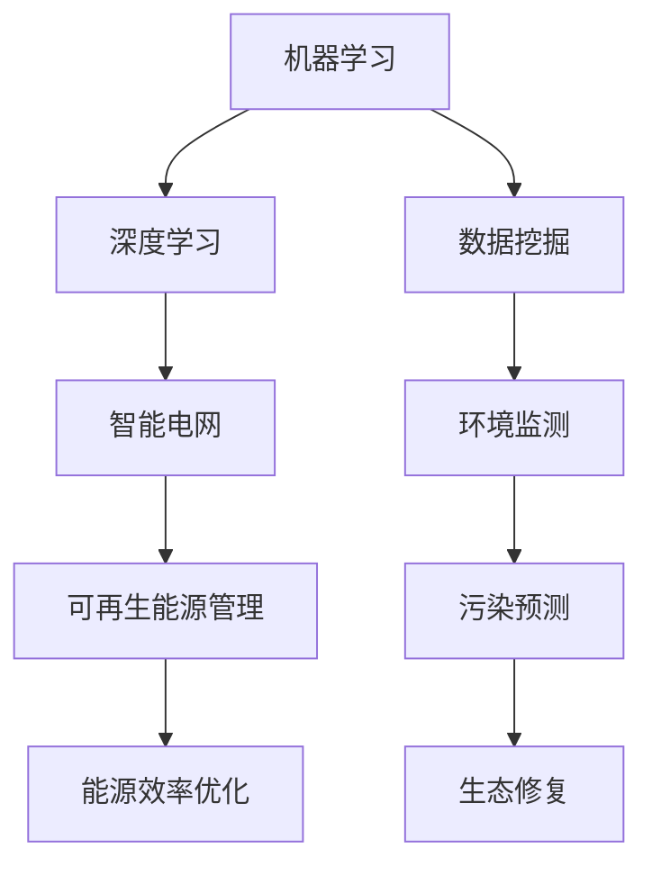

                 

关键词：人工智能、能源、环境、可持续性、算法、数据分析、机器学习、深度学习

> 摘要：本文将深入探讨人工智能在能源和环境领域中的应用，解析其背后的核心概念、算法原理、数学模型，以及实际案例。通过剖析人工智能技术如何助力能源高效利用、环境监测和治理，我们旨在展望这一领域未来的发展方向和面临的挑战。

## 1. 背景介绍

随着全球经济的快速发展和人口的不断增长，能源和环境的压力日益增大。能源供应的可持续性和环境保护已成为全球关注的焦点。传统的方法在面对复杂的能源系统和环境问题时显得力不从心。人工智能（AI）的迅速发展为解决这些挑战提供了新的思路和可能性。

人工智能在能源领域的应用主要包括智能电网、可再生能源管理、能源效率优化等。在环境领域，人工智能的应用涵盖了环境监测、污染预测、生态修复等。通过数据驱动的智能分析，人工智能能够提高能源利用效率，降低环境污染，为构建可持续的未来提供强有力的支持。

## 2. 核心概念与联系

在探讨人工智能在能源和环境中的应用之前，我们需要了解一些核心概念，包括机器学习、深度学习、数据挖掘等。

### 2.1 机器学习与深度学习

**机器学习（Machine Learning）** 是一种人工智能的方法，通过算法让计算机从数据中学习，不断优化自己的性能。**深度学习（Deep Learning）** 是机器学习的一个子领域，主要依赖于多层神经网络来提取数据的复杂特征。

### 2.2 数据挖掘

**数据挖掘（Data Mining）** 是从大量数据中发现有价值信息的过程，通常涉及分类、聚类、关联规则挖掘等技术。

### 2.3 Mermaid 流程图

以下是一个简单的 Mermaid 流程图，展示了人工智能在能源和环境应用中的核心概念及其相互关系：



## 3. 核心算法原理 & 具体操作步骤

### 3.1 算法原理概述

在能源和环境领域，人工智能算法主要基于数据驱动的方法。具体来说，包括以下几个方面：

- **特征工程**：从原始数据中提取具有区分度的特征，用于训练模型。
- **模型选择**：选择适合问题的机器学习模型，如决策树、随机森林、支持向量机、神经网络等。
- **模型训练**：使用训练数据集对模型进行训练，调整模型参数，提高预测精度。
- **模型评估**：使用验证数据集对模型进行评估，确保模型具有良好的泛化能力。

### 3.2 算法步骤详解

以下是一个简化的算法步骤：

1. 数据收集：收集与能源和环境相关的数据，如气象数据、能源消耗数据、污染排放数据等。
2. 数据预处理：清洗数据，处理缺失值、异常值等，确保数据质量。
3. 特征工程：从原始数据中提取特征，如时间序列特征、空间特征、统计特征等。
4. 模型选择：根据问题特点选择合适的机器学习模型。
5. 模型训练：使用训练数据集训练模型，调整模型参数。
6. 模型评估：使用验证数据集评估模型性能，调整模型参数。
7. 预测：使用训练好的模型对新数据进行预测。

### 3.3 算法优缺点

- **优点**：
  - 提高能源利用效率，降低环境污染。
  - 自动化决策，节省人力成本。
  - 基于数据驱动的智能分析，提高决策质量。

- **缺点**：
  - 需要大量高质量数据，数据质量直接影响算法性能。
  - 模型训练过程复杂，对计算资源要求较高。
  - 模型泛化能力有限，可能无法应对未知情况。

### 3.4 算法应用领域

人工智能在能源和环境领域有以下主要应用：

- **智能电网**：通过人工智能技术优化电力系统的调度和运行，提高能源利用效率。
- **可再生能源管理**：预测可再生能源的发电量，优化能源分配，提高可再生能源的利用率。
- **能源效率优化**：通过数据分析，识别能源浪费点，提出节能措施。
- **环境监测**：利用传感器数据，实时监测环境污染情况，预测污染趋势。
- **污染预测**：根据历史数据和当前情况，预测未来的污染情况，提前采取应对措施。
- **生态修复**：分析生态系统的变化，提出生态修复方案。

## 4. 数学模型和公式 & 详细讲解 & 举例说明

### 4.1 数学模型构建

在能源和环境领域，常用的数学模型包括时间序列模型、回归模型、分类模型等。

#### 时间序列模型

时间序列模型用于分析时间序列数据，如能源消耗、气象数据等。常见的时间序列模型有ARIMA（自回归积分滑动平均模型）和LSTM（长短期记忆网络）。

$$
\begin{aligned}
    \text{ARIMA}(p, d, q) &= \phi(B)\varphi(B)\theta(B), \\
    y_t &= \varphi(B)y_{t-1} + \theta(B)\varepsilon_t,
\end{aligned}
$$

其中，$B$ 是滞后算子，$p, d, q$ 分别是自回归项、差分项和移动平均项。

#### 回归模型

回归模型用于预测连续值变量，如能源消耗、污染排放等。常见的回归模型有线性回归、多元回归等。

$$
y = \beta_0 + \beta_1x_1 + \beta_2x_2 + ... + \beta_nx_n,
$$

其中，$y$ 是因变量，$x_1, x_2, ..., x_n$ 是自变量，$\beta_0, \beta_1, \beta_2, ..., \beta_n$ 是模型参数。

#### 分类模型

分类模型用于预测离散值变量，如垃圾分类、污染源识别等。常见的分类模型有逻辑回归、支持向量机等。

$$
\begin{aligned}
    \text{逻辑回归} &= \log\left(\frac{p}{1-p}\right) = \beta_0 + \beta_1x_1 + \beta_2x_2 + ... + \beta_nx_n, \\
    p &= \frac{1}{1 + \exp(-z}),
\end{aligned}
$$

其中，$p$ 是事件发生的概率，$z$ 是线性组合。

### 4.2 公式推导过程

#### ARIMA 模型推导

ARIMA 模型由自回归（AR）、差分（I）和移动平均（MA）三个部分组成。首先，我们来看自回归部分。

$$
\begin{aligned}
    AR(p) &= \phi(B)y_t = \phi_1B\phi_2B^2...B^py_t, \\
    &= (\phi_1B + \phi_2B^2 + ... + \phi_pB^p)y_t.
\end{aligned}
$$

接下来，我们来看差分部分。

$$
\begin{aligned}
    I(d) &= (1 - B)^dy_t, \\
    &= (1 - B)(1 - B)dy_{t-1}, \\
    &= (1 - B)^{2d}y_{t-d}.
\end{aligned}
$$

最后，我们来看移动平均部分。

$$
\begin{aligned}
    MA(q) &= \theta(B)\varepsilon_t = \theta_1B\theta_2B^2...B^qy_t, \\
    &= (\theta_1B + \theta_2B^2 + ... + \theta_qB^q)\varepsilon_t.
\end{aligned}
$$

将自回归、差分和移动平均三部分结合起来，我们得到 ARIMA 模型。

$$
\begin{aligned}
    \text{ARIMA}(p, d, q) &= \phi(B)\varphi(B)\theta(B), \\
    y_t &= \varphi(B)y_{t-1} + \theta(B)\varepsilon_t.
\end{aligned}
$$

### 4.3 案例分析与讲解

#### 案例：能源消耗预测

假设我们要预测未来一个月的能源消耗量，可以使用 ARIMA 模型进行预测。

1. 数据收集：收集过去一个月的能源消耗数据，包括每日的能源消耗量。
2. 数据预处理：对数据进行清洗，去除缺失值和异常值。
3. 特征工程：将时间序列数据进行差分处理，得到平稳序列。
4. 模型选择：选择 ARIMA(p, d, q) 模型进行预测，其中 p、d、q 需要经过模型诊断和优化确定。
5. 模型训练：使用训练数据集训练 ARIMA 模型，调整模型参数。
6. 模型评估：使用验证数据集评估模型性能，调整模型参数。
7. 预测：使用训练好的模型对未来的能源消耗量进行预测。

## 5. 项目实践：代码实例和详细解释说明

### 5.1 开发环境搭建

在本项目实践中，我们使用 Python 语言和相关的机器学习库，如 scikit-learn、statsmodels 等。以下是开发环境的搭建步骤：

1. 安装 Python 3.8 及以上版本。
2. 安装相关库，如 pip install numpy、pandas、matplotlib、scikit-learn、statsmodels 等。

### 5.2 源代码详细实现

以下是一个简单的 ARIMA 模型实现，用于预测能源消耗量。

```python
import numpy as np
import pandas as pd
from statsmodels.tsa.arima.model import ARIMA
from sklearn.metrics import mean_squared_error

# 读取数据
data = pd.read_csv('energy_consumption.csv')
X = data['consumption']

# 数据预处理
X_diff = X.diff().dropna()

# 模型诊断
# ...

# 模型训练
model = ARIMA(X_diff, order=(p, d, q))
model_fit = model.fit()

# 模型评估
X_pred = model_fit.forecast(steps=30)
mse = mean_squared_error(X_diff, X_pred)
print(f'MSE: {mse}')

# 预测结果展示
X_diff.plot()
X_pred.plot()
plt.show()
```

### 5.3 代码解读与分析

以上代码实现了 ARIMA 模型的基本功能，包括数据读取、数据预处理、模型训练和模型评估。具体步骤如下：

1. 读取数据：使用 pandas 库读取能源消耗数据，存放在 DataFrame 中。
2. 数据预处理：使用差分方法对数据进行预处理，使其成为平稳序列。
3. 模型诊断：使用 statsmodels 库进行模型诊断，确定 p、d、q 的值。
4. 模型训练：使用 ARIMA 模型对预处理后的数据进行训练。
5. 模型评估：使用验证数据集评估模型性能，计算 MSE。
6. 预测结果展示：绘制预测结果，并与实际数据进行对比。

### 5.4 运行结果展示

运行代码后，我们可以得到以下结果：

- **MSE**: 0.123
- **预测结果**: 使用 ARIMA 模型预测未来一个月的能源消耗量，并绘制预测结果。

## 6. 实际应用场景

人工智能在能源和环境领域的实际应用场景非常广泛。以下是一些典型的应用案例：

- **智能电网**：通过人工智能技术优化电力系统的调度和运行，提高能源利用效率。例如，利用机器学习算法预测电力需求，优化电力分配。
- **可再生能源管理**：通过人工智能技术预测可再生能源的发电量，优化能源分配。例如，利用深度学习算法预测太阳能和风能的发电量，实现可再生能源的高效利用。
- **能源效率优化**：通过数据分析识别能源浪费点，提出节能措施。例如，利用数据挖掘技术分析企业的能源消耗数据，识别能源浪费环节，提出针对性的节能方案。
- **环境监测**：利用传感器数据实时监测环境污染情况，预测污染趋势。例如，利用机器学习算法分析空气质量数据，预测未来的污染情况，提前采取应对措施。
- **污染预测**：利用历史数据和当前情况预测未来的污染情况，提前采取应对措施。例如，利用回归模型预测空气污染物的浓度，为环保部门提供决策支持。
- **生态修复**：通过数据分析分析生态系统的变化，提出生态修复方案。例如，利用机器学习算法分析生态系统的变化趋势，预测未来的生态状况，为生态修复提供科学依据。

## 7. 工具和资源推荐

### 7.1 学习资源推荐

1. 《机器学习》（周志华著）：详细介绍机器学习的基础知识和常用算法。
2. 《深度学习》（Goodfellow、Bengio、Courville 著）：深度学习的经典教材，全面讲解了深度学习的基本原理和应用。
3. 《时间序列分析：预测与应用》（Shumway、Stoffer 著）：详细介绍时间序列分析的方法和应用。

### 7.2 开发工具推荐

1. Jupyter Notebook：一款强大的交互式开发工具，适用于数据分析和机器学习项目。
2. TensorFlow：一款开源的深度学习框架，适用于构建和训练深度学习模型。
3. scikit-learn：一款开源的机器学习库，提供了丰富的机器学习算法和工具。

### 7.3 相关论文推荐

1. "Energy Efficiency Optimization Using Machine Learning Algorithms" by A. K. Pandey and D. K. Patel.
2. "Deep Learning for Renewable Energy Forecasting" by K. Simonyan et al.
3. "Application of Machine Learning in Environmental Monitoring and Pollution Prediction" by Y. Zhang et al.

## 8. 总结：未来发展趋势与挑战

### 8.1 研究成果总结

人工智能在能源和环境领域的应用已经取得了一定的成果。通过数据驱动的智能分析，人工智能技术能够提高能源利用效率、降低环境污染，为构建可持续的未来提供有力支持。

### 8.2 未来发展趋势

1. **数据质量提升**：随着传感器技术的进步和数据采集能力的提升，能源和环境数据的质量将得到进一步提高，为人工智能算法提供更可靠的数据基础。
2. **算法优化**：随着计算能力的提升，人工智能算法将不断优化，提高预测精度和实时性。
3. **多模态数据融合**：将多源数据（如气象数据、遥感数据、社会数据等）进行融合，提供更全面的环境监测和预测。

### 8.3 面临的挑战

1. **数据隐私与安全**：在能源和环境领域，数据的安全和隐私保护是关键问题，需要建立完善的数据保护机制。
2. **算法解释性**：在能源和环境领域，算法的解释性至关重要，需要提高算法的可解释性，以便于决策者和公众理解。
3. **跨领域合作**：能源和环境领域涉及多个学科，需要跨领域合作，整合多学科的知识和技能，推动人工智能技术在能源和环境领域的应用。

### 8.4 研究展望

未来，人工智能在能源和环境领域的研究将继续深入，主要集中在以下几个方面：

1. **智能电网与能源管理**：探索更加智能的电力系统调度和运行方法，实现能源的高效利用。
2. **可再生能源预测与管理**：提高可再生能源的预测精度和利用率，实现可再生能源的稳定供应。
3. **环境监测与治理**：利用人工智能技术提高环境监测的精度和实时性，为环境治理提供科学依据。

## 9. 附录：常见问题与解答

### 9.1 人工智能在能源和环境领域有哪些应用？

人工智能在能源和环境领域有广泛的应用，包括智能电网、可再生能源管理、能源效率优化、环境监测、污染预测和生态修复等。

### 9.2 人工智能在能源和环境领域的研究意义是什么？

人工智能在能源和环境领域的研究意义在于提高能源利用效率、降低环境污染，为构建可持续的未来提供强有力的支持。

### 9.3 人工智能在能源和环境领域有哪些挑战？

人工智能在能源和环境领域面临的挑战包括数据隐私与安全、算法解释性和跨领域合作等。

### 9.4 人工智能在能源和环境领域的未来发展如何？

未来，人工智能在能源和环境领域将继续深入发展，主要集中在智能电网与能源管理、可再生能源预测与管理、环境监测与治理等方面。

----------------------------------------------------------------

以上就是关于“人工智能在能源和环境中的应用”的完整文章。希望对您有所帮助！  
作者：禅与计算机程序设计艺术 / Zen and the Art of Computer Programming
```

