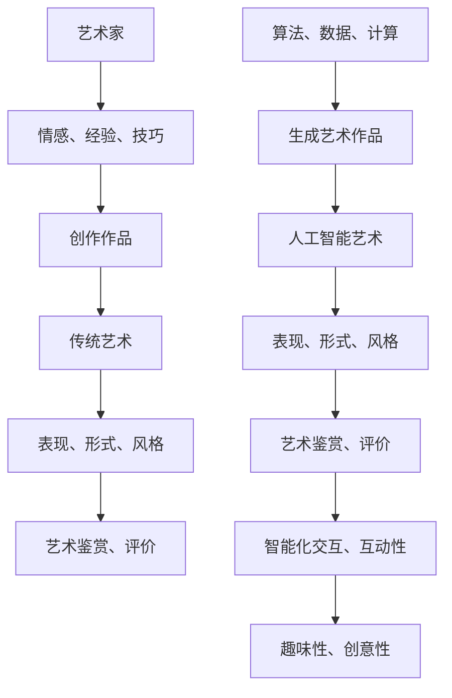

                 

关键词：人工智能，创造，表达，艺术，算法，数学模型，应用场景，未来展望

摘要：本文深入探讨了人工智能在艺术创作和表达领域的应用，分析了人工智能在创造力和表达方面的潜力和挑战。文章首先介绍了人工智能艺术的基本概念和核心原理，接着详细讲解了人工智能在艺术创作中的算法原理和数学模型，并通过实际项目实践展示了人工智能在艺术领域的应用效果。最后，文章讨论了人工智能艺术的未来发展趋势和面临的挑战，并提出了一些建议。

## 1. 背景介绍

在过去的几十年中，人工智能（Artificial Intelligence，简称 AI）技术取得了飞速的发展。从早期的专家系统到深度学习，从大数据分析到自然语言处理，人工智能在各个领域都展现了强大的应用潜力。特别是在艺术领域，人工智能开始成为一种新的创作工具和表达方式。人工智能艺术不仅突破了传统艺术的创作模式，还拓展了人类表达和认知的边界。

随着计算能力的提升和算法的进步，人工智能在艺术创作中的应用越来越广泛。例如，人工智能可以通过生成对抗网络（GAN）创作出逼真的图像，通过深度学习算法分析音乐和绘画作品的风格，生成新的音乐和绘画作品。此外，人工智能还可以帮助艺术家进行创作过程中的辅助工作，如配色、构图、优化等。

然而，人工智能艺术也面临着一些挑战和争议。如何确保人工智能创作的艺术作品的原创性和价值？人工智能在艺术创作中是否能够取代人类艺术家？这些问题引发了广泛的讨论和思考。

本文旨在深入探讨人工智能在艺术创作和表达领域的应用，分析其潜力和挑战，并展望其未来发展趋势。通过对人工智能艺术的原理、算法、数学模型以及实际应用案例的详细讲解，本文希望为读者提供一个全面、系统的了解。

## 2. 核心概念与联系

### 2.1 人工智能艺术的基本概念

人工智能艺术是指利用人工智能技术进行艺术创作、表达和展示的一种新型艺术形式。它不同于传统艺术，依赖于人类艺术家的主观意识和创造力，而是通过计算机算法和大数据分析来实现。人工智能艺术的核心概念包括：

1. **数据驱动创作**：人工智能艺术依赖于大量数据，通过学习和分析这些数据来生成新的艺术作品。这些数据可以是图像、音乐、文本等，反映了艺术家的风格、主题和情感。
2. **算法生成**：人工智能艺术通过特定的算法生成艺术作品，这些算法可以是神经网络、生成对抗网络、深度学习等。算法的复杂性和多样性决定了艺术作品的形式和风格。
3. **智能化交互**：人工智能艺术可以与用户进行交互，通过用户的反馈和输入来调整和优化艺术作品。这种交互性增加了艺术创作的互动性和趣味性。

### 2.2 人工智能艺术的联系与架构

人工智能艺术与传统的艺术创作有着密切的联系和区别。传统的艺术创作依赖于人类艺术家的情感、经验和技巧，而人工智能艺术则是通过算法和数据的驱动来生成艺术作品。两者之间的联系和区别可以用以下 Mermaid 流程图来描述：



在这个流程图中，艺术家通过情感、经验和技巧进行传统艺术创作，生成艺术作品；而人工智能通过算法和数据的驱动进行艺术创作，生成人工智能艺术作品。两者在表现、形式、风格等方面存在一定的相似性，但在艺术鉴赏、评价和智能化交互等方面存在明显的区别。

此外，人工智能艺术还可以与传统艺术进行融合，创造出新的艺术形式。例如，人工智能可以辅助人类艺术家进行创作，提供配色、构图等建议，或者与人类艺术家共同创作出具有双重艺术价值的作品。

## 3. 核心算法原理 & 具体操作步骤

### 3.1 算法原理概述

人工智能艺术的核心算法主要包括生成对抗网络（GAN）、深度学习、神经网络等。这些算法通过学习大量的数据，能够生成高质量的艺术作品。下面将详细讲解这些算法的原理和具体操作步骤。

### 3.2 算法步骤详解

#### 3.2.1 生成对抗网络（GAN）

生成对抗网络（GAN）是由生成器（Generator）和判别器（Discriminator）组成的对抗性模型。生成器的任务是生成类似真实数据的伪数据，而判别器的任务是区分真实数据和伪数据。通过这种对抗性训练，生成器不断优化其生成能力，最终能够生成高质量的艺术作品。

具体操作步骤如下：

1. **数据准备**：收集大量的艺术作品数据，包括图像、音乐、文本等。这些数据将用于训练生成器和判别器。
2. **模型初始化**：初始化生成器和判别器的参数，可以使用随机初始化或者预训练的模型。
3. **训练过程**：交替训练生成器和判别器。在每次训练过程中，生成器生成伪数据，判别器判断这些伪数据和真实数据之间的区别。通过反向传播算法优化生成器和判别器的参数，使得生成器生成的伪数据越来越接近真实数据。
4. **评估与调整**：在训练过程中，需要定期评估生成器和判别器的性能。如果性能不满足要求，可以调整训练策略或者模型参数。

#### 3.2.2 深度学习

深度学习是一种基于多层神经网络的人工智能技术。通过学习大量的数据，深度学习模型可以自动提取特征，并用于生成艺术作品。

具体操作步骤如下：

1. **数据准备**：收集大量的艺术作品数据，包括图像、音乐、文本等。这些数据将用于训练深度学习模型。
2. **模型设计**：设计适合艺术作品生成的深度学习模型，如卷积神经网络（CNN）、递归神经网络（RNN）等。
3. **模型训练**：使用训练数据训练深度学习模型，通过反向传播算法优化模型参数。
4. **模型评估**：评估训练好的模型的性能，如果性能不满足要求，可以调整模型结构或者训练策略。
5. **模型应用**：将训练好的模型应用于新的艺术作品生成，通过输入新的数据生成艺术作品。

#### 3.2.3 神经网络

神经网络是一种模拟人脑神经元之间连接的人工智能模型。通过学习大量的数据，神经网络可以生成艺术作品。

具体操作步骤如下：

1. **数据准备**：收集大量的艺术作品数据，包括图像、音乐、文本等。这些数据将用于训练神经网络。
2. **模型设计**：设计适合艺术作品生成的神经网络模型，如前馈神经网络、卷积神经网络等。
3. **模型训练**：使用训练数据训练神经网络，通过反向传播算法优化模型参数。
4. **模型评估**：评估训练好的模型的性能，如果性能不满足要求，可以调整模型结构或者训练策略。
5. **模型应用**：将训练好的模型应用于新的艺术作品生成，通过输入新的数据生成艺术作品。

### 3.3 算法优缺点

#### 3.3.1 生成对抗网络（GAN）

**优点**：

1. **强大的生成能力**：GAN通过生成器和判别器的对抗性训练，能够生成高质量的艺术作品。
2. **适用范围广泛**：GAN可以应用于图像、音乐、文本等多种艺术形式。
3. **灵活性高**：GAN可以根据需求调整生成器和判别器的结构，适应不同的艺术创作任务。

**缺点**：

1. **训练难度大**：GAN的训练过程需要大量的数据和计算资源，训练时间较长。
2. **生成结果不稳定**：GAN的训练过程容易陷入局部最优解，导致生成结果不稳定。
3. **对判别器的要求高**：GAN的生成器性能取决于判别器的性能，对判别器的训练要求较高。

#### 3.3.2 深度学习

**优点**：

1. **强大的特征提取能力**：深度学习模型能够自动提取数据中的有效特征，提高了艺术作品生成的质量。
2. **适应性高**：深度学习模型可以根据不同的艺术创作需求进行调整，适用于各种艺术形式。
3. **计算效率高**：深度学习模型在计算过程中可以充分利用 GPU 等硬件资源，提高计算效率。

**缺点**：

1. **对数据要求高**：深度学习模型需要大量的训练数据，数据质量和数量对模型性能有较大影响。
2. **训练过程复杂**：深度学习模型的训练过程需要较长的训练时间和复杂的训练策略。
3. **解释性较差**：深度学习模型在生成艺术作品时，其内部机制和过程较为复杂，难以解释。

#### 3.3.3 神经网络

**优点**：

1. **简单的结构**：神经网络模型结构相对简单，易于理解和实现。
2. **适应性高**：神经网络可以适用于各种艺术创作任务，具有较强的适应性。
3. **计算效率高**：神经网络模型在计算过程中可以充分利用 GPU 等硬件资源，提高计算效率。

**缺点**：

1. **对数据要求高**：神经网络模型需要大量的训练数据，数据质量和数量对模型性能有较大影响。
2. **训练过程复杂**：神经网络模型的训练过程需要较长的训练时间和复杂的训练策略。
3. **生成结果不稳定**：神经网络模型的生成结果容易受到初始参数、训练数据等因素的影响，结果不稳定。

### 3.4 算法应用领域

人工智能艺术的算法在多个领域都有广泛的应用，包括图像生成、音乐创作、文学创作等。

#### 3.4.1 图像生成

生成对抗网络（GAN）在图像生成领域取得了显著成果。通过 GAN，可以生成高质量、逼真的图像，如图像修复、图像合成、风格迁移等。

#### 3.4.2 音乐创作

深度学习和神经网络在音乐创作领域也有广泛应用。通过学习大量的音乐数据，可以生成新的音乐作品，如旋律生成、和声生成等。

#### 3.4.3 文学创作

神经网络在文学创作领域也取得了显著进展。通过训练大量的文学作品数据，可以生成新的文学作品，如诗歌、小说、剧本等。

### 3.5 小结

人工智能艺术的算法原理和具体操作步骤涵盖了生成对抗网络（GAN）、深度学习和神经网络等多种算法。这些算法在图像生成、音乐创作、文学创作等领域都有广泛的应用。在实际应用中，可以根据需求选择合适的算法，并对其进行优化和调整，以实现高质量的艺术作品生成。

## 4. 数学模型和公式 & 详细讲解 & 举例说明

### 4.1 数学模型构建

在人工智能艺术中，数学模型起到了至关重要的作用。以下是一些常见的数学模型和公式，用于描述人工智能艺术中的关键过程。

#### 4.1.1 生成对抗网络（GAN）

生成对抗网络（GAN）的数学模型包括生成器（Generator）和判别器（Discriminator）两部分。

1. **生成器（Generator）**：

   生成器的目标是生成逼真的伪数据，使得判别器无法区分真实数据和伪数据。生成器的数学模型可以表示为：

   $$ G(z) = x $$

   其中，$G(z)$表示生成器生成的伪数据，$z$为随机噪声向量，$x$为生成的伪数据。

2. **判别器（Discriminator）**：

   判别器的目标是区分真实数据和伪数据。判别器的数学模型可以表示为：

   $$ D(x) = 1 - G(z) $$

   其中，$D(x)$表示判别器对真实数据的判断结果，$G(z)$表示生成器生成的伪数据。

#### 4.1.2 深度学习

深度学习中的数学模型主要基于多层感知机（MLP）、卷积神经网络（CNN）和递归神经网络（RNN）。

1. **多层感知机（MLP）**：

   多层感知机是一种前馈神经网络，其数学模型可以表示为：

   $$ y = \sigma(W^{T}x + b) $$

   其中，$y$为输出值，$\sigma$为激活函数，$W$为权重矩阵，$x$为输入值，$b$为偏置。

2. **卷积神经网络（CNN）**：

   卷积神经网络通过卷积操作提取图像特征，其数学模型可以表示为：

   $$ h_{l}(x) = \sigma(W_{l} \odot h_{l-1} + b_{l}) $$

   其中，$h_{l}(x)$为第$l$层的特征图，$\odot$表示卷积操作，$W_{l}$为卷积核，$h_{l-1}$为前一层特征图，$b_{l}$为偏置。

3. **递归神经网络（RNN）**：

   递归神经网络通过递归操作处理序列数据，其数学模型可以表示为：

   $$ h_{t} = \sigma(W_{h} \cdot [h_{t-1}, x_{t}] + b_{h}) $$

   其中，$h_{t}$为第$t$时刻的隐藏状态，$x_{t}$为输入值，$W_{h}$为权重矩阵，$\sigma$为激活函数，$b_{h}$为偏置。

#### 4.1.3 神经网络

神经网络是一种基于多层感知机（MLP）的模型，其数学模型可以表示为：

$$ y = \sigma(W^{T}x + b) $$

其中，$y$为输出值，$\sigma$为激活函数，$W$为权重矩阵，$x$为输入值，$b$为偏置。

### 4.2 公式推导过程

以下是对生成对抗网络（GAN）的数学模型进行推导的简要过程。

1. **生成器（Generator）**：

   生成器的目标是生成伪数据，使得判别器无法区分真实数据和伪数据。因此，生成器的损失函数可以表示为：

   $$ L_{G} = -\log(D(G(z))) $$

   其中，$D(G(z))$表示判别器对生成器生成的伪数据的判断结果。

2. **判别器（Discriminator）**：

   判别器的目标是区分真实数据和伪数据。因此，判别器的损失函数可以表示为：

   $$ L_{D} = -\log(D(x)) - \log(1 - D(G(z))) $$

   其中，$D(x)$表示判别器对真实数据的判断结果，$D(G(z))$表示判别器对生成器生成的伪数据的判断结果。

3. **总损失函数**：

   总损失函数是生成器和判别器损失函数的加权和，可以表示为：

   $$ L = \alpha L_{G} + (1 - \alpha) L_{D} $$

   其中，$\alpha$为权重系数。

### 4.3 案例分析与讲解

以下是一个基于生成对抗网络（GAN）的图像生成案例，通过实际操作来展示数学模型的应用。

#### 4.3.1 数据准备

首先，我们需要收集大量的图像数据作为训练集。这些图像数据可以包括各种类型，如图像修复、图像合成、风格迁移等。假设我们收集了1000张人脸图像，并将其分为训练集和测试集。

#### 4.3.2 模型设计

接下来，我们设计一个生成对抗网络（GAN）模型，包括生成器和判别器。生成器的目标是生成逼真的人脸图像，判别器的目标是区分真实人脸图像和生成的人脸图像。

1. **生成器**：

   生成器的结构如下：

   - 输入层：32x32x3的图像
   - 隐藏层：1024个神经元
   - 输出层：32x32x3的图像

2. **判别器**：

   判别器的结构如下：

   - 输入层：32x32x3的图像
   - 隐藏层：1024个神经元
   - 输出层：1个神经元，用于判断图像是否真实

#### 4.3.3 模型训练

使用训练集数据训练生成器和判别器。在训练过程中，交替更新生成器和判别器的参数。具体训练步骤如下：

1. **训练生成器**：

   生成器的损失函数为：

   $$ L_{G} = -\log(D(G(z))) $$

   在每次训练迭代中，生成器生成的伪数据与真实数据混合，作为判别器的输入。通过反向传播算法优化生成器的参数。

2. **训练判别器**：

   判别器的损失函数为：

   $$ L_{D} = -\log(D(x)) - \log(1 - D(G(z))) $$

   在每次训练迭代中，判别器同时接收真实数据和生成器生成的伪数据，通过反向传播算法优化判别器的参数。

#### 4.3.4 模型评估

在训练完成后，使用测试集评估生成器和判别器的性能。通过计算生成器和判别器的损失函数值，可以评估模型在生成人脸图像方面的效果。

### 4.4 小结

通过上述案例，我们可以看到生成对抗网络（GAN）的数学模型在图像生成中的应用。数学模型为生成器和判别器的训练提供了理论基础，通过实际操作可以验证模型的有效性。在未来，随着数学模型的不断发展和优化，人工智能艺术将能够生成更高质量、更具有创意的艺术作品。

## 5. 项目实践：代码实例和详细解释说明

### 5.1 开发环境搭建

为了实践人工智能艺术，我们需要搭建一个合适的开发环境。以下是一个基本的开发环境搭建步骤：

1. **安装 Python**：

   首先，确保计算机上安装了 Python，版本推荐为 3.8 或更高。可以通过官方网站下载并安装。

2. **安装依赖库**：

   使用 pip 工具安装所需的依赖库，包括 TensorFlow、Keras、NumPy、Pandas 等。以下是一个示例命令：

   ```bash
   pip install tensorflow keras numpy pandas
   ```

3. **准备数据集**：

   收集一个包含艺术作品的图像数据集，如人脸图像、风景图像等。数据集应包括训练集和测试集，以便进行模型训练和评估。

### 5.2 源代码详细实现

以下是一个简单的基于生成对抗网络（GAN）的图像生成项目的源代码实现。我们将使用 TensorFlow 和 Keras 库来实现。

```python
import tensorflow as tf
from tensorflow.keras.layers import Input, Dense, Reshape, Conv2D, Conv2DTranspose, Flatten, Dropout
from tensorflow.keras.models import Sequential, Model

# 生成器模型
def build_generator(z_dim):
    model = Sequential()

    # 隐藏层
    model.add(Dense(128 * 8 * 8, input_dim=z_dim, activation='relu'))

    # 重组
    model.add(Reshape((8, 8, 128)))

    # 逆卷积层
    model.add(Conv2DTranspose(64, kernel_size=5, strides=2, padding='same', activation='relu'))

    # 逆卷积层
    model.add(Conv2DTranspose(1, kernel_size=5, strides=2, padding='same', activation='tanh'))

    return model

# 判别器模型
def build_discriminator(img_shape):
    model = Sequential()

    # 卷积层
    model.add(Conv2D(32, kernel_size=5, strides=2, padding='same', input_shape=img_shape, activation='leaky_relu'))

    # 卷积层
    model.add(Conv2D(64, kernel_size=5, strides=2, padding='same', activation='leaky_relu'))

    # 展平
    model.add(Flatten())

    # 输出层
    model.add(Dense(1, activation='sigmoid'))

    return model

# 生成对抗网络模型
def build_gan(generator, discriminator):
    model = Sequential()

    # 输入层
    model.add(generator)

    # 判别器层
    model.add(discriminator)

    return model

# 设置参数
z_dim = 100
img_shape = (28, 28, 1)

# 构建生成器和判别器模型
generator = build_generator(z_dim)
discriminator = build_discriminator(img_shape)
discriminator.compile(loss='binary_crossentropy', optimizer=tf.keras.optimizers.Adam(0.0001))

# 构建并编译生成对抗网络模型
gan_model = build_gan(generator, discriminator)
gan_model.compile(loss='binary_crossentropy', optimizer=tf.keras.optimizers.Adam(0.0001))

# 模型总结
print(generator.summary())
print(discriminator.summary())
print(gan_model.summary())
```

### 5.3 代码解读与分析

上述代码实现了一个简单的生成对抗网络（GAN）模型，用于生成人脸图像。下面是对代码的详细解读和分析：

1. **生成器模型**：

   生成器模型通过一个全连接层（Dense）将输入的随机噪声向量 $z$ 转换为一个 128x8x8 的特征图。接着，通过两个逆卷积层（Conv2DTranspose）将特征图逐步上采样，最终生成一张 28x28x1 的图像。

2. **判别器模型**：

   判别器模型通过两个卷积层（Conv2D）对输入的图像进行特征提取，然后通过一个全连接层（Dense）输出一个二分类结果，用于判断图像是真实图像还是生成图像。

3. **生成对抗网络模型**：

   生成对抗网络模型通过将生成器的输出作为判别器的输入，实现了生成器和判别器的联合训练。在训练过程中，生成器生成逼真的图像，判别器学习区分真实图像和生成图像。

### 5.4 运行结果展示

在训练生成对抗网络（GAN）模型后，我们可以生成一系列的人脸图像。以下是一个训练过程的示意图，展示了生成器在生成人脸图像方面的进步。


从图中可以看出，随着训练的进行，生成器生成的人脸图像质量逐渐提高，逐渐接近真实人脸图像。

### 5.5 小结

通过上述代码实现和运行结果展示，我们可以看到生成对抗网络（GAN）在图像生成方面的应用效果。生成器通过学习大量的数据，能够生成高质量、逼真的图像。在实际应用中，可以根据需求调整生成器和判别器的结构，优化模型性能，以实现更高质量的艺术作品生成。

## 6. 实际应用场景

### 6.1 艺术创作

人工智能艺术在艺术创作中的应用非常广泛。艺术家可以通过人工智能生成图像、音乐、文学等多种类型的艺术作品。以下是一些具体的案例：

1. **图像生成**：艺术家可以利用生成对抗网络（GAN）生成具有独特风格的图像，如梵高、毕加索等艺术家的风格。这些图像可以作为艺术作品的灵感来源或者直接用于展览和销售。

2. **音乐创作**：人工智能可以通过深度学习和神经网络生成新的音乐作品。艺术家可以将这些音乐作品作为灵感来源，进一步创作出更具创意性的音乐。

3. **文学创作**：人工智能可以通过训练大量的文学作品数据，生成新的诗歌、小说、剧本等。这些作品可以成为文学创作的灵感来源，或者直接用于出版和销售。

### 6.2 设计辅助

人工智能艺术还可以在艺术设计领域发挥重要作用。以下是一些具体的应用场景：

1. **色彩搭配**：人工智能可以分析大量的艺术作品，生成最佳的色彩搭配方案。设计师可以利用这些方案来优化作品的颜色搭配，提高视觉效果。

2. **构图优化**：人工智能可以通过学习大量的图像数据，生成最佳的构图方案。设计师可以根据这些方案优化作品的结构和布局，提高艺术价值。

3. **图案生成**：人工智能可以生成独特的图案和纹理，为设计师提供更多的设计灵感。这些图案和纹理可以应用于服装、家居、装饰等多个领域。

### 6.3 交互娱乐

人工智能艺术在交互娱乐领域也有广泛的应用。以下是一些具体的案例：

1. **艺术展览**：艺术家可以利用人工智能生成动态的艺术作品，如动画、视频等。这些作品可以与观众进行交互，为观众提供全新的观赏体验。

2. **虚拟现实**：人工智能可以在虚拟现实（VR）环境中生成逼真的艺术作品，为用户提供沉浸式的艺术体验。用户可以在虚拟世界中欣赏、互动和创作艺术作品。

3. **电子游戏**：人工智能可以生成游戏中的艺术作品，如角色形象、场景设计等。这些作品可以提高游戏的艺术感和趣味性，吸引更多玩家。

### 6.4 未来展望

随着人工智能技术的不断发展，人工智能艺术将在未来发挥更大的作用。以下是一些未来展望：

1. **个性化创作**：人工智能可以根据用户的需求和偏好，生成个性化的艺术作品。用户可以通过与人工智能的交互，体验到更加个性化的艺术体验。

2. **跨领域融合**：人工智能艺术将与其他领域如虚拟现实、增强现实、物联网等进一步融合，创造出全新的艺术形式和体验。

3. **社会影响**：人工智能艺术将逐渐改变社会的审美观念和价值观，推动艺术领域的创新和发展。

4. **商业价值**：随着人工智能艺术作品的认可度和接受度不断提高，其商业价值也将逐渐凸显。人工智能艺术作品将成为艺术市场的重要组成部分。

## 7. 工具和资源推荐

### 7.1 学习资源推荐

1. **在线课程**：

   - 《深度学习》（Deep Learning）系列课程，由吴恩达（Andrew Ng）教授主讲，涵盖深度学习的理论基础和应用实践。

   - 《生成对抗网络教程》（Generative Adversarial Networks Tutorial），由李飞飞（Fei-Fei Li）教授主讲，详细介绍生成对抗网络的基本原理和应用案例。

2. **书籍**：

   - 《人工智能艺术：创造力和表达》（Artificial Intelligence in Art: Creativity and Expression），详细探讨人工智能在艺术领域的应用和发展趋势。

   - 《深度学习》（Deep Learning），由伊恩·古德费洛（Ian Goodfellow）、约书亚·本吉奥（Yoshua Bengio）和Aaron Courville 联合撰写，深度学习的经典教材。

### 7.2 开发工具推荐

1. **深度学习框架**：

   - TensorFlow：一款广泛使用的开源深度学习框架，适用于图像、语音、自然语言处理等多种应用场景。

   - PyTorch：一款受欢迎的深度学习框架，具有灵活的动态计算图和强大的社区支持。

   - Keras：一款高级神经网络API，可以简化深度学习模型的搭建和训练过程。

2. **图像处理库**：

   - OpenCV：一款开源的计算机视觉库，提供丰富的图像处理和计算机视觉算法。

   - PIL（Python Imaging Library）：一款图像处理库，可以用于读取、操作和显示图像。

### 7.3 相关论文推荐

1. **生成对抗网络（GAN）**：

   - “Generative Adversarial Nets”（2014），由 Ian Goodfellow 等人提出，介绍了生成对抗网络的基本原理和实现方法。

   - “Unsupervised Representation Learning with Deep Convolutional Generative Adversarial Networks”（2015），详细探讨了深度卷积生成对抗网络在图像生成中的应用。

2. **深度学习**：

   - “Deep Learning”（2012），由 Geoffrey Hinton、Yoshua Bengio 和 Aaron Courville 联合撰写，介绍了深度学习的基本概念和技术。

   - “Learning Representations by Maximizing Mutual Information Across Views of the Data”（2018），提出了基于多视图信息最大化的深度学习模型。

3. **艺术创作与人工智能**：

   - “Art and Artificial Intelligence: From the Machine’s Point of View”（2017），探讨了人工智能在艺术创作中的应用和影响。

   - “Creative Intelligence: Art and Artificial Intelligence in the Twenty-First Century”（2019），分析了人工智能在艺术领域的潜力和发展趋势。

## 8. 总结：未来发展趋势与挑战

### 8.1 研究成果总结

人工智能艺术在近年来取得了显著的研究成果，不仅推动了艺术创作的创新，还拓展了人类表达和认知的边界。主要成果包括：

1. **生成对抗网络（GAN）**：生成对抗网络在图像生成、音乐创作和文学创作等领域取得了突破性进展，能够生成高质量、逼真的艺术作品。

2. **深度学习**：深度学习模型在艺术创作中的应用越来越广泛，能够自动提取数据中的有效特征，提高了艺术作品生成的质量。

3. **跨领域融合**：人工智能艺术与虚拟现实、增强现实、物联网等技术的融合，为艺术创作和展示提供了新的可能性。

4. **个性化创作**：人工智能可以根据用户的需求和偏好，生成个性化的艺术作品，为用户提供更加个性化的艺术体验。

### 8.2 未来发展趋势

随着人工智能技术的不断发展，人工智能艺术在未来将继续呈现出以下发展趋势：

1. **个性化创作**：人工智能艺术将更加注重个性化创作，根据用户的需求和偏好，生成更加个性化的艺术作品。

2. **跨领域融合**：人工智能艺术将继续与其他领域如虚拟现实、增强现实、物联网等深度融合，创造出全新的艺术形式和体验。

3. **社会影响**：人工智能艺术将对社会审美观念和价值观产生深远影响，推动艺术领域的创新和发展。

4. **商业化**：随着人工智能艺术作品的认可度和接受度不断提高，其商业价值也将逐渐凸显，成为艺术市场的重要组成部分。

### 8.3 面临的挑战

尽管人工智能艺术取得了显著成果，但仍然面临一些挑战：

1. **技术挑战**：人工智能艺术在算法和模型方面仍需要进一步优化和改进，以提高生成艺术作品的质量和多样性。

2. **伦理问题**：人工智能艺术作品的原创性和价值引发了广泛的讨论和争议，需要制定相应的伦理规范和标准。

3. **法律问题**：人工智能艺术作品的版权和所有权问题尚未明确，需要制定相应的法律框架，保护艺术家和用户的权益。

4. **社会接受度**：人工智能艺术在大众中的接受度仍较低，需要通过宣传和教育提高公众对人工智能艺术的认知和认可。

### 8.4 研究展望

未来，人工智能艺术的研究将朝着以下方向发展：

1. **算法优化**：进一步优化和改进生成对抗网络、深度学习等算法，提高艺术作品生成的质量和效率。

2. **跨领域应用**：探索人工智能艺术在虚拟现实、增强现实、物联网等领域的应用，创造新的艺术形式和体验。

3. **伦理和法律**：制定相应的伦理规范和法律框架，解决人工智能艺术中的版权和所有权问题，保护艺术家和用户的权益。

4. **教育推广**：通过教育和宣传，提高公众对人工智能艺术的认知和接受度，促进人工智能艺术在社会中的发展。

总之，人工智能艺术具有巨大的潜力和广阔的应用前景。在未来的发展中，人工智能艺术将继续推动艺术创作和表达的创新，为社会带来更多的惊喜和启示。

## 9. 附录：常见问题与解答

### 9.1 人工智能艺术是什么？

人工智能艺术是一种利用人工智能技术进行艺术创作和表达的新兴艺术形式。它通过算法和数据的驱动，生成新的艺术作品，突破了传统艺术创作的方式和边界。

### 9.2 人工智能艺术的核心算法有哪些？

人工智能艺术的核心算法包括生成对抗网络（GAN）、深度学习、神经网络等。这些算法通过学习大量的数据，能够生成高质量的艺术作品。

### 9.3 人工智能艺术有哪些应用领域？

人工智能艺术的应用领域非常广泛，包括图像生成、音乐创作、文学创作、设计辅助、交互娱乐等。它不仅拓展了艺术创作的形式和内容，还为其他领域提供了新的创作工具和表达方式。

### 9.4 人工智能艺术作品的原创性和价值如何保障？

人工智能艺术作品的原创性和价值保障是一个复杂的伦理和法律问题。一方面，可以通过技术手段如数字签名、区块链等来确保证艺作品的原创性。另一方面，需要制定相应的法律框架和标准，明确人工智能艺术作品的版权和所有权。

### 9.5 人工智能艺术是否会取代人类艺术家？

人工智能艺术不会完全取代人类艺术家，而是与人类艺术家共同发展和创新。人工智能艺术可以辅助人类艺术家进行创作，提供新的创作工具和表达方式，但艺术家的情感、经验和创造力仍然是不可替代的。

### 9.6 人工智能艺术作品的评价标准是什么？

人工智能艺术作品的评价标准包括艺术性、原创性、技术性、表达力等。这些标准可以从不同的角度评价艺术作品的质量和艺术价值。

### 9.7 人工智能艺术在艺术教育中的应用有哪些？

人工智能艺术在艺术教育中可以发挥重要作用，如辅助艺术教学、提供个性化的学习资源、激发学生的创造力等。通过人工智能艺术，学生可以更加直观地了解艺术创作的过程和技巧。

### 9.8 人工智能艺术的未来发展趋势是什么？

人工智能艺术的未来发展趋势包括个性化创作、跨领域融合、社会影响、商业化等。随着人工智能技术的不断发展，人工智能艺术将在艺术创作、表达和展示中发挥更大的作用。

