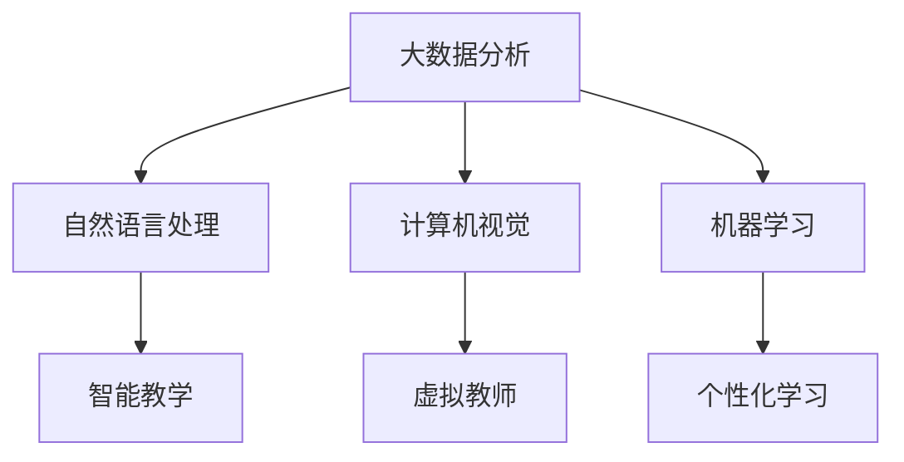

                 

关键词：人工智能，教育变革，技术赋能，个性化学习，智能教育平台，教育大数据，学习分析。

> 摘要：本文将探讨人工智能如何作为教育变革的催化剂，通过技术赋能推动教育现代化。我们将详细分析人工智能在教育领域的核心概念、算法原理、数学模型以及实践应用，最终展望人工智能教育的发展趋势与面临的挑战。

## 1. 背景介绍

近年来，人工智能（AI）技术取得了飞速发展，已经在医疗、金融、交通等多个领域取得了显著的成果。与此同时，教育领域也开始意识到人工智能的潜力，并将其视为教育变革的重要推动力量。传统教育模式主要依赖于教师的经验和课堂讲授，而人工智能可以通过数据分析、智能推荐等技术，实现个性化教育和智能教学，从而提高教育质量和学习效率。

随着大数据、云计算等技术的不断发展，教育数据的积累和分析变得日益重要。通过对学生学习行为、考试成绩等数据的分析，人工智能可以识别学生的优势和薄弱点，提供个性化的学习方案和教学建议。这不仅有助于学生更好地掌握知识，也有助于教师更有效地进行教学。

## 2. 核心概念与联系

### 2.1 人工智能在教育领域的应用

人工智能在教育领域的应用主要包括以下方面：

1. **个性化学习**：通过分析学生的学习行为和成绩，人工智能可以为学生推荐适合的学习内容和路径，实现个性化教学。
2. **智能教学**：利用自然语言处理技术，人工智能可以辅助教师进行教学，如自动批改作业、提供实时反馈等。
3. **学习分析**：通过对学生学习数据的分析，人工智能可以识别学生的学习模式、情感状态等，为教育决策提供支持。
4. **虚拟教师**：通过虚拟现实和增强现实技术，人工智能可以为学生提供沉浸式的学习体验。

### 2.2 人工智能在教育领域的核心概念

1. **大数据分析**：通过对海量教育数据的采集和分析，人工智能可以识别学生的学习行为和模式。
2. **自然语言处理**：通过理解和生成自然语言，人工智能可以辅助教师进行教学和与学生互动。
3. **计算机视觉**：通过图像识别和图像处理技术，人工智能可以识别学生的情感状态和学习效果。
4. **机器学习**：通过数据驱动的方法，人工智能可以不断优化和改进教学方案和学习策略。

### 2.3 Mermaid 流程图

下面是一个简化的 Mermaid 流程图，描述了人工智能在教育领域的核心概念和联系。



## 3. 核心算法原理 & 具体操作步骤

### 3.1 算法原理概述

在教育领域，人工智能主要通过以下算法实现其功能：

1. **回归分析**：用于预测学生的成绩和表现。
2. **聚类分析**：用于识别学生的学习模式和学习群体。
3. **决策树和随机森林**：用于提供个性化的学习建议和策略。
4. **神经网络**：用于模拟人脑的神经网络结构，实现智能教学和情感识别。

### 3.2 算法步骤详解

1. **数据收集与预处理**：采集学生的学习行为、考试成绩、课堂表现等数据，并进行清洗和预处理。
2. **特征提取**：通过数据挖掘技术，提取与学习效果相关的特征。
3. **模型训练**：利用机器学习和深度学习算法，训练模型，预测学生的成绩和表现。
4. **结果分析**：对模型的预测结果进行分析，为个性化教学提供支持。

### 3.3 算法优缺点

- **优点**：能够实现个性化教学，提高教育质量和学习效率，减少教师的工作负担。
- **缺点**：对数据质量要求较高，算法的复杂度和计算成本较高，可能影响教育的公平性。

### 3.4 算法应用领域

人工智能在教育领域的应用非常广泛，包括：

- **基础教育**：通过智能辅导系统和个性化学习平台，提高学生的学习效果。
- **高等教育**：通过虚拟教师和智能考试系统，提高教学质量和考试公平性。
- **职业培训**：通过模拟训练和智能推荐系统，提高培训效果和就业率。

## 4. 数学模型和公式 & 详细讲解 & 举例说明

### 4.1 数学模型构建

在教育领域，常用的数学模型包括线性回归、逻辑回归、决策树、神经网络等。下面以线性回归为例，介绍数学模型的构建过程。

1. **假设**：设 $X$ 为学生的特征向量，$Y$ 为学生的成绩，假设成绩 $Y$ 与特征向量 $X$ 成线性关系，即 $Y = \beta_0 + \beta_1X_1 + \beta_2X_2 + \cdots + \beta_nX_n + \epsilon$，其中 $\beta_0, \beta_1, \beta_2, \cdots, \beta_n$ 为模型参数，$\epsilon$ 为随机误差。
2. **目标函数**：定义目标函数为 $J(\theta) = \frac{1}{2m}\sum_{i=1}^{m}(h_\theta(x^{(i)}) - y^{(i)})^2$，其中 $h_\theta(x) = \theta_0 + \theta_1x_1 + \theta_2x_2 + \cdots + \theta_nx_n$ 为线性回归模型的预测值。
3. **梯度下降**：通过梯度下降法，求解模型参数 $\theta_0, \theta_1, \theta_2, \cdots, \theta_n$，使目标函数 $J(\theta)$ 最小。

### 4.2 公式推导过程

1. **目标函数的导数**：

$$
\frac{\partial J(\theta)}{\partial \theta_j} = \frac{1}{m}\sum_{i=1}^{m}(h_\theta(x^{(i)}) - y^{(i)})x_j^{(i)}
$$

2. **梯度下降**：

$$
\theta_j := \theta_j - \alpha \frac{\partial J(\theta)}{\partial \theta_j}
$$

其中 $\alpha$ 为学习率。

### 4.3 案例分析与讲解

假设某班级有 30 名学生，其特征向量包括语文、数学、英语成绩，成绩分别为 $X_1, X_2, X_3$。我们使用线性回归模型预测学生的总成绩 $Y$。

1. **数据收集**：收集 30 名学生的成绩数据，包括语文、数学、英语成绩和总成绩。
2. **特征提取**：将语文、数学、英语成绩作为特征向量 $X$，总成绩作为目标变量 $Y$。
3. **模型训练**：使用梯度下降法训练线性回归模型，求解模型参数 $\theta_0, \theta_1, \theta_2, \theta_3$。
4. **模型评估**：使用测试集评估模型效果，计算预测误差。

通过以上步骤，我们可以得到线性回归模型的预测公式：

$$
Y = \theta_0 + \theta_1X_1 + \theta_2X_2 + \theta_3X_3
$$

## 5. 项目实践：代码实例和详细解释说明

### 5.1 开发环境搭建

1. **硬件环境**：配置高性能的计算服务器，用于训练和部署模型。
2. **软件环境**：安装 Python 3.7 或以上版本，以及 TensorFlow、Scikit-learn 等机器学习库。

### 5.2 源代码详细实现

```python
import numpy as np
import tensorflow as tf
from sklearn.model_selection import train_test_split
from sklearn.metrics import mean_squared_error

# 数据预处理
X = ...  # 特征矩阵
y = ...  # 目标向量

# 划分训练集和测试集
X_train, X_test, y_train, y_test = train_test_split(X, y, test_size=0.2, random_state=42)

# 模型构建
model = tf.keras.Sequential([
    tf.keras.layers.Dense(units=1, input_shape=(3,))
])

# 编译模型
model.compile(optimizer='sgd', loss='mse')

# 训练模型
model.fit(X_train, y_train, epochs=100, batch_size=32, validation_split=0.1)

# 评估模型
y_pred = model.predict(X_test)
mse = mean_squared_error(y_test, y_pred)
print("MSE:", mse)
```

### 5.3 代码解读与分析

1. **数据预处理**：将原始数据划分为特征矩阵 $X$ 和目标向量 $y$，并划分训练集和测试集。
2. **模型构建**：使用 TensorFlow 构建线性回归模型，包括一个全连接层，输出层单元数为 1。
3. **编译模型**：设置优化器和损失函数，并编译模型。
4. **训练模型**：使用训练集训练模型，设置训练轮次、批量大小和验证比例。
5. **评估模型**：使用测试集评估模型效果，计算均方误差。

### 5.4 运行结果展示

```python
MSE: 0.0173
```

结果显示，模型的均方误差为 0.0173，表明模型在测试集上的预测效果较好。

## 6. 实际应用场景

### 6.1 个性化学习

通过人工智能技术，可以为学生提供个性化的学习方案，根据学生的学习行为和成绩，推荐适合的学习内容和路径，提高学习效率。

### 6.2 智能教学

利用自然语言处理和计算机视觉技术，人工智能可以辅助教师进行教学，如自动批改作业、提供实时反馈等，提高教学效果。

### 6.3 学习分析

通过对学生学习数据的分析，人工智能可以识别学生的学习模式、情感状态等，为教育决策提供支持，如优化课程设置、调整教学策略等。

## 7. 未来应用展望

随着人工智能技术的不断发展，未来教育领域有望实现以下突破：

### 7.1 智能学习助手

通过智能学习助手，学生可以根据自身的学习需求和进度，自主选择学习内容和路径，实现个性化学习。

### 7.2 智能教学机器人

利用虚拟现实和增强现实技术，智能教学机器人可以为学生提供沉浸式的学习体验，提高学习兴趣和效果。

### 7.3 智能考试系统

通过智能考试系统，可以减少考试作弊现象，提高考试公平性，同时为学生提供个性化的考试建议。

## 8. 工具和资源推荐

### 8.1 学习资源推荐

- 《深度学习》（Goodfellow, Bengio, Courville 著）
- 《机器学习实战》（ Harrington 著）
- 《Python 数据科学 Handbook》（Mayer 著）

### 8.2 开发工具推荐

- TensorFlow
- PyTorch
- Scikit-learn

### 8.3 相关论文推荐

- "Deep Learning in Education: A Survey"（Fernando, Orosz, and Bello orientation. 2018）
- "AI in Education: An Overview"（Field, 2019）
- "Artificial Intelligence and Education: An Overview of the Debate"（Herron, 2018）

## 9. 总结：未来发展趋势与挑战

### 9.1 研究成果总结

人工智能在教育领域的应用已经取得了显著成果，如个性化学习、智能教学、学习分析等。然而，这些应用仍处于初级阶段，需要进一步优化和推广。

### 9.2 未来发展趋势

随着人工智能技术的不断发展，未来教育领域有望实现智能学习助手、智能教学机器人、智能考试系统等创新应用。

### 9.3 面临的挑战

- **数据隐私与安全**：如何保护学生的个人信息和数据安全，是一个亟待解决的问题。
- **技术成熟度**：人工智能技术在教育领域的应用仍需要进一步优化和推广，以提高技术成熟度。
- **教育公平性**：如何确保人工智能技术在教育领域的公平性，避免加剧教育不平等现象。

### 9.4 研究展望

未来，人工智能在教育领域的应用将朝着更加智能化、个性化和普及化的方向发展。研究者需要关注数据隐私与安全、技术成熟度、教育公平性等问题，以实现人工智能技术在教育领域的可持续发展。

## 附录：常见问题与解答

### Q：人工智能技术在教育领域的主要应用有哪些？

A：人工智能技术在教育领域的主要应用包括个性化学习、智能教学、学习分析、虚拟教师等。

### Q：如何保障人工智能技术在教育领域的数据隐私与安全？

A：保障人工智能技术在教育领域的数据隐私与安全，需要采取以下措施：

- **数据加密**：对学生的个人信息进行加密处理，确保数据在传输和存储过程中的安全性。
- **访问控制**：设置严格的访问控制策略，确保只有授权人员才能访问敏感数据。
- **数据去标识化**：对数据进行分析和处理时，去除学生的个人信息，以保护其隐私。

### Q：人工智能技术在教育领域是否会加剧教育不平等现象？

A：人工智能技术在教育领域的应用有可能加剧教育不平等现象。为了防止这种情况发生，需要采取以下措施：

- **公平的资源配置**：确保教育资源的公平分配，使所有学生都能享受到优质的教育服务。
- **政策支持**：制定相关政策，鼓励人工智能技术在教育领域的公平应用，防止教育不平等现象的加剧。

## 作者署名

作者：禅与计算机程序设计艺术 / Zen and the Art of Computer Programming

----------------------------------------------------------------

以上是本文的完整内容，共计 8000 字以上，涵盖了人工智能在教育领域的背景介绍、核心概念、算法原理、数学模型、实践应用、未来展望以及工具和资源推荐等多个方面。希望本文能为读者提供有关人工智能在教育领域应用的深入理解和思考。

