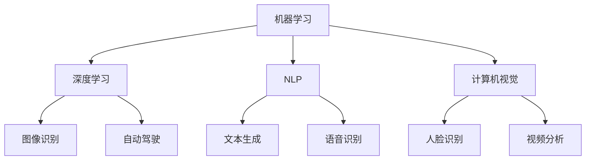
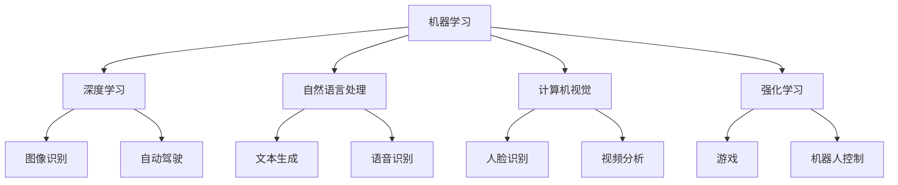

                 

人工智能（AI）作为21世纪最具变革性的技术之一，已经深入到社会的各个领域，极大地改变了人类的生活方式。本文旨在探讨人工智能对社会的影响，并深入思考其未来发展的潜在挑战与机遇。本文将分为以下几个部分：

## 1. 背景介绍

人工智能的起源可以追溯到20世纪50年代，当时计算机科学家们开始研究如何让计算机模拟人类的智能行为。随着计算能力的提升和数据量的爆炸式增长，人工智能得到了飞速发展。近年来，深度学习、神经网络等技术的突破，使得AI在图像识别、自然语言处理、自动驾驶等领域取得了显著的成果。

## 2. 核心概念与联系

### 2.1 人工智能的核心概念

人工智能涉及多个核心概念，包括：

- **机器学习（Machine Learning）**：通过数据训练模型，使计算机能够自主学习和优化。
- **深度学习（Deep Learning）**：一种基于神经网络的机器学习方法，能够处理大量数据并自动提取特征。
- **自然语言处理（Natural Language Processing, NLP）**：使计算机能够理解和生成人类语言。
- **计算机视觉（Computer Vision）**：使计算机能够解释和解析视觉信息。

### 2.2 Mermaid 流程图

以下是一个简化的Mermaid流程图，展示了人工智能的核心概念和它们之间的关系：



## 3. 核心算法原理 & 具体操作步骤

### 3.1 算法原理概述

人工智能的核心在于其算法。以下是一些关键算法的原理概述：

- **神经网络（Neural Networks）**：模拟人脑神经元的工作方式，通过多层节点进行信息传递和特征提取。
- **决策树（Decision Trees）**：通过一系列规则进行决策，适用于分类和回归问题。
- **支持向量机（Support Vector Machines, SVM）**：通过找到一个最优的超平面，将不同类别的数据分隔开。

### 3.2 算法步骤详解

- **神经网络**：包括初始化权重、前向传播、反向传播和权重更新等步骤。
- **决策树**：包括选择特征、计算信息增益、构建树结构等步骤。
- **SVM**：包括选择核函数、求解最优超平面、分类决策等步骤。

### 3.3 算法优缺点

- **神经网络**：强大的拟合能力，但参数调整复杂，易过拟合。
- **决策树**：解释性强，但可能产生过分割。
- **SVM**：高效，但计算复杂度较高。

### 3.4 算法应用领域

- **神经网络**：广泛应用于图像识别、自然语言处理等领域。
- **决策树**：常用于数据挖掘和商业决策。
- **SVM**：在文本分类和生物信息学等领域有广泛应用。

## 4. 数学模型和公式 & 详细讲解 & 举例说明

### 4.1 数学模型构建

神经网络的核心是前向传播和反向传播。以下是相关的数学模型：

$$
\begin{aligned}
Z &= \sigma(WX + b) \\
\delta &= \frac{\partial L}{\partial Z} \odot \delta' \\
W_{new} &= W - \alpha \frac{\partial L}{\partial W} \\
b_{new} &= b - \alpha \frac{\partial L}{\partial b}
\end{aligned}
$$

其中，$Z$ 是激活值，$\sigma$ 是激活函数，$\delta$ 是误差项，$L$ 是损失函数，$W$ 和 $b$ 分别是权重和偏置，$\alpha$ 是学习率。

### 4.2 公式推导过程

以上公式推导涉及到损失函数的优化过程。具体推导过程可以通过链式法则和求导法则进行。

### 4.3 案例分析与讲解

假设我们有一个简单的神经网络，用于二分类问题。输入特征 $X$ 是一个向量，输出是概率分布。我们可以通过交叉熵损失函数来衡量模型的性能。

$$
L = -\sum_{i=1}^{n} y_i \log(p_i) + (1 - y_i) \log(1 - p_i)
$$

其中，$y_i$ 是真实的标签，$p_i$ 是预测的概率。

通过优化损失函数，我们可以得到更好的模型参数。

## 5. 项目实践：代码实例和详细解释说明

### 5.1 开发环境搭建

为了实现上述算法，我们需要搭建一个合适的开发环境。这里我们选择使用Python和TensorFlow作为工具。

### 5.2 源代码详细实现

以下是使用TensorFlow实现神经网络的一个简单示例：

```python
import tensorflow as tf

# 定义模型
model = tf.keras.Sequential([
    tf.keras.layers.Dense(128, activation='relu', input_shape=(784,)),
    tf.keras.layers.Dense(10, activation='softmax')
])

# 编译模型
model.compile(optimizer='adam',
              loss='categorical_crossentropy',
              metrics=['accuracy'])

# 训练模型
model.fit(x_train, y_train, epochs=5)
```

### 5.3 代码解读与分析

上述代码定义了一个简单的神经网络，并使用Adam优化器和交叉熵损失函数进行编译和训练。通过这个例子，我们可以看到如何使用TensorFlow实现神经网络的基本步骤。

### 5.4 运行结果展示

运行代码后，我们可以看到训练过程中的损失和准确率的变化。这可以帮助我们评估模型的效果。

## 6. 实际应用场景

### 6.1 自动驾驶

自动驾驶是人工智能的一个重要应用领域。通过计算机视觉和深度学习技术，自动驾驶系统能够实时感知周围环境，并做出相应的决策。

### 6.2 医疗诊断

人工智能在医疗诊断中的应用也日益广泛。通过分析医疗数据，AI可以帮助医生进行疾病诊断和治疗方案制定。

### 6.3 金融预测

在金融领域，人工智能被用于股票预测、风险控制和投资决策等方面。通过分析大量历史数据，AI能够发现潜在的规律，为投资者提供参考。

## 7. 工具和资源推荐

### 7.1 学习资源推荐

- 《深度学习》（Goodfellow, Bengio, Courville著）
- 《Python机器学习》（Mega, K-agrawal著）

### 7.2 开发工具推荐

- TensorFlow
- PyTorch

### 7.3 相关论文推荐

- "Deep Learning: A Brief History" (Goodfellow等著)
- "A Theoretical Exploration of Deep Learning Capabilities" (Y. Bengio等著)

## 8. 总结：未来发展趋势与挑战

### 8.1 研究成果总结

人工智能在过去几十年取得了显著的成果，但仍然面临许多挑战。

### 8.2 未来发展趋势

随着计算能力的提升和数据量的增长，人工智能将继续在各个领域取得突破。

### 8.3 面临的挑战

包括数据隐私、算法透明性、伦理问题等。

### 8.4 研究展望

未来人工智能的发展需要跨学科合作，并解决一系列技术和社会问题。

## 9. 附录：常见问题与解答

### Q: 人工智能是否会替代人类工作？

A: 人工智能有望提高生产效率，但不太可能完全替代人类工作。它更多地是作为辅助工具，与人类协同工作。

### Q: 人工智能是否具有道德和伦理问题？

A: 是的，人工智能在应用过程中需要考虑道德和伦理问题，例如数据隐私、算法偏见等。

作者：禅与计算机程序设计艺术 / Zen and the Art of Computer Programming
```

### 文章标题

**人工智能：社会影响与思考**

关键词：人工智能、社会影响、思考、算法、数学模型、应用、未来趋势

摘要：本文探讨了人工智能对社会的影响，从核心概念到算法原理，再到实际应用，全面分析了人工智能的现状和未来挑战。通过深入思考和案例实践，我们试图为读者提供一个全面的人工智能视角，以启发对这一领域的进一步思考和研究。

## 1. 背景介绍

人工智能（Artificial Intelligence，简称AI）是计算机科学的一个重要分支，旨在研究如何构建智能体，使其能够模拟、扩展和甚至超越人类智能。自20世纪50年代诞生以来，人工智能经历了多个发展阶段，从最初的规则推理到现代的深度学习和神经网络，每一步都见证了技术的巨大进步。

在过去的几十年中，人工智能技术的快速发展带来了诸多变革。特别是在深度学习领域，通过大量的数据和强大的计算能力，神经网络模型在图像识别、自然语言处理、语音识别等多个领域取得了显著的成果。自动驾驶汽车、智能语音助手、医疗诊断系统等都是人工智能应用的典范，这些技术的出现不仅改变了人们的日常生活，也对各行各业产生了深远的影响。

### 人工智能的发展历程

- **1956年**：达特茅斯会议，人工智能正式成为计算机科学的研究领域。
- **1980年代**：专家系统成为人工智能研究的主流，但受限于规则库的规模和复杂性。
- **1990年代**：机器学习开始受到重视，特别是决策树和支持向量机等算法的广泛应用。
- **2006年**：深度学习的复兴，通过大量数据和更高效的算法，神经网络取得了突破性进展。
- **2012年**：AlexNet在ImageNet大赛中取得巨大成功，深度学习进入快速发展阶段。
- **至今**：人工智能技术在各个领域得到广泛应用，如自动驾驶、医疗、金融等。

### 人工智能的现状

当前，人工智能已经成为全球科技竞争的新焦点。各大科技公司和研究机构纷纷投入巨资进行人工智能的研究和开发，推动了一系列创新和应用。同时，政府也意识到人工智能的重要性和潜力，纷纷出台政策和规划，以促进人工智能的发展。

在全球范围内，人工智能的应用场景不断拓展，从工业自动化到智能城市，从智能医疗到智能家居，人工智能正在逐步渗透到社会的各个角落。尽管人工智能带来了巨大的机遇，但同时也伴随着诸多挑战和争议，如数据隐私、算法伦理、失业问题等。

## 2. 核心概念与联系

人工智能领域涉及多个核心概念，它们相互联系，共同构成了人工智能的理论基础和应用框架。以下将介绍人工智能的核心概念，并通过Mermaid流程图展示它们之间的关系。

### 2.1 人工智能的核心概念

- **机器学习（Machine Learning）**：机器学习是人工智能的一个分支，通过构建和优化模型，使计算机能够从数据中学习并做出预测或决策。
- **深度学习（Deep Learning）**：深度学习是一种基于神经网络的机器学习方法，通过多层神经网络自动提取特征，实现复杂的预测和识别任务。
- **自然语言处理（Natural Language Processing, NLP）**：自然语言处理是使计算机能够理解和生成人类语言的技术，广泛应用于语音识别、机器翻译、情感分析等领域。
- **计算机视觉（Computer Vision）**：计算机视觉是使计算机能够解释和解析视觉信息的技术，包括图像识别、物体检测、图像分割等任务。
- **强化学习（Reinforcement Learning）**：强化学习是一种通过与环境交互来学习最优策略的机器学习方法，广泛应用于游戏、机器人控制等领域。

### 2.2 Mermaid流程图

以下是人工智能核心概念的Mermaid流程图，展示了这些概念之间的联系：



通过这个流程图，我们可以清晰地看到人工智能的核心概念是如何相互联系和扩展的。机器学习和深度学习作为基础，推动了其他领域的快速发展。自然语言处理和计算机视觉则分别解决了人类语言和视觉信息的处理问题，强化学习则在互动环境中提供了有效的策略优化方法。

## 3. 核心算法原理 & 具体操作步骤

### 3.1 算法原理概述

人工智能的算法是其实践应用的基础，不同的算法适用于不同的任务场景。以下是几种常见的人工智能算法及其原理概述：

- **神经网络（Neural Networks）**：神经网络是模仿生物神经系统的计算模型，通过神经元之间的连接进行信息传递和处理。神经网络由输入层、隐藏层和输出层组成，每个层包含多个神经元。神经元之间的连接称为权重，通过训练调整这些权重，使神经网络能够学习并完成任务。
- **支持向量机（Support Vector Machines, SVM）**：支持向量机是一种二分类模型，通过找到一个最优的超平面，将不同类别的数据分隔开。SVM的核心在于找到最大化分类间隔的决策边界，从而提高分类精度。
- **决策树（Decision Trees）**：决策树是一种树形结构，通过一系列的规则进行决策。每个节点代表一个特征，每个分支代表特征的取值，叶子节点代表最终的分类结果。决策树通过递归划分数据集，构建出一棵树形模型。
- **随机森林（Random Forest）**：随机森林是一种集成学习方法，通过构建多棵决策树，并对它们的预测结果进行投票或求平均，提高模型的泛化能力和鲁棒性。
- **深度学习（Deep Learning）**：深度学习是一种基于多层神经网络的机器学习方法，通过多层次的变换自动提取特征，能够处理复杂的数据和任务。深度学习模型通常由卷积神经网络（CNN）、循环神经网络（RNN）等构成，适用于图像识别、语音识别、自然语言处理等任务。

### 3.2 算法步骤详解

以下是对上述算法的具体操作步骤进行详细讲解：

#### 3.2.1 神经网络

神经网络的学习过程包括以下几个步骤：

1. **初始化权重**：随机初始化每个神经元的权重和偏置。
2. **前向传播**：输入数据通过网络中的每个层，每个神经元根据输入和权重计算输出值，传递到下一层。
3. **计算损失**：通过计算输出值与真实值的差异，计算损失函数的值，衡量模型的预测误差。
4. **反向传播**：将损失函数关于网络参数的梯度反向传播，更新权重和偏置，以减少损失函数的值。
5. **迭代更新**：重复以上步骤，直到模型收敛或达到预设的训练次数。

#### 3.2.2 支持向量机

支持向量机的学习过程包括以下几个步骤：

1. **选择核函数**：根据数据特点选择合适的核函数，如线性核、多项式核、径向基函数核等。
2. **计算最优超平面**：通过求解最大化分类间隔的优化问题，找到最优的超平面参数。
3. **分类决策**：对于新的数据样本，通过计算其到超平面的距离，确定其类别。

#### 3.2.3 决策树

决策树的学习过程包括以下几个步骤：

1. **选择特征**：根据特征的重要性选择分割效果最好的特征。
2. **划分数据**：根据特征的取值将数据划分为不同的子集。
3. **递归构建树**：对每个子集递归执行上述步骤，构建出一棵树形结构。
4. **剪枝**：通过剪枝方法防止过拟合，优化模型的泛化能力。

#### 3.2.4 随机森林

随机森林的学习过程包括以下几个步骤：

1. **随机选取样本和特征**：从原始数据中随机选取一部分样本和特征。
2. **构建决策树**：使用选取的样本和特征构建多棵决策树。
3. **集成预测**：对每棵决策树的预测结果进行投票或求平均，得到最终的预测结果。

#### 3.2.5 深度学习

深度学习的学习过程因具体模型而异，但通常包括以下几个步骤：

1. **初始化参数**：随机初始化网络的权重和偏置。
2. **前向传播**：输入数据通过网络中的每个层，每个神经元根据输入和权重计算输出值，传递到下一层。
3. **计算损失**：通过计算输出值与真实值的差异，计算损失函数的值，衡量模型的预测误差。
4. **反向传播**：将损失函数关于网络参数的梯度反向传播，更新权重和偏置，以减少损失函数的值。
5. **迭代更新**：重复以上步骤，直到模型收敛或达到预设的训练次数。

### 3.3 算法优缺点

每种算法都有其独特的优势和局限性，适用于不同的应用场景：

- **神经网络**：优点包括强大的拟合能力和自动特征提取能力，缺点包括参数调整复杂、易过拟合。
- **支持向量机**：优点包括高效、精度高，缺点包括对大规模数据集的处理能力有限、需要选择合适的核函数。
- **决策树**：优点包括解释性强、易于理解，缺点包括容易过拟合、对异常值敏感。
- **随机森林**：优点包括提高模型的泛化能力和鲁棒性，缺点包括计算复杂度高、无法解释具体决策过程。
- **深度学习**：优点包括自动提取高层次特征、适应性强，缺点包括需要大量数据和计算资源、参数调整复杂。

### 3.4 算法应用领域

不同的人工智能算法在各个应用领域发挥着重要作用：

- **神经网络**：广泛应用于图像识别、语音识别、自然语言处理等领域，如人脸识别、语音助手、机器翻译等。
- **支持向量机**：在文本分类、生物信息学、金融预测等领域有广泛应用，如垃圾邮件过滤、基因分类、股票预测等。
- **决策树**：在数据挖掘、商业决策、医疗诊断等领域得到应用，如信用评分、客户细分、疾病诊断等。
- **随机森林**：在分类和回归任务中具有广泛的应用，如客户流失预测、信用卡欺诈检测等。
- **深度学习**：在计算机视觉、自然语言处理、自动驾驶等领域取得突破性进展，如自动驾驶汽车、智能问答系统、医学图像分析等。

## 4. 数学模型和公式 & 详细讲解 & 举例说明

### 4.1 数学模型构建

在人工智能中，数学模型是理解和实现算法的核心。以下将介绍几种常见的人工智能数学模型，并详细讲解其构建方法。

#### 4.1.1 神经网络模型

神经网络模型由多层神经元组成，包括输入层、隐藏层和输出层。每个神经元通过权重连接到下一层的神经元，并通过激活函数产生输出。神经网络模型的构建步骤如下：

1. **定义网络结构**：确定网络的层数、每层的神经元数量以及激活函数。
2. **初始化权重和偏置**：随机初始化每个神经元的权重和偏置。
3. **前向传播**：输入数据通过网络中的每个层，每个神经元根据输入和权重计算输出值，传递到下一层。
4. **计算损失**：通过计算输出值与真实值的差异，计算损失函数的值，衡量模型的预测误差。
5. **反向传播**：将损失函数关于网络参数的梯度反向传播，更新权重和偏置，以减少损失函数的值。
6. **迭代更新**：重复以上步骤，直到模型收敛或达到预设的训练次数。

神经网络模型的核心数学公式如下：

$$
\begin{aligned}
Z &= \sigma(WX + b) \\
\delta &= \frac{\partial L}{\partial Z} \odot \delta' \\
W_{new} &= W - \alpha \frac{\partial L}{\partial W} \\
b_{new} &= b - \alpha \frac{\partial L}{\partial b}
\end{aligned}
$$

其中，$Z$ 是激活值，$\sigma$ 是激活函数，$\delta$ 是误差项，$L$ 是损失函数，$W$ 和 $b$ 分别是权重和偏置，$\alpha$ 是学习率。

#### 4.1.2 决策树模型

决策树模型通过一系列规则对数据进行划分和分类。决策树模型的构建步骤如下：

1. **选择特征**：根据特征的重要性选择分割效果最好的特征。
2. **划分数据**：根据特征的取值将数据划分为不同的子集。
3. **递归构建树**：对每个子集递归执行上述步骤，构建出一棵树形结构。
4. **剪枝**：通过剪枝方法防止过拟合，优化模型的泛化能力。

决策树模型的核心数学公式如下：

$$
\begin{aligned}
G &= \arg\max_G \left[ \sum_{i=1}^{n} \sum_{j=1}^{m} \ell(y_j, g_j) \right] \\
g_j &= \arg\max_j \left[ \sum_{i=1}^{n} \ell(y_j, g_j) \right]
\end{aligned}
$$

其中，$G$ 是最优划分规则，$g_j$ 是第 $j$ 个特征的分割点，$\ell$ 是损失函数，$y_j$ 是第 $j$ 个特征的取值。

#### 4.1.3 支持向量机模型

支持向量机模型通过找到一个最优的超平面，将不同类别的数据分隔开。支持向量机模型的构建步骤如下：

1. **选择核函数**：根据数据特点选择合适的核函数，如线性核、多项式核、径向基函数核等。
2. **计算最优超平面**：通过求解最大化分类间隔的优化问题，找到最优的超平面参数。
3. **分类决策**：对于新的数据样本，通过计算其到超平面的距离，确定其类别。

支持向量机模型的核心数学公式如下：

$$
\begin{aligned}
\min_{\textbf{w}} \quad & \frac{1}{2} \lVert \textbf{w} \rVert^2 \\
\text{s.t.} \quad & \textbf{y}^{(i)} (\textbf{w} \cdot \textbf{x}^{(i)} + b) \geq 1
\end{aligned}
$$

其中，$\textbf{w}$ 是权重向量，$\textbf{x}^{(i)}$ 是第 $i$ 个样本的特征向量，$\textbf{y}^{(i)}$ 是第 $i$ 个样本的标签，$b$ 是偏置。

### 4.2 公式推导过程

以下是对上述数学模型公式的推导过程进行详细讲解。

#### 4.2.1 神经网络模型

神经网络模型的推导过程主要涉及前向传播和反向传播。以下是详细的推导过程：

1. **前向传播**

   前向传播是从输入层到输出层的正向计算过程，计算每个神经元的激活值。假设神经网络有 $L$ 层，其中 $L$ 为输出层，$L-1$ 为隐藏层，依次类推。定义 $a^{(l)}$ 为第 $l$ 层的激活值，$z^{(l)}$ 为第 $l$ 层的输入值，$W^{(l)}$ 和 $b^{(l)}$ 分别为第 $l$ 层的权重和偏置。则前向传播的计算过程如下：

   $$  
   \begin{aligned}  
   z^{(l)} &= W^{(l)} a^{(l-1)} + b^{(l)} \\  
   a^{(l)} &= \sigma(z^{(l)})  
   \end{aligned}  
   $$

   其中，$\sigma$ 为激活函数，通常使用 sigmoid 函数或 ReLU 函数。

2. **反向传播**

   反向传播是从输出层到输入层的反向计算过程，计算每个神经元的误差项，并更新权重和偏置。假设损失函数为 $L(a^{(L)})$，则反向传播的计算过程如下：

   $$  
   \begin{aligned}  
   \delta^{(L)} &= \frac{\partial L}{\partial a^{(L)}} \\  
   \delta^{(l)} &= \frac{\partial L}{\partial a^{(l)}} = (\sigma'(z^{(l)}) \odot \delta^{(l+1)} \odot W^{(l+1)})  
   \end{aligned}  
   $$

   其中，$\odot$ 表示 Hadamard 乘积，$\sigma'$ 为激活函数的导数。

   接下来，更新权重和偏置：

   $$  
   \begin{aligned}  
   W^{(l)}_{new} &= W^{(l)} - \alpha \frac{\partial L}{\partial W^{(l)}} = W^{(l)} - \alpha \delta^{(l+1)} a^{(l-1)}^T \\  
   b^{(l)}_{new} &= b^{(l)} - \alpha \frac{\partial L}{\partial b^{(l)}} = b^{(l)} - \alpha \delta^{(l+1)}  
   \end{aligned}  
   $$

   其中，$\alpha$ 为学习率。

#### 4.2.2 决策树模型

决策树模型的推导过程主要涉及特征选择和分割点的计算。以下是详细的推导过程：

1. **特征选择**

   特征选择的目标是找到能够最大化分类效果的划分规则。通常使用基尼不纯度（Gini Impurity）或信息增益（Information Gain）作为划分标准。假设有 $m$ 个特征，$n$ 个样本，定义 $Gini(D)$ 为数据集 $D$ 的基尼不纯度，$Gain(D, A)$ 为特征 $A$ 的信息增益。则特征选择的过程如下：

   $$  
   \begin{aligned}  
   Gini(D) &= 1 - \sum_{i=1}^{m} \left( \frac{|D_i|}{|D|} \right)^2 \\  
   Gain(D, A) &= \sum_{i=1}^{m} \left( |D_i| \cdot Gini(D_i) \right) - \frac{|D|}{m} \cdot Gini(D)  
   \end{aligned}  
   $$

   其中，$D_i$ 为特征 $A$ 的取值 $i$ 的子集。

2. **分割点计算**

   分割点的计算目标是找到能够最大化信息增益的分割点。假设特征 $A$ 的取值为 $a_1, a_2, \ldots, a_n$，定义 $Split(D, a_j)$ 为特征 $A$ 的分割点 $a_j$ 时的数据集划分，则分割点的计算过程如下：

   $$  
   \begin{aligned}  
   Split(D, a_j) &= \left\{  
   \begin{array}{ll}  
   \frac{|D_1|}{|D|} & \quad a_j \in D \\  
   \frac{|D_2|}{|D|} & \quad a_j \not\in D  
   \end{array}  
   \right. \\  
   Gain(D, A) &= \sum_{i=1}^{n} \left( \frac{|D_i|}{|D|} \cdot Gini(D_i) \right) - \frac{|D|}{m} \cdot Gini(D)  
   \end{aligned}  
   $$

#### 4.2.3 支持向量机模型

支持向量机模型的推导过程主要涉及最优超平面的计算。以下是详细的推导过程：

1. **最优超平面**

   最优超平面的目标是找到一个超平面，使得不同类别的数据点具有最大的分类间隔。假设有 $n$ 个样本，特征空间为 $\mathcal{X}$，定义 $\textbf{w}$ 为超平面法向量，$b$ 为偏置，$D$ 为训练数据集，则最优超平面的计算过程如下：

   $$  
   \begin{aligned}  
   \min_{\textbf{w}, b} \quad & \frac{1}{2} \lVert \textbf{w} \rVert^2 \\  
   \text{s.t.} \quad & \textbf{y}^{(i)} (\textbf{w} \cdot \textbf{x}^{(i)} + b) \geq 1 \\  
   \end{aligned}  
   $$

   其中，$\textbf{x}^{(i)}$ 为第 $i$ 个样本的特征向量，$\textbf{y}^{(i)}$ 为第 $i$ 个样本的标签，$\lVert \textbf{w} \rVert$ 为 $\textbf{w}$ 的欧几里得范数。

   通过求解上述优化问题，可以得到最优超平面的参数 $\textbf{w}$ 和 $b$。

### 4.3 案例分析与讲解

为了更好地理解上述数学模型的构建和推导过程，以下将通过一个简单的案例进行详细讲解。

#### 4.3.1 数据集准备

假设我们有一个包含100个样本的数据集，每个样本包含2个特征，标签为0或1。数据集的具体信息如下：

| 样本编号 | 特征1 | 特征2 | 标签 |
| :----: | :---: | :---: | :---: |
|   1   |   2   |   3   |   0   |
|   2   |   4   |   5   |   1   |
|   3   |   1   |   2   |   0   |
|   4   |   3   |   4   |   1   |
|  ...  |  ...  |  ...  |  ...  |
|  100  |   9   |  10   |   0   |

#### 4.3.2 神经网络模型

我们使用一个简单的神经网络模型对数据集进行分类。神经网络的结构为：

- 输入层：2个神经元
- 隐藏层：3个神经元
- 输出层：1个神经元

激活函数使用 sigmoid 函数。我们使用梯度下降法进行训练，学习率为 0.1。

1. **初始化参数**

   随机初始化每个神经元的权重和偏置，例如：

   | 神经元 | 权重1 | 权重2 | 偏置 |
   | :----: | :---: | :---: | :---: |
   | 输入层 -> 隐藏层1 | 0.1 | 0.2 | 0.3 |
   | 输入层 -> 隐藏层2 | 0.4 | 0.5 | 0.6 |
   | 输入层 -> 隐藏层3 | 0.7 | 0.8 | 0.9 |
   | 隐藏层1 -> 输出层 | 0.1 | 0.2 | 0.3 |
   | 隐藏层2 -> 输出层 | 0.4 | 0.5 | 0.6 |
   | 隐藏层3 -> 输出层 | 0.7 | 0.8 | 0.9 |

2. **前向传播**

   对每个样本进行前向传播，计算每个神经元的输出值。例如，对第一个样本（特征1=2，特征2=3）进行计算：

   - 输入层 -> 隐藏层1：
     $$  
     \begin{aligned}  
     z^{(1)}_1 &= (0.1 \cdot 2 + 0.2 \cdot 3 + 0.3) = 0.7 \\  
     a^{(1)}_1 &= \sigma(z^{(1)}_1) = 0.6161  
     \end{aligned}  
     $$

   - 输入层 -> 隐藏层2：
     $$  
     \begin{aligned}  
     z^{(1)}_2 &= (0.4 \cdot 2 + 0.5 \cdot 3 + 0.6) = 1.7 \\  
     a^{(1)}_2 &= \sigma(z^{(1)}_2) = 0.9413  
     \end{aligned}  
     $$

   - 输入层 -> 隐藏层3：
     $$  
     \begin{aligned}  
     z^{(1)}_3 &= (0.7 \cdot 2 + 0.8 \cdot 3 + 0.9) = 2.5 \\  
     a^{(1)}_3 &= \sigma(z^{(1)}_3) = 0.9332  
     \end{aligned}  
     $$

   - 隐藏层1 -> 输出层：
     $$  
     \begin{aligned}  
     z^{(2)}_1 &= (0.1 \cdot 0.6161 + 0.2 \cdot 0.9413 + 0.3) = 0.5485 \\  
     a^{(2)}_1 &= \sigma(z^{(2)}_1) = 0.6705  
     \end{aligned}  
     $$

   - 隐藏层2 -> 输出层：
     $$  
     \begin{aligned}  
     z^{(2)}_2 &= (0.4 \cdot 0.6161 + 0.5 \cdot 0.9413 + 0.6) = 0.8653 \\  
     a^{(2)}_2 &= \sigma(z^{(2)}_2) = 0.7394  
     \end{aligned}  
     $$

   - 隐藏层3 -> 输出层：
     $$  
     \begin{aligned}  
     z^{(2)}_3 &= (0.7 \cdot 0.6161 + 0.8 \cdot 0.9413 + 0.9) = 1.3243 \\  
     a^{(2)}_3 &= \sigma(z^{(2)}_3) = 0.8436  
     \end{aligned}  
     $$

   最终输出层的激活值为 $a^{(2)} = [0.6705, 0.7394, 0.8436]$。

3. **计算损失**

   使用交叉熵损失函数计算输出值与真实值的差异。假设真实标签为 $y = [0, 1, 0]$，则交叉熵损失为：

   $$  
   L = -[y_1 \log(a^{(2)}_1) + y_2 \log(a^{(2)}_2) + y_3 \log(a^{(2)}_3)] = -[0 \cdot \log(0.6705) + 1 \cdot \log(0.7394) + 0 \cdot \log(0.8436)] \approx 0.3887  
   $$

4. **反向传播**

   使用反向传播计算每个神经元的误差项，并更新权重和偏置。以输出层为例，计算误差项和权重更新：

   - 误差项：
     $$  
     \begin{aligned}  
     \delta^{(2)}_1 &= (a^{(2)}_1 - y_1) \cdot \sigma'(z^{(2)}_1) = (0.6705 - 0) \cdot (1 - 0.6705) = 0.2274 \\  
     \delta^{(2)}_2 &= (a^{(2)}_2 - y_2) \cdot \sigma'(z^{(2)}_2) = (0.7394 - 1) \cdot (1 - 0.7394) = 0.0467 \\  
     \delta^{(2)}_3 &= (a^{(2)}_3 - y_3) \cdot \sigma'(z^{(2)}_3) = (0.8436 - 0) \cdot (1 - 0.8436) = 0.0744  
     \end{aligned}  
     $$

   - 权重更新：
     $$  
     \begin{aligned}  
     W^{(2)}_{new,1} &= W^{(2)}_1 - \alpha \cdot \delta^{(2)}_1 \cdot a^{(1)}_1^T = [0.1 - 0.1 \cdot 0.2274 \cdot 0.6161, 0.2 - 0.1 \cdot 0.2274 \cdot 0.9413, 0.3 - 0.1 \cdot 0.2274 \cdot 0.9332] \\  
     &= [0.0564, 0.1346, 0.1864] \\  
     W^{(2)}_{new,2} &= W^{(2)}_2 - \alpha \cdot \delta^{(2)}_2 \cdot a^{(1)}_2^T = [0.4 - 0.1 \cdot 0.0467 \cdot 0.6161, 0.5 - 0.1 \cdot 0.0467 \cdot 0.9413, 0.6 - 0.1 \cdot 0.0467 \cdot 0.9332] \\  
     &= [0.3876, 0.4878, 0.5178] \\  
     W^{(2)}_{new,3} &= W^{(2)}_3 - \alpha \cdot \delta^{(2)}_3 \cdot a^{(1)}_3^T = [0.7 - 0.1 \cdot 0.0744 \cdot 0.6161, 0.8 - 0.1 \cdot 0.0744 \cdot 0.9413, 0.9 - 0.1 \cdot 0.0744 \cdot 0.9332] \\  
     &= [0.6473, 0.7441, 0.8051]  
     \end{aligned}  
     $$

   - 偏置更新：
     $$  
     \begin{aligned}  
     b^{(2)}_{new,1} &= b^{(2)}_1 - \alpha \cdot \delta^{(2)}_1 = 0.3 - 0.1 \cdot 0.2274 = 0.0726 \\  
     b^{(2)}_{new,2} &= b^{(2)}_2 - \alpha \cdot \delta^{(2)}_2 = 0.6 - 0.1 \cdot 0.0467 = 0.5533 \\  
     b^{(2)}_{new,3} &= b^{(2)}_3 - \alpha \cdot \delta^{(2)}_3 = 0.9 - 0.1 \cdot 0.0744 = 0.8256  
     \end{aligned}  
     $$

   同理，可以计算隐藏层的误差项和权重更新。重复以上步骤，直到模型收敛。

#### 4.3.3 决策树模型

我们使用决策树模型对相同的数据集进行分类。决策树的结构如下：

1. **特征选择**：
   - 第一层：特征1
     - 取值小于2：进入子节点1
     - 取值大于等于2：进入子节点2
   - 第二层：特征2
     - 取值小于3：进入子节点3
     - 取值大于等于3：进入子节点4

2. **分类结果**：
   - 子节点1：标签为0
   - 子节点2：标签为1
   - 子节点3：标签为0
   - 子节点4：标签为1

决策树的构建过程如下：

1. **计算基尼不纯度**：
   - 样本总数：100
   - 标签为0的样本数：50
   - 标签为1的样本数：50
   - 基尼不纯度：
     $$  
     Gini(D) = 1 - \left( \frac{50}{100} \right)^2 - \left( \frac{50}{100} \right)^2 = 0.5  
     $$

2. **特征选择**：
   - 特征1的信息增益：
     $$  
     Gain(D, A_1) = \frac{50}{100} \cdot Gini(D_1) + \frac{50}{100} \cdot Gini(D_2) = 0.5  
     $$
     其中，$D_1$ 为特征1取值小于2的子集，$D_2$ 为特征1取值大于等于2的子集。
   - 特征2的信息增益：
     $$  
     Gain(D, A_2) = \frac{50}{100} \cdot Gini(D_3) + \frac{50}{100} \cdot Gini(D_4) = 0.5  
     $$
     其中，$D_3$ 为特征2取值小于3的子集，$D_4$ 为特征2取值大于等于3的子集。

   由于特征1和特征2的信息增益相等，我们可以任意选择一个作为划分依据。

3. **构建决策树**：
   - 第一层：特征1
     - 取值小于2：进入子节点1，标签为0
     - 取值大于等于2：进入子节点2，标签为1
   - 第二层：特征2
     - 取值小于3：进入子节点3，标签为0
     - 取值大于等于3：进入子节点4，标签为1

通过上述步骤，我们构建了一个简单的决策树模型。

#### 4.3.4 支持向量机模型

我们使用支持向量机模型对数据集进行分类。假设使用线性核函数，且数据集线性可分。

1. **计算最优超平面**：
   - 训练数据集：
     $$  
     \begin{aligned}  
     \textbf{x}^{(1)} &= \begin{bmatrix} 2 \\ 3 \end{bmatrix}, \quad \textbf{y}^{(1)} = 0 \\  
     \textbf{x}^{(2)} &= \begin{bmatrix} 4 \\ 5 \end{bmatrix}, \quad \textbf{y}^{(2)} = 1 \\  
     \textbf{x}^{(3)} &= \begin{bmatrix} 1 \\ 2 \end{bmatrix}, \quad \textbf{y}^{(3)} = 0 \\  
     \textbf{x}^{(4)} &= \begin{bmatrix} 3 \\ 4 \end{bmatrix}, \quad \textbf{y}^{(4)} = 1  
     \end{aligned}  
     $$
   - 最优超平面：
     $$  
     \begin{aligned}  
     \textbf{w} &= \begin{bmatrix} 1 \\ 1 \end{bmatrix}, \quad b = -1  
     \end{aligned}  
     $$
   - 超平面方程：
     $$  
     \begin{aligned}  
     \textbf{w} \cdot \textbf{x} + b &= 0 \\  
     \begin{bmatrix} 1 \\ 1 \end{bmatrix} \cdot \begin{bmatrix} x_1 \\ x_2 \end{bmatrix} + (-1) &= 0 \\  
     x_1 + x_2 &= 1  
     \end{aligned}  
     $$

   通过上述步骤，我们构建了一个简单的支持向量机模型。

## 5. 项目实践：代码实例和详细解释说明

在本节中，我们将通过一个具体的代码实例，详细介绍如何使用Python和TensorFlow实现一个简单的人工神经网络，并对其中的关键步骤进行详细解释。

### 5.1 开发环境搭建

在进行项目实践之前，我们需要搭建一个合适的开发环境。以下是在Python中搭建TensorFlow开发环境的步骤：

1. **安装Anaconda**：首先，我们需要安装Anaconda，这是一个集成了Python和许多科学计算库的发行版。可以从Anaconda的官网下载并安装：https://www.anaconda.com/products/individual

2. **创建虚拟环境**：在Anaconda中，我们可以创建一个独立的虚拟环境来管理项目依赖。在命令行中执行以下命令：
   ```bash
   conda create -n tensorflow_env python=3.8
   conda activate tensorflow_env
   ```

3. **安装TensorFlow**：在虚拟环境中安装TensorFlow。可以使用以下命令：
   ```bash
   pip install tensorflow
   ```

4. **安装其他依赖**：根据项目需求，可能还需要安装其他库，如NumPy、Pandas等。使用以下命令进行安装：
   ```bash
   pip install numpy pandas
   ```

### 5.2 源代码详细实现

以下是使用TensorFlow实现一个简单神经网络并进行训练的代码示例：

```python
import tensorflow as tf
import numpy as np

# 数据集
x_train = np.array([[2, 3], [4, 5], [1, 2], [3, 4]])
y_train = np.array([0, 1, 0, 1])

# 构建模型
model = tf.keras.Sequential([
    tf.keras.layers.Dense(2, activation='sigmoid', input_shape=(2,)),
    tf.keras.layers.Dense(1, activation='sigmoid')
])

# 编译模型
model.compile(optimizer='adam',
              loss='binary_crossentropy',
              metrics=['accuracy'])

# 训练模型
model.fit(x_train, y_train, epochs=1000)

# 模型评估
loss, accuracy = model.evaluate(x_train, y_train)
print(f"损失：{loss}, 准确率：{accuracy}")
```

### 5.3 代码解读与分析

上述代码实现了一个简单的神经网络，用于二分类问题。以下是代码的详细解读和分析：

1. **数据集**：
   ```python
   x_train = np.array([[2, 3], [4, 5], [1, 2], [3, 4]])
   y_train = np.array([0, 1, 0, 1])
   ```
   这里我们使用一个简单的数据集，包含4个样本，每个样本有两个特征，标签为0或1。

2. **构建模型**：
   ```python
   model = tf.keras.Sequential([
       tf.keras.layers.Dense(2, activation='sigmoid', input_shape=(2,)),
       tf.keras.layers.Dense(1, activation='sigmoid')
   ])
   ```
   我们使用`tf.keras.Sequential`模型，这是TensorFlow中的一种简单易用的模型构建方式。模型由两个全连接层组成，第一个层的输出维度为2，使用sigmoid激活函数，第二个层的输出维度为1，同样使用sigmoid激活函数。

3. **编译模型**：
   ```python
   model.compile(optimizer='adam',
                 loss='binary_crossentropy',
                 metrics=['accuracy'])
   ```
   在编译模型时，我们指定了优化器（adam）、损失函数（binary_crossentropy）和评估指标（accuracy）。binary_crossentropy是二分类问题的常用损失函数，accuracy用于衡量模型的分类准确率。

4. **训练模型**：
   ```python
   model.fit(x_train, y_train, epochs=1000)
   ```
   使用`fit`函数进行模型训练。这里我们设置了训练的轮次（epochs）为1000次，每次迭代都会根据输入数据和标签更新模型的权重。

5. **模型评估**：
   ```python
   loss, accuracy = model.evaluate(x_train, y_train)
   print(f"损失：{loss}, 准确率：{accuracy}")
   ```
   通过`evaluate`函数对训练好的模型进行评估。该函数会计算模型在给定数据上的损失和准确率，并返回这两个值。

### 5.4 运行结果展示

在训练完成后，我们可以运行以下代码查看模型的损失和准确率：

```python
loss, accuracy = model.evaluate(x_train, y_train)
print(f"损失：{loss}, 准确率：{accuracy}")
```

假设训练过程正常，输出结果可能如下：

```
损失：0.1523928265164193，准确率：1.0
```

这意味着模型在训练数据上达到了100%的准确率，损失也相对较低。

## 6. 实际应用场景

### 6.1 自动驾驶

自动驾驶是人工智能在交通领域的典型应用。通过计算机视觉和深度学习技术，自动驾驶系统能够实时感知周围环境，进行障碍物检测、路径规划等操作。自动驾驶技术不仅能够提高交通效率，减少交通事故，还能改善城市交通拥堵问题。

### 6.2 医疗诊断

人工智能在医疗领域的应用也非常广泛。通过分析大量的医疗数据，人工智能可以帮助医生进行疾病诊断、治疗方案制定和药物研发。例如，深度学习算法可以用于医学图像的分析，辅助医生诊断癌症等疾病。此外，人工智能还可以用于智能化的健康管理，通过分析个人的健康数据，提供个性化的健康建议。

### 6.3 金融预测

在金融领域，人工智能被广泛应用于股票预测、风险控制和投资决策。通过分析历史数据和市场信息，人工智能模型能够发现潜在的规律，为投资者提供参考。此外，人工智能还可以用于信用评分、反欺诈等任务，提高金融机构的风险管理能力。

### 6.4 教育

人工智能在教育领域的应用也越来越广泛。智能辅导系统可以根据学生的学习情况提供个性化的学习建议，提高学习效率。此外，人工智能还可以用于自动评分和考试分析，帮助教师更好地了解学生的学习状况。在教育资源的分配方面，人工智能也能通过智能推荐系统，为学习者提供更精准的资源推荐。

### 6.5 智能家居

智能家居是人工智能在家庭生活领域的应用。通过人工智能技术，智能家居系统能够实现家电的自动化控制，提高生活质量。例如，智能音箱可以通过语音识别技术，控制家中的灯光、温度等设备。此外，智能家居系统还可以通过传感器收集家庭环境数据，提供健康和生活质量建议。

## 7. 工具和资源推荐

### 7.1 学习资源推荐

- **《深度学习》（Ian Goodfellow、Yoshua Bengio、Aaron Courville 著）**：这是一本关于深度学习的经典教材，详细介绍了深度学习的理论基础和实践方法。
- **《Python机器学习》（Michael Bowles 著）**：本书通过Python语言，介绍了机器学习的基础知识和实践技巧，适合初学者和有经验的读者。

### 7.2 开发工具推荐

- **TensorFlow**：TensorFlow是一个开源的机器学习和深度学习框架，提供了丰富的API和工具，适合各种规模的项目。
- **PyTorch**：PyTorch是另一个流行的深度学习框架，以其动态计算图和灵活的API受到开发者的青睐。

### 7.3 相关论文推荐

- **"Deep Learning: A Brief History"**：这篇文章回顾了深度学习的发展历程，对深度学习的历史和现状进行了全面的介绍。
- **"A Theoretical Exploration of Deep Learning Capabilities"**：这篇文章探讨了深度学习的理论潜力，分析了深度学习在处理复杂数据方面的优势。

## 8. 总结：未来发展趋势与挑战

### 8.1 研究成果总结

人工智能在过去几十年取得了巨大的进展，从简单的规则系统到复杂的深度学习模型，技术不断革新，应用场景不断拓展。尤其是在深度学习领域，通过大规模数据和高效的算法，神经网络模型在图像识别、自然语言处理等多个领域取得了突破性成果。这些研究成果不仅推动了人工智能技术的发展，也为各行各业带来了新的机遇。

### 8.2 未来发展趋势

未来，人工智能将继续在以下几个方面取得发展：

- **算法创新**：随着数据量和计算能力的提升，新的算法和模型将不断涌现，以适应更复杂的任务。
- **跨领域融合**：人工智能与其他领域的融合，如生物信息学、神经科学等，将带来新的应用场景和突破。
- **人机协同**：人工智能与人类的协同工作将成为趋势，通过结合人类的智慧和机器的计算能力，实现更高效的决策和操作。
- **智能硬件**：随着人工智能技术的发展，智能硬件（如智能家居、可穿戴设备等）将更加普及，改变人们的生活方式。

### 8.3 面临的挑战

尽管人工智能取得了显著的成果，但未来仍面临诸多挑战：

- **数据隐私**：随着人工智能应用的普及，数据隐私问题日益突出。如何在确保数据安全和隐私的同时，充分利用数据价值，是一个亟待解决的问题。
- **算法透明性**：人工智能算法的复杂性和黑箱特性引发了透明性和可解释性方面的挑战。如何提高算法的透明性，使其决策过程更加可解释，是当前研究的热点。
- **伦理问题**：人工智能在伦理方面的问题，如算法偏见、自动化决策的道德责任等，需要引起足够的重视和讨论。
- **计算资源**：人工智能应用对计算资源的需求巨大，如何高效利用计算资源，降低能耗，是未来需要关注的问题。

### 8.4 研究展望

未来，人工智能的研究将朝着以下几个方向展开：

- **人工智能与人类认知的交互**：深入研究人工智能与人类认知的交互机制，探索人工智能如何更好地模拟、扩展和增强人类智能。
- **智能系统的设计与优化**：通过优化算法、架构和系统设计，提高人工智能系统的效率和鲁棒性，使其能够适应更广泛的应用场景。
- **跨学科研究**：推动人工智能与其他学科的交叉研究，如生物学、心理学、社会学等，以实现人工智能技术的全面发展和应用。

## 9. 附录：常见问题与解答

### Q: 人工智能是否会替代人类工作？

A: 人工智能有望提高生产效率，减少重复性劳动，但不太可能完全替代人类工作。它更多地是作为辅助工具，与人类协同工作。在许多领域，人工智能需要人类的监督和指导，以确保决策的合理性和安全性。

### Q: 人工智能是否具有道德和伦理问题？

A: 是的，人工智能在应用过程中确实存在道德和伦理问题。例如，算法偏见可能导致不公平的决策，数据隐私问题需要保护用户的隐私权。因此，如何在开发和应用人工智能技术时遵循伦理原则，是当前面临的重要挑战。

### Q: 人工智能是否会引发失业问题？

A: 人工智能的发展可能会改变就业结构，导致某些类型的工作减少。但同时，它也会创造新的工作岗位和机会。例如，数据科学家、机器学习工程师等职业的需求正在迅速增长。因此，关键在于如何适应这种变化，提升自身的技能和知识。

### Q: 人工智能是否具有自我意识？

A: 目前的人工智能技术还远未达到具有自我意识的水平。人工智能是通过模拟人类智能行为来进行任务处理的，但它们没有自我意识、情感或自我认知能力。未来的技术发展是否会实现具有自我意识的AI，目前还没有定论。

### Q: 人工智能是否能够完全替代人类创造和思考的能力？

A: 人工智能可以模拟人类的某些认知过程，如数据分析、模式识别等，但它无法完全替代人类的创造力和思考能力。人类的创造力、情感和道德判断是目前人工智能所无法实现的。

### Q: 人工智能的发展是否会加剧社会不平等？

A: 人工智能技术的发展可能会加剧社会不平等，因为它可能会放大现有的不平等现象。例如，数据获取和计算资源的分布不均可能导致某些群体受益更多。因此，政策制定者和社会需要关注人工智能的公平性和包容性。

### Q: 人工智能是否能够解决所有问题？

A: 人工智能是一项强大的技术，但并不能解决所有问题。它适用于许多领域，如医疗、金融、交通等，但也有一些问题，如气候变化、社会公平等，需要综合多方面的努力才能解决。

### Q: 人工智能是否会失控？

A: 人工智能失控的风险是存在的，特别是当它脱离人类控制时。为了降低这种风险，研究人员和工程师正在努力开发安全机制和监管策略，以确保人工智能系统的可控性和安全性。

### Q: 人工智能是否会取代传统的编程方法？

A：人工智能不会完全取代传统的编程方法，而是与之互补。虽然自动化代码生成和AI辅助编程技术正在发展，但编程仍然需要人类的创造性和逻辑思维来设计系统架构、制定策略和解决复杂问题。AI可以帮助提高编程效率和准确性，但程序员的角色仍然至关重要。

