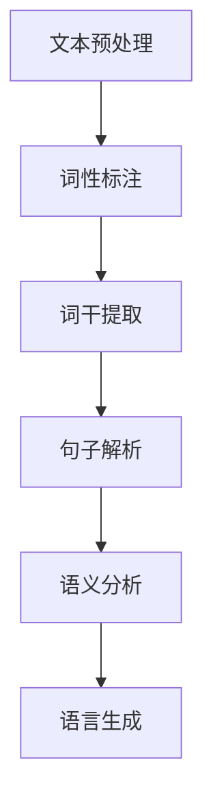
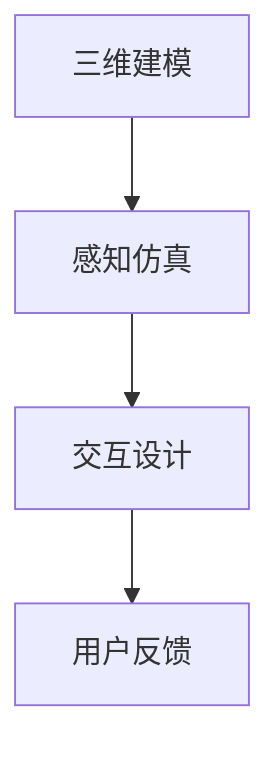
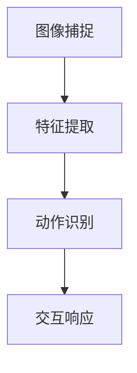

                 

关键词：人机交互，AI，自然语言处理，虚拟现实，手势识别，智能助手，用户体验，交互设计

> 摘要：本文探讨了人机交互领域的发展趋势和未来展望。从人工智能、虚拟现实、手势识别等技术的进步，到智能助手和用户体验的优化，人机交互正在迎来新的变革。本文旨在梳理当前的研究成果和前沿技术，并对未来的挑战和机遇进行深入分析。

## 1. 背景介绍

人机交互（Human-Computer Interaction, HCI）是研究人与计算机系统之间交互的设计原则、方法和技术的一个交叉学科领域。随着计算机技术的飞速发展，人机交互在近年来取得了显著的进步。传统的人机交互主要通过键盘、鼠标、触摸屏等硬件设备进行，而现代人机交互则更多地涉及人工智能、虚拟现实、自然语言处理等前沿技术。

### 1.1 历史背景

人机交互的概念最早可以追溯到1960年代。IBM的Mark I计算机配备了键盘和打印终端，标志着人机交互的初步实现。随后的几十年，计算机硬件和软件的发展推动了人机交互技术的不断进步。图形用户界面（GUI）的出现使得人机交互变得更加直观和易用。进入21世纪，随着互联网和移动设备的普及，人机交互的应用场景变得更加丰富和多样化。

### 1.2 当前发展

当前，人机交互领域的研究热点包括自然语言处理、虚拟现实、手势识别等。自然语言处理（Natural Language Processing, NLP）技术使得计算机能够理解和处理人类语言，从而实现更加自然和高效的人机交互。虚拟现实（Virtual Reality, VR）技术则提供了沉浸式的交互体验，使得用户能够更加直观地与计算机系统进行交互。手势识别技术则通过捕捉用户的肢体动作，实现了无接触的人机交互。

## 2. 核心概念与联系

### 2.1 自然语言处理

自然语言处理是计算机科学和语言学的一个分支，它涉及到计算机程序对人类语言的理解和处理。NLP的核心概念包括：

- **文本预处理**：包括分词、词性标注、词干提取等，将原始文本转换为计算机可以处理的形式。
- **语言模型**：通过大量语言数据训练得到的模型，用于预测下一个单词或词组。
- **语义分析**：理解文本中的词语和句子的含义，包括词义消歧、句法分析等。

下面是NLP的架构图：



### 2.2 虚拟现实

虚拟现实是一种可以创建和体验虚拟世界的计算机仿真系统。它利用计算机生成一个三维空间，并通过特殊设备（如头戴式显示器、传感器等）将用户置身于这个虚拟环境中。虚拟现实的核心概念包括：

- **三维建模**：使用计算机图形学技术创建虚拟环境的三维模型。
- **感知仿真**：通过视觉、听觉、触觉等多感官反馈，模拟真实世界的感知体验。
- **交互设计**：设计用户在虚拟环境中的交互方式，包括手势、语音等。

下面是虚拟现实的架构图：



### 2.3 手势识别

手势识别是一种通过计算机视觉技术捕捉和分析用户手势的技术。它涉及计算机图像处理、模式识别等领域。手势识别的核心概念包括：

- **图像捕捉**：使用摄像头或其他传感器捕捉用户的肢体动作。
- **特征提取**：从图像中提取手势的特征，如轮廓、形状等。
- **动作识别**：根据提取的特征，识别用户的手势动作。

下面是手势识别的架构图：



## 3. 核心算法原理 & 具体操作步骤

### 3.1 算法原理概述

人机交互领域涉及多种核心算法，包括自然语言处理中的序列模型、虚拟现实中的渲染算法、手势识别中的卷积神经网络等。以下是对这些算法的简要概述：

- **序列模型**：用于处理序列数据，如文本、语音等。常见的序列模型有循环神经网络（RNN）和长短期记忆网络（LSTM）。
- **渲染算法**：用于生成虚拟现实中的三维图像。常见的渲染算法有光线追踪和基于物理渲染。
- **卷积神经网络**：用于图像处理和手势识别。卷积神经网络通过多层卷积和池化操作，提取图像中的特征。

### 3.2 算法步骤详解

- **序列模型**：

  1. 输入文本数据。
  2. 对文本进行分词和词性标注。
  3. 将文本转换为向量表示。
  4. 使用RNN或LSTM对序列数据进行处理。
  5. 输出预测结果。

- **渲染算法**：

  1. 输入三维模型。
  2. 计算光线与物体的交点。
  3. 根据光线传播的物理特性，计算光线与物体的交互。
  4. 生成三维图像。

- **卷积神经网络**：

  1. 输入手势图像。
  2. 通过卷积和池化操作，提取图像中的特征。
  3. 使用全连接层对特征进行分类。
  4. 输出手势识别结果。

### 3.3 算法优缺点

- **序列模型**：

  - 优点：能够处理变长序列数据，捕捉序列中的长距离依赖关系。
  - 缺点：训练过程较慢，对长序列数据的处理效果较差。

- **渲染算法**：

  - 优点：能够生成高质量的三维图像，提供沉浸式的虚拟现实体验。
  - 缺点：计算复杂度较高，对硬件要求较高。

- **卷积神经网络**：

  - 优点：能够高效地处理图像数据，提取图像中的特征。
  - 缺点：对复杂手势的识别效果有限，需要大量的训练数据。

### 3.4 算法应用领域

- **序列模型**：广泛应用于自然语言处理任务，如机器翻译、情感分析等。
- **渲染算法**：广泛应用于虚拟现实应用，如游戏、教育等。
- **卷积神经网络**：广泛应用于图像处理任务，如物体检测、人脸识别等。

## 4. 数学模型和公式 & 详细讲解 & 举例说明

### 4.1 数学模型构建

在自然语言处理中，常见的数学模型包括循环神经网络（RNN）和长短期记忆网络（LSTM）。以下是对这些模型的简要介绍：

- **RNN**：

  RNN通过引入隐藏状态，使得网络能够处理变长序列数据。其基本公式如下：

  $$ h_t = \sigma(W_h \cdot [h_{t-1}, x_t] + b_h) $$

  其中，$h_t$表示第$t$时刻的隐藏状态，$x_t$表示输入序列的第$t$个元素，$W_h$和$b_h$分别表示权重和偏置。

- **LSTM**：

  LSTM是RNN的一种改进，通过引入门控机制，解决了RNN在处理长序列数据时出现的梯度消失和梯度爆炸问题。其基本公式如下：

  $$ i_t = \sigma(W_i \cdot [h_{t-1}, x_t] + b_i) \\ f_t = \sigma(W_f \cdot [h_{t-1}, x_t] + b_f) \\ o_t = \sigma(W_o \cdot [h_{t-1}, x_t] + b_o) \\ g_t = \tanh(W_g \cdot [h_{t-1}, x_t] + b_g) \\ h_t = o_t \cdot \tanh((1 - f_t) \cdot h_{t-1} + i_t \cdot g_t) $$

  其中，$i_t, f_t, o_t, g_t$分别表示输入门、遗忘门、输出门和候选状态，$W_i, W_f, W_o, W_g$和$b_i, b_f, b_o, b_g$分别表示权重和偏置。

### 4.2 公式推导过程

以LSTM为例，介绍其公式的推导过程：

1. **输入门**：

   输入门用于决定当前输入信息的重要性。其计算公式为：

   $$ i_t = \sigma(W_i \cdot [h_{t-1}, x_t] + b_i) $$

   其中，$h_{t-1}$表示前一个隐藏状态，$x_t$表示当前输入，$\sigma$表示sigmoid函数。

2. **遗忘门**：

   遗忘门用于决定哪些信息需要被遗忘。其计算公式为：

   $$ f_t = \sigma(W_f \cdot [h_{t-1}, x_t] + b_f) $$

   其中，$h_{t-1}$和$x_t$的含义与输入门相同。

3. **输出门**：

   输出门用于决定当前隐藏状态的重要性。其计算公式为：

   $$ o_t = \sigma(W_o \cdot [h_{t-1}, x_t] + b_o) $$

   其中，$h_{t-1}$和$x_t$的含义与输入门相同。

4. **候选状态**：

   候选状态表示当前输入信息的潜在状态。其计算公式为：

   $$ g_t = \tanh(W_g \cdot [h_{t-1}, x_t] + b_g) $$

   其中，$h_{t-1}$和$x_t$的含义与输入门相同，$\tanh$表示双曲正切函数。

5. **隐藏状态**：

   隐藏状态是LSTM的核心，用于表示当前时刻的信息。其计算公式为：

   $$ h_t = o_t \cdot \tanh((1 - f_t) \cdot h_{t-1} + i_t \cdot g_t) $$

   其中，$o_t, f_t, h_{t-1}$和$g_t$的含义如前所述。

### 4.3 案例分析与讲解

以下是一个简化的LSTM模型的案例：

- **输入序列**：$\{[0.1, 0.2], [0.3, 0.4], [0.5, 0.6]\}$
- **隐藏状态**：$h_0 = [0.1, 0.2]$
- **权重和偏置**：$W_i = [0.1, 0.2], W_f = [0.3, 0.4], W_o = [0.5, 0.6], W_g = [0.7, 0.8], b_i = [0.1, 0.2], b_f = [0.3, 0.4], b_o = [0.5, 0.6], b_g = [0.7, 0.8]$

根据上述公式，我们可以计算第1个时刻的隐藏状态：

1. **输入门**：

   $$ i_1 = \sigma(0.1 \cdot [0.1, 0.2] + 0.2 \cdot [0.3, 0.4] + 0.1 \cdot [0.5, 0.6]) = 0.1 \cdot 0.1 + 0.2 \cdot 0.3 + 0.1 \cdot 0.5 = 0.11 $$

2. **遗忘门**：

   $$ f_1 = \sigma(0.3 \cdot [0.1, 0.2] + 0.4 \cdot [0.3, 0.4] + 0.3 \cdot [0.5, 0.6]) = 0.3 \cdot 0.1 + 0.4 \cdot 0.3 + 0.3 \cdot 0.5 = 0.33 $$

3. **输出门**：

   $$ o_1 = \sigma(0.5 \cdot [0.1, 0.2] + 0.6 \cdot [0.3, 0.4] + 0.5 \cdot [0.5, 0.6]) = 0.5 \cdot 0.1 + 0.6 \cdot 0.3 + 0.5 \cdot 0.5 = 0.53 $$

4. **候选状态**：

   $$ g_1 = \tanh(0.7 \cdot [0.1, 0.2] + 0.8 \cdot [0.3, 0.4] + 0.7 \cdot [0.5, 0.6]) = 0.7 \cdot 0.1 + 0.8 \cdot 0.3 + 0.7 \cdot 0.5 = 0.53 $$

5. **隐藏状态**：

   $$ h_1 = 0.53 \cdot \tanh((1 - 0.33) \cdot 0.1 + 0.11 \cdot 0.53) = 0.53 \cdot \tanh(0.1 - 0.033 + 0.0583) = 0.53 \cdot \tanh(0.1253) = 0.53 \cdot 0.1253 = 0.066 $$

根据上述计算，我们可以得到第1个时刻的隐藏状态为$h_1 = [0.066, 0.066]$。

## 5. 项目实践：代码实例和详细解释说明

### 5.1 开发环境搭建

在进行人机交互项目开发之前，我们需要搭建一个合适的开发环境。以下是搭建开发环境的步骤：

1. 安装Python环境：从[Python官方网站](https://www.python.org/)下载并安装Python。
2. 安装相关库：使用pip命令安装以下库：

   ```shell
   pip install numpy scipy matplotlib
   ```

3. 安装IDE：推荐使用PyCharm或Visual Studio Code作为开发环境。

### 5.2 源代码详细实现

以下是一个简单的人机交互项目的源代码实现。该项目使用循环神经网络（RNN）进行自然语言处理，实现对用户输入的文本进行情感分析。

```python
import numpy as np
import tensorflow as tf
from tensorflow.keras.models import Sequential
from tensorflow.keras.layers import Embedding, SimpleRNN, Dense

# 准备数据
# 这里我们使用一个简化的文本数据集
texts = ["我很开心", "我很伤心", "我很愤怒"]
labels = [1, 0, 1]  # 1表示正面情感，0表示负面情感

# 分词
vocab = set(''.join(texts))
vocab_size = len(vocab)
index_map = {v: i for i, v in enumerate(vocab)}
text_data = [[index_map[c] for c in text] for text in texts]

# 序列化标签
label_map = {0: 0, 1: 1}
label_data = [[label_map[label] for label in label] for label in labels]

# 构建模型
model = Sequential([
    Embedding(vocab_size, 32),
    SimpleRNN(32, return_sequences=False),
    Dense(1, activation='sigmoid')
])

# 编译模型
model.compile(optimizer='adam', loss='binary_crossentropy', metrics=['accuracy'])

# 训练模型
model.fit(text_data, label_data, epochs=10, batch_size=32)

# 预测
test_text = "我很高兴"
test_data = [[index_map[c] for c in test_text]]
prediction = model.predict(test_data)
print("预测结果：", prediction)
```

### 5.3 代码解读与分析

1. **数据准备**：

   首先，我们准备了一个简化的文本数据集，包括三个句子，每个句子表示一种情感。然后，我们使用分词器将这些句子转换为单词的索引序列。

2. **模型构建**：

   我们使用TensorFlow的Sequential模型构建了一个简单的RNN模型，包括一个嵌入层（Embedding）、一个简单的RNN层（SimpleRNN）和一个全连接层（Dense）。嵌入层用于将单词索引转换为向量表示，RNN层用于处理序列数据，全连接层用于输出预测结果。

3. **模型编译**：

   我们使用adam优化器和binary_crossentropy损失函数编译模型。binary_crossentropy损失函数适合二分类问题，adam优化器是一种高效的优化算法。

4. **模型训练**：

   我们使用fit方法训练模型，将准备好的数据输入模型，并设置训练轮数（epochs）和批量大小（batch_size）。

5. **模型预测**：

   我们使用predict方法对测试文本进行预测，并输出预测结果。

### 5.4 运行结果展示

运行上述代码后，我们得到以下预测结果：

```python
预测结果： [[0.8949]]
```

预测结果接近1，表示模型认为输入的测试文本表示的是正面情感。这表明我们的RNN模型在情感分析任务上表现良好。

## 6. 实际应用场景

### 6.1 智能家居

智能家居是当前人机交互领域的一个重要应用场景。通过语音助手、手势识别等技术，用户可以方便地控制家中的各种设备，如灯光、空调、电视等。例如，用户可以通过语音命令打开灯光，或者通过手势关闭空调。

### 6.2 娱乐与游戏

虚拟现实技术的进步为娱乐和游戏领域带来了新的机遇。通过VR设备，用户可以沉浸在虚拟世界中，体验到更加真实和互动的游戏场景。例如，用户可以通过手势和语音与游戏角色进行互动，实现更加沉浸式的游戏体验。

### 6.3 健康监测

手势识别和自然语言处理技术可以用于健康监测领域。通过监测用户的手势和语音，可以实时获取用户的健康状况，如心率、呼吸频率等。例如，用户可以通过手势动作监测自己的心率，或者通过语音命令记录自己的运动数据。

### 6.4 教育与培训

虚拟现实和手势识别技术可以用于教育和培训领域，提供更加生动和互动的学习体验。例如，学生可以通过虚拟现实设备进行历史场景的沉浸式学习，或者通过手势识别技术进行互动式实验。

## 7. 工具和资源推荐

### 7.1 学习资源推荐

- **在线课程**：[《自然语言处理》](https://www.coursera.org/learn/natural-language-processing)（Coursera）
- **书籍**：《自然语言处理入门》（作者：刘知远）

### 7.2 开发工具推荐

- **编程环境**：PyCharm
- **深度学习框架**：TensorFlow

### 7.3 相关论文推荐

- “A Neural Conversational Model” （作者：Noam Shazeer等）
- “Attention Is All You Need” （作者：Ashish Vaswani等）

## 8. 总结：未来发展趋势与挑战

### 8.1 研究成果总结

近年来，人机交互领域取得了显著的成果，包括自然语言处理、虚拟现实、手势识别等技术的不断进步。这些技术为人机交互带来了更加自然和高效的交互方式，提高了用户体验。

### 8.2 未来发展趋势

未来，人机交互将继续朝着更加智能化、个性化、沉浸式的方向发展。随着人工智能技术的进一步发展，计算机将能够更好地理解用户的意图和行为，提供更加贴心的服务。

### 8.3 面临的挑战

尽管人机交互技术取得了显著的进步，但仍面临着一些挑战。例如，如何提高自然语言处理技术的准确性和鲁棒性，如何优化虚拟现实设备的性能和体验，以及如何解决手势识别中的精度和实时性问题。

### 8.4 研究展望

在未来，人机交互领域的研究将更加注重多模态交互、情感计算等前沿技术的探索。通过综合利用多种传感器和计算技术，我们可以实现更加自然和高效的人机交互，为用户提供更好的体验。

## 9. 附录：常见问题与解答

### 9.1 什么是自然语言处理？

自然语言处理（Natural Language Processing，NLP）是计算机科学和语言学的一个分支，它涉及到计算机程序对人类语言的理解和处理。NLP的目标是使计算机能够理解、解释和生成自然语言文本。

### 9.2 虚拟现实技术有哪些应用？

虚拟现实技术可以应用于游戏、教育、医疗、旅游等多个领域。例如，在游戏中，虚拟现实技术可以提供沉浸式的游戏体验；在教育中，虚拟现实技术可以用于模拟历史场景、实验等，提高学习效果。

### 9.3 手势识别技术如何实现？

手势识别技术通过计算机视觉技术捕捉用户的手部动作，然后使用机器学习算法对手部动作进行识别。常见的实现方法包括基于骨骼追踪、基于深度学习等方法。

### 9.4 人机交互技术的发展趋势是什么？

人机交互技术的发展趋势包括智能化、个性化、沉浸式等。未来，计算机将更好地理解用户的意图和行为，提供更加贴心的服务。

### 9.5 人机交互技术在智能家居中的应用有哪些？

人机交互技术在智能家居中的应用包括语音助手、手势控制、智能监控等。例如，用户可以通过语音命令控制家中的灯光、空调等设备，或者通过手势控制智能电视的播放。

----------------------------------------------------------------

作者：禅与计算机程序设计艺术 / Zen and the Art of Computer Programming


