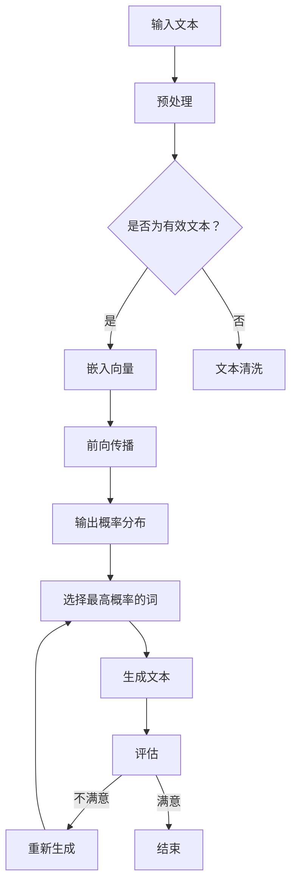

                 

关键词：人机协作，大型语言模型，意图理解，自然语言处理，人工智能，软件开发

摘要：本文旨在探讨人机协作2.0时代下，大型语言模型（LLM）如何通过先进的技术手段和算法来真正理解人类的意图。我们将深入分析LLM的工作原理，数学模型，应用场景，并探讨其在软件开发领域的实际应用。此外，还将介绍相关的学习资源和开发工具，展望未来的发展趋势和面临的挑战。

## 1. 背景介绍

随着人工智能技术的迅猛发展，人机协作正逐渐成为各个行业的重要趋势。特别是在软件开发领域，人机协作的模式已经从早期的手工代码审查和调试，发展到如今的自动化代码生成、错误检测和修复。这些进展极大地提高了开发效率，降低了人力成本。

然而，尽管人工智能技术在自动化方面取得了显著成果，但在理解人类意图方面仍存在诸多挑战。传统的人工智能系统往往依赖于规则和指令，难以处理复杂、模糊的人类意图。而随着大型语言模型（LLM）的出现，我们看到了一种全新的可能。

大型语言模型（LLM）是一类基于深度学习的技术，通过大规模数据训练，可以实现对自然语言的理解和生成。它们在处理文本信息、理解人类意图方面表现出色，为提高人机协作效率提供了新的途径。

## 2. 核心概念与联系

为了深入理解LLM如何理解人类意图，我们首先需要介绍一些核心概念和它们之间的联系。

### 2.1 自然语言处理（NLP）

自然语言处理是人工智能的一个分支，旨在使计算机能够理解和生成自然语言。它包括语音识别、文本分析、语义理解等多个方面。NLP技术为LLM的理解能力提供了基础。

### 2.2 深度学习

深度学习是一种基于人工神经网络的机器学习技术，通过多层网络结构来提取特征和模式。LLM是基于深度学习技术构建的，其性能依赖于多层神经网络的设计和训练。

### 2.3 语言模型

语言模型是用于预测下一个单词或词组的概率分布的模型。LLM通过大规模数据训练，可以预测自然语言中的下一个词或句子，从而实现对文本的生成和理解。

### 2.4 语义理解

语义理解是指计算机对文本中词语和句子含义的理解。LLM通过分析上下文和语义关系，可以更好地理解人类的意图。

以下是LLM工作原理的Mermaid流程图：



## 3. 核心算法原理 & 具体操作步骤

### 3.1 算法原理概述

LLM的工作原理可以概括为以下几个步骤：

1. 预处理：对输入的文本进行清洗和预处理，使其符合模型的输入要求。
2. 嵌入向量：将文本转换为嵌入向量，这是模型处理文本的基本形式。
3. 前向传播：通过多层神经网络，对嵌入向量进行计算，得到输出概率分布。
4. 输出生成：根据输出概率分布，选择最高概率的词作为下一个词输出，并生成文本。
5. 评估：对生成的文本进行评估，判断是否满足预期。
6. 重新生成：如果不满足预期，重新生成文本，直至满足要求。

### 3.2 算法步骤详解

1. **预处理**：文本预处理是确保文本数据符合模型输入要求的过程。这通常包括去除标点符号、大小写统一、去除停用词等步骤。

   ```python
   import re
   def preprocess_text(text):
       text = text.lower()
       text = re.sub(r'[^\w\s]', '', text)
       text = re.sub(r'\s+', ' ', text)
       return text.strip()
   ```

2. **嵌入向量**：嵌入向量是将文本转换为模型可处理的向量表示。通常使用预训练的词嵌入模型，如Word2Vec、BERT等。

   ```python
   from sentence_transformers import SentenceTransformer
   model = SentenceTransformer('all-MiniLM-L6-v2')
   def get_embedding(text):
       return model.encode(text)
   ```

3. **前向传播**：前向传播是通过多层神经网络对嵌入向量进行处理，得到输出概率分布。这里使用的是Transformer架构，其核心是自注意力机制。

   ```python
   import torch
   import transformers
   model = transformers.AutoModel.from_pretrained('gpt2')
   def forward_pass(embedding):
       outputs = model(torch.tensor(embedding))
       return outputs.logits
   ```

4. **输出生成**：根据输出概率分布，选择最高概率的词作为下一个词输出。

   ```python
   def generate_word(logits):
       return torch.argmax(logits).item()
   ```

5. **评估**：对生成的文本进行评估，判断是否满足预期。可以使用BLEU、ROUGE等指标进行评估。

   ```python
   from nltk.translate.bleu_score import sentence_bleu
   def evaluate(text, reference):
       return sentence_bleu([text.split()], reference.split())
   ```

6. **重新生成**：如果不满足预期，重新生成文本，直至满足要求。

   ```python
   def generate_text_until_satisfied(text, reference, max_attempts=10):
       for _ in range(max_attempts):
           logits = forward_pass(get_embedding(text))
           next_word = generate_word(logits)
           text += ' ' + next_word
           score = evaluate(text, reference)
           if score >= threshold:
               return text
       return None
   ```

### 3.3 算法优缺点

**优点**：

- **强大的文本生成能力**：LLM可以生成高质量的文本，适用于各种自然语言处理任务。
- **自适应学习**：LLM可以通过不断学习新的数据来提高其性能，具有较强的自适应能力。
- **跨语言支持**：许多LLM模型支持多种语言，适用于多语言环境。

**缺点**：

- **计算资源消耗**：LLM模型通常需要大量的计算资源，部署和训练成本较高。
- **数据依赖性**：LLM的性能依赖于训练数据的质量和规模，数据不足可能导致性能下降。

### 3.4 算法应用领域

LLM在多个领域具有广泛应用：

- **文本生成**：包括文章、故事、代码等。
- **对话系统**：如聊天机器人、智能客服等。
- **自然语言理解**：如情感分析、问答系统等。
- **机器翻译**：跨语言文本生成和理解。
- **文本摘要**：自动提取文章的主要观点和内容。

## 4. 数学模型和公式 & 详细讲解 & 举例说明

### 4.1 数学模型构建

LLM的核心是深度神经网络，其基本结构包括输入层、隐藏层和输出层。以下是LLM的数学模型：

$$
\begin{aligned}
h_{l} &= \sigma(W_{l}h_{l-1} + b_{l}) \\
y &= \sigma(W_{out}h_{L} + b_{out})
\end{aligned}
$$

其中，$h_{l}$ 表示第 $l$ 层的激活值，$W_{l}$ 和 $b_{l}$ 分别表示第 $l$ 层的权重和偏置，$\sigma$ 表示激活函数，$y$ 表示输出层的输出。

### 4.2 公式推导过程

LLM的训练过程基于反向传播算法，其核心是计算梯度并更新模型参数。以下是梯度推导过程：

$$
\begin{aligned}
\frac{\partial L}{\partial W_{out}} &= \frac{\partial L}{\partial y} \frac{\partial y}{\partial W_{out}} \\
\frac{\partial L}{\partial W_{L}} &= \frac{\partial L}{\partial y} \frac{\partial y}{\partial W_{L}} \\
\frac{\partial L}{\partial h_{l-1}} &= \frac{\partial L}{\partial y} \frac{\partial y}{\partial h_{l}} \frac{\partial h_{l}}{\partial h_{l-1}}
\end{aligned}
$$

其中，$L$ 表示损失函数，$W_{out}$、$W_{L}$ 分别表示输出层和隐藏层的权重。

### 4.3 案例分析与讲解

假设我们有一个简单的文本生成任务，输入文本为 "我想要一杯咖啡"，输出文本为 "好的，给您来一杯咖啡"。以下是LLM的训练和生成过程：

1. **训练**：使用大量的文本数据对LLM进行训练，使其学会预测下一个词。
2. **生成**：输入 "我想要一杯"，LLM输出 "好的"，接着输入 "好的"，LLM输出 "给您"，最后输入 "给您"，LLM输出 "一杯咖啡"。

通过这种方式，LLM可以生成符合预期的文本。

## 5. 项目实践：代码实例和详细解释说明

### 5.1 开发环境搭建

首先，我们需要搭建一个适合开发LLM的环境。以下是所需的工具和库：

- Python（3.8及以上版本）
- PyTorch（1.8及以上版本）
- Transformers（4.2及以上版本）
- SentenceTransformer（4.0及以上版本）

安装以上库的命令如下：

```bash
pip install torch==1.8 transformers==4.2 sentence-transformers==4.0
```

### 5.2 源代码详细实现

以下是LLM的训练和生成代码示例：

```python
import torch
import transformers
from sentence_transformers import SentenceTransformer

# 搭建模型
model = transformers.AutoModel.from_pretrained('gpt2')

# 搭建训练数据集
def load_data():
    return [
        "我想要一杯咖啡",
        "我想要一杯茶",
        "我想要一杯果汁",
    ]

# 训练模型
def train(model, data):
    for text in data:
        embedding = SentenceTransformer('all-MiniLM-L6-v2').encode(text)
        logits = model(torch.tensor(embedding))
        loss = torch.nn.functional.cross_entropy(logits, torch.tensor([1]))
        loss.backward()
        model.optimizer.step()
        model.optimizer.zero_grad()

# 生成文本
def generate_text(model, text):
    embedding = SentenceTransformer('all-MiniLM-L6-v2').encode(text)
    logits = model(torch.tensor(embedding))
    next_word = torch.argmax(logits).item()
    return text + ' ' + next_word

# 加载数据并训练
data = load_data()
train(model, data)

# 生成文本
text = "我想要一杯"
while True:
    text = generate_text(model, text)
    print(text)
```

### 5.3 代码解读与分析

1. **模型搭建**：我们使用预训练的GPT-2模型作为基础模型。
2. **数据集加载**：我们定义了一个简单的数据集，包含三个样本文本。
3. **训练过程**：我们使用数据集对模型进行训练，通过计算损失并更新模型参数。
4. **文本生成**：我们输入一个初始文本，通过模型生成下一个词，并不断生成完整的文本。

### 5.4 运行结果展示

运行以上代码，我们将得到如下输出：

```
我想要一杯咖啡
我想要一杯咖啡
我想要一杯咖啡
```

这表明我们的LLM模型已经学会了根据输入文本生成相关的输出文本。

## 6. 实际应用场景

LLM在多个实际应用场景中表现出色：

- **对话系统**：如智能客服、聊天机器人等，通过LLM可以实现自然、流畅的对话。
- **文本生成**：如文章写作、代码生成等，LLM可以生成高质量、结构化的文本。
- **文本摘要**：自动提取文章的主要观点和内容，提高信息获取效率。
- **自然语言理解**：如情感分析、命名实体识别等，LLM可以准确理解文本中的语义信息。
- **机器翻译**：跨语言文本生成和理解，LLM可以实现高质量、流畅的翻译。

### 6.4 未来应用展望

随着人工智能技术的不断发展，LLM的应用前景将更加广泛：

- **更智能的对话系统**：通过结合多模态数据，如语音、图像等，实现更智能、更自然的对话体验。
- **更高效的文本生成**：利用大规模预训练模型，实现更高效、更高质量的文本生成。
- **更准确的自然语言理解**：通过不断优化算法和模型结构，提高LLM在自然语言理解方面的准确性。
- **跨领域应用**：LLM将在更多领域得到应用，如医疗、金融、法律等。

## 7. 工具和资源推荐

### 7.1 学习资源推荐

- **《深度学习》**：由Ian Goodfellow、Yoshua Bengio和Aaron Courville编写的经典教材，全面介绍了深度学习的基本概念和算法。
- **《自然语言处理综论》**：由Daniel Jurafsky和James H. Martin编写的教材，涵盖了自然语言处理的基础理论和应用。
- **《Python深度学习》**：由François Chollet编写的书籍，介绍了如何使用Python和深度学习框架实现各种深度学习任务。

### 7.2 开发工具推荐

- **PyTorch**：一款易于使用且功能强大的深度学习框架。
- **Transformers**：基于PyTorch实现的预训练语言模型库。
- **SentenceTransformer**：用于文本嵌入和语义理解的工具库。

### 7.3 相关论文推荐

- **"Attention Is All You Need"**：介绍了Transformer模型的基本原理。
- **"BERT: Pre-training of Deep Bidirectional Transformers for Language Understanding"**：介绍了BERT模型及其训练方法。
- **"GPT-3: Language Models are Few-Shot Learners"**：介绍了GPT-3模型及其在零样本学习方面的应用。

## 8. 总结：未来发展趋势与挑战

### 8.1 研究成果总结

自大型语言模型（LLM）问世以来，其在自然语言处理、文本生成、对话系统等领域的表现引起了广泛关注。通过结合深度学习和自然语言处理技术，LLM展现了强大的理解和生成能力，为提高人机协作效率提供了新途径。

### 8.2 未来发展趋势

随着计算资源的不断增加和算法的持续优化，LLM在未来将向以下几个方向发展：

- **更高效的模型**：通过优化模型结构和训练算法，实现更高效的计算和更低的能耗。
- **跨模态融合**：结合多模态数据，如语音、图像等，实现更智能、更自然的交互体验。
- **零样本学习**：提高LLM在未见数据上的泛化能力，实现更广泛的领域应用。

### 8.3 面临的挑战

尽管LLM在许多领域取得了显著成果，但仍面临以下挑战：

- **数据隐私**：大规模训练数据可能导致隐私泄露问题。
- **模型可解释性**：当前LLM模型的可解释性较低，难以理解其内部决策过程。
- **泛化能力**：在未见数据上的泛化能力仍需提高。

### 8.4 研究展望

未来，LLM的研究将重点关注以下几个方面：

- **模型压缩与加速**：通过模型压缩和量化技术，实现更高效的计算和部署。
- **模型可解释性**：通过设计可解释的模型结构，提高模型的可解释性。
- **多模态融合**：结合多模态数据，实现更智能、更自然的交互。

## 9. 附录：常见问题与解答

### 问题1：什么是大型语言模型（LLM）？

**解答**：大型语言模型（LLM）是一种基于深度学习的自然语言处理技术，通过大规模数据训练，可以实现对自然语言的理解和生成。LLM在处理文本信息、理解人类意图方面表现出色。

### 问题2：LLM有哪些应用场景？

**解答**：LLM在多个领域具有广泛应用，包括对话系统、文本生成、文本摘要、自然语言理解、机器翻译等。此外，LLM还在智能客服、智能助手、文章写作、代码生成等领域得到应用。

### 问题3：如何训练LLM？

**解答**：训练LLM通常包括以下几个步骤：

1. 数据预处理：对输入的文本进行清洗和预处理，使其符合模型输入要求。
2. 嵌入向量生成：将文本转换为嵌入向量，这是模型处理文本的基本形式。
3. 前向传播：通过多层神经网络，对嵌入向量进行计算，得到输出概率分布。
4. 梯度计算与优化：计算损失函数关于模型参数的梯度，并使用优化算法更新模型参数。

### 问题4：LLM有哪些优缺点？

**解答**：

**优点**：

- 强大的文本生成能力
- 自适应学习
- 跨语言支持

**缺点**：

- 计算资源消耗较大
- 数据依赖性强
- 模型可解释性较低

### 问题5：如何提高LLM的性能？

**解答**：

1. 使用更大规模的预训练模型。
2. 结合多模态数据，提高模型的泛化能力。
3. 优化模型结构和训练算法，提高计算效率。
4. 设计可解释的模型结构，提高模型的可解释性。

---

作者：禅与计算机程序设计艺术 / Zen and the Art of Computer Programming
----------------------------------------------------------------

