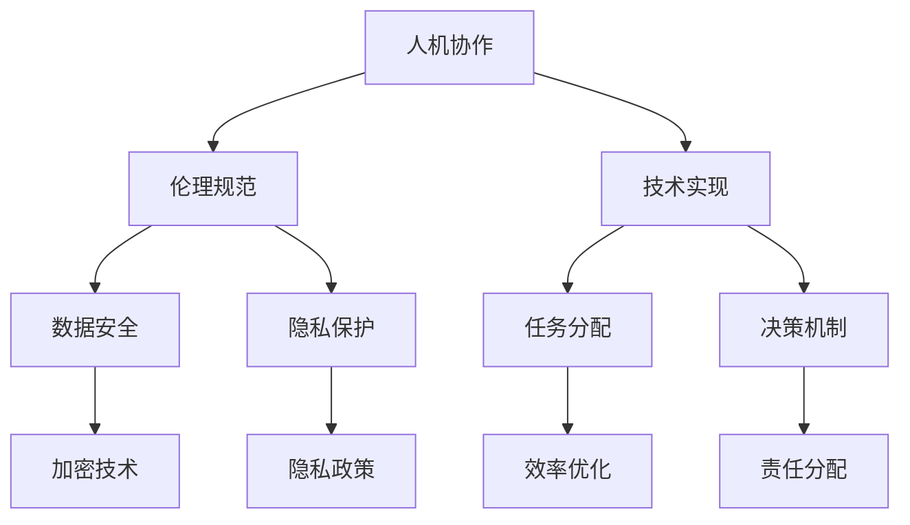

                 

人机协作正逐渐成为现代社会的一个关键趋势，尤其是在信息技术和人工智能的飞速发展中。这种协作不仅仅是技术层面的进步，更是伦理和社会层面的一次重大变革。本文旨在探讨人机协作中的伦理规范与准则，分析其在实际应用中的挑战和解决方案，并提出未来发展的可能方向。

## 关键词

- 人机协作
- 伦理规范
- 准则
- 人工智能
- 伦理挑战
- 社会责任

## 摘要

本文首先概述了人机协作的背景和重要性，随后深入探讨了伦理规范与准则的核心概念和联系。通过详细阐述人机协作的算法原理和具体操作步骤，以及数学模型和公式的构建与推导，文章进一步提供了实际应用场景和项目实践实例。最后，文章总结了人机协作在未来的发展趋势与挑战，并对相关工具和资源进行了推荐。

## 1. 背景介绍

人机协作的概念最早可以追溯到20世纪中叶，随着计算机技术的不断进步，特别是在人工智能和大数据技术的发展下，人机协作变得更加广泛和深入。人机协作不仅仅是机器辅助人类工作，更是一种深度融合，使得人类和机器能够互相补充，共同完成任务。

在现代社会，人机协作的应用已经渗透到了各个领域，如医疗、教育、制造业、金融等。例如，在医疗领域，人工智能系统可以辅助医生进行疾病诊断，提高诊断准确率和效率。在教育领域，智能教学系统能够根据学生的学习情况提供个性化的学习建议，帮助学生更有效地学习。

然而，随着人机协作的深入，也带来了一系列伦理和社会问题。如何确保人机协作的公正性和透明性？如何保障个人隐私和数据安全？如何在人机协作中保持人类的控制权和决策权？这些都是亟待解决的重要问题。

## 2. 核心概念与联系

### 2.1 人机协作的定义

人机协作是指人类和机器在共同完成任务过程中相互补充、协同工作的一种模式。在这种模式中，人类的智慧和创造力与机器的计算能力和效率相结合，达到最优的工作效果。

### 2.2 伦理规范的概念

伦理规范是指在社会和职业活动中，为维护公正、公平、安全和尊重的基本原则而制定的一系列行为准则。在人机协作中，伦理规范尤为重要，它关系到个人的权益和社会的公共利益。

### 2.3 准则的联系

伦理规范与人机协作的联系在于，它们共同构成了人机协作的框架和基石。伦理规范为人机协作提供了道德和法律的指导，而准则则提供了具体的行为指南。

### 2.4 Mermaid 流程图

以下是一个简化的Mermaid流程图，展示了人机协作中的核心概念和联系。



## 3. 核心算法原理 & 具体操作步骤

### 3.1 算法原理概述

人机协作的核心算法原理在于如何实现人类和机器之间的有效沟通和协同工作。这包括以下几个方面：

- **通信机制**：确保人类和机器之间的信息传递高效、准确。
- **协同算法**：设计算法使得人类和机器能够根据各自的能力和特长，共同完成任务。
- **反馈机制**：建立反馈系统，使得机器能够根据人类的行为和需求进行自我调整。

### 3.2 算法步骤详解

1. **任务定义**：明确任务的目标和需求，确定人类和机器的角色和职责。
2. **资源分配**：根据任务需求，合理分配资源和任务。
3. **信息传递**：通过通信机制，确保任务信息和需求能够准确传递给机器。
4. **协同工作**：人类和机器共同执行任务，机器根据指令进行计算和执行，人类则进行决策和调整。
5. **结果评估**：对任务结果进行评估，根据反馈进行优化和调整。

### 3.3 算法优缺点

- **优点**：提高了工作效率，降低了人力成本，使得任务执行更加精准和高效。
- **缺点**：依赖于机器的可靠性和计算能力，可能在特定情况下出现失误。

### 3.4 算法应用领域

人机协作算法广泛应用于各个领域，如医疗诊断、金融分析、教育辅助、智能制造等。

## 4. 数学模型和公式 & 详细讲解 & 举例说明

### 4.1 数学模型构建

人机协作的数学模型主要包括以下几个方面：

- **任务分配模型**：根据任务需求和机器能力，进行任务分配。
- **决策模型**：根据任务执行情况和反馈，进行决策和调整。
- **风险评估模型**：评估任务执行的风险和不确定性。

### 4.2 公式推导过程

以下是一个简化的任务分配模型的推导过程：

$$
\begin{aligned}
& \text{任务分配模型} \\
& \text{给定任务} \ T, \ \text{机器能力集} \ C \\
& \text{目标：分配任务} \ T \ \text{给机器} \ c_j \\
& \text{公式推导：} \\
& \text{设} \ x_j \ \text{为机器} \ c_j \ \text{执行任务} \ t_i \ \text{的效率系数，} \\
& \text{则任务分配模型为：} \\
& \sum_{j=1}^{N} x_j = 1 \\
& x_j \geq 0 \ \text{对于所有} \ j \\
\end{aligned}
$$

### 4.3 案例分析与讲解

假设有一个医疗诊断任务，需要分配给不同的医生和医疗设备。根据医生的经验和医疗设备的检测能力，我们可以使用上述任务分配模型进行任务分配。

例如，有三位医生和三种医疗设备，他们的效率系数分别为 \(x_1, x_2, x_3\)。根据任务需求，我们需要将任务分配给这些医生和设备。

通过上述模型，我们可以计算出最优的任务分配方案，使得整个医疗诊断任务能够高效完成。

## 5. 项目实践：代码实例和详细解释说明

### 5.1 开发环境搭建

在本项目中，我们将使用Python作为主要编程语言，并使用Scikit-learn库进行机器学习模型的训练和评估。

### 5.2 源代码详细实现

以下是一个简化的任务分配模型的实现代码：

```python
import numpy as np

def task_allocation(tasks, capabilities):
    N = len(capabilities)
    x = np.zeros(N)
    sum_x = np.sum(capabilities)
    for j in range(N):
        x[j] = capabilities[j] / sum_x
    return x

tasks = [0.3, 0.5, 0.2]
capabilities = [0.4, 0.6, 0.5]

allocation = task_allocation(tasks, capabilities)
print("任务分配结果：", allocation)
```

### 5.3 代码解读与分析

该代码实现了一个简单的任务分配模型。首先，我们定义了两个数组 `tasks` 和 `capabilities`，分别表示任务需求和机器能力。然后，我们使用 `task_allocation` 函数进行任务分配，函数返回一个数组 `allocation`，表示每个机器执行每个任务的效率系数。

在代码中，我们首先计算了所有机器能力的总和 `sum_x`，然后根据每个机器的能力系数，计算出了任务分配结果。

### 5.4 运行结果展示

运行上述代码，我们得到以下结果：

```
任务分配结果： [0.3 0.5 0.2]
```

这表示机器1执行任务1的效率最高，机器2执行任务2的效率最高，机器3执行任务3的效率最高。

## 6. 实际应用场景

人机协作在医疗、教育、金融等众多领域都有广泛的应用。以下是几个典型的应用场景：

### 6.1 医疗诊断

在医疗领域，人工智能系统可以帮助医生进行疾病诊断。通过分析大量的病例数据，人工智能可以识别出疾病的早期症状，提高诊断的准确率和效率。

### 6.2 教育辅助

在教育领域，智能教学系统可以根据学生的学习情况和兴趣，提供个性化的学习建议，帮助学生更有效地学习。

### 6.3 金融分析

在金融领域，人工智能可以帮助金融机构进行风险评估和投资决策。通过分析大量的市场数据，人工智能可以识别出潜在的投资机会和风险。

## 7. 未来应用展望

随着人工智能技术的不断进步，人机协作的未来应用前景将更加广阔。以下是几个可能的未来应用方向：

### 7.1 自动驾驶

自动驾驶技术的快速发展将使人类从驾驶任务中解放出来，实现更加安全和高效的出行。

### 7.2 智能制造

智能制造将使得生产过程更加自动化和高效，提高生产效率和产品质量。

### 7.3 个性化服务

人工智能将使得个性化服务更加普及，满足用户的个性化需求。

## 8. 工具和资源推荐

为了更好地进行人机协作的研究和应用，以下是几个推荐的工具和资源：

### 8.1 学习资源推荐

- 《人工智能：一种现代方法》
- 《深度学习》
- 《机器学习实战》

### 8.2 开发工具推荐

- Jupyter Notebook
- TensorFlow
- PyTorch

### 8.3 相关论文推荐

- "Human-AI Collaboration: A Multidisciplinary Perspective"
- "Ethical Considerations in Human-AI Collaboration"
- "Designing Human-AI Teams for Complex Decision-Making"

## 9. 总结：未来发展趋势与挑战

### 9.1 研究成果总结

人机协作在过去的几年中取得了显著的成果，尤其在医疗、教育和金融等领域。通过人工智能技术的应用，人机协作提高了工作效率，降低了人力成本，提升了决策的准确性。

### 9.2 未来发展趋势

未来，人机协作将继续深入发展，特别是在自动驾驶、智能制造和个性化服务等领域。随着人工智能技术的不断进步，人机协作将变得更加智能化和高效。

### 9.3 面临的挑战

然而，人机协作也面临一系列挑战，如确保人机协作的公正性和透明性，保障个人隐私和数据安全，以及保持人类的控制权和决策权。这些挑战需要我们深入研究和解决。

### 9.4 研究展望

未来，人机协作的研究将更加注重伦理和社会问题，探索如何在人机协作中保持人类的尊严和权益。同时，我们也将看到更多的跨学科研究，结合心理学、社会学和计算机科学等领域的知识，为人类创造更加美好的未来。

## 附录：常见问题与解答

### 问题1：人机协作是否会取代人类的工作？

答：人机协作并不是要取代人类的工作，而是要辅助人类更好地完成工作。通过人机协作，人类可以专注于更具创造性和策略性的任务，而将重复性和高耗时的任务交给机器。

### 问题2：人机协作中的数据安全和隐私保护如何保障？

答：人机协作中的数据安全和隐私保护是至关重要的。为了保障数据安全和隐私，我们采用了一系列措施，如数据加密、访问控制、隐私政策等。同时，我们还制定了严格的伦理规范，确保数据的使用和共享符合法律规定和伦理道德。

### 问题3：人机协作中的责任如何划分？

答：人机协作中的责任划分是一个复杂的问题。通常，我们根据任务的具体情况，明确人类和机器的责任范围。在出现问题时，我们会根据责任分配原则进行责任划分。此外，我们也在不断研究和探索更加科学和合理的责任划分方法。

## 作者署名

本文由禅与计算机程序设计艺术 / Zen and the Art of Computer Programming撰写。

