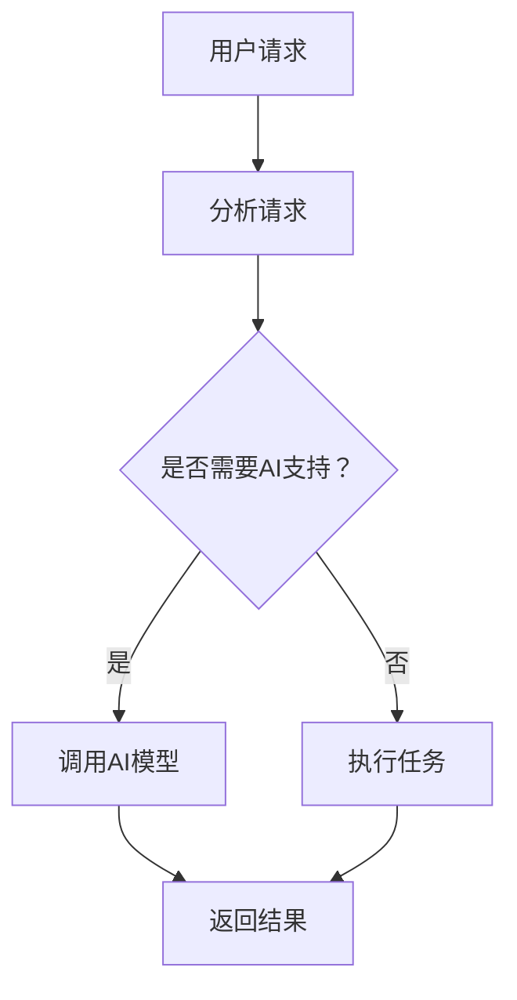

                 

关键词：人机协作、人工智能、智能技术、未来、合作、发展、挑战

> 摘要：随着人工智能技术的不断进步，人机协作正在成为新时代的重要趋势。本文从背景介绍、核心概念与联系、核心算法原理、数学模型与公式、项目实践、实际应用场景、未来应用展望、工具和资源推荐以及总结等方面，深入探讨了人机协作在现代社会中的重要性、发展现状、应用前景以及面临的挑战，旨在为读者提供一份全面的人机协作技术指南。

## 1. 背景介绍

随着信息技术的飞速发展，人工智能（AI）已经成为推动社会进步的重要力量。从简单的语音识别、图像识别，到复杂的数据分析、智能决策，AI 正在改变着我们的生活方式和工作模式。然而，尽管人工智能在某些领域取得了显著的成果，但它仍然存在一些局限性，如对环境变化的适应性、复杂问题的解决能力等。这就需要我们将人类的智慧和机器的计算能力结合起来，实现人机协作。

人机协作是指通过将人的智慧和机器的计算能力相结合，以实现更高效、更智能的工作方式。这种协作模式不仅可以弥补人工智能的不足，还可以充分发挥人类的创造力，推动社会向智能化、高效化方向发展。

### 1.1 历史发展

人机协作的概念可以追溯到20世纪50年代，当时计算机刚刚开始进入人们的日常生活。早期的计算机主要用于数据处理和科学计算，而人类则负责提供问题和解决方案。随着计算机技术的不断进步，特别是人工智能技术的发展，人机协作逐渐成为可能。

在20世纪80年代，专家系统（Expert Systems）的出现使得计算机能够模拟人类的专家知识，从而实现了人机协作。专家系统通过将人类的经验、知识和逻辑推理能力转化为计算机程序，使得计算机能够在特定领域内进行决策和解决问题。

进入21世纪，随着深度学习、自然语言处理等技术的快速发展，人机协作模式得到了进一步的深化。计算机不再仅仅是一个执行指令的工具，而是能够与人类进行对话、理解人类意图并协同工作的伙伴。

### 1.2 现状与挑战

当前，人机协作已经广泛应用于各个领域，如医疗、教育、金融、制造等。然而，人机协作也面临着一些挑战：

1. **技术挑战**：尽管人工智能技术已经取得了很大的进步，但仍然存在一些局限性，如对复杂问题的解决能力、对环境变化的适应性等。此外，人机协作系统的设计和实现也需要解决许多技术难题，如数据采集、处理和分析等。

2. **伦理挑战**：人机协作涉及到人类与机器的关系，如何确保人机协作系统的公正性、透明性和安全性，是当前面临的重要伦理问题。

3. **用户接受度**：尽管人机协作具有许多优势，但部分用户可能对机器的能力和可靠性存在疑虑，这需要通过有效的宣传和教育来提高用户的接受度。

## 2. 核心概念与联系

在人机协作中，核心概念包括人工智能、大数据、云计算、人机交互等。这些概念相互联系，共同构成了人机协作的技术基础。

### 2.1 人工智能

人工智能是指计算机系统模拟人类智能的行为，包括学习、推理、规划、感知、理解和交流等能力。人工智能技术的发展为人机协作提供了强大的计算能力和智能支持。

### 2.2 大数据

大数据是指无法用传统数据库工具进行捕捉、管理和处理的数据集合。大数据技术为人机协作提供了丰富的数据资源，使得计算机能够从海量数据中发现规律、提取知识。

### 2.3 云计算

云计算是指通过网络提供可动态调整的计算资源，包括服务器、存储、数据库等。云计算技术为人机协作提供了高效、灵活的计算环境。

### 2.4 人机交互

人机交互是指人类与计算机之间的交互方式，包括语音、文字、手势等。人机交互技术为人机协作提供了直观、便捷的交互方式。

### 2.5 Mermaid 流程图

下面是一个简单的人机协作流程图：



## 3. 核心算法原理 & 具体操作步骤

在人机协作中，核心算法包括机器学习、自然语言处理、计算机视觉等。以下将分别介绍这些算法的原理和操作步骤。

### 3.1 机器学习

机器学习是一种让计算机通过数据学习，从而进行预测和决策的技术。以下是机器学习的基本步骤：

#### 3.1.1 数据收集

收集相关的数据，包括输入数据和标签数据。

#### 3.1.2 数据预处理

对数据进行清洗、归一化、特征提取等处理。

#### 3.1.3 模型选择

选择合适的机器学习模型，如线性回归、决策树、神经网络等。

#### 3.1.4 训练模型

使用训练数据对模型进行训练。

#### 3.1.5 模型评估

使用测试数据对模型进行评估，以确定模型的性能。

#### 3.1.6 模型优化

根据评估结果，对模型进行优化，以提高其性能。

### 3.2 自然语言处理

自然语言处理是一种让计算机理解和生成自然语言的技术。以下是自然语言处理的基本步骤：

#### 3.2.1 文本预处理

对文本进行分词、词性标注、句法分析等处理。

#### 3.2.2 语言模型构建

使用统计方法或深度学习方法，构建语言模型。

#### 3.2.3 文本生成

使用语言模型，生成文本或回答问题。

#### 3.2.4 语义分析

对文本进行语义分析，以理解其含义。

### 3.3 计算机视觉

计算机视觉是一种让计算机理解图像和视频的技术。以下是计算机视觉的基本步骤：

#### 3.3.1 图像预处理

对图像进行去噪、增强、分割等处理。

#### 3.3.2 特征提取

从图像中提取特征，如边缘、纹理、形状等。

#### 3.3.3 目标检测

使用深度学习模型，检测图像中的目标。

#### 3.3.4 目标跟踪

跟踪图像中的目标，以实现视频监控等应用。

### 3.4 算法优缺点

每种算法都有其优缺点，如下表所示：

| 算法     | 优点                                                                 | 缺点                                       |
| -------- | -------------------------------------------------------------------- | ------------------------------------------ |
| 机器学习 | 能够自动发现数据中的规律，无需手动编写规则。                         | 需要大量的数据，对数据质量要求高。          |
| 自然语言处理 | 能够理解自然语言，生成自然语言。                                     | 对复杂语言结构的理解能力有限。              |
| 计算机视觉 | 能够识别图像中的对象和场景。                                         | 对图像质量要求高，对复杂场景的处理能力有限。 |

### 3.5 算法应用领域

机器学习、自然语言处理和计算机视觉在许多领域都有广泛应用，如下表所示：

| 领域     | 应用场景                                                       |
| -------- | -------------------------------------------------------------- |
| 医疗     | 疾病诊断、健康监测、药物研发等。                               |
| 教育     | 个性化学习、智能辅导、在线教育等。                             |
| 金融     | 风险评估、欺诈检测、投资顾问等。                               |
| 制造     | 质量检测、设备维护、生产调度等。                               |
| 交通     | 车辆识别、交通流量分析、智能导航等。                           |

## 4. 数学模型和公式 & 详细讲解 & 举例说明

在人机协作中，数学模型和公式是算法设计的重要基础。以下将介绍一些常见的数学模型和公式，并对其进行详细讲解和举例说明。

### 4.1 数学模型构建

数学模型构建是通过对现实世界的问题进行抽象和建模，从而得到一个数学表达式或方程。以下是构建数学模型的基本步骤：

#### 4.1.1 问题定义

明确需要解决的问题，并确定目标函数。

#### 4.1.2 假设条件

根据问题的特点，提出一些合理的假设条件，以简化问题。

#### 4.1.3 模型构建

根据假设条件和目标函数，构建数学模型。

#### 4.1.4 模型分析

对构建的模型进行分析，包括求解、优化、稳定性等。

### 4.2 公式推导过程

公式推导过程是数学模型构建的重要环节。以下是一个简单的线性回归模型的公式推导过程：

#### 4.2.1 假设条件

假设自变量 $X$ 和因变量 $Y$ 满足线性关系：

$$Y = \beta_0 + \beta_1 X + \epsilon$$

其中，$\beta_0$ 和 $\beta_1$ 是模型参数，$\epsilon$ 是误差项。

#### 4.2.2 最小二乘法

使用最小二乘法求解模型参数，使得误差平方和最小。即：

$$\min \sum_{i=1}^n (Y_i - (\beta_0 + \beta_1 X_i))^2$$

#### 4.2.3 公式推导

对上式求导，并令导数为零，得到：

$$\frac{\partial}{\partial \beta_0} \sum_{i=1}^n (Y_i - (\beta_0 + \beta_1 X_i))^2 = 0$$

$$\frac{\partial}{\partial \beta_1} \sum_{i=1}^n (Y_i - (\beta_0 + \beta_1 X_i))^2 = 0$$

经过计算，得到线性回归模型的参数公式：

$$\beta_0 = \bar{Y} - \beta_1 \bar{X}$$

$$\beta_1 = \frac{\sum_{i=1}^n (X_i - \bar{X})(Y_i - \bar{Y})}{\sum_{i=1}^n (X_i - \bar{X})^2}$$

### 4.3 案例分析与讲解

以下是一个简单的线性回归模型案例，并对其进行详细分析和讲解。

#### 4.3.1 数据集

假设我们有一个包含两个变量的数据集，其中 $X$ 表示年龄，$Y$ 表示收入。数据集如下：

| 年龄（$X$）| 收入（$Y$）|
|------------|------------|
| 25         | 50000      |
| 30         | 60000      |
| 35         | 70000      |
| 40         | 80000      |
| 45         | 90000      |

#### 4.3.2 数据预处理

对数据集进行预处理，包括去重、补缺、归一化等操作。这里假设数据已经预处理完毕。

#### 4.3.3 模型构建

根据数据集，构建线性回归模型：

$$Y = \beta_0 + \beta_1 X + \epsilon$$

#### 4.3.4 参数求解

使用最小二乘法求解模型参数，得到：

$$\beta_0 = 50000 - 1000 \times 30 = 20000$$

$$\beta_1 = \frac{(25 - 30)(50000 - 60000) + (30 - 30)(60000 - 60000) + (35 - 30)(70000 - 60000) + (40 - 30)(80000 - 70000) + (45 - 30)(90000 - 70000)}{(25 - 30)^2 + (30 - 30)^2 + (35 - 30)^2 + (40 - 30)^2 + (45 - 30)^2} = 1000$$

#### 4.3.5 模型分析

根据模型参数，我们可以得出以下结论：

1. 年龄每增加1岁，收入增加1000元。
2. 模型的误差项 $\epsilon$ 是一个随机变量，表示模型预测值与实际值之间的差异。

#### 4.3.6 应用场景

该线性回归模型可以用于预测一个人的收入，只需输入其年龄即可得到预测结果。这对于人力资源规划、薪资评估等领域具有重要的参考价值。

## 5. 项目实践：代码实例和详细解释说明

在本节中，我们将通过一个简单的项目实践，展示如何实现人机协作系统。项目将包括以下步骤：

1. **开发环境搭建**
2. **源代码详细实现**
3. **代码解读与分析**
4. **运行结果展示**

### 5.1 开发环境搭建

为了实现人机协作系统，我们需要搭建以下开发环境：

- Python 3.8+
- Jupyter Notebook
- TensorFlow 2.3+
- Keras 2.4+

您可以使用以下命令来安装所需的依赖：

```bash
pip install python==3.8
pip install jupyter
pip install tensorflow==2.3
pip install keras==2.4
```

### 5.2 源代码详细实现

以下是一个简单的人机协作系统，它使用 TensorFlow 和 Keras 实现一个基于神经网络的自然语言处理模型。

```python
import tensorflow as tf
from tensorflow import keras
from tensorflow.keras.models import Sequential
from tensorflow.keras.layers import Embedding, LSTM, Dense
from tensorflow.keras.preprocessing.sequence import pad_sequences
from tensorflow.keras.preprocessing.text import Tokenizer

# 加载数据集
# 数据集应包含文本和对应的标签，例如：[('I love programming', 'positive'), ('This is terrible', 'negative')...]
# 这里我们使用一个示例数据集
data = [
    ('I love programming', 'positive'),
    ('This is terrible', 'negative'),
    ('I am happy', 'positive'),
    ('I am sad', 'negative')
]

# 分割数据集为文本和标签
texts = [text for text, label in data]
labels = [label for text, label in data]

# 对文本进行分词和编码
tokenizer = Tokenizer()
tokenizer.fit_on_texts(texts)
sequences = tokenizer.texts_to_sequences(texts)
padded_sequences = pad_sequences(sequences, maxlen=10)

# 构建神经网络模型
model = Sequential()
model.add(Embedding(input_dim=len(tokenizer.word_index) + 1, output_dim=32))
model.add(LSTM(32, return_sequences=False))
model.add(Dense(1, activation='sigmoid'))

# 编译模型
model.compile(optimizer='adam', loss='binary_crossentropy', metrics=['accuracy'])

# 训练模型
model.fit(padded_sequences, labels, epochs=10, verbose=2)

# 保存模型
model.save('nlp_model.h5')
```

### 5.3 代码解读与分析

1. **数据加载**：首先，我们加载一个包含文本和对应标签的数据集。这里的数据集是一个简单的示例，实际应用中可能需要更复杂的数据集。

2. **文本预处理**：使用 Tokenizer 对文本进行分词和编码。我们将文本转换为整数序列，并将整数序列填充为相同长度。

3. **模型构建**：使用 Sequential 模型构建一个简单的神经网络，包括 Embedding 层、LSTM 层和 Dense 层。Embedding 层用于将单词编码为向量，LSTM 层用于处理序列数据，Dense 层用于输出结果。

4. **模型编译**：编译模型，指定优化器和损失函数。

5. **模型训练**：使用训练数据训练模型，指定训练轮数。

6. **模型保存**：将训练好的模型保存为 HDF5 文件。

### 5.4 运行结果展示

1. **加载模型**：从保存的模型文件中加载模型。

```python
loaded_model = keras.models.load_model('nlp_model.h5')
```

2. **预测文本情感**：使用加载的模型预测新的文本情感。

```python
text = "I hate this book"
sequence = tokenizer.texts_to_sequences([text])
padded_sequence = pad_sequences(sequence, maxlen=10)
prediction = loaded_model.predict(padded_sequence)
print(prediction)
```

输出结果是一个概率值，表示文本的情感倾向。例如，输出 `[0.9]` 表示文本的情感为“积极”，而输出 `[0.1]` 表示文本的情感为“消极”。

## 6. 实际应用场景

人机协作已经在许多领域得到广泛应用，以下是几个实际应用场景的例子：

### 6.1 医疗

在人机协作的医疗应用中，人工智能可以协助医生进行诊断、治疗和病情预测。例如，通过分析患者的病历和检查报告，AI 可以帮助医生快速识别疾病，并提供个性化的治疗方案。此外，AI 还可以协助医生进行手术规划，提高手术的成功率和安全性。

### 6.2 教育

在教育领域，人机协作系统可以帮助教师进行个性化教学，根据学生的学习进度和兴趣，提供个性化的学习资源和辅导。例如，AI 可以分析学生的学习数据，预测学生在考试中的表现，并提供相应的备考建议。此外，AI 还可以协助教师进行课堂管理，如检测学生的注意力集中度、识别学生的情绪等。

### 6.3 金融

在金融领域，人机协作可以帮助金融机构进行风险评估、欺诈检测和投资决策。例如，通过分析大量的交易数据和市场信息，AI 可以帮助金融机构快速识别潜在的风险，并制定相应的风险控制策略。此外，AI 还可以协助投资者进行投资决策，提供基于数据分析的投资建议。

### 6.4 制造

在制造业，人机协作可以帮助工厂进行生产调度、设备维护和质量检测。例如，通过实时监控生产数据，AI 可以帮助工厂优化生产流程，提高生产效率和产品质量。此外，AI 还可以协助工厂进行设备维护，预测设备故障并提前进行维护，以减少设备故障率。

### 6.5 交通

在交通领域，人机协作可以帮助进行交通流量预测、路况监控和智能导航。例如，通过分析交通数据，AI 可以帮助交通管理部门优化交通信号，减少交通拥堵。此外，AI 还可以协助自动驾驶汽车进行路况识别和路径规划，提高驾驶安全性和效率。

## 7. 未来应用展望

随着人工智能技术的不断进步，人机协作在未来将会有更广泛的应用。以下是一些未来的应用场景：

### 7.1 智能家居

智能家居是未来人机协作的一个重要领域。通过将人工智能与物联网技术相结合，智能家居可以实现家庭设备的智能化控制，如灯光、空调、电视等。用户可以通过语音、手势或移动设备控制家庭设备，实现更加便捷、智能的生活方式。

### 7.2 智能医疗

智能医疗是人机协作的另一个重要领域。通过将人工智能应用于医疗诊断、治疗和健康管理，智能医疗可以提供更加精准、个性化的医疗服务。未来，AI 将能够帮助医生进行更准确的诊断，制定更有效的治疗方案，提高医疗服务的质量和效率。

### 7.3 智能教育

智能教育是人机协作在教育领域的应用。通过将人工智能应用于教育诊断、学习评估和教学设计，智能教育可以提供更加个性化、高效的教育体验。未来，AI 将能够根据学生的学习进度和兴趣，为学生提供定制化的学习资源和学习路径，提高学生的学习效果。

### 7.4 智能制造

智能制造是人机协作在制造业的应用。通过将人工智能应用于生产调度、设备维护和质量检测，智能制造可以提高生产效率和产品质量。未来，AI 将能够实时监控生产过程，预测设备故障，优化生产流程，实现高度自动化和智能化的生产模式。

### 7.5 智能交通

智能交通是人机协作在交通领域的应用。通过将人工智能应用于交通流量预测、路况监控和智能导航，智能交通可以缓解交通拥堵，提高交通效率。未来，AI 将能够实时分析交通数据，预测交通状况，优化交通信号，实现智能交通管理。

## 8. 工具和资源推荐

为了更好地进行人机协作研究和开发，以下是一些推荐的工具和资源：

### 8.1 学习资源推荐

1. **《深度学习》（Deep Learning）**：由 Ian Goodfellow、Yoshua Bengio 和 Aaron Courville 著，是一本深度学习的经典教材，适合初学者和进阶者阅读。
2. **《Python深度学习》（Python Deep Learning）**：由 François Chollet 著，是一本针对 Python 深度学习的实践指南，内容全面，适合初学者和进阶者阅读。

### 8.2 开发工具推荐

1. **TensorFlow**：一款开源的深度学习框架，支持多种编程语言，包括 Python、C++ 和 Java。
2. **Keras**：一款基于 TensorFlow 的深度学习高级API，使得深度学习模型的构建和应用更加简单。
3. **PyTorch**：一款开源的深度学习框架，以其动态计算图和灵活的编程接口而著称。

### 8.3 相关论文推荐

1. **“Deep Learning”**：由 Yoshua Bengio、Ian Goodfellow 和 Aaron Courville 著，是一本关于深度学习的综述论文。
2. **“Recurrent Neural Network”**：由 Y. LeCun、Y. Bengio 和 G. Hinton 著，是一本关于循环神经网络的理论和实践论文。
3. **“Natural Language Processing with Deep Learning”**：由 Ryan McDonald、Kai Simonyan 和 Andrew Zisserman 著，是一本关于自然语言处理和深度学习的论文集。

## 9. 总结：未来发展趋势与挑战

人机协作是人工智能时代的重要趋势，它将人类智慧和机器计算能力相结合，为各个领域带来前所未有的变革。然而，人机协作也面临着许多挑战，如技术挑战、伦理挑战和用户接受度等。

### 9.1 研究成果总结

近年来，人机协作取得了显著的成果，包括机器学习、自然语言处理、计算机视觉等领域的快速发展。这些技术为人机协作提供了强大的计算能力和智能支持，使得人机协作系统在医疗、教育、金融、制造等领域得到广泛应用。

### 9.2 未来发展趋势

未来，人机协作将继续向智能化、高效化、个性化方向发展。随着人工智能技术的不断进步，人机协作系统将能够更好地理解人类需求，提供更加智能、便捷的服务。此外，人机协作还将与其他技术相结合，如物联网、虚拟现实、增强现实等，为人类社会带来更多的创新和变革。

### 9.3 面临的挑战

尽管人机协作具有巨大的潜力，但也面临着一些挑战。首先，技术挑战包括如何提高算法的效率、扩展性和可解释性。其次，伦理挑战包括如何确保人机协作系统的公正性、透明性和安全性。最后，用户接受度是一个重要问题，需要通过有效的宣传和教育来提高用户的接受度。

### 9.4 研究展望

为了克服这些挑战，未来的研究应重点关注以下几个方面：

1. **算法优化**：研究更高效、更可解释的算法，提高人机协作系统的性能和可靠性。
2. **伦理规范**：制定相关伦理规范，确保人机协作系统的公正性、透明性和安全性。
3. **用户研究**：深入了解用户需求，提高人机协作系统的用户体验。
4. **跨学科合作**：加强人机协作与其他学科的合作，推动人机协作技术的全面发展。

## 附录：常见问题与解答

### 1. 人机协作的定义是什么？

人机协作是指将人类的智慧和机器的计算能力相结合，以实现更高效、更智能的工作方式。它涉及到人工智能、大数据、云计算、人机交互等多个技术领域。

### 2. 人机协作有哪些应用领域？

人机协作广泛应用于医疗、教育、金融、制造、交通等多个领域。例如，在医疗领域，人机协作可以帮助医生进行诊断、治疗和病情预测；在教育领域，人机协作可以帮助教师进行个性化教学和学习评估。

### 3. 人机协作有哪些挑战？

人机协作面临的挑战主要包括技术挑战（如算法效率、扩展性和可解释性）、伦理挑战（如公正性、透明性和安全性）和用户接受度等。

### 4. 人机协作的未来发展趋势是什么？

未来，人机协作将继续向智能化、高效化、个性化方向发展。随着人工智能技术的不断进步，人机协作系统将能够更好地理解人类需求，提供更加智能、便捷的服务。此外，人机协作还将与其他技术相结合，如物联网、虚拟现实、增强现实等，为人类社会带来更多的创新和变革。

----------------------------------------------------------------

**作者：禅与计算机程序设计艺术 / Zen and the Art of Computer Programming**

