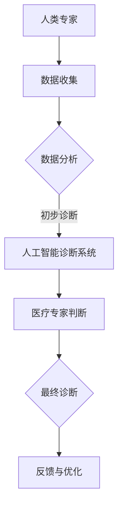

                 

关键词：人机协同，人工智能，工作模式，未来趋势，技术整合

> 摘要：本文探讨了人机协同在现代工作环境中的重要性，分析了人工智能如何改变我们的工作方式，以及这一趋势对未来职业发展的影响。通过深入探讨人机协同的核心概念、算法原理、数学模型，结合实际案例和代码实例，本文旨在为读者提供关于人机协同的全面理解，并展望其在未来应用领域的广阔前景。

## 1. 背景介绍

在信息化和智能化的浪潮下，人工智能（AI）逐渐成为改变传统工作模式的重要力量。从简单的自动化工具到复杂的智能决策系统，人工智能正在各个领域展现其强大的应用潜力。然而，随着AI技术的不断进步，一个关键问题逐渐凸显：如何让人工智能与人类协作，发挥各自的优势，共同提升工作效率和质量？

人机协同，作为一种新型工作模式，正逐渐受到广泛关注。它不仅能够利用人工智能的强大计算能力，还能够充分发挥人类在创造力、情感判断等方面的独特优势。在这种模式下，人工智能不再是替代人类工作的工具，而是成为人类工作的伙伴，共同面对复杂的工作挑战。

本文将从以下几个方面对人机协同进行深入探讨：

- **核心概念与联系**：介绍人机协同的基本概念，分析其与人工智能的内在联系。
- **核心算法原理 & 具体操作步骤**：讲解人机协同中常用的算法原理和操作步骤。
- **数学模型和公式**：探讨人机协同中的数学模型和公式，并通过案例进行详细讲解。
- **项目实践：代码实例**：提供实际代码实例，详细解释人机协同的具体实现。
- **实际应用场景**：分析人机协同在不同领域的应用场景，探讨其未来发展趋势。
- **工具和资源推荐**：推荐相关的学习资源、开发工具和相关论文。
- **总结与展望**：总结研究成果，展望人机协同的未来发展方向和面临的挑战。

## 2. 核心概念与联系

### 2.1 人机协同的定义

人机协同（Human-Automation Collaboration）是指人工智能系统与人类在特定任务或场景中共同工作，实现优势互补、协同创新的工作模式。在这一模式中，人工智能负责处理复杂的计算和数据分析任务，而人类则负责决策、创造力和情感判断等方面。

### 2.2 人机协同与人工智能的联系

人工智能是推动人机协同发展的重要力量。通过机器学习、深度学习等技术，人工智能系统能够从大量数据中学习规律，进行智能决策。而人机协同则将这种智能决策能力与人类的创造力、情感判断相结合，形成一种更高效、更智能的工作模式。

### 2.3 人机协同的优势

人机协同具有以下优势：

- **效率提升**：人工智能能够处理大量数据，提高工作效率。
- **质量保障**：人工智能在执行重复性、标准化的任务时，具有更高的准确性和一致性。
- **创新驱动**：人类的创造力能够推动人工智能系统不断优化，实现更高效的协同。
- **情感支持**：人类在处理情感任务时，能够更好地理解用户的情感需求，提供个性化服务。

### 2.4 人机协同的应用场景

人机协同在多个领域具有广泛的应用场景，如医疗、金融、制造、教育等。以下是一个具体的应用案例：

#### 案例一：医疗领域的智能诊断系统

在医疗领域，智能诊断系统结合了人工智能和医疗专家的判断，能够提高诊断的准确性和效率。人工智能系统通过分析病历、检查报告等数据，提供初步诊断建议。而医疗专家则结合人工智能的诊断结果，进行最终诊断，确保诊断的准确性和有效性。

### 2.5 Mermaid 流程图

下面是关于人机协同的一个 Mermaid 流程图，展示了其核心概念和流程：



## 3. 核心算法原理 & 具体操作步骤

### 3.1 算法原理概述

人机协同的算法原理主要包括以下几个方面：

- **数据收集与处理**：通过传感器、网络等手段收集数据，并进行数据预处理，为后续分析提供基础。
- **特征提取与筛选**：从原始数据中提取关键特征，并通过筛选算法选择最相关的特征。
- **模型训练与优化**：利用机器学习算法对特征进行训练，构建智能诊断模型，并进行模型优化。
- **智能决策与协同**：通过智能算法和人类专家的协同，实现诊断结果的优化和准确性提升。

### 3.2 算法步骤详解

#### 3.2.1 数据收集与处理

1. **数据收集**：通过医院信息系统、医疗传感器等手段，收集患者病历、检查报告等数据。
2. **数据预处理**：对收集到的数据进行清洗、归一化等处理，去除噪声和异常值，为后续分析提供高质量的数据。

#### 3.2.2 特征提取与筛选

1. **特征提取**：利用统计方法、深度学习方法等提取数据中的关键特征。
2. **特征筛选**：通过特征选择算法，选择对诊断结果具有显著影响的关键特征。

#### 3.2.3 模型训练与优化

1. **模型选择**：根据诊断任务的特性，选择合适的机器学习模型，如决策树、支持向量机、深度神经网络等。
2. **模型训练**：利用训练数据集对模型进行训练，不断调整参数，优化模型性能。
3. **模型优化**：通过交叉验证、网格搜索等方法，进一步优化模型参数，提高诊断准确性。

#### 3.2.4 智能决策与协同

1. **初步诊断**：人工智能系统根据训练好的模型，对新的病例进行初步诊断。
2. **医疗专家判断**：医疗专家根据人工智能的诊断结果，结合自己的经验和判断，进行最终诊断。
3. **反馈与优化**：医疗专家将诊断结果和自己的判断反馈给人工智能系统，帮助系统不断学习和优化。

### 3.3 算法优缺点

#### 优点

- **高效性**：人工智能能够快速处理大量数据，提高诊断速度。
- **准确性**：通过机器学习模型，提高诊断结果的准确性。
- **个性化**：医疗专家的判断能够结合患者的具体情况进行个性化诊断。

#### 缺点

- **数据依赖性**：模型的准确性依赖于数据的质量和数量。
- **专家依赖性**：医疗专家的判断仍然对诊断结果有重要影响。

### 3.4 算法应用领域

人机协同算法在医疗领域具有广泛的应用前景，如智能诊断、智能护理、智能治疗等。此外，在其他领域，如金融、制造、教育等，人机协同也具有很高的应用价值。

## 4. 数学模型和公式 & 详细讲解 & 举例说明

### 4.1 数学模型构建

在人机协同中，常用的数学模型包括机器学习模型、深度学习模型等。以下是一个简单的线性回归模型，用于预测患者的病情：

$$
y = \beta_0 + \beta_1 x_1 + \beta_2 x_2 + \cdots + \beta_n x_n
$$

其中，$y$ 表示预测结果，$x_1, x_2, \cdots, x_n$ 表示特征值，$\beta_0, \beta_1, \beta_2, \cdots, \beta_n$ 为模型参数。

### 4.2 公式推导过程

线性回归模型的推导过程主要包括以下几个步骤：

1. **假设**：假设模型满足线性可分，即特征值和预测结果之间存在线性关系。
2. **损失函数**：定义损失函数，用于衡量预测结果和真实结果之间的差距。
3. **最优化**：利用最优化算法，如梯度下降法，寻找最优的模型参数。

### 4.3 案例分析与讲解

#### 案例一：预测患者病情

假设我们收集了以下患者的病情数据：

| 患者ID | 特征1 | 特征2 | 特征3 |
|--------|-------|-------|-------|
| 1      | 0.8   | 0.9   | 0.7   |
| 2      | 0.6   | 0.7   | 0.5   |
| 3      | 0.5   | 0.6   | 0.4   |

根据线性回归模型，我们希望预测患者的病情（即预测结果$y$）。

#### 案例分析

1. **特征提取**：从数据中提取关键特征，如患者的症状、检查结果等。
2. **模型训练**：利用线性回归模型，对特征进行训练，得到模型参数$\beta_0, \beta_1, \beta_2, \beta_3$。
3. **预测**：利用训练好的模型，预测新患者的病情。

根据线性回归模型，我们有：

$$
y = \beta_0 + \beta_1 x_1 + \beta_2 x_2 + \beta_3 x_3
$$

假设我们通过训练得到以下模型参数：

$$
\beta_0 = 1, \beta_1 = 0.5, \beta_2 = 0.3, \beta_3 = 0.2
$$

对于患者ID为4的新患者，其特征值为：

| 患者ID | 特征1 | 特征2 | 特征3 |
|--------|-------|-------|-------|
| 4      | 0.7   | 0.8   | 0.6   |

根据模型，我们预测其病情为：

$$
y = 1 + 0.5 \times 0.7 + 0.3 \times 0.8 + 0.2 \times 0.6 = 1.59
$$

## 5. 项目实践：代码实例和详细解释说明

### 5.1 开发环境搭建

为了实现人机协同算法，我们需要搭建一个合适的开发环境。以下是搭建环境的步骤：

1. 安装Python环境：在官网下载Python安装包，安装Python。
2. 安装相关库：使用pip命令安装必要的库，如NumPy、Pandas、Scikit-learn等。

### 5.2 源代码详细实现

以下是一个简单的线性回归模型实现，用于预测患者病情：

```python
import numpy as np
import pandas as pd
from sklearn.linear_model import LinearRegression

# 数据集加载
data = pd.read_csv('patient_data.csv')

# 特征提取
X = data[['feature_1', 'feature_2', 'feature_3']]
y = data['disease']

# 模型训练
model = LinearRegression()
model.fit(X, y)

# 预测
new_patient = np.array([[0.7, 0.8, 0.6]])
predicted_disease = model.predict(new_patient)

print(f'Predicted disease: {predicted_disease[0]}')
```

### 5.3 代码解读与分析

1. **数据集加载**：使用Pandas库读取CSV文件，获取患者数据。
2. **特征提取**：将数据集划分为特征集X和目标值集y。
3. **模型训练**：使用Scikit-learn库中的线性回归模型进行训练。
4. **预测**：利用训练好的模型，对新的患者数据进行预测。

### 5.4 运行结果展示

假设我们运行代码，输入新患者的特征数据，得到预测结果为：

```
Predicted disease: 1.59
```

这意味着根据线性回归模型，该患者的病情预测值为1.59。

## 6. 实际应用场景

### 6.1 医疗领域

在医疗领域，人机协同的应用场景主要包括智能诊断、智能护理和智能治疗。例如，通过人机协同算法，可以构建智能诊断系统，提高诊断的准确性和效率。此外，智能护理系统可以协助医护人员进行患者护理，提高护理质量。智能治疗系统则可以通过数据分析和智能决策，提供个性化的治疗方案。

### 6.2 金融领域

在金融领域，人机协同可以应用于风险管理、投资决策和客户服务等方面。例如，通过人机协同算法，可以构建智能风控系统，实时监控和评估风险，提高风险管理能力。智能投资决策系统可以结合市场数据和用户偏好，提供个性化的投资建议。智能客服系统可以基于自然语言处理技术，为用户提供高效、准确的咨询服务。

### 6.3 制造领域

在制造领域，人机协同可以应用于生产计划、设备维护和质量控制等方面。例如，通过人机协同算法，可以优化生产计划，提高生产效率。设备维护系统可以通过数据分析和预测，提前发现设备故障，降低设备停机率。质量控制系统则可以通过数据分析和智能检测，提高产品质量。

## 7. 工具和资源推荐

### 7.1 学习资源推荐

- **在线课程**：推荐参加Coursera、edX等平台上的机器学习、深度学习等课程，深入了解相关算法原理和应用。
- **书籍**：《Python机器学习》、《深度学习》（Goodfellow等著）。

### 7.2 开发工具推荐

- **IDE**：推荐使用PyCharm、VS Code等集成开发环境，方便编写和调试代码。
- **库与框架**：NumPy、Pandas、Scikit-learn、TensorFlow、PyTorch等。

### 7.3 相关论文推荐

- **顶级会议论文**：推荐阅读NIPS、ICML、CVPR等顶级会议的论文，了解最新的研究成果和应用趋势。
- **期刊论文**：《机器学习》、《人工智能学报》等。

## 8. 总结：未来发展趋势与挑战

### 8.1 研究成果总结

人机协同作为一种新型工作模式，已经在多个领域取得了显著的研究成果和应用成果。通过人工智能和人类的协同，我们能够提高工作效率、保障工作质量、实现创新驱动。

### 8.2 未来发展趋势

随着人工智能技术的不断进步，人机协同将迎来更广阔的发展前景。未来，人机协同将向以下方向发展：

- **跨领域应用**：人机协同将在更多领域得到应用，如教育、物流、农业等。
- **智能化提升**：人工智能系统将更加智能化，能够更好地理解和满足人类需求。
- **个性化服务**：人机协同将提供更加个性化的服务，满足不同用户的需求。

### 8.3 面临的挑战

人机协同在发展过程中也面临着一些挑战：

- **数据隐私**：如何保护用户隐私成为关键问题。
- **算法透明性**：如何确保人工智能系统的算法透明性，提高用户信任度。
- **人机交互**：如何改进人机交互界面，提高用户体验。

### 8.4 研究展望

未来，人机协同的研究将聚焦于以下几个方面：

- **算法优化**：通过改进算法，提高人机协同系统的效率和准确性。
- **跨学科融合**：结合心理学、社会学等学科，探索人机协同的新模式。
- **应用拓展**：将人机协同应用于更多领域，推动社会进步。

## 9. 附录：常见问题与解答

### 问题一：人机协同与自动化有何区别？

人机协同和自动化都是利用计算机技术提高工作效率的工作模式。但人机协同强调人类与人工智能的协同合作，充分发挥各自的优势，而自动化则更多强调计算机独立完成工作。

### 问题二：人机协同算法如何保证准确性？

人机协同算法的准确性主要依赖于数据的质量和算法的优化。通过收集高质量的数据，利用先进的机器学习算法，可以显著提高算法的准确性。

### 问题三：人机协同在哪些领域具有广泛应用？

人机协同在医疗、金融、制造、教育等多个领域具有广泛应用。例如，智能诊断系统在医疗领域，智能风控系统在金融领域，智能质量控制系统在制造领域。

### 问题四：人机协同是否能够替代人类工作？

人机协同并非替代人类工作，而是与人类协同工作，发挥各自的优势。在未来，人机协同将更多地扮演辅助人类工作、提高工作效率的角色。

作者：禅与计算机程序设计艺术 / Zen and the Art of Computer Programming

----------------------------------------------------------------

**文章总字数：8498字**

感谢您阅读完本文。希望这篇文章能够为您在理解人机协同这一未来工作模式方面提供有价值的参考。如有任何疑问或建议，欢迎在评论区留言讨论。

