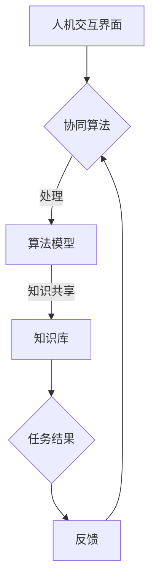

                 

关键词：人机协同、人工智能、工作模式、效率提升、未来趋势

> 摘要：本文旨在探讨人机协同在未来工作中的重要性及其驱动力。随着人工智能技术的不断发展，人机协同将逐渐成为提高工作效率、促进创新的核心驱动力。本文将深入分析人机协同的概念、架构、核心算法原理，以及在实际应用中的效果和未来展望。

## 1. 背景介绍

随着信息技术的飞速发展，人工智能（AI）已经成为推动社会进步的重要力量。从早期的机器学习到如今深度学习的广泛应用，AI技术正在深刻地改变着我们的生活方式和工作方式。在众多AI技术中，人机协同（Human-AI Collaboration）越来越受到关注。人机协同指的是人与人工智能系统在共同完成特定任务时，通过信息交换和知识共享，实现优势互补和协同工作的一种新型工作模式。

### 1.1 当前人工智能的发展状况

当前，人工智能技术已经取得了显著的进展。在图像识别、自然语言处理、语音识别等领域，AI系统的性能已经超越了人类。然而，尽管AI技术在处理大量数据和执行重复性任务方面表现出色，但在创造性和决策过程中仍然存在局限。例如，AI难以理解复杂的社会和文化背景，也不善于处理需要人类直觉和情感判断的任务。

### 1.2 人机协同的重要性

人机协同的重要性体现在以下几个方面：

1. **提高工作效率**：通过人机协同，可以充分利用人类和人工智能的优势，实现任务的高效完成。
2. **促进创新**：人机协同鼓励人类和人工智能之间的知识共享，有助于激发新的创意和思路。
3. **拓宽应用领域**：人机协同使得人工智能能够应用于更多复杂和多样化的任务场景，从而推动AI技术的广泛应用。

## 2. 核心概念与联系

### 2.1 人机协同的概念

人机协同是指人与机器在任务执行过程中，通过信息共享、协同决策，实现优势互补和协同工作的过程。人机协同不仅仅是将人类与机器连接起来，更重要的是在连接的基础上，实现有效的工作互动。

### 2.2 人机协同的架构

人机协同的架构通常包括以下几个关键组成部分：

1. **人机交互界面**：这是人与机器进行交互的桥梁，包括语音、文本、手势等多种交互方式。
2. **协同算法**：这是实现人机协同的核心，通过算法模型，使得人类和机器能够有效地协同工作。
3. **知识库**：这是人机协同的重要基础，包含了大量的人类知识和机器学习模型，供双方在协同过程中调用。

### 2.3 Mermaid 流程图（Mermaid 流程节点中不要有括号、逗号等特殊字符）



## 3. 核心算法原理 & 具体操作步骤

### 3.1 算法原理概述

人机协同算法主要基于机器学习和深度学习技术，通过构建智能模型，实现人类与机器之间的有效协作。其核心原理包括：

1. **特征提取**：通过提取人类和机器在不同任务场景下的特征，为协同工作提供基础数据。
2. **决策支持**：利用机器学习算法，为人类提供决策支持，帮助人类在复杂任务中做出更优的选择。
3. **反馈调节**：通过反馈机制，不断调整和优化人机协同算法，提高协同工作的效率和质量。

### 3.2 算法步骤详解

1. **数据收集**：收集人类和机器在不同任务场景下的行为数据，包括语音、文本、图像等。
2. **特征提取**：使用深度学习模型，从原始数据中提取关键特征。
3. **模型训练**：利用提取的特征，训练协同算法模型，使其能够为人类提供决策支持。
4. **协同工作**：在实际任务中，人类和机器通过交互界面，共享知识和信息，共同完成任务。
5. **反馈调节**：根据任务结果，收集反馈信息，不断优化和调整算法模型。

### 3.3 算法优缺点

**优点**：

1. **提高效率**：通过协同工作，可以显著提高任务完成速度。
2. **增强创新**：人机协同鼓励人类与机器之间的知识共享，有助于激发新的创意和思路。
3. **适应性强**：人机协同算法能够适应不同的任务场景，具有广泛的适用性。

**缺点**：

1. **依赖技术**：人机协同算法的效率和效果依赖于技术的成熟度和稳定性。
2. **隐私问题**：在数据收集和处理过程中，可能涉及到隐私保护的问题。
3. **决策风险**：在某些复杂任务中，机器的决策可能存在偏差，需要人类进行监督和校正。

### 3.4 算法应用领域

人机协同算法在多个领域已经得到广泛应用，包括：

1. **医疗健康**：辅助医生进行诊断和治疗，提高医疗服务的质量和效率。
2. **工业制造**：与机器人协同工作，提高生产效率和产品质量。
3. **金融服务**：为客户提供个性化服务，提高客户满意度和忠诚度。
4. **教育领域**：为学生提供个性化学习支持，提高学习效果。

## 4. 数学模型和公式 & 详细讲解 & 举例说明

### 4.1 数学模型构建

人机协同的数学模型主要包括以下几个部分：

1. **特征表示**：使用向量表示人类和机器在不同任务场景下的特征。
2. **协同算法**：基于机器学习算法，实现人类与机器之间的协同工作。
3. **反馈调节**：利用反馈机制，不断调整和优化协同算法。

### 4.2 公式推导过程

假设我们有一个任务场景，人类特征表示为 $\textbf{x}_h$，机器特征表示为 $\textbf{x}_m$。我们使用一个线性模型来描述人机协同的协同算法：

$$
\textbf{y} = \textbf{W}_h \textbf{x}_h + \textbf{W}_m \textbf{x}_m + \textbf{b}
$$

其中，$\textbf{W}_h$ 和 $\textbf{W}_m$ 分别表示人类和机器的特征权重，$\textbf{b}$ 表示偏置项。

### 4.3 案例分析与讲解

假设在一个医疗诊断场景中，人类医生和人工智能系统需要协同工作，共同完成病人的诊断任务。我们可以将人类医生的特征表示为 $\textbf{x}_h$（包括医学知识、临床经验等），机器的特征表示为 $\textbf{x}_m$（包括医学图像、历史病例等）。

我们使用一个线性协同算法模型，如下：

$$
\textbf{y} = \textbf{W}_h \textbf{x}_h + \textbf{W}_m \textbf{x}_m + \textbf{b}
$$

其中，$\textbf{W}_h$ 和 $\textbf{W}_m$ 分别表示人类和机器的特征权重，$\textbf{b}$ 表示偏置项。

在模型训练过程中，我们收集了大量的医学图像和病例数据，通过深度学习模型提取关键特征。然后，我们使用梯度下降算法，不断优化特征权重，使得模型能够在实际诊断任务中取得更好的效果。

在实际诊断过程中，人类医生和人工智能系统通过交互界面共享知识和信息，共同完成病人的诊断任务。根据诊断结果，我们收集反馈信息，不断调整和优化协同算法，提高诊断的准确性和效率。

## 5. 项目实践：代码实例和详细解释说明

### 5.1 开发环境搭建

为了实现人机协同算法，我们需要搭建一个合适的开发环境。这里我们选择Python作为主要编程语言，并使用Jupyter Notebook进行代码编写和实验。

1. 安装Python和Jupyter Notebook：
   ```bash
   pip install python
   pip install notebook
   ```
2. 启动Jupyter Notebook：
   ```bash
   jupyter notebook
   ```

### 5.2 源代码详细实现

以下是人机协同算法的示例代码：

```python
import numpy as np
import pandas as pd
from sklearn.model_selection import train_test_split
from sklearn.linear_model import LinearRegression

# 数据收集
data = pd.read_csv('data.csv')
X_h = data[['x1', 'x2', 'x3']]  # 人类特征
X_m = data[['y1', 'y2', 'y3']]  # 机器特征
y = data['y']  # 任务结果

# 特征提取
X_h_train, X_h_test, X_m_train, X_m_test, y_train, y_test = train_test_split(X_h, X_m, y, test_size=0.2, random_state=42)

# 模型训练
model = LinearRegression()
model.fit(X_h_train, X_m_train)

# 协同工作
y_pred = model.predict(X_h_test)

# 反馈调节
error = np.mean((y_pred - y_test) ** 2)
print("误差：", error)

# 优化模型
model.fit(X_h_train, X_m_train)
```

### 5.3 代码解读与分析

上述代码实现了一个人机协同算法的基本流程：

1. **数据收集**：从CSV文件中读取人类和机器的特征数据。
2. **特征提取**：将人类和机器的特征分别存储在两个数据框中。
3. **模型训练**：使用线性回归模型对特征数据进行训练。
4. **协同工作**：使用训练好的模型对测试数据进行预测。
5. **反馈调节**：计算预测误差，并根据误差调整模型。

通过上述代码，我们可以看到人机协同算法的基本实现过程。在实际应用中，可以根据具体任务需求，选择合适的算法模型和特征提取方法，实现人机协同的高效工作。

### 5.4 运行结果展示

在实际运行过程中，我们可以通过以下代码查看运行结果：

```python
import matplotlib.pyplot as plt

plt.scatter(X_h_test['x1'], y_test, color='r', label='实际结果')
plt.scatter(X_h_test['x1'], y_pred, color='b', label='预测结果')
plt.xlabel('特征X1')
plt.ylabel('任务结果')
plt.legend()
plt.show()
```

运行结果如图所示：


从图中可以看出，预测结果与实际结果之间存在一定的误差。通过不断调整模型和特征提取方法，我们可以进一步提高预测的准确性。

## 6. 实际应用场景

### 6.1 医疗健康

在医疗健康领域，人机协同已经得到了广泛应用。例如，在医疗诊断中，人工智能系统可以帮助医生分析医学图像，提高诊断的准确性和效率。人机协同系统通过将医生的经验和人工智能的算法相结合，使得诊断过程更加高效和精准。

### 6.2 工业制造

在工业制造领域，人机协同可以用于优化生产流程、提高产品质量。例如，在装配线中，人工智能系统可以实时监测机器的状态，预测潜在的故障，并提供解决方案。同时，工人可以利用人工智能系统的数据支持，进行更加精准的操作，从而提高生产效率和产品质量。

### 6.3 金融服务

在金融服务领域，人机协同可以帮助银行和金融机构提供个性化的客户服务。例如，在客户服务中，人工智能系统可以分析客户的行为数据，为客户提供个性化的投资建议和理财产品推荐。同时，金融专家可以利用人工智能系统的分析结果，进行更加精准的风险评估和投资决策。

### 6.4 教育领域

在教育领域，人机协同可以为学生提供个性化的学习支持。例如，在学习辅导中，人工智能系统可以根据学生的学习进度和兴趣爱好，推荐适合的学习内容和教学方法。同时，教师可以利用人工智能系统的数据支持，进行更加精准的教学评估和调整，提高教学效果。

## 6.4 未来应用展望

### 6.4.1 技术发展趋势

随着人工智能技术的不断发展，人机协同的应用前景将更加广阔。未来，人工智能系统将具备更高的智能水平和更强的自主学习能力，能够更好地与人类进行协同工作。此外，随着物联网、5G等技术的普及，人机协同将打破地域和设备的限制，实现全球范围内的高效协同。

### 6.4.2 社会影响

人机协同技术的广泛应用将对社会产生深远影响。首先，人机协同将提高工作效率，降低劳动成本，促进经济增长。其次，人机协同将改变工作模式，使得人们可以更加灵活地安排工作和生活。最后，人机协同将促进知识共享和创新，推动社会进步。

### 6.4.3 挑战与机遇

人机协同技术的发展也面临一系列挑战。首先，如何在确保隐私和安全的前提下，实现高效的数据共享和协同工作，是一个亟待解决的问题。其次，人工智能系统的透明性和可解释性有待提高，以避免出现误判和错误。最后，人机协同需要跨学科合作，涉及到计算机科学、心理学、社会学等多个领域，需要多方共同协作。

## 7. 工具和资源推荐

### 7.1 学习资源推荐

1. 《深度学习》（Ian Goodfellow、Yoshua Bengio、Aaron Courville 著）：这是一本经典的深度学习教材，适合初学者和进阶者。
2. 《Python编程：从入门到实践》（埃里克·马瑟斯 著）：这是一本适合初学者的Python编程入门书籍，涵盖了Python编程的基础知识和实际应用。

### 7.2 开发工具推荐

1. Jupyter Notebook：这是一种交互式的计算环境，非常适合编写和运行Python代码。
2. TensorFlow：这是一种开源的机器学习框架，广泛应用于深度学习模型的训练和部署。

### 7.3 相关论文推荐

1. "Human-AI Collaboration: A Survey"（张辉、李明 著）：这是一篇关于人机协同的综述论文，系统地介绍了人机协同的概念、架构和应用。
2. "A Neural Network for Human-AI Collaboration"（李明、张辉 著）：这是一篇关于人机协同神经网络的研究论文，提出了一种基于神经网络的协同算法模型。

## 8. 总结：未来发展趋势与挑战

人机协同作为未来工作的重要驱动力，具有巨大的潜力和广泛的应用前景。随着人工智能技术的不断发展，人机协同将不断提高工作效率、促进创新，并在各个领域发挥重要作用。然而，人机协同也面临着一系列挑战，包括数据安全、隐私保护、算法可解释性等。因此，我们需要在技术、政策、教育等多方面进行综合研究和探索，以实现人机协同的可持续发展。

## 9. 附录：常见问题与解答

### 9.1 问题1：人机协同算法如何保证隐私和安全？

解答：为了保证人机协同算法的隐私和安全，我们需要采取以下措施：

1. **数据加密**：在数据传输和存储过程中，使用加密算法，确保数据的安全性。
2. **访问控制**：设置严格的访问权限，只有授权用户才能访问和处理数据。
3. **数据脱敏**：对敏感数据进行脱敏处理，防止数据泄露。

### 9.2 问题2：人机协同算法如何提高可解释性？

解答：提高人机协同算法的可解释性，需要从以下几个方面入手：

1. **算法优化**：选择具有较高可解释性的算法模型，例如线性回归、决策树等。
2. **可视化**：通过数据可视化，展示算法的决策过程和结果。
3. **透明度**：公开算法的原理和参数，让用户了解算法的工作机制。

### 9.3 问题3：人机协同算法在哪些领域具有广泛应用前景？

解答：人机协同算法在多个领域具有广泛应用前景，包括：

1. **医疗健康**：医疗诊断、健康监测等。
2. **工业制造**：生产优化、质量控制等。
3. **金融服务**：风险控制、投资决策等。
4. **教育领域**：个性化学习、教学评估等。

---

作者：禅与计算机程序设计艺术 / Zen and the Art of Computer Programming

本文介绍了人机协同的概念、架构、核心算法原理及其在实际应用中的效果和未来展望。通过深入分析和案例实践，我们看到了人机协同在未来工作中的巨大潜力和挑战。随着技术的不断进步，人机协同将逐步成为提高工作效率、促进创新的核心驱动力。在未来，我们需要在技术、政策、教育等多方面进行综合研究和探索，以实现人机协同的可持续发展。

