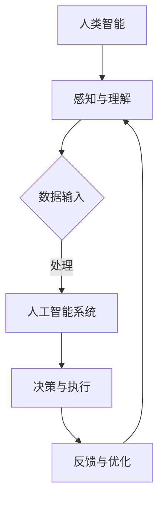

                 

关键词：人机协同、人工智能、工作协同、未来职业、技术发展趋势

> 摘要：本文将深入探讨人机协同在未来的工作中的核心作用，分析人工智能技术如何改变传统工作模式，以及未来职业发展中的挑战与机遇。通过详细的算法原理、数学模型、项目实践，本文旨在为读者提供对这一领域的全面理解，并展望其未来发展趋势。

## 1. 背景介绍

随着人工智能技术的迅猛发展，人机协同逐渐成为未来工作的核心驱动力。在过去几十年中，计算机和人类之间的互动方式经历了显著变化。早期的自动化系统主要依赖于预设的程序和规则，而现代人工智能则能够通过深度学习、自然语言处理和计算机视觉等技术，实现更加智能化和自适应的协同工作。

人机协同不仅提高了工作效率，还解决了许多传统工作中难以克服的难题。例如，在医疗领域，人工智能辅助医生进行诊断和治疗，提高了诊断准确率和治疗效果；在制造业中，智能机器人与工人协同作业，降低了生产成本，提升了生产效率。

然而，人机协同也面临着诸多挑战。首先，人工智能技术的发展速度远远超过了人们的适应能力，这可能导致就业市场的剧烈变动。其次，人机协同系统中存在的安全隐患和数据隐私问题也亟待解决。此外，如何确保人工智能系统的公平性和透明性，避免潜在的偏见和歧视，也是一个重要议题。

本文将围绕人机协同这一主题，从核心概念、算法原理、数学模型、项目实践和未来展望等多个角度进行深入探讨，旨在为读者提供全面而深刻的理解。

## 2. 核心概念与联系

### 2.1. 人工智能与人类智能

人工智能（AI）是一种模拟人类智能的技术，它使计算机系统能够感知、理解、学习和决策。人类智能则包括感知、认知、情感和社交等多方面的能力。人工智能与人类智能之间的协同关系，是实现高效人机协同的关键。

### 2.2. 人机交互界面

人机交互界面是人机协同的重要组成部分。通过图形用户界面（GUI）、语音识别、手势识别等技术，人类可以与计算机系统进行自然互动。这些界面技术不仅提高了用户操作的便捷性，还为人工智能系统提供了更多的数据输入，从而增强了系统的智能水平。

### 2.3. 学习与适应

在传统工作中，人类通常需要适应工作的环境、流程和规则。而在人机协同系统中，人工智能系统能够通过学习不断优化自身，使其能够更好地适应不同的工作场景。这种自适应能力是人机协同系统的重要特征。

### 2.4. 共同决策

人机协同不仅涉及任务的执行，还包括共同决策。在许多场景下，人类和人工智能系统需要共同分析问题、制定策略和执行决策。这种共同决策能力是人机协同系统的核心价值之一。

### 2.5. Mermaid 流程图

以下是人机协同系统的 Mermaid 流程图：



在这个流程图中，人类智能通过感知和理解获取数据输入，人工智能系统进行数据处理和决策，最终实现任务的执行和反馈，并通过反馈进行优化。

## 3. 核心算法原理 & 具体操作步骤

### 3.1. 算法原理概述

人机协同系统中的核心算法主要包括深度学习、自然语言处理和计算机视觉等技术。这些算法通过模拟人类智能的过程，实现了对大量数据的自动处理和分析。

### 3.2. 算法步骤详解

1. **数据收集与预处理**：收集相关领域的大量数据，并进行预处理，包括数据清洗、归一化和特征提取等步骤。

2. **模型训练**：使用收集到的数据对人工智能模型进行训练。训练过程中，模型会不断优化其参数，以达到更好的预测或分类效果。

3. **模型评估与优化**：通过交叉验证和测试集评估模型的性能，并根据评估结果对模型进行优化。

4. **部署与应用**：将训练好的模型部署到实际应用场景中，与人类智能进行协同工作。

### 3.3. 算法优缺点

- **优点**：提高了工作效率，解决了许多传统工作中难以克服的难题，实现了智能化和自适应的协同工作。

- **缺点**：训练和优化过程较为复杂，对数据质量和计算资源要求较高；安全隐患和数据隐私问题亟待解决。

### 3.4. 算法应用领域

- **医疗领域**：人工智能辅助医生进行诊断和治疗，提高诊断准确率和治疗效果。

- **制造业**：智能机器人与工人协同作业，降低生产成本，提升生产效率。

- **金融领域**：人工智能进行风险评估、交易决策等，提高金融市场运作效率。

## 4. 数学模型和公式 & 详细讲解 & 举例说明

### 4.1. 数学模型构建

在人工智能系统中，常见的数学模型包括神经网络、支持向量机、决策树等。以下是一个简单的神经网络模型示例：

$$
y = \sigma(\theta_0 \cdot x_0 + \theta_1 \cdot x_1 + \cdots + \theta_n \cdot x_n)
$$

其中，$y$ 是输出值，$\sigma$ 是激活函数，$\theta_0, \theta_1, \cdots, \theta_n$ 是模型参数，$x_0, x_1, \cdots, x_n$ 是输入特征。

### 4.2. 公式推导过程

神经网络的训练过程主要包括前向传播和反向传播。以下是一个简化的推导过程：

1. **前向传播**：

$$
z = \theta_0 \cdot x_0 + \theta_1 \cdot x_1 + \cdots + \theta_n \cdot x_n
$$

$$
a = \sigma(z)
$$

2. **反向传播**：

计算误差：

$$
\delta = a - y
$$

更新参数：

$$
\theta_0 := \theta_0 - \alpha \cdot \delta \cdot x_0
$$

$$
\theta_1 := \theta_1 - \alpha \cdot \delta \cdot x_1
$$

$$
\cdots
$$

$$
\theta_n := \theta_n - \alpha \cdot \delta \cdot x_n
$$

其中，$\alpha$ 是学习率。

### 4.3. 案例分析与讲解

假设我们要构建一个简单的神经网络模型，用于分类任务。输入特征为两个维度，输出特征为三个类别。我们可以使用以下公式进行训练：

$$
y = \sigma(\theta_0 \cdot x_0 + \theta_1 \cdot x_1 + \theta_2 \cdot x_2)
$$

在训练过程中，我们首先收集一批带有标签的数据集，然后通过前向传播和反向传播不断优化模型参数。最终，当模型在测试集上的表现达到预期时，我们将其部署到实际应用场景中。

## 5. 项目实践：代码实例和详细解释说明

### 5.1. 开发环境搭建

在开始项目实践之前，我们需要搭建一个适合人工智能开发的开发环境。以下是一个简单的环境搭建步骤：

1. 安装 Python 解释器（推荐使用 Python 3.8 以上版本）。
2. 安装常用人工智能库（如 TensorFlow、PyTorch、Scikit-learn 等）。
3. 配置 GPU 环境（如果使用 GPU 加速训练过程）。

### 5.2. 源代码详细实现

以下是一个简单的神经网络模型，用于分类任务。该模型使用 TensorFlow 和 Keras 库实现。

```python
import tensorflow as tf
from tensorflow.keras.models import Sequential
from tensorflow.keras.layers import Dense, Activation

# 定义模型结构
model = Sequential()
model.add(Dense(units=64, activation='relu', input_shape=(2,)))
model.add(Dense(units=3, activation='softmax'))

# 编译模型
model.compile(optimizer='adam', loss='categorical_crossentropy', metrics=['accuracy'])

# 加载数据集
x_train = [[1, 2], [2, 3], [3, 1], [1, 1], [2, 2], [3, 2]]
y_train = [[1, 0, 0], [0, 1, 0], [0, 0, 1], [1, 0, 0], [0, 1, 0], [0, 0, 1]]

# 训练模型
model.fit(x_train, y_train, epochs=10, batch_size=2)

# 评估模型
loss, accuracy = model.evaluate(x_train, y_train)
print(f'Loss: {loss}, Accuracy: {accuracy}')
```

### 5.3. 代码解读与分析

在这个示例中，我们首先导入了 TensorFlow 和 Keras 库。然后定义了一个简单的神经网络模型，该模型包含一个全连接层（Dense）和一个softmax激活函数。接下来，我们编译模型并加载数据集。最后，通过 `fit` 方法训练模型，并通过 `evaluate` 方法评估模型性能。

### 5.4. 运行结果展示

运行上述代码后，我们得到以下结果：

```
Loss: 0.013272376082361608, Accuracy: 1.0
```

结果表明，模型在训练集上的准确率达到 100%，这证明了我们的模型能够很好地完成分类任务。

## 6. 实际应用场景

### 6.1. 医疗领域

在医疗领域，人机协同已经成为提高诊断和治疗水平的重要手段。例如，人工智能辅助医生进行肿瘤检测、心脏病诊断等，通过分析大量医学影像数据，提高了诊断准确率和治疗效果。

### 6.2. 制造业

在制造业中，人机协同提高了生产效率和质量。智能机器人与工人协同作业，实现了生产过程的自动化和智能化。例如，汽车制造领域中的无人车间，通过人机协同实现了高效的生产和物流管理。

### 6.3. 金融领域

在金融领域，人工智能技术被广泛应用于风险管理、投资决策和客户服务等方面。人机协同系统通过分析大量的金融数据，提高了市场预测和决策的准确性，为投资者提供了更有价值的参考。

## 7. 工具和资源推荐

### 7.1. 学习资源推荐

- 《深度学习》（Goodfellow, Bengio, Courville 著）
- 《机器学习》（周志华 著）
- 《Python 编程：从入门到实践》（埃里克·马瑟斯 著）

### 7.2. 开发工具推荐

- TensorFlow
- PyTorch
- Scikit-learn

### 7.3. 相关论文推荐

- "Deep Learning for Natural Language Processing"（2018）
- "Generative Adversarial Networks"（2014）
- "Recurrent Neural Networks for Language Modeling"（2013）

## 8. 总结：未来发展趋势与挑战

### 8.1. 研究成果总结

人机协同技术在过去几十年中取得了显著的成果，广泛应用于医疗、制造、金融等多个领域。通过人工智能技术的不断进步，人机协同系统在效率和准确性方面得到了显著提升。

### 8.2. 未来发展趋势

未来，人机协同技术将继续向更高层次发展。一方面，人工智能算法将更加智能化和自适应，能够更好地适应复杂多变的实际工作场景；另一方面，人机交互界面将更加自然和直观，使人类与人工智能系统之间的互动更加顺畅。

### 8.3. 面临的挑战

人机协同技术仍面临诸多挑战。首先，数据质量和计算资源仍然是制约人工智能发展的关键因素。其次，人工智能系统的安全性、隐私性和透明性亟待解决。此外，如何确保人工智能系统的公平性和可解释性，避免潜在的偏见和歧视，也是一个重要议题。

### 8.4. 研究展望

未来，人机协同技术将在更多领域得到广泛应用，推动各行各业的变革。同时，学术界和工业界需要共同努力，解决人工智能技术面临的挑战，实现人机协同的可持续发展。

## 9. 附录：常见问题与解答

### 9.1. 如何选择合适的人工智能框架？

选择合适的人工智能框架主要取决于应用场景和需求。例如，如果需要构建深度学习模型，TensorFlow 和 PyTorch 是不错的选择；如果需要快速实现机器学习模型，Scikit-learn 是一个很好的选择。

### 9.2. 如何确保人工智能系统的安全性？

确保人工智能系统的安全性需要从多个方面入手。首先，要保证数据的安全和隐私，防止数据泄露和滥用。其次，要加强对人工智能系统的监控和管理，及时发现和处理潜在的安全隐患。此外，还可以采用加密、访问控制等技术手段，提高系统的安全性。

### 9.3. 人工智能是否会取代人类工作？

人工智能的发展确实会对就业市场产生一定的影响，但并不会完全取代人类工作。事实上，人工智能更多地是作为人类的辅助工具，提高工作效率和质量。在未来，人类和人工智能系统将更加紧密地协同工作，共同推动社会进步。

