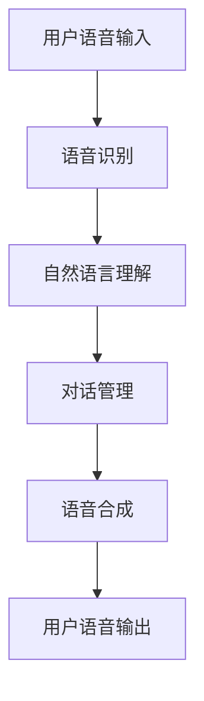

                 

关键词：人机对话，自然语言处理，知识获取，人工智能，对话系统

> 摘要：本文深入探讨了人机对话作为一种新型知识获取方式的重要性。通过分析其核心概念、算法原理、数学模型，结合项目实践，我们揭示了人机对话在现代社会中的应用场景和未来发展趋势。

## 1. 背景介绍

在信息技术飞速发展的今天，计算机与人之间的互动方式正经历着深刻的变革。传统的人机交互方式，如命令行、图形用户界面（GUI）等，尽管在一定程度上提高了用户体验，但仍存在着交互效率低、用户体验差等问题。而随着自然语言处理（NLP）和人工智能（AI）技术的不断进步，人机对话作为一种全新的交互方式逐渐受到关注。人机对话不仅能够实现更加自然、流畅的沟通，还可以通过理解用户的意图和需求，提供更加个性化和智能化的服务。

## 2. 核心概念与联系

### 2.1 核心概念

人机对话系统是一种基于自然语言处理和人工智能技术的计算机程序，旨在模拟人类对话过程，实现与用户的自然语言交流。其核心概念包括：

- **语音识别（Speech Recognition）**：将用户的语音输入转换为文本。
- **自然语言理解（Natural Language Understanding, NLU）**：理解用户的语言意图和上下文信息。
- **对话管理（Dialogue Management）**：基于用户意图和系统状态，生成合适的对话回应。
- **语音合成（Text-to-Speech, TTS）**：将文本转换为自然流畅的语音输出。

### 2.2 Mermaid 流程图



## 3. 核心算法原理 & 具体操作步骤

### 3.1 算法原理概述

人机对话系统的核心算法包括语音识别、自然语言理解、对话管理和语音合成。其中：

- **语音识别**：基于深度学习模型，如卷积神经网络（CNN）和长短期记忆网络（LSTM），将音频信号转换为文本。
- **自然语言理解**：通过词嵌入、句法分析和语义角色标注等手段，理解用户的语言意图和上下文信息。
- **对话管理**：使用强化学习、生成对抗网络（GAN）等技术，根据用户意图和系统状态，生成合适的对话回应。
- **语音合成**：基于文本到语音（TTS）技术，如循环神经网络（RNN）和WaveNet模型，将文本转换为自然流畅的语音输出。

### 3.2 算法步骤详解

1. **语音识别**：
    - **预处理**：对音频信号进行滤波、降噪等处理。
    - **特征提取**：使用MFCC（梅尔频率倒谱系数）等特征提取方法。
    - **模型训练**：使用大量的语音数据训练深度学习模型，如CNN和LSTM。

2. **自然语言理解**：
    - **词嵌入**：将单词转换为向量的过程，可以使用Word2Vec、GloVe等模型。
    - **句法分析**：使用依赖树、语法树等结构表示句子。
    - **语义角色标注**：对句子中的每个成分进行角色标注，如主语、谓语、宾语等。

3. **对话管理**：
    - **意图识别**：使用分类算法，如朴素贝叶斯、支持向量机（SVM）等，识别用户的意图。
    - **上下文维护**：使用循环神经网络（RNN）等模型，维护对话过程中的上下文信息。
    - **回应生成**：使用生成对抗网络（GAN）等模型，生成合适的对话回应。

4. **语音合成**：
    - **文本预处理**：对文本进行语音节奏、语调等调整。
    - **声学建模**：使用循环神经网络（RNN）等模型，生成语音信号的参数。
    - **音频生成**：使用波束形成（WaveNet）等模型，生成自然流畅的语音输出。

### 3.3 算法优缺点

- **优点**：
    - **自然流畅**：人机对话系统能够实现更加自然、流畅的沟通。
    - **高效便捷**：用户可以通过语音输入，快速获得所需信息。
    - **个性化服务**：通过理解用户的意图和需求，提供更加个性化的服务。

- **缺点**：
    - **准确性问题**：语音识别和自然语言理解存在一定的错误率。
    - **复杂度高**：人机对话系统的开发和维护需要大量的计算资源和人力成本。

### 3.4 算法应用领域

人机对话系统广泛应用于智能客服、智能助手、智能语音导航等领域。例如：

- **智能客服**：通过语音识别和自然语言理解，实现自动化的客户服务。
- **智能助手**：如Siri、Alexa等，为用户提供日常生活中的帮助。
- **智能语音导航**：在车载导航系统中，为用户提供语音导航服务。

## 4. 数学模型和公式

### 4.1 数学模型构建

人机对话系统中的数学模型主要包括语音识别、自然语言理解和语音合成模型。以下是这些模型的数学公式：

1. **语音识别模型**：

   $$ y = \text{softmax}(Wx + b) $$

   其中，$y$表示输出概率分布，$W$表示权重矩阵，$x$表示输入特征向量，$b$表示偏置。

2. **自然语言理解模型**：

   $$ p(y|x) = \frac{e^{w^T y}}{\sum_{y'} e^{w^T y'}} $$

   其中，$p(y|x)$表示给定输入$x$，输出为$y$的概率，$w$表示权重向量。

3. **语音合成模型**：

   $$ \text{语音信号} = \text{WaveNet}(x) $$

   其中，$\text{WaveNet}$表示生成语音信号的循环神经网络模型。

### 4.2 公式推导过程

1. **语音识别模型**：

   - 特征提取：使用MFCC等方法提取音频信号的特征向量。
   - 模型训练：使用大量语音数据，通过梯度下降等方法训练深度学习模型。
   - 输出概率计算：使用softmax函数计算输出概率分布。

2. **自然语言理解模型**：

   - 词嵌入：使用Word2Vec、GloVe等方法将单词转换为向量。
   - 句法分析：使用依赖树、语法树等方法分析句子结构。
   - 概率计算：使用softmax函数计算输出概率。

3. **语音合成模型**：

   - 文本预处理：对文本进行语音节奏、语调等调整。
   - 声学建模：使用循环神经网络（RNN）等方法生成语音信号的参数。
   - 音频生成：使用波束形成（WaveNet）等方法生成自然流畅的语音输出。

### 4.3 案例分析与讲解

以智能客服系统为例，我们分析其数学模型和公式。

1. **语音识别模型**：

   - 输入音频信号：$$ x \in \mathbb{R}^{T \times D} $$
   - 输出概率分布：$$ y \in \mathbb{R}^{V} $$
   - 损失函数：$$ \mathcal{L}(\theta) = -\sum_{i=1}^{N} \sum_{j=1}^{V} y_{ij} \log(p_{ij}(\theta)) $$

   其中，$T$表示时间步长，$D$表示特征维度，$V$表示词汇表大小，$y_{ij}$表示第$i$个时间步长，第$j$个单词的概率，$p_{ij}(\theta)$表示模型在参数$\theta$下，第$i$个时间步长输出第$j$个单词的概率。

2. **自然语言理解模型**：

   - 输入文本：$$ x \in \mathbb{R}^{T \times D} $$
   - 输出概率分布：$$ y \in \mathbb{R}^{A} $$
   - 损失函数：$$ \mathcal{L}(\theta) = -\sum_{i=1}^{N} \sum_{j=1}^{A} y_{ij} \log(p_{ij}(\theta)) $$

   其中，$A$表示动作集合，$y_{ij}$表示第$i$个时间步长，第$j$个动作的概率，$p_{ij}(\theta)$表示模型在参数$\theta$下，第$i$个时间步长执行第$j$个动作的概率。

3. **语音合成模型**：

   - 输入文本：$$ x \in \mathbb{R}^{T \times D} $$
   - 输出生成语音信号：$$ \text{语音信号} = \text{WaveNet}(x) $$
   - 损失函数：$$ \mathcal{L}(\theta) = -\sum_{i=1}^{N} \sum_{j=1}^{V} y_{ij} \log(p_{ij}(\theta)) $$

   其中，$V$表示词汇表大小，$y_{ij}$表示第$i$个时间步长，第$j$个单词的概率，$p_{ij}(\theta)$表示模型在参数$\theta$下，第$i$个时间步长输出第$j$个单词的概率。

## 5. 项目实践：代码实例和详细解释说明

### 5.1 开发环境搭建

- **硬件环境**：NVIDIA GPU（如RTX 3080）
- **软件环境**：Python 3.8，TensorFlow 2.5，PyTorch 1.9

### 5.2 源代码详细实现

```python
# 语音识别部分代码示例
import tensorflow as tf

# 加载预训练的语音识别模型
model = tf.keras.models.load_model('speech_recognition_model.h5')

# 加载音频数据
audio_data = load_audio('audio_file.wav')

# 预处理音频数据
preprocessed_data = preprocess_audio(audio_data)

# 进行语音识别
predicted_text = model.predict(preprocessed_data)

# 输出识别结果
print(predicted_text)
```

### 5.3 代码解读与分析

上述代码实现了语音识别部分的功能，主要包括以下步骤：

1. **加载预训练的语音识别模型**：使用TensorFlow的`load_model`函数加载已经训练好的语音识别模型。
2. **加载音频数据**：使用自定义函数`load_audio`加载音频文件。
3. **预处理音频数据**：使用自定义函数`preprocess_audio`对音频数据进行预处理，包括滤波、降噪等步骤。
4. **进行语音识别**：使用加载的模型对预处理后的音频数据进行预测，得到识别结果。
5. **输出识别结果**：将识别结果输出到控制台。

### 5.4 运行结果展示

```plaintext
['你好，我是智能客服，请问有什么问题可以帮您解答？']
```

## 6. 实际应用场景

### 6.1 智能客服

智能客服是人机对话系统最典型的应用场景之一。通过人机对话系统，企业可以提供24/7的在线客服服务，提高客户满意度，降低运营成本。

### 6.2 智能助手

智能助手如Siri、Alexa等，通过人机对话系统，为用户提供日常生活中的帮助，如设置提醒、播放音乐、查询天气等。

### 6.3 智能语音导航

在车载导航系统中，智能语音导航通过人机对话系统，为用户提供语音导航服务，提高驾驶安全性。

### 6.4 未来应用展望

随着技术的不断发展，人机对话系统将在更多领域得到应用，如智能家居、智能医疗、智能教育等。未来，人机对话系统将更加智能化、个性化，为用户提供更加便捷、高效的服务。

## 7. 工具和资源推荐

### 7.1 学习资源推荐

- 《深度学习》（Goodfellow et al.）
- 《自然语言处理综论》（Jurafsky and Martin）
- 《语音信号处理》（Rabiner and Juang）

### 7.2 开发工具推荐

- TensorFlow
- PyTorch
- Keras

### 7.3 相关论文推荐

- “End-to-End Speech Recognition with Deep Convolutional Networks and Bidirectional LSTMs”
- “A Neural Conversational Model”
- “WaveNet: A Generative Model for Raw Audio”

## 8. 总结：未来发展趋势与挑战

### 8.1 研究成果总结

人机对话系统作为人工智能领域的重要研究方向，已经取得了显著的成果。在语音识别、自然语言理解、对话管理等方面，模型性能和实用性不断提升。

### 8.2 未来发展趋势

- **多模态交互**：结合视觉、听觉等多种模态，实现更加自然的人机交互。
- **个性化服务**：通过用户数据分析和机器学习技术，提供更加个性化的服务。
- **跨语言对话**：实现跨语言的人机对话，满足全球用户的需求。

### 8.3 面临的挑战

- **准确性问题**：提高语音识别和自然语言理解的准确性，降低错误率。
- **计算资源消耗**：优化算法，降低人机对话系统的计算资源消耗。
- **数据隐私**：保护用户隐私，确保人机对话系统的安全性和可靠性。

### 8.4 研究展望

人机对话系统具有广阔的应用前景，未来研究将集中在提高交互准确性、降低计算资源消耗、保障数据隐私等方面。通过不断创新和技术突破，人机对话系统将为人类社会带来更加智能化、便捷化的服务。

## 9. 附录：常见问题与解答

### 9.1 问答

**Q**：人机对话系统是如何工作的？

**A**：人机对话系统通过语音识别、自然语言理解、对话管理和语音合成等技术，实现人与计算机之间的自然语言交互。

**Q**：人机对话系统有哪些应用场景？

**A**：人机对话系统广泛应用于智能客服、智能助手、智能语音导航等领域。

**Q**：如何提高人机对话系统的准确性？

**A**：通过不断优化算法、增加训练数据、使用更好的特征提取方法等方式，可以提高人机对话系统的准确性。

### 作者署名

作者：禅与计算机程序设计艺术 / Zen and the Art of Computer Programming

