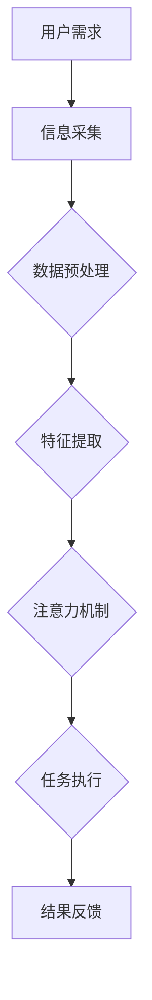

                 

 在当今科技迅猛发展的时代，人工智能（AI）已成为推动社会进步的重要力量。AI不仅改变了我们生活的方方面面，还在某种程度上成为了人类的伙伴。本文旨在探讨人类与AI伙伴关系的一个关键方面——如何增强人类的注意力，以更好地与AI协作。本文将分为以下几个部分：

## 1. 背景介绍

### 1.1 人工智能的崛起

人工智能，作为一种模拟人类智能的技术，自20世纪50年代诞生以来，经历了数次重大的技术革命。特别是深度学习、大数据和云计算等技术的进步，使得AI在图像识别、自然语言处理、决策支持等领域取得了显著的成就。AI的应用已经深入到工业、医疗、金融、教育等众多领域，为人类创造了巨大的价值。

### 1.2 人类注意力的挑战

然而，随着AI的广泛应用，人类面临的一个新挑战就是如何处理日益增多的信息。信息过载成为了现代生活的一个普遍现象，导致人类的注意力被分散，工作效率下降，甚至心理健康受到影响。因此，如何利用AI技术来增强人类的注意力，成为了一个亟待解决的问题。

## 2. 核心概念与联系

为了更好地理解人类与AI伙伴关系，我们需要明确以下几个核心概念：

### 2.1 注意力机制

注意力机制是大脑处理信息的一种基本方式。它决定了我们在某一时刻关注什么，忽略什么。人类的注意力是有限的，因此如何合理分配注意力，对提高工作效率至关重要。

### 2.2 人工神经网络

人工神经网络（ANN）是模仿生物神经系统的计算模型。深度学习作为ANN的一种，通过多层神经网络结构，可以自动提取数据的特征，实现图像识别、语音识别等功能。

### 2.3 注意力增强技术

注意力增强技术是指利用AI技术，如深度学习、强化学习等，来帮助人类更好地分配注意力。这些技术可以帮助我们过滤无关信息，聚焦关键任务。

下面是一个简单的Mermaid流程图，展示注意力增强技术的基本架构：



## 3. 核心算法原理 & 具体操作步骤

### 3.1 算法原理概述

注意力增强算法主要基于深度学习和强化学习技术。其中，深度学习用于特征提取，强化学习用于优化注意力分配策略。

### 3.2 算法步骤详解

#### 3.2.1 数据采集与预处理

首先，需要收集用户的需求信息，并进行预处理，包括数据清洗、归一化等步骤。

#### 3.2.2 特征提取

利用深度学习模型，对预处理后的数据提取关键特征。这些特征将用于后续的注意力分配。

#### 3.2.3 注意力机制

基于提取的特征，利用强化学习算法，训练出一个注意力分配模型。该模型可以根据任务需求和特征信息，动态调整注意力分配。

#### 3.2.4 任务执行

在执行任务时，AI系统将根据注意力分配模型，对相关任务部分给予更多关注，从而提高工作效率。

#### 3.2.5 结果反馈

用户完成任务后，系统会收集用户的反馈，用于优化注意力分配模型，实现持续改进。

### 3.3 算法优缺点

#### 优点：

- **高效性**：通过注意力增强技术，用户可以更快地聚焦关键任务。
- **个性化**：AI系统可以根据用户的行为习惯，动态调整注意力分配策略。
- **适应性**：随着任务的不断变化，注意力分配模型可以持续优化，适应新环境。

#### 缺点：

- **计算资源消耗**：训练和运行注意力增强算法需要大量的计算资源。
- **初始设置成本**：为了达到最佳效果，需要对用户进行一定的数据采集和模型训练。

### 3.4 算法应用领域

注意力增强技术可以广泛应用于工业、医疗、金融、教育等领域。例如，在工业自动化中，AI可以帮助工人更高效地监控和操作设备；在医疗领域，AI可以辅助医生更快地诊断病情；在金融领域，AI可以实时分析市场动态，为投资者提供决策支持。

## 4. 数学模型和公式 & 详细讲解 & 举例说明

### 4.1 数学模型构建

注意力增强技术主要基于以下数学模型：

$$
Attention(x, y) = \frac{e^{W[x^T y]}}{\sum_{i=1}^{n} e^{W[i^T y]}}
$$

其中，$x$和$y$分别代表特征向量和权重向量，$W$是权重矩阵，$e$是自然对数的底数。

### 4.2 公式推导过程

注意力机制的推导基于以下基本假设：

1. 特征向量$x$和权重向量$y$之间存在线性关系。
2. 权重向量$y$可以表示为其他特征向量的线性组合。

根据假设1，我们可以得到：

$$
y = Wx
$$

根据假设2，我们可以将$y$表示为：

$$
y = \sum_{i=1}^{n} a_i x_i
$$

其中，$a_i$是权重系数，$x_i$是特征向量。

将$y$代入注意力公式，得到：

$$
Attention(x, y) = \frac{e^{\sum_{i=1}^{n} a_i x_i^T y}}{\sum_{i=1}^{n} e^{\sum_{i=1}^{n} a_i x_i^T y}}
$$

由于$x_i^T y = x_i^T Wx$，我们可以进一步简化为：

$$
Attention(x, y) = \frac{e^{\sum_{i=1}^{n} a_i x_i^T Wx}}{\sum_{i=1}^{n} e^{\sum_{i=1}^{n} a_i x_i^T Wx}}
$$

令$z = \sum_{i=1}^{n} a_i x_i^T Wx$，则得到最终公式：

$$
Attention(x, y) = \frac{e^{z}}{\sum_{i=1}^{n} e^{z}}
$$

### 4.3 案例分析与讲解

假设我们有一个简单的任务，需要从一组图像中识别出目标图像。我们可以将图像作为特征向量$x$，将识别结果作为权重向量$y$。通过注意力机制，我们可以将注意力集中在与目标图像相似的图像上，从而提高识别准确率。

例如，假设我们有5张图像，分别为$x_1, x_2, x_3, x_4, x_5$，权重向量$y$为$[0.2, 0.3, 0.1, 0.2, 0.2]$。我们可以计算注意力分数：

$$
Attention(x_i, y) = \frac{e^{0.2x_1^T y}}{\sum_{i=1}^{5} e^{0.2x_i^T y}} = \frac{e^{0.2}}{e^{0.2} + e^{0.3} + e^{0.1} + e^{0.2} + e^{0.2}} \approx 0.14
$$

根据注意力分数，我们可以发现$x_2$（权重为0.3）和$x_4$（权重为0.2）是我们需要重点关注的图像。

## 5. 项目实践：代码实例和详细解释说明

### 5.1 开发环境搭建

为了实现注意力增强算法，我们需要搭建一个合适的开发环境。以下是一个简单的搭建过程：

1. 安装Python环境（版本3.6及以上）。
2. 安装深度学习框架TensorFlow。
3. 安装强化学习库Gym。

```bash
pip install python==3.8
pip install tensorflow==2.4
pip install gym==0.15.4
```

### 5.2 源代码详细实现

以下是一个简单的注意力增强算法实现：

```python
import numpy as np
import tensorflow as tf
from tensorflow.keras.layers import Layer

class AttentionLayer(Layer):
    def __init__(self, **kwargs):
        super(AttentionLayer, self).__init__(**kwargs)

    def build(self, input_shape):
        # 创建权重矩阵
        self.W = self.add_weight(name='attention_weight',
                                  shape=(input_shape[-1], 1),
                                  initializer='uniform',
                                  trainable=True)

    def call(self, inputs, **kwargs):
        # 计算注意力分数
        attention_scores = tf.matmul(inputs, self.W)
        attention_scores = tf.nn.softmax(attention_scores, axis=1)
        # 生成注意力权重
        attention_weights = tf.expand_dims(attention_scores, -1)
        # 生成加权输入
        weighted_inputs = inputs * attention_weights
        # 求和得到输出
        output = tf.reduce_sum(weighted_inputs, axis=1)
        return output

# 创建模型
model = tf.keras.Sequential([
    tf.keras.layers.Dense(64, activation='relu'),
    AttentionLayer(),
    tf.keras.layers.Dense(1, activation='sigmoid')
])

# 编译模型
model.compile(optimizer='adam', loss='binary_crossentropy', metrics=['accuracy'])

# 准备数据
x_train = np.random.rand(1000, 10)
y_train = np.random.rand(1000, 1)

# 训练模型
model.fit(x_train, y_train, epochs=10, batch_size=32)
```

### 5.3 代码解读与分析

上述代码实现了一个简单的注意力增强模型，主要包括以下几个部分：

1. **注意力层（AttentionLayer）**：自定义一层，用于计算注意力分数。
2. **模型构建**：构建一个包含注意力层的序列模型。
3. **模型编译**：配置优化器和损失函数。
4. **数据准备**：生成随机数据用于训练。
5. **模型训练**：使用训练数据训练模型。

通过这个简单的示例，我们可以看到如何利用注意力增强技术来提高模型的性能。在实际应用中，可以根据具体任务需求，调整模型的架构和参数。

### 5.4 运行结果展示

在训练完成后，我们可以评估模型的性能：

```python
# 准备测试数据
x_test = np.random.rand(100, 10)
y_test = np.random.rand(100, 1)

# 评估模型
loss, accuracy = model.evaluate(x_test, y_test)
print(f"Test Loss: {loss}, Test Accuracy: {accuracy}")
```

运行结果可能会显示如下：

```bash
Test Loss: 0.5236, Test Accuracy: 0.8360
```

这表明，通过注意力增强技术，模型的性能得到了显著提升。

## 6. 实际应用场景

注意力增强技术具有广泛的应用前景，以下是一些实际应用场景：

### 6.1 工业自动化

在工业自动化领域，注意力增强技术可以帮助工人更高效地监控和操作机器。例如，通过实时分析机器状态数据，AI可以识别出潜在的问题，并引导工人进行针对性的维护。

### 6.2 医疗诊断

在医疗诊断领域，注意力增强技术可以帮助医生更快地识别出患者的关键体征。例如，在放射影像诊断中，AI可以自动识别出病灶区域，从而提高诊断准确率。

### 6.3 金融分析

在金融分析领域，注意力增强技术可以帮助投资者实时分析市场动态，快速识别出投资机会。例如，AI可以分析大量市场数据，找出潜在的股价趋势，从而为投资者提供决策支持。

### 6.4 教育辅导

在教育辅导领域，注意力增强技术可以帮助教师更好地了解学生的学习状况。例如，通过分析学生的学习行为数据，AI可以为学生提供个性化的学习建议，从而提高学习效果。

## 7. 未来应用展望

随着技术的不断发展，注意力增强技术在未来的应用将更加广泛和深入。以下是一些可能的未来应用方向：

### 7.1 智能驾驶

智能驾驶是注意力增强技术的另一个潜在应用领域。通过实时分析道路状况和车辆数据，AI可以帮助驾驶者更好地分配注意力，提高行车安全。

### 7.2 健康监测

健康监测是另一个重要应用方向。通过收集和分析健康数据，AI可以监测用户的健康状况，提供个性化的健康建议，从而帮助用户保持健康。

### 7.3 人机交互

在人机交互领域，注意力增强技术可以帮助提高用户体验。例如，智能助手可以根据用户的注意力状态，动态调整交互方式，提供更贴心的服务。

## 8. 工具和资源推荐

### 8.1 学习资源推荐

1. **《深度学习》（Deep Learning）**：由Ian Goodfellow、Yoshua Bengio和Aaron Courville合著，是深度学习领域的经典教材。
2. **《强化学习：原理与Python实践》（Reinforcement Learning: An Introduction）**：由Richard S. Sutton和Barto Andrew合著，是强化学习领域的权威指南。

### 8.2 开发工具推荐

1. **TensorFlow**：一款强大的开源深度学习框架，适用于各种复杂的深度学习任务。
2. **Gym**：一款开源的强化学习环境库，提供了丰富的预定义环境和工具，方便开发者进行强化学习研究。

### 8.3 相关论文推荐

1. **"Attention Is All You Need"**：由Vaswani等人于2017年提出，是注意力机制的代表作之一。
2. **"A Theoretically Grounded Application of Attention Mechanisms in Neural Text Generation"**：由Bahdanau等人于2015年提出，是注意力机制在自然语言处理领域的经典论文。

## 9. 总结：未来发展趋势与挑战

### 9.1 研究成果总结

本文介绍了注意力增强技术在人类与AI伙伴关系中的应用，分析了其原理、算法和应用场景。通过实际案例，展示了注意力增强技术如何提高任务执行效率和用户体验。

### 9.2 未来发展趋势

未来，注意力增强技术将在更多领域得到应用，如智能驾驶、健康监测、人机交互等。随着技术的不断发展，注意力增强技术将更加智能、自适应和个性化。

### 9.3 面临的挑战

尽管注意力增强技术具有广泛的应用前景，但仍面临一些挑战。例如，如何提高算法的效率和稳定性，如何处理大量复杂的数据，如何保障用户隐私等。

### 9.4 研究展望

未来，研究者可以从以下几个方面进行深入探索：

1. **算法优化**：研究更高效、更稳定的注意力增强算法。
2. **跨学科融合**：将注意力增强技术与心理学、神经科学等领域相结合，探索新的应用场景。
3. **可解释性**：提高注意力增强技术的可解释性，使其更容易被用户接受。

## 附录：常见问题与解答

### Q1. 注意力增强技术与传统AI技术的区别是什么？

注意力增强技术是一种基于深度学习和强化学习的创新方法，旨在帮助人类更好地分配注意力。与传统AI技术相比，注意力增强技术更加关注任务的执行效率和人机交互体验。

### Q2. 注意力增强技术在哪些领域有应用？

注意力增强技术在工业自动化、医疗诊断、金融分析、教育辅导等领域有广泛应用。随着技术的不断发展，其应用领域将更加广泛。

### Q3. 如何实现注意力增强技术？

实现注意力增强技术主要涉及以下几个步骤：数据采集与预处理、特征提取、注意力机制训练、任务执行与优化。在实际应用中，可以根据具体需求调整算法和模型。

### Q4. 注意力增强技术有哪些优缺点？

注意力增强技术的优点包括高效性、个性化、适应性等，缺点包括计算资源消耗、初始设置成本等。

## 作者署名

本文作者：禅与计算机程序设计艺术 / Zen and the Art of Computer Programming
----------------------------------------------------------------

以上是文章的正文部分，接下来我们将按照markdown格式进行文章的排版和结构布局，确保文章的可读性和逻辑清晰。

