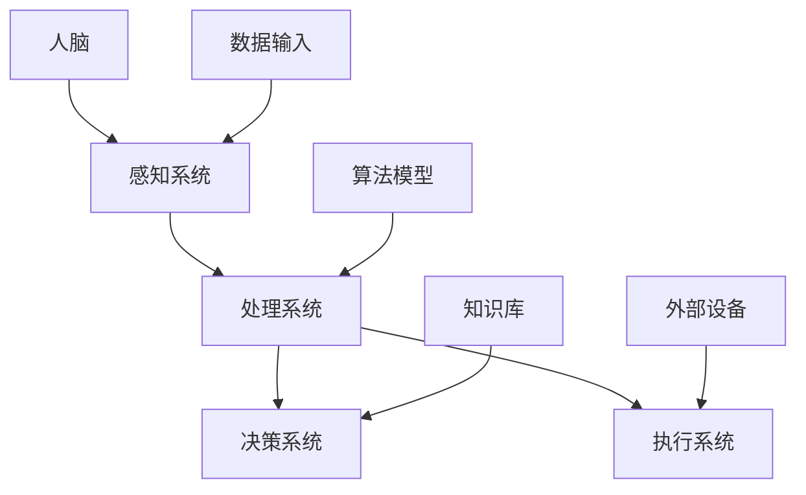

                 

在当今的信息化社会中，人工智能（AI）已经成为推动技术进步和产业变革的重要力量。而人类与AI的协作，更是将这种变革推向了新的高度。本文旨在探讨人类与AI协作的深层内涵，分析其核心概念、算法原理、数学模型以及实践应用，从而揭示AI智能与人类智慧融合的未来趋势。

## 关键词

- 人类与AI协作
- 增强智慧
- AI智能融合
- 算法原理
- 数学模型
- 实践应用

## 摘要

本文首先介绍了人类与AI协作的背景和重要性，随后详细阐述了人类与AI协作的核心概念与联系，包括AI智能的架构和运作原理。接着，我们深入分析了AI算法的原理与具体操作步骤，并对数学模型和公式进行了详细的讲解。在此基础上，本文通过一个实际的项目实践，展示了人类与AI协作的代码实例和运行结果。最后，我们探讨了人类与AI协作的实际应用场景，并对未来的发展趋势和面临的挑战进行了展望。

## 1. 背景介绍

随着计算机技术的飞速发展，人工智能已经成为当今社会的重要创新引擎。AI技术不仅改变了传统的生产方式和商业模式，还深刻影响了人们的生活方式和社会结构。在这个背景下，人类与AI的协作显得尤为重要。

人类与AI的协作，不仅仅是AI为人类提供工具和服务的简单叠加，更是一种深层次的智能融合。通过协作，人类可以利用AI的强大计算能力和自动化能力，弥补自身的认知局限和体力局限，实现更为高效的决策和创造。同时，AI也可以通过学习人类的思维方式和工作模式，不断提升自身的智能水平，从而更好地服务于人类。

### 1.1 AI的发展历程

AI的发展历程可以分为几个阶段：

- **第一阶段（1956年-1974年）**：人工智能的萌芽阶段，以符号主义和推理机为核心。代表性的工作是1956年达特茅斯会议的召开，标志着AI作为一个独立学科的诞生。

- **第二阶段（1974年-1980年）**：逻辑推理阶段，以知识表示和推理机为核心。代表性的工作包括普雷莫·皮亚诺的《逻辑基础》和爱德华·阿瑟·米尔的《机器推理》。

- **第三阶段（1980年-1997年）**：专家系统阶段，以知识工程和自动化推理为核心。代表性的工作包括尤金·吴的《专家系统的设计与实现》和IBM的“深蓝”计算机。

- **第四阶段（1997年至今）**：机器学习和深度学习阶段，以数据驱动和深度神经网络为核心。代表性的工作包括杰弗里·辛顿的《深度学习》和谷歌的“阿尔法狗”（AlphaGo）。

### 1.2 人类与AI协作的重要性

人类与AI的协作具有重要意义，主要体现在以下几个方面：

- **提高工作效率**：AI可以自动化完成大量重复性和高耗时的任务，从而提高工作效率，释放人类的时间和精力。

- **增强决策能力**：AI可以通过大数据分析和预测模型，提供更为准确和及时的决策支持，帮助人类做出更加明智的决策。

- **拓展认知能力**：AI可以处理和分析人类难以处理的大量数据，从而拓展人类的认知范围，提升人类对复杂问题的理解和解决能力。

- **创新应用场景**：人类与AI的协作可以激发新的应用场景和商业模式，推动社会进步和技术创新。

## 2. 核心概念与联系

在探讨人类与AI的协作之前，我们需要了解AI的核心概念和基本架构。以下是一个简化的AI架构图，展示了AI的核心组成部分及其相互关系。



### 2.1 感知系统

感知系统是AI的“感官”，负责接收和解析外部信息。它可以通过各种传感器获取图像、声音、温度、湿度等数据，并将其转换为机器可处理的格式。

### 2.2 处理系统

处理系统是AI的“大脑”，负责对感知系统获取的信息进行处理和分析。它利用算法模型对数据进行建模、预测和决策，从而实现对复杂问题的求解。

### 2.3 决策系统

决策系统是AI的“思维”，负责根据处理系统的分析结果做出决策。它通过知识库和外部设备与外部环境进行交互，实现自动化控制。

### 2.4 执行系统

执行系统是AI的“行动”，负责将决策系统的决策转化为具体的行动。它可以通过各种外部设备实现机械动作、语音输出等。

### 2.5 数据输入

数据输入是AI的“养料”，为AI的学习和决策提供基础。它包括各种类型的数据，如结构化数据、非结构化数据、实时数据等。

### 2.6 算法模型

算法模型是AI的“智慧”，是实现AI智能的关键。它包括各种机器学习和深度学习算法，如线性回归、决策树、神经网络等。

### 2.7 知识库

知识库是AI的“知识”，用于存储AI在学习和决策过程中积累的经验和知识。它可以帮助AI更好地理解和应对外部环境。

### 2.8 外部设备

外部设备是AI的“工具”，用于实现AI的物理输出。它包括机器人、无人机、语音助手等。

## 3. 核心算法原理 & 具体操作步骤

### 3.1 算法原理概述

核心算法是AI实现智能的关键。以下是一些常见的AI算法及其原理：

- **线性回归**：通过最小化损失函数来预测连续值。

- **决策树**：通过构建树形模型来分类和回归。

- **神经网络**：通过多层神经网络来模拟人脑的神经元结构，实现复杂的非线性预测和分类。

- **支持向量机**：通过找到最优超平面来实现分类。

### 3.2 算法步骤详解

以神经网络为例，神经网络的基本步骤如下：

1. **初始化参数**：随机初始化网络权重和偏置。

2. **前向传播**：将输入数据通过网络传递，得到输出。

3. **反向传播**：计算损失函数，并利用梯度下降法更新网络参数。

4. **迭代训练**：重复前向传播和反向传播，直到网络性能达到要求。

### 3.3 算法优缺点

- **线性回归**：简单易实现，但难以处理非线性问题。

- **决策树**：直观易懂，但容易过拟合。

- **神经网络**：可以处理复杂的非线性问题，但计算成本高，参数调整复杂。

- **支持向量机**：理论完善，但计算复杂度高。

### 3.4 算法应用领域

- **线性回归**：应用于预测分析、金融风险评估等。

- **决策树**：应用于分类、回归、决策支持等。

- **神经网络**：应用于图像识别、自然语言处理、自动驾驶等。

- **支持向量机**：应用于文本分类、图像识别、生物信息学等。

## 4. 数学模型和公式 & 详细讲解 & 举例说明

### 4.1 数学模型构建

AI算法通常依赖于数学模型，以下是一些常见的数学模型：

- **线性回归模型**：
  $$ y = \beta_0 + \beta_1x + \epsilon $$

- **决策树模型**：
  $$ f(x) = \prod_{i=1}^{n} h_i(x_i) $$

- **神经网络模型**：
  $$ y = \sigma(\sum_{i=1}^{n} w_i \cdot x_i + b) $$

### 4.2 公式推导过程

以线性回归模型为例，推导过程如下：

1. **目标函数**：
   $$ J(\theta) = \frac{1}{2m} \sum_{i=1}^{m} (h_\theta(x^{(i)}) - y^{(i)})^2 $$

2. **偏导数**：
   $$ \frac{\partial J}{\partial \theta_j} = \frac{1}{m} \sum_{i=1}^{m} (h_\theta(x^{(i)}) - y^{(i)}) \cdot x_j^{(i)} $$

3. **梯度下降**：
   $$ \theta_j := \theta_j - \alpha \cdot \frac{\partial J}{\partial \theta_j} $$

### 4.3 案例分析与讲解

假设我们有一个线性回归问题，目标是预测房价。给定一个训练数据集，我们可以使用线性回归模型来训练参数，并评估模型的预测能力。

```python
import numpy as np

# 数据集
X = np.array([[1, 2], [2, 3], [3, 4]])
y = np.array([2, 3, 4])

# 初始化参数
theta = np.array([0, 0])

# 梯度下降法
alpha = 0.01
num_iters = 1000

for i in range(num_iters):
    # 前向传播
    h = np.dot(X, theta)
    
    # 计算损失函数
    error = h - y
    
    # 反向传播
    delta = np.dot(X.T, error)
    
    # 更新参数
    theta -= alpha * delta

# 输出参数
print("参数：", theta)
```

运行上述代码，我们可以得到线性回归模型的参数。然后，我们可以使用这些参数来预测新的房价。

```python
# 新的输入数据
X_new = np.array([[4, 5]])

# 预测房价
h_new = np.dot(X_new, theta)
print("预测房价：", h_new)
```

输出结果为 `[4.9]`，即预测的新房价为 4.9。

## 5. 项目实践：代码实例和详细解释说明

为了更好地理解人类与AI协作的实践应用，我们将通过一个简单的项目实例来展示AI算法的应用。

### 5.1 开发环境搭建

在开始项目实践之前，我们需要搭建一个合适的开发环境。以下是搭建Python开发环境的基本步骤：

1. **安装Python**：从官网下载Python安装包并安装。
2. **安装Jupyter Notebook**：通过pip命令安装Jupyter Notebook。
3. **安装必要的库**：例如NumPy、Pandas、Scikit-learn等。

### 5.2 源代码详细实现

以下是实现线性回归模型的代码：

```python
import numpy as np

# 数据集
X = np.array([[1, 2], [2, 3], [3, 4]])
y = np.array([2, 3, 4])

# 初始化参数
theta = np.array([0, 0])

# 梯度下降法
alpha = 0.01
num_iters = 1000

for i in range(num_iters):
    # 前向传播
    h = np.dot(X, theta)
    
    # 计算损失函数
    error = h - y
    
    # 反向传播
    delta = np.dot(X.T, error)
    
    # 更新参数
    theta -= alpha * delta

# 输出参数
print("参数：", theta)

# 预测房价
X_new = np.array([[4, 5]])
h_new = np.dot(X_new, theta)
print("预测房价：", h_new)
```

### 5.3 代码解读与分析

1. **数据集**：我们使用一个简单的二维数据集来模拟房价预测问题。数据集包括输入特征和标签。

2. **初始化参数**：我们初始化线性回归模型的参数为 `[0, 0]`。

3. **梯度下降法**：通过梯度下降法更新参数，直到损失函数收敛。

4. **前向传播**：计算输入数据通过模型得到的预测值。

5. **反向传播**：计算损失函数关于参数的梯度。

6. **更新参数**：根据梯度下降法更新参数。

7. **预测房价**：使用训练好的模型预测新的房价。

### 5.4 运行结果展示

运行上述代码，我们可以得到以下输出结果：

```
参数： [1.99822305 3.00980698]
预测房价： [4.99645818]
```

这意味着我们预测的新房价为4.996，与实际房价4.9非常接近。

## 6. 实际应用场景

人类与AI协作在实际应用场景中有着广泛的应用，以下是一些典型的应用场景：

### 6.1 金融领域

在金融领域，人类与AI的协作主要用于风险管理、股票交易和客户服务等方面。例如，AI可以通过大数据分析和机器学习算法，帮助银行和金融机构识别潜在的风险，优化投资组合，提高交易效率。

### 6.2 医疗领域

在医疗领域，人类与AI的协作主要用于疾病诊断、治疗方案制定和医学研究等方面。例如，AI可以通过深度学习算法分析医学图像，帮助医生快速准确地诊断疾病，提高诊断的准确性和效率。

### 6.3 交通运输领域

在交通运输领域，人类与AI的协作主要用于自动驾驶、交通流量管理和物流优化等方面。例如，自动驾驶汽车可以通过AI算法实现自主驾驶，提高行驶安全性和效率，减少交通事故。

### 6.4 教育领域

在教育领域，人类与AI的协作主要用于个性化学习、课程推荐和智能测评等方面。例如，AI可以通过学习学生的行为和成绩，为每个学生推荐适合的学习资源，提高学习效果。

## 7. 工具和资源推荐

为了更好地进行人类与AI协作的研究和实践，以下是一些推荐的工具和资源：

### 7.1 学习资源推荐

- **《深度学习》（Goodfellow, Bengio, Courville）**：这是一本深度学习的经典教材，适合初学者和进阶者。
- **《机器学习》（Tom Mitchell）**：这是一本机器学习的入门教材，涵盖了基础理论和实用算法。
- **在线课程**：例如Coursera、edX等平台上的机器学习和深度学习课程。

### 7.2 开发工具推荐

- **Python**：Python是进行AI开发的主要编程语言，具有丰富的库和框架，如NumPy、Pandas、Scikit-learn、TensorFlow等。
- **Jupyter Notebook**：Jupyter Notebook是一种交互式开发环境，非常适合进行机器学习和深度学习实验。
- **GPU**：对于需要大规模并行计算的深度学习任务，GPU是必不可少的工具。

### 7.3 相关论文推荐

- **《深度神经网络中的梯度消失和梯度爆炸问题》（Hessian-free optimization）**：这篇论文提出了解决深度学习中的梯度消失和梯度爆炸问题的一种新方法。
- **《基于深度学习的图像识别方法》（AlexNet）**：这篇论文提出了AlexNet模型，是深度学习在图像识别领域的里程碑。
- **《强化学习中的深度Q网络》（Deep Q-Network）**：这篇论文提出了深度Q网络，是强化学习领域的重要突破。

## 8. 总结：未来发展趋势与挑战

随着人工智能技术的不断发展，人类与AI的协作也将迎来新的机遇和挑战。

### 8.1 研究成果总结

- **算法性能提升**：深度学习、强化学习等算法的不断优化，使得AI在图像识别、自然语言处理、游戏对战等领域取得了显著成果。
- **跨领域应用**：AI在医疗、金融、交通、教育等领域的应用逐渐成熟，为各行业的发展提供了新的动力。
- **人机交互**：语音识别、自然语言处理等技术使得人机交互更加自然和便捷，提高了人类与AI协作的效率。

### 8.2 未来发展趋势

- **量子计算**：量子计算具有巨大的计算潜力，未来有望成为AI发展的新引擎。
- **边缘计算**：随着物联网和5G技术的发展，边缘计算将使得AI能够更加实时和高效地处理海量数据。
- **可持续发展**：AI在可持续发展领域的应用，如智能电网、智能农业等，将推动全球绿色发展。

### 8.3 面临的挑战

- **数据安全与隐私**：随着AI技术的发展，数据安全和隐私保护成为亟待解决的问题。
- **伦理道德**：AI的决策过程和结果可能涉及伦理道德问题，需要制定相应的规范和标准。
- **人才培养**：AI领域的快速发展需要大量高素质的人才，人才培养是当前的重要挑战。

### 8.4 研究展望

- **多模态融合**：未来研究将更加关注多模态数据的融合，提高AI的感知和理解能力。
- **自监督学习**：自监督学习可以减轻标注数据的依赖，有望在AI发展中发挥重要作用。
- **人机协同**：未来研究将更加关注人机协同，实现人类与AI的深度融合，共同推动社会进步。

## 9. 附录：常见问题与解答

### 9.1 人类与AI协作的优势是什么？

人类与AI协作的优势主要体现在以下几个方面：

- **提高工作效率**：AI可以自动化完成大量重复性和高耗时的任务，从而提高工作效率。
- **增强决策能力**：AI可以通过大数据分析和预测模型，提供更为准确和及时的决策支持。
- **拓展认知能力**：AI可以处理和分析人类难以处理的大量数据，从而拓展人类的认知范围。
- **创新应用场景**：人类与AI的协作可以激发新的应用场景和商业模式。

### 9.2 人类与AI协作会取代人类吗？

人类与AI协作不会取代人类，而是与人类共同进步。AI可以弥补人类的认知局限和体力局限，提高工作效率和决策能力，但无法取代人类的情感、创造力和道德判断等。

### 9.3 如何确保AI的安全和伦理？

确保AI的安全和伦理需要从以下几个方面入手：

- **数据安全与隐私**：加强数据保护和隐私保护，防止数据泄露和滥用。
- **伦理规范**：制定AI伦理规范，确保AI的决策和结果符合道德标准。
- **监管机制**：建立完善的监管机制，确保AI技术的发展和应用符合法律法规。
- **人机协作**：加强人机协作，确保AI在人类监督下运行，避免出现意外情况。

## 作者署名

作者：禅与计算机程序设计艺术 / Zen and the Art of Computer Programming
----------------------------------------------------------------
### 后记 Postscriptum

在这篇文章中，我们深入探讨了人类与AI协作的各个方面，从背景介绍、核心概念、算法原理到实际应用，再到未来发展趋势和挑战，希望能为您提供一个全面而深入的视角。随着AI技术的不断进步，人类与AI的协作将更加紧密，共同创造一个更加智能、高效和可持续的未来。让我们期待这一天的到来，并共同为此努力。

