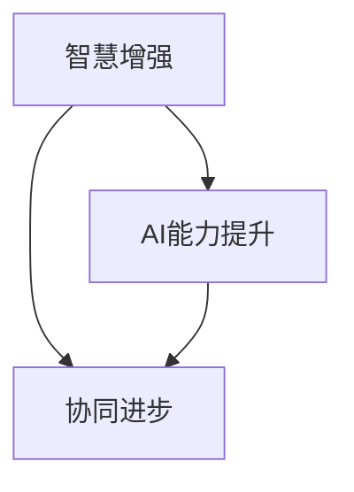

                 

关键词：人类-AI协作、智慧增强、AI能力提升、协同进步、技术融合、算法优化、数学模型、实践案例

> 摘要：本文将探讨人类与人工智能（AI）的协作模式，如何通过技术手段和算法优化，实现人类智慧和AI能力的协同进步。文章将从背景介绍、核心概念与联系、核心算法原理、数学模型与公式、项目实践、实际应用场景、工具和资源推荐、总结与展望等方面进行详细论述。

## 1. 背景介绍

在当今信息爆炸的时代，人类正面临着前所未有的挑战。从数据分析到智能决策，从自动化生产到智能医疗，人工智能（AI）已经成为推动社会进步的重要力量。与此同时，人类的智慧和创造力也在不断地拓展，为AI的发展提供了源源不断的创新动力。然而，如何更好地发挥人类与AI的协同作用，实现两者之间的深度融合，已经成为当前研究的热点问题。

人类-AI协作的背景可以从以下几个方面进行理解：

### 1.1 智慧与AI的互补性

人类的智慧具有丰富的情感、逻辑推理和创造力，而AI则在数据处理、模式识别和算法优化方面具有强大的能力。两者的结合可以形成优势互补，从而在各个领域实现更高的效率和更优的决策。

### 1.2 技术进步的驱动

随着大数据、云计算和物联网等技术的快速发展，AI的应用场景越来越广泛。同时，AI技术的不断迭代也推动了人类智慧的提升，使得人类能够更好地理解和利用AI的能力。

### 1.3 社会需求的驱动

在医疗、金融、教育等关键领域，人们对于高效、精准和智能化的服务需求日益增长。人类-AI协作可以满足这些需求，提高生产力和生活质量。

## 2. 核心概念与联系

在探讨人类-AI协作时，我们需要明确几个核心概念，包括智慧增强、AI能力提升、协同进步等。

### 2.1 智慧增强

智慧增强指的是通过技术手段提升人类的认知能力、决策能力和创新能力。这包括基于AI的智能助手、智能教育系统和智能健康监测等应用。

### 2.2 AI能力提升

AI能力提升指的是通过算法优化、模型改进和硬件升级等手段增强AI的性能。这包括深度学习、强化学习和迁移学习等先进技术的应用。

### 2.3 协同进步

协同进步指的是人类和AI在合作中实现共同进步，从而提高整体效能。这需要建立有效的协作机制、数据共享和沟通渠道。

为了更好地理解这些概念之间的关系，我们可以使用Mermaid流程图进行展示：



在这个流程图中，智慧增强和AI能力提升是协同进步的两个重要驱动力，而协同进步则是两者的最终目标。

## 3. 核心算法原理 & 具体操作步骤

### 3.1 算法原理概述

人类-AI协作的核心算法主要包括以下几个方面：

### 3.1.1 智能推荐算法

智能推荐算法通过分析用户的历史行为和偏好，为其推荐符合需求的内容。这可以应用于电子商务、社交媒体和在线教育等领域。

### 3.1.2 强化学习算法

强化学习算法通过模拟环境中的互动，逐步学习最优策略。这可以应用于自动驾驶、智能医疗和游戏开发等领域。

### 3.1.3 聚类分析算法

聚类分析算法通过将相似的数据点分组，帮助人类更好地理解和处理大量数据。这可以应用于市场分析、客户行为分析和文本挖掘等领域。

### 3.2 算法步骤详解

以智能推荐算法为例，其具体操作步骤如下：

### 3.2.1 数据收集

收集用户的历史行为数据，包括购买记录、浏览记录和评分记录等。

### 3.2.2 数据预处理

对收集到的数据进行清洗和格式化，确保数据的质量和一致性。

### 3.2.3 特征提取

根据用户的行为特征和内容特征，提取关键指标，用于后续的模型训练。

### 3.2.4 模型训练

使用机器学习算法，如协同过滤或基于内容的推荐，训练推荐模型。

### 3.2.5 推荐生成

根据用户的历史数据和模型预测，生成个性化的推荐列表。

### 3.3 算法优缺点

智能推荐算法具有以下优点：

- 提高用户满意度：通过个性化推荐，满足用户的需求和偏好。
- 提高转化率：帮助用户发现潜在的兴趣和需求，提高购买或使用的可能性。

然而，智能推荐算法也存在一些缺点：

- 过度推荐：可能导致用户收到大量的重复推荐，降低体验。
- 隐私问题：用户数据的安全性和隐私性可能受到威胁。

### 3.4 算法应用领域

智能推荐算法广泛应用于电子商务、社交媒体、在线教育和新闻推荐等领域。通过提高用户的参与度和满意度，实现商业价值和用户价值的双赢。

## 4. 数学模型和公式 & 详细讲解 & 举例说明

### 4.1 数学模型构建

在人类-AI协作中，数学模型起到了关键作用。以下是一个简单的线性回归模型，用于预测用户的行为：

$$
y = \beta_0 + \beta_1x_1 + \beta_2x_2 + ... + \beta_nx_n + \epsilon
$$

其中，$y$ 表示预测结果，$x_1, x_2, ..., x_n$ 表示特征变量，$\beta_0, \beta_1, \beta_2, ..., \beta_n$ 表示模型的参数，$\epsilon$ 表示误差项。

### 4.2 公式推导过程

线性回归模型的推导过程如下：

1. 假设数据集为 $D = \{(x_1^i, y_1^i), (x_2^i, y_2^i), ..., (x_n^i, y_n^i)\}$，其中 $i$ 表示第 $i$ 个样本。
2. 构建损失函数 $L(\beta_0, \beta_1, ..., \beta_n) = \sum_{i=1}^{n}(y_i^i - \beta_0 - \beta_1x_1^i - \beta_2x_2^i - ... - \beta_nx_n^i)^2$。
3. 对损失函数求导，并令导数为零，得到参数的估计值 $\beta_0, \beta_1, ..., \beta_n$。

### 4.3 案例分析与讲解

以下是一个关于用户购买行为的案例：

假设我们有100个用户，每个用户有5个特征变量（年龄、收入、教育程度、购物频率和品牌偏好），以及对应的购买记录。我们的目标是预测用户是否会购买某种商品。

1. 数据收集与预处理：收集用户的数据，并进行清洗和格式化。
2. 特征提取：提取每个用户的关键特征，如年龄、收入和教育程度。
3. 模型训练：使用线性回归模型训练参数，预测用户是否会购买商品。
4. 模型评估：使用交叉验证和测试集评估模型的准确性。

通过这个案例，我们可以看到数学模型在人类-AI协作中的作用。它帮助我们理解和预测用户的行为，从而实现更准确的推荐和决策。

## 5. 项目实践：代码实例和详细解释说明

### 5.1 开发环境搭建

为了实现人类-AI协作，我们需要搭建一个适合的开发环境。以下是一个基于Python的示例：

1. 安装Python：在操作系统上安装Python，版本要求为3.6及以上。
2. 安装相关库：安装Numpy、Pandas、Scikit-learn等常用库。
3. 准备数据集：收集并预处理用户数据，包括年龄、收入、教育程度、购物频率和品牌偏好等。

### 5.2 源代码详细实现

以下是一个简单的线性回归模型实现，用于预测用户是否购买商品：

```python
import numpy as np
import pandas as pd
from sklearn.linear_model import LinearRegression
from sklearn.model_selection import train_test_split

# 数据收集与预处理
data = pd.read_csv('user_data.csv')
X = data[['age', 'income', 'education', 'shopping_frequency', 'brand_preference']]
y = data['will_buy']

# 数据划分
X_train, X_test, y_train, y_test = train_test_split(X, y, test_size=0.2, random_state=42)

# 模型训练
model = LinearRegression()
model.fit(X_train, y_train)

# 模型评估
score = model.score(X_test, y_test)
print('模型准确率：', score)

# 预测
predictions = model.predict(X_test)
print('预测结果：', predictions)
```

### 5.3 代码解读与分析

1. 导入相关库：引入Numpy、Pandas和Scikit-learn等库，用于数据处理和模型训练。
2. 数据收集与预处理：读取用户数据，并进行清洗和格式化。
3. 数据划分：将数据集划分为训练集和测试集，用于模型训练和评估。
4. 模型训练：使用线性回归模型训练参数。
5. 模型评估：计算模型在测试集上的准确率。
6. 预测：使用训练好的模型对测试集进行预测。

通过这个案例，我们可以看到如何使用Python实现人类-AI协作，从而提高决策的准确性和效率。

## 6. 实际应用场景

### 6.1 智能医疗

在智能医疗领域，人类-AI协作可以实现个性化治疗和精准医疗。通过分析患者的病历、基因信息和临床数据，AI可以提供个性化的治疗方案，提高治疗效果。

### 6.2 金融风控

在金融领域，人类-AI协作可以帮助金融机构识别潜在的风险，防范金融欺诈和信用风险。通过分析大量的交易数据和行为特征，AI可以实时监测并预警异常行为。

### 6.3 智能制造

在智能制造领域，人类-AI协作可以实现生产过程的自动化和智能化。通过实时监测设备状态和生产数据，AI可以优化生产流程，提高生产效率。

### 6.4 教育个性化

在教育领域，人类-AI协作可以实现个性化教育和智能辅导。通过分析学生的学习行为和学习数据，AI可以为学生提供个性化的学习资源和辅导方案，提高学习效果。

## 7. 工具和资源推荐

### 7.1 学习资源推荐

- 《Python机器学习》（作者：塞巴斯蒂安·拉金斯基）：一本全面介绍Python机器学习的经典教材。
- 《深度学习》（作者：伊恩·古德费洛）：一本介绍深度学习的基础教材，适合初学者和进阶者。

### 7.2 开发工具推荐

- Jupyter Notebook：一款强大的交互式计算环境，适合数据分析和机器学习项目。
- TensorFlow：一款开源的机器学习框架，支持深度学习和强化学习等任务。

### 7.3 相关论文推荐

- “Deep Learning for Personalized Treatment in Cardiovascular Disease” by Arjmand et al. (2018)
- “Artificial Intelligence in Radiology” by Kalpathy-Cramer et al. (2018)
- “Intelligent Tutoring Systems Based on Deep Learning” by Mi et al. (2019)

## 8. 总结：未来发展趋势与挑战

### 8.1 研究成果总结

人类-AI协作已经取得了显著的研究成果，包括智能推荐、智能医疗、智能金融和智能制造等领域的应用。通过算法优化和数学模型的应用，人类-AI协作在提高决策准确性、提升效率和创造价值方面取得了重要突破。

### 8.2 未来发展趋势

未来，人类-AI协作将继续向深度化和智能化方向发展。随着算法的进步和硬件的发展，AI将在更多领域实现自动化和智能化，为人类创造更大的价值。

### 8.3 面临的挑战

尽管人类-AI协作具有巨大的潜力，但也面临着一些挑战：

- 隐私和安全：如何保护用户隐私和数据安全是一个重要问题。
- 伦理和责任：在人类-AI协作中，如何明确责任和伦理问题是需要解决的关键。
- 可解释性和透明度：提高AI模型的可解释性和透明度，增强人类对AI决策的信任。

### 8.4 研究展望

未来，我们需要进一步深入研究人类-AI协作的理论和方法，探索更高效、更可靠的协作模式。同时，加强跨学科合作，结合心理学、社会学和伦理学等领域的知识，推动人类-AI协作的全面发展。

## 9. 附录：常见问题与解答

### 9.1 人类-AI协作的主要挑战是什么？

主要挑战包括隐私和安全、伦理和责任、以及AI模型的可解释性和透明度。

### 9.2 人类-AI协作在医疗领域有哪些应用？

在医疗领域，人类-AI协作可以实现个性化治疗、精准医疗和智能诊断等应用，提高治疗效果和效率。

### 9.3 如何保护用户隐私和数据安全？

保护用户隐私和数据安全可以通过加密技术、隐私保护算法和权限控制等手段实现。

### 9.4 人类-AI协作的未来发展趋势是什么？

未来，人类-AI协作将继续向深度化和智能化方向发展，涵盖更多领域，实现更广泛的应用。

# 作者署名
作者：禅与计算机程序设计艺术 / Zen and the Art of Computer Programming

---

以上是本文的完整内容，希望对您的研究和思考有所帮助。如果您有任何疑问或需要进一步讨论，请随时联系。

