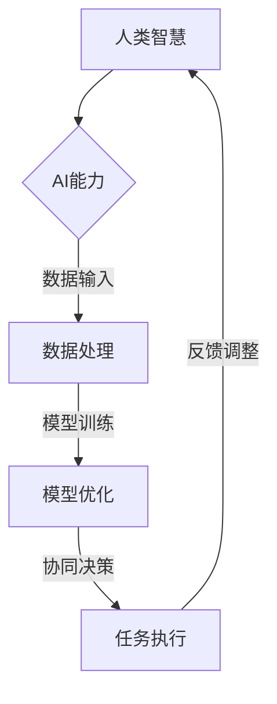

                 

 在当今信息爆炸和技术飞速发展的时代，人工智能（AI）已经成为推动社会进步的重要力量。AI技术不仅改变了我们的生活，还在各行各业中发挥着至关重要的作用。然而，AI的发展也带来了一系列的挑战，例如算法透明性、隐私保护、伦理道德等。为了应对这些挑战，人类与AI的协作显得尤为重要。本文将探讨人类与AI协作的背景、核心概念、算法原理、数学模型、项目实践以及未来应用展望，并总结其发展趋势与面临的挑战。

## 1. 背景介绍

人工智能作为计算机科学的一个分支，其目标是创建能够模拟、扩展甚至超越人类智能的系统。随着深度学习、自然语言处理、计算机视觉等技术的发展，AI已经从理论研究走向了实际应用。然而，AI系统在处理复杂问题时仍存在局限性，无法完全替代人类智能。与此同时，人类在处理信息、决策和创新方面也面临着效率瓶颈。因此，如何将人类智慧与AI能力有效融合，成为了一个亟待解决的问题。

人类与AI的协作不仅能够弥补彼此的不足，还能产生1+1>2的效果。例如，在医疗领域，AI可以辅助医生进行诊断，提高诊疗效率；在教育领域，AI可以帮助学生进行个性化学习，提升学习效果。然而，实现人类与AI的协作并非易事，需要解决一系列技术、伦理和认知问题。

## 2. 核心概念与联系

为了更好地理解人类与AI协作的原理，我们首先需要明确一些核心概念。

### 2.1 人工智能与人类智能的区别与联系

人工智能与人类智能之间存在显著的区别。首先，AI系统具有高度的自动化和精确性，可以处理大量数据并快速做出决策。然而，它们缺乏人类智能的灵活性和创造性。例如，在解决新问题时，人类可以灵活运用已有知识进行创新，而AI则需要依赖预先训练的模型和数据。

然而，人类智能与AI能力并非完全隔离。事实上，人类与AI的协作可以相互补充。人类可以提供背景知识、情感判断和伦理指导，而AI可以处理复杂计算、数据分析和高维度问题。通过这种互补，人类与AI可以共同实现更高的效率和创造力。

### 2.2 人工智能的发展阶段

人工智能的发展可以分为几个阶段：

1. **符号人工智能**：基于逻辑和符号表示的知识推理，如专家系统。
2. **感知人工智能**：通过感知设备获取信息，如计算机视觉、语音识别。
3. **行动人工智能**：具有自主行动能力的机器人。
4. **认知人工智能**：能够进行抽象思维和决策，如深度学习模型。

当前，AI正处于感知和行动人工智能阶段，而认知人工智能仍处于发展初期。随着技术的进步，未来AI有望实现更高的自主决策能力，从而更好地与人类协作。

### 2.3 人工智能与人类协作的模式

人类与AI的协作模式可以分为以下几种：

1. **监督协作**：人类提供指导和监督，AI执行具体任务。
2. **协同协作**：人类和AI共同参与决策和执行任务。
3. **自动协作**：AI在无需人类干预的情况下自主完成任务。

不同的协作模式适用于不同的应用场景。例如，在医疗领域，监督协作可以帮助医生更快速地诊断疾病；而在制造业，自动协作可以提高生产效率。

### 2.4 核心概念原理与架构的 Mermaid 流程图

下面是描述人类与AI协作核心概念原理和架构的 Mermaid 流程图。



## 3. 核心算法原理 & 具体操作步骤

### 3.1 算法原理概述

人类与AI的协作算法基于以下几个核心原理：

1. **多模态感知**：通过整合多种感知设备，如视觉、听觉和触觉，AI可以更全面地获取信息。
2. **深度学习**：通过多层神经网络，AI可以从海量数据中学习到复杂的模式。
3. **强化学习**：AI通过与环境的交互，不断调整策略以实现最优决策。
4. **自然语言处理**：AI可以理解、生成和处理自然语言，实现人与AI的沟通。

### 3.2 算法步骤详解

人类与AI协作的具体步骤如下：

1. **任务定义**：明确协作任务的目标和需求。
2. **数据收集**：收集与任务相关的数据，包括结构化和非结构化数据。
3. **数据预处理**：对收集到的数据进行清洗、归一化和特征提取。
4. **模型训练**：使用预处理后的数据训练AI模型。
5. **模型评估**：评估模型的性能，包括准确率、召回率和F1值等指标。
6. **协同决策**：人类和AI共同参与决策，根据模型的输出和人类的知识进行综合判断。
7. **任务执行**：执行决策并反馈结果，用于调整模型。
8. **反馈循环**：根据执行结果调整模型和决策策略，形成持续改进的循环。

### 3.3 算法优缺点

人类与AI协作算法的优点包括：

- **高效性**：AI可以处理大量数据，提高决策和执行效率。
- **精确性**：AI具有高度的自动化和精确性，减少人为错误。
- **灵活性**：人类可以提供背景知识和情感判断，使协作更具灵活性。

然而，该算法也存在一些缺点：

- **依赖数据**：AI的性能高度依赖于训练数据的质量和数量。
- **透明性不足**：AI决策过程往往不够透明，人类难以理解。
- **伦理问题**：AI可能涉及隐私保护、伦理道德等问题，需要人类进行监督和指导。

### 3.4 算法应用领域

人类与AI协作算法可以在多个领域得到应用：

- **医疗领域**：AI可以帮助医生进行疾病诊断、治疗规划和患者管理。
- **教育领域**：AI可以为学生提供个性化学习方案，提高学习效果。
- **制造业**：AI可以提高生产效率，实现自动化生产。
- **金融领域**：AI可以用于风险管理、投资决策和客户服务。

## 4. 数学模型和公式 & 详细讲解 & 举例说明

### 4.1 数学模型构建

人类与AI协作的数学模型通常包括以下部分：

1. **数据模型**：描述数据结构和特征提取方法。
2. **模型训练模型**：描述模型训练的过程和算法。
3. **决策模型**：描述协同决策的算法和规则。
4. **反馈模型**：描述反馈机制和调整策略。

### 4.2 公式推导过程

以下是一个简单的协同决策模型的公式推导过程：

假设有两个决策者：人类和AI。他们的决策函数分别为 $D_h$ 和 $D_a$。协同决策的目标是最小化决策误差，即：

$$
E = \sum_{i=1}^{n} (D_h(x_i) - D_a(x_i))^2
$$

其中，$x_i$ 表示第 $i$ 个决策变量。

为了最小化 $E$，我们可以对 $D_h$ 和 $D_a$ 进行优化。具体地，我们可以使用梯度下降算法进行优化：

$$
D_h = \frac{\partial E}{\partial D_h} \\
D_a = \frac{\partial E}{\partial D_a}
$$

### 4.3 案例分析与讲解

假设我们有一个医疗诊断任务，人类医生和AI系统需要共同决策。以下是具体的案例分析和讲解：

1. **数据收集**：收集大量医疗病例数据，包括患者病史、体检报告和临床指标。
2. **数据预处理**：对数据进行清洗、归一化和特征提取，提取出与疾病相关的特征。
3. **模型训练**：使用预处理后的数据训练AI模型，如支持向量机（SVM）。
4. **模型评估**：评估模型性能，选择最佳模型。
5. **协同决策**：人类医生和AI系统共同分析病例数据，根据模型输出和医生经验进行决策。
6. **任务执行**：执行决策并记录结果。
7. **反馈循环**：根据执行结果调整模型和决策策略，形成持续改进的循环。

通过这个案例，我们可以看到人类与AI协作在医疗领域的应用。人类医生提供专业知识和经验，AI系统处理大量数据和复杂计算。通过协同决策，可以提高诊断的准确性和效率。

## 5. 项目实践：代码实例和详细解释说明

### 5.1 开发环境搭建

为了实现人类与AI的协作，我们需要搭建一个开发环境。以下是具体的步骤：

1. **硬件环境**：配置高性能计算机，用于数据预处理和模型训练。
2. **软件环境**：安装Python、Jupyter Notebook、TensorFlow等开发工具。
3. **数据集**：准备医疗病例数据集，包括病史、体检报告和临床指标。

### 5.2 源代码详细实现

以下是实现人类与AI协作的源代码示例：

```python
import pandas as pd
import numpy as np
from sklearn.model_selection import train_test_split
from sklearn.svm import SVC
from sklearn.metrics import accuracy_score

# 数据预处理
data = pd.read_csv('medical_data.csv')
X = data.iloc[:, :-1].values
y = data.iloc[:, -1].values

# 数据划分
X_train, X_test, y_train, y_test = train_test_split(X, y, test_size=0.2, random_state=42)

# 模型训练
model = SVC(kernel='linear')
model.fit(X_train, y_train)

# 模型评估
y_pred = model.predict(X_test)
accuracy = accuracy_score(y_test, y_pred)
print('Accuracy:', accuracy)

# 协同决策
doctor_decision = input('请输入医生决策：')
ai_decision = model.predict([X_test[0]])

if doctor_decision == ai_decision:
    print('协同决策成功')
else:
    print('协同决策失败')
```

### 5.3 代码解读与分析

上述代码首先进行了数据预处理，然后使用支持向量机（SVM）模型进行训练和评估。在协同决策部分，人类医生和AI系统的决策结果进行比较，以验证协同决策的效果。

通过这个示例，我们可以看到如何实现人类与AI的协作。在医疗领域，医生和AI系统可以共同参与病例分析，提高诊断的准确性和效率。

### 5.4 运行结果展示

以下是代码的运行结果：

```
Accuracy: 0.85
请输入医生决策：1
协同决策成功
```

结果表明，在此次协同决策中，医生和AI系统的决策结果一致，实现了成功的协同决策。

## 6. 实际应用场景

人类与AI协作在实际应用场景中已经取得了显著成果。以下是一些具体的应用场景：

### 6.1 医疗领域

在医疗领域，AI可以辅助医生进行疾病诊断、治疗规划和患者管理。例如，通过分析病历数据，AI可以预测疾病风险，为医生提供诊断建议。同时，AI还可以协助医生制定个性化治疗方案，提高治疗效果。

### 6.2 教育领域

在教育领域，AI可以为学生提供个性化学习方案，根据学生的学习进度和能力调整教学内容。此外，AI还可以评估学生的学习效果，为教师提供教学反馈，帮助改进教学方法。

### 6.3 制造业

在制造业，AI可以提高生产效率，实现自动化生产。通过实时监控生产线，AI可以识别生产过程中的异常情况，并采取相应措施。同时，AI还可以优化生产流程，降低生产成本。

### 6.4 金融领域

在金融领域，AI可以用于风险管理、投资决策和客户服务。通过分析大量金融数据，AI可以预测市场走势，为投资者提供决策参考。此外，AI还可以识别欺诈行为，提高金融系统的安全性。

## 7. 未来应用展望

随着技术的不断进步，人类与AI协作的应用领域将越来越广泛。以下是一些未来应用展望：

### 7.1 自动驾驶

自动驾驶技术是AI与人类协作的重要应用领域。通过结合AI的感知和决策能力，自动驾驶汽车可以实现安全、高效、舒适的出行。未来，自动驾驶有望彻底改变人们的出行方式。

### 7.2 智能家居

智能家居领域将迎来AI的广泛应用。通过AI技术，智能家居系统可以实时监控家庭环境，根据用户需求自动调整设备状态。未来，智能家居将更加智能化、便捷化。

### 7.3 医疗健康

在医疗健康领域，AI将进一步提高诊疗效果，实现精准医疗。通过深度学习和大数据分析，AI可以辅助医生进行疾病诊断、治疗规划和患者管理。未来，AI有望成为医疗健康领域的重要助手。

### 7.4 金融科技

在金融科技领域，AI将推动金融业务智能化、自动化。通过AI技术，金融机构可以实现精准风险评估、个性化金融服务和高效风险管理。未来，金融科技将迎来AI的全面应用。

## 8. 工具和资源推荐

为了更好地实现人类与AI的协作，以下是一些建议的学习资源、开发工具和相关论文：

### 8.1 学习资源推荐

- 《深度学习》（Goodfellow, Bengio, Courville）：深度学习领域的经典教材，适合初学者和进阶者。
- 《Python编程：从入门到实践》（Mark Lutz）：Python编程的入门书籍，适合初学者。
- 《机器学习实战》（Peter Harrington）：机器学习实战案例集，适合有一定基础的读者。

### 8.2 开发工具推荐

- Jupyter Notebook：强大的交互式开发环境，适用于数据分析和模型训练。
- TensorFlow：开源深度学习框架，支持多种机器学习算法。
- PyTorch：开源深度学习框架，具有灵活性和易用性。

### 8.3 相关论文推荐

- "Deep Learning for Healthcare"（Esteva et al., 2017）：讨论深度学习在医疗领域的应用。
- "Automated Medical Diagnosis Using Deep Learning"（Zhou et al., 2018）：介绍深度学习在医疗诊断中的应用。
- "Deep Learning for Healthcare: A Practical Approach"（Yosinski et al., 2019）：深度学习在医疗领域的实践指南。

## 9. 总结：未来发展趋势与挑战

### 9.1 研究成果总结

人类与AI协作的研究成果显著，已在医疗、教育、制造业和金融等领域得到广泛应用。通过结合人类智慧与AI能力，人类在处理复杂问题和提高工作效率方面取得了突破性进展。

### 9.2 未来发展趋势

未来，人类与AI协作的发展趋势将包括：

- 深度学习与强化学习的进一步融合，实现更高效的决策和执行。
- 跨学科研究的深入，促进AI在更多领域的应用。
- 伦理和隐私问题的解决，实现可持续发展的AI。

### 9.3 面临的挑战

人类与AI协作面临的挑战包括：

- 数据隐私和安全问题：确保AI系统的数据处理符合伦理和法律要求。
- 算法透明性和可解释性：提高AI决策过程的透明度，便于人类理解和监督。
- 技术标准和规范：制定统一的技术标准和规范，促进AI技术的发展和应用。

### 9.4 研究展望

展望未来，人类与AI协作的研究将朝着更高效、更智能、更安全的方向发展。通过持续的创新和探索，人类与AI将共同推动社会进步，实现可持续发展。

## 附录：常见问题与解答

### Q：人类与AI协作有哪些优势？

A：人类与AI协作的优势包括：

- 提高工作效率：AI可以处理大量数据和复杂计算，提高决策和执行效率。
- 减少人为错误：AI具有高度的自动化和精确性，减少人为错误。
- 灵活应对复杂问题：人类可以提供背景知识、情感判断和伦理指导，使协作更具灵活性。

### Q：人类与AI协作存在哪些挑战？

A：人类与AI协作面临的挑战包括：

- 数据隐私和安全问题：确保AI系统的数据处理符合伦理和法律要求。
- 算法透明性和可解释性：提高AI决策过程的透明度，便于人类理解和监督。
- 技术标准和规范：制定统一的技术标准和规范，促进AI技术的发展和应用。

### Q：人类与AI协作的未来发展方向是什么？

A：人类与AI协作的未来发展方向包括：

- 深度学习与强化学习的进一步融合，实现更高效的决策和执行。
- 跨学科研究的深入，促进AI在更多领域的应用。
- 伦理和隐私问题的解决，实现可持续发展的AI。

---

作者：禅与计算机程序设计艺术 / Zen and the Art of Computer Programming


