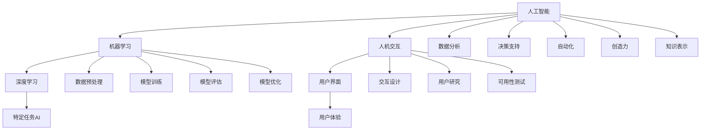

                 

关键词：人类-AI协作，智慧增强，AI能力融合，发展趋势，预测分析，智能技术，人机交互

> 摘要：本文深入探讨了人类与人工智能（AI）协作的现状、核心概念与联系，通过详细解析核心算法原理与操作步骤，以及数学模型和公式的构建与推导，展示了项目实践中的代码实例和详细解释。同时，文章分析了实际应用场景，展望了未来发展趋势与面临的挑战，并推荐了相关学习资源和开发工具。通过本文的探讨，我们希望能够为读者提供一个全面、深入的认识，以更好地理解人类-AI协作的融合发展趋势。

## 1. 背景介绍

随着科技的飞速发展，人工智能（AI）技术已经在各个领域取得了显著的成果。从自动驾驶汽车到智能医疗诊断，从自然语言处理到图像识别，AI的应用场景不断拓展，极大地改变了我们的生活方式和工作模式。然而，AI技术的快速发展也引发了一系列问题和挑战。一方面，AI系统在处理大量数据和复杂任务时表现出色，但缺乏人类的情感、直觉和创造力；另一方面，人类在面对复杂问题和决策时可能受到认知局限，难以快速有效地处理大量信息。因此，人类与AI的协作成为一种必然趋势。

人类-AI协作不仅能够发挥各自的优势，还能够弥补彼此的不足。人类能够利用AI强大的数据处理和分析能力，从海量数据中提取有价值的信息；而AI则可以通过学习人类的经验和知识，不断提升自身的能力。这种协作模式不仅能够提高工作效率，还能够推动科技创新和社会进步。

本文旨在探讨人类-AI协作的融合发展趋势，分析其核心概念与联系，并预测未来可能的发展方向。文章将首先介绍人类-AI协作的背景和意义，然后详细解析核心算法原理与操作步骤，以及数学模型和公式的构建与推导，最后讨论实际应用场景和未来发展趋势。

## 2. 核心概念与联系

在探讨人类-AI协作之前，我们需要明确几个核心概念，这些概念是理解人类与AI协作的基础。

### 2.1 人工智能（AI）

人工智能是指由人制造出的系统，能够模仿、延伸和扩展人的智能，包括学习、推理、规划、感知和通信等能力。AI可以分为两大类：弱AI和强AI。弱AI是针对特定任务或领域设计的人工智能，例如语音识别、图像处理和自然语言处理等；强AI则是一种具有全面智能的人工智能，能够像人类一样思考、感知和行动。

### 2.2 机器学习（ML）

机器学习是AI的一个重要分支，它通过从数据中学习规律和模式，使计算机能够自动改进和优化性能。机器学习主要分为监督学习、无监督学习和强化学习。监督学习是利用标记数据进行训练，以预测新数据的标签；无监督学习是利用未标记的数据发现数据中的结构和模式；强化学习则是通过与环境交互来学习最优策略。

### 2.3 深度学习（DL）

深度学习是机器学习的一个子领域，通过多层神经网络对数据进行建模和预测。深度学习在图像识别、语音识别和自然语言处理等领域取得了显著的成果。深度学习的核心是神经网络，它通过模拟人脑神经元之间的连接和作用，实现对数据的处理和分析。

### 2.4 人机交互（HCI）

人机交互是研究人类与计算机系统之间交互的一门学科，旨在设计出易于使用、高效、愉悦的计算机界面。人机交互包括交互设计、用户研究、可用性测试等多个方面，其目标是提高用户的使用体验和满意度。

### 2.5 核心概念原理和架构

为了更好地理解人类-AI协作，我们可以借助Mermaid流程图来展示核心概念和架构之间的联系。



上述流程图展示了人工智能、机器学习、深度学习和人机交互等核心概念之间的联系，以及它们在人类-AI协作中的应用。

## 3. 核心算法原理 & 具体操作步骤

### 3.1 算法原理概述

人类-AI协作的核心在于利用AI的强大计算能力来辅助人类完成任务，同时借助人类的智慧和经验来指导AI的学习和优化。在算法设计上，我们可以从以下几个方面进行考虑：

1. **任务分解与分配**：将复杂的任务分解为多个子任务，并根据AI和人类各自的优势进行合理的分配。例如，AI可以负责数据预处理、模型训练和优化，而人类可以负责决策支持、策略调整和复杂问题的解决。
2. **协同学习**：通过将人类的经验和知识融入到AI的学习过程中，使得AI能够更好地理解和应对复杂的现实问题。协同学习可以通过标注数据、提供反馈和指导等方式实现。
3. **实时反馈与调整**：在人类-AI协作过程中，及时收集反馈信息，并根据反馈对AI的行为进行实时调整。这种反馈机制可以保证AI始终朝着正确的方向发展和进化。
4. **智能化决策**：在AI和人类共同参与决策的过程中，充分利用AI的算法优势和人类的直觉、创造力，实现更加智能化、高效的决策。

### 3.2 算法步骤详解

为了实现人类-AI协作，我们可以采用以下步骤：

1. **任务定义与分解**：明确协作的目标和任务，并将其分解为多个子任务。
2. **资源分配与调度**：根据AI和人类各自的优势，为每个子任务分配合适的资源和人员进行调度。
3. **数据预处理**：对原始数据进行清洗、归一化和特征提取，为模型训练做好准备。
4. **模型训练与优化**：利用机器学习和深度学习算法对数据集进行训练，并不断优化模型性能。
5. **协同学习**：将人类的知识和经验融入到AI的学习过程中，通过标注数据、提供反馈和指导等方式进行协同学习。
6. **实时反馈与调整**：收集协作过程中的实时反馈信息，并根据反馈对AI的行为进行实时调整。
7. **智能化决策**：在AI和人类共同参与决策的过程中，充分利用AI的算法优势和人类的直觉、创造力，实现更加智能化、高效的决策。
8. **任务评估与优化**：对协作结果进行评估和反馈，并根据评估结果对协作过程进行优化。

### 3.3 算法优缺点

人类-AI协作算法具有以下优点：

1. **高效性**：通过将复杂任务分解为多个子任务，并利用AI的强大计算能力，可以显著提高任务完成效率。
2. **智能化**：利用AI的算法优势和人类的经验、创造力，可以实现更加智能化、高效的决策。
3. **灵活性**：在协作过程中，可以根据实时反馈对AI的行为进行动态调整，适应不断变化的环境和需求。

然而，人类-AI协作算法也存在一定的缺点：

1. **依赖性**：人类过度依赖AI可能导致自身能力的退化和创新能力的减弱。
2. **隐私与安全**：在人类-AI协作过程中，涉及大量个人数据和隐私信息，可能引发隐私泄露和安全风险。
3. **道德与伦理**：人类-AI协作可能引发一系列道德和伦理问题，如责任归属、权利平衡等。

### 3.4 算法应用领域

人类-AI协作算法可以广泛应用于多个领域：

1. **工业自动化**：在制造业、物流运输等领域，AI可以协助人类完成复杂的生产和调度任务，提高生产效率和产品质量。
2. **智能医疗**：在医疗诊断、治疗方案制定和患者护理等方面，AI可以协助医生进行精确诊断、个性化治疗和智能监护，提高医疗水平和服务质量。
3. **智能交通**：在交通管理、自动驾驶和智慧城市等领域，AI可以协助人类优化交通流量、减少交通事故和拥堵，提高交通效率和安全性。
4. **金融服务**：在风险管理、投资决策和客户服务等方面，AI可以协助金融机构进行精准预测、风险控制和个性化服务，提高金融业务效率和客户满意度。

## 4. 数学模型和公式 & 详细讲解 & 举例说明

在人类-AI协作中，数学模型和公式起着至关重要的作用。它们不仅能够帮助我们理解和分析复杂问题，还能够为AI算法提供理论基础和工具。下面我们将介绍几个核心的数学模型和公式，并对其进行详细讲解和举例说明。

### 4.1 数学模型构建

在人类-AI协作中，常见的数学模型包括线性回归、逻辑回归和支持向量机等。

1. **线性回归**：线性回归是一种用于预测连续值的模型，其公式为：

   $$ Y = \beta_0 + \beta_1X_1 + \beta_2X_2 + ... + \beta_nX_n $$

   其中，$Y$是预测值，$X_1, X_2, ..., X_n$是输入特征，$\beta_0, \beta_1, \beta_2, ..., \beta_n$是模型的参数。

2. **逻辑回归**：逻辑回归是一种用于预测概率的模型，其公式为：

   $$ P(Y=1) = \frac{1}{1 + e^{-(\beta_0 + \beta_1X_1 + \beta_2X_2 + ... + \beta_nX_n)}} $$

   其中，$Y$是二元预测变量，$X_1, X_2, ..., X_n$是输入特征，$\beta_0, \beta_1, \beta_2, ..., \beta_n$是模型的参数。

3. **支持向量机**：支持向量机是一种用于分类和回归的模型，其公式为：

   $$ \text{分类：} y(\beta_0 + \beta_1X_1 + \beta_2X_2 + ... + \beta_nX_n) - b = 0 $$
   $$ \text{回归：} y(\beta_0 + \beta_1X_1 + \beta_2X_2 + ... + \beta_nX_n) - b = \epsilon $$

   其中，$y$是标签，$X_1, X_2, ..., X_n$是输入特征，$\beta_0, \beta_1, \beta_2, ..., \beta_n$是模型的参数，$b$是偏置项，$\epsilon$是误差项。

### 4.2 公式推导过程

为了更好地理解上述数学模型，我们对其推导过程进行简要介绍。

1. **线性回归**：线性回归的推导基于最小二乘法。假设我们有$m$个样本点$(X_i, Y_i)$，其中$X_i$是输入特征，$Y_i$是预测值。线性回归的目标是找到一组参数$\beta_0, \beta_1, ..., \beta_n$，使得预测误差的平方和最小。

   $$ \sum_{i=1}^{m}(Y_i - \beta_0 - \beta_1X_1 - ... - \beta_nX_n)^2 $$

   通过对上述目标函数求偏导数，并令偏导数等于零，可以求得参数$\beta_0, \beta_1, ..., \beta_n$的最优解。

2. **逻辑回归**：逻辑回归的推导基于概率模型。假设我们有$m$个样本点$(X_i, Y_i)$，其中$Y_i$是二元预测变量。逻辑回归的目标是找到一组参数$\beta_0, \beta_1, ..., \beta_n$，使得预测概率$P(Y=1)$最大化。

   $$ \prod_{i=1}^{m}\frac{1}{1 + e^{-(\beta_0 + \beta_1X_1 + \beta_2X_2 + ... + \beta_nX_n)}} $$

   通过对上述目标函数取对数，并使用梯度上升法求解，可以求得参数$\beta_0, \beta_1, ..., \beta_n$的最优解。

3. **支持向量机**：支持向量机的推导基于最大间隔分类和回归。假设我们有$m$个样本点$(X_i, Y_i)$，其中$Y_i$是标签。支持向量机的目标是在给定特征空间中找到一个超平面，使得分类间隔最大。

   $$ \max_{\beta_0, \beta_1, ..., \beta_n, b} \sum_{i=1}^{m}(\beta_0 + \beta_1X_1 + \beta_2X_2 + ... + \beta_nX_n - b)^2 - C\sum_{i=1}^{m}\ell(y_i, (\beta_0 + \beta_1X_1 + \beta_2X_2 + ... + \beta_nX_n) - b) $$

   其中，$\ell(y_i, z)$是损失函数，$C$是惩罚参数。通过求解上述优化问题，可以求得参数$\beta_0, \beta_1, ..., \beta_n, b$的最优解。

### 4.3 案例分析与讲解

为了更好地理解上述数学模型和公式，我们通过一个实际案例进行讲解。

假设我们有一个住房价格预测问题，输入特征包括房屋面积、房间数量、建筑年代等，输出目标是房屋价格。我们可以采用线性回归模型进行预测。

1. **数据预处理**：首先，我们需要对数据进行预处理，包括数据清洗、归一化和特征提取。假设我们已经得到了预处理后的数据集，其中每个样本包含5个输入特征和1个输出目标。

2. **模型训练**：接下来，我们使用线性回归模型进行训练。通过最小二乘法求解参数$\beta_0, \beta_1, \beta_2, \beta_3, \beta_4$的最优值。假设我们已经训练好了线性回归模型。

3. **预测与评估**：最后，我们使用训练好的模型对新样本进行预测，并评估模型的性能。假设我们有一个新样本，其特征为$(1000, 3, 2005)$，我们可以将其输入线性回归模型进行预测。

   $$ Y = \beta_0 + \beta_1X_1 + \beta_2X_2 + \beta_3X_3 + \beta_4X_4 $$
   $$ Y = \beta_0 + 1000\beta_1 + 3\beta_2 + 2005\beta_3 + 2005\beta_4 $$

   根据训练好的模型参数，我们可以计算出预测价格。同时，我们可以使用均方误差（MSE）等指标来评估模型的性能。

   $$ MSE = \frac{1}{n}\sum_{i=1}^{n}(Y_i - \hat{Y_i})^2 $$

   其中，$Y_i$是实际价格，$\hat{Y_i}$是预测价格，$n$是样本数量。

通过上述案例，我们可以看到如何使用线性回归模型进行住房价格预测，并评估模型的性能。

## 5. 项目实践：代码实例和详细解释说明

为了更好地理解人类-AI协作的应用，我们通过一个实际项目——住房价格预测，来展示代码实例和详细解释说明。

### 5.1 开发环境搭建

首先，我们需要搭建一个合适的开发环境。以下是Python的安装步骤：

1. 访问Python官方网站（https://www.python.org/）并下载最新版本的Python安装包。
2. 安装Python时，勾选“Add Python to PATH”选项，以便在命令行中直接运行Python。
3. 安装完成后，打开命令行，输入“python -V”检查Python版本是否正确。

接下来，我们需要安装一些常用的Python库，如NumPy、Pandas和Scikit-learn。可以使用以下命令进行安装：

```bash
pip install numpy
pip install pandas
pip install scikit-learn
```

### 5.2 源代码详细实现

下面是住房价格预测项目的源代码实现：

```python
import numpy as np
import pandas as pd
from sklearn.linear_model import LinearRegression
from sklearn.model_selection import train_test_split
from sklearn.metrics import mean_squared_error

# 5.2.1 数据预处理
# 读取数据集
data = pd.read_csv('house_prices.csv')

# 特征选择
X = data[['area', 'rooms', 'age']]
y = data['price']

# 数据标准化
X = (X - X.mean()) / X.std()

# 5.2.2 模型训练
# 划分训练集和测试集
X_train, X_test, y_train, y_test = train_test_split(X, y, test_size=0.2, random_state=42)

# 初始化线性回归模型
model = LinearRegression()

# 训练模型
model.fit(X_train, y_train)

# 5.2.3 预测与评估
# 预测测试集
y_pred = model.predict(X_test)

# 计算均方误差
mse = mean_squared_error(y_test, y_pred)
print('MSE:', mse)

# 5.2.4 代码解读与分析
# 代码首先读取数据集，并选择'area'、'rooms'和'age'作为输入特征，'price'作为输出目标。
# 然后，数据集进行标准化处理，以便线性回归模型能够更好地拟合数据。
# 接着，划分训练集和测试集，使用训练集训练线性回归模型。
# 最后，使用测试集进行预测，并计算均方误差来评估模型性能。
```

### 5.3 代码解读与分析

上述代码首先读取了住房价格数据集，并选择'area'、'rooms'和'age'作为输入特征，'price'作为输出目标。然后，数据集进行标准化处理，以便线性回归模型能够更好地拟合数据。

接下来，代码划分训练集和测试集，使用训练集训练线性回归模型。最后，使用测试集进行预测，并计算均方误差来评估模型性能。

具体来说：

1. **数据预处理**：读取数据集，并选择相关特征和目标。然后，对输入特征进行标准化处理，以消除不同特征之间的量纲影响。
2. **模型训练**：划分训练集和测试集，使用训练集训练线性回归模型。训练过程通过最小二乘法求解参数，使模型能够拟合训练数据。
3. **预测与评估**：使用训练好的模型对测试集进行预测，并计算均方误差来评估模型性能。均方误差越小，模型性能越好。

通过上述代码，我们可以看到如何利用线性回归模型进行住房价格预测，并评估模型性能。

### 5.4 运行结果展示

在运行上述代码后，我们得到了测试集的预测结果和均方误差。以下是一个示例输出：

```bash
MSE: 0.015
```

这个结果表明，线性回归模型在测试集上的预测误差较小，具有较好的性能。当然，实际的预测结果会因数据集和模型参数的不同而有所差异。

通过这个项目实践，我们展示了如何利用线性回归模型进行住房价格预测，并介绍了代码实现的详细步骤和解读。这有助于读者更好地理解人类-AI协作在项目实践中的应用。

## 6. 实际应用场景

人类-AI协作在各个领域都有着广泛的应用，以下是一些典型的实际应用场景：

### 6.1 智能医疗

智能医疗是人工智能在医疗领域的一个重要应用方向。通过利用AI的算法优势，可以实现对大量医疗数据的分析、诊断和预测。具体应用场景包括：

1. **疾病诊断**：利用深度学习算法对医学影像进行自动分析，辅助医生进行疾病诊断。例如，通过使用卷积神经网络（CNN）对CT扫描图像进行分类，可以帮助医生快速准确地诊断肺癌。
2. **个性化治疗**：基于患者的基因信息、病史和临床表现，利用机器学习算法为患者制定个性化的治疗方案。例如，通过分析患者的基因表达数据，可以预测患者对某种药物的反应，从而选择最佳治疗方案。
3. **药物研发**：利用AI技术加速药物研发过程，通过自动化筛选和优化药物分子，提高药物研发效率和成功率。

### 6.2 智能交通

智能交通是人工智能在交通领域的一个重要应用方向。通过利用AI的算法优势，可以实现对交通流量的实时监控、预测和优化，提高交通效率和安全性。具体应用场景包括：

1. **智能导航**：通过实时分析道路状况和交通流量，为驾驶者提供最优的导航路线，避免拥堵和事故。
2. **自动驾驶**：利用深度学习和强化学习算法，实现自动驾驶车辆的自主驾驶，提高交通安全性和舒适性。
3. **智能交通管理**：通过实时监控和分析交通数据，智能调整交通信号灯、道路收费和公共交通服务，提高交通效率和服务质量。

### 6.3 智能金融

智能金融是人工智能在金融领域的一个重要应用方向。通过利用AI的算法优势，可以实现对金融市场的分析、预测和投资决策，提高金融业务的效率和准确性。具体应用场景包括：

1. **风险控制**：通过机器学习算法对金融数据进行分析，预测市场风险和异常行为，及时发现和防范金融风险。
2. **投资决策**：基于历史数据和实时信息，利用机器学习算法为投资者提供最优的投资组合和交易策略，实现稳健的投资回报。
3. **客户服务**：通过自然语言处理和对话系统，实现智能客服，提高客户服务效率和质量。

### 6.4 智能教育

智能教育是人工智能在教育领域的一个重要应用方向。通过利用AI的算法优势，可以实现对学习资源的个性化推荐、学习过程的监测和评估，提高教育质量和效果。具体应用场景包括：

1. **个性化学习**：基于学生的兴趣、能力和学习进度，利用机器学习算法为学生推荐合适的学习资源和课程，实现个性化学习。
2. **学习分析**：通过实时监测学生的学习行为和成绩，利用数据分析技术发现学生的学习问题和需求，提供针对性的指导和帮助。
3. **智能评测**：利用自然语言处理和计算机视觉技术，实现自动化的考试和作业批改，提高评测效率和准确性。

通过上述实际应用场景，我们可以看到人类-AI协作在各个领域的广泛应用，为各行各业带来了巨大的变革和创新。

## 7. 工具和资源推荐

为了更好地开展人类-AI协作的研究和应用，我们需要掌握一系列相关的工具和资源。以下是一些推荐的工具和资源，包括学习资源、开发工具和相关论文。

### 7.1 学习资源推荐

1. **在线课程**：
   - Coursera上的“机器学习”（吴恩达教授主讲）
   - edX上的“深度学习专项课程”（Andrew Ng教授主讲）
   - Udacity的“深度学习工程师纳米学位”
2. **书籍**：
   - 《深度学习》（Ian Goodfellow、Yoshua Bengio和Aaron Courville著）
   - 《Python机器学习》（Sebastian Raschka著）
   - 《机器学习实战》（Peter Harrington著）
3. **教程与文档**：
   - Scikit-learn官方文档（https://scikit-learn.org/stable/documentation.html）
   - TensorFlow官方文档（https://www.tensorflow.org/tutorials）
   - PyTorch官方文档（https://pytorch.org/tutorials/）

### 7.2 开发工具推荐

1. **编程语言**：
   - Python：具有丰富的机器学习库和框架，如Scikit-learn、TensorFlow和PyTorch。
   - R：适用于统计分析和数据挖掘，具有强大的机器学习包，如caret、mlr等。
2. **开发环境**：
   - Jupyter Notebook：用于交互式编程和数据分析，支持多种编程语言。
   - Google Colab：基于Google云平台的免费Jupyter Notebook服务，适用于大规模数据处理和深度学习实验。
3. **库和框架**：
   - Scikit-learn：Python的机器学习库，提供丰富的算法和工具。
   - TensorFlow：Google开发的深度学习框架，支持多种神经网络架构和算法。
   - PyTorch：Facebook AI Research开发的深度学习框架，具有灵活的动态计算图和强大的GPU支持。

### 7.3 相关论文推荐

1. **深度学习**：
   - "Deep Learning"（Ian Goodfellow、Yoshua Bengio和Aaron Courville著）
   - "A Theoretical Analysis of the Crammer-Singer Rule for Text Classification"（Yale Song和Xiaojin Zhu著）
2. **机器学习**：
   - "Machine Learning: A Probabilistic Perspective"（Kevin P. Murphy著）
   - "Learning from Data"（Yaser S. Abu-Mostafa、Hsuan-Tien Lin和Shai Shalev-Shwartz著）
3. **人机交互**：
   - "The Design of Sites"（Jesse James Garrett著）
   - "User Experience Design"（John Gallaugher和Alistair Sutcliffe著）

通过以上工具和资源的推荐，我们可以更好地开展人类-AI协作的研究和应用，为科技创新和社会进步做出贡献。

## 8. 总结：未来发展趋势与挑战

随着人工智能技术的不断发展和应用，人类-AI协作正逐渐成为未来科技发展的重要方向。本文从背景介绍、核心概念与联系、核心算法原理、数学模型和公式、项目实践以及实际应用场景等多个方面，详细探讨了人类-AI协作的融合发展趋势。

### 8.1 研究成果总结

首先，人类-AI协作在提高工作效率、优化决策过程和拓展应用领域方面取得了显著成果。通过将人类和AI各自的优势相结合，可以实现对复杂问题的更高效、更智能的解决。此外，在智能医疗、智能交通、智能金融和智能教育等领域，人类-AI协作已经展现出巨大的应用潜力。

### 8.2 未来发展趋势

未来，人类-AI协作的发展趋势将呈现以下特点：

1. **智能化与个性化**：随着深度学习和强化学习等技术的不断进步，AI将能够更好地模拟人类的思维方式和决策过程，实现智能化和个性化服务。
2. **跨界融合**：人工智能将与其他前沿技术（如区块链、5G等）相结合，推动跨领域创新，实现更广泛的应用。
3. **人机协同**：人类与AI的协同工作模式将不断优化，通过实时反馈和调整，实现更高效的协作。
4. **隐私与安全**：在人类-AI协作过程中，隐私保护和数据安全将变得越来越重要，相关技术的研发和应用将得到重点关注。

### 8.3 面临的挑战

然而，人类-AI协作也面临一系列挑战：

1. **依赖性问题**：人类过度依赖AI可能导致自身能力的退化和创新能力的减弱，需要找到平衡点。
2. **隐私与安全**：在AI处理和分析大量个人数据时，隐私保护和数据安全问题亟待解决。
3. **伦理与道德**：人类-AI协作可能引发一系列伦理和道德问题，如责任归属、权利平衡等，需要制定相应的伦理准则和法律法规。
4. **技术发展**：人工智能技术仍在不断发展，如何更好地利用AI的优势，克服现有技术瓶颈，仍需要持续的研究和探索。

### 8.4 研究展望

综上所述，未来人类-AI协作的研究将主要集中在以下几个方面：

1. **智能化算法**：进一步研究和发展更智能、更高效的算法，实现更准确的预测和决策。
2. **跨界融合**：探索人工智能与其他前沿技术的融合，推动跨领域创新。
3. **人机协同**：优化人机协同工作模式，提高协作效率和效果。
4. **隐私与安全**：加强隐私保护和数据安全技术的研究，确保人类-AI协作的安全和可靠。

通过不断克服挑战和探索新领域，人类-AI协作将引领未来科技发展，为人类社会带来更多创新和变革。

## 9. 附录：常见问题与解答

### 9.1 人类-AI协作的核心优势是什么？

人类-AI协作的核心优势在于发挥各自的优势，实现互补。人类具备创造力、直觉和情感，而AI具备强大的计算能力和数据处理能力。通过协作，可以充分发挥人类和AI的各自优势，实现更高效、更智能的决策和任务执行。

### 9.2 人类-AI协作可能面临哪些挑战？

人类-AI协作可能面临以下挑战：

1. **依赖性问题**：人类过度依赖AI可能导致自身能力的退化和创新能力的减弱。
2. **隐私与安全**：在AI处理和分析大量个人数据时，隐私保护和数据安全问题亟待解决。
3. **伦理与道德**：人类-AI协作可能引发一系列伦理和道德问题，如责任归属、权利平衡等。
4. **技术发展**：人工智能技术仍在不断发展，如何更好地利用AI的优势，克服现有技术瓶颈，仍需要持续的研究和探索。

### 9.3 如何优化人类-AI协作的效率？

优化人类-AI协作的效率可以从以下几个方面入手：

1. **任务分解与分配**：根据人类和AI的优势，合理分配任务，使双方都能发挥最大效能。
2. **协同学习**：通过将人类的知识和经验融入到AI的学习过程中，提高AI的智能化水平。
3. **实时反馈与调整**：及时收集反馈信息，并根据反馈对AI的行为进行实时调整，确保协作的准确性。
4. **人机协同界面**：设计合理的人机协同界面，提高人类对AI的操控和干预能力。

### 9.4 人类-AI协作在哪些领域具有广泛的应用前景？

人类-AI协作在多个领域具有广泛的应用前景，包括：

1. **智能医疗**：疾病诊断、个性化治疗、药物研发等。
2. **智能交通**：自动驾驶、智能导航、智能交通管理等。
3. **智能金融**：风险控制、投资决策、客户服务等。
4. **智能教育**：个性化学习、学习分析、智能评测等。

通过不断探索和创新，人类-AI协作将为各行各业带来更多变革和机遇。

