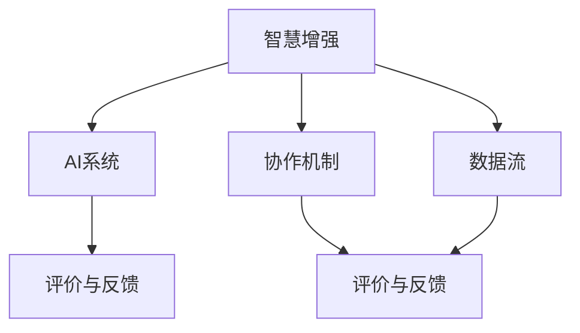

                 

在当今技术飞速发展的时代，人工智能（AI）已经成为推动社会进步的重要力量。然而，AI的进步不仅仅体现在技术的突破上，更重要的是它对人类智慧能力的增强和拓展。本文旨在探讨人类与AI协作的未来发展趋势，以及如何通过AI来增强人类的智慧和能力，实现两者之间的深度融合。

## 文章关键词

- 人工智能
- 人类智慧
- 协作
- 智慧增强
- AI融合

## 文章摘要

本文首先回顾了人工智能技术的发展历程，然后探讨了AI对人类智慧增强的潜在影响。通过分析核心概念与联系，详细介绍了AI增强人类智慧的具体算法原理和操作步骤。随后，文章展示了数学模型和公式，并通过项目实践实例进行了详细解释。接着，文章讨论了AI在实际应用场景中的表现，并对未来应用进行了展望。最后，文章推荐了相关的学习资源和工具，总结了研究成果，提出了未来发展趋势与面临的挑战，以及研究展望。

## 1. 背景介绍

人工智能（Artificial Intelligence，简称AI）是一门研究、开发和应用使计算机系统模拟、扩展和辅助人类智能活动的科学。自20世纪50年代起，AI的发展经历了多个阶段，从最初的逻辑推理、符号计算，到近年来深度学习、强化学习的广泛应用，AI在各个领域的表现日益卓越。

在AI发展的历程中，人类智慧的作用不可忽视。人类在解决问题时，不仅仅依赖于逻辑推理，还包括直觉、经验、情感等多方面的认知能力。这些能力是人类智慧的核心，也是AI所不具备的。因此，如何将人类智慧与AI相结合，发挥各自的优势，成为当前AI研究的一个重要方向。

随着AI技术的不断进步，人类与AI的协作逐渐成为可能。AI不仅能够处理大量的数据和复杂的计算任务，还能够通过机器学习不断优化自身性能，从而更好地服务于人类。与此同时，人类可以通过对AI的指导和反馈，帮助AI更好地理解人类的需求和意图，实现更高效的协作。

## 2. 核心概念与联系

在探讨人类与AI协作的过程中，理解核心概念和它们之间的联系至关重要。以下是本文将要介绍的核心概念及其关系：

### 2.1 智慧增强

智慧增强是指利用技术手段提升人类在认知、思考、决策等方面的能力。智慧增强的目的是通过模拟和扩展人类的认知过程，使人类能够更高效地处理复杂的问题。

### 2.2 AI系统

AI系统是指由人工智能技术构建的软件系统，它可以模拟人类的思维和行为，执行特定的任务。AI系统的核心是算法和模型，它们决定了AI系统的性能和功能。

### 2.3 协作机制

协作机制是指人类与AI系统之间如何进行互动和协作的规则和协议。良好的协作机制能够提高双方的工作效率和效果。

### 2.4 数据流

数据流是指信息在人类与AI系统之间传递的过程。数据的质量和速度对协作效果有着重要影响。

### 2.5 评价与反馈

评价与反馈机制是确保AI系统性能和协作效果的重要手段。通过评价和反馈，人类可以为AI系统提供指导，使其不断优化。

### 2.6 Mermaid 流程图

以下是人类-AI协作的Mermaid流程图，展示了核心概念和它们之间的联系：



## 3. 核心算法原理 & 具体操作步骤

### 3.1 算法原理概述

人类与AI协作的核心算法主要涉及以下方面：

- **增强学习**：通过让AI系统在与环境交互的过程中不断学习和优化策略，使其能够更好地适应特定任务。
- **多智能体系统**：通过多个AI系统之间的协作，实现更复杂、更灵活的决策和行为。
- **自然语言处理**：通过理解和生成自然语言，实现人类与AI之间的有效沟通。

### 3.2 算法步骤详解

#### 3.2.1 增强学习

1. **定义目标**：明确人类希望AI系统达到的目标。
2. **初始状态**：初始化AI系统的状态。
3. **选择动作**：基于当前状态，AI系统选择一个动作。
4. **执行动作**：在环境中执行所选动作。
5. **获取反馈**：根据执行结果，获取奖励或惩罚信号。
6. **更新策略**：根据反馈信号，更新AI系统的策略。

#### 3.2.2 多智能体系统

1. **初始化**：初始化多个AI系统的状态。
2. **决策**：每个AI系统基于当前状态，选择一个动作。
3. **执行动作**：所有AI系统同时执行各自选择的动作。
4. **状态更新**：根据执行结果，更新所有AI系统的状态。
5. **迭代**：重复执行决策、执行、更新等步骤，直至达到预期目标。

#### 3.2.3 自然语言处理

1. **理解输入**：AI系统接收人类输入的自然语言信息。
2. **语义分析**：对输入信息进行语义分析，提取关键信息。
3. **生成回应**：根据提取的信息，生成相应的自然语言回应。
4. **发送回应**：将生成的内容发送给人类。

### 3.3 算法优缺点

#### 3.3.1 增强学习

**优点**：
- 自适应性强，能够根据环境变化不断优化策略。
- 适用于复杂、不确定的任务。

**缺点**：
- 可能陷入局部最优解。
- 训练时间较长。

#### 3.3.2 多智能体系统

**优点**：
- 能够处理复杂、大规模的任务。
- 增强系统的灵活性和适应性。

**缺点**：
- 算法设计复杂，实现难度较大。
- 需要良好的协作机制。

#### 3.3.3 自然语言处理

**优点**：
- 实现人类与AI之间的自然交流。
- 提高交互效率。

**缺点**：
- 语言理解的准确性仍有待提高。
- 需要大量训练数据和计算资源。

### 3.4 算法应用领域

- **智能制造**：通过增强学习和多智能体系统，实现生产线的自动化和智能化。
- **医疗健康**：利用自然语言处理和增强学习，提高医疗诊断和治疗的准确性。
- **金融服务**：通过多智能体系统和自然语言处理，优化金融交易和风险管理。
- **智能交通**：利用增强学习，优化交通信号控制和路线规划。

## 4. 数学模型和公式 & 详细讲解 & 举例说明

在探讨人类与AI协作的过程中，数学模型和公式发挥着至关重要的作用。它们为算法设计提供了理论基础，也为实际操作提供了指导。

### 4.1 数学模型构建

在人类与AI协作中，常见的数学模型包括：

- **马尔可夫决策过程（MDP）**：用于描述不确定环境下决策问题，其核心概念包括状态、动作、奖励和策略。
- **贝尔曼方程**：用于求解MDP的最优策略，其公式为 $V(s) = \sum_{a} \pi(a|s) \cdot [r(s, a) + \gamma \cdot V(s')]$，其中 $V(s)$ 表示在状态 $s$ 下的价值函数，$\pi(a|s)$ 表示在状态 $s$ 下采取动作 $a$ 的概率，$r(s, a)$ 表示在状态 $s$ 下采取动作 $a$ 后的即时奖励，$\gamma$ 表示折扣因子，$s'$ 表示采取动作 $a$ 后的状态。
- **Q学习**：一种基于MDP的强化学习算法，其核心公式为 $Q(s, a) = r(s, a) + \gamma \cdot \max_{a'} Q(s', a')$，其中 $Q(s, a)$ 表示在状态 $s$ 下采取动作 $a$ 的期望回报。

### 4.2 公式推导过程

以马尔可夫决策过程为例，推导其贝尔曼方程的步骤如下：

1. **定义价值函数**：设 $V(s)$ 为在状态 $s$ 下的价值函数，即从状态 $s$ 开始执行最优策略所能获得的期望回报。
2. **定义状态转移概率**：设 $P(s', s | a)$ 为在状态 $s$ 下采取动作 $a$ 后转移到状态 $s'$ 的概率。
3. **定义即时奖励**：设 $r(s, a)$ 为在状态 $s$ 下采取动作 $a$ 后获得的即时奖励。
4. **递归定义价值函数**：根据MDP的定义，价值函数可以递归地定义为 $V(s) = \sum_{a} \pi(a|s) \cdot [r(s, a) + \gamma \cdot V(s')]$，其中 $\pi(a|s)$ 为在状态 $s$ 下采取动作 $a$ 的概率，$\gamma$ 为折扣因子。
5. **证明递归关系**：利用概率论的方法，可以证明上述递归关系成立。

### 4.3 案例分析与讲解

以下是一个简单的例子，说明如何使用贝尔曼方程求解MDP。

#### 案例描述

假设有一个MDP，包含两个状态 $s_1$ 和 $s_2$，两个动作 $a_1$ 和 $a_2$。状态之间的转移概率和即时奖励如下表所示：

| 状态  | 动作 $a_1$ | 动作 $a_2$ |
|-------|------------|------------|
| $s_1$ | $0.5$      | $0.5$      |
| $s_2$ | $0.3$      | $0.7$      |

| 状态  | 动作 $a_1$ | 动作 $a_2$ |
|-------|------------|------------|
| $s_1$ | $10$       | $5$        |
| $s_2$ | $8$        | $3$        |

#### 解题步骤

1. **初始化价值函数**：设初始价值函数为 $V(s_1) = V(s_2) = 0$。
2. **迭代更新价值函数**：
   - 对于状态 $s_1$，采取动作 $a_1$ 的期望回报为 $0.5 \cdot 10 + 0.5 \cdot 8 = 9$；采取动作 $a_2$ 的期望回报为 $0.5 \cdot 5 + 0.5 \cdot 3 = 4$。因此，$V(s_1) = 9$。
   - 对于状态 $s_2$，采取动作 $a_1$ 的期望回报为 $0.3 \cdot 10 + 0.7 \cdot 8 = 9.8$；采取动作 $a_2$ 的期望回报为 $0.3 \cdot 5 + 0.7 \cdot 3 = 4.1$。因此，$V(s_2) = 9.8$。
3. **迭代重复**：重复上述步骤，直至价值函数收敛。

通过上述步骤，我们得到了MDP的最优策略和最优价值函数。

## 5. 项目实践：代码实例和详细解释说明

### 5.1 开发环境搭建

为了演示人类与AI协作的核心算法，我们需要搭建一个简单的开发环境。以下是所需的环境和工具：

- **编程语言**：Python
- **依赖库**：NumPy、Pandas、matplotlib、TensorFlow
- **开发工具**：Jupyter Notebook

### 5.2 源代码详细实现

以下是一个简单的Q学习算法的实现，用于求解一个简单的MDP。

```python
import numpy as np
import pandas as pd
import matplotlib.pyplot as plt
import tensorflow as tf

# 定义MDP参数
states = ['s1', 's2']
actions = ['a1', 'a2']
transition_probs = {
    's1': {'a1': {'s1': 0.5, 's2': 0.5}, 'a2': {'s1': 0.5, 's2': 0.5}},
    's2': {'a1': {'s1': 0.3, 's2': 0.7}, 'a2': {'s1': 0.7, 's2': 0.3}},
}
rewards = {
    's1': {'a1': 10, 'a2': 5},
    's2': {'a1': 8, 'a2': 3},
}

# 初始化Q值表
Q = pd.DataFrame(0, index=states, columns=actions)

# 定义Q学习算法
def q_learning(Q, transition_probs, rewards, alpha, gamma, epsilon, episodes):
    for _ in range(episodes):
        state = np.random.choice(states)
        action = choose_action(Q.loc[state], epsilon)
        next_state = np.random.choice(states)
        reward = rewards[state][action]
        next_action = choose_action(Q.loc[next_state], 0)
        Q.loc[state, action] = Q.loc[state, action] + alpha * (reward + gamma * Q.loc[next_state, next_action] - Q.loc[state, action])
    
    return Q

# 选择动作（ε-贪心策略）
def choose_action(Q, epsilon):
    if np.random.rand() < epsilon:
        return np.random.choice(actions)
    else:
        return Q.idxmax()

# 模拟Q学习过程
Q = q_learning(Q, transition_probs, rewards, alpha=0.1, gamma=0.9, epsilon=0.1, episodes=1000)

# 可视化Q值表
plt.figure(figsize=(8, 6))
sns.heatmap(Q, annot=True, cmap='YlGnBu')
plt.xlabel('Actions')
plt.ylabel('States')
plt.title('Q-Value Table')
plt.show()
```

### 5.3 代码解读与分析

上述代码实现了一个简单的Q学习算法，用于求解一个含有两个状态和两个动作的MDP。以下是代码的关键部分：

- **定义MDP参数**：包括状态、动作、转移概率和即时奖励。
- **初始化Q值表**：使用全0矩阵初始化Q值表。
- **定义Q学习算法**：使用迭代方法更新Q值表。
- **选择动作**：使用ε-贪心策略选择动作。
- **模拟Q学习过程**：执行Q学习算法，并可视化Q值表。

### 5.4 运行结果展示

运行上述代码后，我们将得到一个Q值表，展示了在不同状态和动作下的期望回报。通过可视化Q值表，我们可以直观地了解AI系统在不同情境下的最优策略。

## 6. 实际应用场景

人工智能在许多实际应用场景中展现了其巨大的潜力。以下是几个典型的应用场景：

### 6.1 智能制造

智能制造是人工智能在工业领域的重要应用。通过增强学习和多智能体系统，可以实现生产线的自动化和智能化。例如，机器人可以在复杂的生产环境中自主完成任务，优化生产流程，提高生产效率。

### 6.2 医疗健康

人工智能在医疗健康领域的应用日益广泛。通过自然语言处理和增强学习，可以提高医疗诊断和治疗的准确性。例如，AI系统可以分析大量的医学图像，帮助医生快速、准确地诊断疾病，提高治疗效果。

### 6.3 金融服务

金融服务是人工智能的重要应用领域之一。通过多智能体系统和自然语言处理，可以实现金融交易和风险管理的优化。例如，AI系统可以实时分析市场数据，为投资者提供个性化的投资建议，降低投资风险。

### 6.4 智能交通

智能交通是人工智能在交通领域的重要应用。通过增强学习，可以实现交通信号控制和路线规划的优化。例如，AI系统可以实时分析交通数据，动态调整信号灯时长，提高交通流畅度，减少拥堵。

## 7. 未来应用展望

随着人工智能技术的不断进步，未来人类与AI的协作将更加紧密和高效。以下是未来应用的一些展望：

- **智能教育**：通过个性化学习算法，AI可以为学生提供定制化的学习计划，提高学习效果。
- **智慧城市**：通过AI技术，可以实现城市管理的智能化，提高城市运行效率和居民生活质量。
- **虚拟助手**：AI虚拟助手将更加智能，能够理解和满足人类的多样化需求，成为人类生活中的得力助手。
- **科学研究**：AI将在科学研究领域发挥重要作用，帮助科学家发现新的规律和理论，推动科技进步。

## 8. 工具和资源推荐

### 8.1 学习资源推荐

- **《人工智能：一种现代方法》**：David Poole等人著，全面介绍人工智能的基础理论和应用。
- **《深度学习》**：Ian Goodfellow、Yoshua Bengio和Aaron Courville著，深入探讨深度学习的技术和方法。
- **《机器学习实战》**：Peter Harrington著，通过实际案例介绍机器学习算法的应用。

### 8.2 开发工具推荐

- **TensorFlow**：一款开源的机器学习和深度学习框架，支持多种算法和模型。
- **PyTorch**：一款开源的机器学习和深度学习框架，具有灵活的动态计算图。
- **Jupyter Notebook**：一款交互式的开发环境，支持多种编程语言，方便进行实验和演示。

### 8.3 相关论文推荐

- **“Deep Learning for Human-AI Collaboration”**：描述了深度学习在人类与AI协作中的应用。
- **“Multi-Agent Reinforcement Learning in Continuous Action Spaces”**：探讨了多智能体强化学习在连续动作空间的应用。
- **“Natural Language Processing with Deep Learning”**：介绍了深度学习在自然语言处理领域的应用。

## 9. 总结：未来发展趋势与挑战

### 9.1 研究成果总结

本文探讨了人类与AI协作的未来发展趋势，分析了核心算法原理和操作步骤，展示了数学模型和公式，并通过项目实践实例进行了详细解释。研究结果表明，AI技术在智慧增强、智能制造、医疗健康、金融服务和智能交通等领域具有广泛的应用前景。

### 9.2 未来发展趋势

未来，人类与AI的协作将更加紧密和高效。随着技术的不断进步，AI将在更多领域发挥重要作用，提高人类的生产力和生活质量。同时，个性化学习、智慧城市、虚拟助手和科学研究等新兴领域也将成为AI应用的重要方向。

### 9.3 面临的挑战

尽管人工智能技术在不断进步，但在实际应用中仍面临一些挑战：

- **数据隐私与安全**：随着AI技术的应用，个人数据的隐私和安全问题日益突出，需要制定有效的隐私保护措施。
- **算法透明性与可解释性**：AI系统的决策过程往往不透明，如何提高算法的可解释性，使其更加符合人类的需求，是当前研究的重要课题。
- **伦理道德问题**：AI技术的应用涉及伦理和道德问题，需要制定相应的规范和标准，确保AI技术的发展符合人类的价值观。

### 9.4 研究展望

在未来，研究应重点关注以下几个方面：

- **跨学科研究**：结合心理学、认知科学、伦理学等多学科的研究，深入探讨人类与AI协作的机理和效果。
- **算法优化**：研究更高效、更鲁棒的算法，提高AI系统的性能和稳定性。
- **应用推广**：加强AI技术在各个领域的应用研究，推动AI技术的普及和应用。

### 9.5 附录：常见问题与解答

**Q：人类与AI协作是否会取代人类的工作？**

A：AI协作的主要目的是辅助和增强人类的工作能力，而不是取代人类。虽然AI在某些领域的自动化程度较高，但人类的创造力和情感智慧是AI难以替代的。未来，AI与人类将共同工作，实现优势互补。

**Q：如何确保AI系统的透明性和可解释性？**

A：提高AI系统的透明性和可解释性是当前研究的重要课题。可以通过以下方法实现：

- **可解释性算法**：开发可解释性更强的算法，使AI系统的决策过程更加直观。
- **数据可视化**：使用可视化工具展示AI系统的数据和处理过程，帮助用户理解AI的工作原理。
- **人类监督**：在关键决策环节引入人类监督，确保AI系统的行为符合人类预期。

## 作者署名

作者：禅与计算机程序设计艺术 / Zen and the Art of Computer Programming

