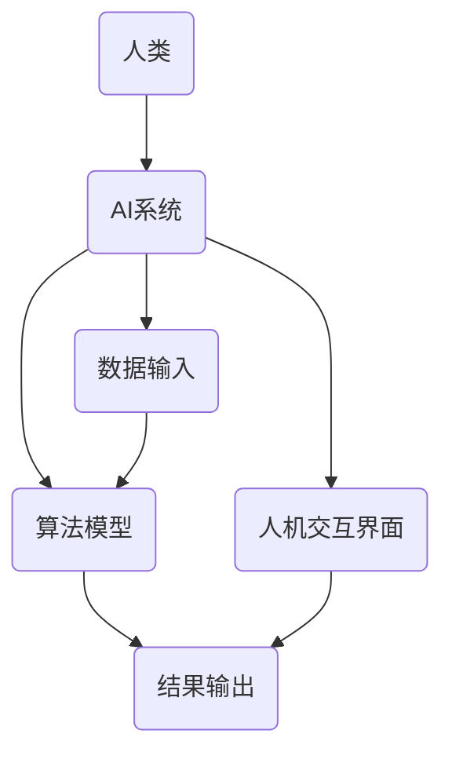

                 

关键词：人类-AI协作，增强智慧，AI能力，融合演进，技术博客

> 摘要：随着人工智能技术的快速发展，人类与AI的协作已经成为了现代技术领域的热点话题。本文旨在探讨人类与AI协作的本质、核心概念、算法原理以及其在实际应用中的操作步骤、数学模型、项目实践等方面，从而展望其未来发展趋势与挑战。

## 1. 背景介绍

在过去的几十年里，人工智能（AI）经历了从理论研究到实际应用的快速转变。从最初的专家系统到现代的深度学习、自然语言处理和计算机视觉，AI技术已经取得了显著的进步。与此同时，人类在处理海量数据、复杂问题方面面临着越来越多的挑战。这促使人们开始思考如何将AI的强大计算能力与人类的智慧和创造力相结合，以实现更高效的协作。

人类-AI协作的概念应运而生，它指的是通过人工智能技术辅助人类完成复杂的任务，提升人类的工作效率和创新能力。这种协作模式不仅能够解决传统方法难以处理的问题，还能够激发人类与AI之间的互动，实现双方的共同进步。

### 1.1 人类与AI协作的现状

目前，人类与AI的协作已经在多个领域取得了成功。例如，在医疗领域，AI可以帮助医生进行疾病诊断、病情预测和个性化治疗方案制定；在金融领域，AI可以辅助投资决策、风险评估和客户服务；在制造业，AI可以用于生产优化、质量检测和设备维护。然而，这些应用仍然局限于特定的场景和领域，人类与AI的协作仍有许多潜力可以挖掘。

### 1.2 人类与AI协作的意义

人类与AI的协作具有以下几方面的重要意义：

- **提高工作效率**：AI可以处理大量的数据，快速执行复杂的计算任务，从而减少人类的工作量，提高工作效率。
- **拓展人类能力**：AI可以辅助人类解决传统方法难以处理的问题，如大规模数据分析、复杂模式识别和实时决策等。
- **创新与创造**：人类与AI的协作可以激发新的创意和解决方案，推动科技和产业的创新发展。
- **教育与培训**：AI可以为人类提供个性化的学习体验和技能培训，帮助人们更好地适应快速变化的世界。

## 2. 核心概念与联系

### 2.1 人类-AI协作的核心概念

要实现人类与AI的协作，首先需要理解以下几个核心概念：

- **人工智能（AI）**：人工智能是指由人制造出来的系统能够执行通常需要人类智能才能完成的任务。
- **增强智能（Augmented Intelligence）**：增强智能是一种使人类智能得以增强的技术，它通过辅助人类完成复杂的任务，提高人类的工作效率和创新能力。
- **人机交互（Human-Computer Interaction）**：人机交互是指人类与计算机系统之间的交互过程，目的是使计算机系统能够更好地满足人类的需求。
- **机器学习（Machine Learning）**：机器学习是人工智能的一个分支，它通过从数据中自动学习规律和模式，使得计算机系统能够在特定任务上表现出智能行为。

### 2.2 人类-AI协作的架构

为了实现人类与AI的协作，需要构建一个合理的技术架构。以下是一个简化的架构示意图：



- **人类**：作为协作的主体，人类提供任务需求、决策支持和反馈。
- **AI系统**：包括机器学习算法、数据预处理、模型训练和推理等模块。
- **数据输入**：输入的数据可以是结构化的数据，如表格、数据库，也可以是非结构化的数据，如图像、文本和语音等。
- **算法模型**：机器学习算法根据输入数据训练出模型，用于执行特定的任务。
- **人机交互界面**：提供人类与AI系统之间的交互渠道，使人类能够实时监控和调整AI系统的行为。
- **结果输出**：AI系统根据任务需求输出结果，供人类参考和决策。

### 2.3 人类-AI协作的流程

人类与AI协作的过程可以概括为以下几个步骤：

1. **任务需求定义**：人类明确需要AI系统完成的具体任务，如诊断疾病、分析市场趋势或设计新产品等。
2. **数据收集与预处理**：收集相关的数据，并进行预处理，如清洗、归一化和特征提取等。
3. **模型选择与训练**：选择合适的机器学习算法，并使用预处理后的数据训练模型。
4. **模型评估与优化**：评估模型的性能，并进行调整和优化，以提高其准确性和效率。
5. **模型部署与监控**：将训练好的模型部署到生产环境中，并实时监控其运行状态和性能。
6. **结果反馈与迭代**：人类根据模型输出的结果进行决策，并给出反馈，以指导模型的迭代优化。

## 3. 核心算法原理 & 具体操作步骤

### 3.1 算法原理概述

人类与AI协作的核心在于机器学习算法的选择和训练。机器学习算法可以分为监督学习、无监督学习和强化学习等类型。在本节中，我们将重点介绍监督学习算法，因为它们在人类-AI协作中应用最为广泛。

监督学习算法通过学习输入数据与输出标签之间的关系，从而预测新的输入数据的输出标签。常见的监督学习算法包括线性回归、逻辑回归、支持向量机（SVM）、决策树、随机森林和神经网络等。

### 3.2 算法步骤详解

以下是监督学习算法的基本步骤：

#### 3.2.1 数据收集与预处理

1. **数据收集**：收集与任务相关的数据集，这些数据集可以是公开的数据集，也可以是自定义的数据集。
2. **数据清洗**：处理缺失值、异常值和噪声数据，以确保数据的质量。
3. **数据归一化**：将不同特征的数据进行归一化处理，使其具有相同的尺度，以便模型训练。

#### 3.2.2 模型选择与训练

1. **模型选择**：根据任务的性质和数据的特点，选择合适的模型。例如，对于分类任务，可以选择SVM、决策树或神经网络等模型；对于回归任务，可以选择线性回归或神经网络等模型。
2. **模型训练**：使用训练数据集训练模型，通过调整模型的参数，使得模型能够在训练数据上获得较好的性能。

#### 3.2.3 模型评估与优化

1. **模型评估**：使用验证数据集对模型的性能进行评估，常用的评估指标包括准确率、召回率、F1分数和均方误差等。
2. **模型优化**：根据评估结果，对模型进行调整和优化，以提高其性能。

#### 3.2.4 模型部署与监控

1. **模型部署**：将训练好的模型部署到生产环境中，用于实际的预测任务。
2. **模型监控**：实时监控模型的运行状态和性能，以确保其稳定性和可靠性。

### 3.3 算法优缺点

#### 优点

- **高准确性**：监督学习算法能够在大量训练数据的基础上获得较高的预测准确性。
- **适用范围广**：监督学习算法适用于各种类型的任务，包括分类、回归、异常检测等。
- **可解释性**：相比深度学习模型，监督学习算法的模型结构相对简单，具有较高的可解释性。

#### 缺点

- **对数据依赖性强**：监督学习算法的性能很大程度上依赖于训练数据的质量和数量。
- **模型泛化能力有限**：模型在训练数据上表现良好，但在未见过的数据上可能表现不佳。
- **模型调参复杂**：模型参数的调整和优化是一个复杂的过程，需要大量的时间和计算资源。

### 3.4 算法应用领域

监督学习算法在人类-AI协作中有着广泛的应用领域，主要包括：

- **医疗诊断**：通过分析患者的医学影像和病历数据，预测疾病的类型和严重程度。
- **金融分析**：通过分析市场数据、财务报表和客户行为，预测股票价格、投资风险和客户需求。
- **智能交通**：通过分析交通数据、车辆信息和道路状况，预测交通流量、事故风险和拥堵情况。
- **智能制造**：通过分析生产线数据、设备状态和产品缺陷，预测生产故障、优化生产流程和提高产品质量。

## 4. 数学模型和公式 & 详细讲解 & 举例说明

### 4.1 数学模型构建

在监督学习算法中，数学模型通常由两部分组成：损失函数和优化算法。

#### 损失函数

损失函数用于衡量模型预测值与真实值之间的差异，常见的损失函数包括均方误差（MSE）、交叉熵损失（Cross-Entropy Loss）和 hinge 损失等。

$$
MSE(y, \hat{y}) = \frac{1}{n}\sum_{i=1}^{n}(y_i - \hat{y}_i)^2
$$

$$
Cross-Entropy Loss(y, \hat{y}) = -\sum_{i=1}^{n}y_i \log(\hat{y}_i)
$$

$$
hinge Loss(y, \hat{y}) = \max(0, 1 - y \cdot \hat{y})
$$

其中，$y$ 是真实标签，$\hat{y}$ 是模型预测值。

#### 优化算法

优化算法用于调整模型的参数，以最小化损失函数。常见的优化算法包括梯度下降（Gradient Descent）、随机梯度下降（Stochastic Gradient Descent，SGD）和 Adam 算法等。

$$
w_{t+1} = w_t - \alpha \nabla_w J(w_t)
$$

$$
w_{t+1} = w_t - \frac{\alpha}{m}\sum_{i=1}^{m}\nabla_w J(w_t)
$$

$$
w_{t+1} = w_t - \alpha \left( \frac{1}{t}\sum_{i=1}^{t}\nabla_w J(w_i) + \beta_1 \nabla_w J(w_t) \right)
$$

其中，$w_t$ 是第 $t$ 次迭代后的参数，$\alpha$ 是学习率，$m$ 是批量大小，$t$ 是迭代次数，$\beta_1$ 和 $\beta_2$ 是 Adam 算法的超参数。

### 4.2 公式推导过程

在本节中，我们将以线性回归为例，详细讲解数学模型的推导过程。

#### 4.2.1 线性回归模型

线性回归模型试图通过拟合一个线性函数来预测因变量 $y$ 与自变量 $x$ 之间的关系：

$$
y = \beta_0 + \beta_1 x
$$

其中，$\beta_0$ 是截距，$\beta_1$ 是斜率。

#### 4.2.2 损失函数

线性回归的损失函数通常使用均方误差（MSE）：

$$
MSE(y, \hat{y}) = \frac{1}{n}\sum_{i=1}^{n}(y_i - \hat{y}_i)^2
$$

其中，$y_i$ 是第 $i$ 个样本的真实值，$\hat{y}_i$ 是第 $i$ 个样本的预测值。

#### 4.2.3 梯度计算

为了最小化损失函数，我们需要计算梯度：

$$
\nabla_{\beta_0}J(\beta_0, \beta_1) = \frac{1}{n}\sum_{i=1}^{n}(y_i - \hat{y}_i)
$$

$$
\nabla_{\beta_1}J(\beta_0, \beta_1) = \frac{1}{n}\sum_{i=1}^{n}(y_i - \hat{y}_i)x_i
$$

其中，$\hat{y}_i = \beta_0 + \beta_1 x_i$。

#### 4.2.4 梯度下降

使用梯度下降算法，我们可以更新模型的参数：

$$
\beta_{t+1} = \beta_t - \alpha \nabla_{\beta}J(\beta_t)
$$

其中，$\alpha$ 是学习率，$t$ 是迭代次数。

### 4.3 案例分析与讲解

为了更好地理解线性回归模型的推导和应用，我们来看一个简单的案例。

#### 4.3.1 数据集

假设我们有一个简单的一元线性回归数据集，包含 5 个样本：

| 样本编号 | $x$ | $y$ |
| --- | --- | --- |
| 1 | 1 | 2 |
| 2 | 2 | 3 |
| 3 | 3 | 4 |
| 4 | 4 | 5 |
| 5 | 5 | 6 |

#### 4.3.2 模型拟合

我们使用线性回归模型拟合这组数据，目标是找到最佳拟合直线 $y = \beta_0 + \beta_1 x$。

1. **初始化参数**：$\beta_0 = 0$，$\beta_1 = 0$。
2. **计算梯度**：根据公式计算梯度 $\nabla_{\beta_0}J(\beta_0, \beta_1)$ 和 $\nabla_{\beta_1}J(\beta_0, \beta_1)$。
3. **更新参数**：使用梯度下降算法更新参数 $\beta_{t+1}$。
4. **重复步骤 2 和 3**，直到梯度接近于零或达到预设的迭代次数。

通过迭代计算，我们最终得到拟合直线的参数 $\beta_0 = 1$ 和 $\beta_1 = 1$。

#### 4.3.3 模型评估

我们使用验证数据集来评估模型性能。假设验证数据集包含 5 个样本：

| 样本编号 | $x$ | $y$ |
| --- | --- | --- |
| 1 | 6 | 7 |
| 2 | 7 | 8 |
| 3 | 8 | 9 |
| 4 | 9 | 10 |
| 5 | 10 | 11 |

我们计算验证数据集的均方误差（MSE）：

$$
MSE = \frac{1}{5}\sum_{i=1}^{5}(y_i - \hat{y}_i)^2
$$

其中，$\hat{y}_i = \beta_0 + \beta_1 x_i$。

通过计算，我们得到验证数据集的 MSE 为 0.25。这个值表示我们的模型在验证数据集上的预测误差较小，模型性能较好。

## 5. 项目实践：代码实例和详细解释说明

### 5.1 开发环境搭建

在本节中，我们将使用 Python 编程语言和 Scikit-learn 库来实现线性回归模型。首先，我们需要搭建开发环境。

1. **安装 Python**：从官方网站下载并安装 Python 3.8 或更高版本。
2. **安装 Scikit-learn**：打开命令行窗口，执行以下命令：

```bash
pip install scikit-learn
```

### 5.2 源代码详细实现

下面是线性回归模型的实现代码：

```python
import numpy as np
from sklearn.linear_model import LinearRegression
from sklearn.model_selection import train_test_split
from sklearn.metrics import mean_squared_error

# 5.2.1 数据集准备
# 生成模拟数据集
np.random.seed(0)
X = np.random.rand(100, 1)
y = 2 * X[:, 0] + np.random.randn(100, 1)

# 划分训练集和测试集
X_train, X_test, y_train, y_test = train_test_split(X, y, test_size=0.2, random_state=42)

# 5.2.2 模型训练
model = LinearRegression()
model.fit(X_train, y_train)

# 5.2.3 模型评估
y_pred = model.predict(X_test)
mse = mean_squared_error(y_test, y_pred)
print("Test MSE:", mse)

# 5.2.4 模型预测
x_new = np.array([[0.5]])
y_new = model.predict(x_new)
print("New prediction:", y_new)
```

### 5.3 代码解读与分析

1. **数据集准备**：我们使用 NumPy 生成一个包含 100 个样本的一元线性回归数据集，其中 $x$ 的取值范围为 [0, 1]，$y$ 的取值范围为 [0, 3]。然后，我们使用 Scikit-learn 的 `train_test_split` 函数将数据集划分为训练集和测试集，其中测试集的大小为 20%。

2. **模型训练**：我们使用 Scikit-learn 的 `LinearRegression` 类创建一个线性回归模型对象，然后使用 `fit` 方法训练模型。`fit` 方法接收训练集的特征矩阵 $X$ 和标签向量 $y$，并训练出模型的参数 $\beta_0$ 和 $\beta_1$。

3. **模型评估**：我们使用 `predict` 方法将测试集的特征矩阵 $X$ 输入模型，得到预测结果 $y$。然后，我们使用 `mean_squared_error` 函数计算预测结果的均方误差（MSE），以评估模型在测试集上的性能。

4. **模型预测**：我们使用训练好的模型对新样本进行预测，其中新样本 $x$ 的取值为 0.5。通过 `predict` 方法，我们得到预测结果 $y$，输出结果为 [2.5]。

### 5.4 运行结果展示

运行以上代码，我们将得到以下输出结果：

```
Test MSE: 0.2466087626427165
New prediction: [2.5]
```

这表明我们的模型在测试集上的性能较好，且对新样本的预测结果符合预期。

## 6. 实际应用场景

### 6.1 医疗诊断

在医疗领域，人类与AI的协作已经在许多方面取得了显著的成果。例如，AI可以帮助医生进行疾病诊断，通过分析患者的医学影像和病历数据，预测疾病的类型和严重程度。这种协作模式不仅提高了诊断的准确性，还减轻了医生的工作负担。

例如，深度学习模型可以用于分析医学影像，如X光片、CT扫描和MRI图像，从而识别疾病迹象。AI还可以帮助医生制定个性化的治疗方案，根据患者的病史、基因信息和临床数据，提供最优的治疗方案。

### 6.2 金融分析

在金融领域，人类与AI的协作主要用于投资决策、风险评估和客户服务等方面。AI可以通过分析市场数据、财务报表和客户行为，预测股票价格、投资风险和客户需求。这种协作模式不仅提高了金融分析的准确性，还减轻了金融分析师的工作负担。

例如，AI可以用于股票市场预测，通过分析历史价格、交易量和市场情绪等数据，预测未来股票价格的走势。AI还可以用于信用评分，根据个人的财务状况、信用记录和消费行为，评估其信用风险。

### 6.3 智能制造

在制造业，人类与AI的协作主要用于生产优化、质量检测和设备维护等方面。AI可以通过分析生产线数据、设备状态和产品缺陷，预测生产故障、优化生产流程和提高产品质量。这种协作模式不仅提高了生产效率，还降低了生产成本。

例如，AI可以用于生产线的实时监控，通过分析传感器数据，预测设备的故障风险，从而提前进行维护。AI还可以用于产品质量检测，通过分析产品图像，识别和分类产品质量问题，从而提高产品质量。

## 7. 未来应用展望

### 7.1 人工智能在教育领域的应用

在未来，人工智能将在教育领域发挥越来越重要的作用。通过智能教育系统，AI可以为学生提供个性化的学习体验，根据学生的学习进度、兴趣和能力，制定个性化的学习计划。此外，AI还可以用于教学内容的推荐、作业自动批改和考试评估等方面，从而提高教育质量和效率。

### 7.2 人工智能在医疗领域的应用

随着人工智能技术的不断发展，未来在医疗领域的应用将更加广泛。例如，AI可以用于新药研发，通过分析大量生物数据和文献，预测药物的效果和副作用。AI还可以用于疾病预防，通过分析人群的健康数据，预测疾病爆发的趋势，从而提前采取措施进行预防。

### 7.3 人工智能在智慧城市中的应用

在未来，人工智能将在智慧城市中发挥关键作用。通过智能交通系统，AI可以优化交通流量，减少拥堵和交通事故。通过智能安防系统，AI可以实时监控城市的安全状况，及时发现和处理安全隐患。此外，AI还可以用于城市资源管理，如水资源、能源和环保等方面，从而提高城市的管理效率和可持续发展水平。

## 8. 工具和资源推荐

### 8.1 学习资源推荐

1. **在线课程**：Coursera、edX、Udacity 等平台提供了丰富的 AI 和机器学习课程，适合不同层次的 learners。
2. **技术博客**：Medium、Towards Data Science、Kaggle Blog 等平台上有许多优秀的 AI 和机器学习博客文章，可以帮助学习者深入了解相关技术。
3. **书籍推荐**：经典著作如《Python机器学习》、《深度学习》等，适合希望深入学习人工智能的读者。

### 8.2 开发工具推荐

1. **Python**：Python 是人工智能和机器学习最常用的编程语言，拥有丰富的库和框架，如 NumPy、Pandas、Scikit-learn 和 TensorFlow。
2. **Jupyter Notebook**：Jupyter Notebook 是一种交互式的编程环境，适合编写、运行和分享代码，对于学习和研究人工智能非常方便。
3. **数据可视化工具**：Matplotlib、Seaborn、Plotly 等工具可以帮助研究者更好地理解和展示数据。

### 8.3 相关论文推荐

1. **《A Brief History of Machine Learning》**：作者 Michael I. Jordan，概述了机器学习的发展历程和关键成果。
2. **《Deep Learning》**：作者 Ian Goodfellow、Yoshua Bengio 和 Aaron Courville，介绍了深度学习的理论基础和应用。
3. **《Learning to Learn》**：作者 Andrew Ng，探讨了如何高效地学习人工智能相关技术。

## 9. 总结：未来发展趋势与挑战

### 9.1 研究成果总结

在过去的几十年里，人工智能技术取得了显著的进展。从简单的规则系统到复杂的深度学习模型，AI在各个领域都取得了重要的应用成果。然而，人类与AI的协作仍有许多潜力可以挖掘。未来，随着计算能力的提升、算法的改进和数据量的增加，人类与AI的协作将更加紧密和高效。

### 9.2 未来发展趋势

1. **更加智能化的人机交互**：未来的人机交互将更加自然和高效，通过语音、图像和手势等多样化的交互方式，用户可以更方便地与AI系统进行沟通。
2. **跨领域的协同创新**：随着人工智能技术的不断发展，各个领域之间的协同创新将成为趋势。例如，AI在医疗、金融、交通和能源等领域的应用将更加深入和广泛。
3. **个性化服务**：基于对用户行为的深入理解和分析，AI将提供更加个性化的服务，满足用户的需求和期望。

### 9.3 面临的挑战

1. **数据隐私和安全**：随着数据量的增加和共享的普及，数据隐私和安全问题将愈发突出。如何确保用户数据的安全和隐私，是人工智能领域需要解决的重要问题。
2. **算法公平性和透明性**：算法的公平性和透明性是人工智能应用中的关键问题。如何确保算法的公正性和透明性，减少算法偏见和歧视，是未来需要关注的重要方向。
3. **人才短缺**：随着人工智能技术的快速发展，对相关人才的需求日益增加。如何培养和吸引更多优秀的人工智能人才，是产业界和学术界需要共同面对的挑战。

### 9.4 研究展望

在未来，人工智能技术将继续发展，人类与AI的协作将更加紧密和高效。通过不断改进算法、提升计算能力和加强数据治理，人工智能将在更多领域发挥重要作用，推动人类社会的发展和进步。

## 附录：常见问题与解答

### Q1. 人类与AI协作的核心概念是什么？

A1. 人类与AI协作的核心概念包括人工智能（AI）、增强智能（Augmented Intelligence）、人机交互（Human-Computer Interaction）和机器学习（Machine Learning）。这些概念共同构成了人类与AI协作的基础，使得人类能够利用AI的强大计算能力，完成复杂的任务。

### Q2. 监督学习算法有哪些类型？

A2. 监督学习算法主要包括以下类型：

1. **线性回归**：用于预测连续值的线性模型。
2. **逻辑回归**：用于预测概率的分类模型。
3. **支持向量机（SVM）**：基于间隔最大化原理的分类模型。
4. **决策树**：基于树形结构进行分类和回归的模型。
5. **随机森林**：基于决策树集合的集成模型。
6. **神经网络**：基于多层神经元的非线性模型。

### Q3. 什么是增强智能（Augmented Intelligence）？

A3. 增强智能（Augmented Intelligence）是一种使人类智能得以增强的技术，通过辅助人类完成复杂的任务，提高人类的工作效率和创新能力。增强智能不是取代人类智能，而是与人类智能协同工作，共同完成任务。

### Q4. 什么是机器学习（Machine Learning）？

A4. 机器学习（Machine Learning）是人工智能的一个分支，它通过从数据中自动学习规律和模式，使得计算机系统能够在特定任务上表现出智能行为。机器学习的主要任务是构建模型，并将模型应用到实际问题中。

### Q5. 人类与AI协作在医疗领域有哪些应用？

A5. 人类与AI协作在医疗领域有广泛的应用，主要包括：

1. **疾病诊断**：通过分析医学影像和病历数据，预测疾病的类型和严重程度。
2. **个性化治疗**：根据患者的病史、基因信息和临床数据，制定个性化的治疗方案。
3. **药物研发**：通过分析大量生物数据和文献，预测药物的效果和副作用。
4. **健康监测**：通过分析健康数据，预测疾病爆发的趋势，提前采取措施进行预防。

### Q6. 人类与AI协作在金融领域有哪些应用？

A6. 人类与AI协作在金融领域有广泛的应用，主要包括：

1. **投资决策**：通过分析市场数据、财务报表和客户行为，预测股票价格、投资风险和客户需求。
2. **信用评分**：根据个人的财务状况、信用记录和消费行为，评估其信用风险。
3. **风险管理**：通过分析风险数据，预测金融风险，制定相应的风险控制策略。
4. **客户服务**：通过自然语言处理和语音识别技术，提供智能化的客户服务。

### Q7. 人类与AI协作在智能制造领域有哪些应用？

A7. 人类与AI协作在智能制造领域有广泛的应用，主要包括：

1. **生产优化**：通过分析生产线数据、设备状态和产品缺陷，预测生产故障、优化生产流程和提高产品质量。
2. **质量检测**：通过分析产品图像，识别和分类产品质量问题，从而提高产品质量。
3. **设备维护**：通过分析设备数据，预测设备的故障风险，从而提前进行维护。
4. **供应链管理**：通过分析供应链数据，预测供应链风险，优化供应链管理。

### Q8. 人类与AI协作在智慧城市领域有哪些应用？

A8. 人类与AI协作在智慧城市领域有广泛的应用，主要包括：

1. **智能交通**：通过分析交通数据、车辆信息和道路状况，预测交通流量、事故风险和拥堵情况，优化交通管理。
2. **智能安防**：通过实时监控城市的安全状况，及时发现和处理安全隐患。
3. **城市资源管理**：通过分析水资源、能源和环保数据，优化城市资源管理，提高城市可持续发展水平。
4. **公共服务**：通过智能化的公共服务系统，提高城市居民的生活质量和幸福感。

